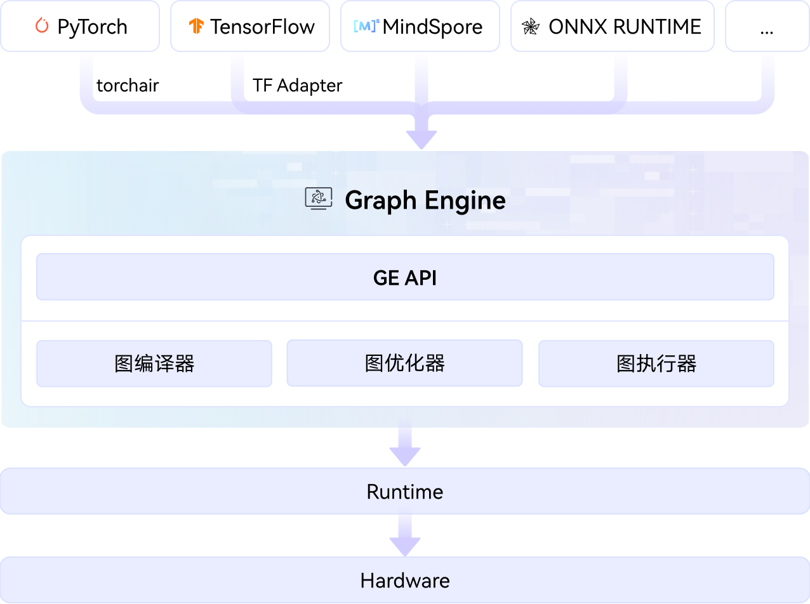

# GE

## 🔥 Latest News

- [2025/12/26] GE 项目首次上线。

## 🚀 概述

GE（Graph Engine）是面向昇腾的图编译器和执行器，提供了计算图优化、多流并行、内存复用和模型下沉等技术手段，加速模型执行效率，减少模型内存占用。
GE 提供对 PyTorch、TensorFlow 前端的友好接入能力，并同时支持 onnx、pb 等主流模型格式的解析与编译。详见[昇腾社区文档-图模式开发指南](https://hiascend.com/document/redirect/CannCommunityGraphguide)。

## ⚡️ 快速入门

若希望快速体验 GE 的工作方式及基本开发流程，可参考以下文档：

-   [构建验证](docs/build.md)：介绍组件的完整构建、测试样例运行流程。
-   [快速开始](examples/acl/1_sample_resnet50_imagenet_classification/README.md)：以 ResNet50 模型为例，介绍如何使用 ATC 工具进行模型转换，并在昇腾 AI 处理器上执行推理。

## 📚 文档

如需了解如何使用 GE 进行模型编译与执行，可参见图模式开发指南、技术文章等内容：  [GE 参考资料](docs/README.md)

如果希望深入了解 GE 的内部设计、架构机制与开发流程，可参考以下文档：

* [GE 架构说明文档](docs/architecture.md)：介绍核心组件、执行流程、优化机制等内部原理。
* [贡献指南](CONTRIBUTING.md)：说明如何提交 Issue、Pull Request 以及代码规范。

## 🌐 生态集成

以下项目已集成 GE 作为推理或图模式后端：

- **TorchAir**：将 GE 接入 PyTorch 图模式。[链接](https://gitcode.com/Ascend/torchair)
- **TFA（TensorFlow Adapter）**：将 GE 作为 TensorFlow 后端（开源筹备中）
- **JittorInfer**：基于昇腾芯片的大模型 C++ 推理框架。[链接](https://github.com/Jittor/JittorInfer)
- **Triton GE Backend**：GE 的 Triton Inference Server 后端。[链接](https://gitcode.com/cann/triton-inference-server-ge-backend)

**说明：** 上述列表为已知并对外公开的集成案例，**并非完整清单**。 若您正在使用 GE，欢迎通过 Issue 或 PR 补充，我们将持续更新相关信息。

## 📝 其他信息

-   [安全声明](SECURITY.md)
-   [许可证](LICENSE)

