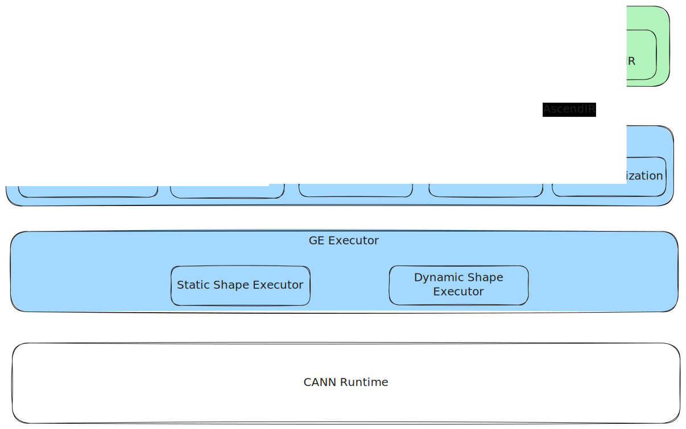

# GE 架构介绍

## 系统架构总览

GE（Graph Engine）是 CANN 生态中面向昇腾系列芯片的高性能图模式实现，由前端适配层、离线编译工具链、图编译器和图执行器等组件共同构成。
 整个系统形成了从前端框架或模型文件，到 AscendIR，再到编译产物 model/OM，最终在设备上执行的一条完整链路。

GE 的逻辑结构如下所示：



### 前端框架适配层

前端框架适配层负责将 GE 作为主流深度学习框架的 **后端（backend）** 使用。 用户在 PyTorch、TensorFlow 等框架中编写和执行模型时，适配层会在框架内部完成 IR 转换、调用 GE 。这一模式下，GE 被框架直接驱动、无需独立调用，称为 **在线场景**。

目前 CANN 提供了官方的 PyTorch 和 TensorFlow 适配组件：

- **TorchAir**：将 PyTorch 的 AtenIR 转换为 AscendIR
- **TF Adapter**：将 TensorFlow 的 GraphDef 转换为 AscendIR

适配层通常与各自框架同步演进，并以独立仓维护，通过公开的接口与 GE 集成。确保适配层可独立演进，并保持 GE 输入边界稳定。

### atc (Ascend Tensor Compiler)

**atc** 是 GE 的独立编译工具链，用于 **离线场景** 下的模型编译。
在离线场景中，GE 并不作为前端框架的后端参与执行流程，而是直接对 **模型文件** 进行编译：用户提供已导出的模型（如 onnx、pb 等），atc 将其转换为 AscendIR 并调用 GE Compiler 生成 OM 文件。

离线场景的特点是：

- **无需昇腾设备**（纯靠 host 侧即可完成编译）
- **无需前端框架运行时**（不依赖 PyTorch/TF 图执行）
- **产物可独立部署**（OM 文件可在设备上直接加载执行）

atc 支持多种前端框架导出的模型格式，例如 TensorFlow 导出的 `.pb`，PyTorch 导出的 `.onnx` 。

### **GE Compiler（图编译器）**

GE Compiler 是 GE 的核心组件，负责将 AscendIR 编译为可在昇腾设备上执行的二进制模型（model/OM）。其主要工作依次包括：

- **图级优化（Graph Optimization）**：在 AscendIR 层面进行通用编译器优化、算子融合等处理
- **算子编译**：结合图上推导得到的 shape 信息，对算子进行在线编译，以获得更优的执行性能
- **流分配（Stream Planning）**：识别图中的可并行关系，将可并发的算子分配到不同流上，提升执行效率
- **内存分配（Memory Planning）**：在静态 shape 图中，以整图视角规划和复用张量内存，以获得更好的内存复用率、更小的峰值内存占用
- **模型序列化（Model Serialization）**：将编译好的 model 序列化为 OM 文件（离线场景使用）

### **GE Executor（图执行器）**

GE Executor 负责模型在昇腾设备上的执行控制，包括：

- **模型加载（Model Loading）**：将模型执行所需的资源加载至昇腾设备，例如算子二进制（bin）与权重等。对于下沉模型，会将模型的完整执行序列预先加载到设备侧，使得执行时无需逐算子启动，只需触发一次模型执行，模型内部的调度由硬件负责完成。
- **模型执行（Model Execution）**：按照模型的语义执行，GE Executor 提供了执行需要的控制逻辑，如必要的分支跳转、流同步等。

> **术语说明：**在 GE 的概念中，AscendIR 的编译产物是“模型（Model）”，因此严格意义上应称为“模型执行”。但在实际交流中，“图执行”作为语义等价表述也同样常用。

## AscendIR & Graph

AscendIR 是 GE 编译流程使用的核心 IR（Intermediate Representation），采用静态计算图的方式表达模型的计算逻辑与数据依赖结构。AscendIR 也被简称为”AIR“，TorchAir 中的 "Air" 取自于此。AscendIR 在抽象层级上与 ONNX、AtenIR、StableHLO 等同属高层图表示（HLO 级别），以算子和张量为基本构成单元，用于描述模型的运算语义与图结构。

在 GE 的架构中，AscendIR 具有以下定位与特征：

### 统一编译入口

无论来自前端框架（通过 Adapter）还是来自模型文件（通过 atc），所有输入都会被转换为 AscendIR，再进入 GE Compiler。AscendIR 因此构成了 GE Compiler 的统一编译入口。

### 静态计算图结构

AscendIR 表示的是静态图，其图结构在编译期固定，不会在执行过程中动态改变。静态图的设计使 GE 能以整图视角进行图级优化、内存规划与调度下沉等优化，从而获得更好的编译与执行效率。

> **需区分“静态图”与“静态 Shape 图”概念。**
>
> - **静态 Shape 图**：多次执行中所有 Tensor 的 shape 均固定。
> - **动态 Shape 图**：在不同执行中，Tensor 的 shape 可能发生变化。
>
> AscendIR 能表达静态与动态 Shape 图，GE 也支持二者的编译与执行。
> 由于 GE 不支持动态图（即图结构随运行动态变化），在交流中“静态图 / 动态图”常作为“静态 Shape 图 / 动态 Shape 图”的简称。

### 核心图元素

AscendIR 图是一张有向无环图（DAG），主要由以下元素构成：

- **Graph（图）**：承载节点、边、输入输出描述等，是编译的基本处理单元。
- **Node（节点）**：表示算子级计算单元，包含算子类型、输入输出 Tensor 的引用及属性（Attribute）。
- **Tensor（张量）**：算子的输入输出数据实体，包括 shape、dtype、format 等元信息。
- **Attribute（属性）**：构图时确定的算子附加信息，如模式、配置或固定参数。
- **Data Edge（数据边）**：表示 Tensor 的生产者与消费者关系，方向由 src 节点指向 dst 节点。
- **Control Edge（控制边）**：表示纯依赖关系，无数据传递；用于显式约束执行顺序，保证 src 节点先于 dst 节点执行。

> **实现说明：**
> 在 GE 的实际实现中，图中并不存在独立的 Edge 对象，而是通过“锚点（Anchor）”来描述连边关系。
>
> - **DataAnchor** 用于表示数据边（数据流向）
> - **CtrlAnchor** 用于表示控制边（仅控制执行顺序）
>
> 每个锚点维护其对端锚点，从而表达节点间的连接关系。

### 算子定义体系

在 GE 的整体架构中，AscendIR 的基础结构（包括 Graph、Node、Tensor、Attribute 等）由 GE 仓维护；然而，**具体的算子定义并不位于 GE 仓，而由独立的算子仓（如  ops-math、ops-transformer  等）进行维护**。这种设计使算子实现可在“入图（Graph）”和“aclnn（原生 API 调用）”两类场景中保持统一。

#### 算子定义不在 GE 仓的原因

GE 是一个图编译器与执行器，其职责主要是：

- 图级优化
- 完成调度、内存规划
- 生成和序列化可执行的模型（model/OM）

GE **不定义每个算子的语义与实现**，因此将算子独立出去可以更好地实现解耦。自定义算子与内置算子均外置于 GE，通过统一接口接入。

#### 算子仓的角色

算子仓（如 *ops-math*、*ops-transformer* 等）承担以下职责：

- 给出 **算子定义**，包含**算子类型 、输入、输出、属性**
- 实现算子，包含 **Shape 推倒规则、合法性检查、Kernel** 等
- 同时用于两大场景：
  - **aclnn**：算子原生 API 的实现与调用
  - **入图**：GE 在构图、编译时引用相同的算子

算子仓为 CANN 生态提供归一的算子源，GE 与 aclnn 共享相同算子定义和实现，实现算子语义、精度的一致性。

#### GE 与算子仓的协作关系

- 图编译时，GE 根据算子仓提供的算子定义检查 Ascend 图的合法性。
- 图编译时，GE 依赖算子实现（如 shape 推导、编译）完成部分优化。
- 算子仓独立于 GE 发布升级，使得算子体系可独立演进，而 GE 只需保持对算子规范的兼容。

这种分层结构使 GE 保持“图编译器”的职责清晰，同时确保算子体系在全栈中统一。

## 编译优化

GE Compiler 以 AscendIR 为输入，通过多阶段的编译与优化流程生成可在昇腾设备上高效执行的模型（model/OM）。这些优化覆盖图级、算子级、调度、内存等多个维度，目标是保持语义正确的前提下，获得更好的执行性能和更小的资源占用。

GE 中较为重要的优化包括以下几类：

### 图级优化

图级优化对整个计算图进行结构化变换，以提升执行效率、降低冗余计算或减少无效操作。总体上可分为两大类：**通用编译器优化**与**融合类优化**。

#### **通用图结构优化**

这些优化属于通用编译器常见的图变换技术，例如：

- **公共子表达式消除（CSE）**
   对图中重复出现的等价计算仅保留一次，减少重复计算。
- **常量折叠（Constant Folding）**
   在编译期提前求值恒定表达式，消除运行时不必要的计算成本。
- **死代码消除（Dead Code Elimination）**
   删除对最终输出无影响的节点与边，使图结构更紧凑、执行更高效。

#### **融合类优化**

融合优化通过将多个算子合并执行，减少 kernel 调度次数、降低中间张量读写、并在某些场景下减少实际计算量。融合优化在 GE 中主要分为两类：

1. **基于 Pattern 的手写融合（Pattern-Based Fusion）**

   通过手写 pattern 规则进行匹配与融合。该方式融合的优势是可控、可预测，适合针对典型模型结构做高质量特殊化处理。

2. **基于算子分类的自动融合（Autofusion）**

   基于算子的计算公式、输入输出依赖关系和算子分类自动分析融合机会，再通过 codegen 技术生成融合算子的计算代码，并执行在线编译生成 kernel。
   该方式无需手写 Pattern，可以在更大算子空间中探索潜在的融合组合。

### 算子级优化

GE 会利用图上张量的 shape、dtype 等信息对算子进行深度优化，包括：

- **算子在线编译**
   针对算子输入 shape 定制化编译，大幅提升算子执行性能。

算子级优化的目标是在不改变图结构的前提下，提高单算子的执行效率。

### 调度优化

调度优化旨在生成高效的执行顺序与执行计划，减少图执行过程中的调度开销、提高并行度，并最大化利用硬件流水能力。GE 中主要包含以下几类调度相关优化：

- **下沉调度（Sink）**

  将图的算子序列化为设备端可直接调度的完整执行序列。在这种模式下，执行时仅需触发一次 launch，模型内部的算子调度由设备端自动完成，可显著减少主机侧下发开销，对 Host-bound 模型收益显著。

- **权重合并（Weight Merging）**

  将分散的权重数据合并为连续的内存区域，使得加载阶段更高效。

- **流分配**
  分析图中的并发机会，将可并发执行的算子分配到不同的 stream 上，以提升整体流水并行度。合理的流分配可以显著降低关键路径长度，提升吞吐。

- **SuperKernel（实验特性）**

  利用在线编译能力，将同一 stream 上顺序执行的一组 kernel 自动合并为一个大型 kernel，以减少 kernel 间的调度与切换开销。这种方式适用于算子粒度较细、原本 kernel 较多且调度成本显著的场景。

## 插件和扩展机制

GE 支持通过插件方式扩展编译能力，包括 **AscendC 自定义算子** 以及 **自定义 Pass**。开发者可在不修改 GE 主体代码的情况下，为特定业务场景增加新算子或新优化规则。

可参考以下资料获取详细开发指南：

* AscendC 自定义算子入图：[资料官网 ](https://www.hiascend.com/zh/document)搜索”算子入图（GE）开发“
* 自定义 pass 开发：[融合Pass开发指南](../examples/fusion_pass/融合Pass开发指南.md)

## 项目结构

```shell
├── api                               # api接口实现
├── base                              # 基础的工具方法、模块定义
├── cmake                             # cmake公共脚本
├── compiler                          # GE Compiler 图编译模块
├── dflow                             # DataFlow执行器，提供异构模型描述和串接执行能力，未来将与 GE 解耦，独立仓运作
├── docs                              # 关联文档目录
├── examples                          # 使用样例目录
├── graph_metadef                     # 图相关数据结构定义
├── inc                               # 头文件
├── parser                            # 业界前端框架IR转AscendIR实现，当前支持tensorflow/onnx/caffe/mindspore
├── runtime                           # GE Executor 图执行模块
├── scripts                           # 打包脚本文件目录
├── tests                             # 开发者测试目录
```

