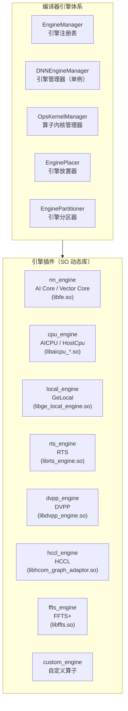
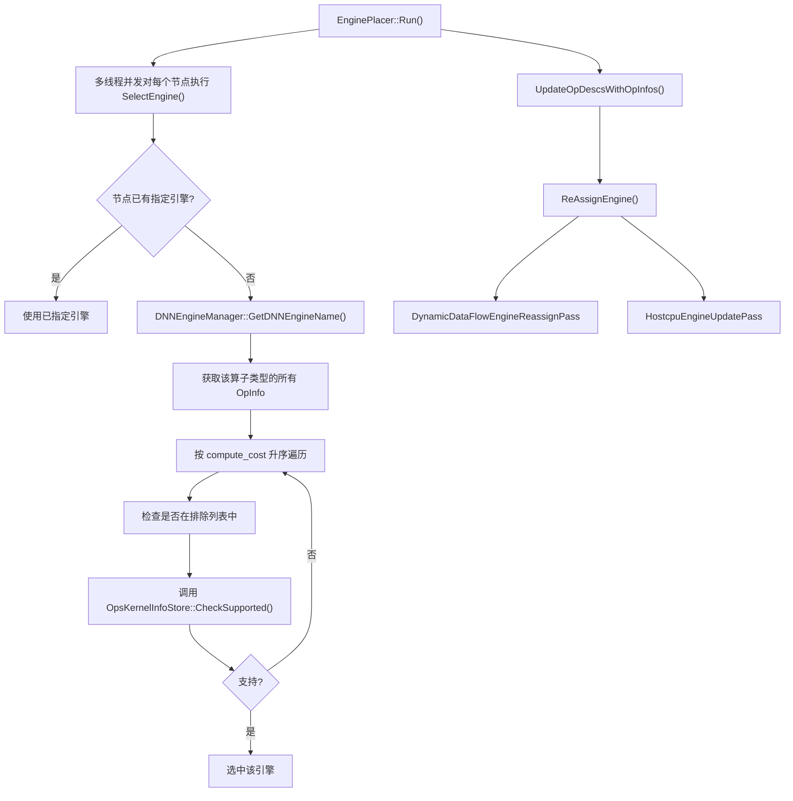
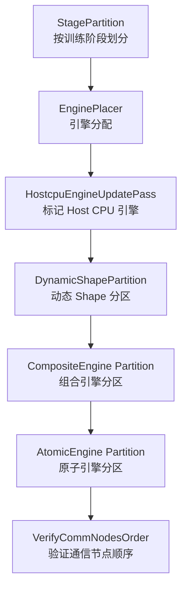
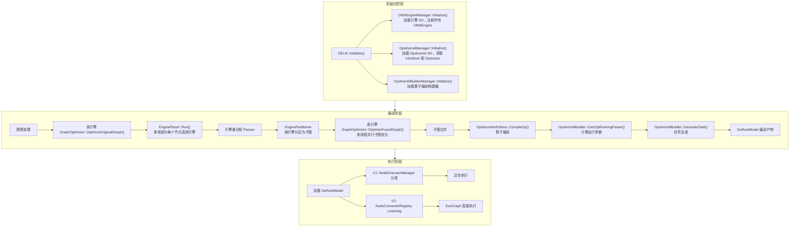

# Engine 特性分析

## 1 特性背景

### 1.1 问题域

昇腾 AI 处理器是一种异构计算架构，其芯片内部集成了多种不同类型的计算单元——AI Core 负责密集矩阵运算（如卷积、MatMul），Vector Core 负责向量运算（如 ElementWise），AI CPU 负责不适合硬件加速的通用计算，DVPP 负责图像视频预处理，HCCL 负责多卡分布式通信。不同类型的算子需要由不同的计算单元执行，而一个完整的神经网络模型通常包含多种类型的算子。

GE（Graph Engine）作为昇腾的图编译器和执行器，需要解决的核心问题就是：**如何将一个包含异构算子的计算图，正确且高效地映射到芯片上多种不同的执行单元上**。这就是 Engine（引擎）特性存在的意义。

### 1.2 引擎总览

| 引擎 | 注册名 | 典型算子 | 引擎目录 |
|------|--------|---------|---------|
| AI Core 融合引擎 | `AIcoreEngine` | Conv2D、MatMul、BiasAdd、ReLU、BatchNorm | `compiler/engines/nn_engine/` |
| Vector Core 引擎 | `VectorEngine` | ElementWise、Sqrt、Exp、Log、Cast | `compiler/engines/nn_engine/` |
| FFTS+ 组合引擎 | `ffts_plus` | 跨引擎融合算子、AIC+AIV 混合任务 | `compiler/engines/ffts_engine/` |
| AI CPU Ascend 引擎 | `aicpu_ascend_kernel` | SparseToDense、Minimum、Maximum、Round | `compiler/engines/cpu_engine/aicpu_engine/` |
| AI CPU TF 引擎 | `aicpu_tf_kernel` | TensorFlow 格式的 AI CPU 算子 | `compiler/engines/cpu_engine/tf_engine/` |
| Host CPU 引擎 | `DNN_VM_HOST_CPU_OP_STORE` | 常量折叠算子、不支持昇腾设备的回退算子 | `compiler/engines/cpu_engine/hostcpu_engine/`、`base/host_cpu_engine/` |
| HCCL 通信引擎 | `ops_kernel_info_hccl` | AllReduce、Broadcast、AllGather、ReduceScatter | `compiler/engines/hccl_engine/` |
| DVPP 预处理引擎 | `dvpp_ops_kernel` | ImageDecode、Resize、Crop、ColorConvert | `compiler/engines/dvpp_engine/` |
| RTS 运行时服务引擎 | `DNN_VM_RTS_OP_STORE` | StreamSwitch、StreamActive、LabelGoto、LabelSet | `compiler/engines/rts_engine/` |
| GE Local 引擎 | `DNN_VM_GE_LOCAL_OP_STORE` | NetOutput、NoOp、Const、PhonyConcat、PhonySplit | `compiler/engines/local_engine/` |
| 自定义算子引擎 | `DNN_VM_CUSTOM` | 用户自定义 Ascend C 算子 | `compiler/engines/custom_engine/` |
| DSA 引擎 | `DSAEngine` | DSA 专用算子 | `compiler/engines/nn_engine/`（DSA 子模块） |

- 注：“AI Core 融合引擎” 和 “Vector Core 引擎”统一称为FE（Fusion Engine, 融合引擎）

### 1.3 设计哲学

Engine 特性遵循三个核心设计原则：

- **插件化**：每种引擎编译为独立的动态库（`.so`），通过统一的 C 函数接口与 GE 框架交互。引擎可以独立开发、独立编译、独立部署，GE 框架无需感知引擎内部实现。
- **优先级驱动自动选择**：系统通过代价模型（Cost Model）为每个算子自动选择最优引擎，用户无需手动指定。代价越低（`COST_0` 到 `COST_10`）的引擎越优先被选择，优先选择意味着更高性能的执行路径。
- **编译期决策 + 运行期执行**：引擎选择和图分区在编译期完成，运行期直接按编译产物的执行计划驱动。这避免了运行时的引擎分发开销。

---

## 2 用户使用场景

### 2.1 场景一：模型训练（默认引擎选择）

用户使用 PyTorch 或 TensorFlow 训练模型时，GE 自动将模型中的计算算子分配到 AI Core 引擎，通信算子分配到 HCCL 引擎，控制流算子分配到 RTS 引擎。用户无需感知引擎存在。

典型流程：
1. 用户调用 `Session::AddGraph` 添加计算图
2. GE 编译器通过 `EnginePlacer` 自动为每个算子选择引擎
3. `EnginePartitioner` 按引擎分区为子图
4. 各引擎对分配给自己的子图做引擎特定的优化（如 FE 融合引擎做算子融合）
5. 编译产物加载到设备上执行

### 2.2 场景二：引擎配置与排除

用户可以通过配置选项干预引擎选择行为：

- `ge.engineType`（即 `CORE_TYPE`）：设置核心计算引擎为 `AIcoreEngine`（默认）或 `VectorEngine`。两者互斥——选择 VectorCore 时自动排除 AI Core 引擎，反之亦然。这适用于不同型号芯片上计算单元配置不同的场景。
- `ge.exec.exclude_engines`：通过加速器名称排除特定引擎，例如排除 DVPP 引擎使视觉预处理算子回退到其他引擎执行。

### 2.3 场景三：ACL 单算子执行

用户通过 ACL C API 执行单个算子时，可以通过 `aclopEngineType` 参数指定算子执行引擎：

- `ACL_ENGINE_SYS`：由系统自动选择引擎（推荐）
- `ACL_ENGINE_AICORE`：指定算子在 AI Core 上执行（影响编译产物的二进制格式，使用 `RT_DEV_BINARY_MAGIC_ELF` 魔数）
- `ACL_ENGINE_VECTOR`：指定算子在 Vector Core 上执行（使用 `RT_DEV_BINARY_MAGIC_ELF_AIVEC` 魔数）

该参数通过 `aclopCompile`、`aclopCompileAndExecute`、`aclopCompileAndExecuteV2` 以及 `aclopCreateKernel` 等 API 传入。

### 2.4 场景四：自定义算子引擎

用户开发自定义算子时，GE 提供 `DNN_VM_CUSTOM` 引擎（优先级最高，`COST_0`）用于承载自定义算子实现。自定义算子的 `OpsKernelInfoStore` 直接在 `OpsKernelManager` 初始化时创建，不需要编译为独立的 SO 文件。

### 2.5 场景五：Host CPU 回退执行

当某些算子不支持在昇腾设备上执行时，可以通过 `hostExecFlag` 选项将算子回退到主机 CPU 执行。`HostcpuEngineUpdatePass` 会在引擎重分配阶段标记这些算子为 `DNN_VM_HOST_CPU` 引擎。Host CPU 引擎的优先级最低（`COST_10`），只有在所有设备引擎都不支持时才会被选中。

---

## 3 接口

### 3.1 ACL 层枚举

定义于 `inc/external/acl/acl_op.h`，`aclopEngineType` 枚举：

| 枚举值 | 含义 |
|--------|------|
| `ACL_ENGINE_SYS` | 系统自动选择引擎 |
| `ACL_ENGINE_AICORE` | 指定 AI Core 引擎 |
| `ACL_ENGINE_VECTOR` | 指定 Vector Core 引擎 |

**当前状态**：根据 `docs/graph_engine_api/aclopEngineType.md` 的官方文档，当前仅支持 `ACL_ENGINE_SYS`，`ACL_ENGINE_AICORE` 和 `ACL_ENGINE_VECTOR` 暂不支持。

### 3.2 ACL 算子编译与执行 API

以下 API 接受 `aclopEngineType` 参数：

| API | 说明 |
|-----|------|
| `aclopCompile` | 编译算子时指定引擎类型 |
| `aclopCompileAndExecute` | 编译并执行算子 |
| `aclopCompileAndExecuteV2` | V2 版编译并执行 |
| `aclopCreateKernel` | 创建自定义 Kernel 时指定引擎类型 |
| `aclGenGraphAndDumpForOp` | 生成并 dump 算子图 |

### 3.3 GE 内部枚举

定义于 `inc/graph_metadef/common/ge_common/ge_types.h`，`ge::OpEngineType` 枚举：

| 枚举值 | 含义 |
|--------|------|
| `ENGINE_SYS` | 默认引擎 |
| `ENGINE_AICORE` | AI Core 引擎 |
| `ENGINE_VECTOR` | Vector 引擎 |
| `ENGINE_AICUBE` | AI Cube（不支持） |
| `ENGINE_AIVECTOR` | AI Vector（不支持） |

ACL 层的 `aclopEngineType` 在编译流水线内部转换为 `ge::OpEngineType`（在 `api/acl/acl_op_executor/single_op/compile/op_compiler.cpp` 的 `MakeCompileParam` 中完成转换）。

### 3.4 引擎配置选项

| 选项 Key | 类型 | 含义 |
|---------|------|------|
| `ge.engineType` | string | 核心引擎类型：`"AIcoreEngine"`（默认）或 `"VectorEngine"`，两者互斥 |
| `ge.exec.exclude_engines` | string | 排除指定引擎，逗号分隔的加速器名称 |
| `ge.aicoreNum` | int32 | 配置 AI Core 数量 |
| `ge.exec.enableEngineParallel` | string | 是否启用引擎并行执行 |
| `ge.exec.engineParallelConfigPath` | string | 引擎并行配置文件路径 |
| `ac_parallel_enable` | string | `"1"` 启用异构引擎间并行（如 AI CPU 与 AI Core 并行） |

### 3.5 DNNEngine 基类接口

定义于 `inc/framework/engine/dnnengine.h`，`DNNEngine` 类：

| 接口 | 说明 |
|------|------|
| `Initialize(options)` | 初始化引擎（默认空实现，由子类覆盖） |
| `Finalize()` | 终结引擎 |
| `GetAttributes(attr)` | 获取引擎属性（`DNNEngineAttribute`） |
| `IsAtomic()` | 是否为原子引擎 |

`DNNEngineAttribute` 结构体包含以下字段：

| 字段 | 类型 | 含义 |
|------|------|------|
| `engine_name` | string | 引擎名称 |
| `mem_type` | vector\<string\> | 内存类型（如 HBM） |
| `compute_cost` | PriorityEnum | 计算代价优先级（`COST_0` ~ `COST_10`） |
| `runtime_type` | RuntimeType | 运行时类型：`HOST` 或 `DEVICE` |
| `engine_input_format` | Format | 引擎输入格式 |
| `engine_output_format` | Format | 引擎输出格式 |
| `atomic_engine_flag` | bool | 是否为原子引擎 |

---

## 4 具体实现

### 4.1 整体架构



### 4.2 引擎类型体系

GE 系统中存在三套相互配合的引擎类型体系：

**编译期引擎（DNNEngine 体系）**：15 种引擎类型，均继承自 `DNNEngine` 基类，定义于 `compiler/engines/manager/engine/dnnengines.h`。

| 引擎类 | 注册名 | 优先级 | 运行时类型 | 原子引擎 | 说明 |
|--------|--------|--------|-----------|---------|------|
| `CustomDNNEngine` | `DNN_VM_CUSTOM` | COST_0 | DEVICE | 是 | 用户自定义算子引擎 |
| `AICoreDNNEngine` | `AIcoreEngine` | COST_1 | DEVICE | 是 | AI Core 矩阵计算引擎 |
| `FftsPlusDNNEngine` | `ffts_plus` | COST_1 | DEVICE | **否** | FFTS+ 融合引擎（组合引擎） |
| `VectorCoreDNNEngine` | `VectorEngine` | COST_2 | DEVICE | 是 | Vector Core 向量计算引擎 |
| `DSADNNEngine` | `DSAEngine` | COST_2 | DEVICE | 是 | DSA 引擎 |
| `AICpuDNNEngine` | `DNN_VM_AICPU_ASCEND` | COST_3 | DEVICE | 是 | AI CPU Ascend 引擎 |
| `AICpuTFDNNEngine` | `DNN_VM_AICPU` | COST_4 | DEVICE | 是 | AI CPU TensorFlow 引擎 |
| `DvppDNNEngine` | `DNN_VM_DVPP` | COST_5 | DEVICE | 是 | DVPP 数字视觉预处理引擎 |
| `GeLocalDNNEngine` | `DNN_VM_GE_LOCAL` | COST_9 | DEVICE | 是 | GE 本地引擎（兜底） |
| `HostCpuDNNEngine` | `DNN_VM_HOST_CPU` | COST_10 | HOST | 是 | 主机 CPU 引擎（最低优先级） |
| `RtsDNNEngine` | `DNN_VM_RTS` | COST_2 | DEVICE | 是 | 运行时服务引擎 |
| `RtsFftsPlusDNNEngine` | `DNN_VM_RTS_FFTS_PLUS` | COST_2 | DEVICE | 是 | RTS FFTS+ 引擎 |
| `HcclDNNEngine` | `DNN_HCCL` | COST_2 | DEVICE | 是 | 集合通信引擎 |
| `AICpuFftsPlusDNNEngine` | `DNN_VM_AICPU_FFTS_PLUS` | COST_2 | DEVICE | 是 | AI CPU FFTS+ 引擎 |
| `AICpuAscendFftsPlusDNNEngine` | `DNN_VM_AICPU_ASCEND_FFTS_PLUS` | COST_2 | DEVICE | 是 | AI CPU Ascend FFTS+ 引擎 |

优先级排列规律：自定义引擎最高（0），专用硬件引擎次之（1-2），通用 CPU 引擎较低（3-5），兜底引擎最低（9-10）。

**运行时 V2 引擎（NodeConverter 体系）**：定义于 `runtime/v2/engine/`，通过 `REGISTER_NODE_CONVERTER` 宏注册，按引擎名+执行位置（placement）做节点 Lowering。

| 引擎目录 | 说明 |
|---------|------|
| `aicore/` | AI Core 节点 Lowering 和 kernel launch |
| `aicpu/` | AI CPU 节点转换 |
| `custom/` | 自定义算子 kernel |
| `dsacore/` | DSA Core 节点转换 |
| `dvpp/` | DVPP 预处理节点转换 |
| `ffts_plus/` | FFTS+ 更新操作 |
| `gelocal/` | GE 本地引擎（Const、NetOutput、Variable、If、While 等） |
| `rts/` | 运行时服务节点转换 |

### 4.3 引擎注册机制

#### 4.3.1 编译期引擎注册（EngineManager）

引擎注册采用 **轻量级属性载体 + 重量级插件能力** 的两层分离设计。

**第一层：DNNEngine 注册（属性载体）**

定义于 `compiler/engines/manager/engine/engine_manager.cc`，入口函数 `GetDNNEngineObjs()` 逐一调用 `RegisterAiCoreEngine()`、`RegisterVectorEngine()` 等 15 个注册函数。每个注册函数的内部模式一致：

1. 构造 `DNNEngineAttribute` 结构体（名称、优先级、运行时类型等）
2. 创建对应的 `DNNEngine` 子类实例（如 `AICoreDNNEngine`）
3. 调用 `EngineManager::RegisterEngine(name, ptr)` 注册到全局 `engine_map_`

`DNNEngine` 本身只携带属性信息，不包含任何算子编译或执行逻辑。

**第二层：OpsKernelInfoStore + GraphOptimizer + OpsKernelBuilder 注册（引擎能力）**

每种引擎编译为独立的 `.so` 文件，存放于 `plugin/opskernel/` 目录下：

| SO 文件 | 引擎 |
|---------|------|
| `libfe.so` | AI Core / Vector Core 融合引擎 |
| `libge_local_engine.so` | GE 本地引擎 |
| `librts_engine.so` | RTS 引擎 |
| `libaicpu_ascend_engine.so` | AI CPU Ascend 引擎 |
| `libhost_cpu_engine.so` | Host CPU 引擎 |
| `libaicpu_tf_engine.so` | AI CPU TF 引擎 |
| `libffts.so` | FFTS+ 引擎 |
| `libdvpp_engine.so` | DVPP 引擎 |
| `libhcom_graph_adaptor.so` | HCCL 引擎 |

每个 SO 导出标准 C 接口：`Initialize()`、`GetOpsKernelInfoStores()`、`GetGraphOptimizerObjs()`、`Finalize()`。`OpsKernelManager::Initialize()` 通过 `PluginManager` 动态加载这些 SO 并调用接口获取组件对象。

这种两层分离的设计使得引擎发现（discovery）和引擎能力（capability）解耦——DNNEngine 负责"注册身份"，OpsKernelInfoStore / GraphOptimizer / OpsKernelBuilder 负责实际工作。

#### 4.3.2 运行时 V2 引擎注册（NodeConverter）

V2 运行时通过 `REGISTER_NODE_CONVERTER` 和 `REGISTER_NODE_CONVERTER_PLACEMENT` 宏注册节点转换器：

```cpp
// 注册宏定义（inc/graph_metadef/register/node_converter_registry.h）
REGISTER_NODE_CONVERTER(type, func)
REGISTER_NODE_CONVERTER_PLACEMENT(type, placement, func)
```

典型注册示例：

```cpp
// AI Core 引擎，设备侧
REGISTER_NODE_CONVERTER_PLACEMENT(ge::kEngineNameAiCore.c_str(), kOnDeviceHbm, LoweringAiCoreNode);
// AI CPU 引擎，设备侧
REGISTER_NODE_CONVERTER_PLACEMENT(ge::kEngineNameAiCpu.c_str(), kOnDeviceHbm, LoweringAiCpuNode);
// Host CPU 引擎，主机侧
REGISTER_NODE_CONVERTER_PLACEMENT(ge::kEngineNameHostCpu.c_str(), kOnHost, LoweringAiCpuNode);
```

`NodeConverterRegistry`（单例）管理全局注册表，在编译期通过 `GraphConverter` 完成节点到 kernel 的映射。

### 4.4 引擎管理与调度

#### 4.4.1 编译期管理器

**DNNEngineManager**（`compiler/engines/manager/engine_manager/dnnengine_manager.h`）是编译期的引擎管理核心，采用单例模式：

| 核心方法 | 职责 |
|---------|------|
| `Initialize()` | 加载引擎 SO、调用 `GetDNNEngineObjs()` 注册所有 DNNEngine、解析 `engine_conf.json` 配置 |
| `GetDNNEngineName(node, exclude_engines)` | 为算子选择引擎——遍历 OpInfo 列表，调用 `CheckSupported()`，返回第一个支持的引擎 |
| `GetExcludeEngines()` | 根据配置排除特定引擎（`CORE_TYPE` 互斥 + `EXCLUDE_ENGINES` 列表） |
| `GetCompositeEngineName()` | 查找子图是否全部属于同一组合引擎 |
| `IsStreamAssignSkip()` | 根据引擎配置决定是否跳过流分配 |

**OpsKernelManager**（`compiler/engines/manager/opskernel_manager/ops_kernel_manager.h`）连接引擎和算子内核库：

| 核心方法 | 职责 |
|---------|------|
| `Initialize()` | 加载插件 SO、收集所有 OpsKernelInfoStore 和 GraphOptimizer |
| `InitOpsKernelInfo()` | 构建全局算子信息索引（按 `compute_cost` 升序排序） |
| `GetAllOpsKernelInfo()` | 查询某算子类型在所有引擎中的 OpInfo 列表 |

**engine_conf.json**（`compiler/engines/manager/engine_manager/engine_conf.json`）定义调度配置：

| 配置项 | 含义 |
|--------|------|
| `independent` | 是否需要独立流（仅 HCCL 引擎为 true） |
| `attach` | 是否附着到其他流 |
| `skip_assign_stream` | 是否跳过流分配 |

#### 4.4.2 引擎分配（EnginePlacer）

`EnginePlacer`（`compiler/graph/partition/engine_place.h`）负责为图中每个节点分配引擎，核心流程：



引擎选择采用贪心策略——按优先级从高到低遍历，第一个 `CheckSupported()` 通过的引擎被选中。使用线程池（默认 16 线程）并行为节点选择引擎，通过 mutex 保护共享数据。

引擎重分配（`ReAssignEngine()`）通过策略模式实现。`EngineReAssignPass` 是策略接口，当前有两种实现：

- `DynamicDataFlowEngineReassignPass`：动态数据流场景下的引擎重分配
- `HostcpuEngineUpdatePass`：将标记了 `hostExecFlag` 的算子重新分配到 Host CPU 引擎

#### 4.4.3 按引擎切分子图（EnginePartitioner）

`EnginePartitioner`（`compiler/graph/partition/engine_partitioner.h`）根据引擎分配结果将计算图分割为子图：



分区采用 **Cluster-Based 贪心算法**：

1. 初始化：为每个节点创建一个 Cluster
2. 标记：按照引擎分配结果标记每个 Cluster 的引擎
3. 合并：如果相邻 Cluster 属于同一引擎，且不存在多条数据路径（`HasSecondPath` 检查），则合并
4. 分裂：按合并后的 Cluster 边界插入 `PlaceHolder` 和 `End` 节点

两级分区（Composite + Atomic）的设计原因：融合引擎（如 FFTS+）需要先看到完整的可融合区域做融合优化，原子引擎分区是在融合优化之后才做精细划分。

分区后，各子图被分配给不同引擎，通过线程池并行执行引擎特定的子图优化（`OptimizeFusedGraph`）。

### 4.5 各类引擎实现细节

#### 4.5.1 nn_engine（AI Core / Vector Core 融合引擎）

**目录**：`compiler/engines/nn_engine/`

**SO 文件**：`libfe.so`

这是最核心、最复杂的引擎，负责 AI Core 和 Vector Core 上的所有密集计算。实现包含三大组件：

| 组件 | 文件 | 职责 |
|------|------|------|
| `FEOpsKernelInfoStore` | `optimizer/ops_kernel_store/fe_ops_kernel_info_store.h` | 算子信息管理（从 JSON 加载算子描述）、`CheckSupported()` 检查支持性、`CompileOp()` 调用 TBE 编译器 |
| `FEGraphOptimizer` | `optimizer/graph_optimizer/fe_graph_optimizer.h` | 多阶段图优化（原始图优化、融合后优化、流图优化、全图优化），包含 FormatDtypeSetter、OpCompiler、TransNodeManager、BufferFusion 等子组件 |
| `AICoreOpsKernelBuilder` | `optimizer/ops_kernel_builder/aicore_ops_kernel_builder.h` | 计算运行参数（workspace 大小）、生成设备执行任务 |

目录结构：

```
nn_engine/
  fusion/            -- 融合规则管理
  opskernel/         -- OpsKernelInfoStore 实现
  optimizer/
    graph_optimizer/  -- 核心图优化器及子优化器
    ops_kernel_store/ -- FE OpsKernelInfoStore
    ops_kernel_builder/ -- FE OpsKernelBuilder
    fusion_manager/   -- 融合管理
    cmo/              -- Cache Management Optimization
  utils/             -- 工具函数
```

#### 4.5.2 cpu_engine（AICPU / HostCpu）

**目录**：`compiler/engines/cpu_engine/`

**SO 文件**：`libaicpu_ascend_engine.so`、`libhost_cpu_engine.so`、`libaicpu_tf_engine.so`

架构特点：

- `BaseEngine`（`common/engine/base_engine.h`）是 CPU 引擎的内部基类，与公共层的 `DNNEngine` 不同。每个 CPU 引擎包含三个组件：`AicpuOpsKernelInfoStore`、`AicpuGraphOptimizer`、`AicpuOpsKernelBuilder`
- 使用工厂模式（`FACTORY_ENGINE::Register<CLASS>` 宏）注册子引擎
- 通过 `extern "C"` 导出标准接口

子引擎：
- **AicpuEngine**（`cpu_engine/aicpu_engine/`）：在设备侧 AI CPU 上执行昇腾原生算子
- **HostCpuEngine**（`cpu_engine/hostcpu_engine/`）：在主机 CPU 上执行算子，`runtime_type = HOST`，优先级最低
- **TfEngine**（`tf_engine/`）：执行 TensorFlow 格式的 AI CPU 算子

#### 4.5.3 hccl_engine（HCCL 集合通信引擎）

**目录**：`compiler/engines/hccl_engine/`

**SO 文件**：`libhcom_graph_adaptor.so`

- 处理分布式训练中的集合通信操作（AllReduce、Broadcast、AllGather、ReduceScatter 等）
- **唯一使用独立流的引擎**（`engine_conf.json` 中 `independent: true`），不与其他引擎共享流
- 支持通信融合优化（hcom_broadcast_fusion、hcom_reduce_fusion 等）
- 包含自动调优模块（`auto_tuning/`）

#### 4.5.4 dvpp_engine（DVPP 数字视觉预处理引擎）

**目录**：`compiler/engines/dvpp_engine/`

**SO 文件**：`libdvpp_engine.so`

- 处理图像/视频的解码、缩放、色彩转换等预处理操作
- 按芯片型号有不同实现（如 `ascend910b/`），通过 `DvppChipCapability` 做能力适配
- 包含 `DvppOpsKernelInfoStore`、`DvppGraphOptimizer`、`DvppOpsKernelBuilder` 三个标准组件

#### 4.5.5 rts_engine（RTS 运行时服务引擎）

**目录**：`compiler/engines/rts_engine/`

**SO 文件**：`librts_engine.so`

- 处理运行时控制流算子（StreamSwitch、StreamActive、Label 等）
- 包含两个 OpsKernelInfoStore：常规 RTS 和 FFTS+ 模式
- 配置为 `skip_assign_stream: true, attach: true`（附着到其他流，不需要独立流分配）

#### 4.5.6 local_engine（GeLocal 兜底引擎）

**目录**：`compiler/engines/local_engine/`

**SO 文件**：`libge_local_engine.so`

- 处理不属于任何专用引擎的算子（如 NetOutput、NoOp、Const 等）
- 优先级 `COST_9`（倒数第二低），作为兜底引擎
- `OpFactory` 管理各种本地算子
- 配置为 `skip_assign_stream: true, attach: true`

#### 4.5.7 ffts_engine（FFTS+ 融合引擎）

**目录**：`compiler/engines/ffts_engine/`

**SO 文件**：`libffts.so`

- **唯一的组合引擎**（`atomic_engine_flag = false`），优先级 `COST_1`
- 统一管理子图中跨原子引擎的算子融合调度
- 任务构建器按上下文分类型：AIC+AIV 混合、AICPU、DSA、RuntimeOps、CollectionOps
- 配置为 `skip_assign_stream: true`（由 FFTS+ 自身管理流）
- 通过 `GetCompositeEngines()` 声明其包含的原子引擎集合

#### 4.5.8 custom_engine（自定义算子引擎）

**目录**：`compiler/engines/custom_engine/`

- 优先级最高（`COST_0`），确保用户自定义算子优先被选中
- 直接在 `OpsKernelManager::Initialize()` 中创建，不从 SO 文件加载
- `CustomOpsKernelInfoStore` 维护自定义算子的 OpInfo 映射

#### 4.5.9 HostCpuEngine（base 层基础实现）

**目录**：`base/host_cpu_engine/`

**文件**：`host_cpu_engine.h` / `host_cpu_engine.cc`

- 与 compiler 侧的 `HostCpuEngine`（`BaseEngine` 子类）互补，提供更基础的主机 CPU 执行能力
- 单例模式（`HostCpuEngine::GetInstance()`）
- 通过 `dlopen` 动态加载 `libconstant_folding_ops.so` 和 `libops_host_cpu.so`
- 用于编译期的常量折叠和运行期的 Host CPU 算子执行

### 4.6 运行时引擎执行

#### 4.6.1 Runtime V2（ExeGraph 执行引擎）

V2 采用 **编译期 Lowering + 运行时直接执行** 模式。

核心区别：V1 在运行时动态分派 `NodeExecutor`，V2 在编译期通过 `NodeConverter` 将计算图节点"降级"为可执行的 ExeGraph（执行图），运行时直接按 ExeGraph 拓扑顺序执行 kernel 函数指针，消除了运行时的分发开销。

**NodeConverter 的标准 Lowering 流程**：

1. `InferShape` — 推导输出 shape
2. `AllocOutputMemory` — 分配输出内存
3. `AllocWorkspace` — 分配 workspace
4. `Build Launch Graph` — 构建启动 kernel 的执行图节点
5. `FreeWorkspace` — 释放 workspace
6. 返回 `LowerResult`（包含 order_holders、out_shapes、out_addrs）

**AI Core 引擎的 Lowering** 更复杂，额外涉及：
- Tiling 数据计算（`runtime/v2/graph_builder/bg_tiling.h`）
- kernel 编译结果查找
- 原子操作处理
- FFTS Plus 子任务刷新

**V2 执行器类型**（`runtime/v2/core/executor/`）：

| 执行器 | 说明 |
|--------|------|
| `SequentialExecutor` | 顺序执行（静态图） |
| `TopologicalExecutor` | 拓扑排序执行（动态图） |
| `MultiThreadTopologicalExecutor` | 多线程拓扑执行 |
| `PriorityTopologicalExecutor` | 优先级拓扑执行 |

`StreamExecutor`（`runtime/v2/core/stream_executor.cc`）为每个 stream 创建独立的 `ModelV2Executor`，实现 stream 级别的执行隔离。

**Host CPU 在 V2 中的实现**：Host CPU 和 AICPU 共享同一个 Lowering 函数 `LoweringAiCpuNode`，通过 `placement` 参数（`kOnHost` vs `kOnDeviceHbm`）区分执行位置。这种设计减少了代码重复，统一了 CPU 类算子的 Lowering 逻辑。

### 4.7 引擎在编译流程中的完整位置



### 4.8 原子引擎与组合引擎

GE 将引擎分为两种角色：

- **原子引擎 (Atomic Engine)**：`atomic_engine_flag = true`，直接处理单个算子。大多数引擎都是原子引擎。
- **组合引擎 (Composite Engine)**：`atomic_engine_flag = false`（当前仅 `ffts_plus`），统一管理多个原子引擎，支持跨引擎的算子融合调度。

`OpsKernelManager` 维护 `atomic_2_composite_` 映射表，将原子引擎映射到所属的组合引擎。引擎分区时先按组合引擎分区（让组合引擎看到完整的可融合区域），再按原子引擎做精细分区。
