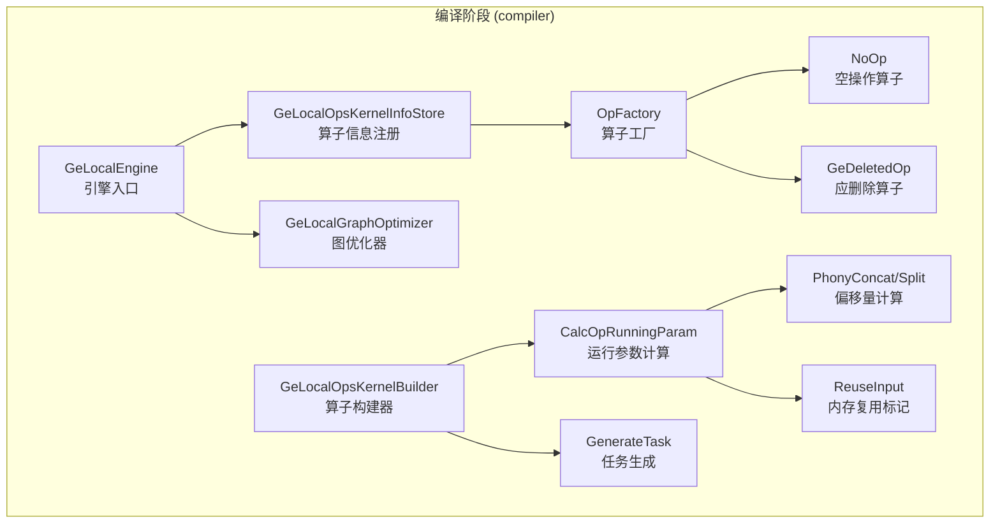

# GE Local Operator 特性分析

## 1 特性概述

GE Local Operator（简称 GE Local 算子）是 GE 图引擎内置的一类"本地算子"，负责承载那些**不需要在昇腾 NPU 上执行实际计算**的算子节点。这些算子本质上是图的骨架节点——用于数据传递、控制流编排、常量存储和形状推导等结构性工作。

与 FE（融合引擎）、AICPU 等面向实际计算任务的引擎不同，GE Local 引擎（引擎名 `DNN_VM_GE_LOCAL`）是一个"零计算"引擎。它管理的算子在编译期完成参数计算或内存布局规划，在运行期只做轻量级的数据搬运或引用操作，不产生任何设备侧 kernel 调用。

### 核心定位

GE Local 引擎解决的核心问题是：**在一个面向异构加速器的图编译系统中，如何优雅地处理大量非计算型节点？**

一个典型的深度学习计算图经过框架适配器（如 TorchAir）转换为 AscendIR 后，会包含大量非计算型节点：数据入口（Data）、模型输出（NetOutput）、常量（Constant/Const）、控制流（If/While/Case）、形状操作（Shape/Reshape/Squeeze）等。这些节点不应占用 NPU 计算资源，但也需要参与图的编译、调度和执行流程。

GE Local 的设计哲学是：将这些节点统一收纳到一个专用引擎中，以最小开销完成它们的"占位"职责，确保编译流程的完整性和执行流程的正确性。

## 2 架构设计

GE Local 特性的核心逻辑集中在编译（compiler）阶段，整体架构如下：

### 2.1 编译阶段

编译阶段的核心代码位于 `compiler/engines/local_engine/`，产出两个动态库：

| 动态库 | 职责 | 注册宏 |
|--------|------|--------|
| `libge_local_engine.so` | 引擎注册入口，对外提供 `Initialize`/`GetOpsKernelInfoStores`/`GetGraphOptimizerObjs`/`Finalize` 四个 C 接口，作为插件被 GE 框架加载 | 引擎插件 |
| `libge_local_opskernel_builder.so` | 算子构建器，负责计算运行参数（`CalcOpRunningParam`）和生成任务（`GenerateTask`），注册名为 `DNN_VM_GE_LOCAL_OP_STORE` | `REGISTER_OPS_KERNEL_BUILDER` |

#### 2.1.1 引擎入口（GeLocalEngine）

`compiler/engines/local_engine/engine/` 下的 `GeLocalEngine` 类采用单例模式，以动态库插件形式被 GE 引擎管理器加载。它对外暴露四个 C 风格接口：

- **Initialize**：创建 `GeLocalOpsKernelInfoStore` 和 `GeLocalGraphOptimizer` 实例
- **GetOpsKernelInfoStores**：将算子信息注册表以 `DNN_VM_GE_LOCAL_OP_STORE` 为 key 注册到 GE 框架
- **GetGraphOptimizerObjs**：将图优化器注册到 GE 框架
- **Finalize**：释放资源

引擎在 GE 初始化时被加载，遵循 GE 的插件式引擎注册协议——每个引擎动态库导出统一的四个 C 符号，GE 框架通过 `dlopen` 加载后按符号名绑定。

#### 2.1.2 算子信息注册（GeLocalOpsKernelInfoStore）

`GeLocalOpsKernelInfoStore` 负责向 GE 框架声明"我支持哪些算子"。初始化时，它从 `OpFactory` 获取所有已注册的算子类型列表，为每个算子创建一份默认的 `OpInfo` 结构：

- `engine = "DNN_VM_GE_LOCAL"`：归属引擎名
- `opKernelLib = "DNN_VM_GE_LOCAL_OP_STORE"`：归属算子库
- `computeCost = 0`：计算代价为零，暗示调度器对这类算子无需特殊调度
- `flagAsync = false`、`flagPartial = false`、`isAtomic = false`：同步执行，不支持部分支持，非原子操作

`CheckSupported` 方法的实现极为简洁——直接在已注册算子名表中查找匹配。对于 GE Local 算子，不存在"部分支持"的概念，只要类型匹配即认为完全支持。

#### 2.1.3 算子工厂（OpFactory）

`compiler/engines/local_engine/ops_kernel_store/op/` 下的 `OpFactory` 采用注册式工厂模式，通过 `REGISTER_OP_CREATOR` 宏在编译期将算子类型与创建函数绑定。工厂管理两类算子实现：

**NoOp（空操作算子）**

`NoOp` 的 `Run()` 方法直接返回成功，不做任何操作。它覆盖了以下几类算子：

| 算子类别 | 包含的算子类型 | 设计意图 |
|----------|---------------|----------|
| 数据入口 | Data、RefData、QueueData、AippData | 数据节点由运行时直接管理，编译期无需处理 |
| 常量存储 | Constant、Const、FileConstant、ConstPlaceHolder | 常量在编译期已完成数据准备 |
| 控制流 | If、Case、While、For、PartitionedCall 等 | 控制流由运行时子图机制处理 |
| 形状操作 | Reshape、Bitcast、Flatten、ExpandDims、ReFormat、Squeeze/Unsqueeze 系列 | 这些算子在编译期完成内存复用标记，运行期直接引用输入 |
| 辅助节点 | NoOp、ControlTrigger、Merge、Variable、OpTiling | 仅参与图结构，无实际计算 |
| 数据流 | Stack、StackPush、StackPop、StackClose | 由运行时 DataFlow 机制处理 |
| 虚拟拼接 | PhonyConcat、PhonySplit | 由编译期完成偏移量计算后标记为 NoTask |

**GeDeletedOp（应删除算子）**

`GeDeletedOp` 的 `Run()` 方法**故意返回 FAILED**，并附带详细的诊断信息。这些算子（如 Identity、Shape、Size、Rank、Placeholder 等）在正确编译的图中**不应该存在**——它们应该被图优化 Pass 消除。如果这些算子到达了 GE Local 引擎，说明图优化流程出了问题。

这是一个精心设计的防御性设计：不是静默跳过或抛出模糊错误，而是明确告诉用户"这个算子应该被哪个优化 Pass 删除，以及当前该 Pass 是否启用"。例如，对于 `Shape` 算子，它会检查常量折叠（`OO_CONSTANT_FOLDING`）选项是否开启，并给出针对性建议。

#### 2.1.4 图优化器（GeLocalGraphOptimizer）

`GeLocalGraphOptimizer` 目前只在 `OptimizeOriginalGraphJudgeInsert` 阶段有实质逻辑，专门处理 `PhonyConcat` 和 `PhonySplit` 两种虚拟算子：

- 为 `PhonyConcat` 设置 `NOTASK`（不生成执行任务）、`NOPADDING_CONTINUOUS_INPUT`（输入连续无填充）、`OUTPUT_REUSE_INPUT`（输出复用输入内存）
- 为 `PhonySplit` 设置类似属性，区别在于 `NOPADDING_CONTINUOUS_OUTPUT`（输出连续无填充）

这些属性的设置使得 PhonyConcat/PhonySplit 在内存规划阶段可以被识别为"零拷贝拼接/拆分"——内存规划器知道这些节点不需要独立的输出缓冲区，只需在输入缓冲区的适当偏移位置上引用即可。

#### 2.1.5 算子构建器（GeLocalOpsKernelBuilder）

`GeLocalOpsKernelBuilder` 是编译期的核心工作组件，实现 `OpsKernelBuilder` 接口，负责两个关键任务：

**CalcOpRunningParam——计算算子运行参数**

这个方法的核心工作是计算每个输出张量的内存大小。对于 GE Local 算子，内存计算有一些特殊处理：

- **Data/RefData 等数据节点**：使用 `GetTensorMemorySizeInBytesWithAutoPadding` 计算带对齐的内存大小
- **Constant/Const 且类型为 DT_STRING**：使用专门的字符串内存计算逻辑 `GetConstantStrMemSize`
- **FileConstant**：直接从 `ATTR_NAME_LENGTH` 属性读取预设长度
- **PhonyConcat/PartitionedCall**：额外进行 32 字节对齐（`AlignOutputMemSize`）
- **未知形状节点**：跳过计算，运行时动态确定

对于特定算子类型，还会调用专门的偏移量计算函数：

- **PhonyConcat**：`CalcPhonyConcatNodeOffset`——计算多输入在连续内存中的偏移位置
- **PhonySplit**：`CalcPhonySplitNodeOffset`——计算多输出在连续内存中的偏移位置
- **Bitcast/Flatten/ExpandDims/ReFormat/Squeeze/Unsqueeze**：`CalcNodeOffsetByReuseInput`——标记输出复用输入内存

**PhonyConcat 偏移量计算细节**

`CalcPhonyConcatNodeOffset`（定义在 `GeLocalOpsKernelBuilderCalcOpParam` 类中）支持多轴拼接的偏移量计算。它通过 `concat_dim`（拼接轴列表）和 `N`（拼接数量列表）属性，计算每个输入节点在其输出缓冲区中的偏移位置。

计算过程采用分层 slice_id 方式：将算子索引逐层分解为各轴上的位置索引，然后按轴从内到外累加偏移量。支持负数轴索引（自动转换为正数），并进行严格的合法性校验：输入形状一致性检查、32 字节对齐检查、轴属性与张量维度匹配检查等。

**GenerateTask——生成任务**

`GenerateTask` 的逻辑相对简单：

- 对于 `StackPop` 等依赖计算的算子，设置 `DEPEND_COMPUTE` 属性，表示形状依赖计算结果
- 对于未知形状节点，设置 `NOTASK` 属性，跳过任务生成
- 对于其他节点，通过 `OpFactory` 创建对应的 Op 对象并调用 `Run()`

## 3 用户使用场景

### 3.1 场景一：计算图的基本骨架构建

任何经过 GE 编译的模型都天然使用 GE Local 算子。框架适配器（TorchAir/TFA）将模型转换为 AscendIR 时，会自动插入 Data（输入节点）、NetOutput（输出节点）、Constant（权重常量）等节点。这些节点被引擎调度器自动分配给 GE Local 引擎，用户无需感知。

### 3.2 场景二：形状推导与常量折叠

在动态形状场景下，Shape、Rank、Size 等算子需要在运行时根据实际输入计算形状信息。GE Local 引擎通过 Host Kernel 机制在 Host 端执行这些计算，并将结果拷贝到设备端，供后续算子使用。

如果用户开启了常量折叠优化（`OO_CONSTANT_FOLDING`），这些形状相关算子会在编译期被折叠为常量，不会进入运行时阶段。

### 3.3 场景三：零拷贝内存复用

Reshape、Bitcast、Flatten、ExpandDims、Squeeze、Unsqueeze 等形状变换算子不改变底层数据，只改变形状描述。GE Local 引擎通过 `CalcNodeOffsetByReuseInput` 在编译期标记 `ReuseInput`，运行时直接引用输入内存，实现零拷贝。

### 3.4 场景四：虚拟拼接/拆分（PhonyConcat/PhonySplit）

PhonyConcat 和 PhonySplit 是 GE 内部使用的虚拟算子，用于表示多个张量在连续内存中的拼接和拆分关系。在图优化阶段，GeLocalGraphOptimizer 为它们设置 `NOTASK` 属性；在编译阶段，`CalcPhonyConcatNodeOffset`/`CalcPhonySplitNodeOffset` 计算各输入/输出的内存偏移量。运行时这些节点不执行任何操作，实际的内存共享通过偏移量属性由内存规划器和执行框架协同完成。

### 3.5 场景五：控制流与数据流

If/While/Case/For 等控制流算子和 Stack/StackPush/StackPop/StackClose 数据流算子由 GE Local 引擎承载。控制流算子通过运行时的子图执行机制处理，数据流算子通过 `DataFlowResource` 机制管理跨节点的数据传递。

## 4 算子分类总览

### NoOp 类算子（编译期不生成任务，运行期空操作）

| 算子类型 | 用途 |
|----------|------|
| Data、RefData、QueueData、AippData | 数据入口节点 |
| Constant、Const、FileConstant、ConstPlaceHolder | 常量存储 |
| NoOp、ControlTrigger | 纯控制流信号 |
| Merge | 多路合并 |
| Variable | 变量引用 |
| If、Case、While、For、PartitionedCall 及其 Stateful/Stateless 变体 | 控制流 |
| OpTiling、ConditionCalc、UnfedData | 编译辅助 |
| Stack、StackPush、StackPop、StackClose | 数据流 |
| Reshape、Bitcast | 形状变换（零拷贝） |
| PhonyConcat、PhonySplit | 虚拟拼接/拆分 |
| Flatten、FlattenV2、ExpandDims、ReFormat、Squeeze/Unsqueeze 系列 | 形状变换（零拷贝） |

### GeDeletedOp 类算子（正常编译流程中不应存在，存在则报错）

Identity、IdentityN、Shape、ShapeN、Size、Rank、Placeholder、Switch、Snapshot、ReadVariableOp、VarHandleOp、TemporaryVariable、DestroyTemporaryVariable、GatherShapes、TransShape 等。

## 5 关键设计决策

### 5.1 编译期与运行期的职责分离

GE Local 的一个核心设计是将尽可能多的工作前移到编译期：

- **编译期**：计算输出内存大小（`CalcOpRunningParam`）、设置内存复用标记（`ReuseInput`）、计算 PhonyConcat/PhonySplit 偏移量、设置 `NOTASK` 属性
- **运行期**：仅做轻量级操作——引用设置、常量值输出、Host 形状计算等

这种设计使得编译期完成了绝大多数工作，运行时的执行路径极短，对整体推理性能的影响可忽略不计。

### 5.2 GeDeletedOp 的防御性设计

将"应被优化消除"的算子显式注册为 `GeDeletedOp` 并在运行时返回错误，是一种强约束的设计选择。替代方案可以是静默跳过（像 NoOp 一样），但这会掩盖图优化的问题。当前的实现能在第一时间暴露编译流程的异常，并通过关联优化选项名称帮助用户定位问题。

### 5.3 PhonyConcat/PhonySplit 的零拷贝策略

PhonyConcat/PhonySplit 的设计体现了"编译期规划、运行期零开销"的理念。通过在编译期计算好所有参与方的内存偏移量，运行时这些节点完全不执行。实际的内存连续性由内存规划器根据 `CONTINUOUS_INPUT/OUTPUT` 和偏移量属性来保证。

## 6 涉及的关键文件

| 文件路径 | 职责 |
|----------|------|
| `compiler/engines/local_engine/engine/ge_local_engine.h/.cc` | 引擎入口，单例模式，插件式注册 |
| `compiler/engines/local_engine/engine/ge_local_graph_optimizer.h/.cc` | 图优化器，处理 PhonyConcat/PhonySplit 属性设置 |
| `compiler/engines/local_engine/ops_kernel_store/ge_local_ops_kernel_info_store.h/.cc` | 算子信息注册表，声明支持的算子类型 |
| `compiler/engines/local_engine/ops_kernel_store/ge_local_ops_kernel_builder.h/.cc` | 算子构建器，计算运行参数和生成任务 |
| `compiler/engines/local_engine/ops_kernel_store/ge_local_ops_kernel_calc_op_param.h/.cc` | PhonyConcat/Split 偏移量计算和 ReuseInput 标记 |
| `compiler/engines/local_engine/ops_kernel_store/op/op_factory.h/.cc` | 算子工厂，注册式创建算子实例 |
| `compiler/engines/local_engine/ops_kernel_store/op/op.h/.cc` | 算子基类 |
| `compiler/engines/local_engine/ops_kernel_store/op/no_op.h/.cc` | NoOp 空操作算子，注册所有 NoOp 类算子 |
| `compiler/engines/local_engine/ops_kernel_store/op/ge_deleted_op.h/.cc` | 应删除算子，注册所有应在优化阶段被消除的算子 |
| `compiler/engines/local_engine/common/constant/constant.h` | 引擎名和算子库名常量定义 |
| `compiler/host_kernels/kernel.h` | Host Kernel 基类接口 |
| `compiler/host_kernels/kernel_factory.h` | Host Kernel 工厂，供 DependInputShapeTask 使用 |
| `compiler/host_kernels/array_ops/shape_kernel.h/.cc` 等 | 各类 Host Kernel 实现 |
| `inc/graph_metadef/graph/ge_local_context.h` | 线程本地上下文（与 GE Local 引擎无直接关联，属于公共基础设施） |
