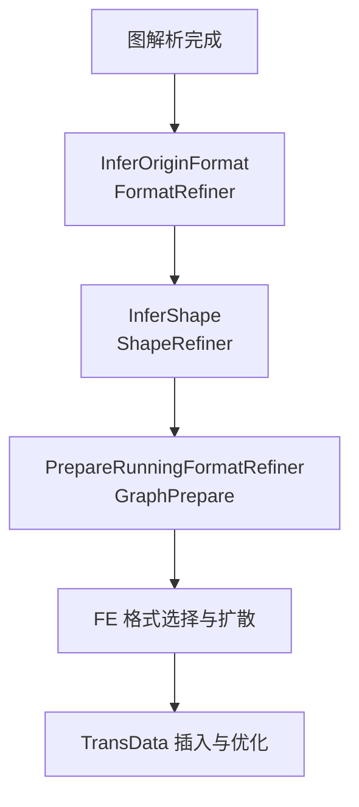
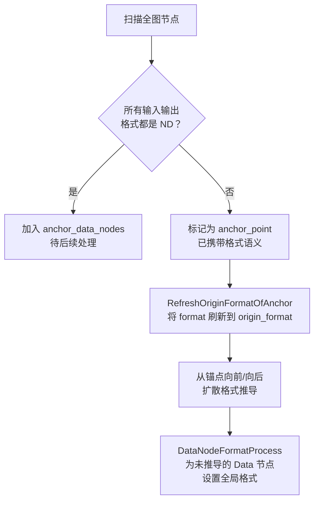
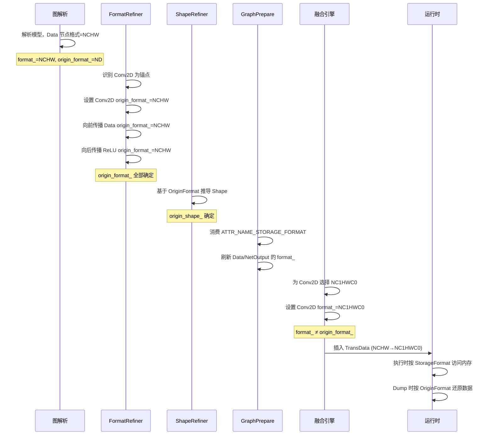

# Format 推导（Infer Format）特性分析

## 1. 特性背景

### 1.1 问题的本质

深度学习框架（PyTorch、TensorFlow 等）在构造计算图时，用户关注的是计算语义——张量的维度、算子的数学含义以及数据依赖关系。但昇腾 AI 处理器（Ascend NPU）的硬件架构对数据的内存布局有特定要求，例如：

- Conv2D 的图片输入在硬件上亲和 NC1HWC0 格式（将 C 轴按 16 对齐拆分）
- MatMul 的权重亲和 FRACTAL_NZ 格式
- 不同算子对格式有不同的支持能力和性能偏好

用户以 NCHW 或 NHWC 等通用格式描述的模型，在昇腾设备上执行时需要被转换为硬件亲和的内存布局。这涉及两个核心问题：

1. **语义理解**：如何正确还原用户在整张计算图中表达的格式语义？
2. **执行优化**：如何为算子选择合适的执行格式，并尽量减少数据重排（TransData）的开销？

### 1.2 为什么需要两套格式字段

GE 引入了 **Origin Format** 和 **Storage Format**（也称 Running Format）两套表示体系，其根本原因是**语义正确性**和**执行效率**需要独立建模：

| 视角 | 字段 | 职责 | 来源 |
|------|------|------|------|
| Origin | `origin_format_` | 表达用户构造计算图时的原始格式语义 | 前端框架或用户显式指定 |
| Storage | `format_` | 描述实际执行时的内存布局 | 编译过程中推导得到 |

如果只用一个 Format 字段，会导致以下问题：

1. **语义丢失**：当 FE（融合引擎）将 NCHW 转为 NC1HWC0 后，原始的 NCHW 语义无处保存，后续优化 Pass 无法判断这个张量原本代表什么
2. **优化受限**：Data Dump、Profiling 等调试场景需要将 NC1HWC0 的数据转回 NCHW 供用户理解，没有 Origin Format 就无法正确还原
3. **格式传播混乱**：整网格式推导需要锚点（如 Conv2D 的 data_format 属性），如果执行格式覆盖了语义格式，推导的起点就丢失了

具体而言，以一个 NCHW 张量 `[8, 3, 224, 224]` 为例：

| 字段 | 值 | 含义 |
|------|------|------|
| OriginFormat | NCHW | 用户定义的语义格式 |
| OriginShape | [8, 3, 224, 224] | 用户理解的维度 |
| StorageFormat | NC1HWC0 | 实际内存布局 |
| StorageShape | [8, 1, 224, 224, 16] | C=3 向上对齐到 16 后的实际存储形态 |

仅从 StorageShape `[8, 1, 224, 224, 16]` 无法唯一还原其 OriginFormat ——它可能来自 NCHW（C=3）也可能来自 NHWC，因此两个字段必须共存。

## 2. 用户使用场景

### 2.1 离线编译场景（atc）

用户使用 atc 工具将 ONNX/PB 模型编译为 OM 文件时，GE 需要自动完成整网的格式推导：

- 模型输入以 NCHW 或 NHWC 格式定义
- GE 推导出每个算子的 OriginFormat
- FE 根据算子能力和性能偏好选择 StorageFormat
- 最终生成包含正确内存布局信息的 OM 模型

### 2.2 在线训练/推理场景

通过 TorchAir 或 TFA 集成时，框架传入的计算图可能未显式标注所有算子的格式。GE 需要在图编译阶段：

- 推导图中所有张量的 OriginFormat
- 在 `PrepareRunningFormatRefiner` 阶段根据用户设置的 `storage_format` 属性刷新 Data/NetOutput 节点
- 确保 InferShape 在正确的格式上下文中执行

### 2.3 Data Dump 与 Profiling

用户在调试时需要查看算子的输入输出数据。数据在设备上以 StorageFormat 存储，但用户理解的是 OriginFormat。GE 通过保存 `ATTR_NAME_DATA_DUMP_ORIGIN_FORMAT` 属性，在 Dump 时将数据从 StorageFormat 转回 OriginFormat。

## 3. 对外接口

### 3.1 GeTensorDesc 上的格式接口

`GeTensorDesc`（定义于 `inc/graph_metadef/graph/ge_tensor.h`）是张量描述的核心类，提供以下格式相关接口：

```
GeTensorDesc
├── GetFormat() / SetFormat()           // StorageFormat 的读写
├── GetOriginFormat() / SetOriginFormat() // OriginFormat 的读写
├── GetShape() / SetShape()             // StorageShape 的读写
├── GetOriginShape() / SetOriginShape() // OriginShape 的读写
```

在 `graph_metadef/graph/normal_graph/tensor.cc` 的 `TensorDescImpl` 类中，可以看到这两个字段独立存储：

- `format_`：对应 StorageFormat，默认 `FORMAT_ND`
- `origin_format_`：对应 OriginFormat，默认 `FORMAT_ND`
- `origin_format_is_set_`：标记 OriginFormat 是否被显式设置

### 3.2 StorageFormat 描述体

在运行时（gert 命名空间），`StorageFormat` 是一个同时携带 Origin 和 Storage 信息的描述体（定义于 `inc/graph_metadef/external/graph/types.h`），其构造方式为：

```
StorageFormat(origin_format, storage_format, expand_dims_type)
```

在 `graph_metadef/register/shape_inference.cc` 的 `GetTensorHolder` 函数中可以看到，创建 Tensor 时会将 `GeTensorDesc` 的两个格式字段分别映射：

```
{input_desc.GetOriginFormat(), input_desc.GetFormat(), {}}
```

即 `StorageFormat` 描述体的第一个参数是 OriginFormat，第二个参数是 StorageFormat。

### 3.3 算子 InferFormat 注册接口

算子开发者可通过以下方式注册格式推导函数：

```
IMPL_OP(OpType).InferFormat(infer_format_func)
```

其中 `infer_format_func` 签名为 `UINT32(InferFormatContext *context)`。

V2 接口通过 `InferFormatContext` 提供更结构化的输入输出访问。在 `graph_metadef/register/shape_inference.cc` 的 `UpdateOpDescOutFormat` 函数中，V2 推导完成后会将结果写回 OpDesc：

```
desc->SetOriginFormat(format->GetOriginFormat());
desc->SetFormat(format->GetStorageFormat());
```

### 3.4 用户指定 StorageFormat

用户可通过在 TensorDesc 上设置属性来指定算子的 StorageFormat：

```
AttrUtils::SetInt(tensor_desc, ATTR_NAME_STORAGE_FORMAT, format_value);
AttrUtils::SetListInt(tensor_desc, ATTR_NAME_STORAGE_SHAPE, shape_dims);
```

这些属性在 `compiler/graph/preprocess/graph_prepare.cc` 的 `PrepareRunningFormatRefiner` 阶段被消费，用于刷新 Data 节点和 NetOutput 节点的格式。

### 3.5 Format 枚举定义

GE 支持的格式类型定义于 `inc/framework/executor_c/types.h`，核心格式包括：

| 格式 | 说明 | 典型用途 |
|------|------|---------|
| FORMAT_ND | N 维张量 | 默认格式，不携带特殊语义 |
| FORMAT_NCHW | N-C-H-W | 用户侧常见的卷积格式 |
| FORMAT_NHWC | N-H-W-C | TensorFlow 默认格式 |
| FORMAT_NC1HWC0 | N-C1-H-W-C0 | Conv2D 在昇腾上的亲和格式 |
| FORMAT_FRACTAL_Z | C1HW-N1-N0-C0 | Conv2D Filter 的亲和格式 |
| FORMAT_FRACTAL_NZ | N1-N0-C1-C0 | MatMul 权重的亲和格式 |

## 4. 具体实现

### 4.1 整体流程

格式推导在 GE 编译流程中的位置如下：



关键顺序：**先推导 OriginFormat，再做 InferShape，最后处理 StorageFormat**。这是因为 InferShape 需要在正确的 OriginFormat 上下文中执行（Shape 的维度含义依赖 Format），而 StorageFormat 的选择发生在 FE 阶段。

### 4.2 Origin Format 推导（FormatRefiner）

Origin Format 推导的核心实现在 `graph_metadef/graph/refiner/format_refiner.cc` 的 `FormatRefiner::InferOrigineFormat` 函数中。

#### 4.2.1 推导算法

推导采用**锚点扩散**策略：



具体步骤：

1. **锚点识别**（`GetAnchorPoints`）：遍历图中所有节点，找到输入/输出中存在非 ND 格式的节点作为锚点。这些节点通常是 Conv2D、Pooling 等对格式敏感的算子，它们通过属性（如 `data_format`）已携带格式信息。

2. **锚点刷新**（`RefreshOriginFormatOfAnchor`）：对锚点节点，如果 `origin_format` 仍为 ND 或 RESERVED，则将其 `format` 值复制到 `origin_format`。这确保锚点自身的 OriginFormat 被正确建立。

3. **双向扩散**（`AnchorProcess`）：
   - **向后推导**（`BackInferProcess`）：从锚点的输入端出发，沿数据流反向传播格式。对每个上游节点，如果其 `origin_format` 为 ND 且未锁定，则将锚点的格式传递过去。
   - **向前推导**（`ForwardInferProcess`）：从锚点的输出端出发，沿数据流正向传播格式。

4. **Data 节点兜底**（`DataNodeFormatProcess`）：对于推导过程中未被触及的 Data 节点（通常是因为缺少格式锚点），使用图的全局 `data_format` 参数统一设置格式。

#### 4.2.2 格式传播的中断条件

推导过程在以下情况会中断：

- **节点格式已锁定**（`ATTR_NAME_FORMAT_LOCKED` 为 true）：某些算子的格式不应被推导过程覆盖
- **节点类型为维度变化算子**（PERMUTE、EXPANDDIMS、SQUEEZE）：当维度数小于 4 时，维度语义不确定，不应传播格式
- **遇到标量**（dim_num == 0）：标量无格式语义
- **遇到 ND 格式**：ND 表示无特定格式语义，传播到此处停止
- **遇到 NetOutput**：作为图的边界，不继续向前传播

#### 4.2.3 Ref 反射机制

对于 If/Case 等控制流算子，GE 通过 `RefRelations` 建立子图与主图之间 Data 节点的反射关系。当主图中某个 Data 的格式被推导后，通过 `ReflectionProcess` 将格式同步到子图对应的 Data 节点及其父节点的输入。

#### 4.2.4 算子自定义推导

除了默认的格式传播机制，算子还可注册自定义的 InferFormat 函数。在 `NodeUtilsEx::InferOriginFormat` 中，会调用 `OpDescUtilsEx::CallInferFormatFunc`，优先使用算子注册的推导函数，否则使用 `DefaultInferFormat`（将第一个非 ND 格式传播到所有输入输出）。

### 4.3 Storage Format 的确定

Storage Format 的确定分为两条路径：

#### 4.3.1 用户显式指定路径

在 `compiler/graph/preprocess/graph_prepare.cc` 的 `UpdateDataNetOutputByStorageFormat` 函数中：

1. 对 Data 节点：从 `ATTR_NAME_STORAGE_FORMAT` 和 `ATTR_NAME_STORAGE_SHAPE` 属性读取用户指定的 StorageFormat，调用 `ModifyTensorDescStorageFormatAndShape` 刷新 TensorDesc
2. 对 NetOutput 节点：同样读取属性并刷新，确保输出格式正确
3. 对 ConstPlaceHolder 节点：处理常量的存储格式

`ModifyTensorDescStorageFormatAndShape` 函数的核心操作：

- 根据 StorageFormat 和 OriginFormat 计算存储形态（StorageShape），包括维度的扩展和对齐
- 调用 `SetFormat` 设置 StorageFormat（注意不是 `SetOriginFormat`）
- 调用 `SetShape` 设置 StorageShape
- 计算并设置 Tensor 的内存大小

#### 4.3.2 FE 自动选择路径

对于计算密集型算子（如 Conv2D、MatMul），FE（融合引擎）在算子编译阶段根据算子的能力选择最优的 StorageFormat。这一过程由 `compiler/engines/nn_engine/optimizer/format_selector/` 下的 FormatSelector 体系实现：

- `FormatDtypeOpBuiltinSelector`：内置算子的格式选择
- `FormatDtypeOpKernelSelector`：基于算子内核信息的格式选择
- `FormatDtypeOpCustomizeSelector`：自定义算子的格式选择

这些 Selector 通过 `FormatDtypeManagerBase` 协调，最终由 `FormatDtypeSetter` 将选择的格式设置到图节点上。

### 4.4 运行时格式推导（InferShape 阶段）

在运行时的 InferShape 阶段，格式信息通过 `InferFormatContext`（V2 接口）传递给算子的推导函数。

在 `graph_metadef/register/shape_inference.cc` 的 `InferFormatOnCompile` 函数中：

1. 构造 `InferFormatContext`：为每个输入/输出创建 `CompileTimeTensorDesc`，其中同时包含 `origin_format` 和 `storage_format`
2. 调用算子注册的 `infer_format_func`
3. 将推导结果通过 `UpdateOpDescOutFormat` 写回 OpDesc

在 `GetTensorHolder` 函数中可以看到 Tensor 的创建方式：

```
gert::Tensor(storage_shape,
             {input_desc.GetOriginFormat(), input_desc.GetFormat(), {}},
             input_desc.GetDataType())
```

其中 `StorageShape` 描述体同时携带 Origin 和 Storage 的 Shape 信息。

### 4.5 格式差异检测与 TransData 插入

在 `runtime/v2/graph_builder/storage_format.cc` 中，`DiffStorageFormat` 函数检测一个张量的 OriginFormat 与 StorageFormat 是否不同（或 Shape 是否不同）：

```
return td->GetFormat() != td->GetOriginFormat() ||
       td->GetShape().GetDims() != td->GetOriginShape().GetDims()
```

`AnyDiffStorageFormat` 检查一个节点的所有输入输出中是否存在任何格式差异。如果存在差异，则在 Lowering 阶段插入 TransData 算子来完成实际的格式转换。

### 4.6 InferShape 中的格式刷新

在 `runtime/v2/kernel/common_kernel_impl/infer_shape_compatible.cc` 的兼容性 InferShape 中，有一个关键的格式处理：

```
// RT1时，算子的infershape只能拿到format字段，但是却需要用origin format
input_desc->SetFormat(input_desc_in_context->GetOriginFormat());
input_desc->SetOriginFormat(input_desc_in_context->GetOriginFormat());
```

这表明在 RT1（运行时第一版）兼容模式下，InferShape 只能获取到 `format` 字段，但实际需要的是 OriginFormat。因此需要从 Context 中正确取出 OriginFormat 并同步设置到 `format` 和 `origin_format` 两个字段。

在 `runtime/v2/kernel/common_kernel_impl/infer_shape.h` 的 `TransformOutputShape` 函数中，当 OriginFormat 与 StorageFormat 不同时，会调用 `ShapeTransferAccordingToFormat::TransferShape` 将 OriginShape 转换为 StorageShape：

```
if (output_td->GetOriginFormat() == output_td->GetStorageFormat()) {
    // 格式相同，无需转换
    return GRAPH_SUCCESS;
}
// 格式不同，需要根据 StorageFormat 计算 StorageShape
TransferShape(origin_format, storage_format, data_type, storage_shape)
```

### 4.7 整网编译流程中的调用时机

在 `compiler/graph/manager/graph_manager.cc` 中，格式相关的阶段按以下顺序执行：

```
PrepareRunningFormatRefiner  ← StorageFormat 刷新
  → UpdateDataNetOutputByStorageFormat
  → VariablePrepareOpPass
  → UpdateInputOutputByOptions
  → UpdateVariableFormats
```

在此之前的 GraphPrepare::GenerateInfershapeGraph 中：

```
InferOriginFormat  ← OriginFormat 推导
  → FormatRefiner::InferOrigineFormat
```

### 4.8 格式优化 Pass

在 OriginFormat 推导和 StorageFormat 确定之后，`compiler/graph/passes/format_optimize/` 下的多个 Pass 负责优化 TransData 的插入和消除：

| Pass | 功能 |
|------|------|
| `TransOpSymmetryEliminationPass` | 消除对称的格式转换对（如 NCHW→NC1HWC0→NCHW） |
| `TransOpBreadthFusionPass` | 将同一节点的多个输出侧 TransData 合并 |
| `TransOpWithoutReshapeFusionPass` | 融合不含 Reshape 的连续 TransData |
| `TransposeTransDataPass` | 将 Transpose 与 TransData 合并优化 |
| `UnchangedTransposeRemovePass` | 移除不改变数据的 Transpose |
| `CastRemovePass` | 移除不必要的 Cast |

## 5. 关键设计决策

### 5.1 为什么 FormatRefiner 使用锚点扩散而非全图遍历

锚点扩散的优势在于：

- **避免无意义传播**：大量 ElementWise 算子（如 Add、ReLU）对格式不敏感，其格式应与上游保持一致，不需要单独推导
- **降低复杂度**：只在格式语义发生变化的节点（锚点）附近做推导，而非遍历全图
- **支持控制流**：锚点扩散结合 RefRelations 可以自然处理子图间的格式同步

### 5.2 为什么 OriginFormat 和 StorageFormat 在 GeTensorDesc 中都存储为 `format_` 和 `origin_format_`

这种设计的核心考虑是：

- `origin_format_` 是 FormatRefiner 阶段确定的，表达用户语义，一旦确定不应被修改
- `format_` 初始与 `origin_format_` 相同，后续在 FE 阶段被修改为 StorageFormat
- 两个字段共存允许任何时刻对比它们来判断是否需要 TransData

### 5.3 为什么 StorageFormat 描述体同时携带 Origin 信息

`StorageFormat`（gert 命名空间）虽然名字叫"Storage"，但实际上是一个复合描述体。原因是仅靠 StorageFormat 的值（如 NC1HWC0）无法唯一还原其 OriginFormat（可能是 NCHW 或 NHWC），必须同时保存两者。这使得运行时无需回溯到 OpDesc 就能获得完整的格式上下文。

## 6. 数据流总结

以下是一个典型 Conv2D 网络中格式信息的完整生命周期：


