# RT2.0 动态 Shape 执行器特性分析

## 1. 特性背景

### 1.1 为什么需要 RT2.0

在昇腾 AI 处理器的图引擎（GE）架构中，v1 运行时（`runtime/v1/`）包含两种执行器：**静态 shape 执行器**（TaskSink 模式）和**动态 shape 执行器**（Hybrid 模式）。TaskSink 模式将整张图的算子任务预下发到设备端，运行时只需一次 `rtModelExecute` 调用即可触发设备端自主执行，在静态 shape 场景下性能极致，仍被保留使用。而 Hybrid 模式通过 Host 端逐算子调度支持动态 shape，但存在性能瓶颈。

RT2.0（`runtime/v2/`）正是为了取代 v1 的 Hybrid 动态 shape 执行器而设计，核心设计目标是：**通过 Lowering 机制将高层 ComputeGraph 转换为可直接执行的 ExecuteGraph，使运行时只需一个极简的执行循环，以更低的开销原生支持动态 shape 场景。**

### 1.2 设计哲学：编译即执行准备

RT2.0 的核心思想可以概括为一句话——**将"翻译"工作从运行时移到编译期**。

v1 在运行时通过 `DistributeTask` 将 Task 逐个下发到设备，而 v2 在编译期（Lowering 阶段）就已经将 ComputeGraph 转换为可以直接执行的 ExecuteGraph。运行时不需要任何"翻译"步骤，只需要执行一个极简的节点循环。

这种设计带来的直接收益是：
- 运行时执行路径极短，无翻译开销
- 执行器可以用纯 C 实现，消除 C++ 的隐式运行时开销

---

## 2. 用户使用场景

### 2.1 典型使用场景

RT2.0 执行器主要服务于以下场景：

| 场景 | 说明 |
|------|------|
| **动态 Shape 推理** | NLP 变长序列、视觉模型动态分辨率等 shape 在推理时变化的场景 |
| **单算子执行** | PyTorch 动态图场景下的单算子编译执行（通过 `aclopCompileAndExecuteV2` 入口） |

### 2.2 与 v1 的入口对应关系

用户通过不同 API 入口，系统自动选择 v1 或 v2 执行路径：

```
┌──────────────────────────────────────────────────────────────┐
│                        API 入口层                             │
├────────────────────┬─────────────────────────────────────────┤
│  ACL 层            │  GE Session 层                          │
│  aclmdlExecuteV2   │  GeSession::RunGraph                    │
│  aclmdlExecuteAsyncV2 │ GeSession::RunGraphAsync             │
│                    │  GeSession::RunGraphAsyncWithStream     │
│  gert::LoadExecutorFromModelData                             │
│  gert::LoadStreamExecutorFromModelData                       │
└─────────┬──────────┴──────────────┬──────────────────────────┘
          │                         │
          ▼                         ▼
    静态 shape 模型            动态 shape 模型
    → v1 NnExecute            → v2 ModelV2Executor
    → v1 Run 循环             → HybridModelRtV2Executor
```

对于动态 shape 模型，`ModelManager::IsNeedHybridLoad` 判断是否走 Hybrid 路径，当前 Hybrid 场景的主力执行器是 `HybridModelRtV2Executor`，它复用了 v2 运行时的 `ExecuteGraph` 基础设施。

---

## 3. 对外接口

### 3.1 核心 API（gert 命名空间）

RT2.0 通过 `gert` 命名空间对外暴露接口，定义在 `inc/framework/runtime/gert_api.h` 中。

#### 3.1.1 加载接口

```
gert::LoadExecutorFromFile(model_path, error_code)
    → 从 OM 文件加载为 ModelV2Executor

gert::LoadExecutorFromModelData(model_data, error_code)
    → 从内存中的 ModelData 加载为 ModelV2Executor

gert::LoadExecutorFromModelData(model_data, ExecutorOption, error_code)
    → 带执行器选项的加载（可指定执行策略）

gert::LoadExecutorFromModelDataWithRtSession(model_data, rt_session, error_code)
    → 绑定 RtSession 加载，变量等资源通过 Session 共享

gert::LoadExecutorFromModelData(model_data, LoadExecutorArgs, error_code)
    → 带完整加载参数（RtSession + FileConstantMems）

gert::LoadStreamExecutorFromModelData(model_data, error_code)
    → 加载为 StreamExecutor（多流场景）

gert::LoadStreamExecutorFromModelData(model_data, LoweringOption, error_code)
    → 带优化选项的 StreamExecutor 加载
```

#### 3.1.2 辅助接口

```
gert::IsDynamicModel(model, model_size, is_dynamic_model)
    → 判断模型是否为动态 shape 模型

gert::LoadDataFromFile(model_path, model_data)
    → 从文件加载 ModelData

gert::AllocatorFactory::Create(graph_name, placement)
    → 根据内存位置（HBM/P2P/Host）创建 Allocator

gert::CreateExternalAllocator(allocatorDesc)
    → 创建外部 Allocator
```

### 3.2 ModelV2Executor 接口

`ModelV2Executor` 是 RT2.0 的核心执行器类，定义在 `inc/framework/runtime/model_v2_executor.h` 中。

#### 3.2.1 生命周期管理

```
Create(exe_graph, root_model, session)
    → 从 ExecuteGraph 创建执行器实例

Load() / Load(ModelExecuteArg) / Load(ModelExecuteArg, ModelLoadArg)
    → 加载模型（执行 Init Graph + 准备 Main Graph）

Execute(ModelExecuteArg, inputs, input_num, outputs, output_num)
    → 异步执行 Main Graph

ExecuteSync(inputs, input_num, outputs, output_num)
    → 同步执行（内部创建 default stream 并自动同步）

UnLoad()
    → 卸载模型（执行 DeInit Graph + 清理资源）
```

#### 3.2.2 查询接口

```
GetModelDesc() → 获取模型描述信息（Stream/Event/Notify 数量等）
GetIterationNum() → 获取当前执行迭代数（配合 Profiler 使用）
GetSubscribers() → 获取事件订阅调度器
GetAippInfo(index, aipp_info) → 获取 AIPP 配置信息
GetAippType(index, aipp_type, aipp_index) → 获取 AIPP 输入类型
```

### 3.3 StreamExecutor 接口

`StreamExecutor` 为多流并发场景提供管理，定义在 `inc/framework/runtime/stream_executor.h` 中。

```
StreamExecutor(builder)
    → 构造 StreamExecutor（持有 ModelV2ExecutorBuilder）

GetOrCreateLoaded(stream, arg)
    → 获取或创建指定 Stream 上的 Executor（线程安全）

Erase(stream)
    → 移除指定 Stream 上的 Executor
```

内部维护 `streams_to_executor_: map<aclrtStream, unique_ptr<ModelV2Executor>>`，每个 Stream 一个 Executor 实例，确保异步执行模式下多个 Stream 并发推理时状态互不干扰。

### 3.4 关键数据结构

#### ModelExecuteArg（执行参数）

```
stream                  → 执行流（用户可指定或使用内部默认流）
external_allocator      → 外部内存分配器（与 stream 绑定）
external_stream_allocator → 外部辅流分配器
external_event_allocator  → 外部 Event 分配器
external_notify_allocator → 外部 Notify 分配器
```

关键约束：
- 一个 allocator 仅对应唯一的 stream
- 在对应流同步之前，allocator 内存池中的内存不可归还到操作系统
- 在对应流同步之前，allocator 不可被析构

#### ModelLoadArg（加载参数）

```
rt_session              → 运行时 Session（变量管理、资源隔离）
outer_weight_mem        → 外部权重内存（指针 + 大小）
```

#### ExecutorOption（执行器选项）

```
ExecutorType::kSequentialPriority    → 顺序优先级执行器（最快，不支持控制流）
ExecutorType::kTopological           → 基于拓扑的执行器（动态计算 ready 节点）
ExecutorType::kTopologicalPriority   → 拓扑优先级执行器（ready 节点按优先级排序）
ExecutorType::kTopologicalMultiThread → 拓扑多线程执行器
```

---

## 4. 整体架构

### 4.1 三层架构

```
┌─────────────────────────────────────────────────────────────────┐
│                        API 层                                    │
│  gert::LoadExecutorFromModelData / LoadStreamExecutorFromModelData │
│  ModelV2Executor::Load / Execute / UnLoad                       │
│  StreamExecutor::GetOrCreateLoaded / Erase                      │
├─────────────────────────────────────────────────────────────────┤
│                      执行器层                                     │
│  ┌─────────────────┐  ┌──────────────────┐  ┌────────────────┐ │
│  │ ModelV2Executor │  │ StreamExecutor   │  │ ExeGraphExecutor│ │
│  │ (模型级执行器)    │  │ (多流管理器)      │  │ (子图执行代理)   │ │
│  └────────┬────────┘  └────────┬─────────┘  └────────┬───────┘ │
│           │                    │                      │          │
│           ▼                    ▼                      ▼          │
│  ┌───────────────────────────────────────────────────────────┐  │
│  │              三子图生命周期管理                              │  │
│  │     Init Graph → Main Graph → DeInit Graph                 │  │
│  └───────────────────────────────────────────────────────────┘  │
├─────────────────────────────────────────────────────────────────┤
│                      引擎层                                      │
│  ┌──────────────┐  ┌──────────────┐  ┌──────────────────────┐  │
│  │ Sequential   │  │ Topological  │  │ MultiThreadTopological│  │
│  │ Executor (C) │  │ Executor (C) │  │ Executor              │  │
│  └──────────────┘  └──────────────┘  └──────────────────────┘  │
│                                                                 │
│  ┌───────────────────────────────────────────────────────────┐  │
│  │                    Node + Kernel 注册系统                    │  │
│  │  Node: { node_id, func(KernelRunContext*), context }       │  │
│  │  KernelRegistry: run_func, outputs_creator, trace_printer  │  │
│  └───────────────────────────────────────────────────────────┘  │
├─────────────────────────────────────────────────────────────────┤
│                    Lowering 层（编译期）                          │
│  ┌───────────────────────────────────────────────────────────┐  │
│  │  ComputeGraph → [NodeConverter 逐节点转换] → ExecuteGraph   │  │
│  │  GraphConverter / ModelConverter / NodeConverterRegistry    │  │
│  └───────────────────────────────────────────────────────────┘  │
└─────────────────────────────────────────────────────────────────┘
```

### 4.2 三子图生命周期

RT2.0 将模型执行分为三个子图阶段：

```mermaid
flowchart TD
    A[Load 阶段] --> B[加载并执行 Init Graph]
    B --> C[内存分配 / 流分配 / 常量初始化]
    C --> D[卸载 Init Graph]
    D --> E[加载 Main Graph]
    E --> F[准备执行数据，不执行]

    G[Execute 阶段] --> H[指定输入/输出 Tensor]
    H --> I[指定运行时参数]
    I --> J[执行 Main Graph]

    K[UnLoad 阶段] --> L[卸载 Main Graph]
    L --> M[加载并执行 DeInit Graph]
    M --> N[资源清理]
    N --> O[卸载 DeInit Graph]
```



**为什么需要三子图分离？**

v2 的核心执行引擎是纯 C 实现的顺序/拓扑执行循环，无法处理"分配内存"这种需要与运行时 API 交互的操作。将初始化操作（内存分配、流分配、常量加载）和清理操作（资源释放）提取到独立的 Init/DeInit 子图中，可以保持 Main Graph 的纯粹性——Main Graph 只包含纯计算节点。

### 4.3 数据流总览


---

## 5. 核心实现

### 5.1 Lowering：从 ComputeGraph 到 ExecuteGraph

Lowering 是 RT2.0 的核心转换机制，定义在 `runtime/v2/lowering/` 目录下。

#### 5.1.1 转换流程

`GraphConverter::ConvertComputeGraphToExecuteGraph` 完成以下核心步骤：

1. **Init Graph 生成**：将所有初始化操作（常量加载、流分配、内存分配器创建）提取到独立的 Init 子图
2. **Main Graph 生成**：对每个 ComputeGraph 节点，通过 `NodeConverterRegistry` 查找对应的 `NodeConverter`，调用其 lowering 函数生成一个或多个 ExecuteGraph 节点
3. **事件同步 Lowering**：`LoweringEventSync` 处理跨流的 Send/Wait 事件同步
4. **离线优化**：`OfflineOptimizer` 对生成的 ExecuteGraph 进行优化（常量折叠、死代码消除等）
5. **拓扑排序**：对节点进行拓扑排序，确定执行顺序
6. **优先级计算**：`NodePriorityCalculator` 为节点计算优先级
7. **图级数据追加**：将 Stream、Event、Notify 等图级资源追加到 ExecuteGraph

#### 5.1.2 NodeConverter 注册机制

每个算子类型通过 `NodeConverterRegistry` 注册对应的转换函数：

```
NodeConverterRegistry::GetInstance().FindRegisterData(type)
    → 按算子类型查找
NodeConverterRegistry::GetInstance().FindRegisterData(lowering_func)
    → 按 _ge_attr_lowering_func 属性查找
NodeConverterRegistry::GetInstance().FindRegisterData(kernel_lib_name)
    → 按算子库名查找
```

转换函数签名：`LowerResult (*)(const ge::NodePtr &node, const LowerInput &input)`

#### 5.1.3 数据依赖处理

Lowering 过程中通过 `DataDependentInterpreter` 判断节点是否存在数据依赖（shape 依赖运行时数据），对数据依赖节点生成特殊的 ValueHolder，确保执行时能正确处理动态 shape。

### 5.2 Sequential Executor：极致简洁的执行引擎

定义在 `runtime/v2/core/executor/sequential/executor/sequential_executor.c` 中。
每个 Node 只包含：节点 ID、执行函数指针、运行上下文。这种扁平化设计消除了虚函数调用、指针追逐等开销。

### 5.3 Topological Executor：动态拓扑调度

定义在 `runtime/v2/core/executor/topological/executor/topological_executor.c` 中。

与 Sequential Executor 不同，Topological Executor 在执行时动态计算 ready 节点.
**适用场景**：包含控制流（If/While）的模型，节点执行顺序在编译期无法完全确定。

### 5.4 ModelV2Executor：三子图生命周期管理

定义在 `runtime/v2/core/model_v2_executor.cc` 中。

#### 5.4.1 Load 流程

```
Load(ModelExecuteArg, ModelLoadArg):
    1. 加载 Init Graph（init_executor.Load()）
    2. 初始化 RtVarManager（变量管理器）
    3. 准备常量输入（ArrangeModelLoadArg）
    4. 指定运行时参数（SpecifyArgsInputs）：
       - Stream 资源（可复用流 + 附加流）
       - Event 资源
       - Notify 资源
       - External Allocator
    5. 执行 Init Graph（init_executor.Execute()）
    6. 卸载 Init Graph（init_executor.UnLoad()）
    7. 加载 Main Graph（graphs_[kMainExeGraph].Load()）
    8. 状态切换为 kLoaded
```

#### 5.4.2 Execute 流程

```
Execute(ModelExecuteArg, inputs, input_num, outputs, output_num):
    1. 检查状态（必须为 kLoaded）
    2. 校验输入/输出 Tensor 数量和有效性
    3. 指定输入 Tensor（graph_executor.SpecifyInputs）
    4. 指定运行时参数（SpecifyArgsInputs）
    5. 指定输出 Tensor（graph_executor.SpecifyOutputs）
    6. 校验 I/O 复用地址合法性（CheckIoReuseAddrs）
    7. 执行 Main Graph（graph_executor.Execute()）
       - 如果启用了 Subscriber，则带回调执行
       - 否则直接执行
```

#### 5.4.3 UnLoad 流程

```
UnLoad():
    1. 销毁 default stream
    2. 卸载 Main Graph
    3. 加载 DeInit Graph
    4. 执行 DeInit Graph（资源清理）
    5. 卸载 DeInit Graph
    6. 状态切换为 kInit
```

#### 5.4.4 Stream/Event/Notify 资源管理

`OccupyStreamResource` 负责准备执行所需的流、事件、通知资源：

- 如果用户传入外部 allocator，则使用外部的
- 如果用户未传入任何 allocator，则使用内置的（`builtin_stream_allocator_` 等）
- 不允许只传入部分 allocator（必须全部传入或全部不传）

资源数量由 `ModelDesc` 中的 `reusable_stream_num`、`reusable_event_num`、`reusable_notify_num`、`attached_stream_num` 决定。

### 5.5 Kernel 注册与执行系统

定义在 `inc/graph_metadef/register/kernel_registry.h` 中。

#### 5.5.1 Kernel 注册

通过 `REGISTER_KERNEL(type)` 宏注册算子内核：

```
REGISTER_KERNEL(MyKernel)
    .RunFunc(my_kernel_run)
    .OutputsCreator(my_outputs_creator)
    .TracePrinter(my_trace_printer)
    .ProfilingInfoFiller(my_profiling_filler)
    .DataDumpInfoFiller(my_data_dump_filler)
    .ExceptionDumpInfoFiller(my_exception_dump_filler)
    .ConcurrentCriticalSectionKey("my_critical_section");
```

每个 Kernel 可注册以下函数：
- `run_func`：核心执行函数
- `outputs_creator`：输出创建函数
- `trace_printer`：维测信息打印
- `profiling_info_filler`：性能分析信息填充
- `data_dump_info_filler`：数据 dump 信息填充
- `exception_dump_info_filler`：异常 dump 信息填充
- `critical_section`：多线程临界区标识

#### 5.5.2 Kernel 执行上下文

`KernelRunContext` 和 `KernelContext` 为 Kernel 提供执行所需的上下文信息，包括输入/输出地址、shape 描述、运行时参数等。

### 5.6 HybridModelRtV2Executor：Hybrid 场景的执行入口

定义在 `runtime/v1/hybrid/executor/hybrid_model_rt_v2_executor.h` 中。

`HybridModelRtV2Executor` 是动态 shape 模型在 Session 层的执行入口，内部通过 `RtV2ExecutorFactory` 创建具体的执行器：

```
RtV2ExecutorFactory::Create(model, allocator, session):
    → 检查是否包含 PartitionedCall 节点（Stage 分区）
    → 如果是：创建 RtV2PipelineExecutor
    → 如果否：创建 RtV2SimpleExecutor
```

- **RtV2SimpleExecutor**：直接包装 `ModelV2Executor`，适用于单图场景
- **RtV2PipelineExecutor**：管理多个 Stage 的执行器，通过 `StageState` 和 `StageNotification` 实现 Stage 间的流水线并行

`HybridModelRtV2Executor` 还负责：
- 变量管理（`GraphVarVisitor`）：管理 Host/Device 变量、共享常量、文件常量
- 输入/输出 Tensor 的构建和转换
- 内存分配器管理（`ScalableAllocatorManager`）
- Guard 检查（安全校验）
- Profiler 数据采集

### 5.7 ExecutorSubscribersScheduler：事件订阅系统

RT2.0 提供可扩展的事件订阅机制，允许在执行过程中插入回调：

```
ExecutorSubscribersScheduler:
    → AddSubscriber<Profiler>(kMainExeGraph, ...)
    → AddSubscriber<DataDumper>(kMainExeGraph, ...)
    → AddSubscriber<CannTracingProfiler>(kMainExeGraph, ...)
```

执行时如果启用了 Subscriber，则调用 `SequentialExecuteWithCallback` 或 `TopologicalExecuteWithCallback`，在每个节点执行前后触发回调：

```
kModelStart → [kExecuteStart → node.func → kExecuteEnd] * N → kModelEnd
```

内置 Subscriber 包括：
- `CannProfilerV2`：性能分析
- `CannTracingProfiler`：执行追踪
- `DataDumper`：数据 dump

---

## 6. 内存管理

### 6.1 Allocator 体系

RT2.0 提供统一的 Allocator 接口，支持多种内存位置：

```
TensorPlacement::kOnDeviceHbm    → CachingMemAllocator(RT_MEMORY_HBM)
TensorPlacement::kOnDeviceP2p    → CachingMemAllocator(RT_MEMORY_P2P_DDR)
TensorPlacement::kOnHost         → HostMemAllocator
TensorPlacement::kFollowing      → HostMemAllocator
```

用户可通过 `CreateExternalAllocator` 创建自定义 Allocator，实现外部内存管理。

### 6.2 外部 Allocator 约束

当用户使用外部 Allocator 时，需要满足以下要求：
1. 一个 allocator 仅对应唯一的 stream
2. 在对应流同步之前，allocator 内存池中的内存不可归还到操作系统
3. 在对应流同步之前，allocator 不可被析构
4. 不可并发调用 Execute 接口（如果同一个 allocator 匹配不同 stream）

### 6.3 I/O 复用地址校验

`CheckIoReuseAddrs` 在 Execute 前校验输入/输出 Tensor 的地址复用关系，防止输出覆盖尚未读取的输入数据。编译期会记录 `io_same_addr_pairs_`，运行时检查实际地址是否违反约束。

---

## 7. 多流并发管理

### 7.1 StreamExecutor 设计

`StreamExecutor` 为每个 ACL Stream 创建独立的 `ModelV2Executor` 实例：

```
streams_to_executor_: map<aclrtStream, unique_ptr<ModelV2Executor>>
```

每个 Stream 一个 Executor 是因为在异步执行模式下，多个 Stream 可能并发执行同一个模型的不同推理请求。每个 Executor 维护自己的执行状态（输入/输出绑定、迭代计数等），互不干扰。

### 7.2 线程安全

`StreamExecutor::GetOrCreateLoaded` 使用 `recursive_mutex` 保护，确保多线程场景下 Executor 的创建和查找是线程安全的。

### 7.3 资源隔离

不同 Stream 的 Executor 可以：
- 共享同一个 `RtSession`（变量等资源通过 Session 共享）
- 使用不同的外部 Allocator（每个 Stream 绑定独立的 Allocator）
- 使用内置的 Stream/Event/Notify Allocator（自动管理）

---

## 8. 与 v1 架构的关键差异

| 维度 | v1 Runtime | v2 Runtime (RT2.0) |
|------|-----------|-------------------|
| 核心抽象 | DavinciModel + TaskDef | ExecuteGraph + Node/Kernel |
| 执行模型 | rtModelExecute（硬件 Sink） | Host 顺序/拓扑执行 |
| 适用场景 | 静态 shape 模型 | 动态 shape / 控制流 / 单算子 |
| 内存管理 | 分段式（FM/Weight/Var） | 统一 Allocator |
| 代码语言 | C++（重运行时） | C 核心 + C++ kernel |
| 图转换 | 编译期 TaskSink 到 OM | 运行时 Lowering（ComputeGraph → ExecuteGraph） |
| 子图管理 | 无 | Init/Main/DeInit 三子图 |
| 多流管理 | 多 rtStream 绑定 rtModel | 多 Executor 实例（StreamExecutor） |
| 扩展机制 | TaskInfo 分发 | Kernel 注册系统 + NodeConverter 注册 |
| 事件订阅 | 无 | ExecutorSubscribersScheduler |

---


## 9. 关键文件索引

| 文件路径 | 职责 |
|---------|------|
| `inc/framework/runtime/gert_api.h` | 对外 API 入口（加载接口） |
| `inc/framework/runtime/model_v2_executor.h` | ModelV2Executor 类定义 |
| `inc/framework/runtime/stream_executor.h` | StreamExecutor 类定义 |
| `inc/framework/runtime/exe_graph_executor.h` | ExeGraphExecutor 类定义 |
| `inc/framework/runtime/executor_option/executor_option.h` | 执行器选项定义 |
| `inc/graph_metadef/register/kernel_registry.h` | Kernel 注册系统 |
| `runtime/v2/api/api.cc` | API 实现（加载流程） |
| `runtime/v2/core/model_v2_executor.cc` | ModelV2Executor 实现 |
| `runtime/v2/core/stream_executor.cc` | StreamExecutor 实现 |
| `runtime/v2/core/executor/executor_base_def.h` | Node 基础结构定义 |
| `runtime/v2/core/executor/sequential/executor/sequential_executor.c` | 顺序执行器（C） |
| `runtime/v2/core/executor/topological/executor/topological_executor.c` | 拓扑执行器（C） |
| `runtime/v2/core/executor/sequential/execution_data/sequential_execution_data.h` | 顺序执行数据 |
| `runtime/v2/core/executor/topological/execution_data/topological_execution_data.h` | 拓扑执行数据 |
| `runtime/v2/lowering/graph_converter.h` | GraphConverter 定义 |
| `runtime/v2/lowering/model_converter.h` | ModelConverter 定义 |
| `runtime/v2/lowering/graph_converter.cc` | GraphConverter 实现 |
| `runtime/v1/hybrid/executor/hybrid_model_rt_v2_executor.h` | Hybrid RT2 执行器 |
| `runtime/v1/hybrid/executor/runtime_v2/rt_v2_simple_executor.h` | 简单执行器封装 |
| `runtime/v1/hybrid/executor/runtime_v2/rt_v2_pipeline_executor.h` | Pipeline 执行器 |
| `api/session/session/inner_session.h` | Session 层接口 |
| `docs/architecture/constraints/rt2_runtime.md` | RT2 运行时约束文档 |
| `docs/architecture/modules/runtime/runtime.md` | 运行时架构文档 |
