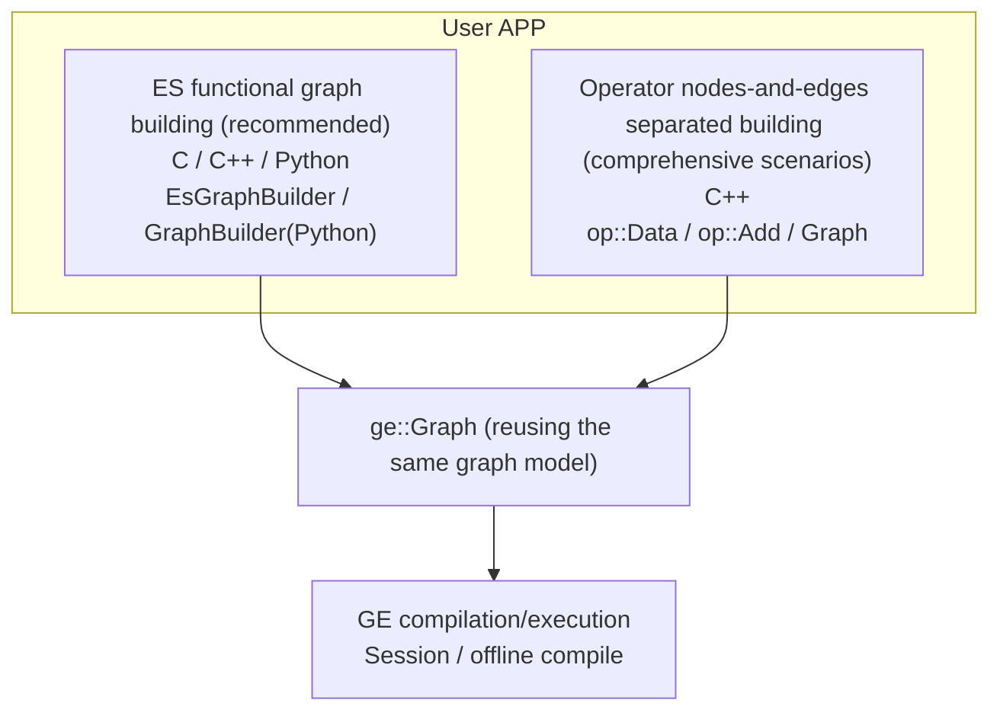
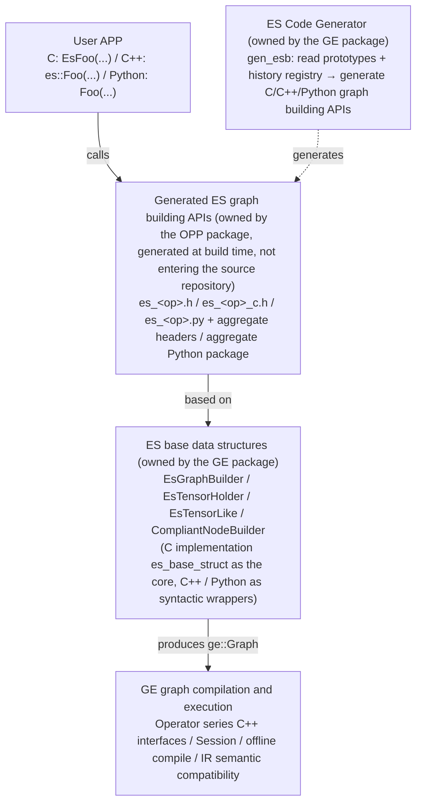
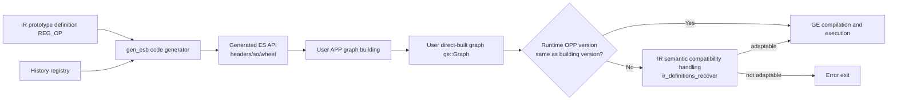

# ES (Eager Style) Graph Building API Feature Analysis

## 1. Feature Background

### 1.1 Why ES Is Needed

In the traditional graph building system of GE (Graph Engine), users build computation graphs through the **Operator series interfaces** (`op::Data`, `op::Add`, and the `set_input_x`/`set_attr_x` series) in a "nodes-and-edges separated" manner: first instantiate Operator objects based on operator prototypes (IR), then set inputs, outputs, and attributes one by one, and finally assemble them into a `ge::Graph`. This approach is flexible and powerful, serving as the foundational capability for comprehensive scenarios such as graph modification and graph traversal, but it has obvious pain points as a pure graph building interface:

- **Cumbersome to use**: requires awareness of the complete prototype definition and item-by-item setting, resulting in large code volume;
- **Errors hard to detect**: connection and attribute errors are often deferred until the graph compilation stage;
- **No compatibility guarantee**: C++ interfaces have no ABI compatibility commitment, nor forward/backward compatibility design.

Mainstream graph building interfaces in the industry (PyTorch Eager, etc.) generally adopt a **functional style** — expressing edge connections between nodes directly through function calls, which is simple and exposes errors at compile time. GE therefore introduced the **ES (Eager Style) graph building API**: a set of **functional-style graph building interfaces** with syntax similar to PyTorch Eager scripts, whose core philosophy is **expressing edge connections and IR information passing directly through function calls**. For the definition and positioning of ES, see [ES_definition.md](../../../zh/user_guides/graph_dev/es_graph/ES_definition.md) (Chinese).

### 1.2 Design Philosophy: Faithful to IR, Generated Rather Than Handwritten

The core idea of ES can be summarized in two sentences — **the API is a faithful mapping of IR; the implementation is generated rather than handwritten**.

- Each IR prototype maps to a graph building function with the same name: function parameters correspond to operator inputs and attributes in order, and return values correspond to outputs; the function body completes node creation and edge connection based on `EsGraphBuilder`, reusing GE's existing `Graph`/`GNode` data structures without introducing a second graph model;
- All operator-level graph building APIs are automatically generated by the code generator `gen_esb` reading operator prototypes, avoiding handwritten interface wrappers for thousands of operators, ensuring consistency and maintainability from the source.

Direct benefits of this design:

- Users build graphs in an intuitive way like `add = data0 + data1`, with usability capabilities such as operator overloading and direct value passing;
- When IR changes, only regeneration is needed, no manual synchronization;
- Multi-language (C / C++ / Python) capabilities are naturally consistent.

### 1.3 Design Goals

| Goal | Description |
|------|------|
| Ease of use | Functional style, significantly less code than the nodes-and-edges separated manner, with certain foolproofing capabilities |
| Multi-language | Native support for C, C++, and Python with consistent style |
| Auto-generation | Automatic CodeGen based on operator prototypes + minimal manual annotation, released with the operator package (OPP) |
| API/ABI compatibility | After upgrading/downgrading CANN versions, APPs not using new capabilities can compile and run without code changes |
| IR semantic compatibility | When the graph building version differs from the runtime environment IR version, GE automatically adapts the semantics |

---

## 2. Historical Background and Constraint Scenarios

ES is not an independent interface set that can evolve freely: the component that interacts most closely with it is the **operator component** (operator repository / operator package OPP), and several key design decisions come from **implicit constraints** of cross-component collaboration. Understanding these constraints is essential to understanding ES's evolution boundaries, which scenarios should not use ES, and the adaptation scope when IR changes.

### 2.1 Existing Public APIs Cannot Be Modified

Once ES's external public APIs are released, they **cannot be modified**, for two reasons:

- **External attribute**: ES APIs are externally released external interfaces, and external users (APPs, passes in operator repositories, etc.) will directly depend on existing symbols and signatures;
- **Independent upgrade/downgrade of operator packages**: operator packages and GE packages support independent upgrade and downgrade. If ES modifies existing APIs, the operator package will not find matching ES symbols after upgrade/downgrade, directly rendering the operator package unusable.

### 2.2 New APIs Must Satisfy the Compatibility Cycle

ES **can add** new APIs, but calling new APIs on the operator repository side must satisfy the compatibility cycle requirement — generally, calls are allowed only **one year after** the API is released. The reason is again the independent upgrade/downgrade of operator packages: a new operator package must be able to run with old GE packages within the compatibility window, where the symbols corresponding to the new APIs do not yet exist; after the one-year window, old GE packages without those symbols exit the support scope, and the new APIs can then be safely called by operator repositories.

This constraint is consistent with Chapter 7's "CANN compatibility requirement: backward compatible for one year and forward compatible for one year after commercial interface release", and is a concrete manifestation of the overall compatibility requirement in the ES ↔ operator component collaboration.

### 2.3 CompliantNodeBuilder v1/v2 Interfaces and the codegen ABI Constraint

The `compliant_node_builder.h` where `CompliantNodeBuilder` resides contains two sets of IR definition interfaces:

- **v1 interfaces** (`IrInputDef` / `IrOutputDef` / `IrAttrDef`): legacy interfaces whose structs contain `std::string` fields and are **not ABI-safe**;
- **v2 interfaces** (`IrInputDefV2` / `IrOutputDefV2` / `IrAttrDefV2`): subsequently provided **ABI-safe** interfaces that express strings via `char_t*`, avoiding the problem of `std::string` layout varying with compiler ABI configurations.

The code generated by ES codegen currently still calls the **v1 interfaces**, which is also due to the independent upgrade/downgrade constraint: if the newly generated operator package ES APIs depended on v2, they would fail to find symbols when running with old GE packages within the compatibility window (which do not yet contain v2 definitions). Currently, the ABI risk of v1 interfaces is mitigated by **unifying the ABI standard between internal GE and the operator component** (e.g., `_GLIBCXX_USE_CXX11_ABI`, which `generate_es_package.cmake` sets fixedly); once the v2 interfaces have been released for the full one-year compatibility window, codegen can switch to calling the v2 series interfaces.

Since codegen **does not distinguish between external user calls and internal operator calls**, the derived constraint for external users is: if using the ES graph building interfaces built into operator packages (linking `libes_<module>.so`), the user's compilation target must maintain the same ABI standard as the CANN internals; otherwise, undefined behavior may occur due to inconsistent `std::string` layouts.

### 2.4 Scenario Boundary: ES Is Positioned for Graph Building, Not Graph Modification

- ES APIs are currently released in operator packages (OPP) and **positioned for graph building**. Typical users are the new Pattern matching Pass mechanism (the `PatternFusionPass` system): constructing matching template graphs in pattern definitions and replacement graphs in `Replacement`;
- ES **does not handle graph modification**. Graph modification scenarios (the new Pass mechanism other than "graph match-and-replace", or legacy Passes directly traversing and modifying graphs) should not use ES; continue using nodes-and-edges separated interfaces such as `GNode`. The two approaches interoperate via the `GetProducer` bridge (see 3.2).

### 2.5 ES API Count Depends on the Operator Package and Handling of Missing APIs

The number of ES operator-level APIs depends on the number of operators supported in the corresponding operator package — an ES API exists only if the prototype exists in the operator package. When a missing ES API is found:

- **General path**: push the open-source operator repository to fill in the missing APIs (regenerated with the package after the prototype is completed);
- **Reasonable absence scenario**: when a Pattern Pass "matches old nodes and replaces them with new nodes", the new operators introduced by the replacement exist only in the compile-time replacement graph and **do not exist at execution time**; in this case it is reasonable for the operator package not to provide the operator prototype and ES API. However, constructing the replacement graph does require that ES API. The **recommended approach** is:
  1. Use `add_es_library` provided by `generate_es_package.cmake`, passing a self-constructed temporary prototype so via `OPP_PROTO_TARGET` to generate ES APIs for that (batch of) operator(s);
  2. **Statically link** the ES API artifacts into the pass target;
  3. The operator package only packages the pass target, **without packaging** the corresponding header files, py files, and other ES artifacts.

  For specific usage, see [generate_es_package_cmake_readme.md](../../user_guides/es_graph/tools/generate_es_package_cmake_readme.md); for engineering practice, refer to the UT project in the GE repository that depends on `es_ut` interfaces: `tests/ge/ut/ge/graph/eager_style_graph_builder/graph_construction_test` (which generates `es_ut_test` from the `stub_geir_ops` temporary prototype library).

### 2.6 Evolving: required-to-optional Compatibility Judgment Pending Adaptation

When ES historical prototypes generate C++ overloaded interfaces, they validate whether prototype changes are compatible (`AnalyzeDiff` of `overload_planner`, see 6.3). Currently, changes recognized as compatible are limited to **adding optional inputs and adding optional attributes with default values**, with the required flag required to remain strictly identical across the version chain. Operators now frequently propose that "**required-to-optional**" (required → optional) should also be treated as a compatible scenario. If this request is finally approved through review, ES needs to adapt two places:

- The compatibility judgment and overload planning of `overload_planner`: relax the comparison of required flags in `DiffInputs`/`DiffAttrs`, and synchronously adjust the merge safety and baseline generation strategies (already marked with `TTODO(es_compat)` in the code);
- The judgment logic in IR semantic compatibility handling `ir_definitions_recover.cc` (see 6.5): the forward/backward compatibility judgments and the fill-in/removal rules need to cover the required → optional scenario.

---

## 3. User Use Scenarios

### 3.1 Typical Use Scenarios

| Scenario | Description |
|------|------|
| **Pure graph building (functional recommended)** | Offline modeling, quickly building verification graphs, Transformer-scale large graph building |
| **Python full workflow** | Build graphs in Python then compile and execute directly via `ge.Session`, forming a closed loop |
| **C/C++ lightweight integration** | C applications build graphs through opaque pointer interfaces; C++ applications enjoy operator overloading and RAII |
| **Custom operator engineering** | Custom operators (including AscendC) reuse the ES generator to generate graph building APIs for their own operators |
| **Graph modification/traversal** | Comprehensive scenarios still recommend the Operator series nodes-and-edges separated interfaces; the two interoperate via bridges such as `GetProducer` |

### 3.2 Relationship with Traditional Graph Building Entries



Both ES and Operator series interfaces produce `ge::Graph`; users can freely choose by scenario or mix them: during ES graph building, `EsTensorHolder::GetProducer` can retrieve the `GNode` and switch to the nodes-and-edges separated manner to continue modifying the graph.

Multi-language samples cover control edges, control operators, dynamic inputs/outputs, optional inputs, common/private attributes, operator overloading, Transformer, collective communication (HCCL), and other scenarios; see [examples/es](../../../../examples/es/README.md). For samples of custom-generating ES APIs for your own operators, see [examples/custom_es_api](../../../../examples/custom_es_api/README.md).

---

## 4. External Interfaces

### 4.1 Interface Layering

ES interfaces are divided into two layers: the **base data structure layer** (`EsGraphBuilder`, `EsTensorHolder`, etc., delivered with the GE package) and the **generated operator graph building API layer** (`Add`, `MatMul`, etc., delivered with the OPP package).

### 4.2 C Interfaces (Base Structures)

Defined in `inc/external/ge/eager_style_graph_builder/c/esb_funcs.h`, implemented in `compiler/graph/eager_style_graph_builder/es_base_struct/esb_funcs.cc`. Core interfaces:

```
EsCreateGraphBuilder(name)                     → Create graph builder EsCGraphBuilder
EsDestroyGraphBuilder(builder)                 → Destroy the builder and all process resources it manages
EsCreateGraphInput(builder, index)             → Add the index-th graph input (Data node)
EsCreateConstInt64/Int32/UInt64/UInt32/Float   → Create constant nodes of the specified dtype
EsCreateVectorXxx / EsCreateScalarXxx          → Create vector / scalar constants
EsCreateVariable(builder, index, name)         → Create a variable node
EsCreateEsCTensor / EsCreateEsCTensorFromFile  → Create carriers for Tensor-type attributes
EsBuildGraphAndReset(builder)                  → Finalize the graph, producing EsCGraph
EsSetOutput(tensor, index)                     → Set graph output
EsAddControlEdge(dest, srcs, num)              → Set control edges
EsSetInt64/String/BoolAttrForGraph|Tensor|Node → Set graph-level/tensor-level/node-level private attributes
```

C interface objects (`EsCGraphBuilder`, `EsCTensorHolder`, `EsCGraph`) are all **opaque pointers**, exposed only through forward declarations; their internal structures are invisible and can only be manipulated through ES interfaces — this is the foundation of C-side ABI stability.

### 4.3 C++ Interfaces (Base Structures)

Defined in the `inc/external/ge/eager_style_graph_builder/cpp/` directory:

- `es_graph_builder.h`: `EsGraphBuilder`, a graph building helper class providing `CreateInputs<N>`, `CreateScalar`, `SetOutput`, `BuildAndReset`, etc.;
- `es_tensor_holder.h`: `EsTensorHolder`, a lightweight holder of operator outputs/graph nodes, providing `GetProducer` (retrieve `GNode`), `AddControlEdge`, `SetAttr`/`SetAttrForNode`;
- `es_tensor_like.h`: `EsTensorLike`, a numeric input wrapper class that normalizes scalars/vectors into `EsTensorHolder` (automatically creating Const nodes);
- `compliant_node_builder.h`: `CompliantNodeBuilder`, a compatibility node builder (see 6.4 for details).

The C++ layer is implemented as **pure header files + forced inlining (FORCE_INLINE)**, directly calling the underlying stable C interfaces, with no independent symbol dependencies at link time.

### 4.4 Python Interfaces (Base Structures)

Defined in the `api/python/ge/ge/es/` directory:

- `graph_builder.py`: `GraphBuilder`, providing `create_input(s)`, `create_const_*`, `create_scalar_*`, `create_variable`, `set_graph_output`, `build_and_reset`, as well as `set_graph_attr_*` / `set_tensor_attr_*` / `set_node_attr_*`;
- `tensor_holder.py`: `TensorHolder`, supporting `+`/`-`/`*`/`/` operator overloading and control dependency setup;
- `tensor_like.py`: direct value passing support (normalization of scalars and nested lists);
- `_plugin_loader.py`: plugin loading based on `ge.es.plugins` entry points (see 6.6).

### 4.5 Generated Operator Graph Building APIs

Each IR prototype maps as follows (see the mapping chapter of [ES_definition.md](../../../zh/user_guides/graph_dev/es_graph/ES_definition.md) for details):

- **Function name**: the IR type name (`Foo` for C++/Python, `EsFoo` for C);
- **Parameters**: inputs (`EsTensorHolder`/`EsTensorLike`) followed by attributes (C++ expresses optional attributes via default parameters; Python expresses them via keyword arguments);
- **Return values**: single output returns a `TensorHolder`; multiple outputs return a struct with members named after the outputs;
- **Dynamic inputs/outputs**: expressed as pointer arrays/`vector` + count; the number of dynamic outputs is explicitly specified by the user or obtained through registered derivation rules;
- **Artifact splitting**: one `es_Foo.h` / `es_Foo_c.h` / `es_Foo.py` per operator, plus `es_all_ops.h` / `es_all_ops_c.h` / `es_all` aggregate entry points.

### 4.6 Resource Management Constraints

- All intermediate resources during graph building (`EsCTensorHolder`, dynamic outputs, passed-in Tensor attributes and subgraphs) are uniformly held by `EsCGraphBuilder` and released when the builder is destroyed; users only need to manage two objects: `EsCGraphBuilder*` and the final `EsCGraph*`;
- `Tensor`-type attributes and subgraphs **transfer ownership** to the builder after being passed in and cannot be operated on afterwards;
- The builder exists only during the graph building phase: after `BuildAndReset`, the internal state is encapsulated into a returned `Graph`, and the builder and process resources are released.

---

## 5. Overall Architecture

### 5.1 Three Major Components



### 5.2 Data Flow Overview



Building a usable GE graph consists of two phases overall:

1. **Graph building phase**: the user APP builds the graph depending on the OPP version of the build environment, obtaining the "user direct-built graph";
2. **IR semantic compatibility handling phase**: when the runtime environment OPP version differs from the building version, GE parses the direct-built graph semantics based on the IR version at building time and attempts to adjust it into a "compatible graph" that conforms to the runtime environment capabilities; if the conversion cannot be completed, an error is returned and the process terminates.

### 5.3 Layered Wrapping Strategy

`es` takes the **C language implementation as the core**, wrapped upward into C++ and Python:

- Shared capabilities (compatibility guarantee, common graph building functions, resource management) are concentrated in the C Builder layer (`es_base_struct`);
- The C++ layer is a pure header-file syntactic wrapper (RAII, overloading, default parameters, operator overloading);
- The Python layer wraps the C dynamic library via ctypes, introducing no additional dependencies;
- The wrapping of the same C core by three languages guarantees **consistent multi-language behavior** and **single-point implementation maintenance**.

---

## 6. Core Implementation

### 6.1 es_base_struct: C Core and Lifecycle Management

Implemented in `compiler/graph/eager_style_graph_builder/es_base_struct/`, the single-point core of the entire ES:

- `es_c_graph_builder.cc` (`EsCGraphBuilder`): internally holds `graph_` (`ge::Graph`) and `resource_holder_` (`std::list<std::unique_ptr<ResourceHolder>>`). A `ResourceHolder` consists of a resource pointer and a custom deleter, uniformly managing the `EsCTensorHolder` returned by operator interfaces, dynamic outputs, and user-passed Tensor attributes and subgraphs, released together when the builder is destroyed;
- `es_c_tensor_holder.cc` (`EsCTensorHolder`): only holds a reference to its owning builder, `producer_` (`ge::GNode`), and the output index, owning no resources;
- `es_tensor_like.cc` (`EsTensorLike` implementation): resolves the owning builder from input parameters and normalizes numeric values into constant nodes;
- `esb_funcs.cc`: C function entry points, responsible for parameter validation and error code conversion.

The generated code of graph building APIs calls `CompliantNodeBuilder` to complete Operator instantiation and edge connection (reusing existing interfaces such as `Graph::AddEdge`), without creating a separate edge connection mechanism.

### 6.2 es_generator: gen_esb Code Generator

Implemented in `compiler/graph/eager_style_graph_builder/es_generator/`, with tool entry `main.cc` and the generation flow orchestrated by `gen_esb.cc`:

1. **Prototype collection**: `GeIrCollector::CollectAndCreateAllOps` loads all prototypes from the operator package pointed to by `ASCEND_OPP_PATH` and sorts them by type;
2. **Generator management**: `GeneratorManager` uniformly schedules four types of generators — `CGenerator` (C interfaces and implementations), `CppGenerator` (C++ inline wrappers and overload versions), `PyGenerator` (Python modules), and `UtilsGenerator` (common auxiliary code);
3. **Compatibility input**: `CppGenerator` additionally consumes the "history registry", generating function signatures and overload sets that satisfy compatibility requirements based on the differences between the current and historical versions;
4. **Artifact output**: generates header/source files and aggregate files at operator granularity.

The tool supports two modes: **code generation mode** (generating three-language graph building APIs) and **history registry generation mode** (registering current-version prototypes into the history registry). For usage, see [gen_esb.md](../../user_guides/es_graph/tools/gen_esb.md).

### 6.3 History Registry and C++ Overload Planning

The `es_generator/history/` subdirectory implements the core mechanism of compatibility-aware generation (see [history_op_registry_protocol.md](../modules/es_graph/design/history_op_registry_protocol.md) for the protocol):

- `history_registry_reader/writer/interface`: structured reading and writing of the history registry, recording all historical prototype definitions by commercial release version;
- `ir_proto_codec`: encoding and decoding of prototype information;
- `overload_planner`: compares current and historical IR to plan the set of C++ overload versions to generate — overloads exist for **compatibility guarantee** rather than calling convenience (adding multiple optional inputs simultaneously introduces only one new overload version);
- `ambiguity_checker`: validates that the generated overload set is free of ambiguity;
- `default_value_policy` / `attr_type_traits`: default value (including floating-point tolerance) and attribute type handling policies.

Build integration is completed by `generate_es_package.cmake`, adopting a **single-file mode**: clean the directory → invoke gen_esb to generate → aggregate into `all_in_one.cpp` → compile once into `libes_<module>.so` and simultaneously build the Python wheel, avoiding multi-file management and race condition issues.

### 6.4 CompliantNodeBuilder: Optionality and Tolerance Determination

`CompliantNodeBuilder` (`compliant_node_builder.h/.cc`) serves as the determination basis for compatibility semantics:

- **"Configured or not" determination for optional attributes**: if the passed-in value equals the IR default value, it is regarded as unconfigured (this state is for subsequent semantic compatibility flows);
- **Floating-point tolerance comparison**: floating-point attributes use an absolute error tolerance (approximately `1e-5`) to determine equality with the default value, avoiding "configured" misjudgments caused by floating-point representation errors;
- Provides template utilities such as `CreateFrom` and `ValuesEqual` that uniformly convert arbitrary types into `AttrValue` and perform equality comparison.

This header simultaneously provides two sets of IR definition interfaces: v1 (not ABI-safe) and v2 (ABI-safe); codegen currently still generates v1 calls. See 2.3 for the evolution background and constraints.

### 6.5 IR Semantic Compatibility Handling

When the graph building version of a statically linked APP differs from the runtime environment IR version, compatibility handling is undertaken by the GE compilation chain, with the core implementation in `graph_metadef/graph/ir/ir_definitions_recover.cc` (`RecoverIrUtils`):

- Compatibility is determined solely from the **structural differences** between the two versions' IR definitions, without awareness of version numbers or compatibility direction;
- Supported compatible changes are limited to: adding optional inputs, adding optional attributes with default values, and adding supported data types;
- Processing rules: if the direct-built graph uses capabilities not present in the compatible graph → error exit; if new capabilities are unused → remove redundant attributes/inputs or fill in default values;
- If the direct-built graph IR has both additions and removals relative to the compatible graph, an incompatible modification has occurred, and processing terminates directly.

For the complete rule table and scenario analysis, see the "IR Semantic Compatibility Design" chapter of [architecture_design.md](../modules/es_graph/design/architecture_design.md).

### 6.6 Python Wrapping and Plugin Mechanism

- **ctypes wrapping**: `api/python/ge/ge/_capi/pyes_graph_builder_wrapper.py` declares function prototypes (argtypes/restype) for `libesb` (the base structure library) and each generated library (such as `libes_math`); `GraphBuilder`/`TensorHolder` only hold handles and forward method calls;
- **Ownership inversion**: the Python-layer `TensorHolder` strongly references the `GraphBuilder` (`_builder` field), opposite to the C++ layer's "builder holds Holder" direction, preventing dangling underlying handles after the builder is garbage collected. For design analysis, see [ownership_analysis.md](../modules/es_graph/design/ownership_analysis.md);
- **Plugin loading**: `_plugin_loader.py` discovers and loads ES Python packages released by operator sub-packages (such as `es_math`, `es_nn`) via `ge.es.plugins` entry points, dynamically mounting them into the `ge.es` namespace; users `import ge.es` to obtain the graph building functions of all installed operators;
- **Scope syntactic sugar**: `GraphBuilder` provides `attr_scope` (node-level private attribute batching) and `control_dependencies` (control dependency scope) context managers, supporting nested stacking.

---

## 7. Compatibility Design

API/ABI forward/backward compatibility is the primary design constraint of ES (CANN compatibility requirement: backward compatible for one year and forward compatible for one year after commercial interface release). Three-language strategy:

| Dimension | C | C++ | Python |
|------|----|----|--------|
| Optional attribute expression | Fixed parameter list; default value information not retained (a passed-in value equal to the default is regarded as unconfigured) | Default parameters | Keyword arguments + default values |
| Optional input expression | No difference from normal inputs; `nullptr` means unused | Overload versions | Optional positional arguments (`Optional[Tensor]=None`) |
| ABI guarantee | **Static linking** of `libesb` series `.a` inlined into the APP, frozen at compile time | Pure header files + FORCE_INLINE calling C, no independent ABI | Dynamic language, naturally free of ABI issues |
| Forward compatibility risk | C function signatures are immutable; users are recommended to copy `libesb.a` and headers into the project's `third_party` | Misusing new overloads breaks forward compatibility; `std::nullptr_t` + `[[deprecated]]` overloads provide compile-time foolproofing | Positional/keyword argument rules are naturally compatible with extension |

For the complete design of the C++ overload mechanism (including the boundaries of the foolproofing mechanism and the rejection analysis of the `esFooV2` version-number scheme), see [es_cxx_compatibility_design.md](../modules/es_graph/design/es_cxx_compatibility_design.md).

---

## 8. Key Differences from Traditional Graph Building

| Dimension | Operator nodes-and-edges separated building | ES functional building |
|------|----------------------|--------------|
| Style | Explicitly instantiate Operators and set items one by one | Function calls are edge connections, supporting operator overloading and direct value passing |
| Error timing | Some errors deferred to graph compilation | Exposed immediately at compile time (C/C++) / call time |
| Language | C++ | C, C++, Python |
| Interface source | Handwritten maintenance | Automatic CodeGen based on IR |
| ABI compatibility | No commitment | C static linking + C++ inlining + Python dynamic loading |
| Flexibility | Universal for graph building, modification, and traversal | Oriented toward pure graph building scenarios, interoperating with the traditional manner via `GetProducer` |
| Artifact | `ge::Graph` | `ge::Graph` (same graph model) |

---

## 9. Key File Index

| File Path | Responsibility |
|---------|------|
| `inc/external/ge/eager_style_graph_builder/c/esb_funcs.h` | C external interfaces (builder lifecycle, constant creation, control edges, attribute setting) |
| `inc/external/ge/eager_style_graph_builder/cpp/es_graph_builder.h` | `EsGraphBuilder` C++ wrapper |
| `inc/external/ge/eager_style_graph_builder/cpp/es_tensor_holder.h` | `EsTensorHolder` C++ wrapper |
| `inc/external/ge/eager_style_graph_builder/cpp/es_tensor_like.h` | `EsTensorLike` numeric input wrapper |
| `inc/external/ge/eager_style_graph_builder/cpp/compliant_node_builder.h` | `CompliantNodeBuilder` compatibility node building |
| `compiler/graph/eager_style_graph_builder/es_base_struct/es_c_graph_builder.cc` | `EsCGraphBuilder` core implementation (unified resource management) |
| `compiler/graph/eager_style_graph_builder/es_base_struct/esb_funcs.cc` | C function entry implementation |
| `compiler/graph/eager_style_graph_builder/es_generator/main.cc` | gen_esb tool entry |
| `compiler/graph/eager_style_graph_builder/es_generator/gen_esb.cc` | Generation flow orchestration (`CreateGenerators`/`CollectAndSortAllOps`) |
| `compiler/graph/eager_style_graph_builder/es_generator/ge_ir_collector.h` | Prototype collection (`GeIrCollector`) |
| `compiler/graph/eager_style_graph_builder/es_generator/generator_manager.h` | Generator scheduling (`GeneratorManager`) |
| `compiler/graph/eager_style_graph_builder/es_generator/c_generator.h` / `cpp_generator.h` / `py_generator.h` | Three-language code generators |
| `compiler/graph/eager_style_graph_builder/es_generator/history/history_registry_reader.cc` | History registry reading |
| `compiler/graph/eager_style_graph_builder/es_generator/history/overload_planner.cc` | C++ overload version planning |
| `graph_metadef/graph/ir/ir_definitions_recover.cc` | IR semantic compatibility handling (`RecoverIrUtils`) |
| `api/python/ge/ge/es/graph_builder.py` | Python `GraphBuilder` |
| `api/python/ge/ge/es/tensor_holder.py` | Python `TensorHolder` |
| `api/python/ge/ge/es/_plugin_loader.py` | ES Python plugin (entry points) loading |
| `api/python/ge/ge/_capi/pyes_graph_builder_wrapper.py` | ctypes binding declarations |
| `docs/en/user_guides/es_graph/README.md` | ES documentation navigation |
| `docs/en/user_guides/es_graph/api/es_cpp.md` | ES C/C++ interface description |
| `docs/en/user_guides/es_graph/api/es_python.md` | ES Python interface description |
| `docs/en/user_guides/es_graph/tools/gen_esb.md` | gen_esb tool usage guide |
| `docs/en/user_guides/es_graph/tools/generate_es_package_cmake_readme.md` | `add_es_library` usage guide (generating ES APIs from temporary prototypes) |
| `docs/en/design/modules/es_graph/design/architecture_design.md` | ES architecture design (primary reference for this feature analysis) |
| `docs/en/design/modules/es_graph/design/es_cxx_compatibility_design.md` | C++ compatibility dedicated design |
| `docs/en/design/modules/es_graph/design/ownership_analysis.md` | Python/C++ ownership relationship analysis |
| `examples/es/README.md` | Multi-language graph building sample collection |
| `examples/custom_es_api/README.md` | Custom ES API sample |
