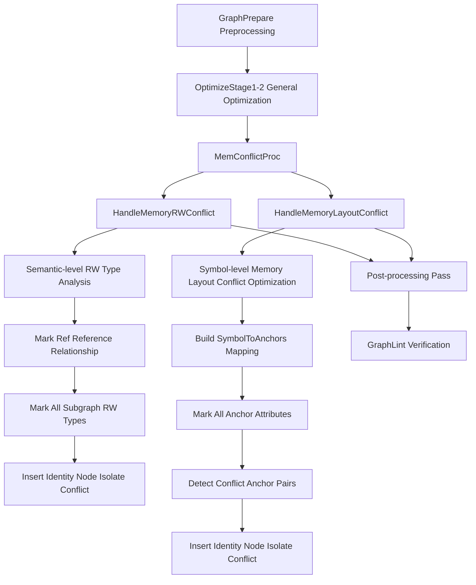
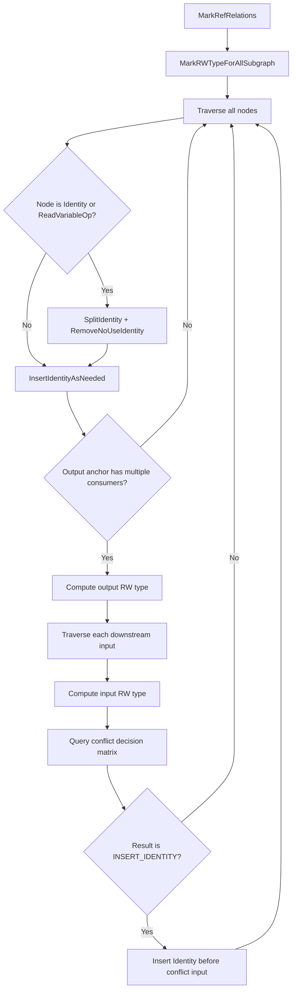
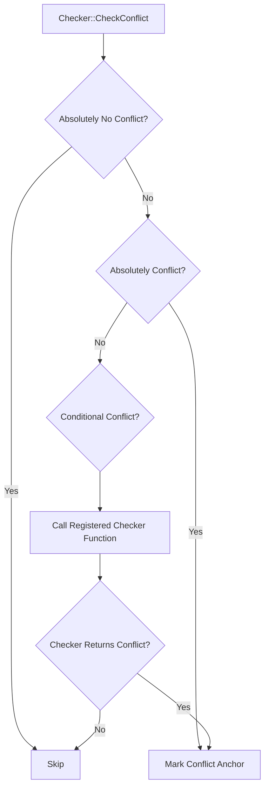
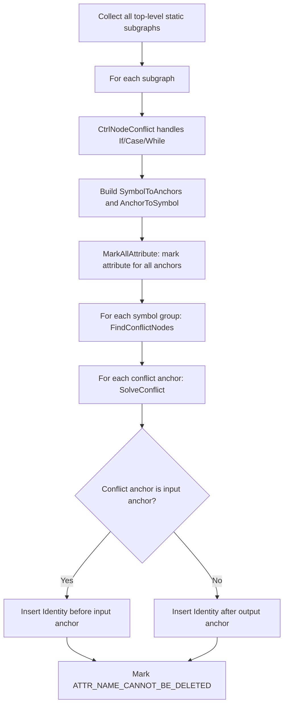
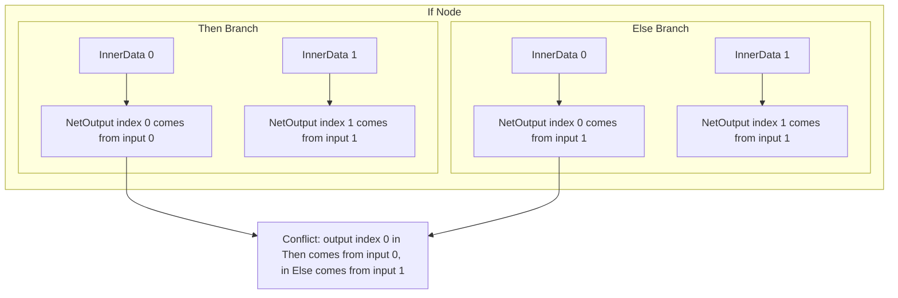
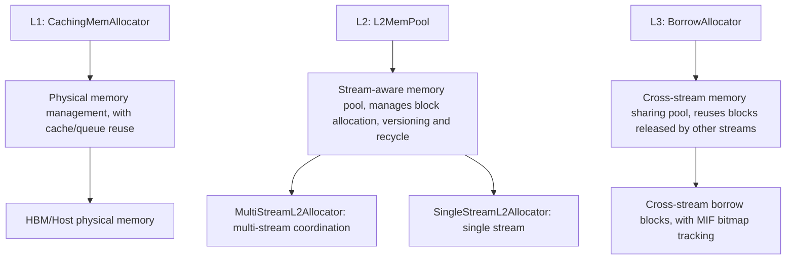
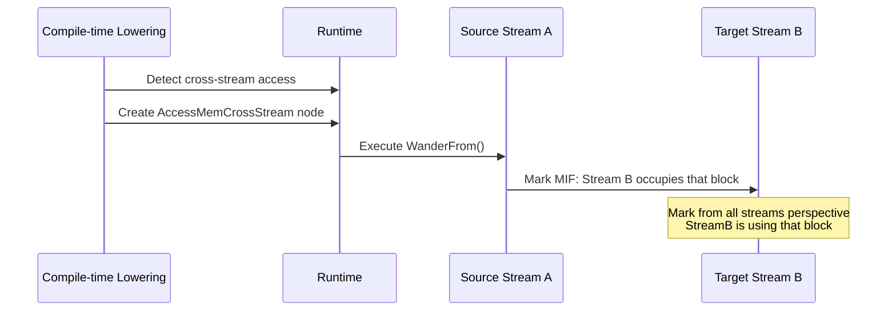
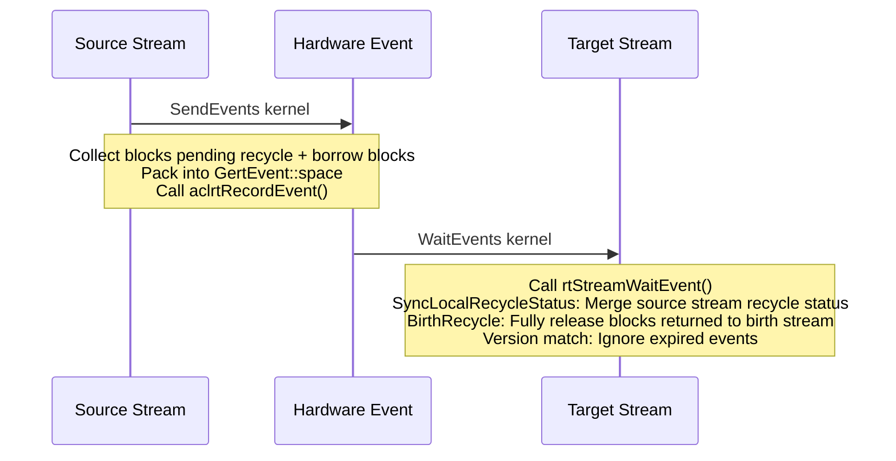

# GE Memory Conflict Analysis and Handling Mechanism

## 1 Overview

In Ascend AI processor graph compilation and execution process, multiple operators may share same physical memory (through symbol table merging, Inplace optimization, reference relationship and other mechanisms). Shared memory brings significant memory savings, but also introduces various conflict risks: read write timing uncertainty, memory attribute incompatibility, subgraph address isolation insufficient, atomic operation accumulation error, multi-stream concurrent reclamation and others.

GE (Graph Engine) establishes complete memory conflict protection system at compiler and runtime two levels, covering semantic-level read write conflict detection, symbol-level memory layout conflict detection, subgraph address isolation, zero-copy address passing, Inplace reuse conflict check, and runtime phase multi-stream concurrent memory lifecycle management. This document from system design perspective, comprehensively analyzes this mechanism.

---

## 2 Conflict Classification

Memory conflicts according to generation cause and stage, can be divided into following categories:

| Conflict Type | Generation Scenario | Detection Stage | Hazard Level |
| --------- | --------- | --------- | --------- |
| Semantic read write conflict | One output simultaneously consumed by read operator and write operator | Compiler optimization | High (accuracy error) |
| Memory layout conflict | Anchors sharing same symbol have incompatible memory attributes | Compiler optimization | High (runtime exception) |
| Subgraph address isolation conflict | While/If/Case subgraph inside and outside share same input address | Compiler Pass | High (data overwrite) |
| HCCL local write conflict | Collective communication operator in-place modifies input memory | Compiler Pass | High (accuracy error) |
| Atomic operation conflict | Atomic operator output memory not cleared zero between iterations | Compiler Pass | High (accumulation error) |
| Conditional branch input-output mapping conflict | If/Case different branches for same output index come from different inputs | Runtime graph build | High (address error) |
| Multi-stream memory lifecycle conflict | Cross-stream accessed memory reclaimed by target stream before source stream releases it | Runtime execution | High (data corruption) |

---

## 3 Compiler-side Conflict Handling

Compiler-side memory conflict handling divided into three layers, according to pipeline sequence sequentially execute:



### 3.1 First Layer: Dedicated Memory Conflict Pass

Located at `compiler/graph/passes/memory_conflict/` directory, runs in graph optimization early and mid stages. These Passes preprocess for specific scenarios, avoid subsequent general conflict handling missing boundary cases.

#### 3.1.1 HcclMemcpyPass

**Purpose**: Handle read write conflicts of HCCL operators with `_input_mutable` attribute (such as HcomAllReduce, HcomBroadcast).

**Conflict Scenario**: HCCL operators in-place modify input memory during execution (Scope Write). If this input simultaneously consumed by other operators, then:

- If read before write, not insert Identity also can guarantee accuracy
- If write before read, must insert Identity isolate, otherwise read operator will read overwritten incorrect data

**Handling Strategy**:

1. **Constant/Variable Protection**: If HCCL operator input comes from Const or Variable node, unconditionally insert Identity node in middle, prevent constant being overwritten
2. **Topology Order Judgment**: For non-constant inputs, through node ID (reflecting topological sorting) judge sibling node and HCCL operator execution order. Only when sibling node ID less than HCCL node (i.e., executes first) need insert Identity
3. **Shape Calculation Branch Exemption**: Shape, Rank and other only calculate shape information operators not affected by memory modification, not insert isolation
4. **Broadcast Write-back**: For HcomBroadcast operator, additionally insert Assign node write broadcast result back to Variable
5. **Mark Skip**: Already handled HCCL operators mark `_skip_rw_conflict=true`, avoid subsequent `HandleMemoryRWConflict` duplicate processing

**Execution Timing**: First run in GraphPrepare phase, again run in OptimizeStage1_3 phase (temporary solution, covering no-subgraph scenario `_mutable_input` handling).

#### 3.1.2 HcclContinuousMemcpyPass

**Purpose**: Handle HCCL operators needing continuous input memory (such as HcomAllReduce), when their input comes from Data/Const/Variable, insert Identity to separate address space. Simultaneously handle P2P memory type input scenarios.

#### 3.1.3 SubgraphPass

**Purpose**: Handle While/If/Case subgraph address isolation requirements.

**Core Processing Logic**:

| Scenario | Processing Method |
| ------ | --------- |
| While input shared by multiple consumers | Insert Memcpy (Identity) isolate at While input side |
| While body subgraph Data node output to operator needing continuous input | Insert Memcpy after Data |
| While body subgraph Data directly connected NetOutput and index unchanged | Skip (bypass), avoid needless copy |
| While body subgraph other inputs/outputs | Insert one Identity node after Data and before NetOutput each, ensure loop body memory address independent from outside |
| If/Case subgraph multiple inputs share same source node to NetOutput | Insert Memcpy separate addresses |
| Subgraph NetOutput comes from Const (static graph) | Insert Memcpy prevent constant address being modified by subgraph |
| Subgraph NetOutput comes from Atomic operator | Insert Memcpy isolate atomic operation output address |
| Subgraph NetOutput comes from operator needing continuous output | Insert Memcpy isolate continuous memory address |
| Constant input to While operator | Insert Memcpy externally, prevent loop body overwrite constant |

#### 3.1.4 InplaceSupportCheckPass

**Purpose**: Identify operators can do Inplace (output reuse input memory), and mark `_inplace_support_input_index` attribute.

**Judgment Conditions**: Single output operator, input and output data type and Shape completely match, and input not Data/Const/Variable and other source nodes (these node addresses cannot be overwritten), input predecessor node only has one consumer.

#### 3.1.5 AtomicAddrCleanPass

**Purpose**: Fusion atomic operation address zero clearing. Atomic operators (such as ScatterAdd) use atomic write mode to update output, and the output memory needs to be cleared to zero before iteration starts.

**Processing Strategy**:

- **Non-loop graph**: Insert a unified AtomicAddrClean node at graph head, through control edge connect to all atomic operators and their predecessor nodes, ensure zero clear operation executes before all atomic operators
- **Loop graph**: Insert AtomicAddrClean node individually before each atomic operator, ensure zero clear before every iteration
- **Atomic operator directly connected to NetOutput**: Insert AtomicAddrClean individually, because zero copy may change output address causing zero clear range to be non-contiguous

#### 3.1.6 MemcpyAddrAsyncPass

**Purpose**: In zero copy scenario insert MemcpyAddrAsync node, implement user data address async passing.

**Processing Scenarios**:

- When StreamMerge node input comes from user Data, insert MemcpyAddrAsync to pass address rather than copy data
- Root graph NetOutput Const/Data direct connection scenario, insert MemcpyAddrAsync in scenarios requiring forced copy such as offline compilation
- Address isolation between HCCL operator and RefData, when Feature Map is not refreshable, insert isolation node

#### 3.1.7 MarkSameAddrPass

**Purpose**: In dynamic+static memory reuse mode, mark `ATTR_DYNAMIC_SHAPE_FIXED_ADDR` attribute for operators such as StreamSwitch/LabelSwitchByIndex that require fixed physical address.

#### 3.1.8 SetInputOutputOffsetPass

**Purpose**: Set correct memory offset for nodes marked with `ATTR_NAME_NODE_CONNECT_INPUT`/`ATTR_NAME_NODE_CONNECT_OUTPUT`. Special handling for fusion nodes, HCOM nodes and Concat nodes.

### 3.2 Second Layer: Semantic-level Read-Write Conflict Handling

**Entry**: `GraphOptimize::HandleMemoryRWConflict()`
**File**: `compiler/graph/optimize/mem_rw_conflict_optimize.cc`

This is a general conflict detection and processing system based on node read-write behavior classification.

#### 3.2.1 Read-Write Type Classification

System first classifies read-write types for each node's input and output anchors:

**Input Types (InputRWType)**:

| Type | Meaning | Typical Operators |
| ------ | ------ | --------- |
| `kReadOnly` | Only read input, does not modify | Most common operators |
| `kWriteable` | Modify input, modification is externally visible | Assign, ApplyMomentum |
| `kScopeWriteable` | Modify input, but only visible in local scope | HcomAllReduce, While |

**Output Types (OutputRWType)**:

| Type | Meaning | Judgment Condition |
| ------ | ------ | --------- |
| `kReadOnlyConst` | Constant output | Const/Constant nodes |
| `kReadOnly` | Read-only output, has multiple consumers | Non ref output and downstream has more than one |
| `kSoftRead` | Soft read-only, only one consumer | Non ref output and downstream has only one |
| `kWriteable` | Writable output (ref output) | Output references input through reference |

#### 3.2.2 Conflict Decision Matrix

Based on output type and downstream input type combination, decide whether to insert Identity node for isolation:

```
                      Input:ReadOnly    Input:Writeable    Input:ScopeWriteable
Output:ReadOnlyConst:   NoAction            InsertIdentity       InsertIdentity
Output:ReadOnly:        NoAction            NoAction             InsertIdentity
Output:SoftRead:        NoAction            NoAction             NoAction
Output:Writeable:       NoAction            NoAction             InsertIdentity
```

**Design Considerations**:

- `kSoftRead` (single consumer) does not conflict with any input type combination, because there is no multi-consumer competition
- `kWriteable` output does not conflict with `kReadOnly`/`kWriteable` input, because write operation is expected semantic behavior
- `kScopeWriteable` is the most conflict-prone type: it modifies memory within local scope, but upstream may not know the memory has been modified
- `kReadOnlyConst` output is the type most needing protection: constants must not be modified

#### 3.2.3 Processing Flow



**Key Details**:

- Subgraph processing uses reverse traversal, propagating RW type from innermost subgraph to outer layers
- Nodes already marked with `_skip_rw_conflict` by `HcclMemcpyPass` will be skipped
- Identity nodes are marked with `ATTR_NO_NEED_CONSTANT_FOLDING=false` and `ATTR_NAME_CANNOT_BE_DELETED=true` to prevent subsequent optimization Passes from deleting them

### 3.3 Third Layer: Symbol-level Memory Layout Conflict Processing

**Entry**: `GraphOptimize::HandleMemoryLayoutConflict()`
**File**: `compiler/graph/optimize/mem_layout_conflict_optimize/`

This is a finer-grained conflict detection system based on memory symbol equivalence classes. When multiple anchors share the same memory symbol through `SymbolToAnchors`/`AnchorToSymbol` mappings, the system detects whether these anchors' memory attributes are compatible.

#### 3.3.1 Anchor Attribute Classification

The system defines 14 anchor attributes (AnchorAttribute), each representing one kind of memory constraint:

| Attribute | Meaning | Marked Object |
|------|------|---------|
| `USER_MEMORY_INPUT` | User provided input | Root graph Data nodes |
| `USER_MEMORY_OUTPUT` | User visible output | Root graph NetOutput nodes |
| `IMMUTABLE_ADDRESS_OUTPUT` | Immutable address output | Const/Constant/Variable |
| `UNSUPPORTED_ADDRESS_REFRESH_OPERATOR_INPUT` | Input that does not support address refresh | Specific operator inputs |
| `UNSUPPORTED_ADDRESS_REFRESH_OPERATOR_OUTPUT` | Output that does not support address refresh | Specific operator outputs |
| `CONTINUOUS_INPUT` | Requires continuous input memory | Operators marked with `continuous_input` attribute |
| `CONTINUOUS_OUTPUT` | Produces continuous output memory | Operators marked with `continuous_output` attribute |
| `NOPADDING_CONTINUOUS_INPUT` | No padding continuous input | Operators marked with `_no_padding_continuous_input` |
| `NOPADDING_CONTINUOUS_OUTPUT` | No padding continuous output | Operators marked with `_no_padding_continuous_output` |
| `RTS_SPECIAL_TYPE_INPUT` | RTS special memory type input | P2P memory and other special type inputs |
| `RTS_SPECIAL_TYPE_OUTPUT` | RTS special memory type output | P2P memory and other special type outputs |
| `REFERENCE_OUTPUT` | Reference variable output | Outputs referencing variables through `ref_var_src_var_name` |
| `NORMAL_INPUT` | Normal input | Default |
| `NORMAL_OUTPUT` | Normal output | Default |

#### 3.3.2 Conflict Classification

The system divides conflicts into three categories:

**Absolutely No Conflict**: The following attribute pair combinations never produce conflict and can be directly skipped:

| Attribute A | Attribute B |
|--------|--------|
| `RTS_SPECIAL_TYPE_INPUT` | `NORMAL_OUTPUT` |
| `USER_MEMORY_OUTPUT` | `USER_MEMORY_OUTPUT` |
| `USER_MEMORY_INPUT` | `USER_MEMORY_OUTPUT` |

Additionally, the `REFERENCE_OUTPUT` attribute always belongs to the no-conflict type.

**Absolutely Conflict**: The following attribute pair combinations always conflict, requiring no conditional judgment:

| Attribute A | Attribute B | Conflict Reason |
|--------|--------|---------|
| `USER_MEMORY_INPUT` | `UNSUPPORTED_ADDRESS_REFRESH_OPERATOR_INPUT` | User input address cannot be overwritten by operators that do not support refresh |
| `USER_MEMORY_INPUT` | `RTS_SPECIAL_TYPE_INPUT` | User input cannot use special memory types |
| `USER_MEMORY_OUTPUT` | `RTS_SPECIAL_TYPE_INPUT/OUTPUT` | User output address cannot share with special memory |
| `USER_MEMORY_OUTPUT` | `CONTINUOUS_OUTPUT` | User output may not satisfy continuity requirement |
| `USER_MEMORY_OUTPUT` | `NOPADDING_CONTINUOUS_OUTPUT` | Same as above |
| `IMMUTABLE_ADDRESS_OUTPUT` | `RTS_SPECIAL_TYPE_INPUT` | Immutable address cannot be occupied by special memory types |
| `IMMUTABLE_ADDRESS_OUTPUT` | `CONTINUOUS_INPUT` | Immutable address may not satisfy continuity requirement |
| `CONTINUOUS_INPUT` | `NOPADDING_CONTINUOUS_OUTPUT` | Continuous input and no-padding continuous output alignment requirements may be incompatible |
| `CONTINUOUS_OUTPUT` | `NOPADDING_CONTINUOUS_INPUT` | Same as above |

**Conditional Conflict**: Requires conditional judgment through registered Checker functions. The system provides the registration macro `REGISTER_FUNC(type_a, type_b, func_name)` for registering conditional conflict check functions, with 22 Checkers currently registered.

#### 3.3.3 Checker Registration Framework

The 22 registered Checker functions:

| Checker | Checked Attribute Pair |
|---------|------------|
| `continuous_input_and_continuous_input` | CONTINUOUS_INPUT vs CONTINUOUS_INPUT |
| `continuous_output_and_continuous_input` | CONTINUOUS_OUTPUT vs CONTINUOUS_INPUT |
| `continuous_out_and_continuous_out` | CONTINUOUS_OUTPUT vs CONTINUOUS_OUTPUT |
| `continuous_in_out_and_rts_special_mem_in_out` | CONTINUOUS series vs RTS_SPECIAL series (8 pairs) |
| `user_in_and_continuous_in_out_checker` | USER_MEMORY_INPUT vs CONTINUOUS series (4 pairs) |
| `user_in_and_unrefresh_out_checker` | USER_MEMORY_INPUT vs UNSUPPORTED_ADDRESS_REFRESH_OUTPUT |
| `user_in_and_rts_special_out_checker` | USER_MEMORY_INPUT vs RTS_SPECIAL_TYPE_OUTPUT |
| `user_out_and_unrefresh_out_checker` | USER_MEMORY_OUTPUT vs UNSUPPORTED_ADDRESS_REFRESH_OUTPUT |
| `user_out_and_unrefresh_in_checker` | USER_MEMORY_OUTPUT vs UNSUPPORTED_ADDRESS_REFRESH_INPUT |
| `user_out_and_immutable_out_checker` | USER_MEMORY_OUTPUT vs IMMUTABLE_ADDRESS_OUTPUT |
| `user_out_and_continuous_input` | USER_MEMORY_OUTPUT vs CONTINUOUS_INPUT series (2 pairs) |
| `immutable_out_and_rts_specail_out_checker` | IMMUTABLE_ADDRESS_OUTPUT vs RTS_SPECIAL_TYPE_OUTPUT |
| `immutable_out_and_nopadding_continuous_in_checker` | IMMUTABLE_ADDRESS_OUTPUT vs NOPADDING_CONTINUOUS_INPUT |
| `immutable_out_and_continuous_out_checker` | IMMUTABLE_ADDRESS_OUTPUT vs CONTINUOUS_OUTPUT series (2 pairs) |
| `nopadding_continuous_input_and_nopadding_continuous_input` | NOPADDING_CONTINUOUS_INPUT vs NOPADDING_CONTINUOUS_INPUT |
| `nopadding_continuous_input_and_nopadding_continuous_out` | NOPADDING_CONTINUOUS_INPUT vs NOPADDING_CONTINUOUS_OUTPUT |
| `nopadding_continuous_out_and_nopadding_continuous_out` | NOPADDING_CONTINUOUS_OUTPUT vs NOPADDING_CONTINUOUS_OUTPUT |
| `rts_special_in_and_rts_special_in_checker` | RTS_SPECIAL_TYPE_INPUT vs RTS_SPECIAL_TYPE_INPUT |
| `rts_special_in_and_rts_special_out_checker` | RTS_SPECIAL_TYPE_INPUT vs RTS_SPECIAL_TYPE_OUTPUT |
| `rts_special_out_and_rts_special_out_checker` | RTS_SPECIAL_TYPE_OUTPUT vs RTS_SPECIAL_TYPE_OUTPUT |
| `unrefresh_in_checker` | UNSUPPORTED_ADDRESS_REFRESH_INPUT vs special types |
| `unrefresh_out_checker` | UNSUPPORTED_ADDRESS_REFRESH_OUTPUT vs special types |
| `unrefresh_in_and_unrefresh_out_checker` | UNKNOWN_ADDRESS_REFRESH_INPUT vs UNKNOWN_ADDRESS_REFRESH_OUTPUT |
| `unrefresh_out_and_unrefresh_out_checker` | UNKNOWN_ADDRESS_REFRESH_OUTPUT series |

Checker conflict detection execution flow:



Key Checker judgment logic:

- **continuous_output_and_continuous_input**: Determine whether actual memory range overlap conflict exists between continuous output and continuous input
- **user_in_and_unrefresh_out_checker**: Determine whether user input shares address with output that does not support address refresh, preferentially insert Identity on the side of the node that does not support refresh
- **user_out_and_immutable_out_checker**: User output cannot share address with constant/variable (would cause immutable data to be overwritten)
- **nopadding_continuous_input_and_nopadding_continuous_input**: When two operators requiring no-padding continuous input share the same symbol, address alignment requirements may cause conflict

#### 3.3.4 Control Flow Subgraph Conflict Handling

Before the main symbol-level conflict detection, `CtrlNodeConflict` specifically handles If/Case/While control flow node subgraph conflicts:

**If/Case Conflict Handling**:
- Check whether each branch subgraph's Data node directly connects to NetOutput
- Check whether a single output node is referenced by multiple inputs of NetOutput (shared address)
- For detected conflicts, insert Identity isolation within the subgraph

**While Conflict Handling**:
- Check the index mapping relationship from Data to NetOutput in While body
- If input index differs from output index (data position changed within loop body), insert Identity to guarantee address correspondence
- Insert Identity nodes after Data and before NetOutput in While body

#### 3.3.5 Processing Flow



### 3.4 Inplace Memory Reuse and Conflict Check

**File**: `compiler/graph/build/memory/mem_inplace.cc`

Inplace optimization allows output tensor to reuse input tensor's memory address, and is an important means to reduce memory footprint. But Inplace introduces extra read-write conflict risk, requiring strict conflict check.

**Processing Flow**:

1. **Identify read-only symbols**: Mark symbols from Data/Variable/Const as read-only
2. **Get Inplace candidates**: Through `GetSupportInplaceOutput` get outputs that support Inplace
3. **Size filter**: Only allow Inplace where input output size exactly matches
4. **Read conflict filter**: If input symbol comes from read-only data source (variable), Inplace is not allowed
5. **Write conflict filter**: If output needs continuous memory or shares memory with variable, Inplace is not allowed
6. **Symbol conflict check**: After merging input output symbols, use `MemLayoutConflictUtil::IsGraphExistMemConflictSymbol` to check whether new conflict is produced
7. **Merge symbol table**: If all checks pass, merge symbol table to implement Inplace

### 3.5 Post-compilation Verification (GraphLint)

**File**: `compiler/graph/preprocess/checker/graph_lint.cc`

After compilation completes, `GraphLint` performs final read-write conflict verification, which is a diagnostic check (issues warning rather than error termination).

**Verification Logic**:

1. Pre-calculate each node input's RW type (`kReadOnly`/`kWritable`/`kCanIgnore`)
2. Build graph-level connection matrix (`ConnectionMatrix`), record reachability between nodes
3. For each output anchor with 2+ consumers:
   - Collect all write nodes and read nodes
   - Check whether any two write nodes have control dependency (judge reachability through connection matrix)
   - Check whether each write node and each read node have control dependency
   - If no control dependency exists, execution order is uncertain, issue `W18888` warning

---

## 4 Runtime-side Conflict Handling

Runtime-side conflict handling mainly focuses on conditional branch address mapping and multi-stream concurrent memory lifecycle management.

### 4.1 Conditional Branch Conflict Handling

**File**: `runtime/v2/graph_builder/bg_condition.cc`

#### 4.1.1 Branch Chain Conflict Detection (CalcChainConflictSolvePolicy)

For If/Case nodes, different branch subgraphs may map the same output index to different input sources:



**Detection Rule**: For each output index, if the input index set size mapped by each branch exceeds 1, then that index is a conflict index (`conflict_indexes`).

**Solution**: For each conflict index, insert `PointFromInputs` node before InnerNetOutput in all branch subgraphs. `PointFromInputs` at runtime is zero overhead passthrough node (only pass pointer), its purpose is to clarify data source at graph structure level.

#### 4.1.2 Resource Lifecycle Extension (CalcSubgraphGuardersPolicy)

When resources inside subgraph (memory blocks with `FreeMemory` guard) cross subgraph boundary, the lifecycle needs to be extended to parent graph:

| Scenario | Processing Method |
| ------ | --------- |
| Subgraph internal memory guard, resource needs pass out | Remove guard inside subgraph, create new guard in parent graph + insert `IdentityAddr` inside subgraph to increase reference count |
| Resource comes from parent graph input, subgraph has guard | Add guard in parent graph + increase reference count inside subgraph |
| Current branch has no guard, other branches have | Insert `IdentityAddr` to align lifecycle across branches |

### 4.2 Multi-stream Memory Lifecycle Management

Runtime uses three-layer allocator architecture and event-based synchronization mechanism to manage memory conflicts under multi-stream concurrency.

#### 4.2.1 Three-layer Allocator Architecture



#### 4.2.2 MIF (Multi-stream Independent Flags)

**File**: `runtime/v2/kernel/memory/mif.h`

MIF is a bitmap structure on each memory block, tracking which streams are currently using ("occupying") that block:

- `stream_ids_to_bits_[maintained_stream]` is a bitmap, bit `i` means "from `maintained_stream`'s perspective, stream `i` is still using that block"
- `Set(stream_a, stream_b)`: Mark stream `b` is using that block (from stream `a` perspective)
- `SetAll(stream)`: From all streams' perspectives mark stream `stream` is using that block
- `IsAnySet(stream)`: Check from a stream's perspective, whether other streams are still using that block

#### 4.2.3 Three Recycle Modes

**File**: `runtime/v2/kernel/memory/multi_stream_mem_block.cc`

| Recycle Mode | Trigger Condition | Behavior |
| --------- | --------- | ------ |
| Birth Recycle | Birth stream no longer needs that block, and no other streams hold reference | Physical memory is returned to pool |
| Borrow Recycle | Block migrates from current stream to BorrowAllocator | MIF reset, waiting for other stream reuse |
| Local Recycle | Other stream references still exist | Add to `local_recycle_blocks_` waiting for event sync processing |

#### 4.2.4 Cross-stream Memory Access (AccessMemCrossStream)

When a tensor is allocated on stream A but consumed on stream B:



- Host memory: Directly `ShareFrom` (share pointer), no stream constraint
- Device memory: Perform cross-stream wander through `WanderFrom`, call `MultiStreamMemBlock::NewAccessStream` to mark MIF
- `AccessMemCrossStream` is registered with `kKernelUseMemory` because `ShareFrom`/`WanderFrom` changes shared TensorData, reference-count, or cross-stream MIF state. Its runtime-dependent placement makes it ineligible as a direct producer for `RemoveLaunchFreeEdge`, so the original Launch-to-Free edge is preserved.

#### 4.2.5 Event-driven Stream Synchronization

**File**: `runtime/v2/kernel/common_kernel_impl/event.cc`, `runtime/v2/graph_builder/multi_stream/bg_event.cc`



**Three Event Sync Stages**:

| Stage | Timing | Function |
| ------ | ------ | ------ |
| `kFirstSyncStage` | Execution start | Main stream syncs to sub stream |
| `kLastSyncStage` | Execution end | Sub stream syncs to main stream |
| `kLastResourceCleanStage` | Final cleanup | Force sync all streams, recycle all memory |

#### 4.2.6 Version Block Tracking (VersionBlocks)

**File**: `runtime/v2/kernel/memory/version_blocks.h`

Memory block version number increments after each recycle and re-allocation. Through version match avoid processing expired events:

- `StreamedVersionBlock` contains version number and sent flag
- `FindNext()` Automatically skip already sent or expired entries
- `FindNextForAll()` Used for `LastWaitEvents` global cleanup

### 4.3 IO Address Reuse Verification

**File**: `runtime/v2/core/model_v2_executor.cc`

At model load, compiler marks which outputs reuse input memory through `ATTR_MODEL_OUTPUT_REUSE_INPUT_MEM_INDEXES` attribute (Inplace scenario). Runtime verifies address match through `CheckIoReuseAddrs` before each execution, ensuring Inplace constraints are satisfied.

### 4.4 Cross-storage Location Data Transfer

**File**: `runtime/v2/lowering/placement/placed_lowering_result.cc`

When tensor needs to move between different storage locations (Host/HBM/P2P), system automatically generates corresponding copy nodes:

| Source → Target | Generated Node |
| ----------- | --------- |
| Host → HBM | CopyH2D |
| HBM → Host | SyncStream + CopyD2H + FreeMemory |
| HBM → P2P | P2P Copy |
| P2P → Host | SyncStream + CopyD2H |
| Host → Host | No copy needed |

Before Device to Host copy, `SyncStream` node must be inserted, ensuring device-side computation completes before copy.

---

## 5 Key Attribute Summary

Following attributes span compiler and runtime, and are core to understanding memory conflict handling and address isolation:

| Attribute Name | String Value | Setter | Consumer | Purpose |
| -------- | --------- | -------- | -------- | ------ |
| `ATTR_NAME_MODIFY_INPUT` | `_input_mutable` | Operator registration | HcclMemcpyPass, mem_rw_conflict_optimize | Mark operator modifies input |
| `_skip_rw_conflict` | `_skip_rw_conflict` | HcclMemcpyPass | mem_rw_conflict_optimize | Skip already processed HCCL nodes |
| `ATTR_NAME_CONTINUOUS_INPUT` | `continuous_input` | Operator registration | SubgraphPass, mem_layout_conflict | Mark requires continuous input memory |
| `ATTR_NAME_CONTINUOUS_OUTPUT` | `continuous_output` | Operator registration | SubgraphPass, mem_layout_conflict | Mark produces continuous output memory |
| `ATTR_NAME_NOPADDING_CONTINUOUS_INPUT` | `_no_padding_continuous_input` | Operator registration | mem_layout_conflict | No padding continuous input |
| `ATTR_NAME_NOPADDING_CONTINUOUS_OUTPUT` | `_no_padding_continuous_output` | Operator registration | mem_layout_conflict | No padding continuous output |
| `ATTR_NAME_REFERENCE` | `reference` | Operator registration | mem_rw_conflict, mem_inplace | Output reference input |
| `INPLACE_SUPPORT_INPUT_INDEX` | `_inplace_support_input_index` | InplaceSupportCheckPass | mem_inplace | Mark supported Inplace input index |
| `REF_VAR_SRC_VAR_NAME` | `ref_var_src_var_name` | Operator registration | mem_layout_conflict, AtomicAddrCleanPass | Output referenced variable name |
| `ATTR_NAME_CANNOT_BE_DELETED` | - | Each conflict Pass | Subsequent optimization Pass | Prevent conflict isolation node from being optimized and deleted |
| `ATTR_NO_NEED_CONSTANT_FOLDING` | - | Each conflict Pass | Constant folding Pass | Prevent conflict isolation node from being constant folded |
| `ATTR_DYNAMIC_SHAPE_FIXED_ADDR` | - | MarkSameAddrPass | Memory allocator | Requires fixed physical address under dynamic shape |
| `ATTR_MODEL_OUTPUT_REUSE_INPUT_MEM_INDEXES` | `output_reuse_input_mem_indexes` | Compiler memory allocation | Runtime model_v2_executor | Mark Inplace IO address correspondence |

---

## 6 Overall Pipeline

Chaining compiler and runtime conflict handling, the complete memory conflict protection pipeline is as follows:

```mermaid
flowchart TD
    subgraph "Compiler - Graph Prepare Stage"
        P1[HcclMemcpyPass first run]
        P2[SubgraphPass: While/If/Case address isolation]
        P3[InplaceSupportCheckPass: mark Inplace candidates]
        P4[AtomicAddrCleanPass: atomic operation zero clear]
    end

    subgraph "Compiler - Optimization Stage"
        P5[HcclMemcpyPass second run]
        P6[MemcpyAddrAsyncPass: zero copy address pass]
        P7[MarkSameAddrPass: fixed address mark]
    end

    subgraph "Compiler - Memory Conflict Handling"
        P8[HandleMemoryRWConflict: semantic-level conflict detection]
        P9[HandleMemoryLayoutConflict: symbol-level conflict detection]
    end

    subgraph "Compiler - Memory Allocation Stage"
        P10[ProcessInplace: Inplace memory reuse + conflict check]
        P11[SetInputOutputOffsetPass: offset setting]
    end

    subgraph "Compiler - Verification"
        P12[GraphLint: final conflict verification]
    end

    subgraph "Runtime - Graph Build"
        R1[CalcChainConflictSolvePolicy: conditional branch conflict]
        R2[CalcSubgraphGuardersPolicy: resource lifecycle extension]
        R3[AccessMemCrossStream: cross-stream memory tracking]
    end

    subgraph "Runtime - Execution"
        R4[SendEvents/WaitEvents: event-driven sync]
        R5[MIF bitmap: multi-stream occupancy tracking]
        R6[VersionBlocks: expired event filter]
        R7[CheckIoReuseAddrs: IO address reuse verification]
    end

    P1 --> P2 --> P3 --> P4 --> P5 --> P6 --> P7
    P7 --> P8 --> P9 --> P10 --> P11 --> P12
    P12 --> R1 --> R2 --> R3 --> R4
    R4 --> R5 --> R6 --> R7
```



---

## 7 Summary

GE's memory conflict protection and address isolation system reflects the following design philosophy:

**Layered Protection, Progressive Depth**: From early dedicated Passes (handling HCCL, subgraph, atomic operation and other known patterns), to semantic-level RW type analysis (general read-write conflict), then to symbol-level fine detection (memory layout attribute compatibility), each layer handles conflicts of different granularity. Early Passes handle known specific patterns to avoid general analysis missing edge cases; general analysis covers all scenarios.

**Identity Node as Basic Address Isolation Means**: Almost all conflict solutions boil down to "insert Identity/Memcpy node at conflict point", separating two anchors sharing the same address into different address spaces. Isolation nodes are marked as non-deletable and non-constant-foldable, ensuring isolation effect persists throughout the compilation flow.

**Compile-time Prevention + Runtime Verification**: The compiler handles most conflict detection and resolution work, while runtime is responsible for dynamic memory lifecycle management and IO address verification in multi-stream concurrent scenarios.

**Symbol Equivalence Class-driven Memory Planning**: Through `SymbolToAnchors`/`AnchorToSymbol`, all anchors sharing the same physical address are organized into equivalence classes. Conflict detection is performed within equivalence classes, ensuring incompatible memory attributes do not share the same address.

**Inplace Reuse and Conflict Protection Balance**: Inplace optimization reduces memory footprint by reusing input memory, but must pass strict conflict checks (read-only symbol protection, continuous memory constraint, symbol merge conflict detection), ensuring reuse does not introduce new conflicts.
