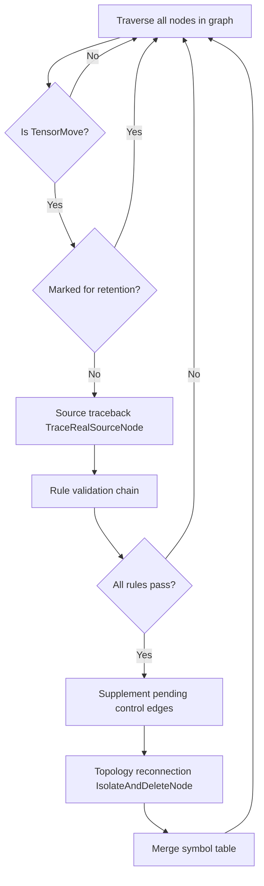
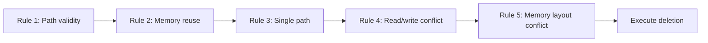

# TensorMove Elimination Optimization Feature

## 1. Feature Background

In the GE graph compiler, the `TensorMove` operator essentially performs a memory copy (memcpy), completely copying source Tensor data to a new target memory. Its existence in the graph serves to **isolate the lifecycle of two memory segments** — ensuring that subsequent operator write operations on this data do not affect the original data area.

However, `TensorMove` is not necessary in all scenarios. When no write conflict exists from the data source to the final consumption point (that is, the source memory will not be overwritten), retaining `TensorMove` only adds a meaningless device memory copy, causing delay and bandwidth waste. Especially in inference scenarios, a model converted through a framework adapter may carry many redundant `TensorMove` nodes. Eliminating them layer by layer significantly improves end-to-end performance.

The core goal of the TensorMove elimination feature is: **Identify and delete redundant TensorMove nodes in the computation graph while ensuring correctness, reducing unnecessary device memory copies**.

This optimization is registered at the O3 optimization level (highest level), automatically executing with the standard optimization pipeline, transparent to users.

## 2. Scenarios

### Scenario 1: Single Path, Direct Connection
```
Before optimization:  op1 -> TensorMove -> op2
After optimization:   op1 -> op2
```
The source node has only one consumer, and no write conflict exists.

### Scenario 2: Single Path, Indirect Connection
```
Variant 1, through RefOp
op1 -> RefOp -> TensorMove -> op2

Variant 2, through subgraph
op1 -> PartitionedCall -> TensorMove -> op2
PartitionedCall carries a subgraph, the subgraph is data -> NetOutput

Variant 3, drill into subgraph
PartitionedCall -> TensorMove -> op2
PartitionedCall carries a subgraph, the subgraph is op1 -> NetOutput

Variant 4, drill out of subgraph
op1 -> PartitionedCall
PartitionedCall carries a subgraph, the subgraph is data -> TensorMove -> op2

All the above variants, and more complex combination scenarios, are equivalent to op1 output connecting to TensorMove, and all support eliminating TensorMove
```

### Scenario 3: Single Path, Source Node is Root Graph Data
```
Data -> TensorMove -> op2
```
Since the Data address is actually the model input address passed by the user, TensorMove can only be deleted when it is confirmed that this memory is modifiable.
Note: This assumes the TensorMove successor node modifies the input. If optimization is needed in the future, more precise judgment can be applied.

### Scenario 4: Single Path, Source Node is Variable/Const
```
Variable/Const -> TensorMove -> op2
```
The system checks whether op2 modifies the input. If op2 does not modify the input, TensorMove is eliminated.
Only the direct successor node of TensorMove is checked; the check does not penetrate reference nodes or subgraphs.

Additionally, when op2 is a special node, such as NetOutput or If and other nodes carrying subgraphs, a conservative strategy is applied and TensorMove is retained.
```
Variable/Const -> TensorMove -> NetOutput/PartitionedCall/If/While...
```

### Scenario 5: Single Output Multiple References (Decision Based on Read/Write Behavior for Control Edge Supplementation)

This scenario handles deletion decisions when a single output of the source node is simultaneously referenced by `TensorMove` and other consumers (Siblings). The handling is divided into three cases based on the read/write behavior of the Sibling and the TM successor (TM_succ):

**Case A: Sibling Overwrites Source**

```
Before optimization:
  Source[0] -> Sibling(kWriteable/kScopeWriteable)
  Source[0] -> TensorMove -> TM_succ
After optimization:
  Delete TensorMove only when a direct control edge TM_succ -> Sibling already exists in the graph
```

- The Sibling overwrites source memory through unified read/write relationships (`IsNodeInputWritable` returns true). After deleting TM, the Sibling directly reads and writes source memory.
- An external TM_succ -> Sibling control edge must already exist to preserve ordering. The Pass does not infer semantic direction on its own.

**Case B: Sibling is Read-Only, TM_succ Overwrites Source**

```
Before optimization:
  Source[0] -> Sibling(read-only)
  Source[0] -> TensorMove -> TM_succ(kWriteable/kScopeWriteable)
After optimization:
  Source[0] -> Sibling
  Source[0] -> TM_succ
  Sibling -.ctrl.-> TM_succ
```

- The Sibling is read-only and TM_succ overwrites source memory. After deleting TM, a read-before-write hazard exists.
- A Sibling -> TM_succ pending control edge is registered to preserve ordering, ensuring the bypass finishes reading source memory before the successor overwrites it.
- Whether deletion ultimately proceeds still requires passing the unified RW conflict check in Rule 4. If a conflict exists between Source(out) and TM_succ(in) after deletion, TensorMove is retained and the pending control edge is not landed.

**Case C: Sibling is Read-Only, TM_succ is Also Read-Only**

```
Before optimization:
  Source[0] -> Sibling(read-only)
  Source[0] -> TensorMove -> TM_succ(read-only)
After optimization:
  Source[0] -> Sibling
  Source[0] -> TM_succ
  (no control edge supplemented)
```

- No read/write hazard exists between two read-only operations. After deleting TM, the source lifecycle is guaranteed by the Source -> TM_succ data edge.
- Supplementing a control edge contributes zero correctness benefit and only narrows scheduling concurrency, so no edge is supplemented.

**Other Constraints:**
- In the single output multiple reference scenario, only direct connection scenarios are evaluated.
- Self-loop and reverse reachability checks are performed on new control edges to avoid converting the DAG into a cyclic graph.
- When deletion or edge supplementation fails, the newly added control edges for the current round are rolled back.

## 4. External Interfaces

The TensorMove elimination feature does not provide an independent API call entry. It runs automatically as a standard optimization Pass in the GE compilation pipeline. Users indirectly control its behavior through the following configuration items:

### 4.1 Graph Compilation Options

| Configuration Item | Description | Example Value |
|--------|------|--------|
| `ge.exec.outputReuseInputMemIndexes` | Declares which outputs reuse which inputs' memory. Format is `output_index,input_index` pairs, multiple pairs separated by `\|` | `"0,0\|1,1"` |
| `ge.exec.inputReuseMemIndexes` | Declares which inputs participate in memory reuse. Format is a comma-separated input index list | `"0"` or `"0,1"` |

These two configuration items only take effect in Scenario 2 and Scenario 3 (zero-copy scenarios where the source node is `Data`). When the data source of `TensorMove` is a normal computation node or a special node (Variable/Const) and the safe successor condition is met, elimination proceeds automatically without any configuration.

### 4.2 Node Retention Attributes

Other optimization Passes can mark a `TensorMove` node as non-deletable through the following attributes:

| Attribute Name | Description |
|--------|------|
| `_cannot_be_deleted` | Boolean attribute, marking this node as non-deletable by any Pass |
| `no_need_constant_folding` | Boolean attribute, marking this node as not participating in constant folding, implying non-deletable semantics |

`InnerIdentityAddPass`, `SubgraphPass`, `HcclContinuousMemcpyPass`, and other memory conflict handling Passes set both of these attributes when inserting `Identity` nodes, preventing newly inserted nodes from being mistakenly deleted by subsequent optimizations.

### 4.3 Optimization Level

`TensorMoveDeletePass` is registered at the O3 optimization level, belonging to the highest optimization rank. Registered through `REG_PASS_OPTION("TensorMoveDeletePass").LEVELS(OoLevel::kO3)`, enabled by default.

## 5. Specific Implementation

### 5.1 Overall Architecture

TensorMove elimination is implemented by `TensorMoveDeletePass`, which inherits from `BaseNodePass` and traverses all operators in the graph by node. After the Phase 2 optimization, its core logic consists of three phases:



Implementation code is located at:
- Header file: `compiler/graph/passes/standard_optimize/tensor_move_delete_pass.h`
- Implementation file: `compiler/graph/passes/standard_optimize/tensor_move_delete_pass.cc`

Pass registration and integration:
- Registration: Through the `REG_PASS_OPTION("TensorMoveDeletePass").LEVELS(OoLevel::kO3)` macro
- Call entry: The `OptimizeTensorMove` function in `compiler/graph/manager/graph_manager.cc`
- Compilation phase: Executed in `PreRunAfterOptimizeSubGraph`, immediately after `OptimizeGraphBeforeBuild`

### 5.2 Core Data Structures

The `TensorMoveDeleteContext` structure encapsulates all context information needed for a single elimination decision:
- `tensor_move`: The current TensorMove node to be evaluated
- `path_to_source_node`: The path from TensorMove tracing back to the real source node, recording all nodes along the way and their corresponding output anchors
- `pending_control_edges`: The list of control edges to be landed (used for ordering in the single output multiple reference scenario)
- `anchor_to_symbol`: The anchor-to-symbol mapping (used for memory layout conflict checking)
- `symbol_to_anchors`: The list of anchors under each symbol
- `has_symbol_table`: Whether the symbol table was successfully constructed

`DeleteRule` is a function object type (`std::function<bool(TensorMoveDeleteContext&)>`), used to abstract each judgment rule as an independent predicate function, executing in rule chain form in the `Run` method.

### 5.3 Phase 1: Source Traceback (TraceRealSourceNode)

This is the most complex part of the entire feature. The direct predecessor node of `TensorMove` may not be the real data source — the middle may have subgraph boundaries, RefOp pass-through, or even other TensorMove nodes. The `TraceRealSourceNode` function is responsible for starting from the TensorMove input port, tracing back data flow in reverse, and finding the real source node that produces the data.

The traceback process has four pass-through capabilities:

**1. Jump Out Across Subgraph Boundary**

When traceback encounters a `Data` node inside a subgraph (not the root graph), it means data comes from the parent graph. Through the `JumpOutFromSubDataToTraceSource` function, use `NodeUtils::GetParentInDataAnchor` to locate the predecessor node of the corresponding Wrapper node (such as `PartitionedCall`) in the parent graph, and continue traceback in the parent graph.

**2. Drill Into Subgraph (PartitionedCall)**

When traceback encounters a `PartitionedCall` node, it means data is produced inside the subgraph. Through the `JumpInPartitionedCallToTraceSource` function, parse the `ATTR_NAME_PARENT_NODE_INDEX` attribute of the subgraph `NetOutput`, find the mapping from output port to the internal producer inside the subgraph, and switch tracking to the subgraph interior to continue traceback.

**3. RefOp Pass-through**

`Reshape`, `Cast`, and other RefOp outputs directly reuse the input memory address (judged through `GraphUtils::IsRefFromInput`). The traceback process automatically skips such nodes, continuing to trace upward along their reused input port.

**4. Control Flow Operator Termination**

When the traceback path encounters `IF`, `WHILE`, `CASE`, and other multi-branch control flow operators, it is treated as a traceback boundary, stopping tracking. This is because the existence of control flow means data flow has uncertainty, and it is not possible to safely judge at compilation time whether elimination is possible.

### 5.4 Phase 2: Rule Validation Chain

After the Phase 2 optimization, once the source is traced, the system determines whether safe deletion is possible through chain execution of five rules:



**Rule 1: CheckPathToSourceNodeValid — Path Validity Check**

- The path cannot be empty (indicating the source cannot be found)
- The source node cannot be a multi-branch control flow operator
- When the source node is a special node (Variable/Const and so on), passage is allowed only when the TensorMove successor does not overwrite source memory (relaxed in Phase 2)

**Rule 2: CheckSourceNodeReuse — Memory Reuse Check**

This rule only triggers when the source node is `Data` type. `Data` node represents the external input of the graph, and its memory is managed by the user. Deleting `TensorMove` means subsequent operators directly read and write this external memory. Therefore, deletion is only allowed when the user explicitly declares through `ge.exec.outputReuseInputMemIndexes` or `ge.exec.inputReuseMemIndexes` that this input participates in memory reuse.

The memory reuse check is implemented through the `IsMemoryReuseAllowed` function, which first checks `outputReuseInputMemIndexes` (precise output-input pair mapping), then checks `inputReuseMemIndexes` (only declaring which inputs can reuse).

**Rule 3: CheckSinglePath — Single Path Check**

This rule is implemented by `IsSourceNodeWithSinglePath`, used to prove that after deleting `TensorMove`, the read and write order of source memory remains controllable. The validation target is the traceback path from the real source node to the current `TensorMove`. When any node on the path does not meet the conditions, `TensorMove` is retained.

Basic validation includes:
- Path nodes cannot be `IF` / `CASE` / `WHILE` and other multi-branch control flow operators.
- RefOp cannot have multiple connected outputs reusing the same input (`HasMultipleOutputsSharingSameInput`). Otherwise, the same input memory is referenced by multiple output paths, and the current rule cannot prove the complete lifecycle.
- When the output anchor consumer count exceeds 1, the "single output multiple reference" branch is entered (new in Phase 2), instead of simply passing through as a single path.

Single output multiple reference handling logic:
- Filter through `CollectSiblingConsumers`, only processing cases where TensorMove is a direct consumer and bypasses exist
- For each bypass, call `CheckSiblingAgainstSuccessors`:
  - Check hard constraints on the bypass itself: type, same-graph membership, whether output reuses input (`IsSiblingConsumerDeletable`)
  - When the bypass overwrites source memory, require that an external `TM successor -> bypass` direct control edge already exists
  - When the bypass is a TensorMove, treat it as a read-only consumer and do not reject (relaxed in Phase 2)
  - When the bypass is read-only and the TM successor overwrites source memory, register a `bypass -> TM successor` pending control edge
- Before edge supplementation, call `WouldCreateControlCycle` to check whether a cycle would be created

**Rule 4: CheckRWConflictOnDelete — Read/Write Conflict Check (New in Phase 2)**

Call the external interface `WouldDeleteTensorMoveCauseRWConflict` of `mem_rw_conflict_optimize` to determine whether deleting TensorMove would cause a read/write conflict.

Check flow:
```
For each successor node tm_succ of TM:
  1. GetOutputRWTypeByIndex(src_node, src_out_idx) -> out_type
  2. GetInputRWTypeByIndex(tm_succ, tm_succ_in_idx) -> in_type
  3. GetConflictResultBetweenNode(out_type, in_type) -> result
  4. result != DO_NOTHING -> conflict exists, reject deletion
```

**Rule 5: CheckMemLayoutConflictOnDelete — Memory Layout Conflict Check (New in Phase 2)**

Based on the symbol table and `IsGraphExistMemConflictSymbol`, determine whether deleting TensorMove would cause a memory layout conflict.

Check flow:
```
1. Get the symbol corresponding to the TM input anchor: input_symbol = anchor_to_symbol[NodeIndexIO(tm, 0, kIn)]
2. Get the symbol corresponding to the TM output anchor: output_symbol = anchor_to_symbol[NodeIndexIO(tm, 0, kOut)]
3. If input_symbol == output_symbol: same symbol, deletion does not introduce new conflict -> allow
4. Call ConstructSingleNodeSymbolTable to merge symbols (simulate deletion)
5. Call IsGraphExistMemConflictSymbol to determine whether conflict exists after merging
6. has_conflict == true -> reject deletion
```

### 5.5 Phase 3: Topology Reconnection and Symbol Table Maintenance

After all five rules pass, first call `ApplyPendingControlEdges` to land the pending control edges, then call `IsolateAndDeleteNode(node, {0})` to execute deletion.

**Topology Reconnection** (`IsolateAndDeleteNode`):
- Directly connect the upstream output anchor corresponding to the 0th input anchor of TensorMove to all downstream input anchors corresponding to the 0th output anchor of TensorMove
- Disconnect all data edges and control edges of the TensorMove node
- Remove this node from the graph

**Symbol Table Maintenance** (New in Phase 2):
After deleting TensorMove, the anchors on the TM input side and output side are merged to the same symbol, and the symbol table must be updated:
```
1. Find input_symbol and output_symbol
2. If they differ:
   a. Change all entries in anchor_to_symbol with value output_symbol to input_symbol
   b. Merge symbol_to_anchors[output_symbol] into symbol_to_anchors[input_symbol]
   c. Erase symbol_to_anchors[output_symbol]
```

### 5.6 Collaboration Relationship with Other Passes

TensorMove elimination does not work in isolation. It has collaboration relationships with multiple Passes in the compilation pipeline:

**InnerIdentityAddPass -> TensorMoveDeletePass**

`InnerIdentityAddPass` needs to insert `Identity` nodes on the input side of RefOp (such as the Assign operator) to isolate read/write conflicts when handling RefOp memory conflicts. However, if the RefOp input is exactly a `TensorMove` with only a single output, then `TensorMove` itself already provides isolation, and there is no need to insert `Identity`. This logic is implemented in `InnerIdentityAddPass` by checking the predecessor node type.

**SubgraphPass / HcclContinuousMemcpyPass -> TensorMoveDeletePass**

These memory conflict handling Passes set the `_cannot_be_deleted` and `no_need_constant_folding` attributes when inserting protection nodes. `TensorMoveDeletePass` checks these two attributes through the `HasReservedAttr` function at the `Run` method entry, ensuring these marked nodes are not mistakenly deleted.

**TensorMoveDeletePass Execution Timing**

In `GraphManager::PreRunAfterOptimizeSubGraph`, the TensorMove elimination execution timing is:

```
OptimizeWholeGraph -> Optimize2 -> OptimizeGraphBeforeBuild -> OptimizeTensorMove -> MemConflictProc
```

OptimizeTensorMove internal flow (new in Phase 2):
```
1. InitRWConflictCheck(compute_graph)  // Initialize RW conflict detection
2. TensorMoveDeletePass::Init(compute_graph)  // Construct symbol table
3. TensorMoveDeletePass::Run  // Traverse nodes, execute deletion
```

TensorMove elimination executes after graph structure optimization completes and before memory conflict handling. This timing design is reasonable — let other optimization Passes complete graph structure simplification and transformation first, then execute TensorMove elimination on the stabilized graph, and finally let the memory conflict handling Pass evaluate the elimination result and insert protection nodes when necessary.

### 5.7 Key Design Decisions

**Why Use Traceback Instead of Forward Propagation?**

TensorMove elimination judgment depends on "what is the data source" information. Forward propagation needs to traverse the entire graph starting from all sources, while traceback only needs to search in reverse starting from the TensorMove node. The latter has better time and space overhead, and only focuses on paths related to the current TensorMove, without affecting the processing of unrelated nodes.

**Why Does Data Source Need Extra Memory Reuse Configuration?**

Normal computation node output memory is allocated and managed by GE at compilation time, and GE knows which memory can be safely reused. However, Data nodes represent external input passed by the user, and GE cannot guarantee that the user will not modify this memory during model execution. Therefore, the user needs to explicitly commit through configuration items, forming a contract — the user guarantees not to modify input data during the period when output reuses input, and GE is responsible for deleting redundant copy operations.

**Why Does Single Path Validation Need to Check RefOp Multiple Output Reuse?**

RefOp (such as some custom operators) may have multiple output ports, and these output ports may all reference the memory of the same input port. If only port-level connection count is checked, this kind of "implicit branching" would be missed — on the surface each output port has only one consumer, but actually multiple consumers share the same memory. In this case, deleting TensorMove would cause write conflicts between consumers.

**Why Does Phase 2 Relax Special Source Node Restrictions?**

Special nodes such as Variable/Const were originally rejected unconditionally, which was a conservative strategy. In practice, if the TensorMove successor only reads source memory without overwriting it, deleting TensorMove does not tamper with source memory, and semantics remain equivalent. Phase 2 uses the `WillNodeOverwriteSourceMemory` function to precisely determine whether the successor overwrites based on unified input read/write relationships, relaxing this restriction and expanding the elimination scope.

**Why Does Phase 2 Support the Single Output Multiple Reference Scenario?**

Originally, when the source node output was referenced by multiple consumers, deletion was rejected, which was also a conservative strategy. In practice, if execution order can be guaranteed through control edge supplementation — "bypass finishes reading first, then TM successor reads" — the source memory lifecycle remains controllable after deleting TensorMove. Phase 2 introduces the pending_control_edges mechanism to conditionally allow basic multi-reference forms, further expanding the elimination scope.

**Why Use Symbol Table Instead of Enumerating Type Pairs for Memory Layout Conflict Judgment?**

The essence of memory layout conflict is that type-pair conflicts exist between anchors within the same symbol. Phase 2 adopts symbol table merging plus `IsGraphExistMemConflictSymbol`, reusing the existing Checker framework registry pattern. When adding new anchor types, only a single registry entry needs to be added, and Rule 5 requires zero modification, resulting in lower maintenance cost. The enumerated type pair approach requires modifying code in multiple places each time a new type is added, resulting in higher maintenance cost.

**Why Does Traceback Penetrate RefOp and Subgraphs While Output Node Lookup Only Checks Direct Connections?**

Source traceback needs to penetrate RefOp and subgraph boundaries because TensorMove input may pass through multiple layers of reference operators or subgraph wrappers before reaching the real data source. Only by penetrating these intermediate layers can the real attributes of the source node (such as whether it is a Variable, RW type, and so on) be obtained, enabling accurate deletion decisions.

However, TensorMove output node lookup only checks directly connected successor nodes and does not penetrate RefOp or subgraphs. This is a conservative strategy in the current implementation, and the main reasons are:

1. **Output-side lifecycle analysis is more complex**: Successor nodes may continue to propagate source memory lifecycle downstream through output-reuses-input. Penetrating analysis requires tracking the entire output chain, which is costly.
2. **Read/write and layout conflict checks already provide coverage**: Rule 4 and Rule 5 perform conflict checks based on directly connected successor nodes. RW type and symbol table analysis already cover most risk scenarios.
3. **Historical legacy**: The Phase 1 implementation only checks directly connected successors. The Phase 2 optimization continues this strategy to avoid introducing too many changes.

If a clear need arises in the future (such as models containing many `TensorMove -> RefOp -> ...` chains leading to insufficient optimization), the output-side penetration capability can be further extended, reusing the source traceback penetration mechanism.
