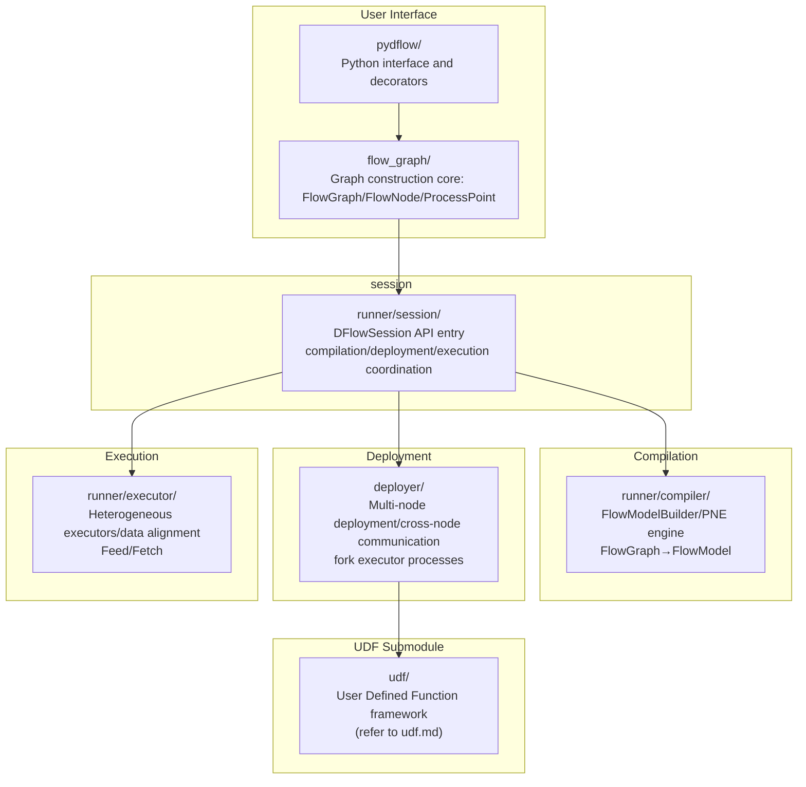
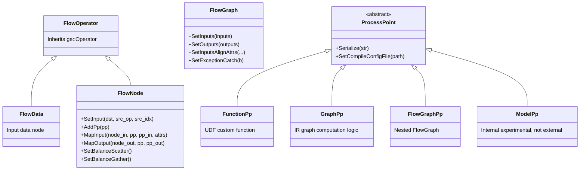
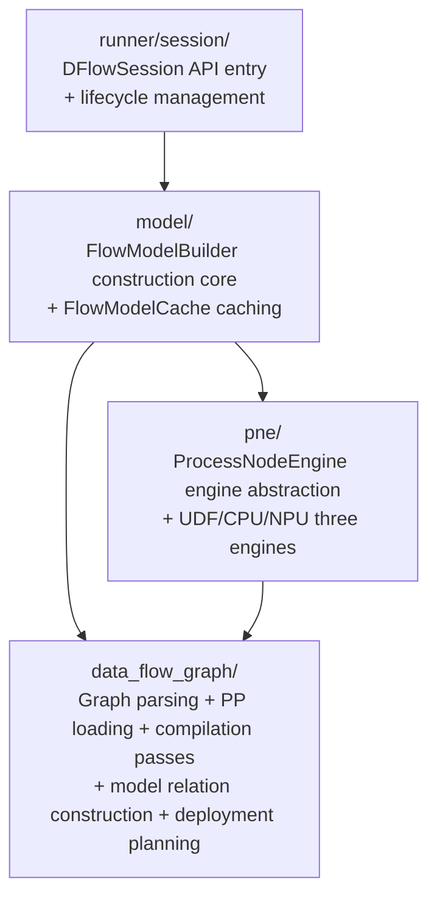
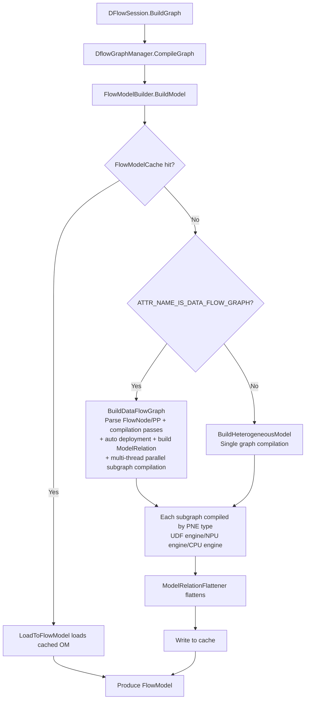
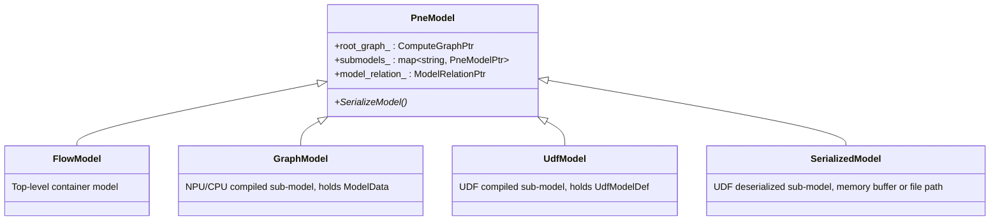
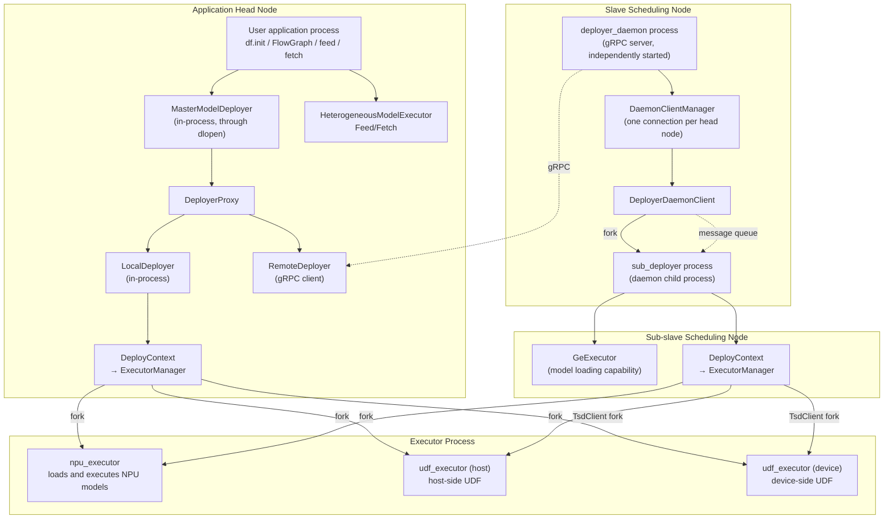
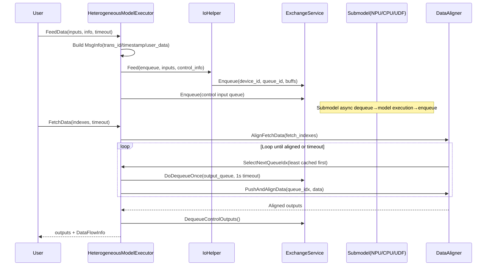
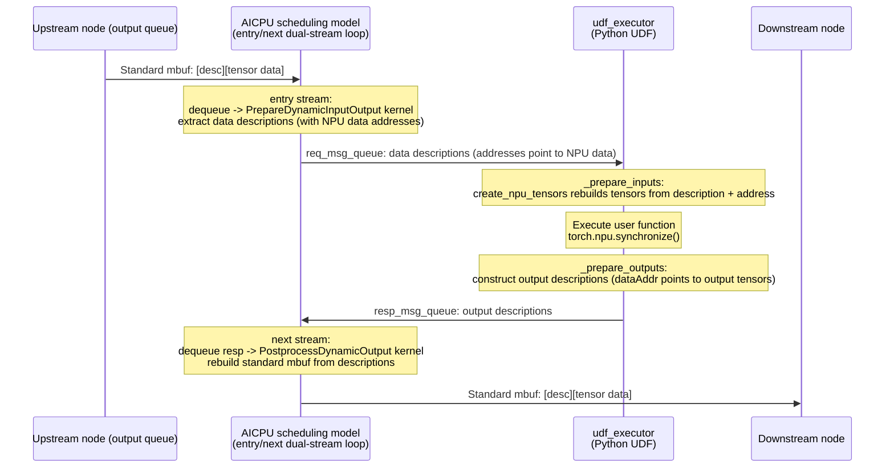
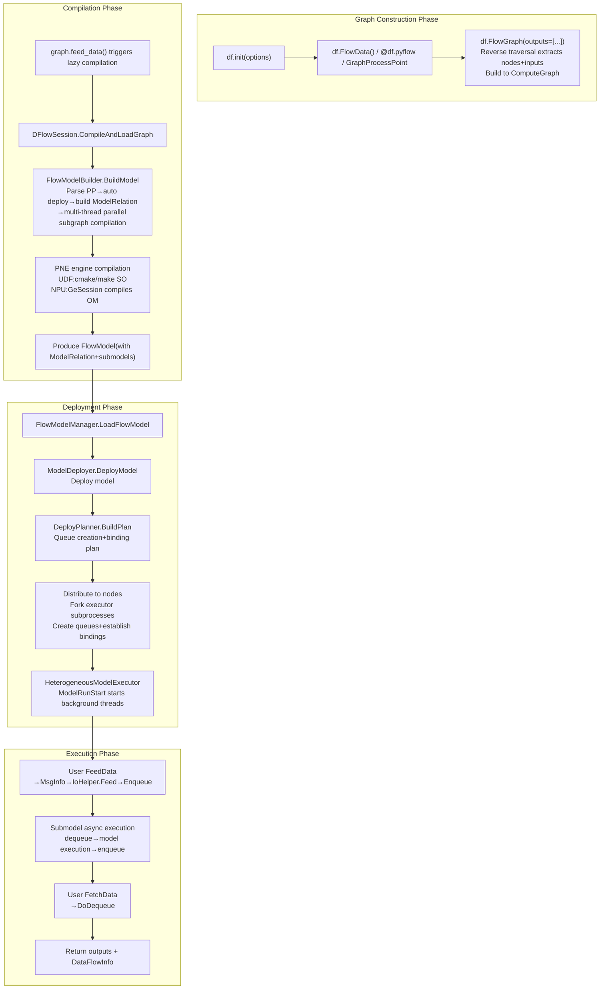

# DataFlow Asynchronous Pipeline Framework -- Data-driven Multi-model Concatenation with Sinked Execution

## Introduction

### Purpose

This document is for dflow developers, describing the architecture design, core module implementation, and key design decisions of dflow, covering the complete chain from FlowGraph construction to compilation, deployment, and execution.

### Scope

Covered modules: `flow_graph/`, `pydflow/`, `runner/` (including `session/`, `compiler/`, `executor/`), `base/`, `deployer/`, `udf/`. Does not cover the `llm_datadist` submodule (large model data distribution is an independent feature).

Related documents:
- [udf.md](udf.md) -- UDF submodule independent document
- [docs/zh/user_guides/dflow](../../../../zh/user_guides/dflow/index.md) -- User development guide
- [examples/dflow](../../../../../examples/dflow) -- Sample code

---

## 1. Feature Background

### 1.1 Pain Point: Host-device Interaction Becomes a Bottleneck

When the traditional inference pipeline concatenates multiple models, each model's input and output must pass through the host: after Model A finishes executing on the NPU, the results are transferred back to the host, and the host then feeds data to Model B. When the number of models is large and data volume is high, the control plane and data plane interactions between host and device become a throughput bottleneck, and the serial orchestration on the host side also limits concurrency.

GE's IR graph construction (`ComputeGraph`) adopts **synchronous data flow** -- one input corresponds to one output between operators in the graph, expressing serial synchronous execution. This model is suitable for operator orchestration within a single model, but not suitable for "multi-model orchestration + asynchronous pipeline" scenarios:

| Dimension | IR Graph Construction | DataFlow |
|-----------|----------------------|----------|
| Data flow | Synchronous, one input one output | Asynchronous, supports one input multiple outputs / multiple inputs one output |
| Execution model | Serial synchronous | Parallel asynchronous, fully utilizing resources |
| Host-device interaction | Each model requires host participation | GraphPp fully sinks to device, adjacent nodes transfer device-device |
| Custom logic | Develop custom operators (prototype + implementation + info store + adaptation, many deliverables) | Develop UDF (only define processing function + graph construction, few deliverables) |

### 1.2 Core Value of DataFlow

DataFlow organizes one or more computation processing points (ProcessPoint) into a complete computation flow driven by **data queues**. Its core values are three:

1. **Multi-model concatenation with sinked execution**: Multiple models and UDFs are orchestrated into a FlowGraph, where GraphPp nodes fully sink to the device side for execution, and data between adjacent nodes transfers device-device, reducing host-device interaction and lowering latency.

2. **Asynchronous pipeline for throughput improvement**: ProcessPoints transfer data asynchronously through queues; when one node finishes processing, it wakes up downstream nodes without waiting for the entire pipeline to synchronize. Supports multi-instance load balancing and batch aggregation.

3. **Low-barrier custom processing**: Users insert custom logic into the data flow graph through UDFs (User Defined Functions) (format conversion, data splitting, preprocessing/postprocessing, and so on), only needing to define processing functions and construct the graph, without developing complete operators.

### 1.3 Module Overview

The dflow code is located in the `dflow/` directory (excluding the `llm_datadist` subdirectory). The core modules and their interactions are as follows:



| Module | Core Responsibility |
|--------|---------------------|
| `flow_graph/` | C++ graph construction API: FlowGraph/FlowNode/FlowData/ProcessPoint system |
| `pydflow/` | Python wrapper, @pyflow decorator, PyTorch integration, UDF project auto-generation |
| `runner/session/` | DFlowSession API entry, coordination hub for compilation, deployment, and execution |
| `runner/compiler/` | FlowModelBuilder/PNE engine mechanism, graph optimization passes, compiles FlowGraph to FlowModel |
| `base/` | Model abstraction (FlowModel/GraphModel/PneModel), ModelRelation, deployment planning, OM serialization |
| `deployer/` | Multi-node master-slave deployment, cross-node gRPC/memory queue communication, subprocess management |
| `runner/executor/` | Heterogeneous executors, Feed/Fetch, data alignment, exception handling |
| `udf/` | UDF framework: SO loading/registration, state machine scheduling, message abstraction, built-in UDFs (refer to independent document) |

---

## 2. User Scenarios

### 2.1 Multi-model Concatenation with Sinked Execution

The most typical scenario: two models (such as an ONNX model and a PB model) concatenated, with UDFs interspersed for data processing. After users orchestrate with FlowGraph, GraphPp nodes fully sink to the device side, data transfers directly between devices, and the entire pipeline executes asynchronously.

**Important**: UDF can execute on either the host or the device, depending on the UDF type, compilation output, and user deployment configuration (refer to [Section 4.6](#46-udf-execution-location-and-multi-instance-deployment)):

| UDF Type | Execution Location | Reason |
|----------|-------------------|--------|
| Python UDF | Host only | Device has no Python executor, CMake template rejects Ascend target compilation |
| C++ UDF (supports both host/device compilation) | Device by default | When compilation output includes Ascend, device is selected by default |
| C++ UDF (host compilation only) | Host only | Compilation output does not include Ascend |
| heavy_load UDF | Host | Heavy-load UDF forced to host, but must bind to a specified NPU-associated host CPU |

> **Exception**: Python UDFs decorated with `@df.npu_model` are not subject to the "host only" restriction -- the `_npu_sched_model=1` attribute they carry deploys udf_executor in npu_sched mode (the AICPU scheduling model proxies data in and out, data descriptions are relayed through req/resp message queues, and the data itself never leaves the device), see [Section 4.5.2](#452-dfnpu_model-pytorch-zero-copy-sinking-decorator).

```
FlowData ──→ [GraphPp: ONNX model] ──→ [FuncPp: UDF0] ──→ [GraphPp: PB model] ──→ [FuncPp: UDF1] ──→ Output
               (device execution)      (host or device)     (device execution)      (host or device)
                      └──────── device-device direct transfer ────────┘
```

### 2.2 UDF Custom Processing

UDF solves scenarios the framework cannot automatically handle: inter-model format conversion (FP16 to FP32), data splitting load balancing, custom preprocessing/postprocessing, multi-model orchestration conditional routing, batch aggregation. UDF development only requires defining processing functions and constructing the graph; the C++ side integrates through SO loading and registration mechanisms, and the Python side achieves zero C++ code development through `@pyflow` decorator + automatic code generation + cloudpickle (refer to [udf.md](udf.md)).

### 2.3 Batch Aggregation

Aggregates multiple data items within a time window or fixed count into one batch to improve processing efficiency. DataFlow provides TimeBatch (time window aggregation) and CountBatch (count aggregation) as two built-in UDFs; users configure through `DataFlowInputAttr` during graph construction, and the framework automatically inserts the corresponding built-in UDF nodes.

### 2.4 Multi-instance Load Balancing

After multi-instance deployment, data is distributed to instances by default through trans_id round-robin. After configuring `SetBalanceScatter`/`SetBalanceGather`, route_label is generated by strategy; flowGW distributes based on trans_id and route_label, ensuring data with the same trans_id and route_label is distributed to the same instance.

---

## 3. External Interfaces

### 3.1 C++ Graph Construction Interface

The DataFlow graph construction class system uses `FlowOperator` as the base class (inheriting from `ge::Operator`), deriving `FlowData` (input nodes) and `FlowNode` (computation nodes), defined in `flow_graph/flow_graph.cc`:



**Key design decisions**:

- **FlowOperator inherits ge::Operator**: FlowGraph ultimately needs to convert to GE's `ComputeGraph`; direct inheritance allows FlowData/FlowNode to seamlessly participate in GE graph construction without an adaptation layer.
- **Pimpl pattern**: All core classes use Impl to hide internal details; external header files only expose minimal interfaces, achieving compilation isolation.
- **ProcessPoint uses protobuf serialization for storage**: PP information structure is complex and extensible; serialized to string and stored in OpDesc's `ATTR_NAME_DATA_FLOW_PROCESS_POINTS` attribute, extending PP attributes without modifying OpDesc structure.

The three externally provided ProcessPoint types correspond to different computation logic sources:

| ProcessPoint | Purpose | Compilation Engine |
|--------------|---------|-------------------|
| `FunctionPp` | UDF user defined function | UDF engine (compiles user SO) |
| `GraphPp` | IR graph defined computation logic | NPU engine (model sinking) |
| `FlowGraphPp` | Nested FlowGraph as PP | NPU engine (recursive compilation) |

Additionally, `ModelPp` exists in the code (loads pre-compiled OM models, loads directly without compilation); it is an internal experimental feature and does not provide external interfaces.

During `FlowGraph` construction, the FlowOperator list is built into a GE `Graph`, and `ATTR_NAME_IS_DATA_FLOW_GRAPH = true` is set to mark this graph as a dflow graph.

### 3.2 C++ Runtime Interface

After graph construction, compile and run through `DFlowSession` (`runner/session/dflow_api.h`):

- **Compile+Load**: `BuildGraph` (compile and load combined, lazy compilation on first Feed)
- **Data input**: `FeedDataFlowGraph` (supports Tensor and FlowMsg two paths)
- **Data retrieval**: `FetchDataFlowGraph` (supports retrieval by index)
- **Global management**: `DFlowInitialize` / `DFlowFinalize` / multi-session management

### 3.3 Python Interface

The Python side provides three layers of wrapping (`pydflow/python/dataflow/`); for mechanism details refer to [Section 4.5](#45-python-interface-layer):

| Layer | File | Description |
|-------|------|-------------|
| High-level API | `dataflow.py` | Graph construction and runtime interfaces such as FlowGraph/FlowNode/FlowData/Tensor/feed/fetch |
| General UDF decorator | `pyflow.py` | `@df.pyflow` (function/class auto-convert to PP), `@df.method` (in-class method marker), see [Section 4.5.1](#451-dfpyflow-general-python-udf-decorator) |
| PyTorch integration | `plugin/torch/torch_plugin.py` | `@df.npu_model` (PyTorch zero-copy sinking), see [Section 4.5.2](#452-dfnpu_model-pytorch-zero-copy-sinking-decorator) |

Relationship between the two decorators: `@df.pyflow` lets users define UDF nodes as ordinary Python functions/classes; the framework automatically generates the UDF project (cloudpickle serialization + C++ wrapper + CMake compilation into SO), requiring no hand-written C++. `@df.npu_model` inherits the pyflow base classes and overrides the data in/out paths, targeting PyTorch computation scenarios where both inputs and outputs are NPU tensors; data descriptions are relayed through the AICPU scheduling model, and the data never leaves the device.

In addition, `pydflow/wrapper/` provides pybind11 C++ extension modules: `dflow_wrapper` (graph construction classes such as FlowGraph/FlowNode plus FlowBufferFactory) and `data_wrapper` (DataType enums) support the user-side API, while `flowfunc_wrapper` (FlowMsg/MetaRunContext/RuntimeTensorDesc layout, etc., source directory `wrapper/flow_func_wrapper/`) supports UDF execution within the udf_executor process.

### 3.4 Data Types

DataFlow runtime data uses **FlowMsg** as the core carrier (`executor/flow_msg.cc`); three subclasses cover all data types:

| Type | Layout | Purpose |
|------|--------|---------|
| `TensorFlowMsg` | `[RuntimeTensorDesc][TensorData]` | Tensor data, zero-copy |
| `RawDataFlowMsg` | `[raw bytes]` | Arbitrary binary data |
| `EmptyDataFlowMsg` | Empty | EOS (End Of Sequence) marker |

FlowMsg is based on Ascend runtime **rtMbuf** for zero-copy implementation: producers fill mbuf data and pass it through queues to consumers; `rtMbufCopyBufRef` only increments the reference count, allowing multiple consumers to share the same data block without copying.

The mbuf memory layout (`udf/flow_func/mbuf_flow_msg.h`):

```
+---------------------------------------------+
| mbuf head (256B by default)                 |
|   +-- last 64B: MbufHeadMsg control info    |
|       trans_id / version / msg_type /       |
|       ret_code / start_time / end_time /    |
|       flags / data_flag / step_id /         |
|       data_label / route_label              |
+---------------------------------------------+
| mbuf data area                              |
|   Tensor messages: [RuntimeTensorDesc 1024B]|
|                    [actual tensor data]     |
|   Other messages: raw data                  |
+---------------------------------------------+
```

`MbufHeadMsg` carries all control information needed for transaction tracking and data routing; `RuntimeTensorDesc` (1024-byte fixed layout: dataAddr/dtype/shape[33] (shape[0] stores the dim count, followed by DIM0~DIM31)/format/data_size, etc.) describes the tensor metadata in the data area.

`DataFlowInfo` carries metadata for each data interaction: start_time/end_time/flow_flags (EOS/SEG)/transaction_id/user_data (up to 64 bytes of custom data).

### 3.5 GraphPp Compilation Configuration

GraphPp supports specifying compilation-time options through **compilation configuration JSON files**; users pass them through C++ `GraphPp::SetCompileConfig(json_path)` or Python `GraphProcessPoint(compile_config_path=...)`. The JSON top level contains two keys:

| Key | Attribution | Purpose |
|-----|-------------|---------|
| `build_options` | Pass-through to GE compiler | Key-value map; all GE-supported graph compilation parameters can be set individually for GraphPp subgraphs here |
| `inputs_tensor_desc` | dflow private | Input description list; overrides subgraph Data node dtype/format/shape at compilation time |

#### build_options

Key-value pairs in `build_options` are **passed through to the GE compiler as-is** as GraphPp subgraph compilation parameters. All GE-supported graph compilation parameters can be set here, allowing each GraphPp subgraph to independently configure compilation behavior (such as dynamic shape, output memory pre-allocation, and so on). For specific option names and value formats, refer to the GE compilation parameter documentation.

#### inputs_tensor_desc

dflow private configuration, describing tensor metadata per input, overriding subgraph Data node tensor desc at compilation time. **When the original graph Data node's dtype/format/shape is inconsistent with the expected compilation** (for example, the original graph shape is static but needs to be changed to dynamic dimensions, or dtype needs correction), override to correct values through `inputs_tensor_desc`. If the original graph Data node description is already correct, no setting is needed. Each element contains:

| Item | Meaning | Value | Default |
|------|---------|-------|---------|
| `data_type` | Tensor data type | Serialization string of `DataType` enum, such as `"DT_FLOAT"`, `"DT_INT32"` | `DT_FLOAT` |
| `shape` | Tensor shape | Integer list, dynamic dimensions set to `-1`, such as `[1,3,-1,-1]` | Not set means no override |
| `format` | Format | `"NCHW"` / `"NHWC"` / `"ND"` | `ND` |

Constraint: The number of `inputs_tensor_desc` elements must match the number of subgraph Data nodes. When `ge.inputShape` is set in `build_options`, the dynamic dimensions marked by `-1` in `inputs_tensor_desc` `shape` and `ge.inputShape` complement each other: the former marks which dimensions are dynamic, and the latter provides the value range for dynamic dimensions.

#### Configuration Example

The following example configures dynamic shape compilation for a GraphPp; `build_options` passes through GE compilation parameters, and `inputs_tensor_desc` overrides the original graph static shape to dynamic dimensions:

```json
{
    "build_options": {
        "ge.inputShape": "1,3,1~1728,1~1728;2",
        "ge.outputMaxSize": "107495424"
    },
    "inputs_tensor_desc": [
      { "data_type": "DT_FLOAT", "shape": [1, 3, -1, -1], "format": "NCHW" },
      { "data_type": "DT_INT32", "shape": [2], "format": "ND" }
    ]
}
```

Whether a GraphPp is configured with dynamic shape directly determines whether it takes the static or dynamic execution path (refer to [Section 4.3.6](#436-model-execution)): when dynamic shape is configured (subgraph Data node shape contains unknown dimensions), it uses `ProxyDynamicModelExecutor` for dynamic execution; otherwise it uses `GeExecutor::LoadModelWithQueueParam` for static task sink execution.

---

## 4. Implementation Details

### 4.1 Compilation Layer: From FlowGraph to FlowModel

The compilation layer is located in `dflow/runner/compiler/`, adopting a four-layer architecture with top-down delegation:



**Complete compilation chain** (`FlowModelBuilder::BuildModel` in `model/flow_model_builder.cc`):



**The PNE engine mechanism** is the core abstraction of the compilation layer (`pne/process_node_engine.h`). `ProcessNodeEngine` defines the unified interface for "how to compile a ProcessPoint subgraph"; three engine implementations use different compilation strategies:

| Engine | Compilation Method | Output |
|--------|-------------------|--------|
| NPUProcessNodeEngine | Delegates to `GeSession` for compilation (model sinking) | GraphModel (OM) |
| CPUProcessNodeEngine | Inherits NPU, sets `EXEC_PLACEMENT=HOST` | GraphModel (OM) |
| UdfProcessNodeEngine | `UdfModelBuilder` builds UdfModelDef + cmake/make compiles user SO | UdfModel |

The CPU engine inherits the NPU engine and only overrides `GetEngineName`; the compilation flow is fully reused -- the difference is only in execution placement. This inheritance reuse avoids code duplication.

Engines are registered through `REGISTER_PROCESS_NODE_ENGINE` macro + SO plugin mechanism (`pne/process_node_engine_manager.cc`), loaded at runtime from the `plugin/pnecompiler/` directory. Each `DflowGraphManager` creates independent engine instances through `CloneEngine`.

**Two compilation passes** (`data_flow_graph/`):
- `DataFlowGraphPrunePass`: Reverse BFS from outputs to prune isolated nodes, reducing compilation volume
- `ConvertBatchAttrToUdfPass`: Converts TimeBatch/CountBatch attributes to built-in UDF nodes, reusing the UDF compilation and execution mechanism

**Multi-level caching** avoids repeated compilation: root model cache (graph_key index) + sub-model cache (SHA256 hash matching) + UDF cache (release_info matching, avoiding repeated cmake/make) + buildinfo cache.

FunctionPp uses async cmake/make compilation. The three-level caching coordination ensures incremental compilation efficiency.

### 4.2 Model Abstraction Layer: FlowModel and ModelRelation

`base/model/` defines the dflow model abstraction system, adopting a composition pattern inheritance hierarchy (`inc/data_flow/model/pne_model.h`):



**Why four model types?** Because their serialization strategies, device ID management approaches, and data sources are all different. GraphModel directly returns OM data in memory; UdfModel holds `UdfModelDef` protobuf description (built during compilation by `UdfModelBuilder`; built-in UDFs serialize to OM buffer, external UDFs serialize to tar.gz packages); SerializedModel is a UDF sub-model created by runtime deserialization, supporting memory buffer or file path.

**ModelRelation** is one of the most core data structures (`base/model/model_relation.h`), describing how sub-models connect through queues (Endpoints). It translates logical topology (edges between FlowNodes) into physical connection relationships: "sub-model A's output queue X connects to sub-model B's input queue Y".

**Why use names (string) rather than pointer references?** Model relations need to be serialized to OM files and restored after deserialization; name references decouple object lifecycles, and serialization only needs to handle string mappings.

**OM serialization** adopts a three-partition structure (`base/model/flow_model_om_saver.cc`):

| Partition | Content |
|-----------|---------|
| MODEL_DEF | Root graph structure (ge::Model) |
| FLOW_MODEL | FlowModel metadata (ModelRelation, sub-model list, scheduling priority) |
| FLOW_SUBMODEL | Each sub-model compilation product (multi-thread parallel loading) |

**Deployment planning** (`DeployPlanner::BuildPlan` in `base/deploy/deploy_planner.cc`) converts ModelRelation into specific queue creation and binding plans (DeployPlan): flatten models to supplement control queues to parse data flow connections to adjust devices to identify reusable queues. The Group mechanism handles one-to-many/many-to-one data distribution.

### 4.3 Deployment Layer: Multi-node Master-Slave Deployment

The deployment layer is located in `dflow/deployer/` and is the largest module in dflow. It solves the problem of "how compilation products are deployed to multiple nodes and devices for coordinated execution".

#### 4.3.1 Single-machine and Multi-machine Scenarios

The deployment architecture is divided into two scenarios based on server count:

- **Single-machine scenario (single server)**: All sub-models are deployed on the same server. The user application process directly forks executor processes through `LocalDeployer` within the process, **without involving slave scheduling nodes**, resulting in the shortest deployment chain.
- **Multi-machine scenario (multi server)**: Sub-models need to be deployed on different servers. Remote servers need to pre-start the `deployer_daemon` process as a slave scheduling node, and the head node communicates with it through gRPC. Typical scenarios include multiple NPU nodes cooperating in large model inference, distributed model deployment, and so on.

#### 4.3.2 Process Hierarchy

In multi-machine scenarios, dflow forms a four-level process hierarchy:



Role responsibilities at each level:

| Role | Process/Location | Responsibility | Description |
|------|-----------------|----------------|-------------|
| Application head node | User application process | Compilation, orchestration deployment, Feed/Fetch | `MasterModelDeployer` runs in-process through dlopen, `LocalDeployer` directly handles local node deployment |
| Slave scheduling node | `deployer_daemon` | gRPC server, client management | Independently started daemon process on remote nodes, forks one sub_deployer per head node connection. Does **not load models** itself (no `GeExecutor`), is a lightweight dispatcher |
| Sub-slave scheduling node | `sub_deployer` | Model loading, fork executor | Daemon child process, attaches to daemon's MemoryGroup, initializes `GeExecutor` with model loading capability. Communicates with daemon through message queue; daemon can re-fork on crash |
| npu_executor | `npu_executor_main` | Loads and executes NPU models | `EngineDaemon` class, one process per device, integrates AICPU scheduler for automatic dequeue to model execution to enqueue |
| udf_executor | `udf_executor` | Loads user SO to execute UDF | `FlowFuncExecutor` class, **one independent process per UDF model** (because user SO thread safety cannot be guaranteed), event-driven state machine scheduling. Two fork paths based on UDF deployment location (see below) |
| host_cpu_executor | `host_cpu_executor_main` | Loads and executes CPU-side models | `EngineDaemon(is_host_cpu=true)`, same class as npu_executor but runs on host CPU |

**udf_executor two fork paths**: udf_executor is not always directly forked by the deployer; it is distinguished based on UDF deployment location:

- **Host-side UDF** (`is_proxy=false`): Directly forked on the host by `UdfExecutorClient` through `SubprocessManager::ForkSubprocess`. Applicable to Python UDF, heavy_load UDF, and other scenarios that must execute on the host.
- **Device-side UDF** (`is_proxy=true`): Forked on the NPU device side by `UdfProxyClient` (inheriting `UdfExecutorClient`) through `TsdClient::ForkSubprocess`; before deployment, `TsdClient::LoadFile` also transfers the tar package to the device. Applicable to C++ UDF deployed on the device.

The two modes are distinguished by `ExecutorKey.is_proxy`: when `device_type != CPU` and `engine_name == PNE_ID_UDF`, proxy mode is used (`AddLocalSubmodelDesc` in `deploy_state.cc`). `PneExecutorClientFactory` creates the corresponding client based on `engine_name + is_proxy`.

**Why is sub_deployer independent from daemon?** The daemon needs to run stably long-term and serve multiple user connections; it should not bear heavy logic such as model loading. sub_deployer is isolated by client; crashes only affect that user, and the daemon can re-fork to recover.

**Why one process per udf_executor model?** Static variable initialization, global state, and thread safety in user-compiled SO cannot be guaranteed, and different UDF SOs may have symbol conflicts. Process-level isolation is the most reliable isolation method, avoiding state interference and symbol conflicts between different UDFs.

#### 4.3.3 Communication Links

Different communication methods are used between levels:

| Level | Communication Method | Description |
|-------|---------------------|-------------|
| Head node to slave scheduling node | gRPC | `RemoteDeployer` to daemon gRPC service |
| Slave scheduling node to sub-slave scheduling node | Message queue (rtMemQueue) | `DeployerDaemonClient` to sub_deployer `MessageServer` |
| Sub-slave scheduling node/head node to executor | Message queue | `PneExecutorClient` to executor `MessageServer` |
| Executor to executor (data) | rtMemQueue + shared memory | mbuf zero-copy, cross-process sharing through MemoryGroup |

**Why use message queues instead of gRPC for same-node communication?** Message queues are more lightweight and can directly pass mbuf (device memory pointers), avoiding serialization overhead. gRPC is only used for cross-node communication.

#### 4.3.4 Deployment Pipeline

Deployment is orchestrated by `HeterogeneousModelDeployer` (`DoDeployModelWithFlow` in `deploy/deployer/heterogeneous_model_deployer.cc`), advancing through key phases:

1. **Build plan**: `BuildDeployPlan` allocates device resources and builds the deployment plan; `FlowRoutePlanner::ResolveFlowRoutePlans` plans flow routes for each node
2. **Distribute to nodes**: Distributes route plans, deployment plans, sub-models, variable managers, and data gateway configurations to each node through `FlowModelSender`. Local nodes first `PreDeployLocalFlowRoute` to create queues; remote nodes forward through gRPC to daemon to message queue to sub_deployer for execution
3. **Load models**: `LoadSubmodels` loads sub-models in parallel on each node; local nodes use `LocalDeployer` to `DeployContext` to `ExecutorManager::GetOrCreateExecutorClient` to create the corresponding executor client based on PNE type and fork the executor process; remote nodes use sub_deployer's `ExecutorManager` to fork executor processes
4. **Establish queue bindings**: `DeployLocalFlowRoute` completes local flow route deployment, establishing data binding relationships between queues

After executor process startup: attach MemoryGroup to initialize `MessageServer` to receive `kLoadModel` request through message queue to load model to attach queue to ready.

#### 4.3.5 Queues and Executors

**Subprocess isolation**: `SubprocessManager` (`common/subprocess/subprocess_manager.cc`) forks independent executor processes, establishing shared memory groups through `MemoryGroupManager` for cross-process mbuf transfer. Different engine type execution logic is isolated to avoid mutual interference.

**Queue-driven data flow**: `HeterogeneousExchangeService` (`common/data_flow/queue/heterogeneous_exchange_service.h`) wraps the `rtMemQueue` API, supporting mbuf enqueue/dequeue, event-driven waiting (EMPTY_TO_NOT_EMPTY / FULL_TO_NOT_FULL), and client queues. This class handles data enqueue/dequeue at model entry/exit points and queue transfer between processes, and is the foundation of dflow queue communication.

#### 4.3.6 Model Execution

After executor processes load models, they adopt different execution methods based on model type and deployment location:

**Host model execution** (host_cpu_executor process):
- Driven by `DynamicModelExecutor(is_host=true)`, using `libhost_aicpu_scheduler.so`
- `CpuSchedEventDispatcher` receives AICPU activation events, triggering `ExecuteAsync` to submit execution tasks
- The model executes on the host CPU, applicable to CPU-side GraphPp

**NPU static model execution** (npu_executor process):
- Directly loaded through `GeExecutor::LoadModelWithQueueParam`; the AICPU scheduler automatically handles input dequeue and output enqueue
- Does not involve `DynamicModelExecutor`; the model sinks to the NPU for task sink execution
- Applicable to static shape GraphPp

**NPU dynamic model execution** (npu_executor process):
- Uses `ProxyDynamicModelExecutor` (inheriting `DynamicModelExecutor`)
- AICPU dequeues data from input queues on the NPU side and sends data description information (address, shape, and so on) to npu_executor through req_msg_queue
- The npu_executor dispatcher thread dequeues request mbufs from req_msg_queue, parses input addresses, and calls `aclmdlExecute` to execute the dynamic model
- After execution completes, npu_executor writes output data description information to resp_msg_queue to notify AICPU, which completes output data enqueue
- Applicable to dynamic shape GraphPp

### 4.4 Execution Layer: Heterogeneous Executors and Data Alignment

The execution layer is located in `dflow/runner/executor/`, responsible for driving data flow according to the deployment plan.

**HeterogeneousModelExecutor** is the core (`executor/heterogeneous_model_executor.cc`), managing the complete Feed to internal execution to Fetch closed loop:



**DataFlowDataAligner** (`executor/data_flow_data_aligner.cc`). In normal scenarios, flowGW aligns by trans_id in order, and model processing order can be guaranteed without additional alignment. However, in the following two special scenarios, trans_id may be non-continuous or data may be discarded, requiring users to enable the data aligner through `SetInputsAlignAttrs`:
- **Exception handling enabled**: Enabled through `FlowGraph::SetExceptionCatch(true)`; exception data may be discarded causing non-continuous trans_id
- **Contains N-Mapping nodes** (marked through `FlowGraph::SetContainsNMappingNode(true)`): Such as batch aggregation (multiple data groups merged into one) or data splitting (one data group split into multiple), causing non-continuous trans_id

After enabling, the aligner aligns multi-path outputs by `(trans_id, data_label)` dimension, selecting the queue with the least cache for dequeue first to balance consumption speed, and discarding or partially extracting based on policy on timeout/limit.

**Key design decisions**:

1. **Queue decoupling**: User Feed/Fetch and sub-model execution are fully decoupled through queues; users are unaware of internal sub-model execution details.
2. **Asynchronous pipeline + zero-copy where possible**: Sub-models pass data asynchronously through queues; producers wake downstream upon completion without waiting for the entire pipeline to synchronize. Based on rtMbuf reference counting, same-side (host-side or device-side) data transfer is zero-copy where possible. However, host queue and device queue interaction triggers automatic copying at the underlying level, and cross-device transfer triggers communication copying through flowGW.
3. **Segmented timeout**: `DoDequeue` breaks long timeouts into 1-second loops, avoiding blocking and supporting device exception detection and redeployment status checking.
4. **Transaction tracking**: `trans_id` is assigned at user Feed time, flows through all queues and sub-models with the mbuf head; the aligner aligns multi-path outputs by trans_id, and the exception handler cleans exception data by trans_id. This is the foundation for asynchronous pipeline correctness and recoverability.

### 4.5 Python Interface Layer

`pydflow/` provides a dual data path design (`pydflow/python/dataflow/dataflow.py`):

- `feed_data`/`fetch_data`: Tensor-specific zero-copy high-performance path, directly using `ge::Tensor`
- `feed`/`fetch`: Supports any serializable object, through FlowMsg + cloudpickle serialization; has serialization overhead but higher flexibility

The two core decorators on the Python side, `@df.pyflow` and `@df.npu_model`, share the same base classes and project generation chain; the former is the general UDF decorator, and the latter is the zero-copy sinking decorator for PyTorch. For the scheduling and execution mechanisms of the UDF framework itself, refer to [udf.md](udf.md).

#### 4.5.1 `@df.pyflow` General Python UDF Decorator

**Two decoration targets** (`_make_pyflow` in `pyflow.py`):

| Decoration Target | Product | Graph Construction |
|------------------|---------|-------------------|
| Function | `PyFunctionProcessPoint` | `function.fnode()` creates the node; the input count is derived from the function signature, and the output count is determined by the return type annotation or the `num_returns` option |
| Class | `PyActorProcessPoint` | `Class.fnode()`; `_df_from_class` dynamically derives a subclass, methods marked with `@df.method()` are collected at `fnode()` time, and node method invocation is edge connection (e.g., `node.forward(x)`) |

When decorating a class, `fnode()` scans methods marked with `__df_method__` and generates two wrappers for each method: `ActorFlowNodeMethod` handles graph construction (maintaining the index offset of each method within the node's inputs/outputs), while the callable object returned by `get_redefined_method` handles invoking the user method in the UDF process at execution time. Class constructor arguments are saved at `fnode(*args)` and re-executed via `_super_init` during UDF process initialization.

**Supported options**: `num_returns`, `resources` (memory/num_cpus/num_npus), `env_hook_func` (environment hook before initialization), `visible_device_enable`, `stream_input` (streaming input, currently only supports "Queue"), `choice_output` (output filter callback; outputs for which it returns False are set to empty and skipped). The latter two are exclusive to pyflow.

**Project generation chain** (`FuncProcessPoint` -> `tools/func_ws_creator.py`):

1. cloudpickle serializes the function/class object to `<name>.pkl`; the global message type registry is serialized to `_msg_type_register.pkl` (restored at UDF process startup, ensuring the executor recognizes custom message types); `env_hook_func` is optionally serialized
2. Generates the C++ wrapper embedding CPython (`tpl/tpl_wrapper_code.py`: after `Py_Initialize`, imports the pickle file with pybind11 to restore the function object)
3. Generates CMakeLists and the compilation configuration `func_*.json`, which always writes `heavy_load: True` -- this is one of the root causes of Python UDFs only executing on host (see [Section 4.6.1](#461-how-udf-execution-location-is-determined))

**Runtime data path** (symmetric serialization/deserialization):

- Input: `convert_flow_msg_to_object` deserializes FlowMsg into Python objects (Tensor -> numpy view / registered custom type -> corresponding deserialize function / the rest -> cloudpickle)
- Output: `_convert_object_to_flow_msg` serializes return values (df.Tensor -> zero-copy FlowMsg conversion / None -> empty message / the rest -> serialized data written into mbuf)

Generator functions output per yield (streaming output). Users can register custom types and serialization functions through `df.utils.msg_type_register` (msg_type starts from 1024); unregistered types default to cloudpickle (msg_type=65535).

#### 4.5.2 `@df.npu_model` PyTorch Zero-copy Sinking Decorator

**Problem solved**: when a host-side Python UDF executes PyTorch code, inputs must be copied from device to host and results copied back to device; the two transfers negate the pipeline's benefits. `@df.npu_model` (`plugin/torch/torch_plugin.py`) executes by relaying data descriptions through the AICPU scheduling model: the Python code still runs on the CPU, but the data never leaves the device.

**Relationship with pyflow**: `NpuFunctionProcessPoint`/`NpuActorProcessPoint` directly inherit the corresponding pyflow base classes, reusing all mechanisms such as `fnode()`, project generation, and registration, and only override data in/out (`prepare_inputs`/`prepare_outputs`) and PP addition (`add_process_point`).

**Two optimize_level levels** (only supported for class decoration; function decoration is equivalent to level=1):

| optimize_level | Path | Mechanism |
|----------------|------|-----------|
| 1 (default) | Data sinking | Goes through FuncProcessPoint (Python UDF); the node carries the `_npu_sched_model=1` attribute, the AICPU scheduling model relays data descriptions, and the UDF reads/writes data zero-copy using device addresses (see the data link below) |
| 2 | Model sinking | `_dynamo_export` constructs sample inputs from `input_descs` (negative dims set to 1 and marked dynamic) and calls `torchair.dynamo_export` to export `export.air`, then compiles it with `GraphProcessPoint(MINDSPORE)` into an OM sinking to NPU (see [Section 4.3.6](#436-model-execution)), leaving the Python execution path |

**Data link: AICPU-scheduling-model-relayed zero-copy execution** (level=1). What flows on inter-node data queues is always the standard mbuf (`[RuntimeTensorDesc 1024B][tensor data]`, see Section 3.4); the npu_model node's data in/out is proxied by the **AICPU scheduling model** (`NpuSchedModelLoader`, `deployer/executor/npu_sched_model_loader.cc`), and the UDF is not directly connected to the data queues:



The AICPU scheduling model runs in an entry/next dual-stream loop (`CreateSchedTasks`): the entry stream dequeues from the input queue, then the `PrepareDynamicInputOutput` kernel extracts the description of each input and uses the data's actual address on the device as dataAddr (no need to move the data itself), packaging and enqueuing it to the req message queue; the next stream takes the output descriptions returned by the UDF from the resp message queue, and the `PostprocessDynamicOutput` kernel rebuilds the standard mbuf and enqueues it to the output queue. The UDF-side input/output queues are exactly these two req/resp proxy queues (`LoadNpuSchedModel` in `udf/execute/npu_sched_processor.cpp`).

- **Input** (`_prepare_inputs`): parses the desc array from the req message, and for each desc calls `torchair.llm_datadist.create_npu_tensors` to rebuild the tensor directly from the description and address, without copying data
- **Output** (`_prepare_outputs`): after synchronize, packages each output's address/shape/dtype into one description message (msg_type=1023) returned to the resp queue, without moving the data itself
- **Result caching against release** (key correctness design): the address in the output description points to the device memory of the tensor held by the UDF; before the AICPU rebuilds the mbuf and it is consumed downstream, the producer must hold a tensor reference to prevent that memory from being reclaimed by Python GC -- `_result`/`_outputs` cache the previous round of outputs until overwritten by the next invocation

**feed/fetch side cooperation**: when the decorator takes effect, it registers `torch.Tensor <-> 1023` with `msg_type_register`. At `feed` time, a CPU tensor is serialized into `[RuntimeTensorDesc][data itself]` (CPU required, non-CPU tensors raise TypeError; non-contiguous tensors are automatically converted via `.contiguous()`); the address recorded in the desc at this point is a host pointer, used only as metadata -- when data enters the device queue from a host queue, the underlying layer automatically copies it to the device (see Section 4.4), and the AICPU-side generated description uses the data's actual address on the device; at `fetch` time, a CPU tensor is rebuilt with `torch.frombuffer(offset=1024)`. The registry enters the UDF workspace with cloudpickle, and the executor side recognizes the type accordingly.

**Two-layer message format convention**: standard mbufs in the `[RuntimeTensorDesc][data]` layout flow uniformly on inter-node data queues (the full layout produced by feed); desc-only (descriptions only, without the data itself) exists only on the req/resp message queues between the UDF and the AICPU scheduling model in npu_sched mode, and the AICPU is responsible for the bidirectional conversion with standard mbufs. C++ consumers all parse according to this layout: non-proxy dynamic execution strips the 1024B header to take inline data (`PrepareInputs` in `dynamic_model_executor.cc`), and proxy dynamic execution directly uses `desc.data_addr` as the model input address for zero-copy (`PrepareInputs` in `proxy_dynamic_model_executor.cc`). 1023 is only a Python-layer type routing marker, not recognized as an enum value on the C++ side.

**`_npu_sched_model` attribute chain**: in `add_process_point`, `flow_node.set_attr("_npu_sched_model", 1)` -> at compilation time `process_point_loader.cc` promotes it to a graph-level attribute and sets IO_PLACEMENT=device -> at deployment time `udf_executor_client.cc` detects the attribute, forks udf_executor with `--npu_sched=1` and starts AICPU scheduling; `FlowFuncExecutor` loads the AICPU scheduling model through `NpuSchedProcessor` (`udf/execute/npu_sched_processor.h`) and registers the req/resp message queues as its own input/output queues. Therefore npu_model is the exception to the "Python UDF host only" constraint (see [Section 4.6.1](#461-how-udf-execution-location-is-determined)).

**Constraints**: outputs must be npu tensors (enforced by `_check_torch_output`); streaming input/output and `choice_output` are not supported; for multiple outputs, a tuple must be returned with the count strictly matching num_returns; depends on torch/torch_npu/torchair. dtype mapping supports float32/float16/bfloat16/int8~int64/uint8/bool/float64, with uint16/32/64 added for torch>=2.3.

#### 4.5.3 pyflow vs npu_model Implementation Comparison

**Common points**: the same base class system (function/class decoration targets, `fnode()` graph construction, `FlowFuncRegister` registration); the same project generation chain (cloudpickle + C++ wrapper + `func_*.json`, all with `heavy_load=True`); the same scheduling and execution mechanism (UdfModel -> FlowFuncProcessor state machine, see [udf.md](udf.md)).

| Dimension | `@df.pyflow` | `@df.npu_model` |
|-----------|--------------|-----------------|
| Positioning | General Python UDF | PyTorch zero-copy sinking |
| Input | Deserialized into Python objects (numpy/registered types/cloudpickle), data copied | AICPU relays data descriptions, tensors rebuilt from description + device address, zero-copy |
| Output | Serialized data itself written into mbuf | Output descriptions returned to the AICPU, which rebuilds standard mbufs for downstream |
| Memory correctness | Data travels with the message, no dangling risk | Must cache tensor references against GC (the cost of addresses carried in descriptions) |
| Execution mode | Host-side udf_executor, directly connected to data queues | npu_sched mode: the UDF only connects to req/resp message queues, data proxied by the AICPU scheduling model; level=2 compiles into OM for full sinking |
| Exclusive options | `stream_input`, `choice_output`, generator streaming output | `optimize_level`, `input_descs` (class only) |
| Message format | Custom types (>=1024) or cloudpickle (65535) | Inter-node standard mbuf (`[desc][data]`), desc-only between UDF and AICPU (msg_type=1023) |
| Streaming support | Supported | Not supported |
| Extra dependencies | None | torch / torch_npu / torchair |

**Selection guidance**: use `@df.pyflow` for arbitrary Python logic (including numpy CPU computation, non-tensor data); use `@df.npu_model` for PyTorch computation where both inputs and outputs are npu tensors, with no data movement; the class form can further use level=2 to sink the model entirely.

### 4.6 UDF Execution Location and Multi-instance Deployment

#### 4.6.1 How UDF Execution Location Is Determined

The final UDF execution location is determined by the compilation-time attribute chain; the core logic is in `DataFlowGraphAutoDeployer::SelectResourceType` (`runner/compiler/data_flow_graph/data_flow_graph_auto_deployer.cc`):

| Attribute | Meaning | Setting Location |
|-----------|---------|-----------------|
| `_dflow_runnable_resource` | Set of resource types UDF successfully compiled to (Ascend/X86/Aarch) | `SetCompileResultToNode` in `process_point_loader.cc` |
| `_dflow_heavy_load` | Whether heavy-load (heavy-load must be host) | `SetUserFunctionProcessPointAttrs` in `process_point_loader.cc` |
| `_dflow_final_location` | Final resource type selected by auto deployer | `AutoDeployDataFlowGraph` in `data_flow_graph_auto_deployer.cc` |

**Location decision rules** (`SelectResourceType`):

- **Deployment device not specified**: When heavy_load=false, if runnable types include Ascend, select Ascend (device); otherwise select the first one (host). When heavy_load=true, report error (heavy-load must specify device)
- **Deployment device specified**: When heavy_load=true, select non-Ascend (host); when heavy_load=false, select Ascend (device)

**Why can Python UDF only run on host?** Double guarantee: the CMake template (`pydflow/python/dataflow/tools/tpl/tpl_cmake.py`) directly issues `FATAL_ERROR` when `RESOURCE_TYPE == "Ascend"`, and `FuncWsCreator` (`tools/func_ws_creator.py`) writes `heavy_load: True` by default. `@df.npu_model` is the exception to this rule -- the UDF it generates carries the `_npu_sched_model=1` attribute and starts in npu_sched mode at deployment (the AICPU scheduling model proxies data in and out, and the data itself never leaves the device), see [Section 4.5.2](#452-dfnpu_model-pytorch-zero-copy-sinking-decorator).

**Why does C++ UDF default to device?** C++ UDF `heavy_load` defaults to false (`compile_config_json.cc`), and when compilation output includes both Ascend and host types, `SelectResourceType` selects Ascend. Users can set `heavy_load` to true in the FunctionPp compilation configuration JSON to force host.

Although heavy_load UDF executes on the host CPU, it still needs to specify logic_device_id -- during deployment, the NPU physical device corresponding to that ID is found, and a CPU-type deployment info with proxy pointing to that NPU is constructed, meaning "runs on host CPU, but data queues proxy to the specified NPU" (`AssignDevices` in `deployer/deploy/resource/heterogeneous_deploy_planner.cc`).

#### 4.6.2 How Users Specify Deployment Location

Users pass the deployment configuration JSON file through the compilation option `ge.experiment.data_flow_deploy_info_path` (`BuildModel` in `runner/compiler/model/flow_model_builder.cc`). The configuration matches FlowNodes by node **deployment name** -- the deployment name preferentially uses the alias; if the node has no alias set, the original node name is used (`GetNodeDeployName` in `data_flow_graph_auto_deployer.cc`).

**Deployment configuration JSON structure** (`ReadDeployInfoFromJsonFile` in `runner/compiler/data_flow_graph/compile_config_json.cc`):

```json
{
  "batch_deploy_info": [
    {
      "flow_node_list": ["inference"],
      "logic_device_list": "0:0:0~3:0"
    }
  ]
}
```

| Field | Description |
|-------|-------------|
| `deploy_info` | Single node deployment list, each item contains `flow_node_name` + `logic_device_id` |
| `batch_deploy_info` | Batch deployment list, `flow_node_list` + `logic_device_list` (supports range syntax) |

**Logical device ID format** is `cluster_id:server_id:device_id:numaid` (4 segments; 3 segments will have numaid defaulted to 0):

| Notation | Meaning |
|----------|---------|
| `0:0:0:0` | cluster 0 / server 0 / device 0 / numaid 0 |
| `0:0:0~3:0` | device 0~3, 4 instances total |
| `0:1~3:0~1` | server 1~3 x device 0~1, 6 instances total (numaid defaults to 0) |
| `1:0:0:0,2:0:0:0` | Enumerate multiple (comma-separated) |

`ExpandToSingleLogicDevice` (`data_flow_graph_auto_deployer.cc`) expands range syntax to individual ID lists; each segment can be `N` or `N~M`, performing Cartesian product expansion.

**C++ graph construction scenario**: During C++ graph construction, users directly specify unique FlowNode names; the deployment configuration JSON matches using that node name, no alias needed.

**Python graph construction scenario**: During Python graph construction, node names are automatically generated by the framework (`name_scope` auto-naming); users may not know the exact name. Configuration can be conveniently done through these steps:

1. (Optional) Set alias for the node: `node.set_alias("preprocess")` (`FlowNode.set_alias` in `pydflow/python/dataflow/dataflow.py`); the deployment configuration matches using that alias
2. Call `df.utils.generate_deploy_template(graph, "deploy.json")` to generate a template (`pydflow/python/dataflow/utils/deploy_template.py`), which automatically traverses all nodes in the graph and fills deployment names; each node defaults to `logic_device_list: "0:0:0:0"`
3. Manually edit the generated JSON, modifying target devices for each node
4. Set `ge.experiment.data_flow_deploy_info_path = "deploy.json"` during compilation

#### 4.6.3 Multi-instance Deployment

After range configuration expands to multiple logic_device_ids, the deployment phase maps each ID to a physical device and generates independent model instances:

- **Instance naming**: `model_name@process_id@device_key` (`PrepareTargetDevices` in `heterogeneous_deploy_planner.cc`); under the same model, process_id increments from 0

**Multi-instance data routing**: After multi-instance deployment, data is distributed to instances by default through trans_id round-robin. After configuring `SetBalanceScatter`/`SetBalanceGather`, route_label is generated by strategy; flowGW distributes based on trans_id and route_label, ensuring data with the same trans_id and route_label is distributed to the same instance.

---

## 5. End-to-end Data Flow

Using a complete Python user workflow as an example, the full chain from code to execution:



Data flows between executor processes through rtMemQueue; the typical chain is as follows:

```
input_queue → npu_executor(dequeue→model execution→enqueue)
            → udf_executor(dequeue→user Proc→enqueue)
            → npu_executor(dequeue→model execution→enqueue)
            → output_queue
```

Throughout the entire flow, the compilation, deployment, and execution phases are connected through two core data structures: FlowModel and ModelRelation. Compilation produces FlowModel; deployment consumes FlowModel and produces DeployResult; execution consumes DeployResult to drive data flow.

---

## Appendix: Key File Index

| Module | Core Files | Responsibility |
|--------|-----------|----------------|
| flow_graph | `flow_graph.cc`, `process_point.cc` | C++ graph construction core |
| pydflow | `dataflow.py`, `pyflow.py`, `torch_plugin.py`, `wrapper/flow_func_wrapper.cpp` | Python interface (including pybind11 extensions and RuntimeTensorDesc layout) |
| session | `dflow_api.h`, `dflow_api.cc` | DFlowSession API entry |
| compiler | `flow_model_builder.cc`, `process_node_engine_manager.cc` | Compilation core |
| compiler | `process_point_loader.cc`, `flow_model_cache.cc` | PP loading, caching |
| base | `model_relation.cc`, `flow_model_om_saver.cc`, `deploy_planner.cc` | Model relation, serialization, deployment planning |
| deployer | `master_model_deployer.cc`, `heterogeneous_model_deployer.cc` | Deployment orchestration |
| deployer | `dynamic_model_executor.cc`, `proxy_dynamic_model_executor.cc` | Model execution (host/NPU dynamic) |
| deployer | `subprocess_manager.cc` | Subprocess management |
| deployer | `heterogeneous_exchange_service.cc` | Queue infrastructure |
| executor | `heterogeneous_model_executor.cc`, `data_flow_data_aligner.cc` | Executor, aligner |
| executor | `flow_msg.cc` | FlowMsg data carrier |
| udf | `flow_func_processor.cpp`, `flow_func_manager.cpp` | UDF scheduling, registration (refer to udf.md) |
