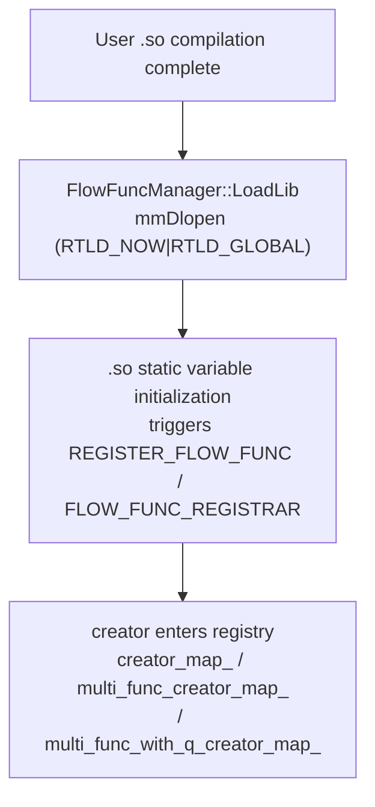
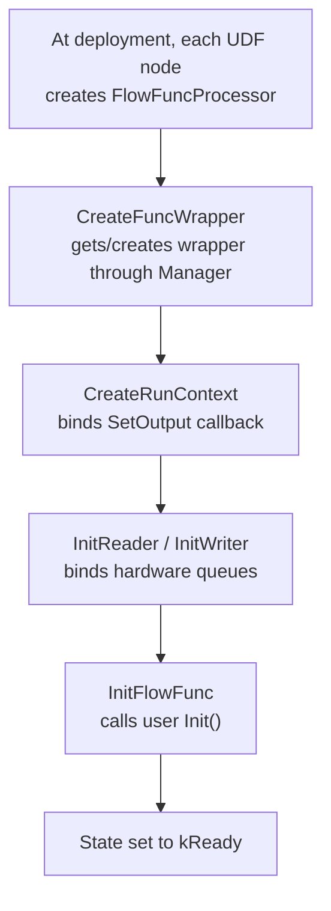
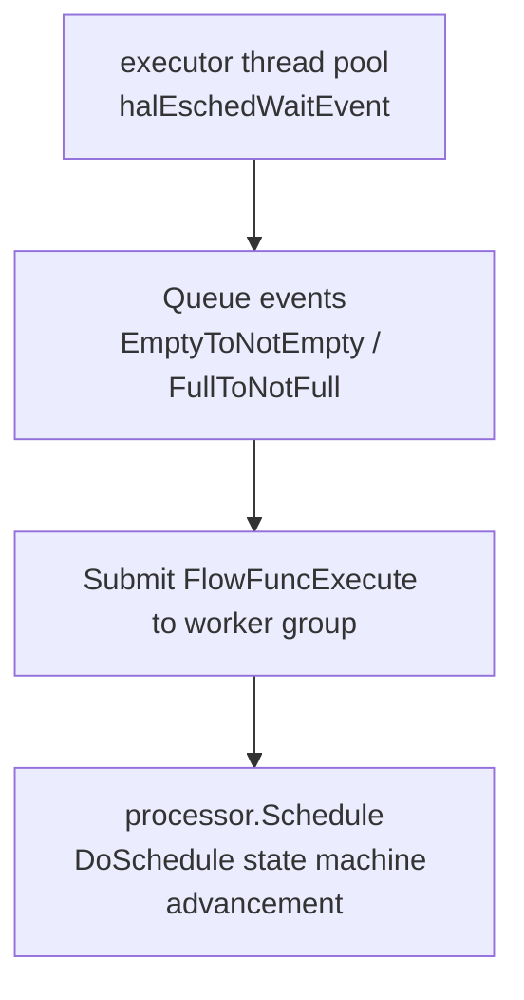
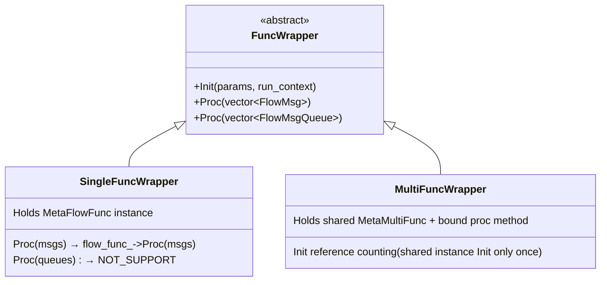
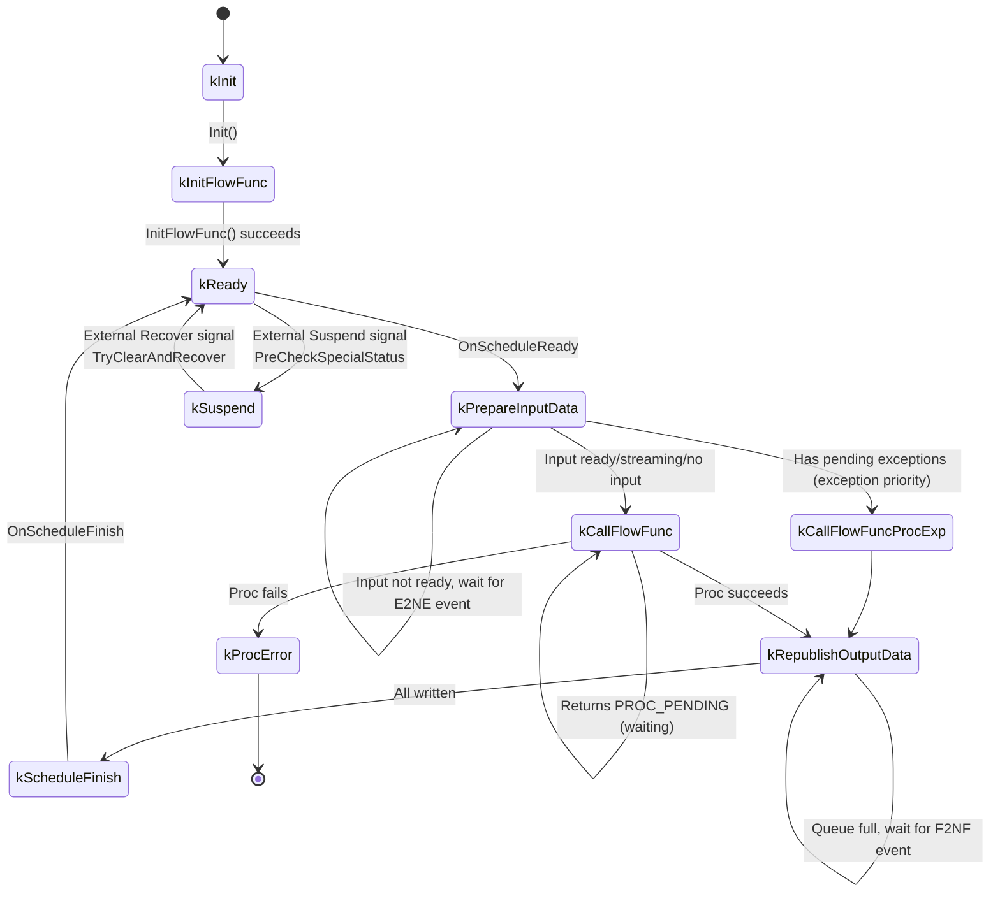
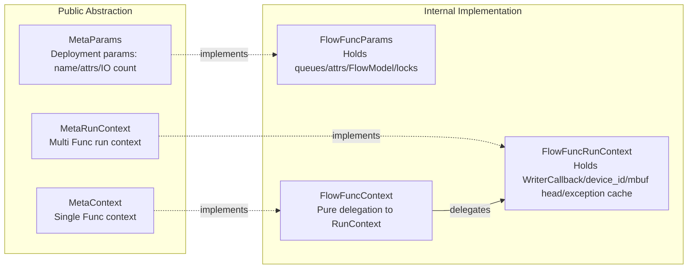
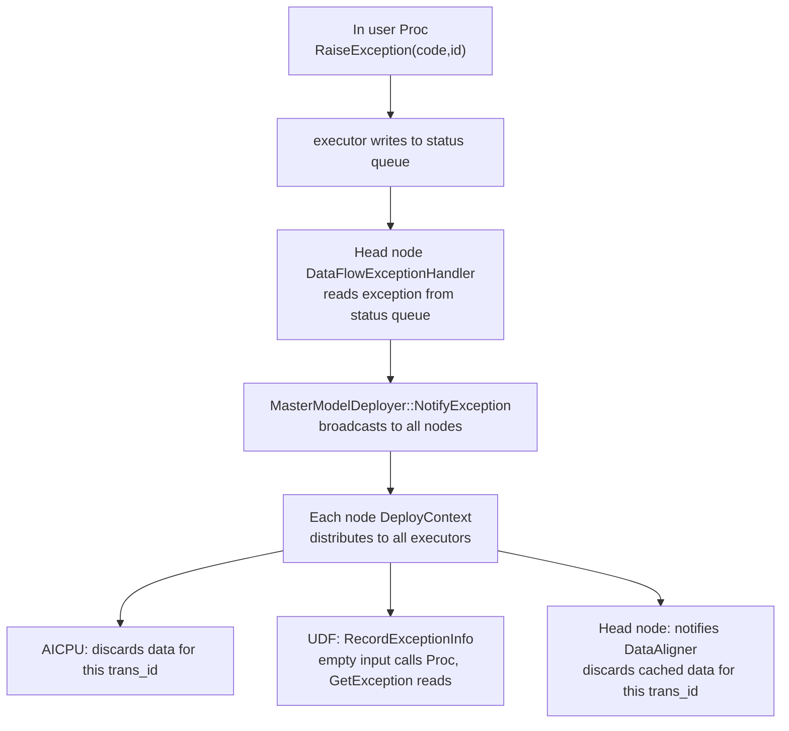

# UDF User Defined Function -- Programmable Processing Nodes in Data Flow Graphs

> This document describes how the UDF framework allows users to insert custom processing logic into DataFlow data flow graphs, and the complete mechanism from compiling user functions into SO, to discovery, loading, initialization, and repeated invocation by the event-driven state machine at runtime.

---

## 1. Feature Background

In DataFlow data flow graphs, nodes transfer data through queues. In most scenarios, the framework automatically handles data reading, alignment, and distribution, but the following scenarios require user intervention:

| Scenario | Problem | UDF Role |
|----------|---------|----------|
| Model concatenation format mismatch | Model A outputs FP16, Model B requires FP32 | UDF performs format conversion |
| Data splitting and load balancing | One model output needs distribution to multiple downstream instances | UDF splits and routes by strategy |
| Custom preprocessing/postprocessing | Cropping, normalization, and other operations needed before/after inference | UDF executes custom computation |
| Multi-model orchestration control | Deciding which model to call based on input content | UDF performs conditional routing |
| Batch aggregation | Multiple small data items need aggregation into a batch | Built-in TimeBatch/CountBatch UDF |

UDF serves as a processing node in the data flow graph, receiving upstream data, executing custom logic, and outputting results downstream. Its core value is **enabling users to insert custom processing logic into data flow graphs with minimal effort** -- the C++ side only requires defining a processing function class and compiling it into an SO, while the Python side uses the `@df.pyflow` decorator and does not even require writing C++ code.

**UDF execution location**: UDF can execute on either the host or the device, depending on the UDF type, compilation output, and deployment configuration (refer to Section [4.6](dflow.md#46-udf-execution-location-and-multi-instance-deployment) in dflow.md).

Users can specify which devices each node deploys to through the deployment configuration JSON (option `ge.experiment.data_flow_deploy_info_path`), supporting range syntax for multi-instance deployment. Refer to the "4.6 UDF Execution Location and Multi-instance Deployment" section in dflow.md.

UDF code is located in `dflow/udf/`. The core runtime is in `flow_func/`, the executor process (udf_executor, shared by host and device) is in `execute/`, and built-in UDFs are in `built_in/`.

---

## 2. Usage

### 2.1 C++ Implementation

Users inherit `MetaFlowFunc` (single Func) or `MetaMultiFunc` (multi Func), implement `Init` and `Proc`, and register with registration macros:

- **Single Func**: `REGISTER_FLOW_FUNC("MyAdd", MyAddFunc)`, implement `Init()` and `Proc(vector<FlowMsg>)` (`inc/external/flow_func/meta_flow_func.h`)
- **Multi Func**: `FLOW_FUNC_REGISTRAR(MyFunc).RegProcFunc("Proc1", &MyFunc::Proc1).RegProcFunc("Proc2", &MyFunc::Proc2)`, registering multiple processing functions in one node, with the runtime controlling which one to activate based on upstream (`inc/external/flow_func/meta_multi_func.h`)

In `Proc`, users allocate output through `context_->AllocTensorMsg()`, output results through `context_->SetOutput(idx, msg)`, read attributes set during graph construction through `context_->GetAttr()`, and invoke NN model inference through `context_->RunFlowModel()`.

### 2.2 Python Implementation

Python provides three approaches with decreasing entry barriers:

| Approach | Interface | Description |
|----------|-----------|-------------|
| Low-level API | `@ff.proc_wrapper` / `@ff.init_wrapper` | Corresponds to C++ interface, manual input/output management |
| High-level API | `@df.pyflow` | Decorator mode, automatic serialization, most concise code |
| NPU model | `@df.npu_model` | PyTorch model NPU zero-copy execution |

The `@df.pyflow` decorator automatically generates the UDF project (C++ wrapper + CMakeLists + configuration JSON), serializes the user function with cloudpickle, and compiles it into a loadable SO. User function parameters are automatically deserialized from FlowMsg to numpy array / torch tensor, and return values are automatically serialized back to FlowMsg.

For the implementation mechanisms and comparison of the `@df.pyflow` and `@df.npu_model` decorators, refer to [Section 4.5](dflow.md#45-python-interface-layer) of dflow.md.

The Python side provides the following supporting capabilities for UDF development:

| Capability | Entry | Description |
|------------|-------|-------------|
| Zero-copy output | `df.alloc_tensor` | Allocates an mbuf-shared Tensor inside the UDF; on output it is converted to FlowMsg zero-copy through a shared mbuf reference; ordinary df.Tensor output requires data copying, so using this interface is recommended |
| Streaming queue | `FlowMsgQueue` | The queue object received by the UDF in streaming input mode, implementing a subset of the `queue.Queue` interface (`get`/`get_nowait`/`qsize`/`empty`/`full`); tensor messages are automatically converted to df.Tensor |
| Deployment parameters | `PyMetaParams` | Reads deployment information inside the UDF: work_path, running device_id, instance index/count, and initialization parameters set via `set_init_param` during graph construction |
| Cooperative abort | `DfAbortException` | Thrown at streaming dequeue points during redeployment or process exit; the execution wrapper layer catches it to safely end the current call, cooperating with the framework for graceful exit; users do not need to handle it themselves |

---

## 3. Framework Call Chain

User functions are **never called directly**, but are wrapped layer by layer and driven by an event-driven scheduling state machine. The complete chain has three phases:

**Phase 1: SO Loading and Registration**

**Phase 2: Processor Initialization**

**Phase 3: Runtime Scheduling** (refer to [Section 4](#4-scheduling-core-flowfuncprocessor-state-machine))

### 3.1 SO Loading and Registration

`FlowFuncManager` is a global singleton (`flow_func/flow_func_manager.h`), holding **three registries**:

| Registry | Type | Purpose |
|----------|------|---------|
| `creator_map_` | Single Func factory | Registered by `REGISTER_FLOW_FUNC` |
| `multi_func_creator_map_` | Multi Func (message mode) factory | Registered by `FLOW_FUNC_REGISTRAR.RegProcFunc` |
| `multi_func_with_q_creator_map_` | Multi Func (queue mode) factory | Registered by `RegProcFuncWithQ` |

> Note: Some early documentation only mentions two registries; the actual code has three. The queue mode multi Func is used for streaming input scenarios.

**Key design: Single-thread serialization of SO operations.** All SO loading/unloading, user construction/destruction/Init are serially executed through a 1-thread `AsyncExecutor` (`ExecuteByAsyncThread` in `flow_func/flow_func_manager.cpp`). The reason is that static variable initialization, global state, and thread safety in user .so cannot be guaranteed; forced single-threading avoids race conditions and dlopen deadlocks.

**Factories (creators) are registered, not user instances.** Instances are created on demand during subsequent `GetFlowFuncWrapper` calls, allowing the same .so to serve multiple UDF node instances, each with its own independent user object. Multi Func `MetaMultiFunc` instances are shared by instance (`multi_func_inst_map_`); multiple procs within the same instance share the same user object.

### 3.2 FuncWrapper Unified Interface

`FuncWrapper` is the unified abstract base class (`flow_func/func_wrapper.h`), shielding the scheduler from the differences between "single Func" and "multi Func":

The scheduler uniformly calls `func_wrapper_->Proc(...)`; the two input modes (message/queue) select which `Proc` overload to call through the `is_stream_input_` flag (`ExecuteFunc` in `flow_func/flow_func_processor.cpp`).

Multi Func `Init` uses reference counting (`g_init_multi_func_list`) to ensure the same shared instance is only Init-ed once (`flow_func/multi_func_wrapper.cpp`), avoiding repeated Init calls that could corrupt user state.

---

## 4. Scheduling Core: FlowFuncProcessor State Machine

Each UDF node has one `FlowFuncProcessor` (`flow_func/flow_func_processor.h`), which is the scheduling core. It holds reader/writer, input data, cached output, and run context, driven by an event-driven state machine.

### 4.1 State Machine (10 States)

> Note: Some early documentation simplifies to 4 states; the actual code has 10 states.

| State | Description |
|-------|-------------|
| `kInit` / `kInitFlowFunc` | Initialization phase |
| `kReady` | Ready, can start a scheduling round |
| `kPrepareInputData` | Preparing input (reader read / alignment) |
| `kCallFlowFunc` | Calling user Proc |
| `kCallFlowFuncProcExp` | Handling upstream exceptions (empty input calls Proc) |
| `kRepublishOutputData` | Retrying cached output writes (cached when queue is full) |
| `kScheduleFinish` | One round complete |
| `kSuspend` | Suspended (for online model update / fault recovery) |
| `kProcError` | Unrecoverable error |

### 4.2 Event-driven Rescheduling

The Processor does not busy-poll; it relies on two types of queue events for wake-up (`flow_func/flow_func_processor.h`):

| Event | Trigger Condition | Effect |
|-------|-------------------|--------|
| `EmptyToNotEmpty` | Input queue empty to non-empty | Wakes Processor to reschedule |
| `FullToNotFull` | Output queue full to not full | Wakes Processor to retry writing cached data |

`CheckAndSetWaitNotEmpty`/`CheckAndSetWaitNotFull` retry immediately if the event has already occurred; otherwise they set a wait flag and yield scheduling. This avoids busy-waiting and missed events.

### 4.3 Watchdog Deadlock Prevention

If the Processor is stuck in `kPrepareInputData` or `kRepublishOutputData` for more than 1500ms, `NeedReplenishSchedule()` returns true. The executor main thread calls `CheckReplenishSchedule()` to proactively supplement scheduling when events time out. This prevents deadlocks caused by lost events.

### 4.4 Single-thread Scheduling Guarantee

`Schedule()` uses two `atomic_flag` spinlocks + `wait_schedule_flag_` to ensure only one thread schedules the same processor at any time. If a scheduling request arrives while scheduling is in progress, a flag is set and checked after scheduling ends to trigger rescheduling. The reason is that processor internal state (`input_data_`, `cache_output_data_`, `status_`) is not thread-safe.

### 4.5 Suspend/Resume Mechanism

Suspend and resume are triggered by external control signals (deployer sends Suspend/Recover messages), not by natural state machine transitions. After `SetClearAndSuspend`/`SetClearAndRecover` set the flags, `PreCheckSpecialStatus` detects and executes the transition at the next `DoSchedule` entry. Used for online model updates and fault recovery:
- **Suspend**: `ResetProcessor` + `DiscardAllInputData` to `kSuspend`, sends completion event. Input data is continuously discarded during suspension
- **Resume**: Discards input; if the wrapper has been released, rebuilds and re-calls `InitFlowFunc`; otherwise directly transitions to `kReady`
- **State reset**: After all processors finish suspending, the executor attempts a state reset on the user function. The Python UDF wrapper overrides this interface -- restoring the serialized function object and replaying the user class construction; on recovery the reset instance is reused directly. The C++ UDF base class does not support it by default, falling back to releasing the wrapper, and recovery follows the rebuild path above

### 4.6 Producer-Consumer Separation

In the executor thread pool, the main thread processes queue events (E2NE/F2NF) and submits `kEventIdFlowFuncExecute` to the worker group; worker threads execute `processor.Schedule()` to advance the state machine upon receiving events (`ThreadLoop` in `execute/flow_func_executor.cpp`). This separation prevents user code blocking from affecting event reception.

---

## 5. Data Alignment and Two Input Modes

### 5.1 DataAligner Multi-input Alignment

When a UDF has multiple inputs with inconsistent arrival rates, `DataAligner` (`reader_writer/data_aligner.h`) aligns inputs by **(trans_id, data_label)**:

- **Alignment key**: `pair<trans_id, data_label>`, read from the mbuf head `MbufHeadMsg`
- **Cache structure**: `map<(trans_id,data_label), CachedData>`, each CachedData holds one FIFO cache per queue
- **Completion judgment**: `IsComplete()` returns true when all queues are non-empty
- **Balanced routing**: `SelectNextIndex` selects the queue with the least cache for dequeue, balancing consumption rates across queues
- **Timeout/limit**: `align_timeout_` controls timeout, `align_max_cache_num` controls limits; discards or partially extracts based on `drop_when_not_align` policy

Exception linkage: `AddExceptionTransId` discards all cached data for that trans_id, preventing exception data from blocking alignment.

### 5.2 Reader-driven Mode (Default)

`is_stream_input_ == false`. The Processor uses `MbufReader` to automatically read from hardware queues, optionally uses `DataAligner` for alignment, and after readiness calls back `SetInputData` which transitions to `kCallFlowFunc` and calls `func_wrapper_->Proc(input_data_)`. Users do not need to concern themselves with when data arrives. Queue reads and writes are wrapped by `QueueWrapper`; when the UDF runs on the host it supports directly operating device queues, and such queues are read and written through the `ProxyQueueWrapper` wrapper with independent timeout and retry semantics.

### 5.3 FlowMsgQueue Streaming Mode

`is_stream_input_ == true` (determined by `FlowFuncParams::GetStreamInputFuncNames()`). The Processor does not create a reader; instead, it creates `MbufFlowMsgQueue` for each input queue, directly transitions to `kCallFlowFunc` and calls `func_wrapper_->Proc(flow_msg_queues_)`. Users control when and which input to read by calling `queue.Dequeue(timeout)` within Proc.

`MbufFlowMsgQueue::Dequeue` (`flow_func/mbuf_flow_msg_queue.cpp`) uses events + scheduling group switching to implement **cooperative blocking dequeue** -- subscribing to queue enqueue events, looping `halEschedWaitEvent` (1000ms per round) for waiting, during which scheduling group switching (`SwapOutGlobalGroup`) cooperates with AICPU scheduling. This allows users to block-wait for data without blocking the entire AICPU scheduling group.

> Note: Streaming mode does not support exception reporting/handling (`OnPrepareInput` directly transitions to kProcError).

---

## 6. Context System

Four layers of context with separated responsibilities (`inc/external/flow_func/` + `flow_func/`):

- **MetaParams** (`inc/external/flow_func/meta_params.h`): Deployment parameter access. `FlowFuncParams` (`flow_func/flow_func_params.h`) additionally holds attr_map, flow_models_, output_queue_locks_, scope, balance flags, and other deployment information.
- **MetaContext** (`inc/external/flow_func/meta_context.h`): Context held by single Func users. `FlowFuncContext` (`flow_func/flow_func_context.h`) is a **pure delegation** to `run_context_` -- it provides single Func users with a different interface appearance from MetaRunContext, but actual capabilities come from RunContext.
- **MetaRunContext** (`inc/external/flow_func/meta_run_context.h`): Context received by multi Func proc methods, with additional `AllocRawDataMsg`/`AllocTensorListMsg`/`ToFlowMsg` compared to MetaContext. `FlowFuncRunContext` (`flow_func/flow_func_run_context.h`) holds `WriterCallback` (bound to `Processor::SetOutput`), `device_id_`, `input_mbuf_head_` (output inherits input trans_id, and so on), and exception cache.

**SetOutput chain**: User `context_->SetOutput` to `FlowFuncContext::SetOutput` to `FlowFuncRunContext::SetOutput` to `writer_call_back_` to `FlowFuncProcessor::SetOutput` to `MbufWriter::WriteData` to `QueueWrapper::Enqueue` to `halQueueEnQueue`.

**GetUserData** (`FlowFuncRunContext::GetUserData`): Reads user-defined data (up to 64 bytes) from the mbuf head, used for cross-UDF user metadata passing (such as request IDs).

---

## 7. Message Abstraction

### 7.1 FlowMsg / Tensor (Public Abstraction)

`Tensor` (`inc/external/flow_func/flow_msg.h`): GetShape/GetDataType/GetData/GetDataSize/GetElementCnt/Reshape.

`FlowMsg` (same file): GetMsgType/GetTensor/GetRetCode/SetRetCode/GetTransactionId/GetFlowFlags/GetRouteLabel/GetRawData.

`MsgType`: TENSOR_DATA / RAW_MSG / TENSOR_LIST / USER_DEFINE_START(1024). `FlowFlag`: FLOW_FLAG_EOS (end of sequence) / FLOW_FLAG_SEG (segment discontinuity).

### 7.2 MbufFlowMsg (Internal Implementation)

`MbufFlowMsg` (`flow_func/mbuf_flow_msg.h`) wraps `shared_ptr<Mbuf>`. **mbuf memory layout**: the last 64 bytes of the head area (256B by default) is the `MbufHeadMsg` control information (trans_id/data_label/route_label/step_id/ret_code/flags/start_time/end_time, etc.); the data area is `[RuntimeTensorDesc(1024B)][actual data]`, where `RuntimeTensorDesc` contains dataAddr/dtype/shape[33] (shape[0] stores the dim count)/originalShape[33]/format/data_size.

- Output mbuf inherits input `MbufHead` (`AllocTensorMsg` passes `input_mbuf_head_`), ensuring trans_id pass-through
- Custom trans_id flag bit `kCustomTransIdFlagBit`: set only when the user explicitly calls `SetTransactionId(non-zero)`; otherwise the framework automatically assigns based on `current_trans_id_` (`FlowFuncProcessor::SetInputData`)

---

## 8. Load Balancing: OutOptions / BalanceConfig

Used for data splitting and routing in Scatter/Gather nodes (`inc/external/flow_func/balance_config.h`, `flow_func/out_options.cpp`).

**BalanceConfig**:
- `AffinityPolicy`: NO_AFFINITY / ROW_AFFINITY / COL_AFFINITY
- `BalanceWeight`: rowNum/colNum/matrix (null = all ones)
- `data_pos`: Position of each output message in the weight matrix

`BalanceOptionFilter` (`flow_func/flow_func_run_context.cpp`) computes `route_label` (determining downstream routing to which instance) and `data_label` (determining downstream alignment grouping) for each output message, and writes them to the mbuf head.

**Constraint**: Scatter nodes only allow NO_AFFINITY; Gather nodes do not allow NO_AFFINITY. Node types are marked by `FlowFuncParams::IsBalanceScatter()`/`IsBalanceGather()`.

---

## 9. Exception Handling: RaiseException / GetException

The exception mechanism is divided into "reporting" and "broadcast awareness" two stages:

**Reporting**: Users call `context_->RaiseException(code, id)` in Proc; the exception information is submitted to the executor through events, and the executor writes the exception mbuf to the status queue. The head node's `HeterogeneousModelExecutor` reads exceptions from the status queue through `DataFlowExceptionHandler`.

**Broadcast awareness**: After the head node receives an exception, it broadcasts the exception to all deployed nodes (including itself) through `MasterModelDeployer::NotifyException`. Each node's `DeployContext` sends the exception notification to all executors on that node (AICPU, UDF, head node itself).

**Data discarding**: When an exception occurs, the data aligner discards all cached data for that trans_id, preventing exception data from blocking subsequent normal data processing. `OnPrepareInput` checks for exceptions before preparing input, ensuring exceptions take priority over normal data processing.

---

## 10. Built-in UDFs

### 10.1 TimeBatch (`built_in/time_batch_flow_func.cpp`)

Registered name `_BuiltIn_TimeBatch`, single Func. Attributes:

| Attribute | Description |
|-----------|-------------|
| `window` | Time window (-1 indicates dynamic) |
| `batch_dim` | Concatenation dimension (-1 indicates new dimension) |
| `drop_remainder` | Whether to discard when window is not full |

Logic: Caches input until `end_time - start_time >= window` or EOS/SEG flag is received, then concatenates cached data along batch_dim for output. Uses FlowMsg start/end_time to track the window.

### 10.2 CountBatch (`built_in/count_batch_flow_func.cpp`)

Registered name `_BuiltIn_CountBatch`, single Func. Attributes:

| Attribute | Description |
|-----------|-------------|
| `batch_size` | Data count per batch |
| `timeout` | Timeout trigger (uses FlowFuncTimer) |
| `padding` | Zero padding value when insufficient |
| `slide_stride` | Sliding window stride (when >0, retains size-stride items after output for the next batch) |

> Note: Some early documentation only mentions `batch_size`; the actual implementation also has `timeout`/`padding`/`slide_stride` three attributes.

These two built-in UDFs are automatically inserted by the compiler's `ConvertBatchAttrToUdfPass` (when users configure TimeBatch/CountBatch in `DataFlowInputAttr`), reusing the UDF compilation and execution mechanism.

### 10.3 LLM Service Subsystem

`built_in/llm_*`, `entity/`, `fsm/` constitute a large built-in UDF `LlmServiceFlowFunc`, containing 13 procs (UpdateLink/AllocateCache/CopyCache/TransferCache, and so on), which is an independent feature for LLM PD separation / KV Cache cross-node transfer, reusing the UDF multi Func registration and scheduling mechanism. As an independent feature, it is not expanded in this framework document.

---

## 11. Auxiliary Systems

| System | File | Description |
|--------|------|-------------|
| Logging | `flow_func/logger/` | `FlowFuncLogger` based on dlog, with flow control (rate limiting) and per-level counts |
| Statistics | `flow_func_statistic.h` | One per processor: min/max execution time, IO size/shape, printed at exit |
| Timer | `flow_func_timer.h` | Singleton independent timing thread, supports triggering worker execution through events (used by CountBatch timeout) |
| Dump | `flow_func_dumper.h` | DI injection, processor asynchronously submits dump tasks through `async_executor_` to avoid blocking scheduling |
| Async execution | `async_executor.h` | Standard thread pool, used for SO single-thread serialization, async dump, and so on |
| FlowModel | `flow_model.h` | Abstract Init/Run, for `RunFlowModel` to call NN models |
| Memory statistics | `execute/udf_memory_statistic_manager.h` | Independent thread periodically reads process memory (RSS/HWM) and memory group usage and outputs logs |

### 11.1 UDF Data Dump

UDF input and output data can be dumped to disk for data problem localization, enabled through the following GE global configurations:

| Configuration | Description |
|---------------|-------------|
| `ge.exec.enableDump` | Master switch |
| `ge.exec.dumpPath` | Dump root directory, default `/var/log/npu/dump/udf` |
| `ge.exec.dumpStep` | Step filtering; `_` separates multiple items, `-` indicates a range (for example, `"1_3-5"` means steps 1, 3, 4, 5) |
| `ge.exec.dumpMode` | Dump content: `input` / `output` / `all` |

Key mechanism points:

- **Asynchronous execution**: The processor dumps inputs before calling the user Proc and outputs after `SetOutput`; tasks are executed asynchronously through `async_executor_` without blocking scheduling; filtering is based on the step_id carried by messages
- **Unified description and path**: Both sides reuse the DumpData protobuf structure of GE's general dump, with the dump path `{dumpPath}/{deviceId}/{opName}/0/{stepId}/{opName}.{timestamp}`
- **Host-side execution**: The executor writes to disk itself, with file content `[proto length][DumpData protobuf][input/output binary data]`
- **Device-side execution**: The executor is not responsible for writing to disk -- it only records the device address of the data, packs the "data description + target file path" into a message and sends it to the AICPU via a synchronous event; the AICPU side reads the data and completes the dump. Before the first dump, a dump initialization event must be sent to the AICPU

Profiling is currently a reserved capability; data reporting is not yet implemented.

---

## 12. Executor Process

`FlowFuncExecutor` (`execute/flow_func_executor.h`) is the event-driven driver for the udf_executor process, running as an independent process (`execute/main.cpp` entry). Host and device deployments reuse the same executor implementation; behavior differences within the process (such as queue forms, and the security sandbox which is only enabled on the device) are distinguished by the running location (`IsOnDevice` flag).

**Thread model** (`ThreadLoop` in `execute/flow_func_executor.cpp`): `FlowFuncThreadPool` (AICPU core-bound) creates cpu_num threads. The **main thread** subscribes to all events (queue/initialization/timer/state/suspend-resume/exception, and so on), using the main scheduling group; **worker threads** only subscribe to `kEventIdFlowFuncExecute` + `NotifyThreadExit`, using the worker scheduling group. Loops `halEschedWaitEvent` (2s timeout) and `ProcessEvent` dispatches by event ID. On timeout, the main thread calls `CheckReplenishSchedule` for supplementary scheduling.

**GlobalConfig** (`config/global_config.h`): The executor-process-side implementation of `FlowFuncConfig` (singleton), holding device_id, scheduling group IDs, worker_num, npu_sched, abnormal/exit flags, and so on. Injected into the core library through `FlowFuncConfigManager::SetConfig` -- this **dependency injection** allows the core library (`flow_func/`) to be independently compiled and tested without depending on specific device environments.

**FlowFuncModel** (`model/flow_func_model.h`): UDF node deployment descriptor parsed from protobuf, containing lib_path, flow_func_name, input/output queues, multi_func_input/output_maps, stream_input_func_names, input_align_attrs, attr_map, and so on. `ParseModels` parses multiple models from the local file pointed to by the startup argument -- udf_executor model loading does not go through message queues, which only carry runtime control messages (suspend/resume/exception notification, etc.).

### 12.1 Security Sandbox (device side)

User SOs are untrusted code; the device-side udf_executor guarantees security through a dual mechanism:

- **System call sandbox**: When running as a non-built-in UDF user, every thread in the thread pool (including the dedicated SO loading thread) installs a system call whitelist filter via libseccomp at startup -- denying by default (returning EPERM), allowing only basic system calls (file read/write, memory management, futex, etc.), with intercepted calls logged. Static initialization code of user SOs also runs inside the sandbox
- **Built-in user restriction**: When running as the device built-in user, the process is only allowed to load built-in UDF SOs and rejects any user SO. The responsibilities of the two process types are separated: built-in UDF processes have no sandbox restrictions but run only trusted code; user UDF processes sandbox all threads

`stubs/seccomp/` provides link stubs when the cross-compilation/deployment environment lacks the real libseccomp.

### 12.2 Process Resilience

- **Parent process exit monitoring**: Periodically checks the parent process PID; on change it attempts a normal exit, and force-terminates itself after multiple exit failures, avoiding orphan processes
- **SIGTERM graceful exit**: Registers a signal handler; on receipt it stops scheduling and waits for user functions to return safely before exiting

### 12.3 Runtime Governance

- **Scheduling priority**: Models can configure AICPU esched process/event priorities (`_eschedProcessPriority` / `_eschedEventPriority`)
- **Status reporting**: Queries input queue depths per model configuration to construct status messages, written to the status queue for the head node to sense load and abnormalities
- **Memory and runtime metrics**: An independent thread periodically collects process memory (RSS/HWM) and memory group usage; execution metrics per processor are output periodically
- **Soft scheduling mode**: At startup, attempts to submit a soft scheduling mode switch event to the AICPU, cooperating with the driver for scheduling mode negotiation
- **Model-level configuration**: `__cpu_num` customizes the execution thread count (default is processor count + 1); `_user_buf_cfg` configures the user-mode memory pool; in multi-instance deployment, models carry replica index/count, exposed to user UDFs through the `GetRunningInstanceId`/`GetRunningInstanceNum` interfaces of `MetaParams` (not used by built-in UDFs), for users to perform data sharding and similar processing based on instance identity

---

## 13. External Header Files

`inc/external/flow_func/` provides all interfaces for UDF development:

| Header File | Content |
|-------------|---------|
| `meta_flow_func.h` | `MetaFlowFunc` single Func base class + `REGISTER_FLOW_FUNC` macro |
| `meta_multi_func.h` | `MetaMultiFunc` multi Func base class + `FlowFuncRegistrar` template + `FLOW_FUNC_REGISTRAR` macro |
| `meta_context.h` | `MetaContext` single Func context abstraction |
| `meta_run_context.h` | `MetaRunContext` multi Func run context abstraction |
| `meta_params.h` | `MetaParams` deployment parameter abstraction |
| `flow_msg.h` | `Tensor`, `FlowMsg`, `MsgType`, `FlowFlag`, `FlowBufferFactory` |
| `flow_msg_queue.h` | `FlowMsgQueue` streaming queue abstraction |
| `balance_config.h` | `AffinityPolicy`, `BalanceWeight`, `BalanceConfig` |
| `out_options.h` | `OutOptions` |
| `dflow_attr_value.h` | `AttrValue` (GetVal multi-type overloads) |
| `flow_func_defines.h` | Error codes, visibility macros |
| `flow_func_log.h` | `FlowFuncLogger`, logging macros |

### Error Codes

| Error Code | Value | Description |
|------------|-------|-------------|
| `FLOW_FUNC_SUCCESS` | 0 | Success |
| `FLOW_FUNC_FAILED` | 564000 | General failure |
| `FLOW_FUNC_ERR_PARAM_INVALID` | 164000 | Invalid parameter |
| `FLOW_FUNC_ERR_ATTR_NOT_EXITS` | 164001 | Attribute does not exist |
| `FLOW_FUNC_ERR_TIME_OUT_ERROR` | 564001 | Timeout |
| `FLOW_FUNC_ERR_USER_DEFINE_START` | 9900000 | User-defined error code start |

> Note: In addition to the above external error codes, `flow_func_defines.h` and `common/inner_error_codes.h` also define internal status codes such as `INIT_AGAIN`/`PROC_PENDING`.

---

## 14. Key Design Summary

### 14.1 Dependency Injection Decoupling

The core library (`flow_func/`) accesses the environment through the `FlowFuncConfig` abstraction; the default implementation is a host stub (`flow_func_config_manager.cpp`), and the device side injects through `GlobalConfig`. This allows the core library to be independently compiled and tested.

### 14.2 Single-thread Serialization of User Code

All SO loading/unloading, user construction/destruction/Init are serialized through a 1-thread `AsyncExecutor` (`flow_func_manager.cpp`), avoiding thread safety issues in user .so. When worker_num==1, even Proc uses that thread.

### 14.3 Event-driven + Cooperative Scheduling

The Processor does not poll; it relies on queue events for wake-up. The executor uses AICPU esched events + scheduling group switching for multi-thread cooperation; streaming dequeue also uses events + group switching for non-blocking-style blocking. The watchdog `NeedReplenishSchedule` prevents deadlocks from lost events.

### 14.4 Ordering and Backpressure

When the output queue is full, `cache_output_data_` caches for ordered retransmission; input alignment by (trans_id, data_label); exceptions take priority over normal data processing.

### 14.5 Full-chain Exception Handling

Reports through status queue to head node broadcast to each node executor awareness and processing in a star topology. When an exception occurs, the aligner discards data for that trans_id, ensuring subsequent data processes normally. `RaiseException` deduplicates (reports only once per trans_id), downstream `GetException` reads once then clears.

### 14.6 Unified Abstraction

`FuncWrapper` unifies single/multi Func; `FlowMsg`/`MbufFlowMsg` unify messages; `MetaContext`/`MetaRunContext` separate single/multi Func context appearance but share `RunContext` implementation. The scheduler does not need to distinguish user coding patterns.

---

## Appendix: Key File Index

| File | Responsibility |
|------|----------------|
| `flow_func/flow_func_manager.cpp` | Global singleton, SO loading + three registries |
| `flow_func/flow_func_processor.cpp` | Scheduling core, 10-state state machine |
| `flow_func/single_func_wrapper.cpp` | Single Func wrapper |
| `flow_func/multi_func_wrapper.cpp` | Multi Func wrapper, reference counting Init |
| `flow_func/flow_func_run_context.cpp` | Runtime context, SetOutput/exception/load balancing |
| `flow_func/mbuf_flow_msg.h` | MbufFlowMsg message implementation, mbuf layout |
| `flow_func/mbuf_flow_msg_queue.cpp` | Streaming queue, cooperative blocking dequeue |
| `reader_writer/data_aligner.cpp` | Multi-input alignment |
| `reader_writer/mbuf_reader.cpp` | Hardware queue reading |
| `reader_writer/queue_wrapper.cpp` | Queue enqueue/dequeue wrapper |
| `reader_writer/proxy_queue_wrapper.cpp` | Wrapper for directly operating device queues from the host side |
| `toolchain/dump/udf_dump_manager.cpp` | Dump enabling/step filtering/disk-write management |
| `execute/flow_func_executor.cpp` | Event-driven driver of the executor process |
| `execute/main.cpp` | Executor process entry |
| `built_in/time_batch_flow_func.cpp` | Built-in TimeBatch UDF |
| `built_in/count_batch_flow_func.cpp` | Built-in CountBatch UDF |
| `inc/external/flow_func/meta_flow_func.h` | Single Func base class + registration macro |
| `inc/external/flow_func/meta_multi_func.h` | Multi Func base class + registration macro |
