# ES (Eager Style) Graph Construction

## Requirement Overview

Current graph construction interface example:

```C++
std::unique_ptr<ge::Graph> BuildAddGraph() {
  auto graph = std::make_unique<ge::Graph>("graph");
  auto data0 = op::Data("data0").set_attr_index(0);
  auto data1 = op::Data("data1").set_attr_index(1);
  auto add = op::Add("add").set_input_x1(data0).set_input_x2(data1);
  graph->SetInputs({data0, data1}).SetOutputs({add});
  return graph;
}
```

Advantages of the current graph construction interface:

1. Node-edge separation approach for graph construction, offering flexible and powerful construction methods

Pain points of the current graph construction interface:

1. Cumbersome to use, requires instantiating IR based on prototypes, then setting inputs, outputs, and attributes according to prototype definitions
2. Errors are not easily detected; graph construction errors may only be discovered when actual graph compilation begins
3. C++ interface with no ABI compatibility guarantee
4. No forward/backward compatibility design

Current state of graph construction interfaces in the industry:

1. Most graph construction styles adopt functional approach (functional graph construction directly expresses node connection relationships through function calls)
2. Advantages of functional over node-edge separation: simple, compile-time error detection in C++
3. Disadvantages of functional over node-edge separation: inflexible, must construct graph in topological order; weaker functionality, no node concept, graph construction and modification interfaces cannot be unified

Conclusions about the two styles:

1. Pure graph construction scenarios are suitable for functional style, with simplicity and good robustness
2. Comprehensive scenarios (graph construction, modification, traversal) use node-edge separation approach

ES goals:

1. Target graph construction scenarios, adopt functional style, provide easy-to-use interfaces
2. Generated directly from IR definitions, avoiding manual writing, reducing workload
3. Support multiple languages: Python, C++, C
4. API/ABI compatibility
5. Backward and forward compatibility

## Overall Design

**ES (Eager Style)** is a **functional-style graph construction API**. Its syntax design draws from PyTorch Eager mode scripting style, hence the name. Its core philosophy is to directly express edge relationships between nodes and IR information passing through function calls.

The overall data flow for graph construction is shown below:

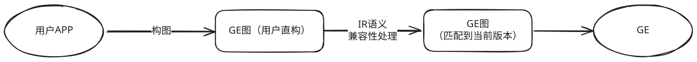

Constructing a usable `GE` graph is divided into two phases:

1. **Graph Construction Phase**: Complete graph construction based on the `OPP` version that the user `APP` depends on, resulting in an initial graph called "user direct graph"
2. **IR Semantic Compatibility Processing Phase**: When the `OPP` version in the runtime environment differs from the version used during graph construction, this phase is entered. The system parses the semantics of the "user direct graph" based on the graph construction `IR` version and attempts to adjust it to a "compatible graph" that conforms to the runtime environment capabilities. If compatibility conversion cannot be completed due to missing semantics or exceeding current environment support, an error is returned and execution is terminated

Logically, the graph construction `lib` encapsulated on top of the `Operator` series graph construction `API`:

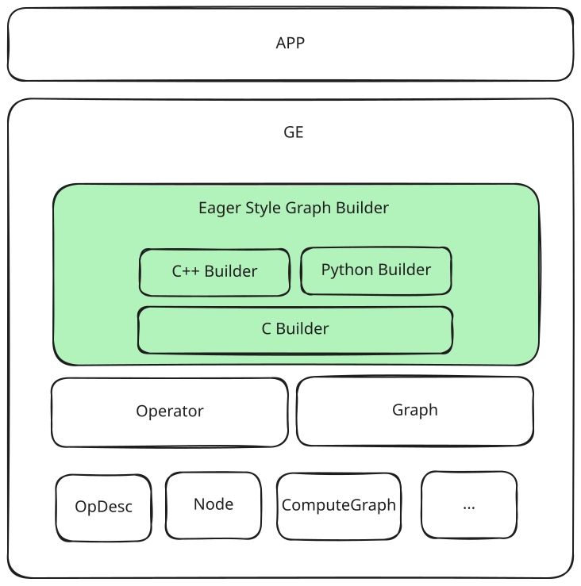

`es` is implemented in `C` language as the core, with `C++` and `Python` interfaces encapsulated on top. Shared capabilities (such as compatibility assurance and common functions) are concentrated in the `C Builder` layer, while `C++` and `Python` layers provide syntax encapsulation according to their respective language characteristics.

The entire graph construction interface adopts functional style, covering all current `GEIR` definitions (excluding `AscendCIR`). Strictly speaking, `GEIR` is not an independent concept, but since parts of `AscendIR` (such as `AscendCIR`) are beyond the scope of this design, the term "GEIR" in the following text specifically refers to the `AscendIR` subset excluding `AscendCIR`.

To reduce maintenance costs, the interface adopts an automatic generation mechanism: based on `GEIR` definitions with minimal manual annotations, combined with unified graph construction API specifications, automatically generating complete `es` functional graph construction interfaces and packaging them into `opp` operator packages for external release.

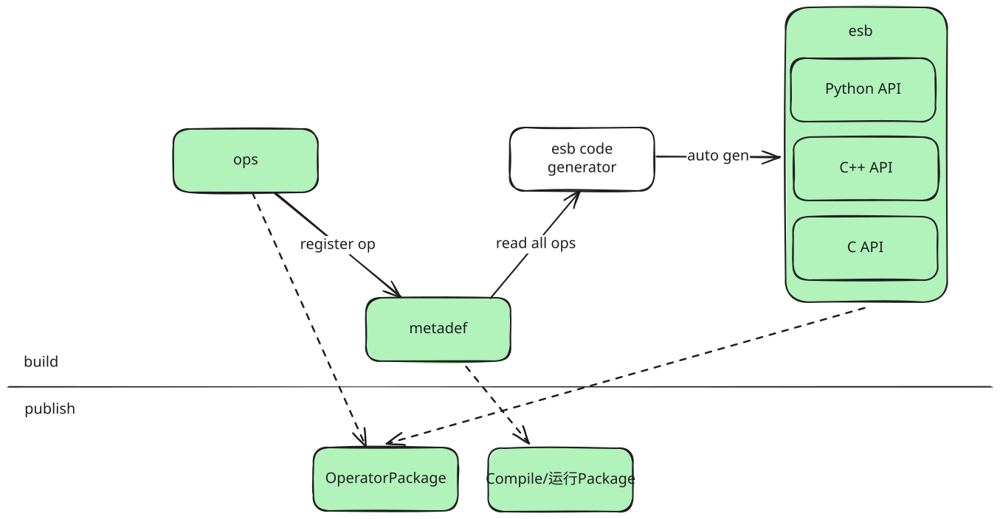

## API/ABI Compatibility Design

Forward and backward compatibility is a basic specification for external `API` of `CANN`. `esb` is positioned as a graph construction series `API`, so compatibility design is particularly important and considered as the primary factor.

### Forward/Backward Compatibility Scenario Analysis

According to `CANN` compatibility requirements, a runtime environment can have at most four `CANN` versions:

1. `GE` package version: contains `GE` business (graph compilation, graph execution) and basic data structures (`metadef`), packages 3, 4, 6
2. `opp` package version: contains operator packages, package 8
3. `GE` package version used when building user `APP`: the `GE` package installed in the build environment when building user `APP`. The basic data structures used in the `APP` are the same as this package
4. `opp` package version used when building user `APP`: the `OPP` package installed in the build environment when building user `APP`. The operator definitions used in the `APP` are the same as this package

`GE` package interface is a general graph construction interface (`Operator` series interface), which does not focus on specific operator definitions, is mature and highly stable, considered to already meet compatibility requirements. The key to compatibility lies in the `opp` package.

From compatibility requirements, operator graph construction interfaces need to satisfy `API` and `ABI` forward and backward compatibility within a certain cycle. Specifically, the following requirements should be met:

1. After upgrading `opp` package: without recompiling `APP`, the `APP` can correctly construct graphs; with recompiling `APP`, no code modification needed, recompilation passes and graphs can be correctly constructed
2. After downgrading `opp` package, `APP` does not use capabilities that no longer exist after downgrade: same behavior as upgrading `opp` package
3. After downgrading `opp` package, `APP` uses capabilities that no longer exist after downgrade: graph construction fails with error

Continuing to expand the analysis, compatibility satisfies the following requirements:

1. `API` compatibility: after upgrading or downgrading `CANN` version, as long as new capabilities are not used, `APP` can compile successfully
2. `ABI` compatibility: after upgrading or downgrading `CANN` version, as long as new capabilities are not used, `APP` can normally call interfaces to complete graph construction without recompilation
3. `IR` semantic compatibility: after upgrading or downgrading `CANN` version, as long as new capabilities are not used, the graph constructed by `APP` has correct semantics and can be understood and work normally by `GE`

### C Language API/ABI Compatibility

The `C` language cannot directly express optional inputs and optional attributes in IR. For example, the following `IR` definition contains an optional input `xo` and an optional attribute `a` with a default value of `0`:

```C
// IR definition
REG_OP(Foo)
  .INPUT(x)
  .OPTIONAL_INPUT(xo) // optional input xo
  .ATTR(a, Int, 0) // optional attribute a, default is 0
```

The corresponding `C API` can only be represented with a fixed parameter list, unable to reflect parameter optionality:

```C
// C API
Tensor *Foo(Tensor *x, Tensor *xo, int64_t a);
```

When IR definition undergoes compatible extension (e.g., adding a new optional attribute `b`), the `C API` must also add corresponding parameters:

```C
// New IR definition: added optional attribute b
Tensor *Foo(Tensor *x, Tensor *xo, int64_t a, int64_t b);
```

Although semantically this is a backward-compatible change, the `C` function signature changes, causing `API` incompatibility. This is an unavoidable constraint due to language capability limitations.

To provide stable and reliable compatibility assurance when using `C` interfaces, `esb` adopts static linking to inline `libesb.a` into the target application, ensuring interfaces are frozen at compile time and decoupled from the external runtime environment.

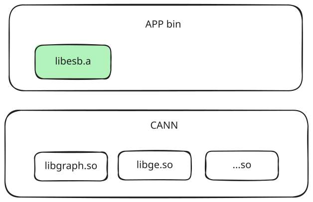

As shown above, `app` links the `esb` module as a static library into the `app` binary to isolate the impact of `CANN` version upgrades and downgrades. In `libesb.a`, it calls the `Operator` series public interfaces, so compatibility can be guaranteed between `libesb` and `CANN lib`. When `CANN` version changes, the `libesb` used by runtime environment `app` remains unchanged:

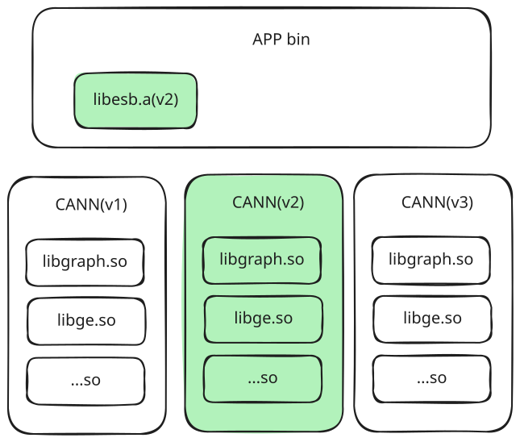

As shown above, `app` depends on `CANN` version `v2` at compile time and statically links `libesb.a` into the final executable. At runtime, even if the `CANN` version in the system environment differs from compile time, the `libesb.a` used by `app` remains unchanged, and compatibility is guaranteed by the stable `Operator` series interfaces that `libesb` depends on.

If users recompile the program after `CANN` upgrade or downgrade, the graph construction interface may become incompatible due to `CANN` API changes. To avoid such issues, users are advised to copy `libesb.a` and its corresponding header files to their own project's `third_party` directory during initial integration and always use that copy as the baseline for building until explicitly deciding to switch to another version of `CANN`.

Note: libesb.a is not the actual static library name in the real environment, but a collective term for es base and es generated libraries

### C++ Language API/ABI Compatibility

Compared to `C` language, `C++` provides more powerful syntax capabilities such as function overloading and default parameters, making it more flexible in handling `IR` interface compatibility evolution. However, since `C++` lacks a unified ABI standard, implementations across different compilers and their versions may differ, leading to cross-version or cross-platform ABI incompatibility issues.

To balance syntax flexibility and binary compatibility, the `C++` graph construction interface of `esb` is designed as a header-only library, with all implementations calling underlying stable `C` interfaces through forced inline. At compile time, it enjoys `C++` syntax convenience; at link time, it depends on stable `C` layer implementation, thereby ensuring overall `ABI` consistency and portability. Through this design, `ABI` and `IR` semantic compatibility issues in `C++` graph construction are converted to corresponding issues in `C`. Compared to `C` language, `C++` does not have `API` incompatibility issues, so the `libesb.a` and header file copying mentioned in the `C` chapter is not needed in `C++`.

`C++` expresses optional attributes through default parameters and adapts optional inputs through overloading. For example, the following `IR` definition contains an optional input `xo` and an optional attribute `a` with a default value of `0`:

```C++
// IR definition
REG_OP(Foo)
  .INPUT(x)
  .OPTIONAL_INPUT(xo1) // optional input xo1
  .ATTR(a, Int, 0) // optional attribute a, default is 0
  .OUTPUT(y)
```

The corresponding `C++ API` is:

```C++
namespace es {
FORCE_INLINE Tensor *Foo(const Tensor *x, const Tensor *xo1, int64_t a=0);
}
```

Adding an optional input `xo2` and an optional attribute `b`:

```C++
namespace es {
// v1 version
FORCE_INLINE Tensor *Foo(const Tensor *x, const Tensor *xo1,
  int64_t a=0);

// v2 version, overload version due to new optional input, with one more `xo2` input
FORCE_INLINE Tensor *Foo(const Tensor *x, const Tensor *xo1, const Tensor *xo2,
  int64_t a=0, int64_t b=0);
}
```

It should be emphasized that the purpose of overloading is not to simplify calls, but for **compatibility assurance**. For example, if multiple optional inputs (such as `o3` and `o4`) are added in version `V3`, only one new overload version will be introduced, rather than adding separate overloads for each new input.

#### Dynamic Library and Static Library Compatibility Support Analysis

Given the previously mentioned approach of using C++ overloading and inlining current version C implementation:

**Compatibility in Dynamic Library Scenario**:

- **Cannot satisfy ABI compatibility**: If the C function signature changes (parameter count changes), user APP must be recompiled, otherwise it will cause runtime errors (coredump)
- **Can only satisfy API compatibility**: Through C++ overloading, users can choose to use v1 or v2 version API, while **needing to rely on deprecated overload interface mechanism**: through `[[deprecated]]
` attribute-decorated overload interfaces, guiding users to choose graph construction interfaces that are more favorable for forward compatibility, avoiding misuse that leads to forward compatibility issues

**Compatibility in Static Library Scenario**:

- **Can satisfy ABI compatibility**: APP has already linked the corresponding version C function implementation, parameters match, no parameter mismatch issue
- **Can satisfy API compatibility**: Through C++ overloading, users can choose to use v1 or v2 version API, while **needing to rely on deprecated overload interface mechanism**: through `[[deprecated]]
` attribute-decorated overload interfaces, guiding users to choose graph construction interfaces that are more favorable for forward compatibility, avoiding misuse that leads to forward compatibility issues
- **Depends on [IR Semantic Runtime Compatibility Processing](#ir-semantic-compatibility-design)**: Even if IR definition has changed, correctness can be guaranteed through IR semantic runtime compatibility processing

Therefore, users can combine actual situations in their own code projects to link ES API dynamic library or static library

#### Special Scenario Discussion: Compatibility Loss Due to Misuse of Overloaded Interfaces

Each `C++` overloaded version API is bound to a specific version `IR` definition. When users use inappropriate overload forms, even if actual functionality is not used, it may break forward compatibility due to signature changes.

Taking the above `Foo` interface as example, assume in `V2` version optional input `xo2` was introduced. Although user does not use this input, they still wrote the following call:

```C++
auto foo = Foo(x, nullptr, nullptr /* xo2 */);
```

At this point if runtime environment falls back to `V1` version and attempts recompilation, although `xo2` is actually `nullptr`, it will still cause compilation error because the overload signature no longer exists, causing forward compatibility failure.

To avoid this type of misuse as much as possible, introduce fool-proof mechanism in overload design, through `std::nullptr_t` parameter combined with `[[deprecated]]` marker, provide compile-time hints for typical incorrect calls:

```C++
namespace es {
[[deprecated("Passing nullptr as xo2 may break forward compatibility. "
  "Use this version instead: "
  "Foo(const Tensor *x, const Tensor *xo1, int64_t a=0, int64_t b=0). "
  "See http://xxxx for more info.")]]
FORCE_INLINE Tensor* Foo(const Tensor* x, const Tensor* xo1, std::nullptr_t xo2,
int64_t a = 0, int64_t b = 0);
}
```

This mechanism can effectively catch cases of directly passing `nullptr`, but cannot trigger warnings for the following forms:

```c++
Tensor* xo2 = nullptr;
auto foo = Foo(x, nullptr, xo2);  // Cannot detect
```

Therefore, although API design has tried to prevent misuse, it is still recommended to clearly remind users in development documentation and usage instructions: **Avoid using overloaded interfaces beyond the target deployment environment, especially when corresponding IR capabilities are not enabled.**

Note 1: Type names etc. in above pseudocode may vary, refer to actual code;

Note 2: C++ overload mechanism design is documented separately, refer to [es_cxx_compatibility_design.md](es_cxx_compatibility_design.md)

### `Python` Language `API` Compatibility

`Python` as a dynamic language does not involve compile-time symbol linking, therefore does not need to consider `ABI` compatibility issues. Compared to `C++`, although `Python` does not support function overloading, its good support for keyword arguments makes it very suitable for expressing optional attributes and optional inputs.

This design continues the interface style from `torchair`: using positional parameters to represent inputs, keyword parameters to represent attributes. This approach can clearly distinguish inputs from attributes, and is convenient for extension and compatibility.

The following `IR` example defines a required input, an optional input, a required attribute and an optional attribute:

```C++
// IR definition
REG_OP(Foo)
  .INPUT(xr)
  .OPTIONAL_INPUT(xo)       // Optional input xo
  .REQUIRED_ATTR(a, Int)    // Required attribute, no default value
  .ATTR(b, Int, 0)          // Optional attribute, default value 0
```

Its `Python API`:

```Python
def Foo(xr: Tensor, xo: Optional[Tensor] = None, *, a: int, b: int = 0):
    """
- `xr` is required input
- `xo` expresses optional input through optional positional parameter
- `a` is required attribute, must be passed as keyword
- `b` is optional attribute, uses keyword parameter with default value specified
"""
```

In the next version, add optional input `xo1`, optional attribute `c`, then `API` becomes:

```Python
def Foo(xr: Tensor, xo: Optional[Tensor] = None, xo1: Optional[Tensor] = None,
        *, a: int, b: int = 0, c: int = 0):
```

Note: Type names etc. in above pseudocode may vary, refer to actual code

## `IR` Semantic Compatibility Design

When user completes graph construction based on version `A` `IR` definition, if compiling in version `B` environment, and `A` and `B` use different operator definitions, `GE` will attempt to restore and understand graph construction intent, and adapt the graph to conform to version `B` `IR` specification. This process is the `IR` semantic compatibility processing flow.

`IR` semantic compatibility only applies to scenarios using `C/C++` graph construction with **static linking**. In this mode, graph construction `lib` (`libesb`) is embedded into APP binary at compile time, therefore runtime may encounter situations where graph construction version differs from runtime environment, requiring adaptation through `GE` semantic compatibility mechanism.

In scenarios using `Python API` for graph construction, since there is no linking process, graph construction operations are always dynamically initiated at runtime, and graph construction behavior directly depends on `IR` definitions in the runtime environment. Therefore, graph construction version and runtime version naturally remain consistent, and there is no semantic compatibility processing.

At runtime, the call relationships of three graph construction methods are shown in the following figure:

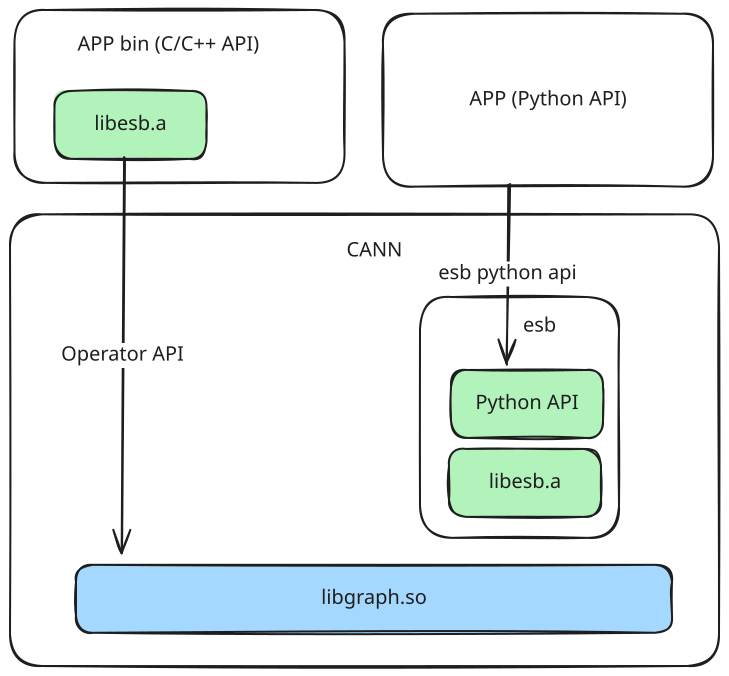

### `IR` Semantic Compatibility Processing

Currently supported IR compatibility changes include:

- **Add new optional input**: Append new optional input to the end without affecting existing input sequence
- **Add new supported data types**: Add more supported data types for existing input or output
- **Add new optional attribute**: Introduce new attribute with default value

Except for the above cases, any other IR definition changes belong to **incompatible changes**. If there is actual need, need to implement through new independent IR operator.

During semantic compatibility processing, GE will parse and restore semantics of each operator in the graph based on direct graph version's IR information. If can successfully map to compatible graph version IR supported semantics and capabilities, then considered graph compatible; otherwise (e.g., encountering unsupported input/attribute combination, semantic ambiguity or behavior difference), compatibility processing fails, process terminates and returns error.

New supported data types in IR have been handled by inference and capability check (`dtype inference` and `check support`) mechanism explicitly, not included in semantic compatibility flow.

Semantic compatibility processing mainly handles two types of changes: **optional attribute**, **optional input**

The following table shows processing logic for node attributes and inputs when direct graph IR and compatible graph IR are inconsistent:

| [Input] Direct Graph IR | [Input] Compatible Graph IR | [Input] Direct Graph Node | [Output] Compatible Graph Node |
| ---------- | ---------- | --------- | -------------------------- |
| Has optional attribute | Does not have optional attribute | Has this attribute | ❌ Forward compatibility scenario: used new attribute, **error and exit** |
| Has optional attribute | Does not have optional attribute | Does not have this attribute | ✅ Forward compatibility scenario: did not use new attribute, **delete this attribute** |
| Does not have optional attribute | Has optional attribute | Has this attribute | ❌ Error scenario: **error and exit** |
| Does not have optional attribute | Has optional attribute | Does not have this attribute | ✅ Backward compatibility scenario: did not use new attribute, **use default value** |
| Has optional input | Does not have optional input | Optional input connected | ❌ Forward compatibility scenario: used new input, **error and exit** |
| Has optional input | Does not have optional input | Optional input not connected | ✅ Forward compatibility scenario: did not use new input, **delete this input** |
| Does not have optional input | Has optional input | Optional input connected | ❌ Error scenario: **error and exit** |
| Does not have optional input | Has optional input | Optional input not connected | ✅ Backward compatibility scenario: did not use new input, **ignore processing** |

**Notes on Compatibility Direction Judgment**

From the above processing rules we can see that **semantic compatibility judgment only depends on two versions' IR definition structural difference** and can be completed, no need to perceive specific version number, also no need to explicitly distinguish "forward" or "backward" compatibility.

But for robustness consideration, still should do compatibility consistency validation in following scenarios: If direct graph IR compared to compatible graph IR simultaneously has new attributes or inputs, and also missing some attributes or inputs, then it indicates IR has undergone incompatible modification, graph version cannot be directly adapted, semantic compatibility should terminate and return error.

## API Style Design

The entire graph construction process is divided into four steps:

1. **Create graph builder (`EsGraphBuilder`)**
   Initialize graph builder instance, used to provide context required for graph construction, workspace and construction related methods
2. **Add start nodes**
   Start nodes refer to nodes without input dependencies, usually including graph inputs (such as Data nodes) and weight constants (such as Const nodes)
3. **Add intermediate nodes**
   Intermediate nodes are computation nodes with input dependencies, usually generated by user graph construction logic, and connected through existing nodes as inputs
4. **Set graph outputs**
   Specify graph output nodes as endpoints of computation results

During graph construction process, involves two main objects:

- **`Graph`**: represents the final constructed static computation graph, is the target product of graph construction
- **`EsGraphBuilder`**: graph construction helper class, provides node addition, connection, attribute setting and other methods, and records intermediate state of graph construction process

`EsGraphBuilder` only exists during graph construction phase, used to carry intermediate construction information, is the object directly manipulated when APP constructs graph. After graph construction completes, its internal state is encapsulated as a `Graph` instance and returned, `EsGraphBuilder` itself and its related resources are released.

### IR to API Mapping Relationship

In three languages, IR and API mapping logic is same. Each IR maps to one function, function name is same as operator type. Function parameters sequentially correspond to operator inputs and attributes, return value corresponds to output, sequence remains consistent with IR definition.

For example, operator Foo is defined as follows:

```C
REG_OP(Foo)
  .INPUT(x1)
  .INPUT(x2)
  .OUTPUT(y1)
  .ATTR(a1, Int, 10)
  .ATTR(a2, Int, 20);
```

Its corresponding function prototype is:

- **Function name**: `Foo` (C++ / Python) or `EsFoo` (C)
- **Parameters**: total 4, sequentially are `x1`, `x2`, `a1`, `a2`
- **Return value**: output `y1`

Naming rules between languages are as follows:

- **C++**: use namespace `es`, avoid polluting global symbols
- **Python**: isolate through package name
- **C**: due to lack of namespace mechanism, uniformly add prefix `Es` to function name

### Header File/Module Split Strategy

Each IR definition corresponds to one independent header file (C and C++) and one corresponding Python module (.py file). Splitting generated files by operator granularity brings following advantages:

1. **Import as needed, reduce compilation burden**
   Users can only include header files of dependent operators, avoid unnecessary compilation dependencies, improve build efficiency
2. **Support flexible combination**
   Split header files can be combined as needed, e.g., generate based on usage `all_ops.h` (all operators), `math_ops.h` (math-related operators) and various scenario-based operator interface collections
3. **Improve stability and maintainability**
   When IR changes, only corresponding operator's header file or module needs update, other files can remain unchanged, facilitating version control and incremental build

To improve multi-language user experience, `es` provides following aggregate interfaces:

- `es_all_ops.h`: contains all C++ encapsulated operator APIs
- `es_all_ops_c.h`: contains all C encapsulated operator APIs
- `es_all` Python package: Automatically aggregate all generated `.py` modules, providing unified import path and usage interface.

### C API Style Design

The following example shows using `C` interface to construct a "two inputs sum" computation graph:

```C
// 1. Create graph builder (EsCGraphBuilder)
EsCGraphBuilder *builder = EsCreateGraphBuilder("graph_name");

// 2. Add start nodes
EsCTensorHolder *data0 = EsCreateInput(builder, 0); // Add 0th input node
EsCTensorHolder *data1 = EsCreateInput(builder, 1); // Add 1st input node

// 3. Add intermediate nodes
EsCTensorHolder *add = EsAdd(data0, data1); // Add addition computation node (no longer need to explicitly pass builder)

// 4. Set graph outputs
EsSetOutput(add, 0); // Set `add` node as graph's 0th output

// 5. Complete graph construction, return final graph object
EsCGraph *graph = EsBuildGraphAndReset(builder); // Get constructed graph

// 6. Release builder and its managed process resources
EsDestroyGraphBuilder(builder);
```

> [!Note]
>
> **Resource Management Notes**
>
> - During graph construction, all intermediate resources created through `es` interface (such as `EsCTensorHolder*` type's `data0`, `add` and so on) are uniformly managed by `EsCGraphBuilder`, their lifecycle consistent with `builder`. After calling `EsDestroyGraphBuilder()`, these resources will be released together with `builder`.
> - User only needs to manage two objects' lifecycle: `EsCGraphBuilder*` and finally generated `EsCGraph*`.

> [!Note]
>
> **Type Encapsulation Notes**
> To ensure interface compatibility and encapsulation, `es` returned object types (such as `EsCGraphBuilder`, `EsCTensorHolder`) remain opaque on user side. They are exposed through `extern struct xxx;` declaration approach, only providing incomplete type definition, application side cannot access their internal structure, only can operate through `es` provided interfaces.

#### Attributes

ES graph construction will map IR operator's attributes, C interface attribute type mapping relationship is:

| Operator Attribute Type | IR Attribute Type | C Interface Attribute Type |
| --------- | ------------- | --------------- |
| Int | VT_INT | int64_t |
| Float | VT_FLOAT | float |
| String | VT_STRING | const char * |
| Bool | VT_BOOL | bool |
| DataType | VT_DATA_TYPE | C_DataType |
| ListInt | VT_LIST_INT | const int64_t * |
| ListFloat | VT_LIST_FLOAT | const float * |
| ListBool | VT_LIST_BOOL | const bool * |
| ListType | VT_LIST_DATA_TYPE | const C_DataType * |
| ListListInt | VT_LIST_LIST_INT | const int64_t ** |
| Tensor | VT_TENSOR | EsCTensor * |
| ListString | VT_LIST_STRING | const char ** |

##### Generated Code Example

Has operator `Foo`, contains one input `x`, one `Int` type attribute `a1`, and one `ListListInt` type attribute `a2` as follows:

```C++
REG_OP(Foo)
    .INPUT(x)
    .OUTPUT(y)
    .ATTR(a1, Int, 10)
    .ATTR(a2, ListListInt, {{}, {}});
```

Converted to `C API`:

```c
EsCTensorHolder Foo(EsCTensorHolder *x,
                     int64_t a1,
                     const int64_t ** a2,
                     int64_t a2_size,
                     const int64_t *a2_inner_size);
```

#### Optional Input and Optional Attribute

Since `C` language doesn't support default parameter mechanism, in generated `C API` **optional input and ordinary input have no difference**, **optional attribute won't retain default value information**.

For example, following `IR` definition contains one optional input `x2` and one optional attribute `a2`:

```C++
REG_OP(Foo)
  .INPUT(x1)
  .OPTIONAL_INPUT(x2)
  .OUTPUT(y)
  .REQUIRED_ATTR(a1, Int)
  .ATTR(a2, Float, 10);
```

Corresponding generated `C API` is:

```C
EsCTensorHolder *EsFoo(EsCTensorHolder *x1, EsCTensorHolder *x2, int64_t a1, float a2);
```

In this interface:

- Optional input `x2` allows passing `nullptr` to indicate not used
- Optional attribute `a2` must be explicitly passed by caller, interface itself doesn't retain default value
- If passed `a2` value matches `IR` definition's default value, then this attribute is considered not configured

Optional input's unused, optional attribute's unconfigured status, will be used for subsequent semantic compatibility flow.

#### Control Input

Control input is used to express control relationship between nodes, characteristics are:

1. Won't manifest in `IR` definition's input
2. Any operator allows adding N control inputs to it (`N >= 0`)
3. Under the premise of guaranteeing graph construction legality (directed acyclic graph), any node can serve as any other node's control input and control output

Because the strategy we adopt is: provide C and C++ interfaces for configuring control input.

`C` interface uses operator returned `EsCTensorHolder` and control input's `EsCTensorHolder **` form all nodes and corresponding node count as input parameters, specific interface is as follows:

```c
/**
 * @brief Control edge connection function
 * @param dest_ctrl_tensor Control edge connection object
 * @param src_ctrl_tensors Control edge input
 * @param ctrl_tensors_num Control edge count
 * @return Success returns 0, others indicate failure
 */
uint32_t EsAddControlEdge(EsCTensorHolder *dest_ctrl_tensor,
                          EsCTensorHolder **src_ctrl_tensors,
                          int64_t ctrl_tensors_num);
```

#### Multiple Outputs

When operator has multiple outputs, `C API` uses struct to return result. For example, following `Foo` operator defines two outputs:

```c++
REG_OP(Foo)
  .INPUT(x)
  .OUTPUT(y1)
  .OUTPUT(y2);
```

Corresponding `C` interface is:

```C
typedef struct {
  EsCTensorHolder *y1;
  EsCTensorHolder *y2;
} FooOutput;

FooOutput EsFoo(EsCTensorHolder *x);
```

This struct is used to represent `Foo` operator's multiple outputs, struct member names are consistent with output names in `REG_OP`, facilitating semantic correspondence and automatic generation.

> [!Note]
>
> **Resource Management Notes**
> Consistent with `C API`'s overall resource management strategy, `EsFoo` returned struct internal members are managed by `EsCGraphBuilder`, caller does not need to manually release them, that is `EsCTensorHolder*` pointed resources will be released together when `EsCGraphBuilder` is destroyed.

#### Dynamic Input and Dynamic Output

Dynamic input means can pass `1` to `n` inputs when graph construction; dynamic output means will generate `1` to `n` outputs when graph construction.

In `C API`, dynamic input and output are expressed through secondary pointer (`EsCTensorHolder**`), combined with `int64_t` type count parameter to indicate element count. For example, `IdentityN` operator accepts one to multiple inputs and outputs, and copies each input to corresponding output, then its `IR` definition is:

```C++
REG_OP(IdentityN)
  .DYNAMIC_INPUT(x)
  .DYNAMIC_OUTPUT(y);
```

Corresponding `C` interface prototype is:

```c
typedef struct {
  EsCTensorHolder **y;      // Dynamic output y
  int64_t y_num;     // Output tensor count
} IdentityNOutput;
IdentityNOutput EsIdentityN(EsCTensorHolder ** x,  // Dynamic input x
                            int64_t x_num,         // Input tensor count
                            int64_t y_num          // Output tensor y's count
                            );
```

> [!Note]
>
> **Resource Management Notes**
> Consistent with `C API`'s overall resource management strategy, returned `IdentityNOutput` struct's internal `EsCTensorHolder** y` member is managed by `EsCGraphBuilder`, user does not need to manually release them, they will be released together when `EsCGraphBuilder` is destroyed.
>
> Input parameter `x` pointed pointer array is managed by caller, caller needs to allocate and release it.

##### Dynamic Output Count

Dynamic output's actual count is derived by graph construction API according to operator semantics. API implementation needs to understand operator's semantic logic, to determine should produce how many outputs.

Taking above `IdentityN` as example, its output count equals input count; while `SplitD` according to attribute `num_split` value, splits input, generating multiple outputs:

```C++
REG_OP(SplitD)
  .INPUT(x)
  .DYNAMIC_OUTPUT(y)
  .REQUIRED_ATTR(split_dim, Int)
  .REQUIRED_ATTR(num_split, Int);
```

However, currently `IR` definition doesn't explicitly describe "input/attribute → dynamic output count" mapping relationship, causing graph construction API difficult to automatically derive output count, and thus cannot correctly generate outputs.

To solve this problem, `es` provides two mechanisms:

**① Manually Specify Output Count (Default Approach)**

User informs the API how many outputs the operator should produce through explicitly passing parameters. For example:

```c
typedef struct {
    EsCTensorHolder **y;   // Dynamic output y
    int64_t y_num;         // Output tensor count
} IdentityNOutput;
IdentityNOutput EsIdentityN(EsCTensorHolder ** x,  // Dynamic input x
                            int64_t x_num,         // Input tensor count
                            int64_t y_num         // Output tensor y's count
                            );
```

**② Register Output Count Derivation Function (Optimization Plan)**

To improve usability, `es` supports registering dynamic output count derivation logic for each operator. When generating API, this logic will be embedded, thereby automatically determining output count, user does not need to explicitly pass parameters.

For example, register a simple derivation rule for `IdentityN`:

```C++
// Registration part, register output count equals input count code logic
REG_FOR_ESB(IdentityN)
  .DynamicOutputNum("y", "x_num"); // Derivation code, expressing dynamic output y's count can be obtained from "x_num" expression
```

```C++
// Header file definition
typedef struct {
  EsCTensorHolder **y;
  int64_t y_num;
} IdentityNOutput;
```

```C++
// Implementation pseudocode
IdentityNOutput IdentityN(EsCTensorHolder ** x, int64_t x_num) {
  int64_t y_num = x_num; // Use registered derivation code, derive dynamic output y's count
  return IdentityN(x, x_num, y_num); // Use derived y_num, call approach 1 interface
```

Registered approach is currently limited by component coordination and cannot be implemented yet, currently use explicitly specified approach 1, or [custom es implementation](../../../../../../examples/custom_es_api/README_en.md).

##### Dynamic Output and Non-dynamic Output Mixed Case

Some operators may simultaneously contain multiple dynamic outputs and non-dynamic outputs, for example:

```c
REG_OP(CTCBeamSearchDecoder)
    .INPUT(inputs, TensorType({DT_FLOAT, DT_DOUBLE}))
    .INPUT(sequence_length, TensorType({DT_INT32}))
    .REQUIRED_ATTR(beam_width, Int)
    .REQUIRED_ATTR(top_paths, Int)
    .ATTR(merge_repeated, Bool, true)
    .DYNAMIC_OUTPUT(decoded_indices, TensorType({DT_INT64}))
    .DYNAMIC_OUTPUT(decoded_values, TensorType({DT_INT64}))
    .DYNAMIC_OUTPUT(decoded_shape, TensorType({DT_INT64}))
    .OUTPUT(log_probability, TensorType({DT_FLOAT, DT_DOUBLE}))
    .OP_END_FACTORY_REG(CTCBeamSearchDecoder)
```

Its return value structure has following two considerations:

1. Multi-layer `struct` structure

  ```c
  typedef struct {
   struct {
      EsCTensorHolder **decoded_indices,
      int64_t decoded_indices_num,
    } es_decoded_indices_output;
    struct {
      EsCTensorHolder **decoded_values,
      int64_t decoded_values_num,
   } es_decoded_values_output;
    struct {
      EsCTensorHolder **decoded_shape,
      int64_t decoded_shape_num,
    } es_decoded_shape_output;
    EsCTensorHolder *log_probability,
  } EsCTCBeamSearchDecoderOutput;
  ```

2. **Non-multi-layer case (currently adopted strategy)**

  ```c
  typedef struct {
   EsCTensorHolder **decoded_indices,
    int64_t decoded_indices_num,
    EsCTensorHolder **decoded_values
   int64_t decoded_values_num,
   EsCTensorHolder **decoded_shape,
   int64_t decoded_shape_num,
   EsCTensorHolder *log_probability,
  } EsCTCBeamSearchDecoderOutput;
  ```

To reduce `struct` count and improve code readability, and make interface output parameters more intuitive, currently adopt **second non-multi-layer approach**

```c

// Implementation pseudocode
typedef struct {
  EsCTensorHolder **decoded_indices;
  int64_t decoded_indices_num;
  EsCTensorHolder **decoded_values;
  int64_t decoded_values_num;
  EsCTensorHolder **decoded_shape;
  int64_t decoded_shape_num;
  EsCTensorHolder *log_probability;
} EsCTCBeamSearchDecoderOutput;
/**
 * @note user needs to provide following inputs for dynamic output numbers:
 *   decoded_indices_num: dynamic output number of decoded_indices
 *   decoded_values_num: dynamic output number of decoded_values
 *   decoded_shape_num: dynamic output number of decoded_shape
 */
EsCTCBeamSearchDecoderOutput EsCTCBeamSearchDecoder(
    EsCTensorHolder *inputs,
    EsCTensorHolder *sequence_length,
    int64_t decoded_indices_num,
    int64_t decoded_values_num,
    int64_t decoded_shape_num,
    int64_t beam_width,
    int64_t top_paths,
    bool merge_repeated);
}
```

#### Redundant Attributes

Due to historical reasons, some attributes defined in `IR` are redundant. For example, in the `ConcatD` operator, attribute `N` represents the count of input `x`:

```C++
REG_OP(ConcatD)
  .DYNAMIC_INPUT(x)
  .OUTPUT(y)
  .REQUIRED_ATTR(concat_dim, Int)
  .ATTR(N, Int, 1);
```

The API generated according to default mapping rules appears redundant:

```C
EsCTensorHolder *EsConcatD(EsCTensorHolder ** x, int64_t x_num, int64_t concat_dim, int64_t N);
```

The optimization approach is to register attribute `N` as an inferable attribute, allowing it to be automatically inferred from `x_num`. Register the inference logic through the following statement:

```C++
REG_FOR_ESB(ConcatD)
.InferableAttr("N", "x_num"); // Register inference code, considering attribute N as "inferable", inference logic is equal to x_num
```

This mechanism is similar to the dynamic output count inference logic. The generated inference version API will be prioritized, with prototype and logic as follows:

```c
EsCTensorHolder *EsConcatD(EsCTensorHolder ** x, int64_t x_num, int64_t concat_dim) {
  int64_t N = x_num;  // Infer N according to registered logic
  return EsConcatD(x, x_num, concat_dim, N); // Call default implementation
}
```

The registered approach currently cannot be implemented due to inter-component coordination limitations. You can use [custom ES implementation](../../../../../../examples/custom_es_api/README.md).

#### Control Subgraph

Some operators contain subgraphs as input parameters. Taking `Case` operator as an example, the prototype is as follows:

```c
REG_OP(Case)
  .INPUT(branch_index, DT_INT32)
  .DYNAMIC_INPUT(input, TensorType::ALL())
  .DYNAMIC_OUTPUT(output, TensorType::ALL())
  .DYNAMIC_GRAPH(branches)
  .OP_END_FACTORY_REG(Case)
```

Its semantics can be equivalent to:

```c
// Implementation pseudocode
switch (branch_index) {
  case 0:
    output = branches[0](input);
    break;
  case 1:
    output = branches[1](input);
    break;
  case 2:
    output = branches[2](input);
    break;
    // ...
  return output;
}
```

For dynamic input `input` and dynamic output `output` count, the previous design is followed (refer to `Dynamic Input and Dynamic Output` section).

Subgraphs are expressed through double pointer (`ge::Graph **branches`) combined with `branches_num` count parameter to indicate element count.

For C interface, considering C language characteristics, function signature uses `EsCGraph **` opaque pointer expression, then performs type casting inside the function.

The generated header file and interface are as follows:

```c
// Header file definition
typedef struct {
  EsCTensorHolder **output;
  int64_t output_num;
} EsCaseOutput;
EsCaseOutput EsCase(EsCTensorHolder *branch_index, EsCTensorHolder **input, int64_t input_num,
                    int64_t output_num, EsCGraph **branches, int64_t branches_num);
```

> [!Note]
>
> **Resource Management Notes**
>
> Consistent with the overall `C API` resource management strategy, the `EsCTensorHolder** output` member inside the returned `EsCaseOutput` structure is managed by `EsCGraphBuilder`, no manual release is needed by users, they will be released together when `EsCGraphBuilder` is destroyed.
>
> After subgraph input parameter `branches` is created and passed to the interface, its lifecycle will be transferred to the corresponding `EsCGraphBuilder` inside the function and managed uniformly, users should not operate on the subgraph after passing it.
>
> The pointer array pointed to by input parameter `input` is managed by the caller, requiring manual allocation and release.
>
> **Input/Output Count Description**
>
> See appendix [Subgraph Internal and External Index Mapping Relationship Expression](#subgraph-internal-and-external-index-mapping-relationship-expression) section

#### `Tensor` Attribute Syntax

In the definition of the `Const` operator, the attribute type is `Tensor`, which is a special data type that typically requires multiple parameters to describe.

For this type of attribute, `C API` provides the following interfaces for creating constants:

```c
/**
 * @brief This interface is used by C users to create EsCTensor
 * @param data Tensor data pointer
 * @param dim Tensor dimension array pointer
 * @param dim_num Number of tensor dimensions
 * @param data_type DataType enum value of the tensor
 * @param format Tensor format
 * @return Anonymous pointer to the tensor, ownership transferred to caller, returns nullptr on failure
 */
EsCTensor *EsCreateEsCTensor(const void *data,
                             const int64_t *dim,
                             int64_t dim_num,
                             C_DataType data_type,
                             C_Format format);
/**
 * @brief This interface is used by C users to create EsCTensor from a binary file
 * @param data_file_path Path to the tensor binary data file
 * @param dim Tensor dimension array pointer
 * @param dim_num Number of tensor dimensions
 * @param data_type DataType enum value of the tensor
 * @param format Tensor format
 * @return Anonymous pointer to the tensor, ownership transferred to caller, returns nullptr on failure
 */
EsCTensor *EsCreateEsCTensorFromFile(const char *data_file_path,
                                     const int64_t *dim,
                                     int64_t dim_num,
                                     C_DataType data_type,
                                     C_Format format);
```

These two interfaces generate an `EsCTensor *` anonymous pointer pointing to `ge::Tensor *`, which is subsequently used as a `Tensor` type attribute passed to the corresponding operator's graph construction function.

Parameter descriptions are as follows:

- **`data` / `data_file_path`**: Source of constant data. The former indicates data is already loaded into memory, the latter is a data file path from which content will be read.
- **`dim` + `dim_num`**: Specifies the shape of the constant `Tensor`.
- **`data_type`**: Data type, uses `C_DataType` enum, definition consistent with `ge::DataType`.
- **`format`**: Data format, uses `C_Format` enum, definition consistent with `ge::Format`.

> [!Note]
>
> **Resource Management Notes**
> The struct pointer returned by `EsCreateEsCTensor` / `EsCreateEsCTensorFromFile` is managed by the caller.

Correspondingly, the `Const` operator's prototype definition and `API` are:

```C++
// Const prototype
REG_OP(Const)
  .OUTPUT(y)
  .ATTR(value, Tensor, Tensor());

// C API
EsCTensorHolder *Const(EsCGraphBuilder *builder, EsCTensor *value);
```

#### Direct Interface for `Const`

For the `Const` operator, to facilitate usage, we provide direct interfaces in both `C/C++`:

```c
EsCTensorHolder *EsCreateConstInt64(EsCGraphBuilder *graph,
                                    const int64_t *value,
                                    const int64_t *dims,
                                    int64_t dim_num);
EsCTensorHolder *EsCreateConstInt32(EsCGraphBuilder *graph,
                                    const int32_t *value,
                                    const int64_t *dims,
                                    int64_t dim_num);
EsCTensorHolder *EsCreateConstUInt64(EsCGraphBuilder *graph,
                                    const uint64_t *value,
                                    const int64_t *dims,
                                    int64_t dim_num);
EsCTensorHolder *EsCreateConstUInt32(EsCGraphBuilder *graph,
                                    const uint32_t *value,
                                    const int64_t *dims,
                                    int64_t dim_num);
EsCTensorHolder *EsCreateConstFloat(EsCGraphBuilder *graph,
                                    const float *value,
                                    const int64_t *dims,
                                    int64_t dim_num);
```

Parameter descriptions are as follows:

- **`graph`**: The `Graph` to which the operator belongs.
- **`value`**: Source of constant data.
- **`dims` + `dim_num`**: Specifies the shape of the constant `Tensor`.

For specific interfaces, refer to the [api directory](../../../../../en/user_guides/es_graph/api/es_cpp.md)

#### Special Syntax for `Scalar`

In many scenarios, it's necessary to construct a `Scalar` type constant node. Using the generic `EsCreateConst` interface to construct a `Scalar` would be cumbersome:

```C
float value = 10.0;
EsConst *tensor = EsCreateConst(builder, &value, nullptr, 0, ES_DT_FLOAT, ES_FORMAT_ND);
EsCTensorHolder *c1 = Const(builder, tensor);
```

To simplify such common operations, the framework provides a set of shortcut APIs for directly creating scalar-type constant `Const` nodes:

```C++
EsCTensorHolder *EsCreateConstScalarFloat32(EsCGraphBuilder *builder, float value);
EsCTensorHolder *EsCreateConstScalarFloat16(EsCGraphBuilder *builder, float value);
EsCTensorHolder *EsCreateConstScalarInt64(EsCGraphBuilder *builder, int64_t value);
EsCTensorHolder *EsCreateConstScalarInt32(EsCGraphBuilder *builder, int32_t value);
// More data types can be added as needed
```

These APIs will create a `Const` node in the graph with the following attribute characteristics:

- `shape` is scalar (i.e., 0-dimensional)
- `format` is `FORMAT_ND`
- Return value is the constructed `EsCTensorHolder*`, which can be directly used in subsequent graph construction flows

The underlying implementation of these interfaces still uses `EsCreateConst` to construct constants, just with syntax wrapping for the scalar scenario, making the semantics more intuitive and concise.

### `C++ API` Style Design

Compared to the C API which uses pointer parameters and manual resource management, the C++ API utilizes class encapsulation to automatically handle resource management, eliminating the need for callers to explicitly release resources. The following example demonstrates constructing a computation graph for "sum of two inputs":

```C++
using namespace es;

// 1. Create graph builder (EsGraphBuilder)
EsGraphBuilder builder("graph_name");

// 2. Add 2 input nodes
EsTensorHolder [data0, data1] = builder.CreateInputs<2>();

// 3. Add intermediate nodes, in C++, common operations like addition, subtraction, multiplication, division have overloaded operators that can be used directly
EsTensorHolder add = data0 + data1;

// 4. Set graph output
builder.SetOutput(add, 0);

// 5. Complete graph construction, get the constructed `Graph` object, resources in `builder` are destroyed upon destruction
std::unique_ptr<ge::Graph> graph = builder.BuildAndReset();
```

#### Attributes

ES graph construction maps attributes from IR operators. The C++ attribute type mapping relationship is:

| Operator Attribute Type | IR Attribute Type | `C++` Interface Attribute Type |
| --------- | ------------- | ------------------------------ |
| Int | VT_INT | int64_t |
| Float | VT_FLOAT | float |
| String | VT_STRING | const char * |
| Bool | VT_BOOL | bool |
| DataType | VT_DATA_TYPE | ge::DataType |
| ListInt | VT_LIST_INT | const std::vector\<int64_t\> & |
| ListFloat | VT_LIST_FLOAT | const std::vector\<float\> & |
| ListBool | VT_LIST_BOOL | const std::vector\<uint8_t\> & |
| ListType | VT_LIST_DATA_TYPE | const std::vector\<ge::DataType\> & |
| ListListInt | VT_LIST_LIST_INT | const std::vector\<std::vector\<int64_t\>\> & |
| Tensor | VT_TENSOR | std::unique_ptr\<ge::Tensor\> |
| ListString | VT_LIST_STRING | const std::vector\<const char *\> & |

##### Generated Code Example

Given operator `Foo`, containing one input `x`, one `Int` type attribute `a1`, and one `ListListInt` type attribute `a2` as follows:

```C++
REG_OP(Foo)
    .INPUT(x)
    .OUTPUT(y)
    .ATTR(a1, Int, 10)
    .ATTR(a2, ListListInt, {{}, {}});
```

Converted to `C++ API`:

```C++
namespace es {
EsCTensorHolder Foo(const EsTensorHolder &x,
             int64_t a1 = 10,
             const std::vector<std::vector<int64_t>> &a2 = {{}, {}});
}
```

C++ API is compatible with C API design philosophy and provides more concise and natural calling methods based on C++ language features. These features will be introduced below.

#### Optional Attributes

C++ API expresses optional attributes in IR through default parameters. For example, the `Foo` operator has two optional attributes:

```C++
REG_OP(Foo)
  .INPUT(x)
  .OUTPUT(y)
  .ATTR(a1, Int, 10)
  .ATTR(a2, Float, 0.0);
```

The corresponding C++ interface is:

```C++
namespace es {
  EsTensorHolder Foo(const EsTensorHolder &x, int64_t a1 = 10, float a2 = 0.0);
}
```

If an optional attribute appears after a required attribute, for example:

```C++
REG_OP(Foo)
.INPUT(x)
.OUTPUT(y)
.ATTR(a1, Int, 10)  // Optional attribute a1
.REQUIRED_ATTR(a2, Int) // Required attribute a2
.ATTR(a3, Float, 0.0); // Optional attribute a3
```

There are two handling approaches:

1. The optional attribute degenerates into a normal parameter in the API and must be explicitly passed.

The corresponding C++ interface is:

```C++
namespace es {
  EsTensorHolder Foo(const EsTensorHolder &x, int64_t a1, int64_t a2, float a3=0.0);
}
```

The advantage is function parameter order is consistent with IR order, the disadvantage is user must pass value 10 or other for a1.

1. Reorder parameters, placing optional ones at the end. The corresponding C++ interface is:

```C++
namespace es {
  EsTensorHolder Foo(const EsTensorHolder &x, int64_t a2, int64_t a1=10, float a3=0.0);
}
```

The advantage is user doesn't need to pass a1's value, the disadvantage is function parameters are inconsistent with IR order.

Considering usability and parameter names themselves reflecting attribute names, approach 2 is adopted.

#### Control Input

Control input is expressed through `std::vector<EsTensorHolder>`, continuing the `C API` approach. The corresponding `C++ API` is:

```c++
namespace es {
Status EsTensorHolder::AddControlEdge(const std::vector<EsTensorHolder> &ctrl_ins) const;
}
```

#### Dynamic Input and Dynamic Output

Dynamic input and output are expressed through `std::vector`. For dynamic output count issues, continue with the `C API` approach.

Taking `IdentityN` as an example (prototype refer to `C API` dynamic input/output section), the `C++` interface is:

```C++
namespace es {
std::vector<EsTensorHolder> IdentityN(const std::vector<EsTensorHolder> &x // Dynamic input x
                                     int64_t y_num   // Output tensor y count
                                     );
}
```

For operators containing multiple dynamic outputs and mixed dynamic/non-dynamic outputs, use a `struct` similar to the C interface approach to carry outputs.

Taking `CTCBeamSearchDecoder` operator as an example, the `C++` interface output structure is:

```c++
struct CTCBeamSearchDecoderOutput {
  std::vector<EsTensorHolder> decoded_indices;
  std::vector<EsTensorHolder> decoded_values;
  std::vector<EsTensorHolder> decoded_shape;
  EsTensorHolder log_probability;
};
/**
 * @note user needs to provide following inputs for dynamic output numbers:
 *   decoded_indices_num: dynamic output number of decoded_indices
 *   decoded_values_num: dynamic output number of decoded_values
 *   decoded_shape_num: dynamic output number of decoded_shape
 */
inline CTCBeamSearchDecoderOutput CTCBeamSearchDecoder(
    const EsTensorHolder &inputs,
    const EsTensorHolder &sequence_length,
    int64_t decoded_indices_num,
    int64_t decoded_values_num,
    int64_t decoded_shape_num,
    int64_t beam_width,
    int64_t top_paths,
    bool merge_repeated=true);
```

#### Control Subgraph

Similar to the `C` interface approach for control subgraphs, the `C++` interface expresses control subgraphs through `std::vector<std::unique_ptr<ge::Graph>>`, with subgraph count expressed through `vector` size.

Taking `Case` as an example (prototype refer to `C` interface control subgraph section), the `C++` interface is:

```c++
namespace es {
inline std::vector<EsCTensorHolder> Case(
    const EsTensorHolder &branch_index,
    const std::vector<EsTensorHolder> &input,
    int64_t output_num,
    std::vector<std::unique_ptr<ge::Graph>> branches)
    );
}
```

> [!Note]
>
> **Resource Management Notes**
> The subgraph `vector`'s lifecycle will be transferred internally, ultimately managed by `EsCGraphBuilder`.

#### Operator Overloading

`C++ API` utilizes operator overloading to make graph construction code more intuitive and natural. For operators supporting overloading, the API provides both function and operator versions, which are equivalent. For example, addition can use function call:

```c++
EsTensorHolder add = Add(x1, x2);
```

Or use the more concise operator form:

```C++
EsTensorHolder add = x1 + x2;
```

Operator overloading rules are consistent with PyTorch, while considering C++ legal operators. Supported operations and corresponding operators are:

| Operator | **Corresponding Operator** |
| ------ | ----------------- |
| `+` | `Add` |
| `-` | `Sub` |
| `*` | `Mul` |
| `/` | `Div` |

#### Numeric Input Support

To improve graph construction usability, `C++ API` supports directly using scalars or vectors as operator inputs without manually creating constant nodes. This feature is implemented through the `EsTensorLike` wrapper class, with implementation mechanism as follows:

1. **Constructor Overloading**: `EsTensorLike` accepts different input types through constructor overloading (`EsTensorHolder`, scalar, vector, etc.)
2. **Resolve Graph Builder**: Parse `EsCGraphBuilder*` from input parameters for subsequent constant node creation
3. **Normalization Processing**: Call `EsTensorLike::ToTensorHolder(EsCGraphBuilder *graph)` method to complete normalization, converting numeric types to `EsTensorHolder` objects

##### Supported Input Types

`EsTensorLike` supports the following input types through constructor overloading:

```c++
EsTensorLike(const EsTensorHolder &tensor);
EsTensorLike(const int64_t value);
EsTensorLike(const float value);
EsTensorLike(const std::vector<int64_t> &values);
EsTensorLike(const std::vector<float> &values);
EsTensorLike(const std::nullptr_t);
// More data types can be added as needed
```

##### Applicable Scope and Constraints

1. C++ vectors don't support implicit type conversion, so dynamic input parameters don't support passing numeric types
2. Operators meeting any of the following conditions support numeric input:

- Input count exceeds one, and not all are dynamic inputs (when passing parameters, at least one `EsTensorHolder` type input parameter must be included to resolve graph builder)
- All inputs are optional parameters (in this scenario, API provides optional `owner_builder` parameter for explicitly passing `EsGraphBuilder*`. When passing parameters, at least one `EsTensorHolder` type input parameter must be included, or pass `owner_builder`)

For specific call examples, refer to [make_transformer_graph.cpp](../../../../../../examples/es/transformer/cpp/src/make_transformer_graph.cpp).

### `Python API` Style Design

The following example demonstrates using `Python` interface to construct a computation graph for "sum of two inputs":

```python
from ge.es.graph_builder import GraphBuilder, TensorHolder

# 1. Create graph builder (GraphBuilder)
builder = GraphBuilder("graph_name")

# 2. Add 2 input nodes
data0, data1 = builder.create_inputs(2)

# 3. Add intermediate nodes
add = data0 + data1

# 4. Set graph output
builder.set_graph_output(add, 0)

# 5. Complete graph construction, return final graph object
graph = builder.build_and_reset()
```

Similar to `C++`, `Python API` utilizes language features to improve usability. During graph construction, no explicit resource management is needed, following the same operator overloading rules as `C++ API`. `es` also provides Python-style encapsulation, making the graph construction flow more natural and intuitive.

#### `Python API` Prototype Rules

`Python API` follows the overall `IR` to `API` mapping relationship, maintaining input parameter order consistent with `IR` definition. It also utilizes `Python` placeholder parameters, keyword arguments, and default value capabilities to fully support optional inputs and optional attributes. Examples are already provided in the `Python API` compatibility section, so this section won't elaborate further.

#### Multiple Outputs

Custom output expression class, each element in the class can be `Tensor` or `list[Tensor]` type, representing normal output and dynamic output respectively

#### Control Input

There are two approaches to choose from:

1. Pass `dependencies=[]` through keyword argument, default is empty, as shown below

```Python
def Foo(xr: Tensor, xo: Optional[Tensor] = None, xo1: Optional[Tensor] = None,
        *, a: int, b: int = 0, c: int = 0, dependencies: List[Tensor] = []):
```

1. Implement through separate control API

```python
f0 = Foo()
f1 = Foo()
f2 = Foo()

f2.control_dependencies([f0, f1])

```

We adopt approach 2 for implementation, for the following reasons:

- Approach 1 is the style currently used by torchair. This is done because torchair has a design philosophy of "prevention over usability", therefore introducing a principle that all graph construction operations should be completed entirely through IR API. This principle is to eliminate any post-processing behaviors that might damage the graph. After considering various trade-offs, ES graph construction decided not to pursue this principle. Refer to the subsequent discussion on `whether to achieve complete fool-proofing` for details.
- Most graph construction scenarios can fully express sequence through data dependencies. Scenarios requiring control edges might be certain operations without data exchange but still wish to execute in specific order, such as variable read and update operations. PyTorch doesn't even provide the concept of control edges, therefore there is no need to expose a control edge parameter for every IR ES API.

- ES C implementation doesn't have default parameters, so parameters won't be added at IR ES API level, instead provided through separate API for setting. Given that ES multi-language capabilities should remain consistent, ES Python implementation encapsulates ES C, therefore API style should also be consistent with ES C.

Meanwhile, combining language characteristics, we can additionally provide control edge setting functionality in a TensorFlow-like style:

```python
with EsBuilder.control_dependencies([f0, f1]):
    f2 = Foo()
```

#### Operator Overloading

In Python, operator overloading can be implemented by defining specific special methods (also called magic methods) in the `Tensor` class.

Here are some common operators and corresponding special methods:

- `+` : `__add__(self, other)`
- `-` : `__sub__(self, other)`
- `*` : `__mul__(self, other)`
- `/` : `__div__(self, other)`

Special methods internally call corresponding operator implementation

| Operator  | **Corresponding Operator**     |
| ---- | ------------ |
| `+`  | `Add`        |
| `-`  | `Sub`        |
| `*`  | `Mul`        |
| `/`  | `Div`        |

#### Numeric Input Support

To improve graph construction usability, `Python API` supports directly using scalar or (nested) list as operator input, without manually creating constant node. This feature is implemented through `tensor_like` module, implementation mechanism is as follows:

1. **API Parameter Type Extension**: `TensorLike` is a collection of scalar and (nested) list types. Operator API input parameters supporting numeric input are extended to `Union[TensorHolder, TensorLike]` to accept different input types (EsTensorHolder, scalar, vector and so on)
2. **Parse Graph Builder**: Parse `GraphBuilder` instance from input parameters through `resolve_builder` function, for subsequent constant node creation
3. **Normalization Processing**: Call `convert_to_tensor_holder` function to complete normalization, converting numeric type to `TensorHolder` object

##### Supported Input Types

`Python API` supports the following numeric types as input:

- `int` / `float`: scalar
- `List[int]` / `List[float]`: one-dimensional list
- `List[List[...]]`: multi-dimensional nested list

##### Applicable Scope and Constraints

Operators meeting any of the following conditions support numeric input:

- Input count exceeds one (when passing parameters, at least one `TensorHolder` type input parameter must be included, from which graph builder can be resolved)
- All inputs are optional parameters (in this scenario, API provides optional `owner_builder` parameter for explicitly passing `GraphBuilder`. When passing parameters, at least one `TensorHolder` type input parameter must be included, or pass `owner_builder`)

Unlike `C++ API`, **Python's dynamic input parameters also support passing numeric values**.

For specific call examples, refer to [make_transformer_graph.py](../../../../../../examples/es/transformer/python/src/make_transformer_graph.py).

#### Python-specific Graph Construction Syntax Sugar

##### Node-level Private Attribute Scope Setting

Refer to subsequent [Private Attributes](#private-attributes) section for details

## Detailed Design

### Build Flow

As mentioned earlier, during `API` generation process, historical `IR` information is needed to generate function signatures that meet compatibility requirements. Therefore, from the operator repository build perspective, the build project adds one extra input and output: prototype information for each version.

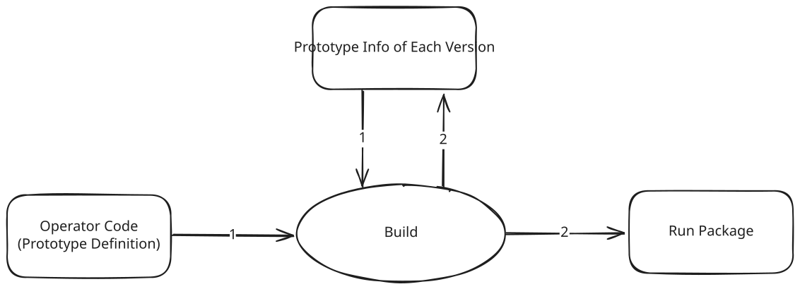

In detail, during operator engineering build process, after prototype information compilation is completed, the **ES series API generation and compilation phase** begins. This phase performs code generation (codegen) based on current version and historical prototype library according to preset rules, generating ES graph construction API that meets compatibility specifications, and compiles them into binary files.

Subsequently, the generated ES binary and corresponding header files are packaged into the run package for release. Throughout the entire build flow, ES implementation code only serves as intermediate artifacts during the build process, **and will not be merged into the operator code repository**.

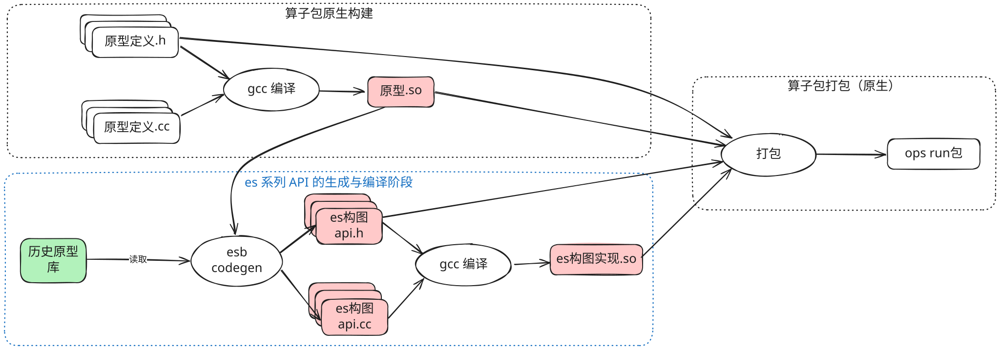

In the above figure "ES series API generation and compilation phase flow", ES codegen reads the "historical prototype library". Specifically: it generates ES API that meets compatibility requirements based on historical prototype information.

The so-called "historical prototype library", compared to prototype definition, has the following significant differences:

- **Definition approach is different**:

  Prototype definition performs registration through `REG_OP` macro in `C++` code, requires compilation before use; while historical prototype information uses structured text format description, can be parsed directly without compilation, suitable for quick reading and processing in the build flow.

- **Data Content is different**
  The "historical prototype library" is organized by commercial release versions, recording complete prototype definition for each historical commercial release version, used to support multi-version comparison and compatibility judgment.

  According to compatibility specifications, interfaces in commercial release versions (including graph construction interfaces) need to be **backward compatible for one year and forward compatible for one year** after release. For example, a version released on June 30, 2025 should be backward compatible to versions before March 30, 2024, and forward compatible to versions after September 30, 2026. Given that compatibility cycles may change due to specification adjustments, the historical prototype library needs to **completely preserve all historical version API definitions** to flexibly adapt to future compatibility strategy evolution.

### Module Division

The build flow adds four new modules:

- **ES generator** (belongs to `GE`): corresponds to the `ES codegen` phase described earlier, combines current version prototype information to generate ES graph construction API that meets compatibility requirements.
- **Historical Prototype Library** (belongs to `opp`): used to define and maintain prototype library protocol, stores all historical prototype information, provides foundation support for multi-version compatibility processing.
- **generated Eager Style Op API** (belongs to `opp`): this module is the graph construction API generation result, dynamically generated during the build flow, and released with the run package. Since it does not participate in source maintenance, it is shown with dashed lines in the figure.
- **Eager Style Graph Builder** (belongs to `GE`): this module is the foundation of `generated Eager Style Op API`, works with the latter to provide complete ES graph construction capability.

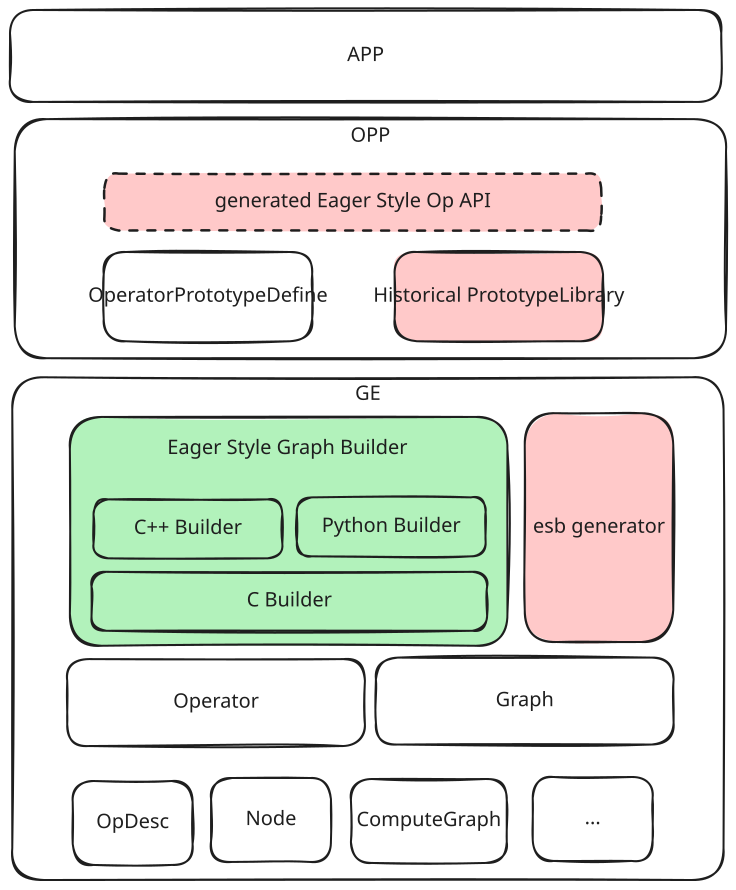

From development perspective, `ES generator` and `Eager Style Graph Builder` can be directly included in `GE` repository maintenance

### Module Deployment

The following figure describes the ownership relationship of modules mentioned earlier in the run package, as well as new content (deliverables) in the run package

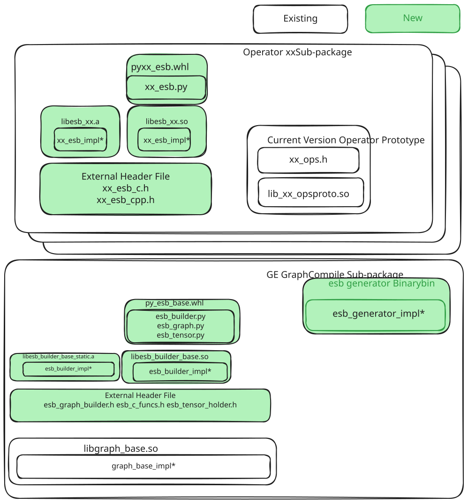

#### Python Encapsulation Specific Implementation

We use ctypes (built-in library, no additional dependencies introduced) to perform API encapsulation based on `C` code so; and as shown in the figure above, we need to encapsulate both esb generated artifacts and esb base C code, integrating them into opp package and compile package respectively.
Taking the following prototype Gen C function signature as example:

```c
#ifdef
__cplusplus
extern "C" {
#endif
  EsCTensorHolder *Esphony_1i1o(EsCTensorHolder *x, int64_t index);
#ifdef
__cplusplus
}
#endif
```

We can implement corresponding Python API functionality through the following Python encapsulation layer:

```python
import ctypes
import os
try:
    from pyge.es_graph_builder import GraphBuilder, TensorHolder
    from pyge.library.pyes_graph_builder_wrapper import (
        esb_lib,
        get_generated_lib
    )
except ImportError as e:
    pytest.skip(f"Cannot import pyge module: {e}", allow_module_level=True)

# Define function prototype
esb_generated_lib = get_generated_lib()
esb_generated_lib.Esphony_1i1o.argtypes = [ctypes.c_void_p, ctypes.c_int64]
esb_generated_lib.Esphony_1i1o.restype = ctypes.c_void_p

# Create Python wrapper function
def phony_1i1o(x: TensorHolder, index: int) -> TensorHolder:
    """
    Call Esphony_1i1o function Python wrapper
    Parameters:
        x: TensorHolder object
        index: int64 type index value
    Returns:
        Return new TensorHolder object
    """
    # Get underlying C object pointer
    x_ptr = x.handle

    # Call C function and create new Python wrapper object
    return TensorHolder(esb_lib.Esphony_1i1o(x_ptr, ctypes.c_int64(index)))
```

### ES Python Graph Construction Additional Processing

From actual business flow perspective, after `APP` calls `libesb` to complete graph construction, the graph needs to be applied, that is, graph compilation and execution are completed through `GE` interface. Currently, `GE` only provides `C++` API, therefore:

- **Using C++ APP**: can directly perform graph construction, compilation and execution
- **Using Python APP**: although graph construction can be completed, it cannot hold graph construction result, and lacks subsequent compilation and execution capability

To support Python API complete functionality, Python encapsulation needs to be added in the following modules:

- **GE**: as general graph structure carrier module, needs to encapsulate basic structures such as `Graph` into Python-usable objects, and package them into `GE graph compilation sub-package`
- **GE**: needs to encapsulate existing `Session` class into Python class, expose compilation and execution capability, and package them into `GE graph compilation sub-package`

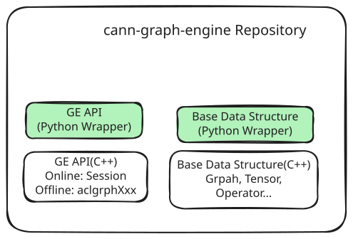

### Whether to Achieve Complete Fool-proofing

Complete fool-proofing mentioned earlier is a design principle of torchair. If ES follows this principle, it means all operations must be completed within ES API, and no interfaces for secondary graph modification based on objects are exposed externally; for ES, there are the following issues:

1. ES API is generated faithfully from IR definition, and needs to support multiple scenarios, such as user-defined pass, internal graph dump code complete expression. This means ES faces more complex scenarios than torchair. This leads to private attributes, control edges and other information not reflected in IR needing to be expressed through ES graph construction. If following torchair's principle, many parameters that are rarely used would be uniformly added to each API, reducing readability while breaking the principle that ES API is faithful to IR definition.

2. Not exposing any interfaces for secondary graph modification based on objects means for ES, not exposing GetProducer to get GNode object interfaces. The impact is as follows:

   - In actual scenarios, GetProducer is hard to eliminate, because when ES API implementation constructs node-edge relationships, given our ES principle of reusing existing data structures, it needs to reuse interfaces for establishing edges on GNode, requiring Graph::AddEdge(tensorholder0->GetProducer(), tensorholder1->GetProducer()). If removed, ES would need specialized edge-establishing basic interfaces, breaking the reuse principle.

   - GetProducer also provides obvious benefits, allowing ES to build bridges with existing GE data structures, meaning ES capability is more powerful with more possibilities.

3. Given the ES multi-language (C, C++, Python) capability consistency principle mentioned earlier, adding parameters to ES API would reduce ES C graph construction usability, because C language doesn't support default parameters, and this would require users to be aware of all parameters.

Given the above, our ES principle is that API internally only completes IR-related graph construction settings, setting private attributes and control edges and other IR-unrelated behaviors are completed through separate API, achieving partial fool-proofing while maintaining high graph construction usability.

### Private Attributes

Currently for setting private attributes on graph objects, node objects, and node output objects, overall the following approaches can be chosen:

1. Set through existing base class attribute setting interfaces (C doesn't support, because GNode doesn't have corresponding C struct)

  ```c++
  EsGraphBuilder builder("test_graph");
  auto t = graph_builder->CreateScalar(int64_t(321));
  // ... other graph construction code
  std::unique_ptr<ge::Graph> graph = builder.Build();
  graph->SetAttr(attr_name, attr_value); // relies on existing ge::Graph class attribute setting capability, and AttrValue generic object supporting any basic type attributes

  auto node_ptr = t.GetProducer();
  node_ptr->SetAttr(attr_name, attr_value); // relies on existing ge::GNode class attribute setting capability, and AttrValue generic object supporting any basic type attributes
  node_ptr->SetOutputAttr(attr_name, attr_value); // relies on existing ge::GNode class attribute setting capability, and AttrValue generic object supporting any basic type attributes

  ```

  ```python
  # Encapsulate GNode and Graph python classes, provide methods for setting

  ```

2. Set through EsGraphBuilder and EsTensorHolder encapsulated interfaces

  ```c++
  class EsGraphBuilder {
   Status SetAttr(const char *attr_name, int64_t value);
   Status SetAttr(const char *attr_name, const char *value);
   Status SetAttr(const char *attr_name, bool value);
  }
  class EsTensorHolder {
    Status SetAttr(const char *attr_name, int64_t value);
    Status SetAttr(const char *attr_name, const char *value);
    Status SetAttr(const char *attr_name, bool value);
    Status SetAttrForNode(const char *attr_name, int64_t value);
   Status SetAttrForNode(const char *attr_name, const char *value);
   Status SetAttrForNode(const char *attr_name, bool value);
  }

  ```

  ```c
  uint32_t EsSetInt64AttrForGraph(EsCGraphBuilder *graph, const char *attr_name, int64_t value);
  uint32_t EsSetStringAttrForGraph(EsCGraphBuilder *graph, const char *attr_name, const char *value);
  uint32_t EsSetBoolAttrForGraph(EsCGraphBuilder *graph, const char *attr_name, bool value);

  uint32_t EsSetInt64AttrForTensor(EsCTensorHolder *tensor, const char *attr_name, int64_t value);
  uint32_t EsSetStringAttrForTensor(EsCTensorHolder *tensor, const char *attr_name, const char *value);
  uint32_t EsSetBoolAttrForTensor(EsCTensorHolder *tensor, const char *attr_name, bool value);

  uint32_t EsSetInt64AttrForNode(EsCTensorHolder *tensor, const char *attr_name, int64_t value);
  uint32_t EsSetStringAttrForNode(EsCTensorHolder *tensor, const char *attr_name, const char *value);
  uint32_t EsSetBoolAttrForNode(EsCTensorHolder *tensor, const char *attr_name, bool value);
  ```

  ```python
  # Encapsulate EsTensorHolder and EsGraphBuilder python classes, provide methods for setting

  ```

3. Context manager approach for setting (currently only Python supports, and only supports setting attributes on nodes)

  ```python
  @contextlib.contextmanager
  def attr_scope(attr_maps):
     # Get current attributes and merge new attributes
      current_attrs = getattr(local_variable, "custom_node_attrs", {})
      new_attrs = {**current_attrs, **attr_maps}  # merge dictionaries

      try:
         setattr(local_variable, "custom_node_attrs", new_attrs)
         yield
      finally:
         # Restore to state before entering context
          setattr(local_variable, "custom_node_attrs", current_attrs)

  # Usage side
  with attr_scope({"key": "value"}):
      # In this context, custom_node_attrs is set to {"key": "value"}
      create_nodes1_with_attrs()  # get and set on nodes1 produced here
      with attr_scope({"key1": "value1"}):
          # In this context, custom_node_attrs is set to {"key": "value", "key1": "value1"}
         create_nodes2_with_attrs()  # get and set on nodes2 produced here
      # After exit, custom_node_attrs automatically restores to {"key": "value"}
  # After exit, custom_node_attrs automatically restores to empty dictionary
  ```

4. API adds parameters to pass optional private attributes (only node level attribute setting as follows)

  ```C
  extern "C" {
  EsCTensorHolder* EsRelu(EsCTensorHolder* x, const char* types, const char* name, ...) {
  // Omit node construction code
   va_list args;
   for (int i = 0; types[i] != '\0'; i++) {
      switch (types[i]) {
       case 'i': // integer
       printf("%d ", va_arg(args, int));
       y->GetProducer()->SetAttr(name[i], va_arg(args, int)); // internally calls GNode capability
       break;
       case 's': // string
       printf("%s ", va_arg(args, char*));
       y->GetProducer()->SetAttr(name[i], va_arg(args, char*));
       break;
       // other types
      }
    }
  }
  }
  ```

  ```C++
  namespace ge {
  namespace es {
  EsTensorHolder Relu(EsCTensorHolder &x, std::map<std::AscendString, ge::AttrValue> custom_attrs = {
  }) {
  // Omit node construction code
   for (const auto& pair : custom_attrs) {
   y->GetProducer()->SetAttr(pair.first, pair.second); // internally calls GNode capability
   }
  }
  }
  }
  ```

  ```python
  # es_relu.py
  def Relu(x: TensorHolder, custom_attrs: Optional[Dict[str, Any]] = None) -> TensorHolder:
     # Build type string and value list
      types_str = ""
      values = []
      names_str = ""

     for key, value in custom_attrs.items():
         if isinstance(value, int):
             types_str += 'i'
              values.append(value)
          elif isinstance(value, str):
             types_str += 's'
              values.append(value.encode('utf-8'))
          # Add other type handling...
          names_str += key + '\0'

      # Call C function
     result_ptr = _lib.EsRelu(
         x._as_parameter_,
         types_str.encode('utf-8'),
         names_str.encode('utf-8'),
         *values  # expand value list
      )
  ```

Compare the above graph construction approaches from the following dimensions:

| | Set through existing base class attribute setting interfaces | Set through EsGraphBuilder and EsTensorHolder encapsulated interfaces | Context manager approach | API adds parameters to pass optional private attributes |
| ----- | ------------------------- | ---------------------------------------- | ---------------------------------- | ---------------------------- |
| Usability | 3 stars (after calling graph construction API, post-process based on returned objects) | 3 stars (after calling graph construction API, post-process based on returned objects) | 3.5 stars (batch processing and nested scenarios have significant advantages); but C++ graph construction writing is cumbersome | 2.5 stars (parameters construction is cumbersome) |
| Fool-proofing | 3 stars (provides GNode retrieval method, user can modify freely) | 3.5 stars (has post-processing, but post-processing uses fixed API provided by ES, controllable) | 4 stars (API internally gets context information to handle attribute setting, no post-processing) | 4 stars (API internally gets context information to handle attribute setting, no post-processing) |
| Functional Completeness | 3 stars (C doesn't support) | 5 stars | 3 stars (C support is difficult) | 5 stars |

Our strategy is to make a capability union:

1. Provide capability to get GNode and Graph, allowing ES graph construction to switch to setting through existing base class attribute setting interfaces
2. Set through EsGraphBuilder and EsTensorHolder encapsulated interfaces, making it easier for C graph construction users or those unfamiliar with the base classes to use
3. Python language combines its own language characteristics to provide higher-level syntax sugar encapsulation, that is, context manager approach for better setting

### Lifecycle Management in `EsCGraphBuilder`

`Node` created internally by operator, dynamic output returned by operator interfaces, and `Tensor` attributes and subgraphs passed by user through input parameters are uniformly managed within `EsCGraphBuilder` through `std::list<std::unique_ptr<ResourceHolder>> resource_holder_` structure, specific structure is as follows:

```c++
  /**
   * Resource management struct
   * resource_ptr_ resource pointer
   * deleter_ destructor
   */
  struct ResourceHolder{
    void *resource_ptr_;
    std::function<void(void*)> deleter_;
    ResourceHolder(void *resource_ptr, std::function<void(void*)> deleter) :
    resource_ptr_(resource_ptr), deleter_(std::move(deleter)) {}
    ~ResourceHolder() {
      if (resource_ptr_ != nullptr) {
        deleter_(resource_ptr_);
      }
    }
  };
  std::list<std::unique_ptr<ResourceHolder>> resource_holder_;
```

Currently, the following depend on this structure for management:

- User passes `Tensor` attributes through interfaces

- Interfaces return `EsCTensorHolder`

- Interfaces dynamic output return values

- User passes subgraphs through interfaces

Related instance lifecycle will be transferred to `EsCGraphBuilder`, and released along with `EsCGraphBuilder` destruction.

### Control Subgraph Related Design Description

#### Control Subgraph Depends on `MetaDef` New Interfaces

To adapt ES graph construction subgraph building and edge connection logic, new interfaces are added in `graph.h` and `gnode.h`:

`graph.h`

```c++
  /**
   * @brief Find the GNode with the target node_name in the graph
   * @param node_name GNode name
   * @return GNodePtr GNode pointer in the graph, return nullptr if failed
   */
  GNodePtr FindNodeByName(const AscendString &node_name) const;

  /**
   * @brief Get the parent graph of current sub graph
   * @return ConstGraphPtr The parent graph shared pointer of current graph, return nullptr if failed
   */
  ConstGraphPtr GetParentGraph() const;

  /**
   * @brief Get the parent node of current sub graph
   * @return GNodePtr The parent node shared pointer of current graph, return nullptr if failed
   */
  GNodePtr GetParentNode() const;
```

`gnode.h`

```c++
  /**
   * @brief Add the subgraph to the node
   * @param subgraph_ir_name IR subgraph name
   * @param subgraph the subgraph to be added
   * @return GRAPH_SUCCESS: success, others: failed
   */
  graphStatus SetSubgraph(const AscendString &subgraph_ir_name, const Graph &subgraph);

  /**
   * @brief Add subgraphs to the node
   * @param subgraph_ir_name Dynamic IR subgraphs name
   * @param subgraphs subgraphs to be added
   * @return GRAPH_SUCCESS: success, others: failed
   */
  graphStatus SetSubgraphs(const AscendString &subgraph_ir_name, const std::vector<Graph> &subgraphs);
```

### ES Partial Complex Attributes Description

Operator attributes mapping relationship has been described above, this section only describes some complex attributes

#### ListType

IR operator attribute `VT_LIST_DATA_TYPE` corresponds to operator type `ListType`, depends on IR type `ge::DataType`. When user can perceive this attribute, it is handled in the same way as other list types such as `VT_LIST_INT` that have been adapted. For C type interface, conversion to `C_DataType` is needed.

After code generation, user can refer to `VT_LIST_INT` type when using it.

##### Example

Suppose operator `Foo`, contains one input `x` and one `ListType` type optional attribute `a1` as follows:

```C++
REG_OP(Foo)
    .INPUT(x)
    .OUTPUT(y)
    .ATTR(a1, ListType, {});
```

Converted to `C API`:

```C
EsCTensorHolder Foo(EsCTensorHolder *x,
                    const C_DataType *a1,
                    int64_t a1_size);
```

Converted to `C++ API`:

```C++
namespace es {
EsTensorHolder Foo(const EsTensorHolder &x,
                   const std::vector<ge::DataType> &a1 = {});
}
```

#### ListListInt

For `C++` interface, directly use `vector` format parameters:

```c++
// C++ interface formal parameter
...std::vector<std::vector<int64_t>> &input_list...
```

**Because C language doesn't support `vector` and other library functions, it cannot directly use the above type parameters.**

For C language interface, there are two handling approaches:

1. In C language interface, convert `std::vector<int64_t>` to `Struct` structure (refer to `output` construction approach), then convert `VT_LIST_LIST_INT` to `list of struct`:

   ```c++
   // Generated structure code for C language interface
   typedef struct {
     int64_t* value;
     int64_t size;
   } EsListInt;
   // C language interface formal parameters
   ...EsListListInt *input_list, int64_t input_list_size...
   ```

   Then adapt corresponding logic during function declaration and internal implementation.

2. Split multi-layer `vector` type parameters into three parts: corresponding type double pointer, outer `list` size, and each inner `list` size:

   ```c++
   ...
   const int64_t **attr_name,
   int64_t outer_size,
   const int64_t *inner_size,
   ...
   ```

   Then internally generate double pointer to vector conversion and other logic.

To make interfaces clear and easy to use, while reducing parameter count, **the second approach is currently adopted**.

##### Example

Suppose operator `Foo`, contains one input `x` and one `ListListInt` type optional attribute `a1` as follows:

```C++
REG_OP(Foo)
    .INPUT(x)
    .OUTPUT(y)
    .ATTR(a1, ListListInt, {{}, {}});
```

Converted to `C API`:

```C
EsCTensorHolder Foo(EsCTensorHolder *x,
                    const int64_t **a1,
                    int64_t a1_size,
                    const int64_t *a1_inner_size);
```

Converted to `C++ API`:

```C++
namespace es {
EsTensorHolder Foo(const EsTensorHolder &x,
                    const std::vector<std::vector<int64_t>> &a1 = {{}, {}});
}
```

#### Tensor

Similar to non-`List` attributes, with the difference that after `Tensor` type attribute input is passed in, its lifecycle will be transferred to the operator's corresponding `EsCGraphBuilder` for management. User should not operate on the passed parameters after passing `Tensor` type attribute.

> [!CAUTION]
>
> For `Tensor` type attributes, currently only `Tensor()` one default value is supported.

For C++ interface users, `ge::Tensor` type attributes can be passed directly; while for C interface users, ES provides interfaces for creating anonymous pointer `EsCTensor *` as C interface form `Tensor` type attribute pointer.

`C/C++` interfaces `Tensor` type attribute lifecycle will both be transferred to `EsCGraphBuilder` for management.

> [!Note]
>
> For C++ interface passing `ge::Tensor` attributes, during internal processing they will be converted to `EsCTensor` type before being passed to C interface, user is not aware of this conversion.

##### Example

Suppose operator `Foo`, contains one input `x` and one `Tensor` type optional attribute `a1` as follows:

```C++
REG_OP(Foo)
    .INPUT(x)
    .OUTPUT(y)
    .ATTR(a1, Tensor, Tensor());
```

Converted to `C API`:

```C
EsCTensorHolder Foo(EsCTensorHolder *x,
                    EsCTensor *a1);
```

Converted to `C++ API`:

```C++
namespace es {
EsTensorHolder Foo(const EsTensorHolder &x,
                   std::unique_ptr<ge::Tensor> a1=std::make_unique<ge::Tensor>(ge::Tensor()));
}
```

#### ListString

For `String` type in `C++` interface, **because different GCC versions may have inconsistent `std::string` corresponding symbols**, `const char *` needs to be used instead of `std::string`, formal parameter is constructed as:

```c++
...std::vector<char *> input_list...
```

For C language interface, directly use

```c
...const char **input_list...
```

##### Example

Suppose operator `Foo`, contains one input `x` and one `ListString` type optional attribute `a1` as follows:

```C++
REG_OP(Foo)
    .INPUT(x)
    .OUTPUT(y)
    .ATTR(a1, ListString, {});
```

Converted to `C API`:

```C
EsCTensorHolder Foo(EsCTensorHolder *x,
                    const char **a1, // Because AscendString contains char * constructor, no need to pass each string's corresponding char * length inside ListString
                    const int64_t a1_size);
```

Converted to `C++ API`:

```C++
namespace es {
EsTensorHolder Foo(const EsTensorHolder &x,
                   const std::vector<const char *> &a1 = {});
}
```

## Appendix

### V1 Control Operators Do Not Generate ES API

Current ES graph construction logic does not include V1 control operators:

| V1 Control Operators |
| ------------- |
| Switch |
| StreamSwitch |
| Merge |
| StreamMerge |
| Enter |
| Exit |
| LoopCond |
| NextIteration |

### `Variable` Operator Does Not Generate Operator Because `C/C++` Interfaces Already Provided

| Existing C/C++ Interfaces Operators |
|--------------|
| Variable     |

### Solution Discussion: Maintain Compatibility Through Multi-version Function Names (such as `FooV2`)

When operator prototype undergoes compatibility extension (such as adding optional input or attribute), because `C` language doesn't support function overload or default parameters, it cannot express interface changes under the same function signature. At this point, a common but problematic approach is to distinguish API versions through function name with version suffix (such as `esFooV2`), to avoid signature incompatibility issues. For example:

```
cCopyEdit// v1 version API
Tensor *esFoo(const Tensor *x);

// v2 version adds optional input xo
Tensor *esFooV2(const Tensor *x, const Tensor *xo);
```

Although this solution retains old interfaces on the surface, it has obvious defects in actual engineering:

**1. Semantic Confusion, Naming Not Intuitive**

`esFooV2` is easily misunderstood as a new operator, rather than an extended version of `Foo`. This naming approach is difficult to accurately convey "same operation evolution version", not conducive to user forming unified API cognition.

**2. Multi-language Style Fragmentation**

`C++` and `Python` support default parameters and function overload, can naturally express interface evolution, no need to distinguish multiple function names. If only `C` layer introduces version suffix, it will break multi-language interface style consistency, affecting user experience.

**3. Cannot Forward Compatible, Linking Fragile**

Even when only using `esFooV2` compatible parameters (such as not passing `xo`), as long as function signature changes, in old version runtime environment it may still fail linking due to missing symbols. This solution only satisfies backward compatibility, cannot guarantee forward compatibility.

**4. Interface Bloat, High Maintenance Cost**

Each interface evolution requires adding a new set of function names, bringing extra documentation, testing, encapsulation and toolchain burden. In the long run, it easily leads to namespace bloat and increased maintenance difficulty.

------

Based on `C` language's natural limitations in expression capability, graph construction interfaces are difficult to simultaneously achieve perfect forward and backward compatibility. `C` interface exists on one hand for capability completeness, on the other hand to provide choices for users who are accustomed to or have actual needs. In actual use, we recommend users prioritize using `C++` or `Python` graph construction interfaces, which can more elegantly support interface evolution and version compatibility.

### About Floating Type Optional Attributes Judgment

Because floating numbers cannot be precisely expressed in computers, `es` may encounter precision error issues when judging **whether optional floating attributes are explicitly configured**: user passed value and `IR` defined default value are semantically equal, but have extremely small differences in numerical representation, causing misjudgment as "configured".

To solve this problem, two strategies exist:

1. **Tolerance Judgment (Recommended Approach)**
   Use absolute error tolerance for comparison: if the difference between passed value and default value is within specified tolerance range (such as `1e-5`), they are considered equal. This solution is a general strategy in floating comparison, easy to implement, user experience friendly.
2. **String Comparison (Theoretical Approach)**
   In graph construction API, require user to pass floating values in string form, and save default value string representation in `IR`. Perform exact matching through string to judge whether "configured".

Although approach 2 is more rigorous, it significantly reduces API intuitiveness - floating attributes need to be passed in string form, which doesn't match type semantics. In comparison, approach 1 has extremely low misjudgment probability in most actual scenarios, and even if misjudged, since it is within tolerance range, it should not have substantial impact on operator behavior. Therefore, `es` currently adopts approach 1.

### Subgraph Internal and External Index Mapping Relationship Expression

Operators carrying subgraphs, after operator instantiation, mark information on `Data` and `NetOutput` inside subgraph to map to operator inputs and outputs; specifically:

1. `Data` node's `index` specified at creation indicates which input of the operator it corresponds to; actual meaning is the Nth `Data` node inside subgraph corresponds to the Nth input data of the operator;
   `Data` node count represents subgraph input count, subgraph input count should be less than or equal to operator actual input count
2. `NetOutput` input order indicates corresponding operator output, actual meaning is the Nth output of operator corresponds to the Nth input data of `NetOutput` inside subgraph; when subgraph forms graph, it ensures only one `NetOutput`
   node inside subgraph, its input count represents subgraph output count. Runtime may use subgraph as operator execution logic expression carrier, its output count should remain consistent with operator output count

### generate_es_package.cmake Dependency Description

`generate_es_package.cmake` adopts **single-file mode**, merging all generated ES API code into one source file for unified compilation.

#### Design Philosophy

Single-file mode core idea is:

- Merge generated multiple operator code files into one `all_in_one.cpp`
- Complete in one go during build phase: clean directory -> generate code -> write file -> compile
- Avoid multi-file management, avoid subprocess calls, avoid race conditions, and can effectively reduce generated library file size

#### Build Phase Flow

```
Build Phase (make)
    │
    ├─> 1. Clean output directory
    │
    ├─> 2. Execute gen_esb to generate code
    │       └─> Dependency: opgraph_xxx (prototype library)
    │
    ├─> 3. Write all generated content to all_in_one.cpp
    │
    └─> 4. Compile all_in_one.cpp → libes_xxx.so
```

#### Architecture Diagram

```
User Application (my_app)
    │
    └─> target_link_libraries(PRIVATE es_math)  # user call
            │
            ▼
    ┌──────────────────────────────────────┐
    │  es_math (INTERFACE library)         │  ← External interfaces
    │  - target_link_libraries INTERFACE  │
    │  - Pass header paths, linking libraries │
    └──────────────────────────────────────┘
            │
            └─> add_dependencies(build_es_math)
                     │
                     ▼
            ┌──────────────────────────────────────┐
            │  build_es_math (custom_target)       │  ← Build target
            │  - Depends on: install_es_math       │
            │  - Triggers complete build flow      │
            └──────────────────────────────────────┘
                     │
                     ▼
            ┌──────────────────────────────────────┐
            │  install_es_math (custom_target)     │  ← Install target
            │  - Depends on: es_math_so            │
            │  - Depends on: generate_es_math_whl  │
            │  - Copies headers, .so, .whl to output directory│
            └──────────────────────────────────────┘
                     │
                     ├──────────────────────────────┐
                     │                              │
                     ▼                              ▼
    ┌──────────────────────────────┐    ┌──────────────────────────────────────┐
    │  es_math_so (SHARED library) │    │  generate_es_math_whl (custom_target)│
    │  - Source file: all_in_one.cpp│    │  - Depends on: generate_es_math_code │
    │  - Depends on: generate_es_math_code│  │  - Builds Python wheel package       │
    │  - Output: libes_math.so     │    │  - Output: es_math-1.0.0-py3-none-any.whl│
    └──────────────────────────────┘    └──────────────────────────────────────┘
                     │
                     ▼
    ┌──────────────────────────────────────┐
    │  generate_es_math_code (custom_target) │  ← Code Generation
    │  - ALL target (always build)          │
    │  - Depends on: generated_code.flag    │
    │  - Trigger: build phase               │
    │  - Flow:                              │
    │    1. Clean output directory          │
    │    2. Call gen_esb to generate each operator .cpp│
    │    3. Run generate_wrapper.cmake      │
    │    4. Generate all_in_one.cpp         │
    └──────────────────────────────────────┘
                     │
                     ▼
    ┌──────────────────────────────────────┐
    │  generated_code.flag (file)          │  ← Generation Mark
    │  - Generated by add_custom_command   │
    │  - Depends on: opgraph_math (prototype library)│
    │  - Depends on: gen_esb (code generation tool)│
    └──────────────────────────────────────┘
```

#### Comparison with Multi-file Mode

| Feature | Multi-file Mode | Single-file Mode |
| --------- | ----------------- | ------------------ |
| Source file count | Multiple .cpp files | Single all_in_one.cpp |
| Code management | placeholder + file replacement | Direct generation |
| Build process | Two-stage (first placeholder + reconfigure) | Single-stage |
| Subprocess calls | Required | Not required |
