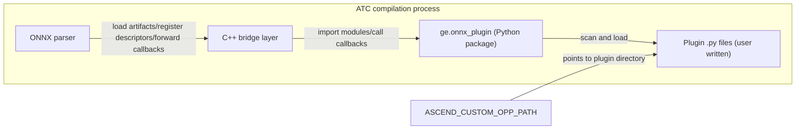

# ONNX Plugin Python-ization Design Document

## 1. Overview

ONNX plugin Python-ization is an ONNX custom operator parsing plugin extension capability provided by the `ge` Python package: a plugin is a Python file that declares the mapping from an ONNX source operator to a GE target operator and completes parsing through callbacks. Plugins are loaded and executed during the parsing stage of ATC ONNX model compilation, without changing the way ATC is used.

The GE ONNX parser reads the protobuf content of the model file directly to complete graph parsing. Custom operators in the model (defined by the exporter, not built in GE) cannot be integrated by default; previously, parsing code had to be developed as a C++ plugin (corresponding to the C++ `ParseParamsFn`, `ParseParamsByOperatorFn`, and `ParseOpToGraphFn` registration methods, see the [ONNX graph integration](../../../user_guides/custom_op/custom_op_v2/custom_op_development_guide.md#64-onnx-graph-entry) chapter of the custom operator development guide). With Python-ization, integrating a custom operator only requires one `.py` file, and the plugin callbacks do two kinds of work:

1. **Parameter parsing**: transcribe attributes on the ONNX node to the GE operator, using the `parse_node` or `parse_operator` callback;
2. **Operator decomposition**: when GE has no existing operator, replace the original node with a subgraph built from existing operators, using the `decompose` callback, without writing device kernels.

This feature, together with [GE Pass Python-ization](ge_python_pass_design.md) and [custom operator Python-ization](ge_python_custom_op_design.md), constitutes the three plugin extension types of the `ge` Python package; loading and discovery share the same mechanism (the `ASCEND_CUSTOM_OPP_PATH` environment variable), see [GE-PY Python Module Class Relationship Document](ge_python.md). The C++ ONNX plugin mechanism remains available; one origin type (see Section 6.2) can be provided by only one plugin. This feature is supported on all chips.

## 2. Version Constraints

| Dependency | Version | Description |
| ---- | ---- | ---- |
| Python | 3.12 | Temporary requirement: the Python version used when compiling the run package must be consistent with the Python version used to execute the plugin (that is, the interpreter used by the ATC compilation process) |
| onnx | 1.21.0 | Consistent with the tested scope of the [sample](../../../../../examples/onnx_plugin/README_en.md); the onnx package is used only in the PyTorch ONNX export flow (`torch.onnx.export`); the GE parser does not depend on this package |

The Python version constraint comes from the bridge artifact matching mechanism: the manifest (`manifest.json`) of the bridge library and native module in the run package records the `python_tag` (such as `cp312`), platform, and bridge ABI version; at runtime, the version is read from the Python symbols loaded in the current process and the `python_tag` is computed, and only artifacts matching the current interpreter tag are loaded. When no matching artifact is found, compilation fails with `No compatible ONNX Python plugin bridge artifact found for runtime ...`. The implementation is in `base/common/python_runtime/python_artifact_utils.h` and `parser/parser/onnx/python_onnx_plugin_bridge/onnx_plugin_bridge_loader.cc`.

Therefore, when the run package is compiled with Python 3.12, the ATC compilation must also be executed with Python 3.12. Do not mix different Python versions before the constraint is lifted.

## 3. Overall Architecture

### 3.1 Components

| Component | Code Location | Responsibility |
| ---- | -------- | ---- |
| Python public package `ge.onnx_plugin` | `api/python/ge/ge/onnx_plugin/` | Descriptor definition and validation, process-level registry, plugin scanning and loading, callback dispatch, `OnnxNode` binding |
| C++ bridge layer | `parser/parser/onnx/python_onnx_plugin_bridge/` | Load bridge artifacts, initialize Python runtime, register Python-side descriptors into the parser, forward callbacks |
| ONNX parser | `parser/parser/onnx/onnx_parser.cc` | Match registered plugins by origin type node by node during parsing and trigger callbacks |



### 3.2 Compile-time Runtime Flow

1. The user sets `ASCEND_CUSTOM_OPP_PATH` to the plugin directory and executes ATC to compile the ONNX model;
2. ONNX parser initialization: when the environment variable is not empty, the bridge library `libge_python_onnx_plugin_bridge.so` is matched by runtime key (`python_tag` + platform + bridge ABI) and loaded, and the Python runtime is prepared; when the environment variable is not set, no bridge code is loaded and the behavior is identical to not using this feature;
3. The bridge layer enters the Python interpreter, imports `ge.onnx_plugin._bridge`, and calls `load_and_get_onnx_plugin_descriptors()`: plugin files are scanned and imported one by one, and the `onnx_plugin()` calls in the plugin code write descriptors into the Python process-level registry;
4. The descriptor list is passed back to the C++ side, and each origin type generates one `domi::OpRegistrationData` registration (`FrameworkType` is ONNX, `OriginOpType` is `domain::opset::source`), hooked to the parameter parsing or decomposition entry according to callback types;
5. When parsing each ONNX node, a non-built-in operator constructs the origin type as `<domain>::<opset>::<op_type>` to look up registrations; on a hit, the corresponding Python callback is invoked through the bridge layer;
6. When a plugin callback raises a Python exception or a plugin file fails to load, compilation fails and exits; the default error (`E19999`) contains the Python-side error information (exception type, error statement, plugin file and line number).

## 4. Directory Structure

```text
api/python/ge/ge/onnx_plugin/        // Python public package
├── __init__.py                      // External entry: exports OnnxNode, OnnxPlugin, onnx_plugin
├── plugin.py                        // onnx_plugin() factory, OnnxPlugin descriptor, callback binding and validation
├── registry.py                      // Descriptor registry (thread safe), indexed by descriptor_key and origin type
├── bootstrap.py                     // Plugin scanning and loading entry (reads ASCEND_CUSTOM_OPP_PATH)
├── _bridge.py                       // C++ bridge call entry: load plugins, dispatch the three callbacks
├── _native.py                       // Loads the native module, provides OnnxNode
└── native_bindings/                 // pybind11 bindings of OnnxNode (read-only view over NodeProto)

parser/parser/onnx/python_onnx_plugin_bridge/    // C++ bridge layer
├── onnx_plugin_bridge_c_api.h       // Bridge C API: ABI version, registrar, callback table definitions
├── onnx_plugin_bridge.cc            // Bridge implementation: initialization, descriptor registration, callback forwarding
├── onnx_plugin_bridge_loader.cc     // Artifact loading: match by runtime key and dlopen the bridge library
└── onnx_plugin_bridge_registrar.cc  // Register descriptors into the ONNX parser operator registry
```

The bridge library and native module are produced at build time and organized under `python_tag-platform` directories in the run package at `ge/onnx_plugin/python_onnx_plugin_artifacts/`; they do not exist in the source tree.

## 5. Interface Description

For the complete interface description, see the onnx_plugin API reference (`docs/zh/api/graph_engine_api/python/ge/onnx_plugin/onnx_plugin.md`); this section only lists design-level key points.

### 5.1 onnx_plugin() Descriptor Factory

```python
onnx_plugin(*, source: str, domain: str, opsets: Collection[int], target: str) -> OnnxPlugin
```

| Parameter | Meaning |
| ---- | ---- |
| `source` | ONNX source operator type, such as `MyElu`. Non-empty string, must not contain `:` (the colon is the origin type field separator; its presence makes the origin type impossible to split back into `<domain>::<opset>::<source>`) |
| `domain` | The domain explicitly declared by the plugin author at registration, non-empty string, must not contain `:` (same reason as above). Different in meaning from the node domain field in the model file, see Section 6.3 |
| `opsets` | Collection of supported ONNX opset versions, elements are positive integers, deduplicated and sorted at registration |
| `target` | GE target operator type; the corresponding operator prototype must be installed and registered |

Parameter validation is executed immediately at call time: invalid types raise `TypeError`, invalid values (such as empty collections or non-positive integers) raise `ValueError`. `source`, `domain`, and `opsets` expand into a set of origin types (`domain::opset::source`, such as `example.domain::1::MyElu`).

### 5.2 Callback Binding Methods

The `OnnxPlugin` descriptor provides three binding methods (usable directly as decorators). One descriptor can bind multiple callbacks (such as parameter parsing combined with decomposition); binding the same callback repeatedly raises `ValueError`:

| Method | Callback Signature | Return Value Convention | Purpose |
| ---- | -------- | ---------- | ---- |
| `parse_node` | `(node: OnnxNode, target) -> None` | Must return `None` | Read ONNX node attributes by name and write them to the target operator; preferred |
| `parse_operator` | `(source, target) -> None` | Must return `None` | Parse attributes based on Operator; the only choice when a node carries composite attributes such as tensors or subgraphs |
| `decompose` | `(source) -> Graph` | Must return a `ge.graph.Graph` object | Replace the original node with a subgraph built from existing operators; the subgraph is built with the ES graph construction API (see [ES Python API](../../../user_guides/es_graph/api/es_python.md)) |

In callbacks, `target` is a writable operator and `source` is a read-only operator; a return value that violates the convention fails compilation with `TypeError`.

### 5.3 OnnxNode Object

The `node` received by the `parse_node` callback is a native-layer read-only wrapper over the ONNX `NodeProto`; all properties are read-only:

| Property | Meaning |
| ---- | ---- |
| `name` | Node name |
| `origin_type` | The node's `op_type` (without the domain and opset prefix) |
| `inputs` / `outputs` | Tuples of the node's input and output data names |
| `attrs` | Attribute dictionary (read-only mapping), supports only `int`, `float`, `str`, and homogeneous lists |

When the node carries composite attributes such as tensors (for example the `value` of Constant) or subgraphs (for example `then_branch`/`else_branch` of If), reading `attrs` fails as a whole; such nodes must use `parse_operator` instead.

## 6. Registration and Discovery

### 6.1 Plugin Discovery and Loading

- The discovery entry is the `ASCEND_CUSTOM_OPP_PATH` environment variable; multiple paths are joined by the path separator (colon on Linux), and each entry can be a directory or a single `.py` file;
- Directories are scanned one level: top-level `.py` files (files starting with an underscore are skipped) are imported one by one, and subdirectories containing `__init__.py` are imported as packages. Non-Python files and `.py` files in deeper levels are not loaded. When a plugin file shares a directory with its dependency libraries or data files, the dependencies are not loaded automatically and must be imported by the plugin code itself;
- Plugins are imported and executed at ATC initialization; all top-level code in the file runs. If any plugin file fails to load (syntax error, import exception, etc.), the whole compilation is interrupted; locating the specific file requires debug logs;
- The same file is loaded only once in the same process (deduplicated by file path).

### 6.2 Registration Rules and Conflict Handling

- The `descriptor_key` of a descriptor (composed of module name, callback name, callback kind, and source/domain/opsets) and every origin type must be unique; duplicate registration raises `ValueError`;
- Handling of origin type conflicts: conflicts among multiple Python plugins fail parser initialization; conflicts between a Python plugin and a C++ plugin keep the C++ plugin and reject the Python plugin;
- Therefore, under the same `source` and `domain`, the `opsets` of different plugins must not overlap — overlap produces identical origin types, rejected at the registration stage.

### 6.3 Node Matching and Callback Dispatch

The origin type used for matching is constructed by the parser from the model file: `<node domain>::<model opset_import version>::<node op_type>`. The node's `domain` field can be empty; per the ONNX standard, empty means the standard domain `ai.onnx`. The domain and opset here come from the model file, while the `domain` registered by the plugin is a mapping key explicitly declared by the author; the two match only when their values are identical.

When reading `opset_import`, the parser normalizes the empty domain to `ai.onnx`. If one normalized domain is declared with multiple different versions (the typical case: the export side configures `ai.onnx` in `custom_opsets` with a version different from `opset_version`), the parser prints a WARNING naming the conflicting versions and the effective one; the matching behavior is unchanged (the later declaration wins).

When an origin type misses all registrations, the parser appends an E19999 diagnosis besides the original errors (E13010 in the pre-check stage and E16002 in the parsing stage): if the domain has a version conflict, the diagnosis references the conflict and probes registrations under the other declared versions — for example, if the model resolves to `ai.onnx::2::Relu` while `ai.onnx::13::Relu` is registered under another declared version, the diagnosis points to the export-side version override; without a conflict, a generic hint is given (check that the plugin's declared domain/opsets cover the origin and that the plugin file is discoverable via `ASCEND_CUSTOM_OPP_PATH`). The diagnosis only adds information and never changes parsing behavior.

After a node hits a registration, the dispatch rules are:

- `parse_node` and `parse_operator` belong to the same parameter parsing stage; bind only one of them. When both are bound to the same descriptor, the parser calls only the callback bound by `parse_operator`, and the callback bound by `parse_node` is ignored without an error;
- When only `decompose` is bound, the framework automatically adds a default parameter parsing (only marking the original type on the operator, without attribute transcription), and the original node's inputs and outputs are passed to the decomposed subgraph;
- When the target operator's input and output counts are fixed, no port registration is needed; otherwise ports must be registered one by one inside the callback (`register_input`, `register_optional_input`, etc.), and the registration order must match the ONNX operator's input order; see Section 4.1 of the sample README.

## 7. Usage Example

For the complete runnable sample (including a `parse_node` + `decompose` plugin, a `parse_operator` plugin, and a one-click script), see the [ONNX Python plugin sample](../../../../../examples/onnx_plugin/README_en.md). The following is a minimal plugin example (excerpted from the sample `my_elu_plugin.py`):

```python
import json

from ge.onnx_plugin import onnx_plugin

my_elu = onnx_plugin(
    source="MyElu",          # custom operator type in the ONNX model
    domain="example.domain", # domain declared at registration
    opsets=(1,),             # supported opset versions
    target="Elu",            # existing GE target operator
)

@my_elu.parse_operator
def parse_my_elu(source, target) -> None:
    """Parse alpha from the JSON attribute string of the source operator and write it to Elu."""
    attrs = json.loads(source.get_attr("attribute"))
    alpha = 1.0
    for attr in attrs.get("attribute", []):
        if attr.get("name") == "alpha":
            alpha = float(attr.get("f", 1.0))
    target.set_attr("alpha", alpha)
```

At compilation, set the plugin file directory to `ASCEND_CUSTOM_OPP_PATH`:

```bash
export ASCEND_CUSTOM_OPP_PATH="$(pwd)/plugin:${ASCEND_CUSTOM_OPP_PATH:-}"
atc --model=model.onnx --framework=5 --output=output/model --soc_version=<soc_version>
```
