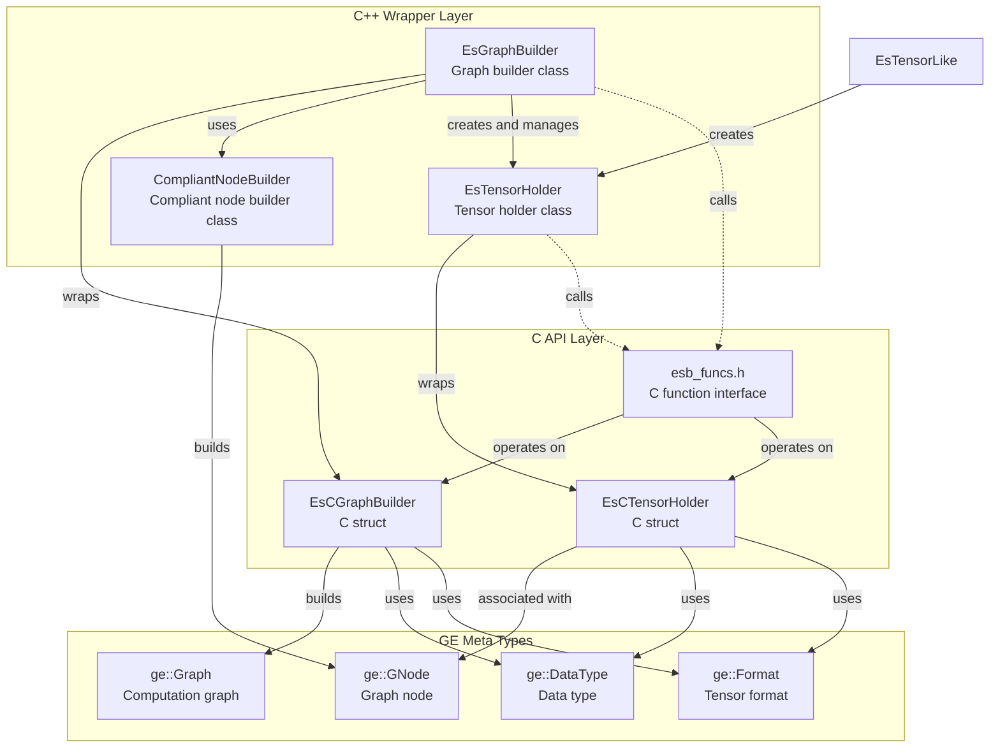

# Eager Style Graph Builder Class Relationship Documentation

## Overview
Eager Style Graph Builder is a functional interface module in GraphEngine for building computation graphs, providing convenient graph construction capabilities. The external header files for this module are located in the `inc/external/ge/eager_style_graph_builder/` directory.

## Directory Structure

```
inc/external/ge/eager_style_graph_builder/
├── c/
│   └── esb_funcs.h          # C language interface function declarations
└── cpp/
    ├── compliant_node_builder.h    # Compliant node builder class definition
    ├── es_graph_builder.h          # Graph builder class definition
    ├── es_tensor_holder.h          # Tensor holder class definition
    ├── es_tensor_like.h            # Tensor-like type definition
    ├── es_c_graph_builder.h        # C-style graph builder class definition
    └── es_c_tensor_holder.h        # C-style tensor holder class definition
```

## Core Class Relationship Diagram



## Main Class Detailed Explanation

### 1. EsGraphBuilder Class

**File location**: `cpp/es_graph_builder.h`

**Functionality**: Graph builder class for building and managing computation graphs

**Main methods**:
- `CreateInput()`  - Create a graph input node
- `CreateInputs()` - Batch create graph input nodes with default format
- `CreateTensor()` - Create a tensor with specified shape according to runtime `DataType`
- `CreateVector()` - Create a vector constant
- `CreateScalar()` - Create a scalar constant
- `CreateVariable()` - Create a variable
- `SetAttr()` - Set graph attributes
- `SetOutput()` - Set graph output
- `BuildAndReset()` - Build the computation graph

**Relationships**:
- Wraps the `EsCGraphBuilder` C struct
- Creates and manages `EsTensorHolder` objects
- Ultimately builds a `ge::Graph` object

### 2. EsTensorHolder Class

**File location**: `cpp/es_tensor_holder.h`

**Functionality**: Tensor holder class, wrapping various tensor operations

**Main methods**:
- Arithmetic operations: `operator+`, `operator-`, `operator*`, `operator/`
- Attribute setting: `SetDataType()`, `SetFormat()`, `SetShape()`
- Attribute management: `SetAttr()`, `SetAttrForNode()`
- Accessors: `GetCTensorHolder()`, `GetProducer()`

**Relationships**:

- Wraps the `EsCTensorHolder` C struct
- Associated with `ge::GNode` (through `GetProducer()`)
- Supports chained call pattern

### 3. EsTensorLike Class

**File location**: `cpp/es_tensor_like.h`

**Functionality**: Tensor-like type definition, used to convert EsTensorHolder, scalars, and vectors to EsTensorHolder objects

**Main methods**:
- `ToTensorHolder()`   - Convert to EsTensorHolder object
- `GetOwnerBuilder()`  - Get the owner builder of the corresponding Tensor

### 4. CompliantNodeBuilder Class
**File location**: `cpp/compoliant_node_builder.h`

**Functionality**: Compliant node builder class for building graph nodes that conform to IR specifications

**Main methods**:
- `OpType()` - Set operator type
- `IrDefInputsV2()` - Define ABI-safe IR input specifications
- `IrDefOutputsV2()` - Define ABI-safe IR output specifications
- `IrDefAttrsV2()` - Define ABI-safe IR attribute specifications
- `Name()` - Set node name
- `InstanceDynamicInputNum()` - Set dynamic input instance count
- `InstanceDynamicOutputNum()` - Set dynamic output instance count
- `InstanceOutputDataType()` - Set output data type
- `InstanceOutputShape()` - Set output shape
- `InstanceOutputOriginShape()` - Set output original shape
- `InstanceOutputStorageShape()` - Set output storage shape
- `InstanceOutputFormat()` - Set output format
- `InstanceOutputOriginFormat()` - Set output original format
- `InstanceOutputStorageFormat()` - Set output storage format
- `Build()` - Build and return the graph node
-
### 5. C API Functions

**File location**: `c/esb_funcs.h`

**Functionality**: Provides low-level C language interfaces

**Main function categories**:
- Graph builder management: `EsCreateGraphBuilder()`, `EsDestroyGraphBuilder()`
- Input creation: `EsCreateGraphInput()`, `EsCreateGraphInputWithDetails()`
- Constant creation: `EsCreateScalar*()`, `EsCreateVector*()`, `EsCreateConst*()`
- Attribute setting: `EsSet*AttrForGraph()`, `EsSet*AttrForTensor()`, `EsSet*AttrForNode()`
- Output setting: `EsSetGraphOutput()`
- Graph building: `EsBuildGraphAndReset()`

### Usage Examples
Refer to [sample](../../../../../examples/es)
```
