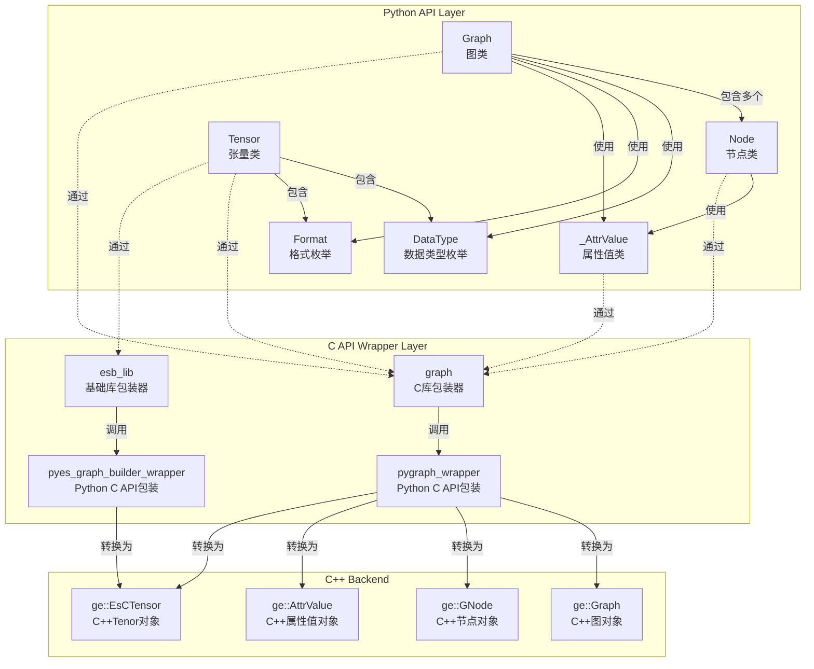
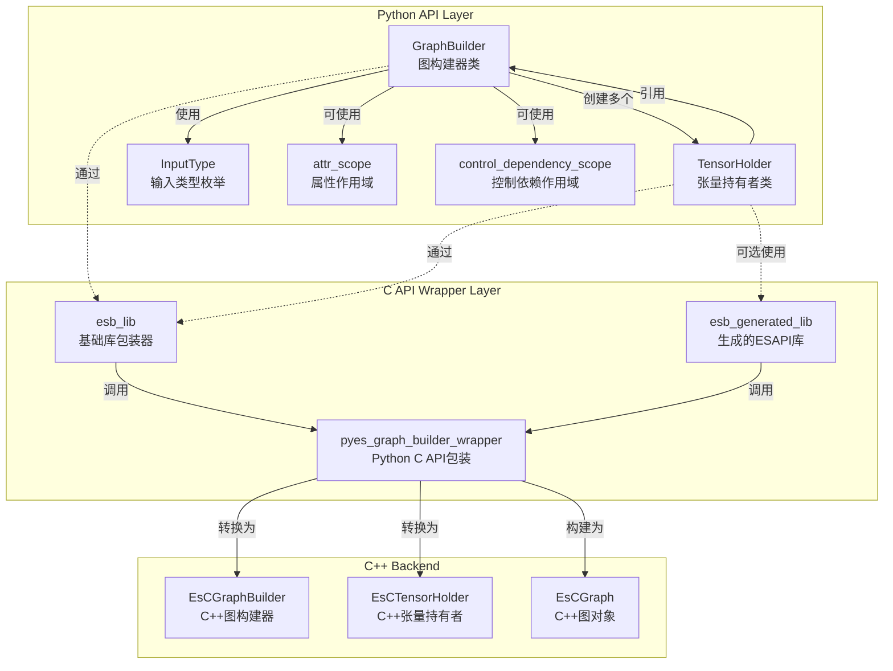

# GE-PY Python 模块类关系文档

## 概述

GE-PY 是 GraphEngine 的 Python 接口模块，提供了 Pythonic 的图相关接口。为用户提供了便捷的图构建和操作，编译执行等功能。该模块对外头文件位于 `api/python/ge/ge/` 目录下。

## 目录结构

### graph模块
```

├── __init__.py      # 模块初始化文件
├── graph.py         # Graph 类定义
├── node.py          # Node 类定义
├── types.py         # 数据类型定义
├── tensor.py        # Tensor 类定义
|── _attr.py         # 內部属性值类定义
└── _numeric.py      # 內部数值转换类定义
```
注：下划线开头的为 Python 风格下的对内模块

#### graph核心类关系图



#### 类详细说明

##### 1. Graph 类

**文件位置**: `graph.py`

**功能**: 图操作的主要接口类

**主要方法**:
- `__init__(name)` - 初始化图
- `get_all_nodes()` - 获取所有节点
- `get_direct_node()` - 获取直接连接节点
- `get_node_by_name(name)` - 根据名称获取节点
- `get_attr(key)` - 获取图属性
- `set_attr(key, value)` - 设置图属性
- `remove_node(node)` - 移除节点
- `remove_edge(src_node, src_port_index, dst_node, dst_port_index)` - 移除边
- `add_data_edge(src_node, src_port_index, dst_node, dst_port_index)` - 添加数据边
- `add_control_edge(src_node, dst_node)` - 添加控制边
- `save_to_air(file_path)` - 将图保存成AIR文件
- `load_from_air(file_path)` - 从AIR文件加载图

**属性**:
- `_handle` - 底层C图对象的句柄
- `_owns_handle` - 是否拥有句柄的所有权
- `_owner` - 句柄所有者
- `_name` - 图名称

**关系**:
- 通过 `graph_lib` 调用底层C API
- 管理多个 `Node` 对象

##### 2. Node 类

**文件位置**: `node.py`

**功能**: 图节点操作接口类

**主要方法**:
- `get_attr(key)` - 获取节点属性
- `set_attr(key, value)` - 设置节点属性
- `get_in_data_nodes_and_port_indexes(in_index)` - 获取输入节点和端口
- `get_out_data_nodes_and_port_indexes(out_index)` - 获取输出节点和端口
- `get_inputs_size()` - 获取输入数量
- `get_outputs_size()` - 获取输出数量
- `has_attr(key)` - 是否含有节点属性

**属性**：

- `_handle` - 底层C节点对象的句柄
- `_owns_handle` - 是否拥有句柄的所有权
- `name` - 节点名称（只读属性）
- `type` - 节点类型（只读属性）

**关系**:
- 通过 `graph_lib` 调用底层C API
- 与 `Graph` 对象关联

##### 3. DataType 枚举

**文件位置**: `types.py`

**功能**: 定义支持的数据类型

**关系**:
- 与 C++ 中的 `ge::DataType` 对应
- 在 `Graph` 和 `Node` 操作中使用

##### 4. Format 枚举

**文件位置**: `types.py`

**功能**: 定义张量格式

**关系**:
- 与 C++ 中的 `ge::Format` 对应
- 用于张量形状和格式描述


#### 依赖关系

- **内部依赖**:
  - Graph库
  - `ge._capi.pygraph_wrapper` - C API包装器

- **外部依赖**:
  - ctypes库

##### 5. Tensor 类

**文件位置**: `tensor.py`

**功能**: 张量数据类

**主要方法**:
- `set_format(format)` - 设置格式
- `get_format()` - 获取格式
- `set_data_type(data_type)` - 设置数据类型
- `get_data_type()` - 获取数据类型

**属性**：
- `_handle` - 底层C节点对象的句柄
- `_owns_handle` - 是否拥有句柄的所有权
- `_owner` - 句柄所有者
**关系**:
- 通过 `graph_lib` 和 `esb_lib` 调用底层C API
- 与 `Session` 对象关联

### ge_global模块
#### 目录结构
```

├── __init__.py           # 模块初始化文件
└── geapi.py              # GeApi接口文件
```
#### 类详细说明
##### 1. Geapi 类
**文件位置**: `geapi.py`

**功能**：提供 GE 初始化和析构

**主要方法**:
- `ge_initialize(config)` - GE初始化
- `ge_finalize()` - GE析构

  **关系**:
- 通过 `geapi_lib` 调用底层C API

**使用示例**:
```python
from ge.ge_global import GeApi

ge_api = GeApi()
# 调用GE初始化函数
config = {"ge.exec.deviceId":"2", "ge.graphRunMode":"0"}
ge_api.ge_initialize(config)
# 调用GE资源释放函数
ge_api.ge_finalize()
```

### Session模块

#### 目录结构
```

├── __init__.py           # 模块初始化文件
└── session.py            # session接口文件
```
#### 类详细说明
##### 1. Session 类

**文件位置**: `session.py`

**功能**: 张量数据类

**主要方法**:
- `__init__()` - 初始化session
- `add_graph(graph_id, add_graph, options)` - 添加图
- `run_graph(graph_id, inputs)` - 运行图

**属性**：
- `_handle` - 底层C节点对象的句柄
- `_owns_handle` - 是否拥有句柄的所有权

  **关系**:
- 通过 `session_lib` 调用底层C API
  **使用示例**:
```python
from ge.session import Session
from ge.ge_global import GeApi
from ge.graph import Graph
from ge.graph import Tensor
from ge.graph.types import DataType, Format

# 调用GE初始化函数
config = {"ge.exec.deviceId":"2", "ge.graphRunMode":"0"}
GeApi.ge_initialize(config)
# 创建session
session = Session();
# 创建Graph
graph = Graph("test_graph")
# 设置Graph_id
graph_id = 0;
# 添加Graph
session.add_graph(graph_id,graph)
# 创建input_tensor_list
tensor = Tensor([1, 2, 3, 4, 5], None, [1,2,3], DataType.DT_INT8, Format.FORMAT_ND)
input_tensor_list = []
input_tensor_list.append(tensor)
# 运行graph
output_tensor_list = session.run_graph(graph_id,input_tensor_list)
# 调用GE资源释放函数
GeApi.ge_finalize()
```
### 使用示例
参考[使用es的python api构图sample](../../../examples/es/transformer/python/src/make_transformer_graph.py)

### es模块

#### 目录结构
```

├── __init__.py           # 模块初始化文件
├── graph_builder.py      # GraphBuilder 类定义
└── tensor_holder.py      # TensorHolder 类定义
└── tensor_like.py        # TensorHolder的泛型定义
└── _plugin_loader.py     # 插件加载模块
```
注：下划线开头的为 Python 风格下的对内模块

#### es核心类关系图



#### 类详细说明

##### 1. GraphBuilder 类

**文件位置**: `graph_builder.py`

**功能**：Eager-Style 图构建器，提供函数式风格的图构建接口

**主要方法**:

**图构建相关**:
- `__init__(name)` - 初始化图构建器
- `build_and_reset()` - 构建并返回Graph对象
- `name` - 图构建器名称（只读属性）

**输入和常量创建**:
- `create_input(index, *, name, type_str, data_type, format, shape)` - 创建图输入
- `create_inputs(num, start_index)` - 批量创建输入
- `create_const_int64(value, shape)` - 创建int64常量
- `create_const_float(value, shape)` - 创建float常量
- `create_const_uint64(value, shape)` - 创建uint64常量
- `create_const_int32(value, shape)` - 创建int32常量
- `create_const_uint32(value, shape)` - 创建uint32常量

**向量和标量创建**:
- `create_vector_int64(value)` - 创建int64向量
- `create_scalar_int64(value)` - 创建int64标量
- `create_scalar_int32(value)` - 创建int32标量
- `create_scalar_float(value)` - 创建float标量

**变量创建**:
- `create_variable(index, name)` - 创建变量节点

**图输出设置**:
- `set_graph_output(tensor, output_index)` - 设置图输出

**属性设置**:
- `set_graph_attr_int64(attr_name, value)` - 设置图int64属性
- `set_graph_attr_string(attr_name, value)` - 设置图字符串属性
- `set_graph_attr_bool(attr_name, value)` - 设置图bool属性
- `set_tensor_attr_int64(tensor, attr_name, value)` - 设置张量int64属性
- `set_tensor_attr_string(tensor, attr_name, value)` - 设置张量字符串属性
- `set_tensor_attr_bool(tensor, attr_name, value)` - 设置张量bool属性
- `set_node_attr_int64(tensor, attr_name, value)` - 设置节点int64属性
- `set_node_attr_string(tensor, attr_name, value)` - 设置节点字符串属性
- `set_node_attr_bool(tensor, attr_name, value)` - 设置节点bool属性

**控制依赖**:
- `add_control_dependency(dst_tensor, src_tensors)` - 添加控制依赖边

**属性**:
- `_handle` - 底层C图构建器对象的句柄
- `_name` - 图构建器名称

**关系**:
- 通过 `esb_lib` 调用底层C API
- 创建并管理多个 `TensorHolder` 对象
- 最终构建成 `Graph` 对象

**使用示例**:
```python
from ge.es import GraphBuilder

# 创建图构建器
builder = GraphBuilder("my_graph")

# 创建输入
input_tensor = builder.create_input(0, name="input", shape=[1, 224, 224, 3])

# 创建常量
const_tensor = builder.create_const_float(1.0)

# 设置图输出
builder.set_graph_output(input_tensor, 0)

# 构建图
graph = builder.build_and_reset()
```

##### 2. TensorHolder 类

**文件位置**: `tensor_holder.py`

**功能**: 张量持有者，表示图构建过程中的张量对象

**主要方法**:

**属性设置**:
- `set_data_type(data_type)` - 设置张量数据类型
- `set_format(format)` - 设置张量数据格式
- `set_shape(shape)` - 设置张量形状

**数值操作**（需要生成的操作符库支持）:
- `add(other)` - 张量相加
- `sub(other)` - 张量相减
- `mul(other)` - 张量相乘
- `div(other)` - 张量相除

**运算符重载**（需要生成的操作符库支持）:
- `__add__` - 支持 `+` 运算符
- `__sub__` - 支持 `-` 运算符
- `__mul__` - 支持 `*` 运算符
- `__truediv__` - 支持 `/` 运算符
- `__radd__, __rsub__, __rmul__, __rtruediv__` - 支持右侧运算

**属性**:
- `_handle` - 底层C张量持有者对象的句柄
- `_builder` - 所属的GraphBuilder对象引用
- `name` - 生产节点名称（只读属性）

**关系**:
- 通过 `esb_lib` 调用底层C API
- 与 `GraphBuilder` 对象关联
- 持有对 `GraphBuilder` 的强引用，防止过早释放

**设计特点**:
- TensorHolder 自动维护对其 GraphBuilder 的强引用，确保底层 C++ 资源有效性
- 不能直接实例化，只能通过 GraphBuilder 的 create 方法或者生成的 EsAPI 内部创建
- 支持 Python 运算符重载，提供直观的数值操作语法

**使用示例**:
```python
from ge.es import GraphBuilder

builder = GraphBuilder("my_graph")

# 创建张量
tensor1 = builder.create_const_float([1.0, 2.0, 3.0], shape=[3])
tensor2 = builder.create_const_float([4.0, 5.0, 6.0], shape=[3])

# 设置张量属性
tensor1.set_data_type(DataType.DT_FLOAT)
tensor1.set_format(Format.FORMAT_ND)

# 使用运算符（需要生成的操作符库）
result = tensor1 + tensor2  # 运算符重载
# 或
result = tensor1.add(tensor2)  # 显式方法调用
```

##### 3. InputType 枚举

**文件位置**: `graph_builder.py`

**功能**: 定义图输入的类型

**枚举值**:
- `DATA` - "Data" - 普通数据输入
- `REF_DATA` - "RefData" - 引用数据输入
- `AIPP_DATA` - "AippData" - AIPP数据输入
- `ANY_DATA` - "AnyData" - 任意数据输入

**关系**:
- 在 `GraphBuilder.create_input()` 方法中使用
- 与C++中的输入类型字符串对应

##### 4. 作用域管理器

**attr_scope 上下文管理器**

**文件位置**: `graph_builder.py`

**功能**: 属性作用域管理，在作用域内创建的节点自动应用指定属性

**使用示例**:
```python
from ge.es import GraphBuilder
from ge.es.graph_builder import attr_scope

builder = GraphBuilder("my_graph")

# 使用属性作用域
with attr_scope({"custom_attr": "value"}):
    # 在此作用域内创建的节点会自动应用属性
    tensor = builder.create_const_float(1.0)
```

**control_dependency_scope 上下文管理器**

**文件位置**: `graph_builder.py`

**功能**: 控制依赖作用域管理，在作用域内创建的节点自动添加控制依赖

**使用示例**:
```python
from ge.es import GraphBuilder
from ge.es.graph_builder import control_dependency_scope

builder = GraphBuilder("my_graph")
tensor1 = builder.create_const_float(1.0)

# 使用控制依赖作用域
with control_dependency_scope([tensor1]):
    # 在此作用域内创建的节点会自动依赖tensor1
    tensor2 = builder.create_const_float(2.0)
```

#### C API包装层

**文件目录**: `_capi`目录下的文件

**功能**：提供对 C 库的 Python 封装

**主要组件**:

**库加载**:
_lib_loader.py

**C结构体定义**:
- `EsCTensorHolder` - C层张量持有者结构体
- `EsCGraphBuilder` - C层图构建器结构体
- `EsCGraph` - C层图结构体

**API函数分类**:
1. **GraphBuilder API** - 图构建器创建、销毁、构建
2. **TensorHolder API** - 张量创建、属性设置
3. **属性设置API** - 图/张量/节点属性设置
4. **操作符API** - 数值操作（在生成库中）

**辅助函数**:
- `is_generated_lib_available()` - 检查生成库是否可用
- `get_generated_lib()` - 获取生成库实例，不同的 OPP 分包有不同的生成库实例

#### 依赖关系

- **内部依赖**:
  - `ge._capi.pyes_graph_builder_wrapper` - C API包装器
  - `ge.graph.types` - 数据类型和格式枚举
  - `ge.graph` - Graph类
  - `ge.graph.node` - Node类

- **外部依赖**:
  - ctypes库 - C接口调用
  - threading库 - 线程局部存储（用于作用域管理）

#### es模块与graph模块的关系

- **es模块** - 提供函数式（Eager-Style）的图构建方式
- **graph模块** - 图基础模块
- es模块最终通过 `GraphBuilder.build_and_reset()` 方法构建出graph模块的 `Graph` 对象
- es模块构建过程中使用graph模块的类型定义（`DataType`、`Format`）


