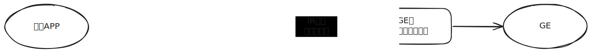
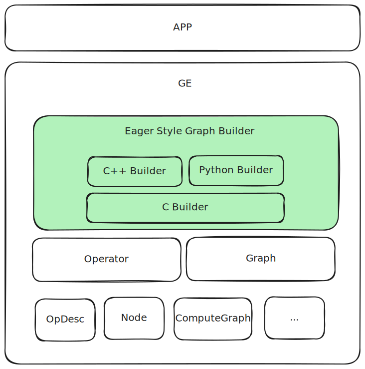
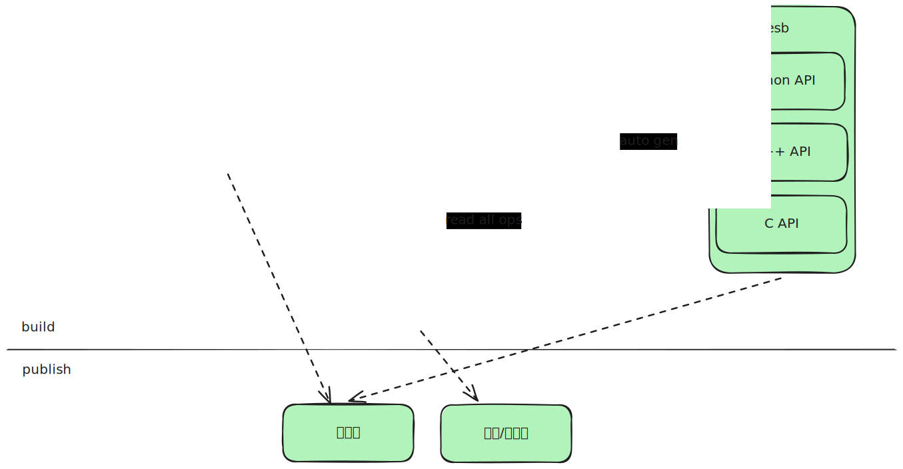
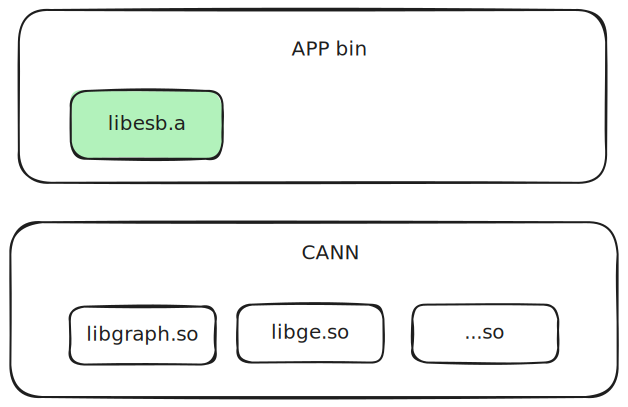
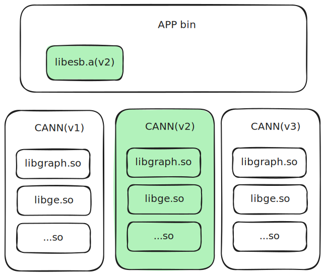
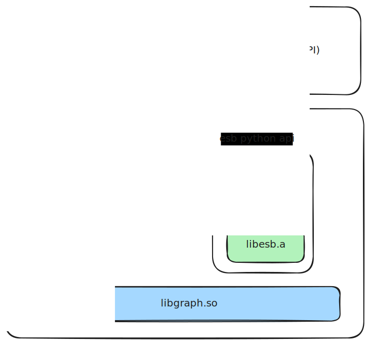
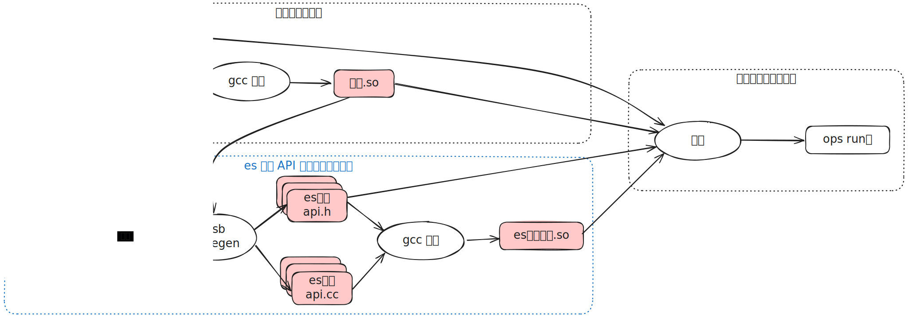
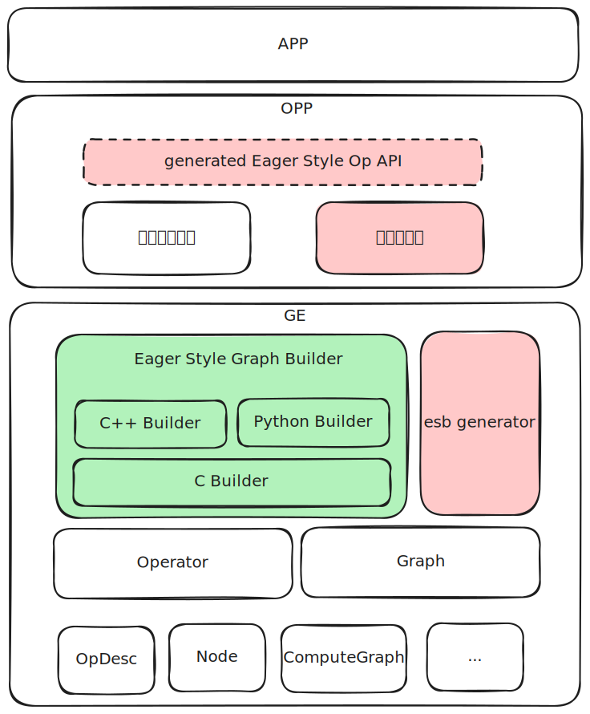
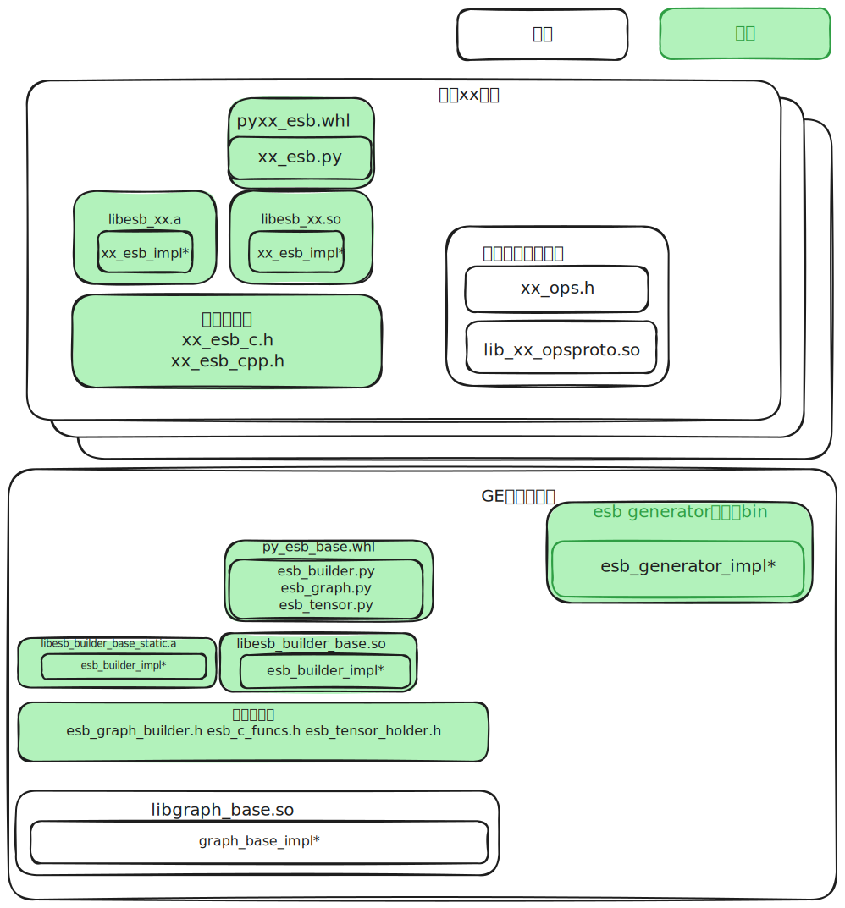

# ES (Eager Style) 构图

## 需求概述

现阶段构图接口示例：

```C++
std::unique_ptr<ge::Graph> BuildAddGraph() {
  auto graph = std::make_unique<ge::Graph>("graph");
  auto data0 = op::Data("data0").set_attr_index(0);
  auto data1 = op::Data("data1").set_attr_index(1);
  auto add = op::Add("add").set_input_x1(data0).set_input_x2(data1);
  graph->SetInputs({data0, data1}).SetOutputs({add});
  return graph;
} 
```

现阶段构图接口优点：

1. 点、边分离的构图方法，构图方式灵活、功能强大

现阶段构图接口痛点：

1. 使用繁琐，基于原型将 IR 实例化，然后对应原型的定义设置输入输出、属性等
2. 犯错不易察觉，需要真正开始编译图的时候可能才能发现构图的错误
3. C++接口，无ABI兼容性保证
4. 无前后向兼容设计

构图接口业界现状：

1. 大部分的构图风格采用函数式（函数式构图通过函数调用直接表达节点间的连接关系）
2. 函数式相对点边分离的优点：简单、C++编译时报错
3. 函数式相对点边分离的缺点：不灵活，必须按照拓扑序顺序构图；功能较弱，没有节点概念，构图、改图接口无法归一

关于两种风格的结论：

1. 纯构图场景适合函数式，简单、鲁棒性好
2. 综合场景（构图、改图、遍历图）使用点边分离方式

ES 目标：

1. 面向构图场景，采用函数式风格，提供易用接口
2. 由IR定义直接生成，避免手写，减少工作量
3. 支持多语言，支持Python、C++、C三种语言
4. API、ABI兼容
5. 向后、向前兼容

## 整体设计

**ES (Eager Style)** 是一套**函数风格的构图 API**。其语法设计借鉴了 PyTorch Eager 模式的脚本风格，因此得名。其核心理念是通过函数调用直接表达节点间的连边关系和 IR 信息传递。

构图整体数据流程如下所示：



构造可用的 `GE` 图整体分为两个阶段：

1. **构图阶段**：根据用户 `APP` 所依赖的 `OPP` 版本完成图构建，得到初始图，称为“用户直构图”。
2. **`IR` 语义兼容性处理阶段**：当运行环境中的 `OPP` 版本与构图时所用版本不一致时，进入该阶段。系统会基于构图时 `IR`
   版本，对"用户直构图"的语义进行解析，并尝试调整为符合运行环境能力的"兼容图"。若由于语义缺失或超出当前环境支持范围等原因，导致无法完成兼容转换，则返回错误并终止执行。

逻辑上，基于 `Operator` 系列构图 `API`，向上封装的构图 `lib`：



`es` 以 `C` 语言实现为核心，向上封装为 `C++` 和 `Python` 接口。其中，共用能力（如兼容性保障与公共函数）集中在 `C Builder` 层实现，而 `C++` 和 `Python`
层则根据各自语言特性进行语法封装。

整套构图接口采用函数式风格，覆盖当前所有的 `GEIR` 定义（不包括 `AscendCIR`）。严格来说，`GEIR` 并非一个独立概念，但由于 `AscendIR` 的部分内容（如 `AscendCIR`
）超出了本设计范围，后文中“GEIR”一词特指排除 `AscendCIR` 后的 `AscendIR` 子集。

为降低维护成本，接口采用自动生成机制：基于 `GEIR` 定义、辅以少量人工标注，结合统一的构图 API 规范，自动生成完整的 `es` 函数式构图接口，并打包到 `opp` 算子包对外发布。




## `API/ABI`兼容性设计

向前、向后兼容是 `CANN` 对外 `API` 的基本规格，`esb` 定位为构图系列 `API`，兼容性设计尤为重要，因此将兼容性设计作为首要考虑因素。

### 前后向兼容性场景分析

根据`CANN`兼容性要求，一个运行环境上，最多会出现四个`CANN`版本：

1. `GE`包版本：包含`GE`业务（图编译、图执行）、基础数据结构(`metadef`)两部分，`3, 4, 6`包
2. `opp`包版本：包含算子包，`8`包
3. 用户`APP`构建时，使用的`GE`包版本：用户`APP` 构建时，构建环境上安装的`GE`包。`APP`中使用的基础数据结构与该包相同。
4. 用户`APP`构建时，使用的`opp`包版本：用户`APP` 构建时，构建环境上安装的`OPP`包。`APP`中使用的算子定义与该包相同。

`GE`包接口为通用的构图接口(`Operator`系列接口)，该接口不关注具体的算子定义，成熟、稳定性高，认为已满足兼容性要求，兼容性的关键在`opp`包。

从兼容性要求可知，算子构图接口需要满足一定周期内`API`、`ABI`向前、向后兼容。详细来说，应该满足如下要求：

1. 升级`opp`包后：不做`APP`重新编译，`APP`可正确构图；做`APP`重编译，无需修改代码，可重编译通过，且可正确构图。
2. 降级`opp`包后，`APP`未使用降级后不存在的能力：与升级`opp`包行为相同。
3. 降级`opp`包后，`APP`使用了降级后不存在的能力：构图失败，报错。

继续展开分析，兼容性满足如下要求：

1. `API`兼容：升级、降级`CANN`版本后，只要不使用新能力，`APP`可以编译通过
2. `ABI`兼容：升级、降级`CANN`版本后，只要不使用新能力，`APP`在不做重新编译，可正常调用接口完成构图
3. `IR`语义兼容：升级、降级`CANN`版本后，只要不使用新能力，`APP`构造的图语义正确，可被`GE`理解和正常工作

### `C`语言`API/ABI`兼容性

`C` 语言无法直接表达 IR 中的可选输入与可选属性。例如，以下 `IR` 定义包含一个可选输入 `xo` 和一个默认值为 `0` 的可选属性 `a`：

```C
// IR 定义
REG_OP(Foo)
  .INPUT(x)
  .OPTIONAL_INPUT(xo) // 可选输入 xo
  .ATTR(a, Int, 0) // 可选属性 a，默认为 0
```

对应的 `C API` 只能以固定参数列表表示，无法反映参数的可选性：

```C
// C API
Tensor *Foo(Tensor *x, Tensor *xo, int64_t a);
```

当 IR 定义发生兼容性扩展（例如新增一个可选属性 `b`）时，`C API` 也必须增加相应参数：

```C
// 新 IR 定义：新增可选属性 b
Tensor *Foo(Tensor *x, Tensor *xo, int64_t a, int64_t b);
```

虽然语义上是向后兼容的变更，但由于 `C` 函数签名发生变化，导致`API`不兼容，这是由语言能力限制带来的无法兼容的约束。

为在使用 `C` 接口时提供稳定可靠的兼容性保障，`esb` 采用静态链接方式将 `libesb.a` 内联至目标应用中，确保接口在编译期冻结，与外部运行环境解耦。



如上图所示，`app`将`esb`模块作为静态库链接到`app`二进制中，以隔离`CANN`版本升降级的影响。`libesb.a`中，调用`Operator`系列公开接口，因此在`libesb`与`CANN lib`
之间可保证兼容性。在`CANN`版本发生变化时，运行环境`app`使用的`libesb`始终不变：



如上图所示，`app` 在编译时依赖 `CANN` 的 `v2` 版本，并通过静态链接方式将 `libesb.a` 内联到最终生成的可执行文件中。运行时，即使系统环境中的 `CANN` 版本与编译时不一致，`app`
所使用的 `libesb.a` 仍保持不变，兼容性由 `libesb` 依赖的稳定的 `Operator` 系列接口来保障。

若用户在 `CANN` 升级或降级后重新编译程序，则构图接口可能随 `CANN` 的 API 变动而发生不兼容。为避免此类问题，建议用户在首次集成时将 `libesb.a` 及其对应头文件拷贝至自身工程的 `third_party`
目录，并始终以该副本为基准进行构建，直到明确决定切换到其他版本的 `CANN` 为止。

注： libesb.a 并非真实环境上的静态库名称，用于统称es base 和 es generated 的库

### `C++`语言`API/ABI`兼容性

相较于 `C` 语言，`C++` 提供更强大的语法能力，如函数重载与默认参数，使其在应对 `IR` 接口兼容性演进时更加灵活。然而，由于 `C++` 缺乏统一的 ABI 标准，不同编译器及其版本间的实现可能存在差异，导致跨版本或跨平台的
ABI 不兼容问题。

为兼顾语法灵活性与二进制兼容性，`esb` 的 `C++` 构图接口设计为纯头文件库，所有实现通过强制内联方式调用底层稳定的 `C` 接口。编译时享受 `C++` 的语法便利，链接时依赖稳定的 `C` 层实现，从而确保整体 `ABI`
的一致性与可移植性。通过该设计，`C++`构图时，`ABI`、`IR`语义的兼容性问题被转换到`C`的对应问题上。相对`C`语言来说，`C++`不存在`API`不兼容的问题，因此`C`章节中提到的，`libesb.
a`和头文件的拷贝动作，在`C++`中是不需要的。

`C++`通过默认参数表达可选属性，通过重载适配可选输入。例如，以下 `IR` 定义包含一个可选输入 `xo` 和一个默认值为 `0` 的可选属性 `a`：

```C++
// IR 定义
REG_OP(Foo)
  .INPUT(x)
  .OPTIONAL_INPUT(xo1) // 可选输入 xo1
  .ATTR(a, Int, 0) // 可选属性 a，默认为 0
  .OUTPUT(y)
```

对应的`C++ API`为：

```C++
namespace es {
FORCE_INLINE Tensor *Foo(const Tensor *x, const Tensor *xo1, int64_t a=0);
}
```

新增一个可选输入`xo2`和一个可选属性`b`：

```C++
namespace es {
// v1 版本
FORCE_INLINE Tensor *Foo(const Tensor *x, const Tensor *xo1,
  int64_t a=0);

// v2 版本，由于新增可选输入，带来的重载版本，重载版本多了一个`xo2`的输入
FORCE_INLINE Tensor *Foo(const Tensor *x, const Tensor *xo1, const Tensor *xo2,
  int64_t a=0, int64_t b=0);
}
```

需要强调的是，重载的目的并非简化调用，而是为了**兼容性保障**。例如，在 `V3` 版本中若同时新增多个可选输入（如 `o3` 和 `o4`），也只会引入一个新的重载版本，而不会为每个新增输入分别添加独立重载。

#### 动态库和静态库的兼容性支持情况分析

鉴于前文提到的通过C++重载和内联当前版本C实现的方式：

**动态库场景下的兼容性**：

- **无法满足ABI兼容**：如果C函数签名发生变化（参数个数变化），用户APP必须重新编译，否则会导致运行时错误（coredump）
- **只能满足API兼容**：通过C++重载，让用户可以选择使用v1或v2版本的API，同时**需要依赖废弃重载接口的机制**：通过`[[deprecated]]
`属性修饰的重载接口，引导用户选择更有利于前向兼容的构图接口，避免误用导致前向兼容问题

**静态库场景下的兼容性**：

- **可以满足ABI兼容**：APP中已经链接了对应版本的C函数实现，参数匹配，不会出现参数不匹配问题
- **可以满足API兼容**：通过C++重载，让用户可以选择使用v1或v2版本的API，同时**需要依赖废弃重载接口的机制**：通过`[[deprecated]]
`属性修饰的重载接口，引导用户选择更有利于前向兼容的构图接口，避免误用导致前向兼容问题
- **依赖[IR语义运行时兼容处理](#ir语义兼容设计)***：即使IR定义发生了变化，也可以通过IR语义运行时兼容处理来保证正确性

因此，使用者可以结合实际情况在自己的代码工程中链接ES API的动态库或者静态库

#### 特殊场景讨论：误用重载接口导致兼容性丧失

每一个 `C++` 重载版本的 API 都绑定于某一具体版本的 `IR` 定义。当用户使用不恰当的重载形式，即便实际功能未使用，也可能因签名变化而破坏向前兼容性。

以上述 `Foo` 接口为例，假设在 `V2` 版本中引入了可选输入 `xo2`，用户虽然并不使用该输入，但仍编写了如下调用：

```C++
auto foo = Foo(x, nullptr, nullptr /* xo2 */);
```

此时若运行环境回退至 `V1` 版本并尝试重新编译，尽管 `xo2` 实际为 `nullptr`，也会因重载签名不再存在而引发编译错误，导致向前兼容性失效。

为尽可能避免这类误用，在重载设计中引入防呆机制，通过 `std::nullptr_t` 参数配合 `[[deprecated]]` 标记，在典型错误调用时提供编译期提示：

```C++
namespace es {
[[deprecated("Passing nullptr as xo2 may break forward compatibility. "
  "Use this version instead: "
  "Foo(const Tensor *x, const Tensor *xo1, int64_t a=0, int64_t b=0). "
  "See http://xxxx for more info.")]]
FORCE_INLINE Tensor* Foo(const Tensor* x, const Tensor* xo1, std::nullptr_t xo2,
int64_t a = 0, int64_t b = 0);
}
```

该机制可有效捕捉直接传入 `nullptr` 的情况，但对于以下形式仍无法触发告警：

```c++
Tensor* xo2 = nullptr;
auto foo = Foo(x, nullptr, xo2);  // 无法检测
```

因此，尽管在 API 设计中已尽力防范误用，仍建议在开发文档与使用说明中明确提示用户：**避免使用超出目标部署环境的重载接口，尤其是在未启用对应 IR 能力时。**
注：上述伪代码中类型命名等可能有变化，以真实代码为准

### `Python`语言`API`兼容性

`Python` 作为动态语言，不涉及编译期符号链接，因此无需考虑 `ABI` 兼容性问题。相较于 `C++`，虽然 `Python` 不支持函数重载，但其对关键字参数（`keyword arguments`
）的良好支持，使其非常适合表达可选属性与可选输入。

本设计延续了 `torchair` 中的接口风格：使用位置参数表示输入，关键字参数表示属性。该方式既能清晰区分输入与属性，又便于扩展与兼容。

以下 `IR` 示例定义了一个必选输入、一个可选输入，一个必选属性和一个可选属性：

```C++
// IR 定义
REG_OP(Foo)
  .INPUT(xr)
  .OPTIONAL_INPUT(xo)       // 可选输入 xo
  .REQUIRED_ATTR(a, Int)    // 必选属性，无默认值
  .ATTR(b, Int, 0)          // 可选属性，默认值为 0
```

它的`Python API`：

```Python
def Foo(xr: Tensor, xo: Optional[Tensor] = None, *, a: int, b: int = 0):
    """
- `xr` 为必选输入
- `xo` 通过可选位置参数表达可选输入
- `a` 为必选属性，必须以关键字形式传入
- `b` 为可选属性，使用关键字参数并指定默认值
"""
```

在下一个版本，新增可选输入`xo1`，可选属性`c`，则`API`变为：

```Python
def Foo(xr: Tensor, xo: Optional[Tensor] = None, xo1: Optional[Tensor] = None,
        *, a: int, b: int = 0, c: int = 0):
```
注：上述伪代码中类型命名等可能有变化，以真实代码为准

## `IR`语义兼容设计

当用户基于版本 `A` 的 `IR` 定义完成构图后，若在版本 `B` 的环境中编译，且 `A` 与 `B` 所使用的算子定义存在差异，`GE` 将尝试还原并理解构图意图，并对图进行适配，以符合版本 `B` 的 `IR`
规范。该过程即为 `IR` 语义兼容性处理流程。

`IR` 语义兼容仅适用于使用 `C/C++` 构图并采用**静态链接**的场景。在该模式下，构图`lib`(`libesb`)会在编译期固化到 `APP` 的二进制中，因此运行时可能出现构图版本与运行环境不一致的情况，需通过 `GE`
的语义兼容机制进行适配。

而在使用 `Python API` 构图的场景中，由于不存在链接过程，构图操作始终在运行时动态发起，构图行为直接依赖运行环境中的 `IR` 定义。因此，构图版本与运行版本天然保持一致，不存在语义兼容处理过程。

运行时，三种构图方式的调用关系如下图所示：



### `IR`语义兼容性处理

当前支持的`IR`兼容性变更包括：

- **新增可选输入**：在不影响现有输入顺序的前提下，向结尾添加新的可选输入
- **新增支持的数据类型**：为现有输入或输出添加更多支持的数据类型
- **新增可选属性**：引入具备默认值的新属性

除上述情况外，其他任何 `IR` 定义的变更均属于**不兼容变更**。若确有需求，需通过新增独立的 `IR` 算子来实现。

在语义兼容性处理过程中，`GE` 会基于直构图版本的 `IR` 信息，对图中各算子的语义进行解析与还原。若能成功映射至兼容图版本 `IR`
所支持的语义与能力，即视为构图兼容；否则（例如遇到不支持的输入/属性组合、语义歧义或行为差异），兼容性处理失败，流程终止并返回错误。

`IR` 中新增支持的数据类型，已由推导与能力检查（`dtype` inference 与 `check support`）机制明确处理，不纳入语义兼容流程。

语义兼容处理主要处理两类变更：**可选属性**、**可选输入**

下表展示了在 `直构图 IR` 与 `兼容图 IR` 不一致时，针对节点属性和输入的处理逻辑：

| 【输入】直构图 IR | 【输入】兼容图 IR | 【输入】直构图节点 | 【输出】兼容图节点                  |
| ---------- | ---------- | --------- | -------------------------- |
| 存在可选属性     | 不存在可选属性    | 存在该属性     | ❌ 向前兼容场景：使用了新增属性，**报错退出**  |
| 存在可选属性     | 不存在可选属性    | 不存在该属性    | ✅ 向前兼容场景：未使用新增属性，**删除该属性** |
| 不存在可选属性    | 存在可选属性     | 存在该属性     | ❌ 错误场景：**报错退出**            |
| 不存在可选属性    | 存在可选属性     | 不存在该属性    | ✅ 向后兼容场景：未使用新增属性，**使用默认值** |
| 存在可选输入     | 不存在可选输入    | 可选输入已连边   | ❌ 向前兼容场景：使用了新增输入，**报错退出**  |
| 存在可选输入     | 不存在可选输入    | 可选输入未连边   | ✅ 向前兼容场景：未使用新增输入，**删除该输入** |
| 不存在可选输入    | 存在可选输入     | 可选输入已连边   | ❌ 错误场景：**报错退出**            |
| 不存在可选输入    | 存在可选输入     | 可选输入未连边   | ✅ 向后兼容场景：未使用新增输入，**忽略处理**  |

**关于兼容性方向的判定说明**

从上述处理规则可以看出，**语义兼容判断仅依赖于两版本 `IR` 定义间的结构差异**即可完成，无需感知具体版本号，也无需显式区分“向前”或“向后”兼容。

但出于健壮性考虑，仍应在以下场景中做兼容性一致性校验： 若 `直构图 IR` 相比 `兼容图 IR` 同时**存在新增属性或输入**，又**缺失部分属性或输入**，则说明 `IR`
发生过不兼容修改，构图版本已不可直接适配，语义兼容应终止并返回错误。

## `API`风格设计

整个构图过程分为以下四个步骤：

1. **创建图构建器（`EsGraphBuilder`）**
   初始化图构建器实例，用于提供构图所需的上下文、工作空间及构建相关方法。
2. **添加起始节点**
   起始节点指无输入依赖的节点，通常包括图的输入（如 `Data` 节点）和权重常量（如 `Const` 节点）。
3. **添加中间节点**
   中间节点为具有输入依赖的计算节点，通常由用户构图逻辑生成，并通过已有节点作为输入连接。
4. **设置图输出**
   明确图的输出节点，作为计算结果的终点。

在构图过程中，涉及两个主要对象：

- **`Graph`**：表示最终构建完成的静态计算图，是构图的目标产物；
- **`EsGraphBuilder`**：构图辅助类，提供节点添加、连接、属性设置等方法，并记录构图过程的中间状态。

`EsGraphBuilder` 仅在构图阶段存在，用于承载中间构建信息，是`APP`构图时直接操作的对象。在构图完成后，其内部状态被封装为 `Graph` 实例返回，`EsGraphBuilder`本身及其相关资源被释放。

### `IR` 与 `API` 的映射关系

在三种语言中，`IR`与`API`的映射逻辑相同。每个 `IR` 映射为一个函数，函数名与算子类型相同。函数参数依次对应算子的输入和属性，返回值对应输出，顺序与 `IR` 定义保持一致。

例如，算子 `Foo` 定义如下：

```C
REG_OP(Foo)
  .INPUT(x1)
  .INPUT(x2)
  .OUTPUT(y1)
  .ATTR(a1, Int, 10)
  .ATTR(a2, Int, 20);
```

其对应的函数原型为：

- **函数名**：`Foo`（C++ / Python）或 `EsFoo`（C）
- **参数**：共 4 个，依次为 `x1`, `x2`, `a1`, `a2`
- **返回值**：输出 `y1`

语言间的命名规则如下：

- **C++**：使用命名空间 `es`，避免污染全局符号；
- **Python**：通过包名隔离；
- **C**：由于缺乏命名空间机制，统一为函数名前添加前缀 `Es`。

### 头文件/模块拆分策略

每个 `IR` 定义对应一个独立的头文件（`C` 和 `C++`）及一个对应的 `Python` 模块（`.py` 文件）。将生成文件按算子粒度拆分，带来以下优势：

1. **按需引入，减少编译负担**
   使用者可仅包含所依赖算子的头文件，避免不必要的编译依赖，提升构建效率。
2. **支持灵活组合**
   拆分后的头文件可按需组合，例如基于用途生成 `all_ops.h`（全部算子）、`math_ops.h`（数学计算相关算子）等多种场景化算子接口集合。
3. **提升稳定性与可维护性**
   当 `IR` 发生变更时，仅对应算子的头文件或模块需要更新，其他文件可保持不变，便于版本控制和增量构建。

为提升多语言使用体验，`es` 提供以下聚合接口：

- `es_all_ops.h`：包含所有 `C++` 封装的算子 API；
- `es_all_ops_c.h`：包含所有 `C` 封装的算子 API；
- `es_all` Python 包：自动聚合所有生成的 `.py` 模块，提供统一的导入路径和使用接口。


### `C API` 风格设计

以下示例展示了使用 `C` 接口构造一个“两个输入求和”的计算图：

```C
// 1. 创建图构建器（EsCGraphBuilder）
EsCGraphBuilder *builder = EsCreateGraphBuilder("graph_name");

// 2. 添加起始节点
EsCTensorHolder *data0 = EsCreateInput(builder, 0); // 添加第 0 个输入节点
EsCTensorHolder *data1 = EsCreateInput(builder, 1); // 添加第 1 个输入节点

// 3. 添加中间节点
EsCTensorHolder *add = EsAdd(data0, data1); // 添加加法计算节点（不再需要显式传入 builder）

// 4. 设置图输出
EsSetOutput(add, 0); // 将 `add` 节点设置为图的第 0 个输出

// 5. 完成构图，返回最终图对象
EsCGraph *graph = EsBuildGraphAndReset(builder); // 获取构建完成的图

// 6. 释放 builder 及其管理的过程资源
EsDestroyGraphBuilder(builder);
```

> [!Note]
> 
> **资源管理说明**
> 
> - 构图过程中，所有通过 `es` 接口创建的中间资源（如 `EsCTensorHolder*` 类型的 `data0`、`add` 等）由 `EsCGraphBuilder` 统一管理，其生命周期与 `builder` 一致。在调用 `EsDestroyGraphBuilder()` 后，这些资源将随 `builder` 一并释放。
> - 用户仅需管理两个对象的生命周期：`EsCGraphBuilder*` 和最终生成的 `EsCGraph*`。

> [!Note]
> 
> **类型封装说明**
> 为确保接口兼容性和封装性，`es` 所返回的对象类型（如 `EsCGraphBuilder`、`EsCTensorHolder`）对用户侧保持不透明。它们通过 `extern struct xxx;` 的声明方式暴露，仅提供不完整类型定义，应用侧无法访问其内部结构，只能通过 `es` 提供的接口进行操作。

#### 属性

ES 构图时会将 IR 算子中的属性进行映射，C 接口属性类型映射关系为：

| 算子属性类型    | IR属性类型        | C接口属性类型         |
| --------- | ------------- | --------------- |
| Int       | VT_INT        | int64_t         |
| Float     | VT_FLOAT      | float           |
| String    | VT_STRING     | const char *    |
| Bool      | VT_BOOL       | bool            |
| DataType  | VT_DATA_TYPE  | C_DataType      |
| ListInt   | VT_LIST_INT   | const int64_t * |
| ListFloat | VT_LIST_FLOAT | const float *   |
| ListBool  | VT_LIST_BOOL  | const bool *    |
| ListType    | VT_LIST_DATA_TYPE | const C_DataType *          |
| ListListInt | VT_LIST_LIST_INT  | const int64_t **            |
| Tensor      | VT_TENSOR         | EsCTensor *                 |
| ListString  | VT_LIST_STRING    | const char **               |

##### 生成代码举例

有算子`Foo`，包含一个输入`x`, 一个`Int`类型属性`a1`，以及一个`ListListInt`类型属性`a2`如下：

```C++
REG_OP(Foo)
    .INPUT(x)
    .OUTPUT(y)
    .ATTR(a1, Int, 10)
    .ATTR(a2, ListListInt, {{}, {}});
```

转换为 `C API` 为：

```c
EsCTensorHolder Foo(EsCTensorHolder *x, 
                     int64_t a1, 
                     const int64_t ** a2, 
                     int64_t a2_size, 
                     const int64_t *a2_inner_size);
```

#### 可选输入与可选属性

由于 `C` 语言不支持默认参数机制，生成的 `C API` 中**可选输入与普通输入无差别**，**可选属性也不会保留默认值信息**。

例如，以下 `IR` 定义包含一个可选输入 `x2` 和一个可选属性 `a2`：

```C++
REG_OP(Foo)
  .INPUT(x1)
  .OPTIONAL_INPUT(x2)
  .OUTPUT(y)
  .REQUIRED_ATTR(a1, Int)
  .ATTR(a2, Float, 10);
```

对应生成的 `C API` 为：

```C
EsCTensorHolder *EsFoo(EsCTensorHolder *x1, EsCTensorHolder *x2, int64_t a1, float a2);
```

在该接口中：

- 可选输入 `x2` 允许传入 `nullptr` 表示未使用
- 可选属性 `a2` 必须由调用者显式传入，接口本身不保留默认值
- 若传入 `a2` 的值与 `IR` 定义的默认值一致，则视为该属性未配置

可选输入的未使用、可选属性的未配置状态，将用于后续的语义兼容流程中。

#### 控制输入

控制输入用于表达节点之间的控制关系，特点是

1. 并不会体现到 `IR` 定义的输入中
2. 任何算子都允许对其添加 N 个控制输入（`N >= 0`）
3. 在保证构图合法性（有向无环图）的前提下，任何节点都可以作为其他任意节点的控制输入和控制输出

因为我们采取的策略是：提供配置控制输入的 `C` 与 `C++` 接口。

`C` 接口使用算子返回的 `EsCTensorHolder` 以及控制输入的 `EsCTensorHolder **` 形式全部节点与对应的节点数量作为入参，具体接口如下：

```c
/**
 * @brief 控制边连接函数
 * @param dest_ctrl_tensor 控制边连边对象
 * @param src_ctrl_tensors 控制边输入
 * @param ctrl_tensors_num 控制边数量
 * @return 成功为0，其他失败
 */
uint32_t EsAddControlEdge(EsCTensorHolder *dest_ctrl_tensor, 
                          EsCTensorHolder **src_ctrl_tensors, 
                          int64_t ctrl_tensors_num);
```

#### 多输出

当算子具有多个输出时，`C API` 使用结构体返回结果。例如，以下 `Foo` 算子定义了两个输出：

```c++
REG_OP(Foo)
  .INPUT(x)
  .OUTPUT(y1)
  .OUTPUT(y2);
```

对应的 `C` 接口为：

```C
typedef struct {
  EsCTensorHolder *y1;
  EsCTensorHolder *y2;
} FooOutput;

FooOutput EsFoo(EsCTensorHolder *x);
```

该结构体用于表示 `Foo` 算子的多输出，结构体成员名称与 `REG_OP` 中的输出名称保持一致，便于语义对应与自动生成。

> [!Note]
> 
> **资源管理说明**
> 与 `C API` 的整体资源管理策略一致，`EsFoo` 返回的结构体内部成员由 `EsCGraphBuilder` 管理，调用方无需手动释放， 即`EsCTensorHolder*` 指向的资源将在 
> `EsCGraphBuilder` 销毁时一并释放。

#### 动态输入与动态输出

动态输入表示在构图时可传入 `1` 到 `n` 个输入；动态输出表示在构图时将生成 `1` 到 `n` 个输出。

在 `C API` 中，动态输入与输出通过二级指针 (`EsCTensorHolder**`) 表达，并配合 `int64_t` 类型的计数参数说明元素数量。举例来说，`IdentityN`算子接受一到多个输入和输出，并将每个输入拷贝到对应输出，那么其`IR`定义为：

```C++
REG_OP(IdentityN)
  .DYNAMIC_INPUT(x)
  .DYNAMIC_OUTPUT(y);
```

对应的`C`接口原型为：

```c
typedef struct {
  EsCTensorHolder **y;      // 动态输出 y
  int64_t y_num;     // 输出张量数量
} IdentityNOutput;
IdentityNOutput EsIdentityN(EsCTensorHolder ** x,  // 动态输入 x
                            int64_t x_num,         // 输入张量数量
                            int64_t y_num          // 输出张量 y 的数量
                            );            
```

> [!Note]
>
> **资源管理说明**
> 与 `C API` 的整体资源管理策略一致，返回的 `IdentityNOutput` 结构体其内部的 `EsCTensorHolder** y` 成员由 `EsCGraphBuilder` 管理，无需用户手动释放，它们将在 `EsCGraphBuilder` 销毁时一并释放。
> 
> 输入参数 `x` 所指向的指针数组由调用方管理，需自行申请与释放。

##### 动态输出的个数

动态输出的实际数量由构图 API 根据算子语义推导而来。API 实现需要理解算子的语义逻辑，以确定应产生多少个输出。

以上文 `IdentityN` 为例，其输出个数与输入个数相等；而 `SplitD` 则根据属性 `num_split` 的值，对输入进行切分，生成多个输出：

```C++
REG_OP(SplitD)
  .INPUT(x)
  .DYNAMIC_OUTPUT(y)
  .REQUIRED_ATTR(split_dim, Int)
  .REQUIRED_ATTR(num_split, Int);
```

然而，目前 `IR` 定义中未显式描述“输入/属性 → 动态输出数量”的映射关系，导致构图 API 难以自动推导输出个数，进而无法正确生成输出。

为解决该问题，`es` 提供了两种机制：

**① 手动指定输出数量（默认方案）**

用户通过显式传参，告知 API 该算子应产生多少个输出。例如：

```c
typedef struct {
    EsCTensorHolder **y;   // 动态输出 y
    int64_t y_num;         // 输出张量数量
} IdentityNOutput;
IdentityNOutput EsIdentityN(EsCTensorHolder ** x,  // 动态输入 x
                            int64_t x_num,         // 输入张量数量
                            int64_t y_num         // 输出张量 y 的数量
                            );
```

**② 注册输出数量推导函数（优化预案）**

为提升易用性，`es` 支持为每个算子注册动态输出数量的推导逻辑。在生成 API 时将内嵌该逻辑，从而自动确定输出数量，用户无需显式传参。

例如，为 `IdentityN` 注册一个简单的推导规则：

```C++
// 注册部分，注册输出个数与输入个数相等的代码逻辑
REG_FOR_ESB(IdentityN)
  .DynamicOutputNum("y", "x_num"); // 推导代码，表达动态输出 y 的数量可以由"x_num"表达式获得
```
```C++
// 头文件定义
typedef struct {
  EsCTensorHolder **y;
  int64_t y_num;
} IdentityNOutput;
```
```C++
// 实现伪代码
IdentityNOutput IdentityN(EsCTensorHolder ** x, int64_t x_num) {
  int64_t y_num = x_num; // 使用注册的推导代码，推导出动态输出 y 的数量
  return IdentityN(x, x_num, y_num); // 使用推导出的y_num，调用方案1接口
```

注册的方案当前受制于组件间配合暂时无法实现，当前使用显式指定的方案1，或者[自定义es的实现](../../../examples/custom_es_api/README.md)。

##### 动态输出与非动态输出混合的情况

部分算子可能同时包含多个动态输出与非动态输出，如：

```c
REG_OP(CTCBeamSearchDecoder)
    .INPUT(inputs, TensorType({DT_FLOAT, DT_DOUBLE}))
    .INPUT(sequence_length, TensorType({DT_INT32}))
    .REQUIRED_ATTR(beam_width, Int)
    .REQUIRED_ATTR(top_paths, Int)
    .ATTR(merge_repeated, Bool, true)
    .DYNAMIC_OUTPUT(decoded_indices, TensorType({DT_INT64}))
    .DYNAMIC_OUTPUT(decoded_values, TensorType({DT_INT64}))
    .DYNAMIC_OUTPUT(decoded_shape, TensorType({DT_INT64}))
    .OUTPUT(log_probability, TensorType({DT_FLOAT, DT_DOUBLE}))
    .OP_END_FACTORY_REG(CTCBeamSearchDecoder)
```

其返回值结构有如下两种考虑：

1. 多层`struct`结构

```c
typedef struct {
  struct {
    EsCTensorHolder **decoded_indices,
    int64_t decoded_indices_num,
  } es_decoded_indices_output;
  struct {
    EsCTensorHolder **decoded_values,
    int64_t decoded_values_num,
  } es_decoded_values_output;
  struct {
    EsCTensorHolder **decoded_shape,
    int64_t decoded_shape_num,
  } es_decoded_shape_output;
  EsCTensorHolder *log_probability,
} EsCTCBeamSearchDecoderOutput;
```

2. **非多层情况(当前采取的策略)**

```c
typedef struct {
  EsCTensorHolder **decoded_indices,
  int64_t decoded_indices_num,
  EsCTensorHolder **decoded_values
  int64_t decoded_values_num,
  EsCTensorHolder **decoded_shape,
  int64_t decoded_shape_num,
  EsCTensorHolder *log_probability,
} EsCTCBeamSearchDecoderOutput;
```

为减少`struct`数量提高代码可读性，同时使接口出参更直观，目前采取**第二种非多层的方式**

```c

// 实现伪代码
typedef struct {
  EsCTensorHolder **decoded_indices;
  int64_t decoded_indices_num;
  EsCTensorHolder **decoded_values;
  int64_t decoded_values_num;
  EsCTensorHolder **decoded_shape;
  int64_t decoded_shape_num;
  EsCTensorHolder *log_probability;
} EsCTCBeamSearchDecoderOutput;
/**
 * @note user needs to provide following inputs for dynamic output numbers:
 *   decoded_indices_num: dynamic output number of decoded_indices
 *   decoded_values_num: dynamic output number of decoded_values
 *   decoded_shape_num: dynamic output number of decoded_shape
 */
EsCTCBeamSearchDecoderOutput EsCTCBeamSearchDecoder(
    EsCTensorHolder *inputs, 
    EsCTensorHolder *sequence_length, 
    int64_t decoded_indices_num, 
    int64_t decoded_values_num, 
    int64_t decoded_shape_num, 
    int64_t beam_width, 
    int64_t top_paths, 
    bool merge_repeated);
}
```

#### 冗余属性

由于历史原因，部分 `IR` 中定义的属性存在冗余。例如，在 `ConcatD` 算子中，属性 `N` 表示输入 `x` 的数量：

```C++
REG_OP(ConcatD)
  .DYNAMIC_INPUT(x)
  .OUTPUT(y)
  .REQUIRED_ATTR(concat_dim, Int)
  .ATTR(N, Int, 1);
```

按照默认映射规则生成的 API 会显得冗余：

```C
EsCTensorHolder *EsConcatD(EsCTensorHolder ** x, int64_t x_num, int64_t concat_dim, int64_t N);
```

优化方式是将属性 `N` 注册为可推导属性，使其由 `x_num` 自动推导。通过如下语句注册推导逻辑：

```C++
REG_FOR_ESB(ConcatD)
.InferableAttr("N", "x_num"); // 注册推导代码，认为属性 N 是“可推导”的，推到逻辑为等于 x_num
```

此机制与动态输出个数的推导逻辑类似，生成的推导版本 API 会被优先采用，原型及逻辑如下：

```c
EsCTensorHolder *EsConcatD(EsCTensorHolder ** x, int64_t x_num, int64_t concat_dim) {
  int64_t N = x_num;  // 根据注册逻辑推导 N
  return EsConcatD(x, x_num, concat_dim, N); // 调用默认实现
}
```
注册的方案当前同样受制于组件间配合暂时无法实现，可以使用[自定义es的实现](../../../examples/custom_es_api/README.md)。

#### 控制子图

部分算子包含将子图作为入参，以 `Case` 算子为例，原型如下：

```c
REG_OP(Case)
  .INPUT(branch_index, DT_INT32)
  .DYNAMIC_INPUT(input, TensorType::ALL())
  .DYNAMIC_OUTPUT(output, TensorType::ALL())
  .DYNAMIC_GRAPH(branches)
  .OP_END_FACTORY_REG(Case)
```

其语义可以等价于

```c
// 实现伪代码
switch (branch_index) {
  case 0:
    output = branches[0](input);
    break;
  case 1:
    output = branches[1](input);
    break;
  case 2:
    output = branches[2](input);
    break;
    // ...
  return output;
}
```

针对动态输入`input`和动态输出`output`个数沿用之前的设计(参考`动态输入与动态输出`章节)。

其中子图通过二级指针 (`ge::Graph **branches`) 表达并配合 `branches_num` 计数参数说明元素数量。

对于 C 接口来说，考虑 C 语言特性，函数签名使用 `EsCGraph **` 不透明指针表达，之后在函数内部进行强转。

生成后的头文件与接口如下：

```c
// 头文件定义
typedef struct {
  EsCTensorHolder **output;
  int64_t output_num;
} EsCaseOutput;
EsCaseOutput EsCase(EsCTensorHolder *branch_index, EsCTensorHolder **input, int64_t input_num,
                    int64_t output_num, EsCGraph **branches, int64_t branches_num);
```

> [!Note]
> 
> **资源管理说明**
> 
> 与 `C API` 的整体资源管理策略一致，返回的 `EsCaseOutput` 结构体内部的 `EsCTensorHolder** output` 成员由 `EsCGraphBuilder` 管理，无需用户手动释放，它们将在 `EsCGraphBuilder` 销毁时一并释放。
> 
> 子图入参 `branches` 在用户创建好并传入接口后，其生命周期会在函数内部转移给对应的 `EsCGraphBuilder` 并由其统一管理，用户不应在传入子图后再对其进行操作。
> 
> 输入参数 `input` 所指向的指针数组由调用方管理，需自行申请与释放。
> 
> **输入输出个数说明**
> 
> 详见附录[子图内外index映射关系表达](#子图内外index映射关系表达)章节

#### `Tensor` 属性语法

在 `Const` 算子的定义中，属性类型为 `Tensor`，这是一种特殊的数据类型，通常需要多个参数共同描述。

针对该类型属性，`C API` 提供如下接口用于创建常量：

```c
/**
 * @brief 本接口用于C用户创建EsCTensor
 * @param data 张量数据指针
 * @param dim 张量维度数组指针
 * @param dim_num 张量维度数量
 * @param data_type 张量的DataType枚举值
 * @param format 张量格式
 * @return 张量的匿名指针，所有权交给调用方控制, 失败时返回nullptr
 */
EsCTensor *EsCreateEsCTensor(const void *data, 
                             const int64_t *dim, 
                             int64_t dim_num, 
                             C_DataType data_type,
                             C_Format format);
/**
 * @brief 本接口用于C用户通过binary文件创建EsCTensor
 * @param data_file_path 张量binary数据文件路径
 * @param dim 张量维度数组指针
 * @param dim_num 张量维度数量
 * @param data_type 张量的DataType枚举值
 * @param format 张量格式
 * @return 张量的匿名指针，所有权交给调用方控制, 失败时返回nullptr
 */
EsCTensor *EsCreateEsCTensorFromFile(const char *data_file_path, 
                                     const int64_t *dim, 
                                     int64_t dim_num,
                                     C_DataType data_type, 
                                     C_Format format);
```

这两个接口会生成一个 `EsCTensor *`的匿名指针指向`ge::Tensor *`，用于后续作为 `Tensor` 类型属性传入对应算子的构图函数。

参数说明如下：
- **`data` / `data_file_path`**：常量数据来源。前者表示数据已加载至内存中，后者为数据文件路径，将从文件中读取内容。
- **`dim` + `dim_num`**：指定常量 `Tensor` 的形状。
- **`data_type`**：数据类型，使用 `C_DataType` 枚举，定义与 `ge::DataType` 保持一致。
- **`format`**：数据格式，使用 `C_Format` 枚举，定义与 `ge::Format` 保持一致。

> [!Note]
> 
> **资源管理说明**
> `EsCreateEsCTensor` / `EsCreateEsCTensorFromFile`返回的结构体指针由调用方进行管理。

对应的，`Const` 算子的原型定义以及 `API` 为：

```C++
// Const 原型
REG_OP(Const)
  .OUTPUT(y)
  .ATTR(value, Tensor, Tensor());

// C API
EsCTensorHolder *Const(EsCGraphBuilder *builder, EsCTensor *value);
```

#### `Const` 的直接接口
针对 `Const` 算子，为了便于使用，我们在 `C/C++` 中都提供了直接的接口：

```c
EsCTensorHolder *EsCreateConstInt64(EsCGraphBuilder *graph, 
                                    const int64_t *value, 
                                    const int64_t *dims, 
                                    int64_t dim_num);
EsCTensorHolder *EsCreateConstInt32(EsCGraphBuilder *graph, 
                                    const int32_t *value, 
                                    const int64_t *dims, 
                                    int64_t dim_num);
EsCTensorHolder *EsCreateConstUInt64(EsCGraphBuilder *graph, 
                                    const uint64_t *value, 
                                    const int64_t *dims,
                                    int64_t dim_num);
EsCTensorHolder *EsCreateConstUInt32(EsCGraphBuilder *graph, 
                                    const uint32_t *value, 
                                    const int64_t *dims,
                                    int64_t dim_num);
EsCTensorHolder *EsCreateConstFloat(EsCGraphBuilder *graph, 
                                    const float *value, 
                                    const int64_t *dims, 
                                    int64_t dim_num);
```

参数说明如下：
- **`graph`**：算子所属的`Graph`。
- **`value`**：常量数据来源。
- **`dims` + `dim_num`**：指定常量 `Tensor` 的形状。

具体接口可以参考[api目录](../api/es_cpp.md)

#### `Scalar`的特殊语法

在许多场景下，需要构造一个 `Scalar` 类型的常量节点。使用通用的 `EsCreateConst` 接口构造 `Scalar` 会显得繁琐：

```C
float value = 10.0;
EsConst *tensor = EsCreateConst(builder, &value, nullptr, 0, ES_DT_FLOAT, ES_FORMAT_ND);
EsCTensorHolder *c1 = Const(builder, tensor);
```

为简化此类常见操作，框架提供了一组快捷 API，用于直接创建标量类型的常量 `Const` 节点：

```C++
EsCTensorHolder *EsCreateConstScalarFloat32(EsCGraphBuilder *builder, float value);
EsCTensorHolder *EsCreateConstScalarFloat16(EsCGraphBuilder *builder, float value);
EsCTensorHolder *EsCreateConstScalarInt64(EsCGraphBuilder *builder, int64_t value);
EsCTensorHolder *EsCreateConstScalarInt32(EsCGraphBuilder *builder, int32_t value);
// 更多数据类型，按需添加
```

这些 API 将在图中创建一个 `Const` 节点，其属性具有以下特征：

- `shape` 为标量（即 0 维）
- `format` 为 `FORMAT_ND`
- 返回值为已构建的 `EsCTensorHolder*`，可直接用于后续构图流程

这些接口的底层依然使用 `EsCreateConst` 构造常量，只是对标量场景做了语法包装，语义更加直观、简洁。

### `C++ API` 风格设计

相较于通过指针传参和手动管理资源的 C API，C++ API 利用类封装自动完成资源管理，调用者无需显式释放资源。以下示例展示构造一个“两个输入求和”的计算图：

```C++
using namespace es;

// 1. 创建图构建器（EsGraphBuilder）
EsGraphBuilder builder("graph_name");

// 2. 添加 2 个输入节点
EsTensorHolder [data0, data1] = builder.CreateInputs<2>();

// 3. 添加中间节点，C++中，加减乘除等常用运算符被重载，可以直接使用
EsTensorHolder add = data0 + data1;

// 4. 设置图输出
builder.SetOutput(add, 0);

// 5. 完成构图，获取构造好的`Graph`对象，`builder`中的资源随析构而销毁
std::unique_ptr<ge::Graph> graph = builder.BuildAndReset();
```

#### 属性

ES构图时会将IR算子中的属性进行映射，C++属性类型映射关系为：

| 算子属性类型    | IR属性类型        | `C++`接口属性类型                    |
| --------- | ------------- | ------------------------------ |
| Int       | VT_INT        | int64_t                        |
| Float     | VT_FLOAT      | float                          |
| String    | VT_STRING     | const char *                   |
| Bool      | VT_BOOL       | bool                           |
| DataType  | VT_DATA_TYPE  | ge::DataType                   |
| ListInt   | VT_LIST_INT   | const std::vector\<int64_t\> & |
| ListFloat | VT_LIST_FLOAT | const std::vector\<float\> &   |
| ListBool  | VT_LIST_BOOL  | const std::vector\<uint8_t\> & |
| ListType    | VT_LIST_DATA_TYPE | const std::vector\<ge::DataType\> &           |
| ListListInt | VT_LIST_LIST_INT  | const std::vector\<std::vector\<int64_t\>\> & |
| Tensor      | VT_TENSOR         | std::unique_ptr\<ge::Tensor\>                            |
| ListString  | VT_LIST_STRING    | const std::vector\<const char *\> &                 |

##### 生成代码举例

有算子`Foo`，包含一个输入`x`, 一个`Int`类型属性`a1`，以及一个`ListListInt`类型属性`a2`如下：

```C++
REG_OP(Foo)
    .INPUT(x)
    .OUTPUT(y)
    .ATTR(a1, Int, 10)
    .ATTR(a2, ListListInt, {{}, {}});
```

转换为`C++ API`为：

```C++
namespace es {
EsCTensorHolder Foo(const EsTensorHolder &x, 
             int64_t a1 = 10, 
             const std::vector<std::vector<int64_t>> &a2 = {{}, {}});
}
```

C++ API 兼容 C API 的设计理念，并基于 C++ 语言特性提供更简洁、自然的调用方式。下文将介绍这些特性。

#### 可选属性

C++ API 通过默认参数表达 IR 中的可选属性。例如，`Foo` 算子有两个可选属性：

```C++
REG_OP(Foo)
  .INPUT(x)
  .OUTPUT(y)
  .ATTR(a1, Int, 10)
  .ATTR(a2, Float, 0.0);
```

对应的 C++ 接口为：

```C++
namespace es {
  EsTensorHolder Foo(const EsTensorHolder &x, int64_t a1 = 10, float a2 = 0.0);
}
```

若某个可选属性出现在了必选属性之后， 例如：

```C++
REG_OP(Foo)
.INPUT(x)
.OUTPUT(y)
.ATTR(a1, Int, 10)  // 可选属性 a1
.REQUIRED_ATTR(a2, Int) // 必选属性 a2
.ATTR(a3, Float, 0.0); // 可选属性 a3
```

有两种处理方案：

1. 该可选属性在 API 中退化为普通参数，必须显式传入。

对应的 C++ 接口为：

```C++
namespace es {
  EsTensorHolder Foo(const EsTensorHolder &x, int64_t a1, int64_t a2, float a3=0.0);
}
```

优点是函数参数顺序和ir顺序一致，缺点是用户必须传递a1的值10或者其他

2. 对参数进行重排，可选放在最后 对应的 C++ 接口为：

```C++
namespace es {
  EsTensorHolder Foo(const EsTensorHolder &x, int64_t a2, int64_t a1=10, float a3=0.0);
}
```

优点用户无需传递a1的值，缺点是函数参数和ir顺序不一致。

考虑到易用性和形参的名字本身就能体现属性的名称，采取方案2

#### 控制输入

通过`std::vector<EsTensorHolder>`表达控制输入，延续`C API`思路，对应的`C++ API`为：

```c++
namespace es {
Status EsTensorHolder::AddControlEdge(const std::vector<EsTensorHolder> &ctrl_ins) const;
}
```

#### 动态输入与动态输出

通过`std::vector`表达动态输入输出，对于动态输出个数的问题，延续`C API`的方式。

以`IdentityN`为例（原型参考`C API`动态输入输出章节），`C++`接口为：

```C++
namespace es {
std::vector<EsTensorHolder> IdentityN(const std::vector<EsTensorHolder> &x // 动态输入 x
                                     int64_t y_num   // 输出张量 y 的数量
                                     );
}
```

对于包含多个动态输出以及动态输出与非动态输出混合情况的算子，采用与C接口类似的方式构建`struct`结构体承载输出。

以`CTCBeamSearchDecoder`算子为例，`C++`接口的输出结构为：

```c++
struct CTCBeamSearchDecoderOutput {
  std::vector<EsTensorHolder> decoded_indices;
  std::vector<EsTensorHolder> decoded_values;
  std::vector<EsTensorHolder> decoded_shape;
  EsTensorHolder log_probability;
};
/**
 * @note user needs to provide following inputs for dynamic output numbers:
 *   decoded_indices_num: dynamic output number of decoded_indices
 *   decoded_values_num: dynamic output number of decoded_values
 *   decoded_shape_num: dynamic output number of decoded_shape
 */
inline CTCBeamSearchDecoderOutput CTCBeamSearchDecoder(
    const EsTensorHolder &inputs, 
    const EsTensorHolder &sequence_length, 
    int64_t decoded_indices_num, 
    int64_t decoded_values_num, 
    int64_t decoded_shape_num, 
    int64_t beam_width, 
    int64_t top_paths, 
    bool merge_repeated=true);
```

#### 控制子图

与`C`接口实控制子图的方式类似，`C++`接口的控制子图通过`std::vector<std::unique_ptr<ge::Graph>>`表达，子图个数通过`vector`的大小来表达。

以`Case`为例（原型参考`C`接口控制子图章节），`C ++`接口为：

```c++
namespace es {
inline std::vector<EsCTensorHolder> Case(
    const EsTensorHolder &branch_index, 
    const std::vector<EsTensorHolder> &input, 
    int64_t output_num, 
    std::vector<std::unique_ptr<ge::Graph>> branches)
    );
}
```

> [!Note]
> 
> **资源管理说明**
> 子图`vecotr`的生命周期会在函数内部转移，最终由`EsCGraphBuilder`进行管理。
> 

#### 运算符重载

`C++ API` 利用运算符重载，使构图代码更直观、自然。对于支持重载的算子，API 同时提供函数版本与运算符版本，二者等价。例如，加法操作既可以使用函数调用：

```c++
EsTensorHolder add = Add(x1, x2);
```

也可以使用更简洁的运算符形式：

```C++
EsTensorHolder add = x1 + x2;
```

运算符重载规则与 PyTorch 保持一致，同时考虑C++的合法操作符，我们支持的运算及其对应算子如下：

| 运算符 | **对应算子**      |
| ------ | ----------------- |
| `+`    | `Add`             |
| `-`    | `Sub`             |
| `*`    | `Mul`             |
| `/`    | `Div`             |

#### 数值输入支持

为提升构图易用性，`C++ API` 支持直接使用标量或向量作为算子输入，无需手动创建常量节点。该特性通过 `EsTensorLike` 包装类实现，实现机制如下：

1. **构造函数重载**：`EsTensorLike` 通过构造函数重载承接不同输入类型（`EsTensorHolder`、标量、向量等）
2. **解析图构建器**：从输入参数中解析出 `EsCGraphBuilder*`，用于后续创建常量节点
3. **归一化处理**：调用 `EsTensorLike::ToTensorHolder(EsCGraphBuilder *graph)` 方法完成归一化，将数值类型转换为 `EsTensorHolder` 对象

##### 支持的输入类型

`EsTensorLike` 通过构造函数重载支持以下输入类型:

```c++
EsTensorLike(const EsTensorHolder &tensor);
EsTensorLike(const int64_t value);
EsTensorLike(const float value);
EsTensorLike(const std::vector<int64_t> &values);
EsTensorLike(const std::vector<float> &values);
EsTensorLike(const std::nullptr_t);
// 更多数据类型，按需添加
```

##### 适用范围与约束

1. C++ 向量不支持隐式类型转换，因此动态输入参数不支持传入数值类型 
2. 满足以下任一条件的算子支持数值输入:
- 输入数量超过一个，且不全为动态输入（传参时至少包含一个 `EsTensorHolder` 类型的输入参数，可从该参数解析图构建器）
- 所有输入都是可选参数（该场景下，API 会提供可选的 `owner_builder` 参数用于显式传入 `EsGraphBuilder*`。传参时至少包含一个 `EsTensorHolder` 类型的输入参数，或者传入`owner_builder`）

具体调用示例可参考 [make_transformer_graph.cpp](../../../examples/es/transformer/cpp/src/make_transformer_graph.cpp)。

### `Python API` 风格设计

以下示例展示了使用 `Python` 接口构造一个“两个输入求和”的计算图：

```python
from ge.es.graph_builder import GraphBuilder, TensorHolder

# 1. 创建图构建器（GraphBuilder）
builder = GraphBuilder("graph_name")

# 2. 添加 2 个输入节点
data0, data1 = builder.create_inputs(2)

# 3. 添加中间节点
add = data0 + data1

# 4. 设置图输出
builder.set_graph_output(add, 0)

# 5. 完成构图，返回最终图对象
graph = builder.build_and_reset()
```

与 `C++` 类似，`Python API` 利用语言特性提升易用性。构图过程中无需显式管理资源，遵循与 `C++ API` 相同的运算符重载规则。`es` 还提供了符合 Python 风格的封装，使构图流程更自然、直观。

#### `Python API`原型规则

`Python API`遵守整体的`IR`与`API`的映射关系，保持输入参数与`IR`定义的顺序一致。同时利用`Python`的占位参数、关键字参数、默认值能力，完整支持可选输入、可选属性。在`Python API`的兼容性章节已有举例
，本节不做赘述。

#### 多输出

自定义输出表达的类，类中每个元素可以是`Tensor`或`list[Tensor]`类型， 分别表示普通输出和动态输出

#### 控制输入

有两种方案可以选择：

1. 通过关键字参数传递 `dependencies=[]`，默认为空，如下所示

```Python
def Foo(xr: Tensor, xo: Optional[Tensor] = None, xo1: Optional[Tensor] = None,
        *, a: int, b: int = 0, c: int = 0, dependencies: List[Tensor] = []):
```

2. 通过单独的控制 API 来实现

```python
f0 = Foo()
f1 = Foo()
f2 = Foo()

f2.control_dependencies([f0, f1])

```

我们采用方案 2 来实现，原因有如下几点：

- 方案 1 是 torchair 目前采用的风格，之所以这么做是因为 torchair 有一个设计理念防呆大于易用，因此其引入了一条构图操作应该完全通过 IR 的 API
  来完成的原则，此原则是为了杜绝任何可能改坏图的后处理行为，ES 构图在考虑各方取舍之后，决定不追求此原则，具体可以看后续`是否要做到完全防呆`的讨论
- 绝大多数构图场景通过数据依赖就可以完整表达顺序，用到控制边的场景可能是某些操作之间没有数据交换，但是仍然希望按照特定顺序执行，比如变量读取和更新操作，PyTorch 甚至都没提供控制边的概念，因此没有必要对每个 IR 的
  ES API 都暴露一个控制边的参数

- ES C 的实现因为没有默认参数，所以不会在 IR 的 ES API 层面添加参数，而是通过提供单独 API 设置，鉴于 ES 的多语言能力应该保持一致的原则，ES Python 实现是对 ES C 的封装，因此 API 风格也应该和 ES
  C 保持一致

同时我们结合语言的特点，可以使用类似 TensorFlow 的风格，额外提供如下风格的控制边设置功能

```python
with EsBuilder.control_dependencies([f0, f1]):
    f2 = Foo()
```
#### 操作符重载

在 Python 中，可以通过在 `Tensor` 类中定义特定的特殊方法（也称为魔术方法）来实现操作符重载。

如下是一些常见的操作符和对应的特殊方法：

- `+` : `__add__(self, other)`
- `-` : `__sub__(self, other)`
- `*` : `__mul__(self, other)`
- `/` : `__div__(self, other)`


特殊方法内部调用对应算子实现

| 运算符  | **对应算子**     |
| ---- | ------------ |
| `+`  | `Add`        |
| `-`  | `Sub`        |
| `*`  | `Mul`        |
| `/`  | `Div`        |

#### 数值输入支持

为提升构图易用性，`Python API` 支持直接使用标量或（嵌套）列表作为算子输入，无需手动创建常量节点。该特性通过 `tensor_like` 模块实现，实现机制如下：

1. **API 参数类型扩展**：`TensorLike` 是标量和（嵌套）列表类型的集合，支持数值传入的算子 API 的输入参数类型扩展为 `Union[TensorHolder, TensorLike]`，以承接不同输入类型（EsTensorHolder、标量、向量等）
2. **解析图构建器**：通过 `resolve_builder` 函数从输入参数中解析出 `GraphBuilder` 实例，用于后续创建常量节点
3. **归一化处理**：调用 `convert_to_tensor_holder` 函数完成归一化，将数值类型转换为 `TensorHolder` 对象

##### 支持的输入类型

`Python API` 支持以下数值类型作为输入:

- `int` / `float`: 标量
- `List[int]` / `List[float]`: 一维列表
- `List[List[...]]`: 多维嵌套列表

##### 适用范围与约束

满足以下任一条件的算子支持数值输入:
- 输入数量超过一个（传参时至少包含一个 `TensorHolder` 类型的输入参数，可从该参数解析图构建器）
- 所有输入都是可选参数（该场景下，API 会提供可选的 `owner_builder` 参数用于显式传入 `GraphBuilder`。传参时至少包含一个 `TensorHolder` 类型的输入参数，或者传入`owner_builder`）

与 `C++ API` 不同的是，**Python 的动态输入参数也支持传入数值**。

具体调用示例可参考 [make_transformer_graph.py](../../../examples/es/transformer/python/src/make_transformer_graph.py)。

#### Python 特有的一些构图语法糖

##### node 级别的私有属性 scope 设置

详见后续[私有属性](#私有属性)章节


## 详细设计

### 构建流程

如前所述，在 `API` 生成过程中，需要依赖历史的 `IR` 信息，以生成满足兼容性要求的函数签名。因此，从算子仓的构建视角来看，构建工程新增了一个额外的输入和输出：各版本的原型信息。


展开而言，在算子工程的构建过程中，原型信息编译完成后，将进入 **ES 系列 API 的生成与编译阶段**。该阶段基于当前版本与历史原型库，按照预设规则进行代码生成（codegen），生成符合兼容性规范的 ES 构图
API，并将其编译为二进制文件。

随后，生成的 ES 二进制及对应头文件会被打包进运行包（run 包）中发布。整个构建流程中，ES 的实现代码仅作为构建过程中的中间产物，**不会合入算子代码仓**。



同时在上图的"ES 系列 API 的生成与编译阶段流程"中，ES codegen 读取"历史原型库"，具体来说：是指基于历史原型信息，生成满足兼容性要求的 ES API

所谓“历史原型库”，相较于原型定义，具有以下显著差异：

- **定义方式不同**：
  
  原型定义通过 `C++` 代码中的 `REG_OP` 宏进行注册，需经编译后方可使用；而历史原型信息采用结构化文本格式描述，可直接解析，无需编译，适合在构建流程中快速读取和处理。

- **数据内容不同**
  “历史原型库”按商发版本组织，记录了历史上每个商发版本的完整原型定义，用于支持多版本对比与兼容性判断。
  
  按照兼容性规范，商发版本中的接口（包括构图接口）需在发布后**向后兼容一年，向前兼容一年**。例如，2025 年 6 月 30 日发布的版本应向后兼容至 2024 年 3 月 30 日之前的版本，向前兼容至 2026 年 9 月 30
  日之后的版本。 鉴于兼容周期可能因规范调整而变化，历史原型库需**完整保留所有历史版本的 API 定义**，以便灵活适应未来兼容性策略的演进。

### 模块划分

构建流程中新增了四个模块：

- **ES generator**（归属 `GE`）：对应前文所述的 `ES codegen` 阶段，结合当前版本原型信息，生成符合兼容性要求的 ES 构图 API。
- **历史原型库**（归属 `opp`）：用于定义和维护原型库协议，存储所有历史的原型信息，为多版本兼容性处理提供基础支撑。
- **generated Eager Style Op API**（归属 `opp`）：该模块为构图 API 的生成结果，由构建流程中动态生成，并随运行包发布。由于不参与源码维护，图中以虚线表示其存在。
- **Eager Style Graph Builder**（归属 `GE`）：该模块为 `generated Eager Style Op API` 的基础，配合后者提供完整的 ES 构图能力。



从开发视角来看，`ES generator` 与 `Eager Style Graph Builder` 可直接纳入 `GE` 仓维护


### 模块部署

下图用来描述前文涉及到的模块在 run 包中的归属关系，以及 run 包中新增的内容（交付件）




#### Python 封装的具体实现

我们采用 ctypes（内置库，不引入额外的依赖）的方式基于 `C` 代码的 so 做 API 的封装；并且如上图所示，我们需要对 esb generated 的产物和 esb base 两部分的 C 代码做封装，分别集成到 opp 包和 compile 包。
以如下原型 Gen 出来的 C 函数签名举例：

```c
#ifdef
__cplusplus
extern "C" {
#endif
  EsCTensorHolder *Esphony_1i1o(EsCTensorHolder *x, int64_t index);
#ifdef
__cplusplus
}
#endif
```

我们可以通过如下 Python 封装层来实现对应的 Python API 的功能

```python
import ctypes
import os
try:
    from pyge.es_graph_builder import GraphBuilder, TensorHolder
    from pyge.library.pyes_graph_builder_wrapper import (
        esb_lib,
        get_generated_lib
    )
except ImportError as e:
    pytest.skip(f"无法导入 pyge 模块: {e}", allow_module_level=True)

# 定义函数原型
esb_generated_lib = get_generated_lib()
esb_generated_lib.Esphony_1i1o.argtypes = [ctypes.c_void_p, ctypes.c_int64]
esb_generated_lib.Esphony_1i1o.restype = ctypes.c_void_p

# 创建 Python 包装函数
def phony_1i1o(x: TensorHolder, index: int) -> TensorHolder:
    """
    调用 Esphony_1i1o 函数的 Python 包装
    参数:
        x: TensorHolder 对象
        index: int64 类型的索引值
    返回:
        返回新的 TensorHolder 对象
    """
    # 获取底层 C 对象的指针
    x_ptr = x.handle

    # 调用 C 函数并创建新的 Python 包装对象
    return TensorHolder(esb_lib.Esphony_1i1o(x_ptr, ctypes.c_int64(index)))
```

### ES Python 构图的额外处理

从实际业务流程来看，`APP` 调用 `libesb` 完成构图后，需要应用该图，即通过 `GE` 接口完成图编译与执行。目前，`GE` 仅提供 `C++` API，因此：

- **使用 C++ 的 APP**：可直接进行构图、编译与执行
- **使用 Python 的 APP**：虽能完成构图，但无法持有构图结果，且缺少后续编译与执行能力

为支持 Python API 的完整功能，需要在以下模块新增 Python 封装：

* **GE**：作为通用图结构的载体模块，需将 `Graph` 等基础结构封装为 Python 可用对象，同时打包到 `GE 图编译子包`
* **GE**：需将已有的 `Session` 类封装为 Python 类，暴露编译和执行能力，同时打包到 `GE 图编译子包`


### 是否要做到完全防呆

完全防呆前文提到是 torchair 的一个设计原则，ES 如果 follow 这个原则，意味着所有操作要在 ES API 内完成闭环，同时不对外提供任何可以基于对象二次改图的接口；对于 ES 来说会有如下问题：

1. ES API 是忠实于 IR 定义 gen 出来的，同时要支撑多个场景的使用，如用户自定义 pass，内部图的 dump code
   able 完整表达，这意味着要支持的场景会比 torchair 面临的场景复杂，这会出现私有属性、控制边等不体现在 IR 上的信息需要 ES 构图来表达，如果 follow
   torchair 的原则，会对每个 API 统一添加很多可能很少场景下才会用到参数，造成可读性下降的同时会打破 ES API 是忠实于 IR 定义这一原则

2. 不对外提供任何可以基于对象二次改图的接口，对 ES 来说就是不暴露 GetProducer 的获取 GNode 对象的接口，这个带来的影响如下

- 实际场景下，GetProducer 很难干掉，因为 ES API 的实现构造节点连边关系的时候，鉴于我们 ES 复用已有的数据结构的原则，需要复用对 GNode 建立连边的接口，需要 Graph::AddEdge(
  tensorholder0->GetProducer()， tensorholder1->GetProducer()，如果要去掉，则面临此新增 ES 专门的连边基础接口，打破了复用原则

- GetProducer 提供的好处也显而易见，可以让 ES 跟现有的 GE 的数据结构建立桥梁，意味着 ES 的能力更强大，拥有更多可能性

3. 鉴于前文提到的 ES 多语言（C、C++、Python）能力一致的原则，对 ES API 添加参数会造成 ES C 的构图易用性下降，因为 C 语言不支持默认参数，此举会造成使用者不得感知所有参数

鉴于上述，我们 ES 的原则是 API 内部仅完成 IR 相关的构图设置，设置私有属性和控制边等 IR 不相干的行为通过单独的 API 完成，做到部分防呆的同时兼顾构图的高易用性

### 私有属性

目前对图对象、节点对象、节点的输出对象设置私有属性，整体来说以下几种方式可以选择：

1. 基于现有的基础类设置属性接口进行设置（C 不支持，因为 GNode 没有对应的 C 的 struct）

```c++
EsGraphBuilder builder("test_graph");
auto t = graph_builder->CreateScalar(int64_t(321));
// ... 其他构图代码
std::unique_ptr<ge::Graph> graph = builder.Build();
graph->SetAttr(attr_name, attr_value); // 依赖现有的ge::Graph类的设置属性能力，以及AttrValue的泛型对象支持任意的基本类型属性

auto node_ptr = t.GetProducer();
node_ptr->SetAttr(attr_name, attr_value); // 依赖现有的ge::GNode类的设置属性能力，以及AttrValue的泛型对象支持任意的基本类型属性
node_ptr->SetOutputAttr(attr_name, attr_value); // 依赖现有的ge::GNode类的设置属性能力，以及AttrValue的泛型对象支持任意的基本类型属性

```

```python
# 封装GNode和Graph的python类，提供方法设置

```

2. 基于EsGraphBuilder和EsTensorHolder封装的接口进行设置

```c++
class EsGraphBuilder {
  Status SetAttr(const char *attr_name, int64_t value);
  Status SetAttr(const char *attr_name, const char *value);
  Status SetAttr(const char *attr_name, bool value);
}
class EsTensorHolder {
  Status SetAttr(const char *attr_name, int64_t value);
  Status SetAttr(const char *attr_name, const char *value);
  Status SetAttr(const char *attr_name, bool value);
  Status SetAttrForNode(const char *attr_name, int64_t value);
  Status SetAttrForNode(const char *attr_name, const char *value);
  Status SetAttrForNode(const char *attr_name, bool value);
}

```

```c
uint32_t EsSetInt64AttrForGraph(EsCGraphBuilder *graph, const char *attr_name, int64_t value);
uint32_t EsSetStringAttrForGraph(EsCGraphBuilder *graph, const char *attr_name, const char *value);
uint32_t EsSetBoolAttrForGraph(EsCGraphBuilder *graph, const char *attr_name, bool value);

uint32_t EsSetInt64AttrForTensor(EsCTensorHolder *tensor, const char *attr_name, int64_t value);
uint32_t EsSetStringAttrForTensor(EsCTensorHolder *tensor, const char *attr_name, const char *value);
uint32_t EsSetBoolAttrForTensor(EsCTensorHolder *tensor, const char *attr_name, bool value);

uint32_t EsSetInt64AttrForNode(EsCTensorHolder *tensor, const char *attr_name, int64_t value);
uint32_t EsSetStringAttrForNode(EsCTensorHolder *tensor, const char *attr_name, const char *value);
uint32_t EsSetBoolAttrForNode(EsCTensorHolder *tensor, const char *attr_name, bool value);
```

```python
# 封装EsTensorHolder和EsGraphBuilder的python类，提供方法进行设置

```

3. 上下文管理器的方式设置（目前仅 Python 支持，并且只支持对 node 设置属性）

```python
@contextlib.contextmanager
def attr_scope(attr_maps):
    # 获取当前属性并合并新属性
    current_attrs = getattr(local_variable, "custom_node_attrs", {})
    new_attrs = {**current_attrs, **attr_maps}  # 合并字典

    try:
        setattr(local_variable, "custom_node_attrs", new_attrs)
        yield
    finally:
        # 恢复为进入上下文前的状态
        setattr(local_variable, "custom_node_attrs", current_attrs)


# 使用方
with attr_scope({"key": "value"}):
    # 在这个上下文中，custom_node_attrs被设置为{"key": "value"}
    create_nodes1_with_attrs()  # get然后设置到此处产生的nodes1上
    with attr_scope({"key1": "value1"}):
        # 在这个上下文中，custom_node_attrs被设置为{"key": "value", "key1": "value1"}
        create_nodes2_with_attrs()  # get然后设置到此处产生的nodes2上
    # 退出后，custom_node_attrs自动恢复为{"key": "value"}
# 退出后，custom_node_attrs自动恢复为空字典
```

4. API 添加参数来传递可选私有属性（仅 node 级别的属性设置如下）

```C
extern "C" {
EsCTensorHolder* EsRelu(EsCTensorHolder* x, const char* types, const char* name, ...) {
// 省略构造节点代码
  va_list args;
  for (int i = 0; types[i] != '\0'; i++) {
    switch (types[i]) {
      case 'i': // 整数
      printf("%d ", va_arg(args, int));
      y->GetProducer()->SetAttr(name[i], va_arg(args, int)); //内部调用GNode的能力
      break;
      case 's': // 字符串
      printf("%s ", va_arg(args, char*));
      y->GetProducer()->SetAttr(name[i], va_arg(args, char*));
      break;
      // 其他类型
    }
  }
}
}
```

```C++
namespace ge {
namespace es {
EsTensorHolder Relu(EsCTensorHolder &x, std::map<std::AscendString, ge::AttrValue> custom_attrs = {
}) {
// 省略构造节点代码
  for (const auto& pair : custom_attrs) {
  y->GetProducer()->SetAttr(pair.first, pair.second); //内部调用GNode的能力
  }
}
}
}
```

```python
# es_relu.py
def Relu(x: TensorHolder, custom_attrs: Optional[Dict[str, Any]] = None) -> TensorHolder:
    # 构建类型字符串和值列表
    types_str = ""
    values = []
    names_str = ""

    for key, value in custom_attrs.items():
        if isinstance(value, int):
            types_str += 'i'
            values.append(value)
        elif isinstance(value, str):
            types_str += 's'
            values.append(value.encode('utf-8'))
        # 添加其他类型处理...
        names_str += key + '\0'

    # 调用 C 函数
    result_ptr = _lib.EsRelu(
        x._as_parameter_,
        types_str.encode('utf-8'),
        names_str.encode('utf-8'),
        *values  # 展开值列表
    )
```

从以下几个维度来比对上面几种构图方式：

|       | 基于现有的基础类设置属性接口进行设置        | 基于 EsGraphBuilder 和 EsTensorHolder 封装的接口进行设置 | 上下文管理器的方式设置                        | API 添加参数来传递可选私有属性             |
| ----- | ------------------------- | ---------------------------------------- | ---------------------------------- | ---------------------------- |
| 易用性   | 3 星（调用构图 API 之后，基于返回对象进行后处理） | 3 星（调用构图 API 之后，基于返回对象进行后处理）                | 3.5 星（批处理和嵌套场景优势巨大）；但是 C++ 的构图写法会比较繁琐 | 2.5 星（参数构造比较麻烦）               |
| 防呆性   | 3 星（提供了 GNode 的获取方法，用户可以魔改）  | 3.5 星（有后处理，但是后处理是我们 ES 提供的固定 API，可控）         | 4 星（API 内部获取上下文信息搞定属性设置，无任何后处理）      | 4 星（API 内部获取上下文信息搞定属性设置，无任何后处理） |
| 功能完备性 | 3 星（C 不支持）                  | 5 星                                       | 3 星（C 支持困难）                          | 5 星                           |

我们的策略做一个能力的并集：

1. 提供获取 GNode、Graph 的能力，供 ES 构图可以切换到基于现有的基础类设置属性接口进行设置
2. 基于 EsGraphBuilder 和 EsTensorHolder 封装的接口进行设置，便于 C 构图的人或者不了解之前基础类的人更好使用
3. Python 语言结合自身的语言特点，可以提供语法糖的更高层封装，也就是上下文管理器的方式设置来更好的设置


### `EsCGraphBuilder` 中的生命周期管理

算子内部创建的 `Node`、算子接口返回的动态输出、以及用户通过入参传入的 `Tensor` 属性与子图，在 `EsCGraphBuilder` 内部统一通过 `std::list<std::unique_ptr<ResourceHolder>> resource_holder_` 结构管理，具体结构如下：

```c++
  /**
   * 资源管理struct
   * resource_ptr_ 资源指针
   * deleter_ 析构函数
   */
  struct ResourceHolder{
    void *resource_ptr_;
    std::function<void(void*)> deleter_;
    ResourceHolder(void *resource_ptr, std::function<void(void*)> deleter) :
    resource_ptr_(resource_ptr), deleter_(std::move(deleter)) {}
    ~ResourceHolder() {
      if (resource_ptr_ != nullptr) {
        deleter_(resource_ptr_);
      }
    }
  };
  std::list<std::unique_ptr<ResourceHolder>> resource_holder_;
```

目前依赖于该结构管理的有：

- 用户传入接口的 `Tensor` 属性

- 接口返回的 `EsCTensorHolder`

- 接口的动态输出返回值

- 用户传入接口的子图

相关的实例的生命周期会转移给 `EsCGraphBuilder`，并跟随 `EsCGraphBuilder` 的析构而释放持有的内存。

### 控制子图相关设计说明

#### 控制子图依赖的 `MetaDef` 新增接口

为适配 ES 构图中子图构建与连边等逻辑，在 `graph.h` 与 `gnode.h` 新增接口：

`graph.h`

```c++
  /**
   * @brief Find the GNode with the target node_name in the graph
   * @param node_name GNode name
   * @return GNodePtr GNode pointer in the graph, return nullptr if failed
   */
  GNodePtr FindNodeByName(const AscendString &node_name) const;

  /**
   * @brief Get the parent graph of current sub graph
   * @return ConstGraphPtr The parent graph shared pointer of current graph, return nullptr if failed
   */
  ConstGraphPtr GetParentGraph() const;

  /**
   * @brief Get the parent node of current sub graph
   * @return GNodePtr The parent node shared pointer of current graph, return nullptr if failed
   */
  GNodePtr GetParentNode() const;
```

`gnode.h`

```c++
  /**
   * @brief Add the subgraph to the node
   * @param subgraph_ir_name IR subgraph name
   * @param subgraph the subgraph to be added
   * @return GRAPH_SUCCESS: success, others: failed
   */
  graphStatus SetSubgraph(const AscendString &subgraph_ir_name, const Graph &subgraph);

  /**
   * @brief Add subgraphs to the node
   * @param subgraph_ir_name Dynamic IR subgraphs name
   * @param subgraphs subgraphs to be added
   * @return GRAPH_SUCCESS: success, others: failed
   */
  graphStatus SetSubgraphs(const AscendString &subgraph_ir_name, const std::vector<Graph> &subgraphs);
```

### ES 部分复杂属性说明

算子属性映射关系已在上文进行描述，本章节仅对部分复杂属性进行说明

#### ListType

IR 算子属性 `VT_LIST_DATA_TYPE` 对应算子类型 `ListType`，依赖 IR 类型 `ge::DataType`，在用户可感知该属性时，按照如 `VT_LIST_INT` 等其他 list 类型的已适配属性方式处理，对于 C 类型接口，需要转换为 `C_DataType`。

在代码生成后，用户使用时参考如`VT_LIST_INT`类型进行使用即可。

##### 举例

设有算子`Foo`，包含一个输入`x`以及一个`ListType`类型可选属性`a1`如下：

```C++
REG_OP(Foo)
    .INPUT(x)
    .OUTPUT(y)
    .ATTR(a1, ListType, {});
```

转换为`C API`为：

```C
EsCTensorHolder Foo(EsCTensorHolder *x, 
                    const C_DataType *a1, 
                    int64_t a1_size);
```

转换为`C++ API`为：

```C++
namespace es {
EsTensorHolder Foo(const EsTensorHolder &x, 
                   const std::vector<ge::DataType> &a1 = {});
}
```

#### ListListInt

对于`C++`接口，直接使用`vector`格式形参：

```c++
// C++接口形参
...std::vector<std::vector<int64_t>> &input_list...
```

**因 C 语言不支持 `vector` 等库函数，无法直接使用上述类型形参。**

对于 C 语言接口，处理方式有两种：

1. 在 C 语言接口中，将 `std::vector<int64_t>` 转换为 `Struct` 结构（参考 `output` 构造方式），之后将 `VT_LIST_LIST_INT` 转换为 `list of struct`：
   
   ```c++
   // C语言接口生成的结构体代码
   typedef struct {
     int64_t* value;
     int64_t size;
   } EsListInt;
   // C语言接口形参
   ...EsListListInt *input_list, int64_t input_list_size...
   ```
   
   之后在函数声明与内部实现时适配对应逻辑。

2. 将多层 `vector` 类型形参拆分为三部分：对应类型的二级指针，外层 `list` 大小，各内部 `list` 大小：
   
   ```c++
   ...
   const int64_t **attr_name, 
   int64_t outer_size, 
   const int64_t *inner_size,
   ...
   ```
   
   之后在内部生成double pointer与vector转换等逻辑。

为使接口清晰便于使用，同时减少形参数量，**目前采取第二种方式**。

##### 举例

设有算子`Foo`，包含一个输入`x`以及一个`ListListInt`类型可选属性`a1`如下：

```C++
REG_OP(Foo)
    .INPUT(x)
    .OUTPUT(y)
    .ATTR(a1, ListListInt, {{}, {}});
```

转换为`C API`为：

```C
EsCTensorHolder Foo(EsCTensorHolder *x, 
                    const int64_t **a1, 
                    int64_t a1_size, 
                    const int64_t *a1_inner_size);
```

转换为`C++ API`为：

```C++
namespace es {
EsTensorHolder Foo(const EsTensorHolder &x, 
                    const std::vector<std::vector<int64_t>> &a1 = {{}, {}});
}
```

#### Tensor

与非`List`属性类似，区别为`Tensor`类型属性入参在传入后，其生命周期会被转移给算子对应的`EsCGraphBuilder`进行管理，用户不应在传入`Tensor`类型属性后再对传入的入参进行操作。

> [!CAUTION]
> 
> 对于`Tensor`类型的属性, 目前仅支持`Tensor()`一种默认值。

对于C++接口用户，可以直接传入`ge::Tensor`类型的属性；而对于C接口用户，ES会提供接创建匿名指针`EsCTensor *`的接口作为C接口形式的`Tensor`类型属性指针。

`C/C++`接口的`Tensor`类型属性生命周期都会被转移给`EsCGraphBuilder`进行管理。

> [!Note]
> 
> 对于C++接口传入的`ge::Tensor`属性，在内部处理时会将其转换为`EsCTensor`类型之后传递给C接口，用户不感知该转换。

##### 举例

设有算子`Foo`，包含一个输入`x`以及一个`Tensor`类型可选属性`a1`如下：

```C++
REG_OP(Foo)
    .INPUT(x)
    .OUTPUT(y)
    .ATTR(a1, Tensor, Tensor());
```

转换为`C API`为：

```C
EsCTensorHolder Foo(EsCTensorHolder *x, 
                    EsCTensor *a1);
```

转换为`C++ API`为：

```C++
namespace es {
EsTensorHolder Foo(const EsTensorHolder &x, 
                   std::unique_ptr<ge::Tensor> a1=std::make_unique<ge::Tensor>(ge::Tensor()));
}
```

#### ListString

对于`C++`接口中的`String`类型来说，**因不同GCC版本`std::string`对应的符号可能不一致**，因此需要使用`const char *`替代`std::string`，形参构造为：

```c++
...std::vector<char *> input_list...
```

对于C语言接口，则直接使用

```c
...const char **input_list...
```

##### 举例

设有算子`Foo`，包含一个输入`x`以及一个`ListString`类型可选属性`a1`如下：

```C++
REG_OP(Foo)
    .INPUT(x)
    .OUTPUT(y)
    .ATTR(a1, ListString, {});
```

转换为`C API`为：

```C
EsCTensorHolder Foo(EsCTensorHolder *x, 
                    const char **a1, // 因AscendString包含char *的构造函数，不需要传入ListString内部每个string对应char *的长度
                    const int64_t a1_size);
```

转换为`C++ API`为：

```C++
namespace es {
EsTensorHolder Foo(const EsTensorHolder &x, 
                   const std::vector<const char *> &a1 = {});
}
```

## 附录

### V1 控制算子不生成 ES API

当前 ES 构图逻辑不包含 V1 控制算子：

| V1 控制算子      |
| ------------- |
| Switch        |
| StreamSwitch  |
| Merge         |
| StreamMerge   |
| Enter         |
| Exit          |
| LoopCond      |
| NextIteration |

### `Variable` 算子因已提供 `C/C++` 接口，不再生成算子

| 已有 C/C++ 接口的算子 |
|--------------|
| Variable     |

### 方案探讨：通过多版本函数名（如 `FooV2`）保持兼容性

当算子原型发生兼容性扩展（如新增可选输入或属性）时，由于 `C` 语言不支持函数重载或默认参数，无法在同一函数签名下表达接口变化。此时，一种常见但问题较多的做法是通过函数名加版本后缀（如 `esFooV2`）来区分 API
版本，以规避签名不兼容问题。例如：

```
cCopyEdit// v1 版本 API
Tensor *esFoo(const Tensor *x);

// v2 版本新增可选输入 xo
Tensor *esFooV2(const Tensor *x, const Tensor *xo);
```

该方案虽然在表面上保留了旧接口，但在实际工程中存在明显缺陷：

**1. 语义混淆，命名不直观**

`esFooV2` 易被误解为一个新的算子，而非 `Foo` 的扩展版本。这种命名方式难以准确传达“同一操作的演进版本”，不利于用户形成统一的 API 认知。

**2. 多语言风格割裂**

`C++` 和 `Python` 支持默认参数与函数重载，可自然表达接口演进，无需区分多个函数名。若仅在 `C` 层引入版本后缀，将破坏多语言接口风格的一致性，影响用户体验。

**3. 无法向前兼容，链接脆弱**

即使仅使用 `esFooV2` 的兼容参数（如不传 `xo`），只要函数签名发生变化，在旧版本运行环境中仍可能因符号缺失导致链接失败。该方案仅满足向后兼容，无法保障前向兼容性。

**4. 接口膨胀，维护成本高**

每次接口演进都需新增一组函数名，带来额外的文档、测试、封装和工具链负担。长期来看，易导致命名空间膨胀和维护难度上升。

------

基于 `C` 语言在表达能力上的天然局限，构图接口很难同时实现完美的向前和向后兼容。`C` 接口的存在一方面是为了能力完备，另一方面也是为习惯或确有需求的用户提供选择。实际使用中，我们更推荐用户优先使用 `C++` 或 `Python`
构图接口，它们能够更优雅地支持接口演进和版本兼容。

### 关于浮点类型的可选属性判断

由于浮点数在计算机中无法精确表达，`es` 在判断**可选浮点属性是否被显式配置**时可能遇到精度误差问题：用户传入的值与 `IR` 定义的默认值在语义上相等，但在数值表示上存在极小差异，导致误判为“已配置”。

为解决该问题，存在两种策略：

1. **容差判断（推荐方案）**
   使用绝对误差容差进行比较：若传入值与默认值之间的差异在指定容差范围内（如 `1e-5`）则视为相等。该方案是浮点比较中的通用策略，易于实现，用户体验友好。
2. **字符串比较（理论方案）**
   在构图 API 中要求用户以字符串形式传入浮点值，同时在 `IR` 中保存默认值的字符串表示。通过字符串做精确匹配以判断是否“配置过”。

尽管方案 2 更严谨，但它会显著降低 API 直观性——浮点属性需以字符串形式传入，与类型语义不符。相比之下，方案 1 在大多数实际场景下误判概率极低，即使误判，由于在容差范围内，也不应该对算子行为产生实质性影响。因此，`es`
当下采用方案 1 。

### 子图内外index映射关系表达

携带子图的算子，算子的实例化后，通过在子图内的`Data`和`NetOutput`标记信息来映射到算子的输入输出上； 具体来说：

1. `Data`节点上按照创建时指定的`index`表示对应于算子的第几个输入； 实际含义是子图内第N个`Data`节点对应数据源头是算子的第N个输入数据；
   `Data`节点的个数代表子图的输入个数，子图的输入个数应该小于等于算子的实际输入个数
2. `NetOutput`的输入顺序表示对应算子的输出，实际含义是算子的第N个输出对应的数据源头是子图内`NetOutput`的第N个输入数据； 子图成图时保证了子图内只有一个`NetOutput`
   节点，其输入个数代表了子图的输出个数，运行时有可能作为算子执行逻辑表达载体的子图，其输出个数应当跟算子的输出个数保持一致

### generate_es_package.cmake依赖关系说明

```
用户应用 (my_app)
    │
    └─> target_link_libraries(PRIVATE es_math)  # 用户调用
            │
            ▼
    ┌──────────────────────────────────────┐
    │  es_math (INTERFACE library)         │  ← 对外接口
    │  - 不生成任何构建产物                │
    │  - 纯粹的依赖和属性传递              │
    └──────────────────────────────────────┘
            │
            ├─> add_dependencies(build_es_math)  # 触发智能构建
            │        │
            │        ▼
            │   ┌─────────────────────────────────┐
            │   │  build_es_math (custom_target)  │  ← 智能构建协调器
            │   │  - 执行 smart_build.cmake 脚本  │
            │   └─────────────────────────────────┘
            │            │
            │            ├─> Step 1: make install_es_math (首次构建)
            │            │        │
            │            │        └─> install_es_math → es_math_so → generate_es_math_code
            │            │                                    │              │
            │            │                                    │              └─> gen_esb (生成代码)
            │            │                                    │
            │            │                                    └─> 编译 placeholder.cpp
            │            │
            │            ├─> Step 2: 检查是否生成了真实代码
            │            │        └─> GLOB *.cpp (排除 placeholder.cpp)
            │            │
            │            └─> Step 3 (如果有真实代码): cmake . && make install_es_math
            │                     └─> 重新配置 + 重新编译真实源文件
            │
            └─> target_link_libraries(INTERFACE es_math_imported)  # 链接到IMPORTED library，主进程链接时使用IMPORTED library 不可构建，因此主进程不会触发es_math_so的构建避免了主进程和子进程同时构建内部es_math_so的竞态问题
                     │
                     ▼
            ┌────────────────────────────────────┐
            │  es_math_so (SHARED library)       │  ← 实际 .so 文件
            │  - 产物: libes_math.so             │
            │  - 源文件: GLOB *.cpp (动态)       │
            └────────────────────────────────────┘
                     │
                     └─> add_dependencies(generate_es_math_code)
                              │
                              ▼
                     ┌──────────────────────────────────────┐
                     │  generate_es_math_code (ALL target)  │
                     │  - add_custom_command 生成代码       │
                     └──────────────────────────────────────┘
                              │
                              ├─> DEPENDS: opgraph_math (原型库)
                              │
                              └─> COMMAND: bash run_gen_esb_with_lock.sh
                                       │
                                       └─> 执行 gen_esb (带文件锁)
```