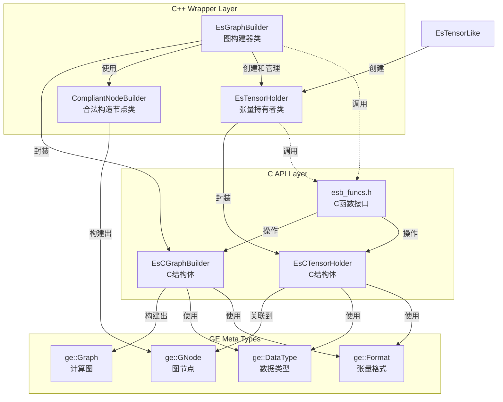

# Eager Style Graph Builder 类关系文档

## 概述
Eager Style Graph Builder 是 GraphEngine 中用于构建计算图的函数式接口模块，提供了便捷的图构建功能。该模块对外头文件位于 `inc/external/ge/eager_style_graph_builder/` 目录下。

## 目录结构

```
inc/external/ge/eager_style_graph_builder/
├── c/
│   └── esb_funcs.h          # C语言接口函数声明
└── cpp/
    ├── compliant_node_builder.h    # 合规节点构建器类定义
    ├── es_graph_builder.h          # 图构建器类定义
    ├── es_tensor_holder.h          # 张量持有者类定义
    ├── es_tensor_like.h            # 类Tensor类型定义
    ├── es_c_graph_builder.h        # C风格图构建器类定义
    └── es_c_tensor_holder.h        # C风格张量持有者类定义
```

## 核心类关系图



## 主要类详细说明

### 1. EsGraphBuilder 类

**文件位置**: `cpp/es_graph_builder.h`

**功能**: 图构建器类，用于构建和管理计算图

**主要方法**:
- `CreateInput()`  - 创建图输入节点
- `CreateInputs()` - 批量创建图默认格式的输入节点
- `CreateTensor()` - 按运行时 `DataType` 创建指定形状的张量
- `CreateVector()` - 创建向量常量
- `CreateScalar()` - 创建标量常量
- `CreateVariable()` - 创建变量
- `SetAttr()` - 设置图属性
- `SetOutput()` - 设置图输出
- `BuildAndReset()` - 构建计算图

**关系**:
- 封装了 `EsCGraphBuilder` C结构体
- 创建和管理 `EsTensorHolder` 对象
- 最终构建出 `ge::Graph` 对象

### 2. EsTensorHolder 类

**文件位置**: `cpp/es_tensor_holder.h`

**功能**: 张量持有者类，封装了张量的各种操作

**主要方法**:
- 算术运算: `operator+`, `operator-`, `operator*`, `operator/`
- 属性设置: `SetDataType()`, `SetFormat()`, `SetShape()`
- 属性管理: `SetAttr()`, `SetAttrForNode()`
- 访问器: `GetCTensorHolder()`, `GetProducer()`

**关系**:

- 封装了 `EsCTensorHolder` C结构体
- 与 `ge::GNode` 关联（通过 `GetProducer()`）
- 支持链式调用模式

### 3. EsTensorLike 类

**文件位置**: `cpp/es_tensor_like.h`

**功能**: 类Tensor类型定义，用于将EsTensorHolder、标量和向量转为EsTensorHolder对象

**主要方法**:
- `ToTensorHolder()`   - 转为EsTensorHolder对象
- `GetOwnerBuilder()`  - 获取对应Tensor的owner builder
- 
### 4. CompliantNodeBuilder 类
**文件位置**: `cpp/compoliant_node_builder.h`

**功能**: 合规节点构建器类，用于构建符合IR规范的图节点

**主要方法**:
- `OpType()` - 设置操作符类型
- `IrDefInputs()` - 定义IR输入规范
- `IrDefOutputs()` - 定义IR输出规范
- `IrDefAttrs()` - 定义IR属性规范
- `Name()` - 设置节点名称
- `InstanceDynamicInputNum()` - 设置动态输入实例数量
- `InstanceDynamicOutputNum()` - 设置动态输出实例数量
- `InstanceOutputDataType()` - 设置输出数据类型
- `InstanceOutputShape()` - 设置输出形状
- `InstanceOutputOriginShape()` - 设置输出原始形状
- `InstanceOutputStorageShape()` - 设置输出存储形状
- `InstanceOutputFormat()` - 设置输出格式
- `InstanceOutputOriginFormat()` - 设置输出原始格式
- `InstanceOutputStorageFormat()` - 设置输出存储格式
- `Build()` - 构建并返回图节点
- 
### 5. C API 函数

**文件位置**: `c/esb_funcs.h`

**功能**: 提供底层的C语言接口

**主要函数类别**:
- 图构建器管理: `EsCreateGraphBuilder()`, `EsDestroyGraphBuilder()`
- 输入创建: `EsCreateGraphInput()`, `EsCreateGraphInputWithDetails()`
- 常量创建: `EsCreateScalar*()`, `EsCreateVector*()`, `EsCreateConst*()`
- 属性设置: `EsSet*AttrForGraph()`, `EsSet*AttrForTensor()`, `EsSet*AttrForNode()`
- 输出设置：`EsSetGraphOutput()`
- 图构建:  `EsBuildGraphAndReset()`, 

### 使用示例
```c++
namespace ge {
namespace es {
std::unique_ptr<ge::Graph> MakeReluAddGraphByEs() {
  auto graph_builder = std::make_unique<EsGraphBuilder>("MakeReluAddGraph");
  auto input = graph_builder->CreateInput(0, "input", ge::DT_FLOAT, ge::FORMAT_ND, {2, 3});
  auto relu2 = Relu(Relu(input));
  (void) graph_builder->SetOutput(Add(input, relu2), 0);
  auto graph = graph_builder->BuildAndReset();
  return graph;
}
}
}
```
