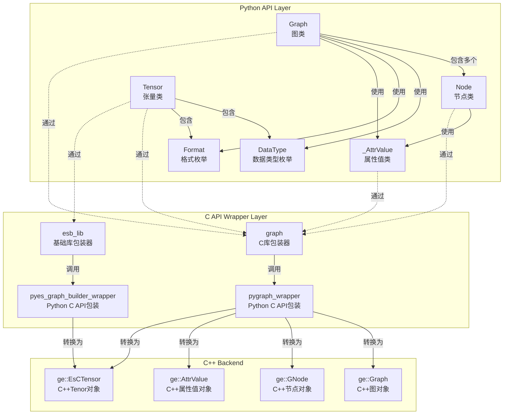

# GE-PY Python 模块类关系文档

## 概述

GE-PY 是 GraphEngine 的 Python 接口模块，提供了 Pythonic 的图相关接口。为用户提供了便捷的图构建和操作，编译执行等功能。该模块对外头文件位于 `api/python/ge/ge/` 目录下。

## 目录结构

### graph模块
```

├── __init__.py      # 模块初始化文件
├── graph.py         # Graph 类定义
├── node.py          # Node 类定义
├── types.py         # 数据类型定义
├── tensor.py        # Tensor 类定义
|── _attr.py         # 內部属性值类定义
└── _numeric.py      # 內部数值转换类定义
```
注：下划线开头的为 Python 风格下的对内模块

#### graph核心类关系图



#### 类详细说明

##### 1. Graph 类

**文件位置**: `graph.py`

**功能**: 图操作的主要接口类

**主要方法**:
- `__init__(name)` - 初始化图
- `get_all_nodes()` - 获取所有节点
- `get_direct_node()` - 获取直接连接节点
- `get_node_by_name(name)` - 根据名称获取节点
- `get_attr(key)` - 获取图属性
- `set_attr(key, value)` - 设置图属性
- `remove_node(node)` - 移除节点
- `remove_edge(src_node, src_port_index, dst_node, dst_port_index)` - 移除边
- `add_data_edge(src_node, src_port_index, dst_node, dst_port_index)` - 添加数据边
- `add_control_edge(src_node, dst_node)` - 添加控制边
- `save_to_air(file_path)` - 将图保存成AIR文件
- `load_from_air(file_path)` - 从AIR文件加载图

**属性**:
- `_handle` - 底层C图对象的句柄
- `_owns_handle` - 是否拥有句柄的所有权
- `_owner` - 句柄所有者
- `_name` - 图名称

**关系**:
- 通过 `graph_lib` 调用底层C API
- 管理多个 `Node` 对象

##### 2. Node 类

**文件位置**: `node.py`

**功能**: 图节点操作接口类

**主要方法**:
- `get_attr(key)` - 获取节点属性
- `set_attr(key, value)` - 设置节点属性
- `get_in_data_nodes_and_port_indexes(in_index)` - 获取输入节点和端口
- `get_out_data_nodes_and_port_indexes(out_index)` - 获取输出节点和端口
- `get_inputs_size()` - 获取输入数量
- `get_outputs_size()` - 获取输出数量
- `has_attr(key)` - 是否含有节点属性

**属性**：

- `_handle` - 底层C节点对象的句柄
- `_owns_handle` - 是否拥有句柄的所有权
- `name` - 节点名称（只读属性）
- `type` - 节点类型（只读属性）

**关系**:
- 通过 `graph_lib` 调用底层C API
- 与 `Graph` 对象关联

##### 3. DataType 枚举

**文件位置**: `types.py`

**功能**: 定义支持的数据类型

**关系**:
- 与 C++ 中的 `ge::DataType` 对应
- 在 `Graph` 和 `Node` 操作中使用

##### 4. Format 枚举

**文件位置**: `types.py`

**功能**: 定义张量格式

**关系**:
- 与 C++ 中的 `ge::Format` 对应
- 用于张量形状和格式描述


#### 依赖关系

- **内部依赖**:
  - Graph库
  - `ge._capi.pygraph_wrapper` - C API包装器

- **外部依赖**:
  - ctypes库

##### 5. Tensor 类

**文件位置**: `tensor.py`

**功能**: 张量数据类

**主要方法**:
- `set_format(format)` - 设置格式
- `get_format()` - 获取格式
- `set_data_type(data_type)` - 设置数据类型
- `get_data_type()` - 获取数据类型

**属性**：
- `_handle` - 底层C节点对象的句柄
- `_owns_handle` - 是否拥有句柄的所有权
- `_owner` - 句柄所有者
**关系**:
- 通过 `graph_lib` 和 `esb_lib` 调用底层C API
- 与 `Session` 对象关联

### ge_global模块
#### 目录结构
```

├── __init__.py           # 模块初始化文件
└── geapi.py              # GeApi接口文件
```
#### 类详细说明
##### 1. Geapi 类
**文件位置**: `geapi.py`

**功能**：提供 GE 初始化和析构

**主要方法**:
- `ge_initialize(config)` - GE初始化
- `ge_finalize()` - GE析构

  **关系**:
- 通过 `geapi_lib` 调用底层C API

**使用示例**:
```python
from ge.ge_global import GeApi

ge_api = GeApi()
# 调用GE初始化函数
config = {"ge.exec.deviceId":"2", "ge.graphRunMode":"0"}
ge_api.ge_initialize(config)
# 调用GE资源释放函数
ge_api.ge_finalize()
```

### Session模块

#### 目录结构
```

├── __init__.py           # 模块初始化文件
└── session.py            # session接口文件
```
#### 类详细说明
##### 1. Session 类

**文件位置**: `session.py`

**功能**: 张量数据类

**主要方法**:
- `__init__()` - 初始化session
- `add_graph(graph_id, add_graph, options)` - 添加图
- `run_graph(graph_id, inputs)` - 运行图

**属性**：
- `_handle` - 底层C节点对象的句柄
- `_owns_handle` - 是否拥有句柄的所有权

  **关系**:
- 通过 `session_lib` 调用底层C API
  **使用示例**:
```python
from ge.session import Session
from ge.ge_global import GeApi
from ge.graph import Graph
from ge.graph import Tensor
from ge.graph.types import DataType, Format

# 调用GE初始化函数
config = {"ge.exec.deviceId":"2", "ge.graphRunMode":"0"}
GeApi.ge_initialize(config)
# 创建session
session = Session();
# 创建Graph
graph = Graph("test_graph")
# 设置Graph_id
graph_id = 0;
# 添加Graph
session.add_graph(graph_id,graph)
# 创建input_tensor_list
tensor = Tensor([1, 2, 3, 4, 5], None, [1,2,3], DataType.DT_INT8, Format.FORMAT_ND)
input_tensor_list = []
input_tensor_list.append(tensor)
# 运行graph
output_tensor_list = session.run_graph(graph_id,input_tensor_list)
# 调用GE资源释放函数
GeApi.ge_finalize()
```


## ES 模块

ES (Eager-Style) 模块提供了函数式风格的图构建接口，详细文档请参考：[ES-PY Python 模块文档](../../es/api/es_python.md)

## 使用示例

参考 [使用es的python api构图sample](../../../../examples/es/transformer/python/src/make_transformer_graph.py)

更多示例请参考 [examples/es](../../../../examples/es) 目录下的 Python 用例。

