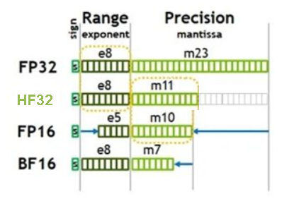

# aclCompileOpt<a name="ZH-CN_TOPIC_0000001312481497"></a>

```
typedef enum {
    ACL_PRECISION_MODE,           // 网络模型的算子精度模式
    ACL_AICORE_NUM,               // 模型编译时使用的AI Core数量
    ACL_AUTO_TUNE_MODE,           // 算子的自动调优模式
    ACL_OP_SELECT_IMPL_MODE,      // 选择算子是高精度实现还是高性能实现
    ACL_OPTYPELIST_FOR_IMPLMODE,  // 列举算子类型的列表，该列表中的算子使用ACL_OP_SELECT_IMPL_MODE指定的模式
    ACL_OP_DEBUG_LEVEL,           // TBE算子编译debug功能开关
    ACL_DEBUG_DIR,                // 保存模型转换、网络迁移过程中算子编译生成的调试相关过程文件的路径，包括算子.o/.json/.cce等文件。
    ACL_OP_COMPILER_CACHE_MODE,   // 算子编译磁盘缓存模式
    ACL_OP_COMPILER_CACHE_DIR,    // 算子编译磁盘缓存的目录
    ACL_OP_PERFORMANCE_MODE,      // 通过该选项设置是否按照算子执行高性能的方式编译算子
    ACL_OP_JIT_COMPILE,           // 选择是在线编译算子，还是使用已编译的算子二进制文件
    ACL_OP_DETERMINISTIC,         // 是否开启确定性计算
    ACL_CUSTOMIZE_DTYPES,         // 模型编译时自定义某个或某些算子的计算精度
    ACL_OP_PRECISION_MODE,        // 指定算子内部处理时的精度模式，支持指定一个算子或多个算子。
    ACL_ALLOW_HF32,               // hf32是昇腾AI处理器推出的专门用于算子内部计算的精度类型，当前版本不支持
    ACL_PRECISION_MODE_V2,        // 网络模型的算子精度模式，相比ACL_PRECISION_MODE选项，ACL_PRECISION_MODE_V2是新版本中新增的，精度模式更多，同时原有精度模式选项值语义更清晰，便于理解
    ACL_OP_DEBUG_OPTION           // 当前仅支持配置为oom，表示开启Global Memory访问越界检测
} aclCompileOpt;
```

**表 1**  编译选项配置

<a name="table154428882117"></a>
<table><thead align="left"><tr id="row15442178172115"><th class="cellrowborder" valign="top" width="31.580000000000002%" id="mcps1.2.3.1.1"><p id="p10442188112114"><a name="p10442188112114"></a><a name="p10442188112114"></a>编译选项</p>
</th>
<th class="cellrowborder" valign="top" width="68.42%" id="mcps1.2.3.1.2"><p id="p84426814219"><a name="p84426814219"></a><a name="p84426814219"></a>取值说明</p>
</th>
</tr>
</thead>
<tbody><tr id="row134425813216"><td class="cellrowborder" valign="top" width="31.580000000000002%" headers="mcps1.2.3.1.1 "><p id="p94424892111"><a name="p94424892111"></a><a name="p94424892111"></a>ACL_PRECISION_MODE</p>
</td>
<td class="cellrowborder" valign="top" width="68.42%" headers="mcps1.2.3.1.2 "><p id="p14562142314383"><a name="p14562142314383"></a><a name="p14562142314383"></a>用于配置网络模型的算子精度模式。如果不配置该编译选项，默认采用allow_fp32_to_fp16。</p>
<a name="ul3723165419223"></a><a name="ul3723165419223"></a><ul id="ul3723165419223"><li><strong id="zh-cn_topic_0000001312392865_b713235024011"><a name="zh-cn_topic_0000001312392865_b713235024011"></a><a name="zh-cn_topic_0000001312392865_b713235024011"></a>force_fp32/cube_fp16in_fp32out：</strong><div class="p" id="zh-cn_topic_0000001312392865_p8537814448"><a name="zh-cn_topic_0000001312392865_p8537814448"></a><a name="zh-cn_topic_0000001312392865_p8537814448"></a>配置为force_fp32或cube_fp16in_fp32out，效果等同，该选项用来表示AI Core中该算子既支持float32又支持float16数据类型时，系统内部都会根据算子类型不同，选择不同的处理方式。cube_fp16in_fp32out为新版本中新增的，对于矩阵计算类算子，该选项语义更清晰。<a name="zh-cn_topic_0000001312392865_ul169010276308"></a><a name="zh-cn_topic_0000001312392865_ul169010276308"></a><ul id="zh-cn_topic_0000001312392865_ul169010276308"><li>对于矩阵计算类算子，系统内部会按算子实现的支持情况处理：<a name="zh-cn_topic_0000001312392865_ol6196318114911"></a><a name="zh-cn_topic_0000001312392865_ol6196318114911"></a><ol id="zh-cn_topic_0000001312392865_ol6196318114911"><li>优先选择输入数据类型为float16且输出数据类型为float32；</li><li>如果1中的场景不支持，则选择输入数据类型为float32且输出数据类型为float32；</li><li>如果2中的场景不支持，则选择输入数据类型为float16且输出数据类型为float16；</li><li>如果3中的场景不支持，则报错。</li></ol>
</li><li>对于矢量计算类算子，表示原图中算子精度为float16或bfloat16，强制选择float32。<p id="zh-cn_topic_0000001312392865_p2355122020261"><a name="zh-cn_topic_0000001312392865_p2355122020261"></a><a name="zh-cn_topic_0000001312392865_p2355122020261"></a>如果原图中存在部分算子，在AI Core中该算子的实现不支持float32，比如某算子仅支持float16类型，则该参数不生效，仍然使用支持的float16；如果在AI Core中该算子的实现不支持float32，且又配置了黑名单（precision_reduce = false），则会使用float32的AI CPU算子；如果AI CPU算子也不支持，则执行报错。</p>
</li></ul>
</div>
</li><li><strong id="zh-cn_topic_0000001312392865_b5998125544012"><a name="zh-cn_topic_0000001312392865_b5998125544012"></a><a name="zh-cn_topic_0000001312392865_b5998125544012"></a>force_fp16（默认值）：</strong><p id="zh-cn_topic_0000001312392865_p59818442401"><a name="zh-cn_topic_0000001312392865_p59818442401"></a><a name="zh-cn_topic_0000001312392865_p59818442401"></a>表示原图中算子精度为float16、bfloat16和float32时，强制选择float16。</p>
</li><li><strong id="zh-cn_topic_0000001312392865_b8330648174120"><a name="zh-cn_topic_0000001312392865_b8330648174120"></a><a name="zh-cn_topic_0000001312392865_b8330648174120"></a>allow_fp32_to_fp16：</strong><a name="zh-cn_topic_0000001312392865_ul777312334113"></a><a name="zh-cn_topic_0000001312392865_ul777312334113"></a><ul id="zh-cn_topic_0000001312392865_ul777312334113"><li>对于矩阵类算子：<a name="zh-cn_topic_0000001312392865_ul6761514144114"></a><a name="zh-cn_topic_0000001312392865_ul6761514144114"></a><ul id="zh-cn_topic_0000001312392865_ul6761514144114"><li>如果原图中算子精度为float32，优先降低精度到float16，如果AI Core中算子不支持float16，则继续选择float32，如果AI Core中算子不支持float32，则使用AI CPU算子进行计算；如果AI CPU算子也不支持，则执行报错。</li><li>如果原图中算子精度为bfloat16，则优先使用原图精度bfloat16，如果AI Core中算子不支持bfloat16，则选择float32，如果AI Core中算子不支持float32，则直接降低精度到float16；如果AI Core中算子不支持float16，则使用AI CPU算子进行计算；如果AI CPU算子也不支持，则执行报错。</li></ul>
</li><li>对于矢量类算子，优先保持原图精度：<a name="zh-cn_topic_0000001312392865_ul464241443812"></a><a name="zh-cn_topic_0000001312392865_ul464241443812"></a><ul id="zh-cn_topic_0000001312392865_ul464241443812"><li>如果原图中算子精度为float32，则优先使用原图精度float32，如果AI Core中算子不支持float32，则直接降低精度到float16；如果AI Core中算子不支持float16，则使用AI CPU算子进行计算；如果AI CPU算子也不支持，则执行报错。</li><li>如果原图中算子精度为bfloat16，则优先使用原图精度bfloat16，如果AI Core中算子不支持bfloat16，则选择float32，如果AI Core中算子不支持float32，则直接降低精度到float16；如果AI Core中算子不支持float16，则使用AI CPU算子进行计算；如果AI CPU算子也不支持，则执行报错。</li></ul>
</li></ul>
</li><li><strong id="zh-cn_topic_0000001312392865_b5252156154212"><a name="zh-cn_topic_0000001312392865_b5252156154212"></a><a name="zh-cn_topic_0000001312392865_b5252156154212"></a>must_keep_origin_dtype：</strong><p id="zh-cn_topic_0000001312392865_p20280144555815"><a name="zh-cn_topic_0000001312392865_p20280144555815"></a><a name="zh-cn_topic_0000001312392865_p20280144555815"></a>保持原图精度。</p>
<a name="zh-cn_topic_0000001312392865_ul1619894955814"></a><a name="zh-cn_topic_0000001312392865_ul1619894955814"></a><ul id="zh-cn_topic_0000001312392865_ul1619894955814"><li>如果原图中某算子精度为float16，AI Core中该算子的实现不支持float16、仅支持float32和bfloat16，则系统内部会自动采用高精度float32。</li><li>如果原图中某算子精度为float16，AI Core中该算子的实现不支持float16、仅支持bfloat16，则会使用float16的AI CPU算子；如果AI CPU算子也不支持，则执行报错。</li><li>如果原图中某算子精度为float32，AI Core中该算子的实现不支持float32类型、仅支持float16类型，则会使用float32的AI CPU算子；如果AI CPU算子也不支持，则执行报错。</li></ul>
</li><li><strong id="zh-cn_topic_0000001312392865_b14329055205212"><a name="zh-cn_topic_0000001312392865_b14329055205212"></a><a name="zh-cn_topic_0000001312392865_b14329055205212"></a>allow_mix_precision/allow_mix_precision_fp16</strong>：<p id="zh-cn_topic_0000001312392865_p13288949175211"><a name="zh-cn_topic_0000001312392865_p13288949175211"></a><a name="zh-cn_topic_0000001312392865_p13288949175211"></a>配置为allow_mix_precision或allow_mix_precision_fp16，效果等同，均表示使用混合精度float16、bfloat16和float32数据类型来处理神经网络的过程。allow_mix_precision_fp16为新版本中新增的，语义更清晰，便于理解。</p>
<p id="zh-cn_topic_0000001312392865_p152814174917"><a name="zh-cn_topic_0000001312392865_p152814174917"></a><a name="zh-cn_topic_0000001312392865_p152814174917"></a>针对原始模型中float32和bfloat16数据类型的算子，按照内置的优化策略，自动将部分float32和bfloat16的算子降低精度到float16，从而在精度损失很小的情况下提升系统性能并减少内存使用。</p>
<p id="zh-cn_topic_0000001312392865_p3445181144615"><a name="zh-cn_topic_0000001312392865_p3445181144615"></a><a name="zh-cn_topic_0000001312392865_p3445181144615"></a>若配置了该种模式，则可以在<span id="zh-cn_topic_0000001312392865_ph10562197165916"><a name="zh-cn_topic_0000001312392865_ph10562197165916"></a><a name="zh-cn_topic_0000001312392865_ph10562197165916"></a>${INSTALL_DIR}</span>/opp/built-in/op_impl/ai_core/tbe/config/<em id="zh-cn_topic_0000001312392865_i23791626927"><a name="zh-cn_topic_0000001312392865_i23791626927"></a><a name="zh-cn_topic_0000001312392865_i23791626927"></a>xxx</em>/aic-<em id="zh-cn_topic_0000001312392865_i163391631724"><a name="zh-cn_topic_0000001312392865_i163391631724"></a><a name="zh-cn_topic_0000001312392865_i163391631724"></a>xxx</em>-ops-info.json内置优化策略文件中查看<span class="parmname" id="zh-cn_topic_0000001312392865_parmname544591134619"><a name="zh-cn_topic_0000001312392865_parmname544591134619"></a><a name="zh-cn_topic_0000001312392865_parmname544591134619"></a>“precision_reduce”</span>参数的取值：</p>
<a name="zh-cn_topic_0000001312392865_ul6368123316466"></a><a name="zh-cn_topic_0000001312392865_ul6368123316466"></a><ul id="zh-cn_topic_0000001312392865_ul6368123316466"><li>若取值为true（白名单），则表示允许将当前float32和bfloat16类型的算子，降低精度到float16。</li><li>若取值为false（黑名单），则不允许将当前float32和bfloat16类型的算子降低精度到float16，相应算子仍旧使用float32或bfloat16精度。</li><li>若网络模型中算子没有配置该参数（灰名单），当前算子的混合精度处理机制和前一个算子保持一致，即如果前一个算子支持降精度处理，当前算子也支持降精度；如果前一个算子不允许降精度，当前算子也不支持降精度。</li></ul>
</li><li><strong id="zh-cn_topic_0000001312392865_b1133818511228"><a name="zh-cn_topic_0000001312392865_b1133818511228"></a><a name="zh-cn_topic_0000001312392865_b1133818511228"></a>allow_mix_precision_bf16：</strong><p id="zh-cn_topic_0000001312392865_p645755825314"><a name="zh-cn_topic_0000001312392865_p645755825314"></a><a name="zh-cn_topic_0000001312392865_p645755825314"></a>表示使用混合精度bfloat16和float32数据类型来处理神经网络的过程。针对原始模型中float32数据类型的算子，按照内置的优化策略，自动将部分float32的算子降低精度到bfloat16，从而在精度损失很小的情况下提升系统性能并减少内存使用；如果AI Core中算子不支持bfloat16和float32，则使用AI CPU算子进行计算；如果AI CPU算子也不支持，则执行报错。</p>
<p id="zh-cn_topic_0000001312392865_p7213919209"><a name="zh-cn_topic_0000001312392865_p7213919209"></a><a name="zh-cn_topic_0000001312392865_p7213919209"></a>若配置了该种模式，则可以在<span id="zh-cn_topic_0000001312392865_ph221381915016"><a name="zh-cn_topic_0000001312392865_ph221381915016"></a><a name="zh-cn_topic_0000001312392865_ph221381915016"></a>${INSTALL_DIR}</span>/opp/built-in/op_impl/ai_core/tbe/config/<em id="zh-cn_topic_0000001312392865_i1843218381128"><a name="zh-cn_topic_0000001312392865_i1843218381128"></a><a name="zh-cn_topic_0000001312392865_i1843218381128"></a>xxx</em>/aic-<em id="zh-cn_topic_0000001312392865_i1674910411524"><a name="zh-cn_topic_0000001312392865_i1674910411524"></a><a name="zh-cn_topic_0000001312392865_i1674910411524"></a>xxx</em>-ops-info.json内置优化策略文件中查看<span class="parmname" id="zh-cn_topic_0000001312392865_parmname6213141915012"><a name="zh-cn_topic_0000001312392865_parmname6213141915012"></a><a name="zh-cn_topic_0000001312392865_parmname6213141915012"></a>“precision_reduce”</span>参数的取值：</p>
<a name="zh-cn_topic_0000001312392865_ul62133191409"></a><a name="zh-cn_topic_0000001312392865_ul62133191409"></a><ul id="zh-cn_topic_0000001312392865_ul62133191409"><li>若取值为true（白名单），则表示允许将当前float32类型的算子，降低精度到<span>bfloat16</span>。</li><li>若取值为false（黑名单），则不允许将当前float32类型的算子降低精度到<span>bfloat16</span>，相应算子仍旧使用float32精度。</li><li>若网络模型中算子没有配置该参数（灰名单），当前算子的混合精度处理机制和前一个算子保持一致，即如果前一个算子支持降精度处理，当前算子也支持降精度；如果前一个算子不允许降精度，当前算子也不支持降精度。</li></ul>
</li><li><strong id="zh-cn_topic_0000001312392865_b1845717283465"><a name="zh-cn_topic_0000001312392865_b1845717283465"></a><a name="zh-cn_topic_0000001312392865_b1845717283465"></a>allow_fp32_to_bf16：</strong><a name="zh-cn_topic_0000001312392865_ul139030935"></a><a name="zh-cn_topic_0000001312392865_ul139030935"></a><ul id="zh-cn_topic_0000001312392865_ul139030935"><li>如果原图中算子精度为float32，则优先使用原图精度float32，如果AI Core中算子不支持float32，则降低精度到bfloat16；如果AI Core中算子不支持bfloat16，则使用AI CPU算子进行计算；如果AI CPU算子也不支持，则执行报错。</li><li>如果原图中算子精度为bfloat16，则优先使用原图精度bfloat16，如果AI Core中算子不支持bfloat16，则选择float32，如果AI Core中算子不支持float32，则使用AI CPU算子进行计算；如果AI CPU算子也不支持，则执行报错。</li></ul>
</li></ul>
</td>
</tr>
<tr id="row444313892114"><td class="cellrowborder" valign="top" width="31.580000000000002%" headers="mcps1.2.3.1.1 "><p id="p17443781218"><a name="p17443781218"></a><a name="p17443781218"></a>ACL_AICORE_NUM</p>
</td>
<td class="cellrowborder" valign="top" width="68.42%" headers="mcps1.2.3.1.2 "><p id="p47506338115"><a name="p47506338115"></a><a name="p47506338115"></a>用于配置模型编译时使用的AI Core数量。</p>
<p id="p339518362386"><a name="p339518362386"></a><a name="p339518362386"></a><span id="ph62432051182011"><a name="ph62432051182011"></a><a name="ph62432051182011"></a>当前版本设置无效。</span></p>
</td>
</tr>
<tr id="row1144315862113"><td class="cellrowborder" valign="top" width="31.580000000000002%" headers="mcps1.2.3.1.1 "><p id="p16443184214"><a name="p16443184214"></a><a name="p16443184214"></a>ACL_AUTO_TUNE_MODE</p>
</td>
<td class="cellrowborder" valign="top" width="68.42%" headers="mcps1.2.3.1.2 "><p id="p6617401224"><a name="p6617401224"></a><a name="p6617401224"></a><strong id="b1182519131237"><a name="b1182519131237"></a><a name="b1182519131237"></a>该参数后续废弃，请勿配置，否则后续版本可能存在兼容性问题。</strong>若涉及调优，请参见<span id="ph0276027114213"><a name="ph0276027114213"></a><a name="ph0276027114213"></a>《AOE调优工具用户指南》</span>。</p>
<p id="p159941450143810"><a name="p159941450143810"></a><a name="p159941450143810"></a>用于配置算子的自动调优模式。</p>
</td>
</tr>
<tr id="row6443168192118"><td class="cellrowborder" valign="top" width="31.580000000000002%" headers="mcps1.2.3.1.1 "><p id="p24430852113"><a name="p24430852113"></a><a name="p24430852113"></a>ACL_OP_SELECT_IMPL_MODE</p>
</td>
<td class="cellrowborder" valign="top" width="68.42%" headers="mcps1.2.3.1.2 "><p id="p51088213398"><a name="p51088213398"></a><a name="p51088213398"></a>用于选择算子是高精度实现还是高性能实现。如果不配置该编译选项，默认采用high_precision。</p>
<a name="ul204001804339"></a><a name="ul204001804339"></a><ul id="ul204001804339"><li><strong id="zh-cn_topic_0000001312473901_b1752173519487"><a name="zh-cn_topic_0000001312473901_b1752173519487"></a><a name="zh-cn_topic_0000001312473901_b1752173519487"></a>high_precision</strong>：表示算子采用高精度实现模式。<p id="zh-cn_topic_0000001312473901_p79886343518"><a name="zh-cn_topic_0000001312473901_p79886343518"></a><a name="zh-cn_topic_0000001312473901_p79886343518"></a>该选项采用系统内置的配置文件设置算子实现模式，内置配置文件路径为<span id="zh-cn_topic_0000001312473901_ph10562197165916"><a name="zh-cn_topic_0000001312473901_ph10562197165916"></a><a name="zh-cn_topic_0000001312473901_ph10562197165916"></a>${INSTALL_DIR}</span>/opp/built-in/op_impl/ai_core/tbe/impl_mode/high_precision.ini。</p>
<p id="zh-cn_topic_0000001312473901_p1382733134116"><a name="zh-cn_topic_0000001312473901_p1382733134116"></a><a name="zh-cn_topic_0000001312473901_p1382733134116"></a>为保持兼容，该参数仅对high_precision.ini文件中算子列表生效，通过该列表可以控制算子生效的范围并保证之前版本的网络模型不受影响。</p>
</li><li><strong id="zh-cn_topic_0000001312473901_b19880362488"><a name="zh-cn_topic_0000001312473901_b19880362488"></a><a name="zh-cn_topic_0000001312473901_b19880362488"></a>high_performance</strong>：（默认值）表示算子采用高性能实现模式。<p id="zh-cn_topic_0000001312473901_p521419617314"><a name="zh-cn_topic_0000001312473901_p521419617314"></a><a name="zh-cn_topic_0000001312473901_p521419617314"></a>该选项采用系统内置的配置文件设置算子实现模式，内置配置文件路径为<span id="zh-cn_topic_0000001312473901_ph115493481412"><a name="zh-cn_topic_0000001312473901_ph115493481412"></a><a name="zh-cn_topic_0000001312473901_ph115493481412"></a>${INSTALL_DIR}</span>/opp/built-in/op_impl/ai_core/tbe/impl_mode/high_performance.ini。</p>
<p id="zh-cn_topic_0000001312473901_p56341418558"><a name="zh-cn_topic_0000001312473901_p56341418558"></a><a name="zh-cn_topic_0000001312473901_p56341418558"></a>为保持兼容，该参数仅对high_performance.ini文件中算子列表生效，通过该列表可以控制算子生效的范围并保证之前版本的网络模型不受影响。</p>
</li><li><strong id="zh-cn_topic_0000001312473901_b11324153824812"><a name="zh-cn_topic_0000001312473901_b11324153824812"></a><a name="zh-cn_topic_0000001312473901_b11324153824812"></a>high_precision_for_all</strong>：表示算子采用高精度实现模式。<p id="zh-cn_topic_0000001312473901_p125151221414"><a name="zh-cn_topic_0000001312473901_p125151221414"></a><a name="zh-cn_topic_0000001312473901_p125151221414"></a>该选项采用系统内置的配置文件设置算子实现模式，内置配置文件路径为<span id="zh-cn_topic_0000001312473901_ph5364411414"><a name="zh-cn_topic_0000001312473901_ph5364411414"></a><a name="zh-cn_topic_0000001312473901_ph5364411414"></a>${INSTALL_DIR}</span>/opp/built-in/op_impl/ai_core/tbe/impl_mode/high_precision_for_all.ini，该文件中列表后续可能会跟随版本更新。</p>
<p id="zh-cn_topic_0000001312473901_p19278864222"><a name="zh-cn_topic_0000001312473901_p19278864222"></a><a name="zh-cn_topic_0000001312473901_p19278864222"></a><strong id="zh-cn_topic_0000001312473901_b097321901812"><a name="zh-cn_topic_0000001312473901_b097321901812"></a><a name="zh-cn_topic_0000001312473901_b097321901812"></a>该实现模式不保证兼容</strong>，如果后续新的软件包中有算子新增了实现模式（即配置文件中新增了某个算子的实现模式），之前版本使用high_precision_for_all的网络模型，在新版本上性能可能会下降。</p>
</li></ul>
</td>
</tr>
<tr id="row74431810213"><td class="cellrowborder" valign="top" width="31.580000000000002%" headers="mcps1.2.3.1.1 "><p id="p11443282219"><a name="p11443282219"></a><a name="p11443282219"></a>ACL_OPTYPELIST_FOR_IMPLMODE</p>
</td>
<td class="cellrowborder" valign="top" width="68.42%" headers="mcps1.2.3.1.2 "><p id="p6560144517506"><a name="p6560144517506"></a><a name="p6560144517506"></a>通过ACL_OPTYPELIST_FOR_IMPLMODE选项设置算子类型的列表（多个算子使用英文逗号进行分隔），与ACL_OP_SELECT_IMPL_MODE选项配合使用，设置列表中的算子通过高精度实现或高性能实现。</p>
</td>
</tr>
<tr id="row6443882211"><td class="cellrowborder" valign="top" width="31.580000000000002%" headers="mcps1.2.3.1.1 "><p id="p20443583219"><a name="p20443583219"></a><a name="p20443583219"></a>ACL_OP_DEBUG_LEVEL</p>
</td>
<td class="cellrowborder" valign="top" width="68.42%" headers="mcps1.2.3.1.2 "><p id="p0615104419402"><a name="p0615104419402"></a><a name="p0615104419402"></a>用于配置TBE算子编译debug功能开关。</p>
<p id="p16470141185517"><a name="p16470141185517"></a><a name="p16470141185517"></a><strong id="b36351686569"><a name="b36351686569"></a><a name="b36351686569"></a>取值说明如下：</strong></p>
<a name="ul1224946103420"></a><a name="ul1224946103420"></a><ul id="ul1224946103420"><li>0：（默认值）不开启算子debug功能，在当前执行路径<strong id="zh-cn_topic_0000001312713993_b15461845195817"><a name="zh-cn_topic_0000001312713993_b15461845195817"></a><a name="zh-cn_topic_0000001312713993_b15461845195817"></a>不生成</strong>算子编译目录kernel_meta。</li><li>1：开启算子debug功能，在当前执行路径生成kernel_meta文件夹，并在该文件夹下<strong id="zh-cn_topic_0000001312713993_b179782285171"><a name="zh-cn_topic_0000001312713993_b179782285171"></a><a name="zh-cn_topic_0000001312713993_b179782285171"></a>生成</strong>*.o（算子二进制文件）、*.json文件（算子描述文件）和TBE指令映射文件（算子cce文件*.cce和python-cce映射文件*_loc.json），用于后续分析AICore Error问题。</li><li>2：开启算子debug功能，在当前执行路径生成kernel_meta文件夹，并在该文件夹下<strong id="zh-cn_topic_0000001312713993_b10503172717172"><a name="zh-cn_topic_0000001312713993_b10503172717172"></a><a name="zh-cn_topic_0000001312713993_b10503172717172"></a>生成</strong>*.o（算子二进制文件）、*.json文件（算子描述文件）和TBE指令映射文件（算子cce文件*.cce和python-cce映射文件*_loc.json），用于后续分析AICore Error问题，同时设置为2，还会关闭编译优化开关、开启ccec调试功能（ccec编译器选项设置为-O0-g）。</li><li>3：不开启算子debug功能，在当前执行路径生成kernel_meta文件夹，并在该文件夹中<strong id="zh-cn_topic_0000001312713993_b13358926141716"><a name="zh-cn_topic_0000001312713993_b13358926141716"></a><a name="zh-cn_topic_0000001312713993_b13358926141716"></a>生成</strong>*.o（算子二进制文件）和*.json文件（算子描述文件），分析算子问题时可参考。</li><li>4：不开启算子debug功能，在当前执行路径生成kernel_meta文件夹，并在该文件夹下<strong id="zh-cn_topic_0000001312713993_b14819924101718"><a name="zh-cn_topic_0000001312713993_b14819924101718"></a><a name="zh-cn_topic_0000001312713993_b14819924101718"></a>生成</strong>*.o（算子二进制文件）、*.json文件（算子描述文件）、TBE指令映射文件（算子cce文件*.cce）和UB融合计算描述文件（{$kernel_name}_compute.json），可在分析算子问题时进行问题复现、精度比对时使用。</li></ul>
<p id="p1625136205519"><a name="p1625136205519"></a><a name="p1625136205519"></a><strong id="b1812261385619"><a name="b1812261385619"></a><a name="b1812261385619"></a>配置约束如下：</strong></p>
<a name="ul18243121635618"></a><a name="ul18243121635618"></a><ul id="ul18243121635618"><li>配置为2（即开启ccec编译选项）时，会导致算子Kernel（*.o文件）大小增大。动态Shape场景下，由于算子编译时会遍历可能的Shape场景，因此可能会导致算子Kernel文件过大而无法进行编译，此种场景下，建议不要配置ccec编译选项。<p id="zh-cn_topic_0000001312713993_p119132011557"><a name="zh-cn_topic_0000001312713993_p119132011557"></a><a name="zh-cn_topic_0000001312713993_p119132011557"></a>由于算子Kernel文件过大而无法编译的报错日志示例如下：</p>
<pre class="screen" id="zh-cn_topic_0000001312713993_screen1819162055520"><a name="zh-cn_topic_0000001312713993_screen1819162055520"></a><a name="zh-cn_topic_0000001312713993_screen1819162055520"></a>message:link error ld.lld: <strong id="zh-cn_topic_0000001312713993_b1819122017557"><a name="zh-cn_topic_0000001312713993_b1819122017557"></a><a name="zh-cn_topic_0000001312713993_b1819122017557"></a>error: InputSection too large for range extension thunk</strong> ./kernel_meta_xxxxx.o</pre>
</li><li>debug功能开关打开场景下，若模型中含有如下通算融合算子，算子编译目录kernel_meta中，不会生成下述算子的*.o、*.json、*.cce文件。<p id="zh-cn_topic_0000001312713993_p12719135919173"><a name="zh-cn_topic_0000001312713993_p12719135919173"></a><a name="zh-cn_topic_0000001312713993_p12719135919173"></a>MatMulAllReduce</p>
<p id="zh-cn_topic_0000001312713993_p1171917592173"><a name="zh-cn_topic_0000001312713993_p1171917592173"></a><a name="zh-cn_topic_0000001312713993_p1171917592173"></a>MatMulAllReduceAddRmsNorm</p>
<p id="zh-cn_topic_0000001312713993_p12719859161710"><a name="zh-cn_topic_0000001312713993_p12719859161710"></a><a name="zh-cn_topic_0000001312713993_p12719859161710"></a>AllGatherMatMul</p>
<p id="zh-cn_topic_0000001312713993_p57191059121714"><a name="zh-cn_topic_0000001312713993_p57191059121714"></a><a name="zh-cn_topic_0000001312713993_p57191059121714"></a>MatMulReduceScatter</p>
<p id="zh-cn_topic_0000001312713993_p871905911713"><a name="zh-cn_topic_0000001312713993_p871905911713"></a><a name="zh-cn_topic_0000001312713993_p871905911713"></a>AlltoAllAllGatherBatchMatMul</p>
<p id="zh-cn_topic_0000001312713993_p4719459131718"><a name="zh-cn_topic_0000001312713993_p4719459131718"></a><a name="zh-cn_topic_0000001312713993_p4719459131718"></a>BatchMatMulReduceScatterAlltoAll</p>
</li></ul>
</td>
</tr>
<tr id="row84434816215"><td class="cellrowborder" valign="top" width="31.580000000000002%" headers="mcps1.2.3.1.1 "><p id="p174431882119"><a name="p174431882119"></a><a name="p174431882119"></a>ACL_DEBUG_DIR</p>
</td>
<td class="cellrowborder" valign="top" width="68.42%" headers="mcps1.2.3.1.2 "><p id="p8443682217"><a name="p8443682217"></a><a name="p8443682217"></a>用于配置保存模型转换、网络迁移过程中算子编译生成的调试相关过程文件的路径（默认路径：执行应用的当前路径/kernel_meta），包括算子.o/.json/.cce等文件。具体生成哪些文件以ACL_OP_DEBUG_LEVEL选项设置的取值为准。</p>
<p id="p1284171512363"><a name="p1284171512363"></a><a name="p1284171512363"></a>路径支持大小写字母（a-z，A-Z）、数字（0-9）、下划线（_）、中划线（-）、句点（.）、中文字符。</p>
<p id="p126431084362"><a name="p126431084362"></a><a name="p126431084362"></a>关于配置算子编译文件的缓存目录，除此处设置枚举值的方式，还可以配置环境变量ASCEND_WORK_PATH，几种方式的优先级为：本节设置枚举值的方式 &gt; 设置环境变量 &gt; 默认路径。环境变量的详细配置说明请参见<span id="ph18643168133614"><a name="ph18643168133614"></a><a name="ph18643168133614"></a>《环境变量参考》</span>。</p>
</td>
</tr>
<tr id="row18255111316223"><td class="cellrowborder" valign="top" width="31.580000000000002%" headers="mcps1.2.3.1.1 "><p id="p5256161312215"><a name="p5256161312215"></a><a name="p5256161312215"></a>ACL_OP_COMPILER_CACHE_MODE</p>
</td>
<td class="cellrowborder" valign="top" width="68.42%" headers="mcps1.2.3.1.2 "><p id="p89362574110"><a name="p89362574110"></a><a name="p89362574110"></a>用于配置算子编译磁盘缓存模式。该编译选项需要与ACL_OP_COMPILER_CACHE_DIR配合使用。</p>
<a name="ul19601173823620"></a><a name="ul19601173823620"></a><ul id="ul19601173823620"><li>enable：表示启用算子编译缓存。启用后可以避免针对相同编译参数及算子参数的算子重复编译，从而提升编译速度。</li><li>force：启用算子编译缓存功能，区别于enable模式，force模式下会强制刷新缓存，即先删除已有缓存，再重新编译并加入缓存。比如当用户的python变更、依赖库变更、算子调优后知识库变更等，需要先指定为force用于先清理已有的缓存，后续再修改为enable模式，以避免每次编译时都强制刷新缓存。</li><li>disable：（默认值）表示禁用算子编译缓存，算子重新编译。</li></ul>
<p id="p1225219418188"><a name="p1225219418188"></a><a name="p1225219418188"></a>若同时打开调试开关（将ACL_OP_DEBUG_LEVEL选项配置为非0值），则系统会忽略ACL_OP_COMPILER_CACHE_MODE选项的配置，对调试场景的编译结果不做缓存。</p>
<p id="p12646856184317"><a name="p12646856184317"></a><a name="p12646856184317"></a>启用算子编译缓存功能时，可以通过<strong id="b1319751554119"><a name="b1319751554119"></a><a name="b1319751554119"></a>配置文件</strong>（编译算子时在ACL_OP_COMPILER_CACHE_DIR选项指定的路径下自动生成op_cache.ini配置文件）、<strong id="b16197215104115"><a name="b16197215104115"></a><a name="b16197215104115"></a>环境变量</strong>两种方式来设置缓存文件夹的磁盘空间大小：</p>
<a name="ol1957415010619"></a><a name="ol1957415010619"></a><ol id="ol1957415010619"><li>通过配置文件op_cache.ini设置<p id="zh-cn_topic_0000001312713941_p11244135522814"><a name="zh-cn_topic_0000001312713941_p11244135522814"></a><a name="zh-cn_topic_0000001312713941_p11244135522814"></a>若op_cache.ini文件不存在，则需要手动创建。打开该文件，增加如下信息：</p>
<pre class="screen" id="zh-cn_topic_0000001312713941_screen2068111579454"><a name="zh-cn_topic_0000001312713941_screen2068111579454"></a><a name="zh-cn_topic_0000001312713941_screen2068111579454"></a>#配置文件格式，必须包含，自动生成的文件中默认包括如下信息，手动创建时，需要输入
<strong id="zh-cn_topic_0000001312713941_b1092612334716"><a name="zh-cn_topic_0000001312713941_b1092612334716"></a><a name="zh-cn_topic_0000001312713941_b1092612334716"></a>[op_compiler_cache]</strong>
#限制某个芯片下缓存文件夹的磁盘空间的大小，默认值为500，取值需为整数，单位为MB
<strong id="zh-cn_topic_0000001312713941_b183169361071"><a name="zh-cn_topic_0000001312713941_b183169361071"></a><a name="zh-cn_topic_0000001312713941_b183169361071"></a>max_op_cache_size=500</strong>
#设置需要保留缓存的空间大小比例，取值范围：[1,100]，默认值为50，单位为百分比；例如取值为80表示缓存空间不足时，删除缓存文件，保留80%缓存空间
<strong id="zh-cn_topic_0000001312713941_b104141138171"><a name="zh-cn_topic_0000001312713941_b104141138171"></a><a name="zh-cn_topic_0000001312713941_b104141138171"></a>remain_cache_size_ratio=50   </strong> </pre>
<a name="zh-cn_topic_0000001312713941_ul882504017583"></a><a name="zh-cn_topic_0000001312713941_ul882504017583"></a><ul id="zh-cn_topic_0000001312713941_ul882504017583"><li>上述文件中的max_op_cache_size和remain_cache_size_ratio参数取值都有效时，op_cache.ini文件才会生效。</li><li>当编译缓存文件大小超过“max_op_cache_size”的设置值，且超过半小时缓存文件未被访问时，缓存文件就会老化（算子编译时，不会因为编译缓存文件大小超过设置值而中断，所以当“max_op_cache_size”设置过小时，会出现实际编译缓存文件大小超过此设置值的情况）。</li><li>若需要关闭编译缓存老化功能，可将“max_op_cache_size”设置为“-1”，此时访问算子缓存时不会更新访问时间，算子编译缓存不会老化，磁盘空间使用默认大小500MB。</li><li>若多个使用者使用相同的缓存路径，建议使用配置文件的方式进行设置，该场景下op_cache.ini文件会影响所有使用者。</li></ul>
</li><li>通过环境变量设置<p id="zh-cn_topic_0000001312713941_p168533161489"><a name="zh-cn_topic_0000001312713941_p168533161489"></a><a name="zh-cn_topic_0000001312713941_p168533161489"></a>该场景下，开发者可以通过环境变量ASCEND_MAX_OP_CACHE_SIZE来限制某个芯片下缓存文件夹的磁盘空间的大小，当编译缓存空间大小达到ASCEND_MAX_OP_CACHE_SIZE设置的取值，且超过半个小时缓存文件未被访问时，缓存文件就会老化。可通过环境变量ASCEND_REMAIN_CACHE_SIZE_RATIO设置需要保留缓存的空间大小比例。</p>
<p id="zh-cn_topic_0000001312713941_p148481416174115"><a name="zh-cn_topic_0000001312713941_p148481416174115"></a><a name="zh-cn_topic_0000001312713941_p148481416174115"></a>配置示例如下：</p>
<pre class="screen" id="zh-cn_topic_0000001312713941_screen144318131013"><a name="zh-cn_topic_0000001312713941_screen144318131013"></a><a name="zh-cn_topic_0000001312713941_screen144318131013"></a># ASCEND_MAX_OP_CACHE_SIZE环境变量默认值为500，取值需为整数，单位为MB
<strong id="zh-cn_topic_0000001312713941_b192231741079"><a name="zh-cn_topic_0000001312713941_b192231741079"></a><a name="zh-cn_topic_0000001312713941_b192231741079"></a>export ASCEND_MAX_OP_CACHE_SIZE=500</strong>
# ASCEND_REMAIN_CACHE_SIZE_RATIO环境变量取值范围：[1,100]，默认值为50，单位为百分比；例如取值为80表示缓存空间不足时，删除缓存文件，保留80%缓存空间
<strong id="zh-cn_topic_0000001312713941_b17361124319712"><a name="zh-cn_topic_0000001312713941_b17361124319712"></a><a name="zh-cn_topic_0000001312713941_b17361124319712"></a>export ASCEND_REMAIN_CACHE_SIZE_RATIO=50</strong></pre>
<a name="zh-cn_topic_0000001312713941_ul17158135011233"></a><a name="zh-cn_topic_0000001312713941_ul17158135011233"></a><ul id="zh-cn_topic_0000001312713941_ul17158135011233"><li>通过环境变量配置，只对当前用户生效。</li><li>若需要关闭编译缓存老化功能，可将环境变量“<strong id="zh-cn_topic_0000001312713941_b1775511712244"><a name="zh-cn_topic_0000001312713941_b1775511712244"></a><a name="zh-cn_topic_0000001312713941_b1775511712244"></a>ASCEND_MAX_OP_CACHE_SIZE</strong>”设置为“-1”，此时访问算子缓存时不会更新访问时间，算子编译缓存不会老化，磁盘空间使用默认大小500MB。</li></ul>
</li></ol>
<p id="p13184123216244"><a name="p13184123216244"></a><a name="p13184123216244"></a><strong id="zh-cn_topic_0000001312713941_b15450456152213"><a name="zh-cn_topic_0000001312713941_b15450456152213"></a><a name="zh-cn_topic_0000001312713941_b15450456152213"></a>若同时配置了op_cache.ini文件和环境变量，则优先读取op_cache.ini文件中的配置项，若op_cache.ini文件和环境变量都未设置，则读取系统默认值：默认磁盘空间大小500MB，默认保留缓存空间的50%。</strong></p>
</td>
</tr>
<tr id="row17511517112220"><td class="cellrowborder" valign="top" width="31.580000000000002%" headers="mcps1.2.3.1.1 "><p id="p75117174223"><a name="p75117174223"></a><a name="p75117174223"></a>ACL_OP_COMPILER_CACHE_DIR</p>
</td>
<td class="cellrowborder" valign="top" width="68.42%" headers="mcps1.2.3.1.2 "><p id="p1251181717221"><a name="p1251181717221"></a><a name="p1251181717221"></a>用于配置算子编译文件的缓存目录（默认路径：$HOME/atc_data）。该编译选项需要与ACL_OP_COMPILER_CACHE_MODE配合使用。</p>
<p id="p189891515123713"><a name="p189891515123713"></a><a name="p189891515123713"></a>路径支持大小写字母（a-z，A-Z）、数字（0-9）、下划线（_）、中划线（-）、句点（.）、中文字符。</p>
<p id="p5608173713371"><a name="p5608173713371"></a><a name="p5608173713371"></a>如果设置了ACL_OP_DEBUG_LEVEL编译选项，则只有编译选项值为0才会启用编译缓存功能，其它取值禁用编译缓存功能。</p>
<p id="p12365181414315"><a name="p12365181414315"></a><a name="p12365181414315"></a>关于配置算子编译文件的缓存目录，除此处设置枚举值的方式，还可以配置环境变量ASCEND_CACHE_PATH，几种方式的优先级为：本节设置枚举值的方式 &gt; 设置环境变量 &gt; 默认路径。环境变量的详细配置说明请参见<span id="ph786881910545"><a name="ph786881910545"></a><a name="ph786881910545"></a>《环境变量参考》</span>。</p>
</td>
</tr>
<tr id="row104834214459"><td class="cellrowborder" valign="top" width="31.580000000000002%" headers="mcps1.2.3.1.1 "><p id="p19481342164513"><a name="p19481342164513"></a><a name="p19481342164513"></a>ACL_OP_PERFORMANCE_MODE</p>
</td>
<td class="cellrowborder" valign="top" width="68.42%" headers="mcps1.2.3.1.2 "><p id="p679243701314"><a name="p679243701314"></a><a name="p679243701314"></a><strong id="b1223428182"><a name="b1223428182"></a><a name="b1223428182"></a>该参数已废弃，请勿配置，否则后续版本可能存在兼容性问题。</strong></p>
<p id="p8508101945017"><a name="p8508101945017"></a><a name="p8508101945017"></a>通过该选项设置是否按照算子执行高性能的方式编译算子，默认采用normal方式。</p>
<p id="p16609112117506"><a name="p16609112117506"></a><a name="p16609112117506"></a>取值范围：</p>
<a name="ul13558929175010"></a><a name="ul13558929175010"></a><ul id="ul13558929175010"><li>normal：算子编译时按照编译性能最高的方式进行编译。</li><li>high：算子编译时应该按照算子执行性能最好的方式去泛化编译。</li></ul>
</td>
</tr>
<tr id="row14897131819218"><td class="cellrowborder" valign="top" width="31.580000000000002%" headers="mcps1.2.3.1.1 "><p id="p889701812116"><a name="p889701812116"></a><a name="p889701812116"></a>ACL_OP_JIT_COMPILE</p>
</td>
<td class="cellrowborder" valign="top" width="68.42%" headers="mcps1.2.3.1.2 "><p id="p589731810213"><a name="p589731810213"></a><a name="p589731810213"></a>选择是在线编译算子，还是使用已编译的算子二进制文件。</p>
<a name="ul1829325372110"></a><a name="ul1829325372110"></a><ul id="ul1829325372110"><li>enable：在线编译算子，系统根据得到的算子信息进行优化，从而编译出运行性能更优的算子。固定Shape网络场景下，建议设置为enable。</li><li>disable：优先查找系统中的已编译好的算子二进制文件，如果能查找到，则不再编译算子，编译性能更优；如果查找不到，则再编译算子。动态Shape网络场景下，建议设置为disable。若将本参数设置为disable，则需要安装算子二进制文件包，请参见<span id="ph57401453013"><a name="ph57401453013"></a><a name="ph57401453013"></a>《CANN 软件安装指南》</span>中的“<span id="ph21401357151111"><a name="ph21401357151111"></a><a name="ph21401357151111"></a>安装CANN</span>”章节。</li></ul>
<p id="p1032983216610"><a name="p1032983216610"></a><a name="p1032983216610"></a><span id="ph1292674871116"><a name="ph1292674871116"></a><a name="ph1292674871116"></a><term id="zh-cn_topic_0000001312391781_term11962195213215"><a name="zh-cn_topic_0000001312391781_term11962195213215"></a><a name="zh-cn_topic_0000001312391781_term11962195213215"></a>Atlas A2 训练系列产品</term>/<term id="zh-cn_topic_0000001312391781_term184716139811"><a name="zh-cn_topic_0000001312391781_term184716139811"></a><a name="zh-cn_topic_0000001312391781_term184716139811"></a>Atlas A2 推理系列产品</term></span>，该选项默认值为disable。</p>
<p id="p1060018412514"><a name="p1060018412514"></a><a name="p1060018412514"></a><span id="ph13754548217"><a name="ph13754548217"></a><a name="ph13754548217"></a><term id="zh-cn_topic_0000001312391781_term1253731311225"><a name="zh-cn_topic_0000001312391781_term1253731311225"></a><a name="zh-cn_topic_0000001312391781_term1253731311225"></a>Atlas A3 训练系列产品</term>/<term id="zh-cn_topic_0000001312391781_term131434243115"><a name="zh-cn_topic_0000001312391781_term131434243115"></a><a name="zh-cn_topic_0000001312391781_term131434243115"></a>Atlas A3 推理系列产品</term></span>，该选项默认值为disable。</p>
</td>
</tr>
<tr id="row18907112215019"><td class="cellrowborder" valign="top" width="31.580000000000002%" headers="mcps1.2.3.1.1 "><p id="p16907182275011"><a name="p16907182275011"></a><a name="p16907182275011"></a>ACL_OP_DETERMINISTIC</p>
</td>
<td class="cellrowborder" valign="top" width="68.42%" headers="mcps1.2.3.1.2 "><p id="zh-cn_topic_0000001471930925_p134721729142618"><a name="zh-cn_topic_0000001471930925_p134721729142618"></a><a name="zh-cn_topic_0000001471930925_p134721729142618"></a>是否开启确定性计算。</p>
<a name="zh-cn_topic_0000001471930925_ul0927165164515"></a><a name="zh-cn_topic_0000001471930925_ul0927165164515"></a><ul id="zh-cn_topic_0000001471930925_ul0927165164515"><li>0：默认值，不开启确定性计算。配置该选项时，算子在相同的硬件和输入下，多次执行的结果可能不同。这个差异的来源，一般是因为在算子实现中，存在异步的多线程执行，会导致浮点数累加的顺序变化。</li><li>1：开启确定性计算。配置该选项时，算子在相同的硬件和输入下，多次执行将产生相同的输出。但启用确定性计算往往导致算子执行变慢。</li></ul>
<p id="zh-cn_topic_0000001471930925_p14966914113113"><a name="zh-cn_topic_0000001471930925_p14966914113113"></a><a name="zh-cn_topic_0000001471930925_p14966914113113"></a>通常建议不开启确定性计算，因为确定性计算往往会导致算子执行变慢，进而影响性能。当发现模型多次执行结果不同，或者是进行精度调优时，可开启确定性计算，辅助模型调试、调优。</p>
</td>
</tr>
<tr id="row75141658142515"><td class="cellrowborder" valign="top" width="31.580000000000002%" headers="mcps1.2.3.1.1 "><p id="p14514125892515"><a name="p14514125892515"></a><a name="p14514125892515"></a>ACL_CUSTOMIZE_DTYPES</p>
</td>
<td class="cellrowborder" valign="top" width="68.42%" headers="mcps1.2.3.1.2 "><p id="p1123116015284"><a name="p1123116015284"></a><a name="p1123116015284"></a>*.cfg配置文件路径，包含文件名，配置文件中列举需要指定计算精度的算子名称或算子类型，每个算子单独一行。通过该配置，在模型编译时，可自定义某个或某些算子的计算精度。</p>
<p id="zh-cn_topic_0000001265073950_p19637730104616"><a name="zh-cn_topic_0000001265073950_p19637730104616"></a><a name="zh-cn_topic_0000001265073950_p19637730104616"></a><strong id="zh-cn_topic_0000001265073950_b663743044617"><a name="zh-cn_topic_0000001265073950_b663743044617"></a><a name="zh-cn_topic_0000001265073950_b663743044617"></a>配置约束：</strong></p>
<a name="zh-cn_topic_0000001265073950_ul11123153210465"></a><a name="zh-cn_topic_0000001265073950_ul11123153210465"></a><ul id="zh-cn_topic_0000001265073950_ul11123153210465"><li>路径和文件名支持大小写字母（a-z，A-Z）、数字（0-9）、下划线（_）、中划线（-）、句点（.）、英文冒号(:)、中文字符。</li><li>配置文件中若为算子名称，以<strong id="zh-cn_topic_0000001265073950_b613531614499"><a name="zh-cn_topic_0000001265073950_b613531614499"></a><a name="zh-cn_topic_0000001265073950_b613531614499"></a>Opname::InputDtype:dtype1,...,OutputDtype:dtype1,...</strong>格式进行配置，每个Opname单独一行，dtype1，dtype2..需要与可设置计算精度的算子输入，算子输出的个数一一对应<strong id="zh-cn_topic_0000001265073950_b11661103275815"><a name="zh-cn_topic_0000001265073950_b11661103275815"></a><a name="zh-cn_topic_0000001265073950_b11661103275815"></a>。</strong></li><li>配置文件中若为算子类型，以<strong id="zh-cn_topic_0000001265073950_b13108123011477"><a name="zh-cn_topic_0000001265073950_b13108123011477"></a><a name="zh-cn_topic_0000001265073950_b13108123011477"></a>OpType::TypeName:InputDtype:dtype1,...,OutputDtype:dtype1,...</strong>格式进行配置，每个OpType单独一行，dtype1，dtype2..需要与可设置计算精度的算子输入，算子输出的个数一一对应，且算子OpType必须为基于<span id="ph1496655918564"><a name="ph1496655918564"></a><a name="ph1496655918564"></a>Ascend IR</span>定义的算子的OpType，OpType可查阅<span id="zh-cn_topic_0000001086736209_ph6351155895613"><a name="zh-cn_topic_0000001086736209_ph6351155895613"></a><a name="zh-cn_topic_0000001086736209_ph6351155895613"></a>《算子库接口参考》</span>。</li><li>对于同一个算子，如果同时配置了<strong id="zh-cn_topic_0000001265073950_b15756175910497"><a name="zh-cn_topic_0000001265073950_b15756175910497"></a><a name="zh-cn_topic_0000001265073950_b15756175910497"></a>Opname</strong>和<strong id="zh-cn_topic_0000001265073950_b391211416505"><a name="zh-cn_topic_0000001265073950_b391211416505"></a><a name="zh-cn_topic_0000001265073950_b391211416505"></a>OpType</strong>的配置项，编译时以<strong id="zh-cn_topic_0000001265073950_b16892328205010"><a name="zh-cn_topic_0000001265073950_b16892328205010"></a><a name="zh-cn_topic_0000001265073950_b16892328205010"></a>Opname</strong>的配置项为准。</li><li>使用该参数指定某个算子的计算精度时，如果模型转换过程中该算子被融合掉，则该算子指定的计算精度不生效。</li></ul>
</td>
</tr>
<tr id="row15957757165212"><td class="cellrowborder" valign="top" width="31.580000000000002%" headers="mcps1.2.3.1.1 "><p id="p595855715210"><a name="p595855715210"></a><a name="p595855715210"></a>ACL_OP_PRECISION_MODE</p>
</td>
<td class="cellrowborder" valign="top" width="68.42%" headers="mcps1.2.3.1.2 "><p id="p41793458533"><a name="p41793458533"></a><a name="p41793458533"></a>设置算子精度模式的配置文件（.ini格式）路径以及文件名，路径和文件名：支持大小写字母（a-z，A-Z）、数字（0-9）、下划线（_）、中划线（-）、句点（.）、中文字符.</p>
<a name="ul16639842135612"></a><a name="ul16639842135612"></a><ul id="ul16639842135612"><li>配置文件中支持设置如下精度模式：<a name="ul1459785512538"></a><a name="ul1459785512538"></a><ul id="ul1459785512538"><li>high_precision：表示高精度。</li><li>high_performance：表示高性能。</li><li>enable_float_32_execution：算子内部计算时使用FP32数据类型。若使用HF32计算，精度损失超过预期时，可启用该配置，指定部分算子内部计算时使用FP32，保持精度。<p id="p12339122810167"><a name="p12339122810167"></a><a name="p12339122810167"></a><span id="ph108631858114610"><a name="ph108631858114610"></a><a name="ph108631858114610"></a><term id="zh-cn_topic_0000001312391781_term11962195213215_1"><a name="zh-cn_topic_0000001312391781_term11962195213215_1"></a><a name="zh-cn_topic_0000001312391781_term11962195213215_1"></a>Atlas A2 训练系列产品</term>/<term id="zh-cn_topic_0000001312391781_term184716139811_1"><a name="zh-cn_topic_0000001312391781_term184716139811_1"></a><a name="zh-cn_topic_0000001312391781_term184716139811_1"></a>Atlas A2 推理系列产品</term></span>支持此配置。</p>
<p id="p549818221715"><a name="p549818221715"></a><a name="p549818221715"></a><span id="ph562951461713"><a name="ph562951461713"></a><a name="ph562951461713"></a><term id="zh-cn_topic_0000001312391781_term1253731311225_1"><a name="zh-cn_topic_0000001312391781_term1253731311225_1"></a><a name="zh-cn_topic_0000001312391781_term1253731311225_1"></a>Atlas A3 训练系列产品</term>/<term id="zh-cn_topic_0000001312391781_term131434243115_1"><a name="zh-cn_topic_0000001312391781_term131434243115_1"></a><a name="zh-cn_topic_0000001312391781_term131434243115_1"></a>Atlas A3 推理系列产品</term></span>支持此配置。</p>
</li><li>enable_hi_float_32_execution：算子内部计算时使用HF32数据类型，启用该配置，FP32数据类型自动转换为HF32数据类型。通过该配置降低数据所占空间大小，实现性能提升。当前版本暂不支持。</li><li>support_out_of_bound_index：表示对gather、scatter和segment类算子的indices输入进行越界校验， 校验会降低算子的执行性能。</li></ul>
</li><li>构造算子精度模式配置文件<em id="i17744441142"><a name="i17744441142"></a><a name="i17744441142"></a>op_precision.ini</em>，并在该文件中按照算子类型、节点名称设置精度模式，每一行设置一个算子类型或节点名称的精度模式，按节点名称设置精度模式的优先级高于按算子类型。<p id="p74141159433"><a name="p74141159433"></a><a name="p74141159433"></a>配置样例如下：</p>
<pre class="screen" id="screen71961947803"><a name="screen71961947803"></a><a name="screen71961947803"></a>[ByOpType]
<em id="i48893316212"><a name="i48893316212"></a><a name="i48893316212"></a>optype1</em>=high_precision
<em id="i58891631220"><a name="i58891631220"></a><a name="i58891631220"></a>optype2</em>=high_performance
<em id="i11382174217311"><a name="i11382174217311"></a><a name="i11382174217311"></a>optype3</em>=support_of_bound_index

[ByNodeName]
<em id="i1241611183288"><a name="i1241611183288"></a><a name="i1241611183288"></a>nodename1</em>=high_precision
<em id="i14485655192912"><a name="i14485655192912"></a><a name="i14485655192912"></a>nodename2</em>=high_performance
<em id="i3266115417"><a name="i3266115417"></a><a name="i3266115417"></a>nodename3</em>=support_of_bound_index</pre>
</li></ul>
</td>
</tr>
<tr id="row11391132418543"><td class="cellrowborder" valign="top" width="31.580000000000002%" headers="mcps1.2.3.1.1 "><p id="p13391824115413"><a name="p13391824115413"></a><a name="p13391824115413"></a>ACL_ALLOW_HF32</p>
</td>
<td class="cellrowborder" valign="top" width="68.42%" headers="mcps1.2.3.1.2 "><p id="p1094025733017"><a name="p1094025733017"></a><a name="p1094025733017"></a><strong id="b4327858153017"><a name="b4327858153017"></a><a name="b4327858153017"></a>当前版本不支持该参数。</strong></p>
<p id="zh-cn_topic_0000001616793245_zh-cn_topic_0000001541503508_p18954551506"><a name="zh-cn_topic_0000001616793245_zh-cn_topic_0000001541503508_p18954551506"></a><a name="zh-cn_topic_0000001616793245_zh-cn_topic_0000001541503508_p18954551506"></a>算子内部计算时是否允许HF32类型替换FP32类型，true允许，false不允许，当前版本该配置仅针对Conv类算子与Matmul类算子生效。默认针对Conv类算子，启用FP32转换为HF32；默认针对Matmul类算子，关闭FP32转换为HF32。</p>
<p id="zh-cn_topic_0000001616793245_zh-cn_topic_0000001541503508_p186673010212"><a name="zh-cn_topic_0000001616793245_zh-cn_topic_0000001541503508_p186673010212"></a><a name="zh-cn_topic_0000001616793245_zh-cn_topic_0000001541503508_p186673010212"></a>HF32是<span id="ph06395763614"><a name="ph06395763614"></a><a name="ph06395763614"></a>昇腾AI处理器</span>推出的专门用于算子内部计算的单精度浮点类型，与其他常用数据类型的比较如下图所示。HF32与FP32支持相同的数值范围，但尾数位精度（11位）却接近FP16（10位）。通过降低精度让HF32单精度数据类型代替原有的FP32单精度数据类型，可大大降低数据所占空间大小，实现性能的提升。</p>
<p id="p1705105519568"><a name="p1705105519568"></a><a name="p1705105519568"></a><a name="image1274944816313"></a><a name="image1274944816313"></a><span></span></p>
</td>
</tr>
<tr id="row1498153764110"><td class="cellrowborder" valign="top" width="31.580000000000002%" headers="mcps1.2.3.1.1 "><p id="p698537174120"><a name="p698537174120"></a><a name="p698537174120"></a>ACL_PRECISION_MODE_V2</p>
</td>
<td class="cellrowborder" valign="top" width="68.42%" headers="mcps1.2.3.1.2 "><p id="p118115161748"><a name="p118115161748"></a><a name="p118115161748"></a>网络模型的算子精度模式，如果不配置该编译选项，默认采用fp16。</p>
<p id="p027411101533"><a name="p027411101533"></a><a name="p027411101533"></a>相比ACL_PRECISION_MODE选项，ACL_PRECISION_MODE_V2是新版本中新增的，精度模式选项值语义更清晰，便于理解。</p>
<a name="ul46663541746"></a><a name="ul46663541746"></a><ul id="ul46663541746"><li><strong id="zh-cn_topic_0000001653452773_b6133153320135"><a name="zh-cn_topic_0000001653452773_b6133153320135"></a><a name="zh-cn_topic_0000001653452773_b6133153320135"></a>fp16（默认值）</strong>：<p id="zh-cn_topic_0000001653452773_p37316156141"><a name="zh-cn_topic_0000001653452773_p37316156141"></a><a name="zh-cn_topic_0000001653452773_p37316156141"></a>表示原图中算子精度为float16、bfloat16或float32时，强制选择float16。</p>
</li><li><strong id="zh-cn_topic_0000001653452773_b9661017144"><a name="zh-cn_topic_0000001653452773_b9661017144"></a><a name="zh-cn_topic_0000001653452773_b9661017144"></a>origin</strong>：<p id="zh-cn_topic_0000001653452773_p10420443128"><a name="zh-cn_topic_0000001653452773_p10420443128"></a><a name="zh-cn_topic_0000001653452773_p10420443128"></a>保持原图精度。</p>
<a name="zh-cn_topic_0000001653452773_ul1872113713125"></a><a name="zh-cn_topic_0000001653452773_ul1872113713125"></a><ul id="zh-cn_topic_0000001653452773_ul1872113713125"><li>如果原图中某算子精度为float16，AI Core中该算子的实现不支持float16、仅支持float32和bfloat16，则系统内部会自动采用高精度float32。</li><li>如果原图中某算子精度为float16，AI Core中该算子的实现不支持float16、仅支持bfloat16，则会使用float16的AI CPU算子；如果AI CPU算子也不支持，则执行报错。</li><li>如果原图中某算子精度为float32，AI Core中该算子的实现不支持float32类型、仅支持float16类型，则会使用float32的AI CPU算子；如果AI CPU算子也不支持，则执行报错。</li></ul>
</li><li><strong id="zh-cn_topic_0000001653452773_b1091213018170"><a name="zh-cn_topic_0000001653452773_b1091213018170"></a><a name="zh-cn_topic_0000001653452773_b1091213018170"></a>cube_fp16in_fp32out</strong>：<div class="p" id="zh-cn_topic_0000001653452773_p1372204971913"><a name="zh-cn_topic_0000001653452773_p1372204971913"></a><a name="zh-cn_topic_0000001653452773_p1372204971913"></a>AI Core中该算子既支持float32又支持float16数据类型时，系统内部根据算子类型不同，选择不同的处理方式。<a name="zh-cn_topic_0000001653452773_ul169010276308"></a><a name="zh-cn_topic_0000001653452773_ul169010276308"></a><ul id="zh-cn_topic_0000001653452773_ul169010276308"><li>对于矩阵计算类算子，系统内部会按算子实现的支持情况处理：<a name="zh-cn_topic_0000001653452773_ol6196318114911"></a><a name="zh-cn_topic_0000001653452773_ol6196318114911"></a><ol id="zh-cn_topic_0000001653452773_ol6196318114911"><li>优先选择输入数据类型为float16且输出数据类型为float32；</li><li>如果1中的场景不支持，则选择输入数据类型为float32且输出数据类型为float32；</li><li>如果2中的场景不支持，则选择输入数据类型为float16且输出数据类型为float16；</li><li>如果3中的场景不支持，则报错。</li></ol>
</li><li>对于矢量计算类算子，表示原图中算子精度为float16或bfloat16，强制选择float32。<p id="zh-cn_topic_0000001653452773_p2355122020261"><a name="zh-cn_topic_0000001653452773_p2355122020261"></a><a name="zh-cn_topic_0000001653452773_p2355122020261"></a>如果原图中存在部分算子，在AI Core中该算子的实现不支持float32，比如某算子仅支持float16类型，则该参数不生效，仍然使用支持的float16；如果在AI Core中该算子的实现不支持float32，且又配置了黑名单（precision_reduce = false），则会使用float32的AI CPU算子；如果AI CPU算子也不支持，则执行报错。</p>
</li></ul>
</div>
</li><li><strong id="zh-cn_topic_0000001653452773_b1113215426233"><a name="zh-cn_topic_0000001653452773_b1113215426233"></a><a name="zh-cn_topic_0000001653452773_b1113215426233"></a>mixed_float16</strong>：<p id="zh-cn_topic_0000001653452773_p13288949175211"><a name="zh-cn_topic_0000001653452773_p13288949175211"></a><a name="zh-cn_topic_0000001653452773_p13288949175211"></a>表示使用混合精度float16、bfloat16和float32数据类型来处理神经网络。针对原图中float32和bfloat16数据类型的算子，按照内置的优化策略，自动将部分float32和<span>bfloat16</span>的算子降低精度到float16，从而在精度损失很小的情况下提升系统性能并减少内存使用。</p>
<p id="zh-cn_topic_0000001653452773_p3445181144615"><a name="zh-cn_topic_0000001653452773_p3445181144615"></a><a name="zh-cn_topic_0000001653452773_p3445181144615"></a>若配置了该种模式，则可以在<span id="zh-cn_topic_0000001653452773_ph10562197165916"><a name="zh-cn_topic_0000001653452773_ph10562197165916"></a><a name="zh-cn_topic_0000001653452773_ph10562197165916"></a>${INSTALL_DIR}</span>/opp/built-in/op_impl/ai_core/tbe/config/<em id="zh-cn_topic_0000001653452773_i820814615314"><a name="zh-cn_topic_0000001653452773_i820814615314"></a><a name="zh-cn_topic_0000001653452773_i820814615314"></a>xxx</em>/aic-<em id="zh-cn_topic_0000001653452773_i76815552310"><a name="zh-cn_topic_0000001653452773_i76815552310"></a><a name="zh-cn_topic_0000001653452773_i76815552310"></a>xxx</em>-ops-info.json内置优化策略文件中查看<span class="parmname" id="zh-cn_topic_0000001653452773_parmname544591134619"><a name="zh-cn_topic_0000001653452773_parmname544591134619"></a><a name="zh-cn_topic_0000001653452773_parmname544591134619"></a>“precision_reduce”</span>参数的取值：</p>
<a name="zh-cn_topic_0000001653452773_ul6368123316466"></a><a name="zh-cn_topic_0000001653452773_ul6368123316466"></a><ul id="zh-cn_topic_0000001653452773_ul6368123316466"><li>若取值为true（白名单），则表示允许将当前float32和<span>bfloat16</span>类型的算子，降低精度到float16。</li><li>若取值为false（黑名单），则不允许将当前float32和<span>bfloat16</span>类型的算子降低精度到float16，相应算子仍旧使用float32或<span>bfloat16</span>精度。</li><li>若网络模型中算子没有配置该参数（灰名单），当前算子的混合精度处理机制和前一个算子保持一致，即如果前一个算子支持降精度处理，当前算子也支持降精度；如果前一个算子不允许降精度，当前算子也不支持降精度。</li></ul>
</li><li><strong id="zh-cn_topic_0000001653452773_b4594173711235"><a name="zh-cn_topic_0000001653452773_b4594173711235"></a><a name="zh-cn_topic_0000001653452773_b4594173711235"></a>mixed_bfloat16</strong>：<p id="zh-cn_topic_0000001653452773_p645755825314"><a name="zh-cn_topic_0000001653452773_p645755825314"></a><a name="zh-cn_topic_0000001653452773_p645755825314"></a>表示使用混合精度bfloat16和float32数据类型来处理神经网络。针对原图中float32数据类型的算子，按照内置的优化策略，自动将部分float32的算子降低精度到<span>bfloat16</span>，从而在精度损失很小的情况下提升系统性能并减少内存使用；<span>如果算子不支持bfloat16和</span>float32，则使用AI CPU算子进行计算；如果AI CPU算子也不支持，则执行报错。</p>
<p id="zh-cn_topic_0000001653452773_p7213919209"><a name="zh-cn_topic_0000001653452773_p7213919209"></a><a name="zh-cn_topic_0000001653452773_p7213919209"></a>若配置了该种模式，则可以在<span id="zh-cn_topic_0000001653452773_ph221381915016"><a name="zh-cn_topic_0000001653452773_ph221381915016"></a><a name="zh-cn_topic_0000001653452773_ph221381915016"></a>${INSTALL_DIR}</span>/opp/built-in/op_impl/ai_core/tbe/config/<em id="zh-cn_topic_0000001653452773_i1666213581835"><a name="zh-cn_topic_0000001653452773_i1666213581835"></a><a name="zh-cn_topic_0000001653452773_i1666213581835"></a>xxx</em>/aic-<em id="zh-cn_topic_0000001653452773_i3293221441"><a name="zh-cn_topic_0000001653452773_i3293221441"></a><a name="zh-cn_topic_0000001653452773_i3293221441"></a>xxx</em>-ops-info.json内置优化策略文件中查看<span class="parmname" id="zh-cn_topic_0000001653452773_parmname6213141915012"><a name="zh-cn_topic_0000001653452773_parmname6213141915012"></a><a name="zh-cn_topic_0000001653452773_parmname6213141915012"></a>“precision_reduce”</span>参数的取值：</p>
<a name="zh-cn_topic_0000001653452773_ul62133191409"></a><a name="zh-cn_topic_0000001653452773_ul62133191409"></a><ul id="zh-cn_topic_0000001653452773_ul62133191409"><li>若取值为true（白名单），则表示允许将当前float32类型的算子，降低精度到<span>bfloat16</span>。</li><li>若取值为false（黑名单），则不允许将当前float32类型的算子降低精度到<span>bfloat16</span>，相应算子仍旧使用float32精度。</li><li>若网络模型中算子没有配置该参数（灰名单），当前算子的混合精度处理机制和前一个算子保持一致，即如果前一个算子支持降精度处理，当前算子也支持降精度；如果前一个算子不允许降精度，当前算子也不支持降精度。</li></ul>
</li><li><strong id="zh-cn_topic_0000001653452773_b7210361631"><a name="zh-cn_topic_0000001653452773_b7210361631"></a><a name="zh-cn_topic_0000001653452773_b7210361631"></a>mixed_hif8：</strong><p id="zh-cn_topic_0000001653452773_p148818611318"><a name="zh-cn_topic_0000001653452773_p148818611318"></a><a name="zh-cn_topic_0000001653452773_p148818611318"></a>开启自动混合精度功能，表示混合使用hifloat8（此数据类型介绍可参见<a href="https://arxiv.org/abs/2409.16626?context=cs.AR" target="_blank" rel="noopener noreferrer">Link</a>）、float16、bfloat16和float32数据类型来处理神经网络。针对原图中float16、bfloat16和float32数据类型的算子，按照内置的优化策略，自动将部分float16、bfloat16和float32的算子降低精度到hifloat8，从而在精度损失很小的情况下提升系统性能并减少内存使用。<strong id="zh-cn_topic_0000001653452773_b9699153118144"><a name="zh-cn_topic_0000001653452773_b9699153118144"></a><a name="zh-cn_topic_0000001653452773_b9699153118144"></a>当前版本不支持该选项。</strong></p>
<p id="zh-cn_topic_0000001653452773_p1110861315594"><a name="zh-cn_topic_0000001653452773_p1110861315594"></a><a name="zh-cn_topic_0000001653452773_p1110861315594"></a>若配置了该种模式，则可以在<span id="zh-cn_topic_0000001653452773_ph189988304592"><a name="zh-cn_topic_0000001653452773_ph189988304592"></a><a name="zh-cn_topic_0000001653452773_ph189988304592"></a>${INSTALL_DIR}</span>/opp/built-in/op_impl/ai_core/tbe/config/<em id="zh-cn_topic_0000001653452773_i7381282415"><a name="zh-cn_topic_0000001653452773_i7381282415"></a><a name="zh-cn_topic_0000001653452773_i7381282415"></a>xxx</em>/aic-<em id="zh-cn_topic_0000001653452773_i10251311246"><a name="zh-cn_topic_0000001653452773_i10251311246"></a><a name="zh-cn_topic_0000001653452773_i10251311246"></a>xxx</em>-ops-info.json内置优化策略文件中查看“<strong id="zh-cn_topic_0000001653452773_b19575163635912"><a name="zh-cn_topic_0000001653452773_b19575163635912"></a><a name="zh-cn_topic_0000001653452773_b19575163635912"></a>precision_reduce</strong>”参数的取值：</p>
<a name="zh-cn_topic_0000001653452773_ul176671048185911"></a><a name="zh-cn_topic_0000001653452773_ul176671048185911"></a><ul id="zh-cn_topic_0000001653452773_ul176671048185911"><li>若取值为true（白名单），则表示允许将当前float16、<span>bfloat16</span>和float32类型的算子，降低精度到hifloat8。</li><li>若取值为false（黑名单），则不允许将当前float16、<span>bfloat16</span>和float32类型的算子降低精度到hifloat8，相应算子仍旧使用float16、<span>bfloat16</span>或float32精度。</li><li>若原图中算子没有配置该参数（灰名单），当前算子的混合精度处理机制和前一个算子保持一致，即如果前一个算子支持降精度处理，当前算子也支持降精度；如果前一个算子不允许降精度，当前算子也不支持降精度。</li></ul>
</li><li><strong id="zh-cn_topic_0000001653452773_b760013935811"><a name="zh-cn_topic_0000001653452773_b760013935811"></a><a name="zh-cn_topic_0000001653452773_b760013935811"></a>cube_hif8</strong>：<p id="zh-cn_topic_0000001653452773_p1165518421944"><a name="zh-cn_topic_0000001653452773_p1165518421944"></a><a name="zh-cn_topic_0000001653452773_p1165518421944"></a>表示若原图中的cube算子既支持hifloat8，又支持float16、bfloat16或float32数据类型时，强制选择hifloat8数据类型。<strong id="zh-cn_topic_0000001653452773_b0246174891418"><a name="zh-cn_topic_0000001653452773_b0246174891418"></a><a name="zh-cn_topic_0000001653452773_b0246174891418"></a><strong id="zh-cn_topic_0000001653452773_b18340134731515"><a name="zh-cn_topic_0000001653452773_b18340134731515"></a><a name="zh-cn_topic_0000001653452773_b18340134731515"></a>当前版本不支持该选项。</strong></strong></p>
</li></ul>
</td>
</tr>
<tr id="row191451356164018"><td class="cellrowborder" valign="top" width="31.580000000000002%" headers="mcps1.2.3.1.1 "><p id="p71458563403"><a name="p71458563403"></a><a name="p71458563403"></a>ACL_OP_DEBUG_OPTION</p>
</td>
<td class="cellrowborder" valign="top" width="68.42%" headers="mcps1.2.3.1.2 "><p id="p118331848466"><a name="p118331848466"></a><a name="p118331848466"></a>当前仅支持配置为oom，表示开启算子编译阶段的Global Memory访问越界检测。</p>
<p id="p48109112319"><a name="p48109112319"></a><a name="p48109112319"></a>编译算子前调用<span id="ph817012320377"><a name="ph817012320377"></a><a name="ph817012320377"></a>aclSetCompileopt</span>接口将ACL_OP_DEBUG_OPTION配置为oom，同时配合调用<span id="ph2607124912813"><a name="ph2607124912813"></a><a name="ph2607124912813"></a>aclrtCtxSetSysParamOpt</span>接口（作用域是Context）或<span id="ph19694521181"><a name="ph19694521181"></a><a name="ph19694521181"></a>aclrtSetSysParamOpt</span>接口（作用域是进程）将ACL_OPT_ENABLE_DEBUG_KERNEL配置为1，开启Global Memory访问越界检测，这时执行算子过程中，若从Global Memory中读写数据（例如读算子输入数据、写算子输出数据等）出现内存越界，则会返回“EZ9999”错误码，表示存在算子AI Core Error问题。</p>
</td>
</tr>
</tbody>
</table>

