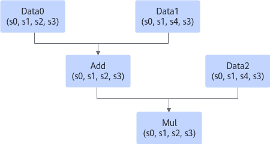

# aclgrphBuildModel支持的配置参数

## 基础功能

<table><thead align="left"><tr id="zh-cn_topic_0000002245550901_row20806957171510"><th class="cellrowborder" valign="top" width="17.82%" id="mcps1.1.3.1.1">
参数

</th>
<th class="cellrowborder" valign="top" width="82.17999999999999%" id="mcps1.1.3.1.2">
说明

</th>
</tr>
</thead>
<tbody><tr id="zh-cn_topic_0000002245550901_row4806105771518"><td class="cellrowborder" valign="top" width="17.82%" headers="mcps1.1.3.1.1 ">
INPUT_FORMAT

</td>
<td class="cellrowborder" valign="top" width="82.17999999999999%" headers="mcps1.1.3.1.2 ">
输入数据格式。

<strong id="zh-cn_topic_0000002245550901_b253702534815">参数取值：</strong>

支持NCHW、NHWC、ND、ND、NCDHW、NDHWC格式。

<strong id="zh-cn_topic_0000002245550901_b116743359485">配置示例：</strong>

<pre class="screen" id="zh-cn_topic_0000002245550901_screen186002458484">{ge::ir_option::INPUT_FORMAT, "NHWC"}</pre>

如果同时开启AIPP，在进行推理业务时，输入图片数据要求为NHWC排布。该场景下INPUT_FORMAT参数指定的数据格式不生效。

 说明： 

该参数仅针对动态batch_size、动态分辨率和动态维度场景。

上述场景下，INPUT_FORMAT必须设置并且和所有Data算子的format保持一致，否则会导致模型编译失败。

产品支持情况：

<term id="zh-cn_topic_0000002245550901_zh-cn_topic_0000001312391781_term11962195213215">Atlas A2 训练系列产品</term>/<term id="zh-cn_topic_0000002245550901_zh-cn_topic_0000001312391781_term184716139811">Atlas A2 推理系列产品</term>：支持

<term id="zh-cn_topic_0000002245550901_zh-cn_topic_0000001312391781_term1253731311225">Atlas A3 训练系列产品</term>/<term id="zh-cn_topic_0000002245550901_zh-cn_topic_0000001312391781_term131434243115">Atlas A3 推理系列产品</term>：支持

</td>
</tr>
<tr id="zh-cn_topic_0000002245550901_row20806175761513"><td class="cellrowborder" valign="top" width="17.82%" headers="mcps1.1.3.1.1 ">
OP_NAME_MAP

</td>
<td class="cellrowborder" valign="top" width="82.17999999999999%" headers="mcps1.1.3.1.2 ">
扩展算子（非标准算子）映射配置文件路径和文件名，不同的网络中某扩展算子的功能不同，可以指定该扩展算子到具体网络中实际运行的扩展算子的映射。

路径和文件名：支持大小写字母（a-z，A-Z）、数字（0-9）、下划线（_）、中划线（-）、句点（.）、中文字符。

<strong id="zh-cn_topic_0000002245550901_b1783125510490">配置示例</strong>：

<pre class="screen" id="zh-cn_topic_0000002245550901_screen128858539518">{ge::ir_option::OP_NAME_MAP, "<em id="zh-cn_topic_0000002245550901_i1396334692519">/home/test/opname_map.cfg</em>"}</pre>

其中，扩展算子映射配置文件内容示例如下：

<pre class="screen" id="zh-cn_topic_0000002245550901_screen1288555316515">OpA:Network1OpA</pre>

产品支持情况：

<term id="zh-cn_topic_0000002245550901_zh-cn_topic_0000001312391781_term11962195213215_1">Atlas A2 训练系列产品</term>/<term id="zh-cn_topic_0000002245550901_zh-cn_topic_0000001312391781_term184716139811_1">Atlas A2 推理系列产品</term>：支持

<term id="zh-cn_topic_0000002245550901_zh-cn_topic_0000001312391781_term1253731311225_1">Atlas A3 训练系列产品</term>/<term id="zh-cn_topic_0000002245550901_zh-cn_topic_0000001312391781_term131434243115_1">Atlas A3 推理系列产品</term>：支持

</td>
</tr>
<tr id="zh-cn_topic_0000002245550901_row72962321169"><td class="cellrowborder" valign="top" width="17.82%" headers="mcps1.1.3.1.1 ">
INSERT_OP_FILE

</td>
<td class="cellrowborder" valign="top" width="82.17999999999999%" headers="mcps1.1.3.1.2 ">
输入预处理算子的配置文件路径，例如Aipp算子。

若配置了该参数，则不能对同一个输入节点同时使用INPUT_FP16_NODES参数。

配置文件路径：支持大小写字母、数字，下划线；文件名部分：支持大小写字母、数字，下划线和点(.)

<strong id="zh-cn_topic_0000002245550901_b9701316102711">配置示例</strong>：

<pre class="screen" id="zh-cn_topic_0000002245550901_screen11709161279">{ge::ir_option::INSERT_OP_FILE, <em id="zh-cn_topic_0000002245550901_i4755155011275">"/home/test/aipp.cfg</em><em id="zh-cn_topic_0000002245550901_i1746155382717">"</em>}</pre>

配置文件的内容示例如下：

<pre class="screen" id="zh-cn_topic_0000002245550901_screen15141837123118">aipp_op {
aipp_mode:static
input_format:YUV420SP_U8
csc_switch:true
var_reci_chn_0:0.00392157
var_reci_chn_1:0.00392157
var_reci_chn_2:0.00392157
}</pre>

 说明： 

配置文件详细说明，请参考《ATC离线模型编译工具用户指南》。

产品支持情况：

<term id="zh-cn_topic_0000002245550901_zh-cn_topic_0000001312391781_term11962195213215_2">Atlas A2 训练系列产品</term>/<term id="zh-cn_topic_0000002245550901_zh-cn_topic_0000001312391781_term184716139811_2">Atlas A2 推理系列产品</term>：支持

<term id="zh-cn_topic_0000002245550901_zh-cn_topic_0000001312391781_term1253731311225_2">Atlas A3 训练系列产品</term>/<term id="zh-cn_topic_0000002245550901_zh-cn_topic_0000001312391781_term131434243115_2">Atlas A3 推理系列产品</term>：支持

</td>
</tr>
<tr id="zh-cn_topic_0000002245550901_row1893423751613"><td class="cellrowborder" valign="top" width="17.82%" headers="mcps1.1.3.1.1 ">
OUTPUT_TYPE

</td>
<td class="cellrowborder" valign="top" width="82.17999999999999%" headers="mcps1.1.3.1.2 ">
网络输出数据类型。

<strong id="zh-cn_topic_0000002245550901_b58941016146">参数取值：</strong>

<ul id="zh-cn_topic_0000002245550901_zh-cn_topic_0221674006_ul1719313193217"><li>FP32：推荐分类网络、检测网络使用。</li><li>UINT8：图像超分辨率网络，推荐使用，推理性能更好。</li><li>FP16：推荐分类网络、检测网络使用。通常用于一个网络输出作为另一个网络输入场景。</li><li>INT8</li></ul>

模型编译后，在对应的*.om模型文件中，数据类型以DT_FLOAT或DT_UINT8或DT_FLOAT16或DT_INT8值呈现。

<strong id="zh-cn_topic_0000002245550901_b257714427566">配置示例：</strong>

<pre class="screen" id="zh-cn_topic_0000002245550901_screen1048914270551">{ge::ir_option::OUTPUT_TYPE, "FP32"}</pre>

<strong id="zh-cn_topic_0000002245550901_b187631638643">参数值约束：</strong>

<ul id="zh-cn_topic_0000002245550901_zh-cn_topic_0221674006_ul88677791917"><li>若不指定具体数据类型，则以原始网络模型最后一层输出的算子数据类型为准。</li><li>若指定了类型，则以该参数指定的类型为准。</li></ul>

产品支持情况：

<term id="zh-cn_topic_0000002245550901_zh-cn_topic_0000001312391781_term11962195213215_3">Atlas A2 训练系列产品</term>/<term id="zh-cn_topic_0000002245550901_zh-cn_topic_0000001312391781_term184716139811_3">Atlas A2 推理系列产品</term>：支持

<term id="zh-cn_topic_0000002245550901_zh-cn_topic_0000001312391781_term1253731311225_3">Atlas A3 训练系列产品</term>/<term id="zh-cn_topic_0000002245550901_zh-cn_topic_0000001312391781_term131434243115_3">Atlas A3 推理系列产品</term>：支持

</td>
</tr>
<tr id="zh-cn_topic_0000002245550901_row39341137101619"><td class="cellrowborder" valign="top" width="17.82%" headers="mcps1.1.3.1.1 ">
INPUT_FP16_NODES

</td>
<td class="cellrowborder" valign="top" width="82.17999999999999%" headers="mcps1.1.3.1.2 ">
指定输入数据类型为FP16的输入节点名称。

例如："node_name1;node_name2"，指定的节点必须放在双引号中，节点中间使用英文分号分隔。若配置了该参数，则不能对同一个输入节点同时使用INSERT_OP_FILE参数。

配置示例：

<pre class="screen" id="zh-cn_topic_0000002245550901_screen65311226105712">{ge::ir_option::INPUT_FP16_NODES, "node_name1;node_name2"}</pre>

产品支持情况：

<term id="zh-cn_topic_0000002245550901_zh-cn_topic_0000001312391781_term11962195213215_4">Atlas A2 训练系列产品</term>/<term id="zh-cn_topic_0000002245550901_zh-cn_topic_0000001312391781_term184716139811_4">Atlas A2 推理系列产品</term>：支持

<term id="zh-cn_topic_0000002245550901_zh-cn_topic_0000001312391781_term1253731311225_4">Atlas A3 训练系列产品</term>/<term id="zh-cn_topic_0000002245550901_zh-cn_topic_0000001312391781_term131434243115_4">Atlas A3 推理系列产品</term>：支持

</td>
</tr>
</tbody>
</table>

## 内存管理

<table><thead align="left"><tr id="zh-cn_topic_0000002210430926_row882992718252"><th class="cellrowborder" valign="top" width="16.72%" id="mcps1.1.3.1.1">
参数

</th>
<th class="cellrowborder" valign="top" width="83.28%" id="mcps1.1.3.1.2">
说明

</th>
</tr>
</thead>
<tbody><tr id="zh-cn_topic_0000002210430926_row1975219506307"><td class="cellrowborder" valign="top" width="16.72%" headers="mcps1.1.3.1.1 ">
EXEC_DISABLE_REUSED_MEMORY

</td>
<td class="cellrowborder" valign="top" width="83.28%" headers="mcps1.1.3.1.2 ">
内存复用开关。

内存复用是指按照生命周期和内存大小，把不冲突的内存重复使用，来降低网络内存占用。

<strong id="zh-cn_topic_0000002210430926_zh-cn_topic_0000002209492862_b56787092410">参数取值：</strong>

<ul id="zh-cn_topic_0000002210430926_zh-cn_topic_0000002209492862_ul1553135220471"><li>0：（默认值）开启内存复用。</li><li>1：关闭内存复用。如果网络模型较大，关闭内存复用开关，会造成后续推理时Device侧内存不复用，从而导致内存不足。</li></ul>

<strong id="zh-cn_topic_0000002210430926_zh-cn_topic_0000002209492862_b89751138162519">配置示例：</strong>

<pre class="screen" id="zh-cn_topic_0000002210430926_zh-cn_topic_0000002209492862_screen89754389258">{ge::ir_option::EXEC_DISABLE_REUSED_MEMORY, "0"}</pre>

产品支持情况：

<term id="zh-cn_topic_0000002210430926_zh-cn_topic_0000002209492862_zh-cn_topic_0000001312391781_term11962195213215">Atlas A2 训练系列产品</term>/<term id="zh-cn_topic_0000002210430926_zh-cn_topic_0000002209492862_zh-cn_topic_0000001312391781_term184716139811">Atlas A2 推理系列产品</term>：支持

<term id="zh-cn_topic_0000002210430926_zh-cn_topic_0000002209492862_zh-cn_topic_0000001312391781_term1253731311225">Atlas A3 训练系列产品</term>/<term id="zh-cn_topic_0000002210430926_zh-cn_topic_0000002209492862_zh-cn_topic_0000001312391781_term131434243115">Atlas A3 推理系列产品</term>：支持

</td>
</tr>
<tr id="zh-cn_topic_0000002210430926_row68521013122117"><td class="cellrowborder" valign="top" width="16.72%" headers="mcps1.1.3.1.1 ">
EXTERNAL_WEIGHT

</td>
<td class="cellrowborder" valign="top" width="83.28%" headers="mcps1.1.3.1.2 ">
生成om模型文件时，是否将原始网络中的Const/Constant节点的权重外置，同时将节点类型转换为FileConstant类型。

离线场景，如果模型权重较大且环境对om离线模型大小有限制，建议开启外置权重将权重单独保存，来减小om大小。

<strong id="zh-cn_topic_0000002210430926_zh-cn_topic_0000002209492862_b16315023134010">参数取值：</strong>

<ul id="zh-cn_topic_0000002210430926_zh-cn_topic_0000002209492862_ul1184514015365"><li>0：（默认值）权重不外置，直接保存在om离线模型文件中。</li><li>1：权重外置，将网络中所有Const/Constant节点的权重文件落盘，并将节点类型转换为FileConstant类型；权重文件保存在与om文件同层级的weight目录下，不同节点权重保存到不同的文件中，以weight_&lt;hash值&gt;值命名。</li></ul>

<strong id="zh-cn_topic_0000002210430926_zh-cn_topic_0000002209492862_b1817217460434">配置示例</strong>：

<pre class="screen" id="zh-cn_topic_0000002210430926_zh-cn_topic_0000002209492862_screen1698788863">{ge::ir_option::EXTERNAL_WEIGHT, "1"}</pre>

<strong id="zh-cn_topic_0000002210430926_zh-cn_topic_0000002209492862_b20861570618">使用约束：</strong>

<ul id="zh-cn_topic_0000002210430926_zh-cn_topic_0000002209492862_ul7473514713"><li>权重外置场景，在使用acl接口开发推理应用、加载模型时：<ul id="zh-cn_topic_0000002210430926_zh-cn_topic_0000002209492862_zh-cn_topic_0000001265404742_ul16530015193420"><li>使用<a href="aclgrphSaveModel.md">aclgrphSaveModel</a>接口保存om模型：<ul id="zh-cn_topic_0000002210430926_zh-cn_topic_0000002209492862_zh-cn_topic_0000001265404742_ul179642535019"><li>若使用aclmdlLoadFromFile接口加载模型，需将权重文件保存在与om文件同层级的weight目录下。</li><li>若使用aclmdlSetConfigOpt和aclmdlLoadWithConfig接口加载模型，对权重外置目录没有要求，后续加载模型时，通过aclmdlLoadWithConfig接口指定权重外置目录。</li></ul>
</li><li>权重更新场景，使用<a href="aclgrphBundleSaveModel.md">aclgrphBundleSaveModel</a>接口保存om模型：
只能使用aclmdlBundleLoadFromFile接口加载模型，并且需将权重文件保存在与om文件同层级的weight目录下。

</li></ul>

接口详细说明请参见《应用开发指南 (C&amp;C++)》。

</li></ul>

产品支持情况：

<term id="zh-cn_topic_0000002210430926_zh-cn_topic_0000002209492862_zh-cn_topic_0000001312391781_term11962195213215_1">Atlas A2 训练系列产品</term>/<term id="zh-cn_topic_0000002210430926_zh-cn_topic_0000002209492862_zh-cn_topic_0000001312391781_term184716139811_1">Atlas A2 推理系列产品</term>：支持

<term id="zh-cn_topic_0000002210430926_zh-cn_topic_0000002209492862_zh-cn_topic_0000001312391781_term1253731311225_1">Atlas A3 训练系列产品</term>/<term id="zh-cn_topic_0000002210430926_zh-cn_topic_0000002209492862_zh-cn_topic_0000001312391781_term131434243115_1">Atlas A3 推理系列产品</term>：支持

</td>
</tr>
</tbody>
</table>

## 动态shape

<table><thead align="left"><tr id="zh-cn_topic_0000002210590710_row10684151211255"><th class="cellrowborder" valign="top" width="16.72%" id="mcps1.1.3.1.1">
参数

</th>
<th class="cellrowborder" valign="top" width="83.28%" id="mcps1.1.3.1.2">
说明

</th>
</tr>
</thead>
<tbody><tr id="zh-cn_topic_0000002210590710_row899431219291"><td class="cellrowborder" valign="top" width="16.72%" headers="mcps1.1.3.1.1 ">
INPUT_SHAPE

</td>
<td class="cellrowborder" valign="top" width="83.28%" headers="mcps1.1.3.1.2 ">
模型输入的shape信息。

<strong id="zh-cn_topic_0000002210590710_b1997853603511">参数取值</strong>：

<ul id="zh-cn_topic_0000002210590710_ul18348151983611"><li>模型为固定shape，INPUT_SHAPE参数为<strong id="zh-cn_topic_0000002210590710_b17793534132617">可选</strong>配置<ul id="zh-cn_topic_0000002210590710_ul1912311449369"><li>若模型为单个输入，则shape信息为"input_name:n,c,h,w"。</li><li>若模型有多个输入，则shape信息为"input_name1:n1,c1,h1,w1;input_name2:n2,c2,h2,w2"；不同输入之间使用<strong id="zh-cn_topic_0000002210590710_b18776185713355">英文分号</strong>分隔，input_name必须是转换前的网络模型中的节点名称。</li></ul>
</li><li>模型为非固定shape，INPUT_SHAPE参数<strong id="zh-cn_topic_0000002210590710_b11320153602619">必须</strong>配置
若原始模型中输入数据的某个或某些维度值不固定，当前支持通过设置shape分档或设置shape范围两种方式转换模型。<ul id="zh-cn_topic_0000002210590710_zh-cn_topic_0000001265392746_ul1918983152412"><li>设置shape分档（静态shape），包括设置batch_size档位、设置分辨率档位、设置动态维度档位。
设置INPUT_SHAPE参数时，将对应维度值设置为-1，同时配合使用DYNAMIC_BATCH_SIZE（设置batch_size档位）或DYNAMIC_IMAGE_SIZE（设置分辨率档位）或DYNAMIC_DIMS（设置动态维度档位）参数。详细用法请参考DYNAMIC_BATCH_SIZE、DYNAMIC_IMAGE_SIZE、DYNAMIC_DIMS参数说明。

</li><li>设置shape范围（动态shape）。
设置INPUT_SHAPE参数时，可将对应维度的值设置为范围，例如1~10，<strong id="zh-cn_topic_0000002210590710_b15812881419">设置的range值范围必须有效</strong>。

<ul id="zh-cn_topic_0000002210590710_ul183092116455"><li>支持按照name设置："input_name1:n1,c1,h1,w1;input_name2:n2,c2,h2,w2"，例如："input_name1:8~20,3,5,-1;input_name2:5,3~9,10,-1"。指定的节点必须放在双引号中，节点中间使用英文分号分隔。input_name必须是转换前的网络模型中的节点名称。如果用户知道data节点的name，推荐按照name设置。</li><li>支持按照index设置："n1,c1,h1,w1;n2,c2,h2,w2"，例如："8~20,3,5,-1;5,3~9,10,-1"。可以不指定节点名，节点按照索引顺序排列，节点中间使用英文分号分隔。按照index设置shape范围时，data节点需要设置属性index，说明是第几个输入，index从0开始。</li></ul>

如果用户不想指定维度的范围或具体取值，则可以将其设置为-1，表示此维度可以使用&gt;=0的任意取值，该场景下取值上限为int64数据类型表达范围，但受限于host和device侧物理内存的大小，用户可以通过增大内存来支持。

</li></ul>

</li><li>模型shape为标量<ul id="zh-cn_topic_0000002210590710_ul13148101105515"><li>非动态分档场景：
shape为标量的输入，可选配置，例如模型有两个输入，input_name1为标量，即shape为"[]"形式，input_name2输入shape为[n2,c2,h2,w2]，则shape信息为"<strong id="zh-cn_topic_0000002210590710_b1568561055114">input_name1:</strong>;input_name2:n2,c2,h2,w2"，不同输入之间使用<strong id="zh-cn_topic_0000002210590710_b146711754173510">英文分号</strong>分隔，input_name必须是转换前的网络模型中的节点名称；标量的输入如果配置，则配置为空。

</li><li>动态分档场景：
如果模型输入中既有标量shape，又有支持动态分档的shape，则标量输入不能忽略，必须配置。例如模型有三个输入，分别为A:[-1,c1,h1,w1]、B:[]、C:[n2,c2,h2,w2]，则shape信息为"A:-1,c1,h1,w1;<strong id="zh-cn_topic_0000002210590710_b03335562567">B:</strong>;C:n2,c2,h2,w2"，标量输入B必须配置。

</li></ul>
</li></ul>

<strong id="zh-cn_topic_0000002210590710_b2082541350">配置示例：</strong>

<ul id="zh-cn_topic_0000002210590710_ul75371434611"><li>固定shape，例如某网络的输入shape信息，输入1<strong id="zh-cn_topic_0000002210590710_b47771081914">：</strong>input_0_0 [16,32,208,208]，输入2：input_1_0 [16,64,208,208]，则INPUT_SHAPE的配置信息为：<pre class="screen" id="zh-cn_topic_0000002210590710_screen1485218281822">{ge::ir_option::INPUT_SHAPE, "input_0_0:16,32,208,208;input_1_0:16,64,208,208"}</pre>
</li><li>非固定shape，静态shape：<ul id="zh-cn_topic_0000002210590710_ul587574231913"><li>设置batch_size档位的示例，请参见DYNAMIC_BATCH_SIZE。</li><li>设置分辨率档位的示例，请参见DYNAMIC_IMAGE_SIZE。</li><li>设置指定维度档位的示例，请参见DYNAMIC_DIMS。</li></ul>
</li><li>非固定shape，动态shape，设置shape范围的示例：<pre class="screen" id="zh-cn_topic_0000002210590710_screen231111178582">{ge::ir_option::INPUT_SHAPE, "input_0_0:1~10,32,208,208;input_1_0:16,64,100~208,100~208"}</pre>

详细使用示例以及使用注意事项请参见<a href="zh-cn_topic_0000001265083386.md">专题&gt;动态输入shape范围</a>。

</li><li>shape为标量<ul id="zh-cn_topic_0000002210590710_ul954852952520"><li>非动态分档场景
shape为标量的输入，可选配置。例如模型有两个输入，<strong id="zh-cn_topic_0000002210590710_b15823193315273">input_name1</strong>为标量，input_name2输入shape为[16,32,208,208]，配置示例为：

<pre class="screen" id="zh-cn_topic_0000002210590710_screen4404181322810">{ge::ir_option::INPUT_SHAPE<strong id="zh-cn_topic_0000002210590710_b1017916468232">, "input_name1:</strong>;input_name2:16,32,208,208<strong id="zh-cn_topic_0000002210590710_b1715151104119">"</strong>}</pre>

上述示例中的<strong id="zh-cn_topic_0000002210590710_b1610241016434">input_name1</strong>为可选配置<strong id="zh-cn_topic_0000002210590710_b8102110114310">。</strong>

</li><li>动态分档场景
shape为标量的输入，必须配置。例如模型有三个输入，shape信息分别为A:[-1,32,208,208]、<strong id="zh-cn_topic_0000002210590710_b10898728182611">B:[]</strong>、C:[16,64,208,208]，则配置示例为（A为动态分档输入，此处以设置batch_size档位为例）：

<pre class="screen" id="zh-cn_topic_0000002210590710_screen1941843045918">{ge::ir_option::INPUT_SHAPE,<strong id="zh-cn_topic_0000002210590710_b1835905918235"> "</strong>A:-1,32,208,208;<strong id="zh-cn_topic_0000002210590710_b161281391449">B:</strong>;C:16,64,208,208<strong id="zh-cn_topic_0000002210590710_b1131915353444">"</strong>}, 
{ge::ir_option::DYNAMIC_BATCH_SIZE, "1,2,4"} </pre>
</li></ul>
</li></ul>

 说明： 

如果模型转换时通过该参数设置了shape的范围：

使用应用工程进行模型推理时，需要在<strong id="zh-cn_topic_0000002210590710_b1849331123418">模型执行</strong>接口之前，调用<strong id="zh-cn_topic_0000002210590710_b120147155614">aclmdlSetDatasetTensorDesc</strong>接口，用于设置真实的输入Tensor描述信息（输入shape范围）；模型执行之后，调用<strong id="zh-cn_topic_0000002210590710_b001447125615">aclmdlGetDatasetTensorDesc</strong>接口获取模型动态输出的Tensor描述信息；再进一步调用aclTensorDesc下的操作接口获取输出Tensor数据占用的内存大小、Tensor的Format信息、Tensor的维度信息等。

关于<strong id="zh-cn_topic_0000002210590710_b2959723103519">aclmdlSetDatasetTensorDesc</strong>、<strong id="zh-cn_topic_0000002210590710_b1695913231358">aclmdlGetDatasetTensorDesc</strong>等接口的具体使用方法，请参见《应用开发指南 (C&amp;C++)》。

产品支持情况：

<term id="zh-cn_topic_0000002210590710_zh-cn_topic_0000001312391781_term11962195213215">Atlas A2 训练系列产品</term>/<term id="zh-cn_topic_0000002210590710_zh-cn_topic_0000001312391781_term184716139811">Atlas A2 推理系列产品</term>：支持

<term id="zh-cn_topic_0000002210590710_zh-cn_topic_0000001312391781_term1253731311225">Atlas A3 训练系列产品</term>/<term id="zh-cn_topic_0000002210590710_zh-cn_topic_0000001312391781_term131434243115">Atlas A3 推理系列产品</term>：支持

</td>
</tr>
<tr id="zh-cn_topic_0000002210590710_row426857111711"><td class="cellrowborder" valign="top" width="16.72%" headers="mcps1.1.3.1.1 ">
INPUT_HINT_SHAPE

</td>
<td class="cellrowborder" valign="top" width="83.28%" headers="mcps1.1.3.1.2 ">
自动融合离线编译动态shape场景下，指定模型输入数据的hint shape，以支持该场景下符号化推导。

hint shape是模型编译时用户传入的一个提示shape值。如<a href="#zh-cn_topic_0000002210590710_fig18519155217268">图1</a>所示，模型中Data0、Data1和Data2的部分维度未知，但在模型执行时，用户会传入具有静态shape的输入Tensor。例如，在编译下图时，Data0的shape为[2, 3, 4, 2]，Data1的shape为[2, 3, 1, 2]，Data2的shape为[2, 3, 1, 2]；因此，在编译模型时，s0的hint值为2，s1的hint值为3，s2的hint值为4，s3的hint值为2，s4的hint值为1。

<b>图1 </b>Hint值示意图 

该参数需要与INPUT_SHAPE配合使用，并且该参数需要为动态shape场景；不能与DYNAMIC_BATCH_SIZE、DYNAMIC_IMAGE_SIZE、DYNAMIC_DIMS同时使用。

<strong id="zh-cn_topic_0000002210590710_b9175115919488">参数取值：</strong>输入节点索引及shape信息，例如"input_index1:[n1,c1,h1,w1]<strong id="zh-cn_topic_0000002210590710_b15311162553211">;</strong>input_index2:[n2,c2,h2,w2]"，索引从0开始。

<strong id="zh-cn_topic_0000002210590710_b0638842193214">参数值格式：</strong>指定的参数必须放在双引号中，不同输入之间使用<strong id="zh-cn_topic_0000002210590710_b3539111017339">英文分号</strong>分隔，shape信息放在英文括号“[]”中。

<strong id="zh-cn_topic_0000002210590710_b152543421500">参数值约束：</strong>针对INPUT_SHAPE设置范围的维度，INPUT_HINT_SHAPE设置的取值需要在其范围以内。

<strong id="zh-cn_topic_0000002210590710_b11687133913318">配置示例：</strong>

<pre class="screen" id="zh-cn_topic_0000002210590710_screen1010520599314">{ge::ir_option::INPUT_SHAPE, "input_0_0:1~10,32,208,208;input_1_0:16,64,100~208,100~208"}
{ge::ir_option::INPUT_HINT_SHAPE, "0:[1,32,208,208];1:[16,64,100,100]"</pre>

产品支持情况：

<term id="zh-cn_topic_0000002210590710_zh-cn_topic_0000001312391781_term1253731311225_1">Atlas A3 训练系列产品</term>/<term id="zh-cn_topic_0000002210590710_zh-cn_topic_0000001312391781_term131434243115_1">Atlas A3 推理系列产品</term>：支持

<term id="zh-cn_topic_0000002210590710_zh-cn_topic_0000001312391781_term11962195213215_1">Atlas A2 训练系列产品</term>/<term id="zh-cn_topic_0000002210590710_zh-cn_topic_0000001312391781_term184716139811_1">Atlas A2 推理系列产品</term>：支持

</td>
</tr>
<tr id="zh-cn_topic_0000002210590710_row33391638112211"><td class="cellrowborder" valign="top" width="16.72%" headers="mcps1.1.3.1.1 ">
DYNAMIC_BATCH_SIZE

</td>
<td class="cellrowborder" valign="top" width="83.28%" headers="mcps1.1.3.1.2 ">
设置动态batch档位参数，适用于执行推理时，每次处理图片数量不固定的场景。

该参数需要与INPUT_SHAPE配合使用，不能与DYNAMIC_IMAGE_SIZE、DYNAMIC_DIMS同时使用；且只支持N在shape首位的场景，即shape的第一位设置为"-1"。如果N在非首位场景下，请使用DYNAMIC_DIMS参数进行设置。

<strong id="zh-cn_topic_0000002210590710_b122711432145312">参数取值：</strong>档位数，例如"1,2,4,8"。

<strong id="zh-cn_topic_0000002210590710_b027173255311">参数值格式：</strong>指定的参数必须放在双引号中，档位之间使用英文逗号分隔。

<strong id="zh-cn_topic_0000002210590710_b927143275311">参数值约束：</strong>

<ul id="zh-cn_topic_0000002210590710_ul13835118342"><li>针对如下产品，档位数约束为：档位数取值范围为(1,100]，即必须设置至少2个档位，最多支持100档配置；每个档位数值建议限制为：[1~2048]。
<term id="zh-cn_topic_0000002210590710_zh-cn_topic_0000001312391781_term1253731311225_2">Atlas A3 训练系列产品</term>/<term id="zh-cn_topic_0000002210590710_zh-cn_topic_0000001312391781_term131434243115_2">Atlas A3 推理系列产品</term>

<term id="zh-cn_topic_0000002210590710_zh-cn_topic_0000001312391781_term11962195213215_2">Atlas A2 训练系列产品</term>/<term id="zh-cn_topic_0000002210590710_zh-cn_topic_0000001312391781_term184716139811_2">Atlas A2 推理系列产品</term>

</li></ul>

<strong id="zh-cn_topic_0000002210590710_b8144161285016">配置示例：</strong>

INPUT_SHAPE中的“-1”表示设置动态batch。

<pre class="screen" id="zh-cn_topic_0000002210590710_screen118862052267">{ge::ir_option::<strong id="zh-cn_topic_0000002210590710_b19911513133219">INPUT_FORMAT, "NHWC"</strong>}
{ge::ir_option::<strong id="zh-cn_topic_0000002210590710_b15886205202619">INPUT_SHAPE, "data:-1,3,416,416"</strong>}, 
{ge::ir_option::<strong id="zh-cn_topic_0000002210590710_b9886257269">DYNAMIC_BATCH_SIZE, "1,2,4,8"</strong>}     </pre>

产品支持情况：

<term id="zh-cn_topic_0000002210590710_zh-cn_topic_0000001312391781_term1253731311225_3">Atlas A3 训练系列产品</term>/<term id="zh-cn_topic_0000002210590710_zh-cn_topic_0000001312391781_term131434243115_3">Atlas A3 推理系列产品</term>：支持

<term id="zh-cn_topic_0000002210590710_zh-cn_topic_0000001312391781_term11962195213215_3">Atlas A2 训练系列产品</term>/<term id="zh-cn_topic_0000002210590710_zh-cn_topic_0000001312391781_term184716139811_3">Atlas A2 推理系列产品</term>：支持

</td>
</tr>
<tr id="zh-cn_topic_0000002210590710_row538374011228"><td class="cellrowborder" valign="top" width="16.72%" headers="mcps1.1.3.1.1 ">
DYNAMIC_IMAGE_SIZE

</td>
<td class="cellrowborder" valign="top" width="83.28%" headers="mcps1.1.3.1.2 ">
设置输入图片的动态分辨率参数。适用于执行推理时，每次处理图片宽和高不固定的场景。

该参数需要与INPUT_SHAPE配合使用，不能与DYNAMIC_BATCH_SIZE、DYNAMIC_DIMS同时使用。

<strong id="zh-cn_topic_0000002210590710_b208731226165317">参数取值：</strong> "imagesize1_height,imagesize1_width;imagesize2_height,imagesize2_width"。

<strong id="zh-cn_topic_0000002210590710_b1987362619532">参数值格式：</strong>指定的参数必须放在双引号中，档位之间英文<strong id="zh-cn_topic_0000002210590710_b11539132652212">分号</strong>分隔，每档内参数使用英文<strong id="zh-cn_topic_0000002210590710_b0586728192213">逗号</strong>分隔。

<strong id="zh-cn_topic_0000002210590710_b198731726125311">参数值约束：</strong>

<ul id="zh-cn_topic_0000002210590710_ul3207193213619"><li>针对如下产品，档位数约束为：档位数取值范围为(1,100]，即必须设置至少2个档位，最多支持100档配置。
<term id="zh-cn_topic_0000002210590710_zh-cn_topic_0000001312391781_term1253731311225_4">Atlas A3 训练系列产品</term>/<term id="zh-cn_topic_0000002210590710_zh-cn_topic_0000001312391781_term131434243115_4">Atlas A3 推理系列产品</term>

<term id="zh-cn_topic_0000002210590710_zh-cn_topic_0000001312391781_term11962195213215_4">Atlas A2 训练系列产品</term>/<term id="zh-cn_topic_0000002210590710_zh-cn_topic_0000001312391781_term184716139811_4">Atlas A2 推理系列产品</term>

</li></ul>

<strong id="zh-cn_topic_0000002210590710_b189341930205015">配置示例：</strong>

INPUT_SHAPE中的“-1”表示设置动态分辨率。

<pre class="screen" id="zh-cn_topic_0000002210590710_screen4366335122119">{ge::ir_option::<strong id="zh-cn_topic_0000002210590710_b49605452517">INPUT_FORMAT, "NCHW"</strong>}, 
{ge::ir_option::<strong id="zh-cn_topic_0000002210590710_b19144162914334">INPUT_SHAPE, "data:8,3,-1,-1"</strong>}, 
{ge::ir_option::<strong id="zh-cn_topic_0000002210590710_b1514422910338">DYNAMIC_IMAGE_SIZE, "416,416;832,832"</strong>}</pre>

产品支持情况：

<term id="zh-cn_topic_0000002210590710_zh-cn_topic_0000001312391781_term1253731311225_5">Atlas A3 训练系列产品</term>/<term id="zh-cn_topic_0000002210590710_zh-cn_topic_0000001312391781_term131434243115_5">Atlas A3 推理系列产品</term>：支持

<term id="zh-cn_topic_0000002210590710_zh-cn_topic_0000001312391781_term11962195213215_5">Atlas A2 训练系列产品</term>/<term id="zh-cn_topic_0000002210590710_zh-cn_topic_0000001312391781_term184716139811_5">Atlas A2 推理系列产品</term>：支持

</td>
</tr>
<tr id="zh-cn_topic_0000002210590710_row1615244132218"><td class="cellrowborder" valign="top" width="16.72%" headers="mcps1.1.3.1.1 ">
DYNAMIC_DIMS

</td>
<td class="cellrowborder" valign="top" width="83.28%" headers="mcps1.1.3.1.2 ">
设置ND格式下动态维度的档位。适用于执行推理时，每次处理任意维度的场景。

该参数需要与INPUT_SHAPE配合使用，不能与DYNAMIC_BATCH_SIZE、DYNAMIC_IMAGE_SIZE同时使用。

<strong id="zh-cn_topic_0000002210590710_b162095457530">参数取值：</strong>通过"dim1,dim2,dim3;dim4,dim5,dim6;dim7,dim8,dim9"的形式设置。

<strong id="zh-cn_topic_0000002210590710_b5111172045315">参数值格式：</strong>所有档位必须放在双引号中，档位之间使用英文<strong id="zh-cn_topic_0000002210590710_b18398351232">分号</strong>分隔，每档内参数使用英文<strong id="zh-cn_topic_0000002210590710_b06871610182619">逗号</strong>分隔；每档中的dim值与INPUT_SHAPE参数中的-1标识的参数依次对应，INPUT_SHAPE参数中有几个-1，则每档必须设置几个维度。

<strong id="zh-cn_topic_0000002210590710_b7112132035312">参数值约束：</strong>

<ul id="zh-cn_topic_0000002210590710_ul15446817173719"><li>针对如下产品，档位数约束为：档位数取值范围为(1,100]，即必须设置至少2个档位，最多支持100档配置，建议配置为3~4档。
<term id="zh-cn_topic_0000002210590710_zh-cn_topic_0000001312391781_term1253731311225_6">Atlas A3 训练系列产品</term>/<term id="zh-cn_topic_0000002210590710_zh-cn_topic_0000001312391781_term131434243115_6">Atlas A3 推理系列产品</term>

<term id="zh-cn_topic_0000002210590710_zh-cn_topic_0000001312391781_term11962195213215_6">Atlas A2 训练系列产品</term>/<term id="zh-cn_topic_0000002210590710_zh-cn_topic_0000001312391781_term184716139811_6">Atlas A2 推理系列产品</term>

</li></ul>

<strong id="zh-cn_topic_0000002210590710_b1366961195118">配置示例：</strong>

<pre class="screen" id="zh-cn_topic_0000002210590710_screen175214235126">{ge::ir_option::<strong id="zh-cn_topic_0000002210590710_b2030313591716">INPUT_FORMAT, "ND"</strong>},
{ge::ir_option::<strong id="zh-cn_topic_0000002210590710_b11489016132518">INPUT_SHAPE, "data:1,-1"</strong>}, 
{ge::ir_option::<strong id="zh-cn_topic_0000002210590710_b8569337112716">DYNAMIC_DIMS, "4;8;16;64"</strong>}  
// 模型编译时，支持的data算子的shape为1,4; 1,8; 1,16;1,64
{ge::ir_option::<strong id="zh-cn_topic_0000002210590710_b189291515819">INPUT_FORMAT, "ND"</strong>},
{ge::ir_option::<strong id="zh-cn_topic_0000002210590710_b415282132813">INPUT_SHAPE, "data:1,-1,-1"</strong>}, 
{ge::ir_option::<strong id="zh-cn_topic_0000002210590710_b141526212816">DYNAMIC_DIMS, "1,2;3,4;5,6;7,8"</strong>}  
// 模型编译时，支持的data算子的shape为1,1,2; 1,3,4; 1,5,6; 1,7,8</pre>

产品支持情况：

<term id="zh-cn_topic_0000002210590710_zh-cn_topic_0000001312391781_term1253731311225_7">Atlas A3 训练系列产品</term>/<term id="zh-cn_topic_0000002210590710_zh-cn_topic_0000001312391781_term131434243115_7">Atlas A3 推理系列产品</term>：支持

<term id="zh-cn_topic_0000002210590710_zh-cn_topic_0000001312391781_term11962195213215_7">Atlas A2 训练系列产品</term>/<term id="zh-cn_topic_0000002210590710_zh-cn_topic_0000001312391781_term184716139811_7">Atlas A2 推理系列产品</term>：支持

</td>
</tr>
<tr id="zh-cn_topic_0000002210590710_row8615174412219"><td class="cellrowborder" valign="top" width="16.72%" headers="mcps1.1.3.1.1 ">
AC_PARALLEL_ENABLE

</td>
<td class="cellrowborder" valign="top" width="83.28%" headers="mcps1.1.3.1.2 ">
动态shape图中，是否允许AI CPU算子和AI Core算子并行运行。

动态shape图中，开关开启时，系统自动识别图中可以和AI Core并发的AI CPU算子，不同引擎的算子下发到不同流上，实现多引擎间的并行，从而提升资源利用效率和动态shape执行性能。

<strong id="zh-cn_topic_0000002210590710_zh-cn_topic_0000002244572897_b1676915321217">参数取值：</strong>

<ul id="zh-cn_topic_0000002210590710_zh-cn_topic_0000002244572897_ul16951746103014"><li>1：允许AI CPU和AI Core算子间的并行运行。</li><li>0（默认）：AI CPU算子不会单独分流。</li></ul>

<strong id="zh-cn_topic_0000002210590710_zh-cn_topic_0000002244572897_b93475117120">配置示例：</strong>

<pre class="screen" id="zh-cn_topic_0000002210590710_zh-cn_topic_0000002244572897_screen3258511884">{ge::ir_option::AC_PARALLEL_ENABLE, "1"}</pre>

产品支持情况：

<term id="zh-cn_topic_0000002210590710_zh-cn_topic_0000002244572897_zh-cn_topic_0000001312391781_term11962195213215">Atlas A2 训练系列产品</term>/<term id="zh-cn_topic_0000002210590710_zh-cn_topic_0000002244572897_zh-cn_topic_0000001312391781_term184716139811">Atlas A2 推理系列产品</term>：支持

<term id="zh-cn_topic_0000002210590710_zh-cn_topic_0000002244572897_zh-cn_topic_0000001312391781_term1253731311225">Atlas A3 训练系列产品</term>/<term id="zh-cn_topic_0000002210590710_zh-cn_topic_0000002244572897_zh-cn_topic_0000001312391781_term131434243115">Atlas A3 推理系列产品</term>：支持

</td>
</tr>
</tbody>
</table>

## 算子编译与图编译

<table><thead align="left"><tr id="zh-cn_topic_0000002245510777_row1629116545245"><th class="cellrowborder" valign="top" width="17.02%" id="mcps1.1.3.1.1">
参数

</th>
<th class="cellrowborder" valign="top" width="82.98%" id="mcps1.1.3.1.2">
说明

</th>
</tr>
</thead>
<tbody><tr id="zh-cn_topic_0000002245510777_row112951816388"><td class="cellrowborder" valign="top" width="17.02%" headers="mcps1.1.3.1.1 ">
EXCLUDE_ENGINES

</td>
<td class="cellrowborder" valign="top" width="82.98%" headers="mcps1.1.3.1.2 ">
设置图编译时不使用某个或某些加速引擎。多个以“|”分隔。

NPU集成了多种硬件加速器（也叫加速引擎），比如AiCore/AiVec/AiCpu（按照优先级排列）等，在图编译阶段会按照优先级为算子选择合适的引擎，即当同一个算子被多种引擎支持时，会选择优先级高的那个。

EXCLUDE_ENGINES提供了排除某个引擎的功能，比如在一次训练过程中，为避免数据预处理图和主训练图抢占AiCore，可以给数据预处理图配置不使用AiCore引擎。

<strong id="zh-cn_topic_0000002245510777_b1997312389918">参数取值：</strong>

<ul id="zh-cn_topic_0000002245510777_ul191771221144720"><li>“AiCore”：AI Core硬件加速引擎</li><li>“AiVec”：Vector Core硬件加速引擎</li><li>“AiCpu”：AI CPU硬件加速引擎</li></ul>

<strong id="zh-cn_topic_0000002245510777_b16556172611918">配置示例：</strong>

<pre class="screen" id="zh-cn_topic_0000002245510777_screen9526153517">{ge::ir_option::EXCLUDE_ENGINES, "AiCore|AiVec"}</pre>

产品支持情况：

<term id="zh-cn_topic_0000002245510777_zh-cn_topic_0000001312391781_term11962195213215">Atlas A2 训练系列产品</term>/<term id="zh-cn_topic_0000002245510777_zh-cn_topic_0000001312391781_term184716139811">Atlas A2 推理系列产品</term>：支持

<term id="zh-cn_topic_0000002245510777_zh-cn_topic_0000001312391781_term1253731311225">Atlas A3 训练系列产品</term>/<term id="zh-cn_topic_0000002245510777_zh-cn_topic_0000001312391781_term131434243115">Atlas A3 推理系列产品</term>：支持

</td>
</tr>
<tr id="zh-cn_topic_0000002245510777_row102911254112419"><td class="cellrowborder" valign="top" width="17.02%" headers="mcps1.1.3.1.1 ">
OP_COMPILER_CACHE_MODE

</td>
<td class="cellrowborder" valign="top" width="82.98%" headers="mcps1.1.3.1.2 ">
用于配置算子编译磁盘缓存模式。

<strong id="zh-cn_topic_0000002245510777_zh-cn_topic_0000002209492870_b15675355163010">参数取值：</strong>

<ul id="zh-cn_topic_0000002245510777_zh-cn_topic_0000002209492870_ul9580550151712"><li>enable：（默认值）表示启用算子编译缓存。启用后可以避免针对相同编译参数及算子参数的算子重复编译，从而提升编译速度。</li><li>force：启用算子编译缓存功能，区别于enable模式，force模式下会强制刷新缓存，即先删除已有缓存，再重新编译并加入缓存。比如当用户的python变更、依赖库变更、算子调优后知识库变更等，需要先指定为force用于先清理已有的缓存，后续再修改为enable模式，以避免每次编译时都强制刷新缓存。</li><li>disable：表示禁用算子编译缓存，算子重新编译。</li></ul>

<strong id="zh-cn_topic_0000002245510777_zh-cn_topic_0000002209492870_b248232717334">配置示例：</strong>

<pre class="screen" id="zh-cn_topic_0000002245510777_zh-cn_topic_0000002209492870_screen624816103413">{ge::ir_option::OP_COMPILER_CACHE_MODE, "enable"}</pre>

<strong id="zh-cn_topic_0000002245510777_zh-cn_topic_0000002209492870_b945715612319">使用说明：</strong>

<ul id="zh-cn_topic_0000002245510777_zh-cn_topic_0000002209492870_ul15373204019326"><li>如果要自行指定算子编译磁盘缓存的路径，则需要与OP_COMPILER_CACHE_DIR配合使用。</li><li>启用算子编译缓存功能时，可以通过<strong id="zh-cn_topic_0000002245510777_zh-cn_topic_0000002209492870_zh-cn_topic_0000001312713941_b1319751554119">配置文件</strong>（算子编译完成后，会在OP_COMPILER_CACHE_DIR参数指定路径下自动生成op_cache.ini文件）、<strong id="zh-cn_topic_0000002245510777_zh-cn_topic_0000002209492870_zh-cn_topic_0000001312713941_b16197215104115">环境变量</strong>两种方式来设置缓存文件夹的磁盘空间大小：<ol id="zh-cn_topic_0000002245510777_zh-cn_topic_0000002209492870_ol1662675617178"><li>通过配置文件op_cache.ini设置
若op_cache.ini文件不存在，则需要手动创建。打开该文件，增加如下信息：

<pre class="screen" id="zh-cn_topic_0000002245510777_zh-cn_topic_0000002209492870_zh-cn_topic_0000001312713941_screen2068111579454">#配置文件格式，必须包含，自动生成的文件中默认包括如下信息，手动创建时，需要输入
<strong id="zh-cn_topic_0000002245510777_zh-cn_topic_0000002209492870_zh-cn_topic_0000001312713941_b1092612334716">[op_compiler_cache]</strong>
#限制某个芯片下缓存文件夹的磁盘空间的大小，默认值为500，取值需为整数，单位为MB
<strong id="zh-cn_topic_0000002245510777_zh-cn_topic_0000002209492870_zh-cn_topic_0000001312713941_b183169361071">max_op_cache_size=500</strong>
#设置需要保留缓存的空间大小比例，取值范围：[1,100]，默认值为50，单位为百分比；例如取值为80表示缓存空间不足时，删除缓存文件，保留80%缓存空间
<strong id="zh-cn_topic_0000002245510777_zh-cn_topic_0000002209492870_zh-cn_topic_0000001312713941_b104141138171">remain_cache_size_ratio=50   </strong> </pre>
<ul id="zh-cn_topic_0000002245510777_zh-cn_topic_0000002209492870_zh-cn_topic_0000001312713941_ul882504017583"><li>上述文件中的max_op_cache_size和remain_cache_size_ratio参数取值都有效时，op_cache.ini文件才会生效。</li><li>当编译缓存文件大小超过“max_op_cache_size”的设置值，且超过半小时缓存文件未被访问时，缓存文件就会老化（算子编译时，不会因为编译缓存文件大小超过设置值而中断，所以当“max_op_cache_size”设置过小时，会出现实际编译缓存文件大小超过此设置值的情况）。</li><li>若需要关闭编译缓存老化功能，可将“max_op_cache_size”设置为“-1”，此时访问算子缓存时不会更新访问时间，算子编译缓存不会老化，磁盘空间使用默认大小500MB。</li><li>若多个使用者使用相同的缓存路径，建议使用配置文件的方式进行设置，该场景下op_cache.ini文件会影响所有使用者。</li></ul>
</li><li>通过环境变量设置
该场景下，开发者可以通过环境变量ASCEND_MAX_OP_CACHE_SIZE来限制某个芯片下缓存文件夹的磁盘空间的大小，当编译缓存空间大小达到ASCEND_MAX_OP_CACHE_SIZE设置的取值，且超过半个小时缓存文件未被访问时，缓存文件就会老化。可通过环境变量ASCEND_REMAIN_CACHE_SIZE_RATIO设置需要保留缓存的空间大小比例。

配置示例如下：

<pre class="screen" id="zh-cn_topic_0000002245510777_zh-cn_topic_0000002209492870_zh-cn_topic_0000001312713941_screen144318131013"># ASCEND_MAX_OP_CACHE_SIZE环境变量默认值为500，取值需为整数，单位为MB
<strong id="zh-cn_topic_0000002245510777_zh-cn_topic_0000002209492870_zh-cn_topic_0000001312713941_b192231741079">export ASCEND_MAX_OP_CACHE_SIZE=500</strong>
# ASCEND_REMAIN_CACHE_SIZE_RATIO环境变量取值范围：[1,100]，默认值为50，单位为百分比；例如取值为80表示缓存空间不足时，删除缓存文件，保留80%缓存空间
<strong id="zh-cn_topic_0000002245510777_zh-cn_topic_0000002209492870_zh-cn_topic_0000001312713941_b17361124319712">export ASCEND_REMAIN_CACHE_SIZE_RATIO=50</strong></pre>
<ul id="zh-cn_topic_0000002245510777_zh-cn_topic_0000002209492870_zh-cn_topic_0000001312713941_ul17158135011233"><li>通过环境变量配置，只对当前用户生效。</li><li>若需要关闭编译缓存老化功能，可将环境变量“<strong id="zh-cn_topic_0000002245510777_zh-cn_topic_0000002209492870_zh-cn_topic_0000001312713941_b1775511712244">ASCEND_MAX_OP_CACHE_SIZE</strong>”设置为“-1”，此时访问算子缓存时不会更新访问时间，算子编译缓存不会老化，磁盘空间使用默认大小500MB。</li></ul>
</li></ol>

<strong id="zh-cn_topic_0000002245510777_zh-cn_topic_0000002209492870_b15450456152213">若同时配置了op_cache.ini文件和环境变量，则优先读取op_cache.ini文件中的配置项，若op_cache.ini文件和环境变量都未设置，则读取系统默认值：默认磁盘空间大小500MB，默认保留缓存空间的50%。</strong>

</li><li>由于force选项会先删除已有缓存，所以不建议在程序并行编译时设置，否则可能会导致其他模型因使用的缓存内容被清除而编译失败。</li><li>建议模型最终发布时设置编译缓存选项为disable或者force。</li><li>如果算子调优后知识库变更，则需要通过设置为force来刷新缓存，否则无法应用新的调优知识库，从而导致调优应用执行失败。</li><li>调试开关打开的场景：<ul id="zh-cn_topic_0000002245510777_zh-cn_topic_0000002209492870_ul928413534811"><li>OP_DEBUG_LEVEL配置非0值：会忽略OP_COMPILER_CACHE_MODE参数的配置，不启用算子编译缓存功能，算子全部重新编译。</li><li>OP_DEBUG_CONFIG配置非空，且<strong id="zh-cn_topic_0000002245510777_zh-cn_topic_0000002209492870_b3151143582012">未配置OP_DEBUG_LIST字段</strong>，会忽略OP_COMPILER_CACHE_MODE参数的配置，不启用算子编译缓存功能，算子全部重新编译。</li><li>OP_DEBUG_CONFIG配置非空，且<strong id="zh-cn_topic_0000002245510777_zh-cn_topic_0000002209492870_b4708151194610">配置文件中配置了OP_DEBUG_LIST字段</strong>：<ul id="zh-cn_topic_0000002245510777_zh-cn_topic_0000002209492870_ul1114411237501"><li>列表中的算子，忽略OP_COMPILER_CACHE_MODE参数的配置继续重新编译。</li><li>列表外的算子，如果OP_COMPILER_CACHE_MODE参数配置为enable或force，则启用缓存功能；若配置为disable，则不启用缓存功能，仍旧重新编译。</li></ul>
</li></ul>
</li></ul>

产品支持情况：

<term id="zh-cn_topic_0000002245510777_zh-cn_topic_0000002209492870_zh-cn_topic_0000001312391781_term11962195213215">Atlas A2 训练系列产品</term>/<term id="zh-cn_topic_0000002245510777_zh-cn_topic_0000002209492870_zh-cn_topic_0000001312391781_term184716139811">Atlas A2 推理系列产品</term>：支持

<term id="zh-cn_topic_0000002245510777_zh-cn_topic_0000002209492870_zh-cn_topic_0000001312391781_term1253731311225">Atlas A3 训练系列产品</term>/<term id="zh-cn_topic_0000002245510777_zh-cn_topic_0000002209492870_zh-cn_topic_0000001312391781_term131434243115">Atlas A3 推理系列产品</term>：支持

</td>
</tr>
<tr id="zh-cn_topic_0000002245510777_row175281573244"><td class="cellrowborder" valign="top" width="17.02%" headers="mcps1.1.3.1.1 ">
OP_COMPILER_CACHE_DIR

</td>
<td class="cellrowborder" valign="top" width="82.98%" headers="mcps1.1.3.1.2 ">
用于配置算子编译磁盘缓存的目录。

<strong id="zh-cn_topic_0000002245510777_zh-cn_topic_0000002209492870_b562820369812">参数值格式：</strong>路径支持大小写字母（a-z，A-Z）、数字（0-9）、下划线（_）、中划线（-）、句点（.）、中文字符。

<strong id="zh-cn_topic_0000002245510777_zh-cn_topic_0000002209492870_b06161551896">默认值：</strong>$HOME/atc_data

<strong id="zh-cn_topic_0000002245510777_zh-cn_topic_0000002209492870_b460473413357">配置示例：</strong>

<pre class="screen" id="zh-cn_topic_0000002245510777_zh-cn_topic_0000002209492870_screen64360484353">{ge::ir_option::OP_COMPILER_CACHE_MODE, "enable"}
{ge::ir_option::OP_COMPILER_CACHE_DIR, "<em id="zh-cn_topic_0000002245510777_zh-cn_topic_0000002209492870_i1883641212386">/home/test/data/atc_data</em>"}</pre>

<strong id="zh-cn_topic_0000002245510777_zh-cn_topic_0000002209492870_b166202215914">使用约束：</strong>

<ul id="zh-cn_topic_0000002245510777_zh-cn_topic_0000002209492870_ul121165422032"><li>如果要自行指定算子编译磁盘缓存的路径，则需要与OP_COMPILER_CACHE_MODE配合使用。</li><li>如果参数指定的路径存在且有效，则在指定的路径下自动创建子目录kernel_cache；如果指定的路径不存在但路径有效，则先自动创建目录，然后在该路径下自动创建子目录kernel_cache。</li><li>用户请不要在<strong id="zh-cn_topic_0000002245510777_zh-cn_topic_0000002209492870_b18278123915115">默认缓存目录</strong>下存放其他自有内容，自有内容在软件包安装或升级时会同默认缓存目录一并被删除。</li><li>通过该参数指定的<strong id="zh-cn_topic_0000002245510777_zh-cn_topic_0000002209492870_b73581227013">非默认缓存目录</strong>无法删除（软件包安装或升级时不会被删除）。</li><li>算子编译磁盘缓存路径，除OP_COMPILER_CACHE_DIR参数设置的方式外，还可以配置环境变量ASCEND_CACHE_PATH，几种方式优先级为：配置参数“OP_COMPILER_CACHE_DIR”&gt;环境变量ASCEND_CACHE_PATH&gt;默认存储路径。关于环境变量ASCEND_CACHE_PATH的详细说明请参见《环境变量参考》。</li></ul>

产品支持情况：

<term id="zh-cn_topic_0000002245510777_zh-cn_topic_0000002209492870_zh-cn_topic_0000001312391781_term11962195213215_1">Atlas A2 训练系列产品</term>/<term id="zh-cn_topic_0000002245510777_zh-cn_topic_0000002209492870_zh-cn_topic_0000001312391781_term184716139811_1">Atlas A2 推理系列产品</term>：支持

<term id="zh-cn_topic_0000002245510777_zh-cn_topic_0000002209492870_zh-cn_topic_0000001312391781_term1253731311225_1">Atlas A3 训练系列产品</term>/<term id="zh-cn_topic_0000002245510777_zh-cn_topic_0000002209492870_zh-cn_topic_0000001312391781_term131434243115_1">Atlas A3 推理系列产品</term>：支持

</td>
</tr>
<tr id="zh-cn_topic_0000002245510777_row18764192911373"><td class="cellrowborder" valign="top" width="17.02%" headers="mcps1.1.3.1.1 ">
OPTIMIZATION_SWITCH

</td>
<td class="cellrowborder" valign="top" width="82.98%" headers="mcps1.1.3.1.2 ">
算子编译时，融合规则（Pass）的控制开关，该参数适用于所有融合规则。

<strong id="zh-cn_topic_0000002245510777_zh-cn_topic_0000002209492870_b15226020173411">参数取值：</strong>"Passname1:on;Passname2:off"，可以拼接多个key-value键值对，key为Pass名称，value为on（表示开）或off（表示关），不支持大小写模式匹配，多组配置使用英文分号分隔。

<strong id="zh-cn_topic_0000002245510777_zh-cn_topic_0000002209492870_b17226152010349">配置示例：</strong>

<pre class="screen" id="zh-cn_topic_0000002245510777_zh-cn_topic_0000002209492870_screen1552031420369">{ge::ir_option::OPTIMIZATION_SWITCH, "Passname1:on;Passname2:off"}</pre>

产品支持情况：

<term id="zh-cn_topic_0000002245510777_zh-cn_topic_0000001312391781_term11962195213215_1">Atlas A2 训练系列产品</term>/<term id="zh-cn_topic_0000002245510777_zh-cn_topic_0000001312391781_term184716139811_1">Atlas A2 推理系列产品</term>：支持

<term id="zh-cn_topic_0000002245510777_zh-cn_topic_0000001312391781_term1253731311225_1">Atlas A3 训练系列产品</term>/<term id="zh-cn_topic_0000002245510777_zh-cn_topic_0000001312391781_term131434243115_1">Atlas A3 推理系列产品</term>：支持

</td>
</tr>
</tbody>
</table>

## 功能调试

<table><thead align="left"><tr id="zh-cn_topic_0000002210430930_row535465810270"><th class="cellrowborder" valign="top" width="17.29%" id="mcps1.1.3.1.1">
参数

</th>
<th class="cellrowborder" valign="top" width="82.71%" id="mcps1.1.3.1.2">
说明

</th>
</tr>
</thead>
<tbody><tr id="zh-cn_topic_0000002210430930_row10355135815273"><td class="cellrowborder" valign="top" width="17.29%" headers="mcps1.1.3.1.1 ">
LOG_LEVEL

</td>
<td class="cellrowborder" valign="top" width="82.71%" headers="mcps1.1.3.1.2 ">
设置显示日志的级别。

<strong id="zh-cn_topic_0000002210430930_b635143319589">参数取值：</strong>

<ul id="zh-cn_topic_0000002210430930_ul1976183491120"><li>debug：输出debug/info/warning/error级别的调试日志信息。</li><li>info：输出info/warning/error级别的调试日志信息。</li><li>warning：输出warning/error级别的调试日志信息。</li><li>error：输出error级别的调试日志信息。</li><li>null：（默认值）不输出调试日志。</li></ul>

<strong id="zh-cn_topic_0000002210430930_b107593695820">配置示例：</strong>

<pre class="screen" id="zh-cn_topic_0000002210430930_screen810018434587">{ge::ir_option::LOG_LEVEL, "debug"}</pre>

产品支持情况：

<term id="zh-cn_topic_0000002210430930_zh-cn_topic_0000001312391781_term11962195213215">Atlas A2 训练系列产品</term>/<term id="zh-cn_topic_0000002210430930_zh-cn_topic_0000001312391781_term184716139811">Atlas A2 推理系列产品</term>：支持

<term id="zh-cn_topic_0000002210430930_zh-cn_topic_0000001312391781_term1253731311225">Atlas A3 训练系列产品</term>/<term id="zh-cn_topic_0000002210430930_zh-cn_topic_0000001312391781_term131434243115">Atlas A3 推理系列产品</term>：支持

</td>
</tr>
<tr id="zh-cn_topic_0000002210430930_row108122035202917"><td class="cellrowborder" valign="top" width="17.29%" headers="mcps1.1.3.1.1 ">
DEBUG_DIR

</td>
<td class="cellrowborder" valign="top" width="82.71%" headers="mcps1.1.3.1.2 ">
用于配置保存算子编译生成的调试相关的过程文件的路径，过程文件包括但不限于算子.o（算子二进制文件）、.json（算子描述文件）、.cce等文件。

默认生成在当前路径下。

<strong id="zh-cn_topic_0000002210430930_zh-cn_topic_0000002244692729_b195041341101012">使用约束：</strong>

<ul id="zh-cn_topic_0000002210430930_zh-cn_topic_0000002244692729_ul1765719562122"><li>如果要自行指定算子编译的过程文件存放路径，需DEBUG_DIR参数与OP_DEBUG_LEVEL参数配合使用，且当OP_DEBUG_LEVEL取值为0时，不能使用DEBUG_DIR参数。</li><li>算子编译生成的调试文件存储路径，除DEBUG_DIR参数设置的方式外，还可以配置环境变量ASCEND_WORK_PATH，几种方式优先级为：配置参数“DEBUG_DIR”&gt;环境变量ASCEND_WORK_PATH &gt;默认存储路径。关于环境变量ASCEND_WORK_PATH的详细说明请参见《环境变量参考》。</li></ul>

<strong id="zh-cn_topic_0000002210430930_zh-cn_topic_0000002244692729_b940352653919">配置示例</strong>：

<pre class="screen" id="zh-cn_topic_0000002210430930_zh-cn_topic_0000002244692729_screen20573154703919">{ge::ir_option::OP_DEBUG_LEVEL, "1"}
{ge::ir_option::DEBUG_DIR, "<em id="zh-cn_topic_0000002210430930_zh-cn_topic_0000002244692729_i1574047123916">/home/test/module/out_debug_info</em>"}</pre>

产品支持情况：

<term id="zh-cn_topic_0000002210430930_zh-cn_topic_0000002244692729_zh-cn_topic_0000001312391781_term11962195213215">Atlas A2 训练系列产品</term>/<term id="zh-cn_topic_0000002210430930_zh-cn_topic_0000002244692729_zh-cn_topic_0000001312391781_term184716139811">Atlas A2 推理系列产品</term>：支持

<term id="zh-cn_topic_0000002210430930_zh-cn_topic_0000002244692729_zh-cn_topic_0000001312391781_term1253731311225">Atlas A3 训练系列产品</term>/<term id="zh-cn_topic_0000002210430930_zh-cn_topic_0000002244692729_zh-cn_topic_0000001312391781_term131434243115">Atlas A3 推理系列产品</term>：支持

</td>
</tr>
<tr id="zh-cn_topic_0000002210430930_row13355165852716"><td class="cellrowborder" valign="top" width="17.29%" headers="mcps1.1.3.1.1 ">
OP_DEBUG_LEVEL

</td>
<td class="cellrowborder" valign="top" width="82.71%" headers="mcps1.1.3.1.2 ">
算子编译debug功能开关。

如果要自行指定算子编译的过程文件存放路径，则需要通过DEBUG_DIR参数指定，OP_DEBUG_LEVEL取值为0时，使用DEBUG_DIR参数不生效。

<strong id="zh-cn_topic_0000002210430930_zh-cn_topic_0000002244692729_b15674183961617">参数取值：</strong>

<ul id="zh-cn_topic_0000002210430930_zh-cn_topic_0000002244692729_ul18155740191413"><li>0：（默认值）不开启算子debug功能，在当前执行路径<strong id="zh-cn_topic_0000002210430930_zh-cn_topic_0000002244692729_zh-cn_topic_0000001312713993_b15461845195817">不生成</strong>算子编译目录kernel_meta。</li><li>1：开启算子debug功能，在当前执行路径生成kernel_meta文件夹，并在该文件夹下<strong id="zh-cn_topic_0000002210430930_zh-cn_topic_0000002244692729_zh-cn_topic_0000001312713993_b179782285171">生成</strong>*.o（算子二进制文件）、*.json文件（算子描述文件）和TBE指令映射文件（算子cce文件*.cce和python-cce映射文件*_loc.json），用于后续分析AICore Error问题。</li><li>2：开启算子debug功能，在当前执行路径生成kernel_meta文件夹，并在该文件夹下<strong id="zh-cn_topic_0000002210430930_zh-cn_topic_0000002244692729_zh-cn_topic_0000001312713993_b10503172717172">生成</strong>*.o（算子二进制文件）、*.json文件（算子描述文件）和TBE指令映射文件（算子cce文件*.cce和python-cce映射文件*_loc.json），用于后续分析AICore Error问题，同时设置为2，还会关闭编译优化开关、开启ccec调试功能（ccec编译器选项设置为-O0-g）。</li><li>3：不开启算子debug功能，在当前执行路径生成kernel_meta文件夹，并在该文件夹中<strong id="zh-cn_topic_0000002210430930_zh-cn_topic_0000002244692729_zh-cn_topic_0000001312713993_b13358926141716">生成</strong>*.o（算子二进制文件）和*.json文件（算子描述文件），分析算子问题时可参考。</li><li>4：不开启算子debug功能，在当前执行路径生成kernel_meta文件夹，并在该文件夹下<strong id="zh-cn_topic_0000002210430930_zh-cn_topic_0000002244692729_zh-cn_topic_0000001312713993_b14819924101718">生成</strong>*.o（算子二进制文件）、*.json文件（算子描述文件）、TBE指令映射文件（算子cce文件*.cce）和UB融合计算描述文件（{$kernel_name}_compute.json），可在分析算子问题时进行问题复现、精度比对时使用。</li></ul>

 须知： 
<ul id="zh-cn_topic_0000002210430930_zh-cn_topic_0000002244692729_ul2597173018539"><li>若OP_DEBUG_LEVEL配置为0，同时配置了OP_DEBUG_CONFIG参数，该场景下在当前执行路径<strong id="zh-cn_topic_0000002210430930_zh-cn_topic_0000002244692729_zh-cn_topic_0000001312713993_b5667181111407">会保留</strong>算子编译目录kernel_meta。</li><li>若OP_DEBUG_LEVEL配置为0，同时设置了环境变量，则会<strong id="zh-cn_topic_0000002210430930_zh-cn_topic_0000002244692729_b594101132614">始终保留</strong>编译目录kernel_meta；若设置了环境变量，则保留在该环境变量指定路径下，若无环境变量，则保留在当前执行路径。</li><li>训练执行时，建议配置为0或3。如果需要进行问题定位，再选择调试开关选项1和2，是因为加入了调试功能会导致网络性能下降。</li><li>配置为2（即开启ccec编译选项）时，会导致算子Kernel（*.o文件）大小增大。动态Shape场景下，由于算子编译时会遍历可能的Shape场景，因此可能会导致算子Kernel文件过大而无法进行编译，此种场景下，建议不要配置ccec编译选项。
由于算子Kernel文件过大而无法编译的报错日志示例如下：

<pre class="screen" id="zh-cn_topic_0000002210430930_zh-cn_topic_0000002244692729_zh-cn_topic_0000001312713993_screen1819162055520">message:link error ld.lld: <strong id="zh-cn_topic_0000002210430930_zh-cn_topic_0000002244692729_zh-cn_topic_0000001312713993_b1819122017557">error: InputSection too large for range extension thunk</strong> ./kernel_meta_xxxxx.o</pre>
</li><li>debug功能开关打开场景下，若模型中含有如下通算融合算子，算子编译目录kernel_meta中，不会生成下述算子的*.o、*.json、*.cce文件。
MatMulAllReduce

MatMulAllReduceAddRmsNorm

AllGatherMatMul

MatMulReduceScatter

AlltoAllAllGatherBatchMatMul

BatchMatMulReduceScatterAlltoAll

</li></ul>

<strong id="zh-cn_topic_0000002210430930_zh-cn_topic_0000002244692729_b1526817734119">配置示例：</strong>

<pre class="screen" id="zh-cn_topic_0000002210430930_zh-cn_topic_0000002244692729_screen4281630124110">{ge::ir_option::OP_DEBUG_LEVEL, "1"}</pre>

产品支持情况：

<term id="zh-cn_topic_0000002210430930_zh-cn_topic_0000002244692729_zh-cn_topic_0000001312391781_term11962195213215_1">Atlas A2 训练系列产品</term>/<term id="zh-cn_topic_0000002210430930_zh-cn_topic_0000002244692729_zh-cn_topic_0000001312391781_term184716139811_1">Atlas A2 推理系列产品</term>：支持

<term id="zh-cn_topic_0000002210430930_zh-cn_topic_0000002244692729_zh-cn_topic_0000001312391781_term1253731311225_1">Atlas A3 训练系列产品</term>/<term id="zh-cn_topic_0000002210430930_zh-cn_topic_0000002244692729_zh-cn_topic_0000001312391781_term131434243115_1">Atlas A3 推理系列产品</term>：支持

</td>
</tr>
<tr id="zh-cn_topic_0000002210430930_row735555872711"><td class="cellrowborder" valign="top" width="17.29%" headers="mcps1.1.3.1.1 ">
OP_DEBUG_CONFIG

</td>
<td class="cellrowborder" valign="top" width="82.71%" headers="mcps1.1.3.1.2 ">
Global Memory内存检测功能开关。

<strong id="zh-cn_topic_0000002210430930_zh-cn_topic_0000002244692729_b12399854194112">参数取值：</strong>

取值为.cfg配置文件路径，配置文件内多个选项用英文逗号分隔：

<ul id="zh-cn_topic_0000002210430930_zh-cn_topic_0000002244692729_ul24919263716"><li><strong id="zh-cn_topic_0000002210430930_zh-cn_topic_0000002244692729_zh-cn_topic_0000001420224261_b17418155120285">oom</strong>：算子<strong id="zh-cn_topic_0000002210430930_zh-cn_topic_0000002244692729_zh-cn_topic_0000001420224261_b1544210173476">执行</strong>过程中，检测Global Memory是否内存越界。<ul id="zh-cn_topic_0000002210430930_zh-cn_topic_0000002244692729_zh-cn_topic_0000001420224261_ul19412352346"><li>配置该选项，算子编译时，在当前执行路径算子编译生成的kernel_meta文件夹中保留.o（算子二进制文件）和.json文件（算子描述文件）。</li><li>使用该选项后，在算子编译过程中会加入如下的检测逻辑，用户可以通过再使用<strong id="zh-cn_topic_0000002210430930_zh-cn_topic_0000002244692729_zh-cn_topic_0000001420224261_b1692418214107">dump_cce</strong>参数，在生成的.cce文件中查看如下的代码。<pre class="screen" id="zh-cn_topic_0000002210430930_zh-cn_topic_0000002244692729_zh-cn_topic_0000001420224261_screen9700040330">inline __aicore__ void  CheckInvalidAccessOfDDR(<em id="zh-cn_topic_0000002210430930_zh-cn_topic_0000002244692729_zh-cn_topic_0000001420224261_i185658171540">xxx</em>) {
    if (access_offset &lt; 0 || access_offset + access_extent &gt; ddr_size) {
        if (read_or_write == 1) {
            <strong id="zh-cn_topic_0000002210430930_zh-cn_topic_0000002244692729_zh-cn_topic_0000001420224261_b1997152116414">trap</strong>(0X5A5A0001);
        } else {
            <strong id="zh-cn_topic_0000002210430930_zh-cn_topic_0000002244692729_zh-cn_topic_0000001420224261_b03115221944">trap</strong>(0X5A5A0002);
        }
    }
}</pre>
</li></ul>
</li><li><strong id="zh-cn_topic_0000002210430930_zh-cn_topic_0000002244692729_zh-cn_topic_0000001420224261_b6797158112816">dump_cce</strong>：算子编译时，在当前执行路径算子编译生成的kernel_meta文件夹中保留算子cce文件*.cce，以及.o（算子二进制文件）和.json文件（算子描述文件）。</li><li><strong id="zh-cn_topic_0000002210430930_zh-cn_topic_0000002244692729_zh-cn_topic_0000001420224261_b1451717092916">dump_loc</strong>：算子编译时，在当前执行路径算子编译生成的kernel_meta文件夹中保留python-cce映射文件*_loc.json，以及.o（算子二进制文件）和.json文件（算子描述文件）。</li><li><strong id="zh-cn_topic_0000002210430930_zh-cn_topic_0000002244692729_zh-cn_topic_0000001420224261_b0445726297">ccec_O0</strong>：算子编译时，开启ccec编译器选项-O0，配置该选项<strong id="zh-cn_topic_0000002210430930_zh-cn_topic_0000002244692729_zh-cn_topic_0000001420224261_b1574314052112">不会</strong>对调试信息执行优化操作，用于后续分析AI Core Error问题。</li><li><strong id="zh-cn_topic_0000002210430930_zh-cn_topic_0000002244692729_zh-cn_topic_0000001420224261_b433212414292">ccec_g</strong>：算子编译时，开启ccec编译器选项-g，配置该选项<strong id="zh-cn_topic_0000002210430930_zh-cn_topic_0000002244692729_zh-cn_topic_0000001420224261_b464943132117">会</strong>对调试信息执行优化操作，用于后续分析AI Core Error问题。</li><li><strong id="zh-cn_topic_0000002210430930_zh-cn_topic_0000002244692729_zh-cn_topic_0000001420224261_b204541653152615">check_flag</strong>：算子<strong id="zh-cn_topic_0000002210430930_zh-cn_topic_0000002244692729_zh-cn_topic_0000001420224261_b1256222013473">执行</strong>时，检测算子内部流水线同步信号是否匹配。<ul id="zh-cn_topic_0000002210430930_zh-cn_topic_0000002244692729_zh-cn_topic_0000001420224261_ul1846028182917"><li>配置该选项，算子编译时，在当前执行路径算子编译生成的kernel_meta文件夹中保留.o（算子二进制文件）和.json文件（算子描述文件）。</li><li>使用该选项后，在算子编译过程中会加入如下的检测逻辑，用户可以通过再使用<strong id="zh-cn_topic_0000002210430930_zh-cn_topic_0000002244692729_zh-cn_topic_0000001420224261_b114618287299">dump_cce</strong>参数，在生成的.cce文件中查看如下的代码。<pre class="screen" id="zh-cn_topic_0000002210430930_zh-cn_topic_0000002244692729_zh-cn_topic_0000001420224261_screen144614286299">  set_flag(PIPE_MTE3, PIPE_MTE2, EVENT_ID0);
  set_flag(PIPE_MTE3, PIPE_MTE2, EVENT_ID1);
  set_flag(PIPE_MTE3, PIPE_MTE2, EVENT_ID2);
  set_flag(PIPE_MTE3, PIPE_MTE2, EVENT_ID3);
  ....
  pipe_barrier(PIPE_MTE3);
  pipe_barrier(PIPE_MTE2);
  pipe_barrier(PIPE_M);
  pipe_barrier(PIPE_V);
  pipe_barrier(PIPE_MTE1);
  pipe_barrier(PIPE_ALL);
  wait_flag(PIPE_MTE3, PIPE_MTE2, EVENT_ID0);
  wait_flag(PIPE_MTE3, PIPE_MTE2, EVENT_ID1);
  wait_flag(PIPE_MTE3, PIPE_MTE2, EVENT_ID2);
  wait_flag(PIPE_MTE3, PIPE_MTE2, EVENT_ID3);
  ...</pre>

实际执行推理过程中，如果确实存在算子内部流水线同步信号不匹配，则最终会在<strong id="zh-cn_topic_0000002210430930_zh-cn_topic_0000002244692729_zh-cn_topic_0000001420224261_b12480113214158">有问题的算子处超时报错，并终止程序</strong>，报错信息示例为：

<pre class="screen" id="zh-cn_topic_0000002210430930_zh-cn_topic_0000002244692729_zh-cn_topic_0000001420224261_screen1331517541655">Aicore kernel execute failed, ..., fault kernel_name=<em id="zh-cn_topic_0000002210430930_zh-cn_topic_0000002244692729_zh-cn_topic_0000001420224261_i65002166121">算子名</em>,...
rtStreamSynchronizeWithTimeout execute failed....</pre>
</li></ul>
</li></ul>

<strong id="zh-cn_topic_0000002210430930_zh-cn_topic_0000002244692729_b9993521164211">配置示例：</strong>

<pre class="screen" id="zh-cn_topic_0000002210430930_zh-cn_topic_0000002244692729_screen197733074511">{ge::ir_option::OP_DEBUG_CONFIG, "/root/test0.cfg"}</pre>

其中，test0.cfg文件信息为：

<pre class="screen" id="zh-cn_topic_0000002210430930_zh-cn_topic_0000002244692729_screen15981313132616">op_debug_config=ccec_g,oom</pre>

<strong id="zh-cn_topic_0000002210430930_zh-cn_topic_0000002244692729_b36101820165413">使用约束：</strong>

算子编译时，如果用户不想编译所有AI Core算子，而是指定某些AI Core算子进行编译，则需要在上述test0.cfg配置文件中新增<strong id="zh-cn_topic_0000002210430930_zh-cn_topic_0000002244692729_zh-cn_topic_0000001420224261_b12954518183515">OP_DEBUG_LIST</strong>字段，算子编译时，只编译该列表指定的算子，并按照OP_DEBUG_CONFIG配置的选项进行编译。OP_DEBUG_LIST字段要求如下：

<ul id="zh-cn_topic_0000002210430930_zh-cn_topic_0000002244692729_zh-cn_topic_0000001420224261_ul1691044011386"><li>支持指定算子名称或者算子类型。</li><li>算子之间使用英文逗号分隔，若为算子类型，则以<strong id="zh-cn_topic_0000002210430930_zh-cn_topic_0000002244692729_zh-cn_topic_0000001420224261_b16555457134117">OpType::typeName</strong>格式进行配置，支持算子类型和算子名称混合配置。</li><li>要编译的算子，必须放在OP_DEBUG_CONFIG参数指定的配置文件中。</li></ul>

配置示例如下，test0.cfg文件中增加如下信息：

<pre class="screen" id="zh-cn_topic_0000002210430930_zh-cn_topic_0000002244692729_screen12280416826">op_debug_config=ccec_g,oom
op_debug_list=<em id="zh-cn_topic_0000002210430930_zh-cn_topic_0000002244692729_i1951033145410">GatherV2,opType::ReduceSum</em></pre>

模型编译时，<em id="zh-cn_topic_0000002210430930_zh-cn_topic_0000002244692729_i19710500216">GatherV2,ReduceSum</em>算子按照ccec_g,oom选项进行编译。

 说明： 
<ul id="zh-cn_topic_0000002210430930_zh-cn_topic_0000002244692729_ul230710560362"><li>开启ccec编译选项的场景下（即ccec_O0、ccec_g选项），会增大算子Kernel（*.o文件）的大小。动态shape场景下，由于算子编译时会遍历可能存在的所有场景，最终可能会导致由于算子Kernel文件过大而无法进行编译的情况，此种场景下，建议不要开启ccec编译选项。
由于算子kernel文件过大而无法编译的日志显示如下：

message:link error ld.lld: <strong id="zh-cn_topic_0000002210430930_zh-cn_topic_0000002244692729_b141871859379">error: InputSection too large for range extension thunk</strong> ./kernel_meta_xxxxx.o:(xxxx)

</li><li>ccec编译器选项ccec_O0和oom不能同时开启，可能会导致AICore Error报错，报错信息示例如下：<pre class="screen" id="zh-cn_topic_0000002210430930_zh-cn_topic_0000002244692729_screen13162125424812">...there is an aivec error exception, core id is 49, error code = 0x4 ...</pre>
</li><li>若配置NPU_COLLECT_PATH环境变量，不支持打开“检测Global Memory是否内存越界”的开关（OP_DEBUG_CONFIG指定的配置文件中配置oom），否则编译出来的模型文件或算子kernel包在使用时会报错。</li><li>配置编译选项oom、dump_cce、dump_loc时，若模型中含有如下通算融合算子，算子编译目录kernel_meta中，不会生成下述算子的*.o、*.json、*.cce文件。
MatMulAllReduce

MatMulAllReduceAddRmsNorm

AllGatherMatMul

MatMulReduceScatter

AlltoAllAllGatherBatchMatMul

BatchMatMulReduceScatterAlltoAll

</li></ul>

产品支持情况：

<term id="zh-cn_topic_0000002210430930_zh-cn_topic_0000002244692729_zh-cn_topic_0000001312391781_term11962195213215_2">Atlas A2 训练系列产品</term>/<term id="zh-cn_topic_0000002210430930_zh-cn_topic_0000002244692729_zh-cn_topic_0000001312391781_term184716139811_2">Atlas A2 推理系列产品</term>：支持

<term id="zh-cn_topic_0000002210430930_zh-cn_topic_0000002244692729_zh-cn_topic_0000001312391781_term1253731311225_2">Atlas A3 训练系列产品</term>/<term id="zh-cn_topic_0000002210430930_zh-cn_topic_0000002244692729_zh-cn_topic_0000001312391781_term131434243115_2">Atlas A3 推理系列产品</term>：支持

</td>
</tr>
<tr id="zh-cn_topic_0000002210430930_row5355165892712"><td class="cellrowborder" valign="top" width="17.29%" headers="mcps1.1.3.1.1 ">
OPTION_EXPORT_COMPILE_STAT

</td>
<td class="cellrowborder" valign="top" width="82.71%" headers="mcps1.1.3.1.2 ">
配置图编译过程中是否生成算子融合信息（包括图融合和UB融合）的结果文件fusion_result.json。

该文件用于记录图编译过程中使用的融合规则，文件中：

<ul id="zh-cn_topic_0000002244692729_ul4694626162011"><li>session_and_graph_id_<em id="zh-cn_topic_0000002210430930_zh-cn_topic_0000002244692729_zh-cn_topic_0000002087352816_i98131925111418">xx_xx</em>：表示融合结果所属线程和图编号。</li><li>graph_fusion：表示图融合。</li><li>ub_fusion：表示UB融合。</li><li>match_times：表示图编译过程中匹配到的融合规则次数。</li><li>effect_times：表示实际生效的次数。</li><li>repository_hit_times：优化UB融合知识库命中的次数。</li></ul>

<strong id="zh-cn_topic_0000002210430930_zh-cn_topic_0000002244692729_b1125103610916">参数取值：</strong>

<ul id="zh-cn_topic_0000002244692729_ul015116538916"><li>0：不生成算子融合信息结果文件。</li><li>1：（默认值）程序运行正常退出时，生成算子融合信息结果文件。</li><li>2：图编译完成时，生成算子融合信息结果文件。即如果图编译已完成，后续程序提前中断，也会生成算子融合信息结果文件。</li></ul>

 说明： 
<ul id="zh-cn_topic_0000002210430930_zh-cn_topic_0000002244692729_ul2337143614287"><li>若未设置ASCEND_WORK_PATH环境变量，结果文件默认生成在执行脚本的当前路径；若设置了ASCEND_WORK_PATH环境变量，则保存路径为：$ASCEND_WORK_PATH/FE/${进程号}/fusion_result.json。环境变量详细说明请参见《环境变量参考》。</li><li>通过FUSION_SWITCH_FILE参数关闭的融合规则，不会在fusion_result.json文件中呈现。</li></ul>

<strong id="zh-cn_topic_0000002210430930_zh-cn_topic_0000002244692729_b142523366914">配置示例：</strong>

<pre class="screen" id="zh-cn_topic_0000002210430930_zh-cn_topic_0000002244692729_screen1724535017100">{ge::ir_option::OPTION_EXPORT_COMPILE_STAT, "1"}</pre>

产品支持情况：

<term id="zh-cn_topic_0000002210430930_zh-cn_topic_0000001312391781_term11962195213215_1">Atlas A2 训练系列产品</term>/<term id="zh-cn_topic_0000002210430930_zh-cn_topic_0000001312391781_term184716139811_1">Atlas A2 推理系列产品</term>：支持

<term id="zh-cn_topic_0000002210430930_zh-cn_topic_0000001312391781_term1253731311225_1">Atlas A3 训练系列产品</term>/<term id="zh-cn_topic_0000002210430930_zh-cn_topic_0000001312391781_term131434243115_1">Atlas A3 推理系列产品</term>：支持

</td>
</tr>
</tbody>
</table>

## 精度调优

<table><thead align="left"><tr id="zh-cn_topic_0000002210590714_row78117164305"><th class="cellrowborder" valign="top" width="17.54%" id="mcps1.1.3.1.1">
参数

</th>
<th class="cellrowborder" valign="top" width="82.46%" id="mcps1.1.3.1.2">
说明

</th>
</tr>
</thead>
<tbody><tr id="zh-cn_topic_0000002210590714_row1811216133017"><td class="cellrowborder" valign="top" width="17.54%" headers="mcps1.1.3.1.1 ">
PRECISION_MODE

</td>
<td class="cellrowborder" valign="top" width="82.46%" headers="mcps1.1.3.1.2 ">
设置算子的精度模式。同一张图中不能与PRECISION_MODE_V2同时使用，建议使用PRECISION_MODE_V2参数。

<strong id="zh-cn_topic_0000002210590714_zh-cn_topic_0000002209652690_b325212551982">参数取值：</strong>

<ul id="zh-cn_topic_0000002210590714_zh-cn_topic_0000002209652690_zh-cn_topic_0221674006_ul561918228306"><li><strong id="zh-cn_topic_0000002210590714_zh-cn_topic_0000002209652690_zh-cn_topic_0000001312392865_b713235024011">force_fp32/cube_fp16in_fp32out：</strong>
配置为force_fp32或cube_fp16in_fp32out，效果等同，该选项用来表示AI Core中该算子既支持float32又支持float16数据类型时，系统内部都会根据算子类型不同，选择不同的处理方式。cube_fp16in_fp32out为新版本中新增的，对于矩阵计算类算子，该选项语义更清晰。<ul id="zh-cn_topic_0000002210590714_zh-cn_topic_0000002209652690_zh-cn_topic_0000001312392865_ul169010276308"><li>对于矩阵计算类算子，系统内部会按算子实现的支持情况处理：<ol id="zh-cn_topic_0000002210590714_zh-cn_topic_0000002209652690_zh-cn_topic_0000001312392865_ol6196318114911"><li>优先选择输入数据类型为float16且输出数据类型为float32；</li><li>如果1中的场景不支持，则选择输入数据类型为float32且输出数据类型为float32；</li><li>如果2中的场景不支持，则选择输入数据类型为float16且输出数据类型为float16；</li><li>如果3中的场景不支持，则报错。</li></ol>
</li><li>对于矢量计算类算子，表示原图中算子精度为float16或bfloat16，强制选择float32。
如果原图中存在部分算子，在AI Core中该算子的实现不支持float32，比如某算子仅支持float16类型，则该参数不生效，仍然使用支持的float16；如果在AI Core中该算子的实现不支持float32，且又配置了黑名单（precision_reduce = false），则会使用float32的AI CPU算子；如果AI CPU算子也不支持，则执行报错。

</li></ul>

</li><li><strong id="zh-cn_topic_0000002210590714_zh-cn_topic_0000002209652690_zh-cn_topic_0000001312392865_b5998125544012">force_fp16（默认值）：</strong>
表示原图中算子精度为float16、bfloat16和float32时，强制选择float16。

</li><li><strong id="zh-cn_topic_0000002210590714_zh-cn_topic_0000002209652690_zh-cn_topic_0000001312392865_b8330648174120">allow_fp32_to_fp16：</strong><ul id="zh-cn_topic_0000002210590714_zh-cn_topic_0000002209652690_zh-cn_topic_0000001312392865_ul777312334113"><li>对于矩阵类算子：<ul id="zh-cn_topic_0000002210590714_zh-cn_topic_0000002209652690_zh-cn_topic_0000001312392865_ul6761514144114"><li>如果原图中算子精度为float32，优先降低精度到float16，如果AI Core中算子不支持float16，则继续选择float32，如果AI Core中算子不支持float32，则使用AI CPU算子进行计算；如果AI CPU算子也不支持，则执行报错。</li><li>如果原图中算子精度为bfloat16，则优先使用原图精度bfloat16，如果AI Core中算子不支持bfloat16，则选择float32，如果AI Core中算子不支持float32，则直接降低精度到float16；如果AI Core中算子不支持float16，则使用AI CPU算子进行计算；如果AI CPU算子也不支持，则执行报错。</li></ul>
</li><li>对于矢量类算子，优先保持原图精度：<ul id="zh-cn_topic_0000002210590714_zh-cn_topic_0000002209652690_zh-cn_topic_0000001312392865_ul464241443812"><li>如果原图中算子精度为float32，则优先使用原图精度float32，如果AI Core中算子不支持float32，则直接降低精度到float16；如果AI Core中算子不支持float16，则使用AI CPU算子进行计算；如果AI CPU算子也不支持，则执行报错。</li><li>如果原图中算子精度为bfloat16，则优先使用原图精度bfloat16，如果AI Core中算子不支持bfloat16，则选择float32，如果AI Core中算子不支持float32，则直接降低精度到float16；如果AI Core中算子不支持float16，则使用AI CPU算子进行计算；如果AI CPU算子也不支持，则执行报错。</li></ul>
</li></ul>
</li><li><strong id="zh-cn_topic_0000002210590714_zh-cn_topic_0000002209652690_zh-cn_topic_0000001312392865_b5252156154212">must_keep_origin_dtype：</strong>
保持原图精度。

<ul id="zh-cn_topic_0000002210590714_zh-cn_topic_0000002209652690_zh-cn_topic_0000001312392865_ul1619894955814"><li>如果原图中某算子精度为float16，AI Core中该算子的实现不支持float16、仅支持float32和bfloat16，则系统内部会自动采用高精度float32。</li><li>如果原图中某算子精度为float16，AI Core中该算子的实现不支持float16、仅支持bfloat16，则会使用float16的AI CPU算子；如果AI CPU算子也不支持，则执行报错。</li><li>如果原图中某算子精度为float32，AI Core中该算子的实现不支持float32类型、仅支持float16类型，则会使用float32的AI CPU算子；如果AI CPU算子也不支持，则执行报错。</li></ul>
</li><li><strong id="zh-cn_topic_0000002210590714_zh-cn_topic_0000002209652690_zh-cn_topic_0000001312392865_b14329055205212">allow_mix_precision/allow_mix_precision_fp16</strong>：
配置为allow_mix_precision或allow_mix_precision_fp16，效果等同，均表示使用混合精度float16、bfloat16和float32数据类型来处理神经网络的过程。allow_mix_precision_fp16为新版本中新增的，语义更清晰，便于理解。

针对原始模型中float32和bfloat16数据类型的算子，按照内置的优化策略，自动将部分float32和bfloat16的算子降低精度到float16，从而在精度损失很小的情况下提升系统性能并减少内存使用。

若配置了该种模式，则可以在${INSTALL_DIR}/opp/built-in/op_impl/ai_core/tbe/config/<em id="zh-cn_topic_0000002210590714_zh-cn_topic_0000002209652690_zh-cn_topic_0000001312392865_i23791626927">xxx</em>/aic-<em id="zh-cn_topic_0000002210590714_zh-cn_topic_0000002209652690_zh-cn_topic_0000001312392865_i163391631724">xxx</em>-ops-info.json内置优化策略文件中查看“precision_reduce”参数的取值：

<ul id="zh-cn_topic_0000002210590714_zh-cn_topic_0000002209652690_zh-cn_topic_0000001312392865_ul6368123316466"><li>若取值为true（白名单），则表示允许将当前float32和bfloat16类型的算子，降低精度到float16。</li><li>若取值为false（黑名单），则不允许将当前float32和bfloat16类型的算子降低精度到float16，相应算子仍旧使用float32或bfloat16精度。</li><li>若网络模型中算子没有配置该参数（灰名单），当前算子的混合精度处理机制和前一个算子保持一致，即如果前一个算子支持降精度处理，当前算子也支持降精度；如果前一个算子不允许降精度，当前算子也不支持降精度。</li></ul>
</li><li><strong id="zh-cn_topic_0000002210590714_zh-cn_topic_0000002209652690_zh-cn_topic_0000001312392865_b1133818511228">allow_mix_precision_bf16：</strong>
表示使用混合精度bfloat16和float32数据类型来处理神经网络的过程。针对原始模型中float32数据类型的算子，按照内置的优化策略，自动将部分float32的算子降低精度到bfloat16，从而在精度损失很小的情况下提升系统性能并减少内存使用；如果AI Core中算子不支持bfloat16和float32，则使用AI CPU算子进行计算；如果AI CPU算子也不支持，则执行报错。

若配置了该种模式，则可以在${INSTALL_DIR}/opp/built-in/op_impl/ai_core/tbe/config/<em id="zh-cn_topic_0000002210590714_zh-cn_topic_0000002209652690_zh-cn_topic_0000001312392865_i1843218381128">xxx</em>/aic-<em id="zh-cn_topic_0000002210590714_zh-cn_topic_0000002209652690_zh-cn_topic_0000001312392865_i1674910411524">xxx</em>-ops-info.json内置优化策略文件中查看“precision_reduce”参数的取值：

<ul id="zh-cn_topic_0000002210590714_zh-cn_topic_0000002209652690_zh-cn_topic_0000001312392865_ul62133191409"><li>若取值为true（白名单），则表示允许将当前float32类型的算子，降低精度到bfloat16。</li><li>若取值为false（黑名单），则不允许将当前float32类型的算子降低精度到bfloat16，相应算子仍旧使用float32精度。</li><li>若网络模型中算子没有配置该参数（灰名单），当前算子的混合精度处理机制和前一个算子保持一致，即如果前一个算子支持降精度处理，当前算子也支持降精度；如果前一个算子不允许降精度，当前算子也不支持降精度。</li></ul>
</li><li><strong id="zh-cn_topic_0000002210590714_zh-cn_topic_0000002209652690_zh-cn_topic_0000001312392865_b1845717283465">allow_fp32_to_bf16：</strong><ul id="zh-cn_topic_0000002210590714_zh-cn_topic_0000002209652690_zh-cn_topic_0000001312392865_ul139030935"><li>如果原图中算子精度为float32，则优先使用原图精度float32，如果AI Core中算子不支持float32，则降低精度到bfloat16；如果AI Core中算子不支持bfloat16，则使用AI CPU算子进行计算；如果AI CPU算子也不支持，则执行报错。</li><li>如果原图中算子精度为bfloat16，则优先使用原图精度bfloat16，如果AI Core中算子不支持bfloat16，则选择float32，如果AI Core中算子不支持float32，则使用AI CPU算子进行计算；如果AI CPU算子也不支持，则执行报错。</li></ul>
</li></ul>

上述路径中的${INSTALL_DIR}请替换为CANN软件安装后文件存储路径。以root用户安装为例，则安装后文件存储路径为：/usr/local/Ascend/cann。

<strong id="zh-cn_topic_0000002210590714_zh-cn_topic_0000002209652690_b128608114171">参数值约束：</strong>

<ul id="zh-cn_topic_0000002210590714_zh-cn_topic_0000002209652690_ul7395714184513"><li><strong id="zh-cn_topic_0000002210590714_zh-cn_topic_0000002209652690_zh-cn_topic_0000001312392865_b2777171963615">bfloat16数据类型仅支持以下产品类型</strong>：
<term id="zh-cn_topic_0000002210590714_zh-cn_topic_0000002209652690_zh-cn_topic_0000001312392865_zh-cn_topic_0000001312391781_term11962195213215">Atlas A2 训练系列产品</term>/<term id="zh-cn_topic_0000002210590714_zh-cn_topic_0000002209652690_zh-cn_topic_0000001312392865_zh-cn_topic_0000001312391781_term184716139811">Atlas A2 推理系列产品</term>

<term id="zh-cn_topic_0000002210590714_zh-cn_topic_0000002209652690_zh-cn_topic_0000001312392865_zh-cn_topic_0000001312391781_term1253731311225">Atlas A3 训练系列产品</term>/<term id="zh-cn_topic_0000002210590714_zh-cn_topic_0000002209652690_zh-cn_topic_0000001312392865_zh-cn_topic_0000001312391781_term131434243115">Atlas A3 推理系列产品</term>

</li><li>该参数默认为性能优先，后续推理时可能会导致精度溢出问题。如果推理时出现精度问题，可以参见进行定位。</li><li>如果用户聚焦精度问题，可以修改为其他取值，比如<strong id="zh-cn_topic_0000002210590714_zh-cn_topic_0000002209652690_b16579597367">must_keep_origin_dtype。</strong></li></ul>

<strong id="zh-cn_topic_0000002210590714_zh-cn_topic_0000002209652690_b134207292415">配置示例：</strong>

<pre class="screen" id="zh-cn_topic_0000002210590714_zh-cn_topic_0000002209652690_screen38471262410">{ge::ir_option::PRECISION_MODE, "force_fp16"}</pre>

产品支持情况：

<term id="zh-cn_topic_0000002210590714_zh-cn_topic_0000002209652690_zh-cn_topic_0000001312391781_term11962195213215">Atlas A2 训练系列产品</term>/<term id="zh-cn_topic_0000002210590714_zh-cn_topic_0000002209652690_zh-cn_topic_0000001312391781_term184716139811">Atlas A2 推理系列产品</term>：支持

<term id="zh-cn_topic_0000002210590714_zh-cn_topic_0000002209652690_zh-cn_topic_0000001312391781_term1253731311225">Atlas A3 训练系列产品</term>/<term id="zh-cn_topic_0000002210590714_zh-cn_topic_0000002209652690_zh-cn_topic_0000001312391781_term131434243115">Atlas A3 推理系列产品</term>：支持

</td>
</tr>
<tr id="zh-cn_topic_0000002210590714_row118110168304"><td class="cellrowborder" valign="top" width="17.54%" headers="mcps1.1.3.1.1 ">
PRECISION_MODE_V2

</td>
<td class="cellrowborder" valign="top" width="82.46%" headers="mcps1.1.3.1.2 ">
设置算子的精度模式。同一张图中不能与PRECISION_MODE同时使用，建议使用PRECISION_MODE_V2参数。

<strong id="zh-cn_topic_0000002210590714_zh-cn_topic_0000002209652690_b278320541996">参数取值：</strong>

<ul id="zh-cn_topic_0000002210590714_zh-cn_topic_0000002209652690_ul125913464499"><li><strong id="zh-cn_topic_0000002210590714_zh-cn_topic_0000002209652690_zh-cn_topic_0000001653452773_b6133153320135">fp16（默认值）</strong>：
表示原图中算子精度为float16、bfloat16或float32时，强制选择float16。

</li><li><strong id="zh-cn_topic_0000002210590714_zh-cn_topic_0000002209652690_zh-cn_topic_0000001653452773_b9661017144">origin</strong>：
保持原图精度。

<ul id="zh-cn_topic_0000002210590714_zh-cn_topic_0000002209652690_zh-cn_topic_0000001653452773_ul1872113713125"><li>如果原图中某算子精度为float16，AI Core中该算子的实现不支持float16、仅支持float32和bfloat16，则系统内部会自动采用高精度float32。</li><li>如果原图中某算子精度为float16，AI Core中该算子的实现不支持float16、仅支持bfloat16，则会使用float16的AI CPU算子；如果AI CPU算子也不支持，则执行报错。</li><li>如果原图中某算子精度为float32，AI Core中该算子的实现不支持float32类型、仅支持float16类型，则会使用float32的AI CPU算子；如果AI CPU算子也不支持，则执行报错。</li></ul>
</li><li><strong id="zh-cn_topic_0000002210590714_zh-cn_topic_0000002209652690_zh-cn_topic_0000001653452773_b1091213018170">cube_fp16in_fp32out</strong>：
AI Core中该算子既支持float32又支持float16数据类型时，系统内部根据算子类型不同，选择不同的处理方式。<ul id="zh-cn_topic_0000002210590714_zh-cn_topic_0000002209652690_zh-cn_topic_0000001653452773_ul169010276308"><li>对于矩阵计算类算子，系统内部会按算子实现的支持情况处理：<ol id="zh-cn_topic_0000002210590714_zh-cn_topic_0000002209652690_zh-cn_topic_0000001653452773_ol6196318114911"><li>优先选择输入数据类型为float16且输出数据类型为float32；</li><li>如果1中的场景不支持，则选择输入数据类型为float32且输出数据类型为float32；</li><li>如果2中的场景不支持，则选择输入数据类型为float16且输出数据类型为float16；</li><li>如果3中的场景不支持，则报错。</li></ol>
</li><li>对于矢量计算类算子，表示原图中算子精度为float16或bfloat16，强制选择float32。
如果原图中存在部分算子，在AI Core中该算子的实现不支持float32，比如某算子仅支持float16类型，则该参数不生效，仍然使用支持的float16；如果在AI Core中该算子的实现不支持float32，且又配置了黑名单（precision_reduce = false），则会使用float32的AI CPU算子；如果AI CPU算子也不支持，则执行报错。

</li></ul>

</li><li><strong id="zh-cn_topic_0000002210590714_zh-cn_topic_0000002209652690_zh-cn_topic_0000001653452773_b1113215426233">mixed_float16</strong>：
表示使用混合精度float16、bfloat16和float32数据类型来处理神经网络。针对原图中float32和bfloat16数据类型的算子，按照内置的优化策略，自动将部分float32和bfloat16的算子降低精度到float16，从而在精度损失很小的情况下提升系统性能并减少内存使用。

若配置了该种模式，则可以在${INSTALL_DIR}/opp/built-in/op_impl/ai_core/tbe/config/<em id="zh-cn_topic_0000002210590714_zh-cn_topic_0000002209652690_zh-cn_topic_0000001653452773_i820814615314">xxx</em>/aic-<em id="zh-cn_topic_0000002210590714_zh-cn_topic_0000002209652690_zh-cn_topic_0000001653452773_i76815552310">xxx</em>-ops-info.json内置优化策略文件中查看“precision_reduce”参数的取值：

<ul id="zh-cn_topic_0000002210590714_zh-cn_topic_0000002209652690_zh-cn_topic_0000001653452773_ul6368123316466"><li>若取值为true（白名单），则表示允许将当前float32和bfloat16类型的算子，降低精度到float16。</li><li>若取值为false（黑名单），则不允许将当前float32和bfloat16类型的算子降低精度到float16，相应算子仍旧使用float32或bfloat16精度。</li><li>若网络模型中算子没有配置该参数（灰名单），当前算子的混合精度处理机制和前一个算子保持一致，即如果前一个算子支持降精度处理，当前算子也支持降精度；如果前一个算子不允许降精度，当前算子也不支持降精度。</li></ul>
</li><li><strong id="zh-cn_topic_0000002210590714_zh-cn_topic_0000002209652690_zh-cn_topic_0000001653452773_b4594173711235">mixed_bfloat16</strong>：
表示使用混合精度bfloat16和float32数据类型来处理神经网络。针对原图中float32数据类型的算子，按照内置的优化策略，自动将部分float32的算子降低精度到bfloat16，从而在精度损失很小的情况下提升系统性能并减少内存使用；如果算子不支持bfloat16和float32，则使用AI CPU算子进行计算；如果AI CPU算子也不支持，则执行报错。

若配置了该种模式，则可以在${INSTALL_DIR}/opp/built-in/op_impl/ai_core/tbe/config/<em id="zh-cn_topic_0000002210590714_zh-cn_topic_0000002209652690_zh-cn_topic_0000001653452773_i1666213581835">xxx</em>/aic-<em id="zh-cn_topic_0000002210590714_zh-cn_topic_0000002209652690_zh-cn_topic_0000001653452773_i3293221441">xxx</em>-ops-info.json内置优化策略文件中查看“precision_reduce”参数的取值：

<ul id="zh-cn_topic_0000002210590714_zh-cn_topic_0000002209652690_zh-cn_topic_0000001653452773_ul62133191409"><li>若取值为true（白名单），则表示允许将当前float32类型的算子，降低精度到bfloat16。</li><li>若取值为false（黑名单），则不允许将当前float32类型的算子降低精度到bfloat16，相应算子仍旧使用float32精度。</li><li>若网络模型中算子没有配置该参数（灰名单），当前算子的混合精度处理机制和前一个算子保持一致，即如果前一个算子支持降精度处理，当前算子也支持降精度；如果前一个算子不允许降精度，当前算子也不支持降精度。</li></ul>
</li><li><strong id="zh-cn_topic_0000002210590714_zh-cn_topic_0000002209652690_zh-cn_topic_0000001653452773_b7210361631">mixed_hif8：</strong>
开启自动混合精度功能，表示混合使用hifloat8（此数据类型介绍可参见<a href="https://arxiv.org/abs/2409.16626?context=cs.AR" target="_blank" rel="noopener noreferrer">Link</a>）、float16、bfloat16和float32数据类型来处理神经网络。针对原图中float16、bfloat16和float32数据类型的算子，按照内置的优化策略，自动将部分float16、bfloat16和float32的算子降低精度到hifloat8，从而在精度损失很小的情况下提升系统性能并减少内存使用。<strong id="zh-cn_topic_0000002210590714_zh-cn_topic_0000002209652690_zh-cn_topic_0000001653452773_b9699153118144">当前版本不支持该选项。</strong>

若配置了该种模式，则可以在${INSTALL_DIR}/opp/built-in/op_impl/ai_core/tbe/config/<em id="zh-cn_topic_0000002210590714_zh-cn_topic_0000002209652690_zh-cn_topic_0000001653452773_i7381282415">xxx</em>/aic-<em id="zh-cn_topic_0000002210590714_zh-cn_topic_0000002209652690_zh-cn_topic_0000001653452773_i10251311246">xxx</em>-ops-info.json内置优化策略文件中查看“<strong id="zh-cn_topic_0000002210590714_zh-cn_topic_0000002209652690_zh-cn_topic_0000001653452773_b19575163635912">precision_reduce</strong>”参数的取值：

<ul id="zh-cn_topic_0000002210590714_zh-cn_topic_0000002209652690_zh-cn_topic_0000001653452773_ul176671048185911"><li>若取值为true（白名单），则表示允许将当前float16、bfloat16和float32类型的算子，降低精度到hifloat8。</li><li>若取值为false（黑名单），则不允许将当前float16、bfloat16和float32类型的算子降低精度到hifloat8，相应算子仍旧使用float16、bfloat16或float32精度。</li><li>若原图中算子没有配置该参数（灰名单），当前算子的混合精度处理机制和前一个算子保持一致，即如果前一个算子支持降精度处理，当前算子也支持降精度；如果前一个算子不允许降精度，当前算子也不支持降精度。</li></ul>
</li><li><strong id="zh-cn_topic_0000002210590714_zh-cn_topic_0000002209652690_zh-cn_topic_0000001653452773_b760013935811">cube_hif8</strong>：
表示若原图中的cube算子既支持hifloat8，又支持float16、bfloat16或float32数据类型时，强制选择hifloat8数据类型。<strong id="zh-cn_topic_0000002210590714_zh-cn_topic_0000002209652690_zh-cn_topic_0000001653452773_b0246174891418"><strong id="zh-cn_topic_0000002210590714_zh-cn_topic_0000002209652690_zh-cn_topic_0000001653452773_b18340134731515">当前版本不支持该选项。</strong></strong>

</li></ul>

上述路径中的${INSTALL_DIR}请替换为CANN软件安装后文件存储路径。以root用户安装为例，则安装后文件存储路径为：/usr/local/Ascend/cann。

<strong id="zh-cn_topic_0000002210590714_zh-cn_topic_0000002209652690_b6373195914911">参数值约束：</strong>

<ul id="zh-cn_topic_0000002210590714_zh-cn_topic_0000002209652690_ul185899558189"><li><strong id="zh-cn_topic_0000002210590714_zh-cn_topic_0000002209652690_zh-cn_topic_0000001653452773_b2777171963615">bfloat16数据类型仅支持以下产品类型</strong>：
<term id="zh-cn_topic_0000002210590714_zh-cn_topic_0000002209652690_zh-cn_topic_0000001653452773_zh-cn_topic_0000001312391781_term11962195213215">Atlas A2 训练系列产品</term>/<term id="zh-cn_topic_0000002210590714_zh-cn_topic_0000002209652690_zh-cn_topic_0000001653452773_zh-cn_topic_0000001312391781_term184716139811">Atlas A2 推理系列产品</term>

<term id="zh-cn_topic_0000002210590714_zh-cn_topic_0000002209652690_zh-cn_topic_0000001653452773_zh-cn_topic_0000001312391781_term1253731311225">Atlas A3 训练系列产品</term>/<term id="zh-cn_topic_0000002210590714_zh-cn_topic_0000002209652690_zh-cn_topic_0000001653452773_zh-cn_topic_0000001312391781_term131434243115">Atlas A3 推理系列产品</term>

</li><li>该参数默认为性能优先，后续推理时可能会导致精度溢出问题。如果推理时出现精度问题，可以参见进行定位。</li><li>如果用户聚焦精度问题，可以修改为其他取值，比如<strong id="zh-cn_topic_0000002210590714_zh-cn_topic_0000002209652690_b2589135515183">origin。</strong></li></ul>

<strong id="zh-cn_topic_0000002210590714_zh-cn_topic_0000002209652690_b8249104102419">配置示例：</strong>

<pre class="screen" id="zh-cn_topic_0000002210590714_zh-cn_topic_0000002209652690_screen10249124122417">{ge::ir_option::PRECISION_MODE_V2, "fp16"}</pre>

产品支持情况：

<term id="zh-cn_topic_0000002210590714_zh-cn_topic_0000002209652690_zh-cn_topic_0000001312391781_term11962195213215_1">Atlas A2 训练系列产品</term>/<term id="zh-cn_topic_0000002210590714_zh-cn_topic_0000002209652690_zh-cn_topic_0000001312391781_term184716139811_1">Atlas A2 推理系列产品</term>：支持

<term id="zh-cn_topic_0000002210590714_zh-cn_topic_0000002209652690_zh-cn_topic_0000001312391781_term1253731311225_1">Atlas A3 训练系列产品</term>/<term id="zh-cn_topic_0000002210590714_zh-cn_topic_0000002209652690_zh-cn_topic_0000001312391781_term131434243115_1">Atlas A3 推理系列产品</term>：支持

</td>
</tr>
<tr id="zh-cn_topic_0000002210590714_row881181643010"><td class="cellrowborder" valign="top" width="17.54%" headers="mcps1.1.3.1.1 ">
MODIFY_MIXLIST

</td>
<td class="cellrowborder" valign="top" width="82.46%" headers="mcps1.1.3.1.2 ">
混合精度场景下，通过此参数指定混合精度黑白灰名单的路径以及文件名，自行指定哪些算子允许降精度，哪些算子不允许降精度。配置为路径以及文件名，文件为JSON格式。黑白灰名单，可从“${INSTALL_DIR}/opp/built-in/op_impl/ai_core/tbe/config/<em id="zh-cn_topic_0000002210590714_zh-cn_topic_0000002209652690_i6494142591118">xxx</em>/aic-<em id="zh-cn_topic_0000002210590714_zh-cn_topic_0000002209652690_i437512338114">xxx</em>-ops-info.json”内置优化策略文件中查看“precision_reduce”参数下的flag参数值（其中，${INSTALL_DIR}请替换为CANN软件安装后文件存储路径。以root用户安装为例，则安装后文件存储路径为：/usr/local/Ascend/cann。<em id="zh-cn_topic_0000002210590714_zh-cn_topic_0000002209652690_i129552245219">xxx</em>请根据实际产品进行选择。）：

<ul id="zh-cn_topic_0000002210590714_zh-cn_topic_0000002209652690_ul1473622618190"><li>若取值为true（白名单），表示混合精度模式下，<strong id="zh-cn_topic_0000002210590714_zh-cn_topic_0000002209652690_zh-cn_topic_0000001265073942_b2304123420539">允许</strong>降低精度。</li><li>若取值为false（黑名单），表示混合精度模式下，<strong id="zh-cn_topic_0000002210590714_zh-cn_topic_0000002209652690_zh-cn_topic_0000001265073942_b04811035105314">不允许</strong>降低精度。</li><li>不配置该参数（灰名单），表示混合精度模式下，当前算子的混合精度处理机制和前一个算子保持一致，即如果前一个算子支持降精度处理，当前算子也支持降精度；如果前一个算子不允许降精度，当前算子也不支持降精度。</li></ul>

开启混合精度方式：

<ul id="zh-cn_topic_0000002210590714_zh-cn_topic_0000002209652690_ul116125356314"><li>PRECISION_MODE参数设置为allow_mix_precision、allow_mix_precision_fp16、allow_mix_precision_bf16。</li><li>PRECISION_MODE_V2参数设置为mixed_float16、mixed_bfloat16、，与PRECISION_MODE参数不能同时配置，建议使用PRECISION_MODE_V2。</li></ul>

<strong id="zh-cn_topic_0000002210590714_zh-cn_topic_0000002209652690_b877823617428">配置示例：</strong><pre class="screen" id="zh-cn_topic_0000002210590714_zh-cn_topic_0000002209652690_screen689942912339">{ge::ir_option::MODIFY_MIXLIST, "/home/test/ops_info.json"}</pre>

ops_info.json中可以指定算子类型，多个算子使用英文逗号分隔，样例如下：

<pre class="screen" id="zh-cn_topic_0000002210590714_zh-cn_topic_0000002209652690_screen15227852153611">{
  "black-list": {                  // 黑名单
     "to-remove": [                // 黑名单算子转换为灰名单算子，配置该参数时，请确保被转换的算子已经存在于黑名单中
     "Xlog1py"
     ],
     "to-add": [                   // 白名单或灰名单算子转换为黑名单算子
     "Matmul",
     "Cast"
     ]
  },
  "white-list": {                  // 白名单
     "to-remove": [                // 白名单算子转换为灰名单算子，配置该参数时，请确保被转换的算子已经存在于白名单中 
     "Conv2D"
     ],
     "to-add": [                   // 黑名单或灰名单算子转换为白名单算子
     "Bias"
     ]
  }
}</pre>

上述配置文件样例中展示的算子仅作为参考，请基于实际硬件环境和具体的算子内置优化策略进行配置，黑白灰名单查询样例如下：

<pre class="screen" id="zh-cn_topic_0000002210590714_zh-cn_topic_0000002209652690_zh-cn_topic_0228309389_screen11429186175017">"Conv2D":{
    "precision_reduce":{
        "flag":"true"
     }
},</pre>

true：白名单。false：黑名单。不配置：灰名单。

产品支持情况：

<term id="zh-cn_topic_0000002210590714_zh-cn_topic_0000002209652690_zh-cn_topic_0000001312391781_term11962195213215_2">Atlas A2 训练系列产品</term>/<term id="zh-cn_topic_0000002210590714_zh-cn_topic_0000002209652690_zh-cn_topic_0000001312391781_term184716139811_2">Atlas A2 推理系列产品</term>：支持

<term id="zh-cn_topic_0000002210590714_zh-cn_topic_0000002209652690_zh-cn_topic_0000001312391781_term1253731311225_2">Atlas A3 训练系列产品</term>/<term id="zh-cn_topic_0000002210590714_zh-cn_topic_0000002209652690_zh-cn_topic_0000001312391781_term131434243115_2">Atlas A3 推理系列产品</term>：支持

</td>
</tr>
<tr id="zh-cn_topic_0000002210590714_row281181653011"><td class="cellrowborder" valign="top" width="17.54%" headers="mcps1.1.3.1.1 ">
CUSTOMIZE_DTYPES

</td>
<td class="cellrowborder" valign="top" width="82.46%" headers="mcps1.1.3.1.2 ">
通过该参数自定义模型编译时算子的计算精度，模型中其他算子以PRECISION_MODE或PRECISION_MODE_V2指定的精度模式进行编译。该参数需要配置为配置文件路径及文件名，例如：/home/test/customize_dtypes.cfg。

<strong id="zh-cn_topic_0000002210590714_b1788773417386">参数值约束：</strong>

<ul id="zh-cn_topic_0000002210590714_ul064143915385"><li>配置文件中列举需要自定义计算精度的算子名称或算子类型，每个算子单独一行，且算子类型必须为基于IR定义的算子的类型。</li><li>对于同一个算子，如果同时配置了算子名称和算子类型，编译时以算子名称为准。</li><li>指定某个算子的计算精度时，如果算子编译过程中该算子被融合掉，则该算子指定的计算精度不生效。</li></ul>

配置文件格式要求：

<pre class="screen" id="zh-cn_topic_0000002210590714_zh-cn_topic_0000001265073950_screen1111811011710"># 按照算子名称配置
<em id="zh-cn_topic_0000002210590714_zh-cn_topic_0000001265073950_i348131516582">Opname1</em>::InputDtype:<em id="zh-cn_topic_0000002210590714_zh-cn_topic_0000001265073950_i6372172415582">dtype1,dtype2,…</em>OutputDtype:<em id="zh-cn_topic_0000002210590714_zh-cn_topic_0000001265073950_i249792985811">dtype1,…</em>
<em id="zh-cn_topic_0000002210590714_zh-cn_topic_0000001265073950_i161501785817">Opname2</em>::InputDtype:<em id="zh-cn_topic_0000002210590714_zh-cn_topic_0000001265073950_i116198268589">dtype1,dtype2,…</em>OutputDtype:<em id="zh-cn_topic_0000002210590714_zh-cn_topic_0000001265073950_i141196328581">dtype1,…</em>
# 按照算子类型配置
OpType::<em id="zh-cn_topic_0000002210590714_zh-cn_topic_0000001265073950_i58992655812">TypeName1</em>:InputDtype:<em id="zh-cn_topic_0000002210590714_zh-cn_topic_0000001265073950_i791815516598">dtype1,dtype2,…</em>OutputDtype:<em id="zh-cn_topic_0000002210590714_zh-cn_topic_0000001265073950_i0350115610573">dtype1,…</em>
OpType::<em id="zh-cn_topic_0000002210590714_zh-cn_topic_0000001265073950_i104981397582">TypeName2</em>:InputDtype:<em id="zh-cn_topic_0000002210590714_zh-cn_topic_0000001265073950_i132335593574">dtype1,dtype2,…</em>OutputDtype:<em id="zh-cn_topic_0000002210590714_zh-cn_topic_0000001265073950_i52771811583">dtype1,…</em></pre>

配置文件配置示例：

<pre class="screen" id="zh-cn_topic_0000002210590714_zh-cn_topic_0000001265073950_screen1766716429819"># 按照算子名称配置
resnet_v1_50/block1/unit_3/bottleneck_v1/Relu::InputDtype:float16,int8,OutputDtype:float16,int8
# 按照算子类型配置
OpType::Relu:InputDtype:float16,int8,OutputDtype:float16,int8</pre>

 说明： 
<ul id="zh-cn_topic_0000002210590714_ul10785154313716"><li>算子具体支持的计算精度可以从算子信息库中查看，默认存储路径为：${INSTALL_DIR}/opp/built-in/op_impl/ai_core/tbe/config/<em id="zh-cn_topic_0000002210590714_i0397247191715">xxx</em>/aic-<em id="zh-cn_topic_0000002210590714_i78626493172">xxx</em>-ops-info.json。
${INSTALL_DIR}请替换为CANN软件安装后文件存储路径。以root用户安装为例，则安装后文件存储路径为：/usr/local/Ascend/cann。<em id="zh-cn_topic_0000002210590714_i163451116125616">xxx</em>请根据实际产品进行选择。

</li><li>通过该参数指定的优先级高，因此可能会导致精度/性能的下降，如果指定的dtype不支持，会导致编译失败。</li></ul>

<strong id="zh-cn_topic_0000002210590714_b19937192319307">配置示例：</strong>

<pre class="screen" id="zh-cn_topic_0000002210590714_screen1549575119303">{ge::ir_option::CUSTOMIZE_DTYPES, "/home/test/customize_dtypes.cfg"}</pre>

产品支持情况：

<term id="zh-cn_topic_0000002210590714_zh-cn_topic_0000001312391781_term11962195213215">Atlas A2 训练系列产品</term>/<term id="zh-cn_topic_0000002210590714_zh-cn_topic_0000001312391781_term184716139811">Atlas A2 推理系列产品</term>：支持

<term id="zh-cn_topic_0000002210590714_zh-cn_topic_0000001312391781_term1253731311225">Atlas A3 训练系列产品</term>/<term id="zh-cn_topic_0000002210590714_zh-cn_topic_0000001312391781_term131434243115">Atlas A3 推理系列产品</term>：支持

</td>
</tr>
</tbody>
</table>

## 精度比对

<table><thead align="left"><tr id="zh-cn_topic_0000002245510781_row75481504310"><th class="cellrowborder" valign="top" width="19.650000000000002%" id="mcps1.1.3.1.1">
参数

</th>
<th class="cellrowborder" valign="top" width="80.35%" id="mcps1.1.3.1.2">
说明

</th>
</tr>
</thead>
<tbody><tr id="zh-cn_topic_0000002245510781_row185483509316"><td class="cellrowborder" valign="top" width="19.650000000000002%" headers="mcps1.1.3.1.1 ">
QUANT_DUMPABLE

</td>
<td class="cellrowborder" valign="top" width="80.35%" headers="mcps1.1.3.1.2 ">
是否采集量化算子的dump数据。

参考《应用开发指南 (C&amp;C++)》手册中的章节进行精度定位时，如果存在AMCT量化后的模型，该模型转成om离线模型时，图编译过程中可能优化量化算子的输入输出，从而影响量化算子dump数据的导出，例如：两个被量化的卷积计算，中间输出被优化为int8的量化后输出。

为此引入QUANT_DUMPABLE参数，使能该参数后，量化算子的输入输出不做融合，并且会插入transdata算子，还原原始模型的格式，从而能采集到量化算子的dump数据。

<strong id="zh-cn_topic_0000002245510781_b838124165819">参数取值：</strong>

<ul id="zh-cn_topic_0000002245510781_ul6780152625814"><li>0：（默认值）图编译过程中可能优化量化算子的输入输出，此时无法获取量化算子的dump数据。</li><li>1：开启此配置后，可确保能够采集量化算子的dump数据。</li></ul>

<strong id="zh-cn_topic_0000002245510781_b9774108111012">配置示例：</strong>

<pre class="screen" id="zh-cn_topic_0000002245510781_screen15685350301">{ge::ir_option::QUANT_DUMPABLE, "1"}</pre>

产品支持情况：

<term id="zh-cn_topic_0000002245510781_zh-cn_topic_0000001312391781_term11962195213215">Atlas A2 训练系列产品</term>/<term id="zh-cn_topic_0000002245510781_zh-cn_topic_0000001312391781_term184716139811">Atlas A2 推理系列产品</term>：支持

<term id="zh-cn_topic_0000002245510781_zh-cn_topic_0000001312391781_term1253731311225">Atlas A3 训练系列产品</term>/<term id="zh-cn_topic_0000002245510781_zh-cn_topic_0000001312391781_term131434243115">Atlas A3 推理系列产品</term>：支持

</td>
</tr>
</tbody>
</table>

## 性能调优

<table><thead align="left"><tr id="zh-cn_topic_0000002210430934_row1463704011343"><th class="cellrowborder" valign="top" width="21%" id="mcps1.1.3.1.1">
参数

</th>
<th class="cellrowborder" valign="top" width="79%" id="mcps1.1.3.1.2">
说明

</th>
</tr>
</thead>
<tbody><tr id="zh-cn_topic_0000002210430934_row1163716403347"><td class="cellrowborder" valign="top" width="21%" headers="mcps1.1.3.1.1 ">
OP_PRECISION_MODE

</td>
<td class="cellrowborder" valign="top" width="79%" headers="mcps1.1.3.1.2 ">
设置指定算子内部处理时的精度模式，支持指定一个算子或多个算子。通过该参数传入自定义的精度模式配置文件op_precision.ini，可以为不同的算子设置不同的精度模式。

配置文件中支持设置如下精度模式：

<ul id="zh-cn_topic_0000002210430934_zh-cn_topic_0000001312392881_ul16639842135612"><li>high_precision：表示高精度。</li><li>high_performance：表示高性能。</li><li>enable_float_32_execution：算子内部处理时使用FP32数据类型功能，该场景下FP32数据类型不会自动转换为HF32数据类型；若使用HF32计算，精度损失超过预期时，可启用该配置，指定部分算子内部计算时使用FP32，保持精度。
<strong id="zh-cn_topic_0000002210430934_zh-cn_topic_0000001312392881_b101171430566">该选项仅支持以下产品类型：</strong>

<term id="zh-cn_topic_0000002210430934_zh-cn_topic_0000001312392881_zh-cn_topic_0000001312391781_term11962195213215">Atlas A2 训练系列产品</term>/<term id="zh-cn_topic_0000002210430934_zh-cn_topic_0000001312392881_zh-cn_topic_0000001312391781_term184716139811">Atlas A2 推理系列产品</term>

<term id="zh-cn_topic_0000002210430934_zh-cn_topic_0000001312392881_zh-cn_topic_0000001312391781_term1253731311225">Atlas A3 训练系列产品</term>/<term id="zh-cn_topic_0000002210430934_zh-cn_topic_0000001312392881_zh-cn_topic_0000001312391781_term131434243115">Atlas A3 推理系列产品</term>

</li><li>enable_hi_float_32_execution：算子内部处理时使用HF32数据类型功能，使能后，FP32数据类型自动转换为HF32数据类型；该配置可以降低数据所占空间大小，实现性能提升。<strong id="zh-cn_topic_0000002210430934_zh-cn_topic_0000001312392881_b227075034919">当前版本暂不支持。</strong></li><li>support_out_of_bound_index：表示对gather、scatter和segment类算子的indices输入进行越界校验，校验会降低算子的执行性能。</li><li>keep_fp16：算子内部处理时使用FP16数据类型功能，该场景下FP16数据类型不会自动转换为FP32数据类型；若使用FP32计算时性能不满足预期，同时精度要求不高情况下，可以选择keep_fp16模式，<strong id="zh-cn_topic_0000002210430934_zh-cn_topic_0000001312392881_b1721392915415">牺牲精度提升性能，不建议使用该低精度模式</strong>。</li><li>super_performance：表示超高性能，和高性能相比，在算法计算公式上进行了优化。</li></ul>

具体某个算子支持配置的精度/性能模式取值，可以通过CANN软件安装后文件存储路径的opp/built-in/op_impl/ai_core/tbe/impl_mode/all_ops_impl_mode.ini文件查看。

<strong id="zh-cn_topic_0000002210430934_b1838112554316">样例如下：</strong>ini文件中按照算子类型、节点名称设置精度模式，每一行设置一个算子类型或节点名称的精度模式，<strong id="zh-cn_topic_0000002210430934_b119082509449">按节点名称设置精度模式的优先级高于按算子类型</strong>。

<pre class="screen" id="zh-cn_topic_0000002210430934_zh-cn_topic_0000001312392881_screen71961947803">[ByOpType]
<em id="zh-cn_topic_0000002210430934_zh-cn_topic_0000001312392881_i48893316212">optype1</em>=high_precision
<em id="zh-cn_topic_0000002210430934_zh-cn_topic_0000001312392881_i58891631220">optype2</em>=high_performance
<em id="zh-cn_topic_0000002210430934_zh-cn_topic_0000001312392881_i734314223467">optype3</em>=enable_hi_float_32_execution
<em id="zh-cn_topic_0000002210430934_zh-cn_topic_0000001312392881_i11382174217311">optype4</em>=support_out_of_bound_index

[ByNodeName]
<em id="zh-cn_topic_0000002210430934_zh-cn_topic_0000001312392881_i1241611183288">nodename1</em>=high_precision
<em id="zh-cn_topic_0000002210430934_zh-cn_topic_0000001312392881_i14485655192912">nodename2</em>=high_performance
<em id="zh-cn_topic_0000002210430934_zh-cn_topic_0000001312392881_i18104357134619">nodename3</em>=enable_hi_float_32_execution
<em id="zh-cn_topic_0000002210430934_zh-cn_topic_0000001312392881_i3266115417">nodename4</em>=support_out_of_bound_index</pre>

<strong id="zh-cn_topic_0000002210430934_b336063610404">使用约束：</strong>

<ul id="zh-cn_topic_0000002210430934_ul78728391405"><li>该参数不能与OP_SELECT_IMPL_MODE、OPTYPELIST_FOR_IMPLMODE参数同时使用，若三个参数同时配置，则只有OP_PRECISION_MODE参数指定的模式生效。</li><li>针对同一个算子，如果通过OP_PRECISION_MODE数配置了enable_hi_float_32_execution或enable_float_32_execution，该场景下不建议再与ALLOW_HF32参数同时使用，若同时使用，则优先级如下：
op_precision_mode(ByNodeName，按节点名称设置精度模式) <strong id="zh-cn_topic_0000002210430934_b1182295410167">&gt;</strong> allow_hf32 <strong id="zh-cn_topic_0000002210430934_b11411576163">&gt; </strong>op_precision_mode(ByOpType，按算子类型设置精度模式)

</li><li>该参数不建议配置，若使用高性能或者高精度模式，网络性能或者精度不是最优，则可以使用该参数，通过配置ini文件调整某个具体算子的精度模式。</li></ul>

产品支持情况：

<term id="zh-cn_topic_0000002210430934_zh-cn_topic_0000001312391781_term11962195213215">Atlas A2 训练系列产品</term>/<term id="zh-cn_topic_0000002210430934_zh-cn_topic_0000001312391781_term184716139811">Atlas A2 推理系列产品</term>：支持

<term id="zh-cn_topic_0000002210430934_zh-cn_topic_0000001312391781_term1253731311225">Atlas A3 训练系列产品</term>/<term id="zh-cn_topic_0000002210430934_zh-cn_topic_0000001312391781_term131434243115">Atlas A3 推理系列产品</term>：支持

</td>
</tr>
<tr id="zh-cn_topic_0000002210430934_row11637144018344"><td class="cellrowborder" valign="top" width="21%" headers="mcps1.1.3.1.1 ">
TILING_SCHEDULE_OPTIMIZE

</td>
<td class="cellrowborder" valign="top" width="79%" headers="mcps1.1.3.1.2 ">
Tiling下沉调度优化开关。

由于NPU中AI Core内部存储无法完全容纳算子输入输出的所有数据，需要每次搬运一部分输入数据进行计算然后搬出，再搬运下一部分输入数据进行计算，该过程称之为Tiling；根据算子的shape等信息来确定数据切分算法相关参数（比如每次搬运的块大小，以及总共循环多少次）的计算程序，称之为Tiling实现。由于Tiling实现中完成的均为标量计算，AI Core并不擅长，故一般在Host侧CPU上执行，但是满足下述条件Tiling实现会下沉到Device侧执行：

<ol id="zh-cn_topic_0000002210430934_zh-cn_topic_0000002244572905_ol19579144632417"><li>模型为静态shape。</li><li>模型中的算子支持Tiling下沉，比如FusedInferAttentionScore、IncreFlashAttention等融合算子。</li><li>支持Tiling下沉的算子值有依赖，需要满足前一个算子的值有device的执行结果；如果依赖的值是Const，则不需要下沉执行Tiling，编译时会完成Tiling。</li></ol>

<strong id="zh-cn_topic_0000002210430934_zh-cn_topic_0000002244572905_b112031810522">参数取值：</strong>

<ul id="zh-cn_topic_0000002210430934_zh-cn_topic_0000002244572905_ul1198512934019"><li>0：关闭Tiling下沉，默认为0。</li><li>1：使能Tiling下沉。</li></ul>

<strong id="zh-cn_topic_0000002210430934_zh-cn_topic_0000002244572905_b1321171845212">配置示例：</strong>

<pre class="screen" id="zh-cn_topic_0000002210430934_zh-cn_topic_0000002244572905_screen246223217523">{ge::ir_option::TILING_SCHEDULE_OPTIMIZE, "1"}</pre>

产品支持情况：

<term id="zh-cn_topic_0000002210430934_zh-cn_topic_0000002244572905_zh-cn_topic_0000001312391781_term11962195213215">Atlas A2 训练系列产品</term>/<term id="zh-cn_topic_0000002210430934_zh-cn_topic_0000002244572905_zh-cn_topic_0000001312391781_term184716139811">Atlas A2 推理系列产品</term>：支持

<term id="zh-cn_topic_0000002210430934_zh-cn_topic_0000002244572905_zh-cn_topic_0000001312391781_term1253731311225">Atlas A3 训练系列产品</term>/<term id="zh-cn_topic_0000002210430934_zh-cn_topic_0000002244572905_zh-cn_topic_0000001312391781_term131434243115">Atlas A3 推理系列产品</term>：支持

</td>
</tr>
</tbody>
</table>

## AOE

<table><thead align="left"><tr id="zh-cn_topic_0000002245550909_row8847152093314"><th class="cellrowborder" valign="top" width="20.46%" id="mcps1.1.3.1.1">
参数

</th>
<th class="cellrowborder" valign="top" width="79.54%" id="mcps1.1.3.1.2">
说明

</th>
</tr>
</thead>
<tbody><tr id="zh-cn_topic_0000002245550909_row1471490163417"><td class="cellrowborder" valign="top" width="20.46%" headers="mcps1.1.3.1.1 ">
MDL_BANK_PATH

</td>
<td class="cellrowborder" valign="top" width="79.54%" headers="mcps1.1.3.1.2 ">
加载子图调优后自定义知识库的路径。

该参数需要与<a href="aclgrphBuildInitialize支持的配置参数.md">aclgrphBuildInitialize支持的配置参数</a>中的BUFFER_OPTIMIZE参数配合使用，仅在数据缓存优化开关打开的情况下生效，通过利用高速缓存暂存数据的方式，达到提升性能的目的。

<strong id="zh-cn_topic_0000002245550909_b164102619501">参数值：</strong>模型调优后自定义知识库路径。

<strong id="zh-cn_topic_0000002245550909_b16747142714506">参数值格式：</strong>支持大小写字母（a-z，A-Z）、数字（0-9）、下划线（_）、中划线（-）、句点（.）。

<strong id="zh-cn_topic_0000002245550909_b198513458371">参数默认值：</strong>$HOME/Ascend/latest/data/aoe/custom/graph/<em id="zh-cn_topic_0000002245550909_zh-cn_topic_0000001312483385_i79331727136">&lt;soc_version&gt;</em>

<strong id="zh-cn_topic_0000002245550909_b141321045833">配置示例：</strong>

<pre class="screen" id="zh-cn_topic_0000002245550909_screen31321345539">{ge::ir_option::MDL_BANK_PATH, "<em id="zh-cn_topic_0000002245550909_zh-cn_topic_0000001265233842_i151681917173414">$HOME/</em><em id="zh-cn_topic_0000002245550909_zh-cn_topic_0000001265233842_i15168131753411">custom_module_path</em>"}</pre>

<strong id="zh-cn_topic_0000002245550909_b46204368230">使用约束：</strong>

加载子图调优后自定义知识库路径优先级：MDL_BANK_PATH参数加载路径&gt;<strong id="zh-cn_topic_0000002245550909_b16540165613113">TUNE_BANK_PATH</strong>环境变量设置路径&gt;默认子图调优后自定义知识库路径。

<ol id="zh-cn_topic_0000002245550909_ol1672437144820"><li>如果模型编译前，通过<strong id="zh-cn_topic_0000002245550909_b1935210484289">TUNE_BANK_PATH</strong>环境变量指定了子图调优自定义知识库路径，模型编译时又通过MDL_BANK_PATH参数加载了自定义知识库路径，该场景下以MDL_BANK_PATH参数加载的路径为准，<strong id="zh-cn_topic_0000002245550909_b108411046173416">TUNE_BANK_PATH</strong>环境变量设置的路径不生效。</li><li>MDL_BANK_PATH参数和环境变量指定路径都不生效或无可用自定义知识库，则使用默认自定义知识库路径。</li><li>如果上述路径下都无可用的自定义知识库，则会查找子图调优内置知识库，该路径为：${INSTALL_DIR}/<em id="zh-cn_topic_0000002245550909_i12290155212572">&lt;arch&gt;</em>-linux/data/fusion_strategy/built-in，<em id="zh-cn_topic_0000002245550909_i2621111705816">&lt;arch&gt;</em>表示具体操作系统架构。</li></ol>

产品支持情况：

<term id="zh-cn_topic_0000002245550909_zh-cn_topic_0000001312391781_term11962195213215">Atlas A2 训练系列产品</term>/<term id="zh-cn_topic_0000002245550909_zh-cn_topic_0000001312391781_term184716139811">Atlas A2 推理系列产品</term>：支持

<term id="zh-cn_topic_0000002245550909_zh-cn_topic_0000001312391781_term1253731311225">Atlas A3 训练系列产品</term>/<term id="zh-cn_topic_0000002245550909_zh-cn_topic_0000001312391781_term131434243115">Atlas A3 推理系列产品</term>：支持

</td>
</tr>
<tr id="zh-cn_topic_0000002245550909_row158479206333"><td class="cellrowborder" valign="top" width="20.46%" headers="mcps1.1.3.1.1 ">
OP_BANK_PATH

</td>
<td class="cellrowborder" valign="top" width="79.54%" headers="mcps1.1.3.1.2 ">
算子调优后自定义知识库路径。

<strong id="zh-cn_topic_0000002245550909_b2443339103212">参数值格式：</strong>支持大小写字母（a-z，A-Z）、数字（0-9）、下划线（_）、中划线（-）、句点（.）。

<strong id="zh-cn_topic_0000002245550909_b148144823217">参数默认值：</strong>${HOME}/Ascend/latest/data/aoe/custom/op

<strong id="zh-cn_topic_0000002245550909_b384418518518">配置示例：</strong>

<pre class="screen" id="zh-cn_topic_0000002245550909_screen148447516516">{ge::ir_option::OP_BANK_PATH, "<em id="zh-cn_topic_0000002245550909_i68441557515">$HOME/</em><em id="zh-cn_topic_0000002245550909_i184435359">custom_tune_path</em>"}</pre>

<strong id="zh-cn_topic_0000002245550909_b16959125493219">使用约束：</strong>

加载算子调优后自定义知识库路径优先级：<strong id="zh-cn_topic_0000002245550909_b1313912673314">TUNE_BANK_PATH</strong>环境变量设置路径&gt;OP_BANK_PATH参数加载路径&gt;默认算子调优后自定义知识库路径。

<ol id="zh-cn_topic_0000002245550909_ol019764317331"><li>如果模型转换前，通过<strong id="zh-cn_topic_0000002245550909_b71391663338">TUNE_BANK_PATH</strong>环境变量指定了算子调优自定义知识库路径，模型编译时又通过OP_BANK_PATH参数加载了自定义知识库路径，该场景下以<strong id="zh-cn_topic_0000002245550909_b91397683312">TUNE_BANK_PATH</strong>环境变量设置的路径为准，OP_BANK_PATH参数加载的路径不生效。</li><li>OP_BANK_PATH参数和环境变量指定路径都不生效前提下，使用默认自定义知识库路径。</li><li>如果上述路径下都无可用的自定义知识库，则会查找算子调优内置知识库。</li></ol>

产品支持情况：

<term id="zh-cn_topic_0000002245550909_zh-cn_topic_0000001312391781_term11962195213215_1">Atlas A2 训练系列产品</term>/<term id="zh-cn_topic_0000002245550909_zh-cn_topic_0000001312391781_term184716139811_1">Atlas A2 推理系列产品</term>：支持

<term id="zh-cn_topic_0000002245550909_zh-cn_topic_0000001312391781_term1253731311225_1">Atlas A3 训练系列产品</term>/<term id="zh-cn_topic_0000002245550909_zh-cn_topic_0000001312391781_term131434243115_1">Atlas A3 推理系列产品</term>：支持

</td>
</tr>
</tbody>
</table>

## 试验参数

<table><thead align="left"><tr id="zh-cn_topic_0000002210590722_row1463704011343"><th class="cellrowborder" valign="top" width="21%" id="mcps1.1.3.1.1">
参数

</th>
<th class="cellrowborder" valign="top" width="79%" id="mcps1.1.3.1.2">
说明

</th>
</tr>
</thead>
<tbody><tr id="zh-cn_topic_0000002210590722_row1163716403347"><td class="cellrowborder" valign="top" width="21%" headers="mcps1.1.3.1.1 ">
ALLOW_HF32

</td>
<td class="cellrowborder" valign="top" width="79%" headers="mcps1.1.3.1.2 ">
<strong id="zh-cn_topic_0000002210590722_zh-cn_topic_0000002244692745_b144777820189">该参数预留，当前版本暂不支持</strong>。

是否启用HF32自动代替float32数据类型的功能，当前版本该参数仅针对Conv类算子与Matmul类算子生效。

HF32是昇腾推出的专门用于算子内部计算的单精度浮点类型，与其他常用数据类型的比较如下图所示。可见，HF32与float32支持相同的数值范围，但尾数位精度（11位）却接近FP16（10位）。通过降低精度让HF32单精度数据类型代替原有的float32单精度数据类型，可大大降低数据所占空间大小，实现性能的提升。

<strong id="zh-cn_topic_0000002210590722_zh-cn_topic_0000002244692745_b22121255165113">参数取值：</strong>

<ul id="zh-cn_topic_0000002210590722_zh-cn_topic_0000002244692745_ul5606165855412"><li>true：针对Conv类算子与Matmul类算子，使能FP32数据类型自动转换为HF32数据类型的功能。
具体哪些算子使能了该功能，请参见CANN软件安装后文件存储路径的opp/built-in/op_impl/ai_core/tbe/impl_mode/allow_hf32_matmul_<strong id="zh-cn_topic_0000002210590722_zh-cn_topic_0000002244692745_zh-cn_topic_0000001616793245_b1564011412412">t</strong>_conv_<strong id="zh-cn_topic_0000002210590722_zh-cn_topic_0000002244692745_zh-cn_topic_0000001616793245_b073828242">t</strong>.ini，该文件不支持用户修改。

</li><li>false：针对Conv类算子与Matmul类算子，不使能FP32数据类型自动转换为HF32数据类型的功能。
具体哪些算子未使能该功能，请参见CANN软件安装后文件存储路径的opp/built-in/op_impl/ai_core/tbe/impl_mode/allow_hf32_matmul_<strong id="zh-cn_topic_0000002210590722_zh-cn_topic_0000002244692745_zh-cn_topic_0000001616793245_b118471220412">f</strong>_conv_<strong id="zh-cn_topic_0000002210590722_zh-cn_topic_0000002244692745_zh-cn_topic_0000001616793245_b216211146410">f</strong>.ini，该文件不支持用户修改。

</li></ul>

<strong id="zh-cn_topic_0000002210590722_zh-cn_topic_0000002244692745_b891124641112">参数默认值：</strong>针对Conv类算子，使能FP32转换为HF32；针对Matmul类算子，不使能FP32转换为HF32。

<strong id="zh-cn_topic_0000002210590722_zh-cn_topic_0000002244692745_b19389489562">使用约束</strong>：

<ul id="zh-cn_topic_0000002210590722_zh-cn_topic_0000002244692745_ul4400845114316"><li>针对同一个算子，如果通过OP_PRECISION_MODE参数配置了enable_hi_float_32_execution或enable_float_32_execution，该场景下不建议再与ALLOW_HF32参数同时使用，若同时使用，则优先级如下：
OP_PRECISION_MODE(ByNodeName，按节点名称设置精度模式) &gt; ALLOW_HF32 &gt; OP_PRECISION_MODE(ByOpType，按算子类型设置精度模式)。

</li><li>由于ALLOW_HF32是使用HF32自动代替float32，要想该参数生效，必须保证被使能的算子输入或者输出类型为float32。由于PRECISION_MODE_V2参数默认值为fp16，原始网络模型中算子类型为float32时会被强制转为float16类型，该场景下使用ALLOW_HF32参数不生效，建议修改PRECISION_MODE_V2参数值为<strong id="zh-cn_topic_0000002210590722_zh-cn_topic_0000002244692745_b1784821171517">origin</strong>（PRECISION_MODE参数默认值为force_fp16，建议修改为<strong id="zh-cn_topic_0000002210590722_zh-cn_topic_0000002244692745_b7923132611209">must_keep_origin_dtype</strong>或者<strong id="zh-cn_topic_0000002210590722_zh-cn_topic_0000002244692745_b1592314263204">force_fp32</strong>）。</li></ul>

<strong id="zh-cn_topic_0000002210590722_zh-cn_topic_0000002244692745_b17199102162514">配置示例：</strong>

<pre class="screen" id="zh-cn_topic_0000002210590722_zh-cn_topic_0000002244692745_screen10199192162512">{ge::ir_option::ALLOW_HF32, "true"}</pre>

产品支持情况：

<term id="zh-cn_topic_0000002210590722_zh-cn_topic_0000002244692745_zh-cn_topic_0000001312391781_term11962195213215">Atlas A2 训练系列产品</term>/<term id="zh-cn_topic_0000002210590722_zh-cn_topic_0000002244692745_zh-cn_topic_0000001312391781_term184716139811">Atlas A2 推理系列产品</term>：支持

<term id="zh-cn_topic_0000002210590722_zh-cn_topic_0000002244692745_zh-cn_topic_0000001312391781_term1253731311225">Atlas A3 训练系列产品</term>/<term id="zh-cn_topic_0000002210590722_zh-cn_topic_0000002244692745_zh-cn_topic_0000001312391781_term131434243115">Atlas A3 推理系列产品</term>：支持

</td>
</tr>
<tr id="zh-cn_topic_0000002210590722_row11637144018344"><td class="cellrowborder" valign="top" width="21%" headers="mcps1.1.3.1.1 ">
BUILD_INNER_MODEL

</td>
<td class="cellrowborder" valign="top" width="79%" headers="mcps1.1.3.1.2 ">
当前版本暂不支持。

</td>
</tr>
<tr id="zh-cn_topic_0000002210590722_row070817582189"><td class="cellrowborder" valign="top" width="21%" headers="mcps1.1.3.1.1 ">
OO_LEVEL

</td>
<td class="cellrowborder" valign="top" width="79%" headers="mcps1.1.3.1.2 ">
<strong id="zh-cn_topic_0000002210590722_zh-cn_topic_0000002244692745_b112761862459">调试功能扩展参数，当前不支持应用于商用产品中，后续版本会作为正式功能更新发布。</strong>

图编译多级优化选项，包括子图优化、整图优化、静态Shape模型下沉等。

静态Shape模型下沉：静态Shape模型在编译时即可确定所有算子的输入输出Shape，完成模型级内存编排、算子的Tiling计算等Host侧计算，在模型加载时整体下发到Device流上，但不立即执行，通过下发模型执行Task触发模型中所有Task的执行。

<strong id="zh-cn_topic_0000002210590722_zh-cn_topic_0000002244692745_b84818267518">参数取值：</strong>

<ul id="zh-cn_topic_0000002210590722_zh-cn_topic_0000002244692745_ul28245481651"><li>O1：会关闭所有图融合和UB融合Pass，只做促成静态下沉的相关优化，如InferShape（进行输出Tensor的shape推导）、常量折叠、死边消除等。

</li><li>O3：（默认值）开启所有优化。</li></ul>

<strong id="zh-cn_topic_0000002210590722_zh-cn_topic_0000002244692745_b628623310294">使用约束：</strong>

取值为O1时，会关闭所有图融合和UB融合PASS，只开启静态下沉的相关PASS，但是如下路径文件中的图融合PASS，由于关闭后会有功能问题，会默认开启：

“${INSTALL_DIR}/<em id="zh-cn_topic_0000002210590722_zh-cn_topic_0000002244692745_i1061253485419">&lt;arch&gt;</em>-linux/lib64/plugin/opskernel/fusion_pass/config/fusion_config.json”文件中"ExceptionalPassOfO1Level"字段下的所有图融合PASS。

其中${INSTALL_DIR}请替换为CANN软件安装后文件存储路径。以root用户安装为例，则安装后文件存储路径为：/usr/local/Ascend/cann。&lt;arch&gt;表示具体操作系统架构。

<strong id="zh-cn_topic_0000002210590722_zh-cn_topic_0000002244692745_b343917305512">配置示例：</strong>

<pre class="screen" id="zh-cn_topic_0000002210590722_zh-cn_topic_0000002244692745_screen10680163516158">{ge::ir_option::OO_LEVEL, "O3"}</pre>

产品支持情况：

<term id="zh-cn_topic_0000002210590722_zh-cn_topic_0000002244692745_zh-cn_topic_0000001312391781_term11962195213215_1">Atlas A2 训练系列产品</term>/<term id="zh-cn_topic_0000002210590722_zh-cn_topic_0000002244692745_zh-cn_topic_0000001312391781_term184716139811_1">Atlas A2 推理系列产品</term>：支持

<term id="zh-cn_topic_0000002210590722_zh-cn_topic_0000002244692745_zh-cn_topic_0000001312391781_term1253731311225_1">Atlas A3 训练系列产品</term>/<term id="zh-cn_topic_0000002210590722_zh-cn_topic_0000002244692745_zh-cn_topic_0000001312391781_term131434243115_1">Atlas A3 推理系列产品</term>：支持

</td>
</tr>
<tr id="zh-cn_topic_0000002210590722_row9503203196"><td class="cellrowborder" valign="top" width="21%" headers="mcps1.1.3.1.1 ">
OO_CONSTANT_FOLDING

</td>
<td class="cellrowborder" valign="top" width="79%" headers="mcps1.1.3.1.2 ">
<strong id="zh-cn_topic_0000002210590722_zh-cn_topic_0000002244692745_b995032417912">调试功能扩展参数，当前不支持应用于商用产品中，后续版本会作为正式功能更新发布。</strong>

是否开启常量折叠优化。

常量折叠是将计算图中可以预先确定输出值的节点替换成常量，并对计算图进行一些结构简化的操作。

<strong id="zh-cn_topic_0000002210590722_zh-cn_topic_0000002244692745_b1436914561976">参数取值：</strong>

<ul id="zh-cn_topic_0000002210590722_zh-cn_topic_0000002244692745_ul9173551280"><li>true：（默认值）开启。</li><li>false：关闭。</li></ul>

<strong id="zh-cn_topic_0000002210590722_zh-cn_topic_0000002244692745_b1588018591372">配置示例：</strong>

<pre class="screen" id="zh-cn_topic_0000002210590722_zh-cn_topic_0000002244692745_screen965610184108">{ge::ir_option::OO_CONSTANT_FOLDING, "true"}</pre>

产品支持情况：

<term id="zh-cn_topic_0000002210590722_zh-cn_topic_0000002244692745_zh-cn_topic_0000001312391781_term11962195213215_2">Atlas A2 训练系列产品</term>/<term id="zh-cn_topic_0000002210590722_zh-cn_topic_0000002244692745_zh-cn_topic_0000001312391781_term184716139811_2">Atlas A2 推理系列产品</term>：支持

<term id="zh-cn_topic_0000002210590722_zh-cn_topic_0000002244692745_zh-cn_topic_0000001312391781_term1253731311225_2">Atlas A3 训练系列产品</term>/<term id="zh-cn_topic_0000002210590722_zh-cn_topic_0000002244692745_zh-cn_topic_0000001312391781_term131434243115_2">Atlas A3 推理系列产品</term>：支持

</td>
</tr>
<tr id="zh-cn_topic_0000002210590722_row143615212194"><td class="cellrowborder" valign="top" width="21%" headers="mcps1.1.3.1.1 ">
OO_DEAD_CODE_ELIMINATION

</td>
<td class="cellrowborder" valign="top" width="79%" headers="mcps1.1.3.1.2 ">
<strong id="zh-cn_topic_0000002210590722_zh-cn_topic_0000002244692745_b626413288915">调试功能扩展参数，当前不支持应用于商用产品中，后续版本会作为正式功能更新发布。</strong>

是否开启死边消除优化。

死边消除：switch死边消除，switch的pred输入（1号输入）为const节点时，根据const的值消除其中一条分支：const为true时，消除false分支；const为false时，消除true分支。

<strong id="zh-cn_topic_0000002210590722_zh-cn_topic_0000002244692745_b10988825991">参数取值：</strong>

<ul id="zh-cn_topic_0000002210590722_zh-cn_topic_0000002244692745_ul149881025394"><li>true：（默认值）开启。</li><li>false：关闭。</li></ul>

<strong id="zh-cn_topic_0000002210590722_zh-cn_topic_0000002244692745_b12988152518915">配置示例：</strong>

<pre class="screen" id="zh-cn_topic_0000002210590722_zh-cn_topic_0000002244692745_screen1898817259910">{ge::ir_option::OO_DEAD_CODE_ELIMINATION, "true"}</pre>

产品支持情况：

<term id="zh-cn_topic_0000002210590722_zh-cn_topic_0000002244692745_zh-cn_topic_0000001312391781_term11962195213215_3">Atlas A2 训练系列产品</term>/<term id="zh-cn_topic_0000002210590722_zh-cn_topic_0000002244692745_zh-cn_topic_0000001312391781_term184716139811_3">Atlas A2 推理系列产品</term>：支持

<term id="zh-cn_topic_0000002210590722_zh-cn_topic_0000002244692745_zh-cn_topic_0000001312391781_term1253731311225_3">Atlas A3 训练系列产品</term>/<term id="zh-cn_topic_0000002210590722_zh-cn_topic_0000002244692745_zh-cn_topic_0000001312391781_term131434243115_3">Atlas A3 推理系列产品</term>：支持

</td>
</tr>
</tbody>
</table>

## 后续版本废弃配置

<table><thead align="left"><tr id="zh-cn_topic_0000002245510785_row1463704011343"><th class="cellrowborder" valign="top" width="21%" id="mcps1.1.3.1.1">
参数

</th>
<th class="cellrowborder" valign="top" width="79%" id="mcps1.1.3.1.2">
说明

</th>
</tr>
</thead>
<tbody><tr id="zh-cn_topic_0000002245510785_row1163716403347"><td class="cellrowborder" valign="top" width="21%" headers="mcps1.1.3.1.1 ">
INPUT_SHAPE_RANGE

</td>
<td class="cellrowborder" valign="top" width="79%" headers="mcps1.1.3.1.2 ">
<strong id="zh-cn_topic_0000002245510785_b58551611273">该参数已废弃，请勿使用。</strong>若涉及指定模型输入数据的shape范围，请使用INPUT_SHAPE参数。

指定模型输入数据的shape range。该功能不能与DYNAMIC_BATCH_SIZE、DYNAMIC_IMAGE_SIZE、DYNAMIC_DIMS同时使用。

<ul id="zh-cn_topic_0000002245510785_ul1981210419611"><li>支持按照name设置："input_name1:[n1,c1,h1,w1];input_name2:[n2,c2,h2,w2]"，例如："input_name1:[8~20,3,5,-1];input_name2:[5,3~9,10,-1]"。指定的节点必须放在双引号中，节点中间使用英文分号分隔。input_name必须是转换前的网络模型中的节点名称，shape range值必须放在[]中。如果用户知道data节点的name，推荐按照name设置INPUT_SHAPE_RANGE。</li><li>支持按照index设置："[n1,c1,h1,w1],[n2,c2,h2,w2]"，例如："[8~20,3,5,-1],[5,3~9,10,-1]"。可以不指定节点名，默认第一个中括号为第一个输入节点，节点中间使用英文逗号分隔。按照index设置INPUT_SHAPE_RANGE时，data节点需要设置属性index，说明是第几个输入，index从0开始。</li><li>动态维度有shape范围的用波浪号“~”表示，固定维度用固定数字表示，无限定范围的用-1表示；</li><li>对于标量输入，也需要填入shape范围，表示方法为：[]；</li><li>对于多输入场景，例如有三个输入时，如果只有第二个第三个输入具有shape范围，第一个输入为固定输入时，仍需要将固定输入shape填入。</li></ul>

产品支持情况：

<term id="zh-cn_topic_0000002245510785_zh-cn_topic_0000001312391781_term11962195213215">Atlas A2 训练系列产品</term>/<term id="zh-cn_topic_0000002245510785_zh-cn_topic_0000001312391781_term184716139811">Atlas A2 推理系列产品</term>，支持。

</td>
</tr>
<tr id="zh-cn_topic_0000002245510785_row11637144018344"><td class="cellrowborder" valign="top" width="21%" headers="mcps1.1.3.1.1 ">
SHAPE_GENERALIZED_BUILD_MODE

</td>
<td class="cellrowborder" valign="top" width="79%" headers="mcps1.1.3.1.2 ">
图编译时Shape的编译方式。<strong id="zh-cn_topic_0000002245510785_b2051020421991">该参数在后续版本废弃、新开发功能请不要使用该参数。</strong>

<ul id="zh-cn_topic_0000002245510785_ul14521138181917"><li>shape_generalized：模糊编译，是指对于支持动态Shape的算子，在编译时系统内部对可变维度做了泛化后再进行编译。
该参数使用场景为：用户想编译一次达到多次执行推理的目的时，可以使用模糊编译特性。

</li><li>shape_precise：精确编译，是指按照用户指定的维度信息、在编译时系统内部不做任何转义直接编译。</li></ul>

产品支持情况：

<term id="zh-cn_topic_0000002245510785_zh-cn_topic_0000001312391781_term11962195213215_1">Atlas A2 训练系列产品</term>/<term id="zh-cn_topic_0000002245510785_zh-cn_topic_0000001312391781_term184716139811_1">Atlas A2 推理系列产品</term>：支持

<term id="zh-cn_topic_0000002245510785_zh-cn_topic_0000001312391781_term1253731311225">Atlas A3 训练系列产品</term>/<term id="zh-cn_topic_0000002245510785_zh-cn_topic_0000001312391781_term131434243115">Atlas A3 推理系列产品</term>：支持

</td>
</tr>
</tbody>
</table>

