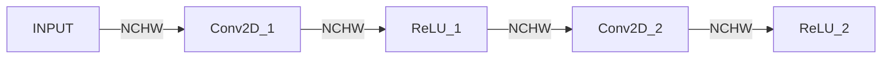
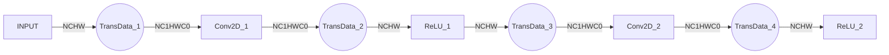
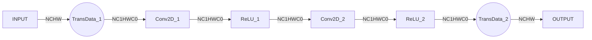

# GE 中的 Format 建模与接口语义解析

## 1. 为什么格式（Format）会成为性能问题

在深度学习模型中，用户在构造计算图时，关注的通常是**计算语义本身**：张量的维度、算子的数学含义，以及算子之间的依赖关系等等。

在这一层面，数据“长什么样”往往被认为是显而易见的，并不需要额外关心。然而，当模型进入实际执行阶段，这种“理所当然”的假设往往不再成立。

### 1.1 用户语义与实际执行之间的差距

从用户视角看，一个张量只是一组有序的多维数据；而从执行视角看，这些数据需要以某种**具体的内存布局**存放，才能被硬件高效访问。格式（Format）在 GE 中表示的正是这种内存布局。在业界的图编译器中，这一概念通常也被称为 Layout。例如，NCHW 与 NHWC 在 GE 中即属于两种不同的格式。

不同的计算算子，对格式往往有着**不同的偏好**，例如：

* 对于 Conv2D 算子，亲和的图片输入格式是 NC1HWC0，亲和的 filter 输入格式是 FZ
- 对于 MatMul 算子，亲和的权重输入格式是 NZ

这些差异并非来自算法本身，而是源于**底层硬件架构的实现特点**。

### 1.2 数据重排的代价并不“免费”

当算子存在亲和格式时，GE 通常需要插入额外的**数据重排**操作，将输入转换为该算子更适合计算的格式。然而，这类数据重排在性能上并不廉价：

- 会引入额外的计算开销与内存带宽消耗
- 在复杂模型中可能被多次触发

更重要的是，这些数据重排往往**不会出现在用户显式构造的计算图中**，却会直接影响模型的实际执行效率。

### 1.3 这是一个系统性问题

一个直观的想法是：

> 既然某些算子对数据布局更敏感，那就由算子各自处理好输入输出的格式即可。

但在工程实践中，这并不是最优解。以一个多层卷积网络为例：



如果算子“各自为政”，Conv2D 会在内部将输入从 NCHW 转换为 NC1HWC0，完成计算后再将输出转换回 NCHW。此时，实际的执行过程将演化为：



对于单个 Conv2D 算子而言，通过数据重排使用亲和格式可以获得更优的计算性能；但从整个网络来看，TransData 在每一层反复出现，显著增加了整体执行开销。

因此，格式相关的问题本质上是一个**整网级别的系统优化问题**：在保证计算语义正确的前提下，需要为不同算子选择合适的数据布局，并尽量减少不必要的数据转换。

也正是在这样的背景下，GE 引入了一套**统一的格式建模与优化机制**，以系统性地处理用户语义与实际执行之间的差距。

## 2. Origin 与 Storage：GE 中的两套表示体系

为了解决上一章中提到的数据布局与性能问题，GE 在内部对张量的表示进行了明确区分，引入了两套相互关联、但职责不同的表示体系：**Origin** 与 **Storage**。

这两套表示分别用于刻画用户的原始语义，以及算子实际执行时的数据形态，是 GE 进行格式建模与优化的基础。

### 2.1 Origin：用户语义的表达与传播

Origin 用于描述**用户在构造计算图时所表达的原始语义**，包括：

- OriginFormat：张量在语义层面的格式描述，例如 NCHW
- OriginShape：张量在语义层面的维度信息，例如 [8, 3, 224, 224]

Origin 的来源通常是前端框架或用户显式给出的模型定义，其核心特点是：

- **直接反映用户意图**  
- **不包含任何针对具体硬件或实现的假设**  
- **不以性能为目标进行调整**

当 GE 接受到一张计算图时，Origin 通常由图的输入以及部分关键算子的属性**显式给出**（如 Conv2D 通过属性标注自己的输入、输出格式）。GE 会尽可能将 Origin 在整个计算图中传播，其目的并非用于性能优化，而是为了在整个编译过程中**始终保留对用户原始计算语义的完整理解**。

这种传播机制为后续的优化提供了一个明确的语义边界，使得任何形式的格式调整或执行优化，都必须建立在**不破坏 Origin 语义**的前提下进行。

### 2.2 Storage：实际计算与存储的表示

与 Origin 不同，Storage 用于描述张量在**实际执行阶段**所采用的表示形式，包括：

- StorageFormat：张量在内存中的具体布局方式，例如 NCHWC0，将 C 轴拆分为 C0、C1

- StorageShape：张量在内存中的实际形态，例如 Shape 为 [8, 3, 224, 224] 的 NCHW 格式，转换为  NC1HWC0 后，Shape 为 [8, 1, 224, 224, 16]

Storage 并非由用户指定，而是由 GE 在编译过程中根据多种因素综合推导得到，例如：

- 算子的能力与限制
- 不同算子对格式的亲和性  
- 全图范围内的数据流关系

由于并非所有算子都支持所有格式，Storage 的推导过程天然受到约束。例如，某些格式可能仅对特定算子或算子的特定输入（如权重）有效。

因此，Storage 表示的是一种**面向执行的工程选择**，其目标是在满足算子能力约束的前提下，尽量少插入格式转换（TransData），以获得整体更优的执行效率。

### 2.3 小结：Origin 与 Storage 的分工配合关系

在 GE 中，Origin 与 Storage 的分工配合关系可以概括为：

- Origin 正确定义用户语义，不参与性能取舍
- Storage 面向执行性能优化，但必须服从 Origin 语义

这种分工使 GE 能够在保证用户语义正确的前提下，对执行层面的 Format 进行灵活调整，优化性能。

## 3. Format 优化的基本原理

在明确了 Origin 与 Storage 两套表示体系之后，GE 所要解决的问题可以归结为两点：

1. 如何在整张计算图中，尽可能准确地理解用户对格式的原始语义  
2. 在此基础上，如何为算子选择合适的执行格式，以获得整体更优的执行效率  

围绕这两个问题，GE 的 Format 优化遵循一条清晰的原理路径：**先理解语义，再优化执行**。

### 3.1 基于 Origin 的整图格式语义推导

Format 优化的第一步，并不直接涉及性能，而是尽可能**还原并理解整张计算图中的格式语义**。

GE 会以计算图的输入格式，以及对格式敏感的算子（例如 Conv2D，在计算时必须明确输入格式）作为锚点，在计算图中向前、向后进行扩散，尝试推导出各个算子输入与输出的 OriginFormat。

这一过程的目标是尽可能扩大对用户原始格式语义的认知范围，为后续的优化提供可靠的语义基础。

### 3.2 格式语义推导的中断与不确定性

在实际计算图中，并非所有算子都能够保持格式语义的连续传播。

当遇到改变张量维度语义的算子（例如 Reshape）时，原有的格式语义往往不再成立。此时，GE 会认为格式语义在该位置发生中断，并将 Reshape 对端的格式标记为未知（通常以 ND 表示）。

这种“中断”并不是失败，而是对语义边界的主动标记，避免在不具备充分信息的情况下，对格式做出错误推断。

### 3.3 基于算子能力的 StorageFormat 选择与扩散

在完成整图范围内的 OriginFormat 推导之后，GE 才进入**执行层面的格式选择阶段**。

此时，Format 优化的关注点从“语义是否正确”转向“如何获得更优的执行效率”。StorageFormat 的选择并不是对 OriginFormat 的直接映射，而是需要综合考虑以下因素：

- 算子对执行格式的支持能力  
- 不同算子对特定格式的亲和性  
- 全图范围内的整体执行效率  

在这一阶段，GE 始终遵循一个前提：**不破坏已经确认的 Origin 语义**。

由于不同算子对整体性能的影响并不均衡，GE 会优先关注计算开销较大的算子（例如卷积、矩阵乘法），尽量为这些算子选择其更亲和的 StorageFormat。在关键算子确定执行格式后，GE 再以其为中心，结合上下游相邻算子的能力与约束，对 StorageFormat 进行扩散与协调，避免在关键路径上引入不必要的格式转换。

以第 1.3 节中的计算图为例，在完成 OriginFormat 推导后，Format 优化会以计算开销较大的算子 Conv2D 为锚点，选择其亲和的 StorageFormat（NC1HWC0）。由于其后的 ReLU 算子同样支持 NC1HWC0，格式可以沿计算路径向后扩散并保持一致，最终得到如下的执行格式布局：



### 3.4 Shape 与 Format 在推导过程中的分工

在 GE 中，Shape 与 Format 的推导承担着不同的角色。

OriginShape 的推导遵循图编译器中常见的 InferShape 过程：  它以计算图的输入 Shape（即用户理解的 Shape）为起点，按照算子语义自前向后逐层推导，直至图的输出。

与之不同，StorageShape 并不是独立推导的结果。  当 OriginShape、OriginFormat 与 StorageFormat 均已确定后，StorageShape 可以自然地根据 StorageFormat 所对应的内存排布方式计算得到。

这种分工将 Shape 的语义推导与执行层的 Tensor Format 解耦，使格式优化能够在不干扰语义推导的前提下独立进行。

## 4. 从 GE 对外 API 视角理解 Format/Shape 的接口与类型

本章从 GE 对外 API 的视角，说明 Format / Shape 在接口与类型层面如何表达，并解释“概念 ↔ 类名”之间可能产生的理解偏差。

### 4.1 接口层：GetShape / GetOriginShape / GetStorageShape

在对外接口中，Shape / Format 通常会提供三类访问接口：

- `GetOriginShape()` / `GetOriginFormat()`
- `GetStorageShape()` / `GetStorageFormat()`
- `GetShape()` / `GetFormat()`

其中：

1. `GetOrigin*()` 明确返回 **Origin** 视角的信息，用于表达用户语义。
2. `GetStorage*()` 明确返回 **Storage** 视角的信息，用于描述实际执行相关的信息。
3. `Get*()`（不带 Origin / Storage 前缀）**不显式指定视角**，因此返回的是“同时包含 Origin 与 Storage 两部分的信息”。

换句话说，`GetShape()` 的含义并不是“只返回某一种 Shape”，而是返回一个能够同时表达 Origin 与 Storage 的对象；Format 相关接口同理。

这种接口设计的价值在于：

- 需要语义信息时，调用方可以显式使用 `GetOrigin*()`
- 需要执行信息时，调用方可以显式使用 `GetStorage*()`
- 若调用方希望一次性获得完整描述，则使用 `Get*()`

### 4.2 类型（class）层：Shape / StorageShape / StorageFormat 的职责边界

#### 4.2.1 Shape：纯数据结构，不绑定语义

`Shape` 是一个单纯的数据结构类，只负责表达“一个 shape”。  
因此：

- `Shape` 可以用来承载 OriginShape  
- `Shape` 也可以用来承载 StorageShape  

是否属于 Origin 还是 Storage，取决于其**使用语境**以及由哪个接口返回，而不是 `Shape` 类型本身的属性。

#### 4.2.2 StorageShape / StorageFormat：携带 Origin 与 Storage 的描述体

从概念上看，“StorageShape”“StorageFormat”很容易被理解为仅描述执行阶段的信息；但在 class 体系中，这两类对象实际承担的是更强的职责——**它们都是同时携带 Origin 与 Storage 两部分信息的复合描述体**。

之所以需要将 Origin 与 Storage 绑定在同一个类型中，根本原因在于 Storage 本身的复杂性。Storage 可能引入补维、对齐等规则，从而使得仅有“执行阶段的 shape / format”，不足以准确描述其与用户语义之间的对应关系。

以 NC1HWC0 格式为例，当看到一个形如 `[8, 1, 224, 224, 16]` 的 Tensor 时：

- 其 StorageFormat 为 NC1HWC0  
- 其 OriginFormat 既可能是 NCHW，也可能是 NHWC  
- 其 OriginShape 中的 C 维度，可能是 1～16 之间的任意值  

仅从执行阶段的 StorageShape 或 StorageFormat，无法唯一还原其对应的语义含义。只有将 Origin 与 Storage 两部分信息同时绑定，才能形成一个可解释、可稳定使用的完整描述。

因此，在对外 API 的语境中：

- `StorageShape` 与 `StorageFormat` 更接近于 **描述体（Descriptor）**  
- 它们通过 `GetOrigin*()` / `GetStorage*()` 提供对不同视角的显式访问  
- 类型本身承担的是“绑定与封装”的职责，而非对单一概念的直接映射

### 4.3 关于类名歧义的说明与建议

确实会有人将 `class StorageShape`（类型名）与“StorageShape 概念”（执行 shape）混淆。这种混淆来自命名上的天然缺陷，但从建模角度看，该类实际承担的是“同时携带 Origin 与 Storage 的完整描述”。

在实践中，建议**总是通过接口来判断获得了什么，而不是通过 class**。未来，在不破坏现有接口兼容性的前提下，也可以通过更明确的类型命名来降低理解成本，例如：

```C++
class ShapeDescriptor {...};
using StorageShape = ShapeDescriptor; // Deprecated： 容易混淆，不再推荐使用

class FormatDescriptor {...};
using StorageFormat = FormatDescriptor; // Deprecated: 容易混淆，不再推荐使用
```

## 附录 A：同一个 Tensor 在 Origin / Storage 视角下的对照示例

下表以一个具体示例说明：**同一个 Tensor，在不同视角下所表达的信息是如何不同的，以及为何需要“描述体”类型来同时承载这些信息。**

| 视角    | 接口                 | 示例内容                                         | 说明                         |
| ------- | -------------------- | ------------------------------------------------ | ---------------------------- |
| Origin  | `GetOriginFormat()`  | NCHW                                             | 用户语义上的格式             |
| Origin  | `GetOriginShape()`   | [8, 3, 224, 224]                                 | 用户理解的 Shape             |
| Storage | `GetStorageFormat()` | NC1HWC0                                          | 实际执行使用的格式           |
| Storage | `GetStorageShape()`  | [8, 1, 224, 224, 16]                             | 执行阶段的内存形态（含补维） |
| 复合    | `GetFormat()`        | {Origin=NCHW, Storage=NC1HWC0}                   | 同时携带语义与执行信息       |
| 复合    | `GetShape()`         | {Origin=[8,3,224,224], Storage=[8,1,224,224,16]} | 完整的 Shape 描述体          |
