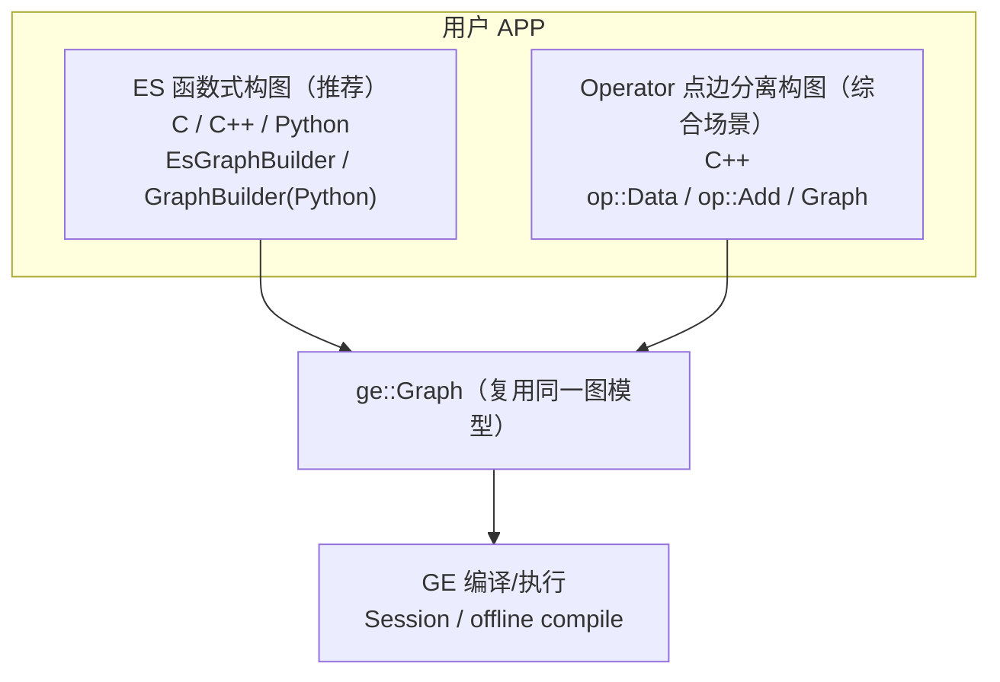
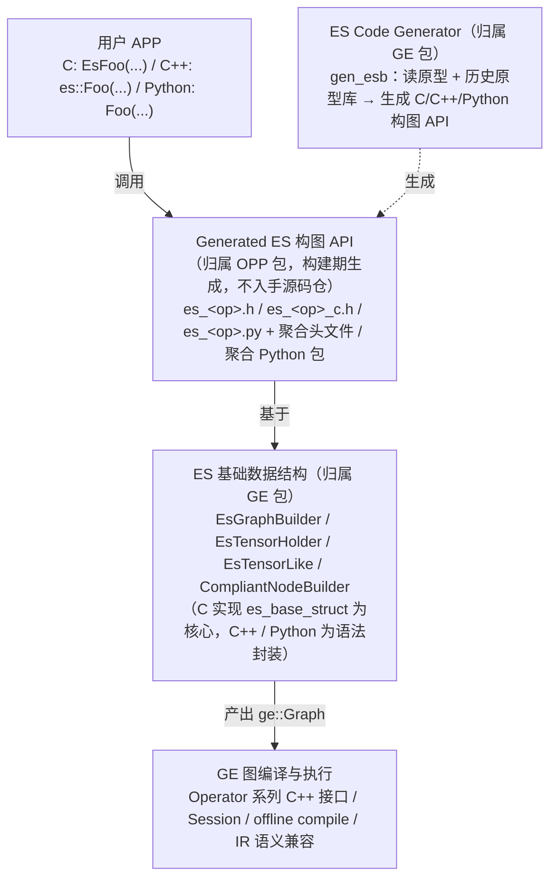
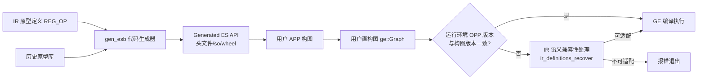

# ES (Eager Style) 构图 API 特性分析

## 1. 特性背景

### 1.1 为什么需要 ES

在 GE（Graph Engine）的传统构图体系中，用户通过 **Operator 系列接口**（`op::Data`、`op::Add` 及 `set_input_x`/`set_attr_x` 系列）以"点边分离"的方式构建计算图：先基于算子原型（IR）实例化 Operator 对象，再逐一设置输入、输出与属性，最后组装为 `ge::Graph`。该方式灵活、功能强大，是改图、遍历图等综合场景的基础能力，但作为纯构图接口存在明显痛点：

- **使用繁琐**：需感知原型的完整定义并逐项设置，代码量大；
- **犯错不易察觉**：连边、属性错误往往推迟到图编译阶段才暴露；
- **无兼容性保障**：C++ 接口无 ABI 兼容承诺，亦无前后向兼容设计。

业界主流构图接口（PyTorch Eager 等）普遍采用**函数式风格**——通过函数调用直接表达节点间的连边关系，简单且可在编译期暴露错误。GE 由此推出 **ES（Eager Style）构图 API**：一套语法类似 PyTorch Eager 脚本的**函数风格构图接口**，其核心理念是**通过函数调用直接表达连边关系与 IR 信息传递**。关于 ES 的定义与定位，详见 [ES_definition.md](../../user_guides/graph_dev/es_graph/ES_definition.md)。

### 1.2 设计哲学：忠实于 IR、生成而非手写

ES 的核心思想可以概括为两句话——**API 是 IR 的忠实映射；实现是生成的而非手写的**。

- 每个 IR 原型映射为一个同名的构图函数：函数参数依次对应算子输入与属性，返回值对应输出；函数体内部基于 `EsGraphBuilder` 完成节点创建与连边，复用 GE 既有 `Graph`/`GNode` 数据结构，不引入第二套图模型；
- 全部算子级构图 API 由代码生成器 `gen_esb` 读取算子原型自动生成，避免手写数千个算子的接口封装，从源头保证一致性与可维护性。

这种设计带来的直接收益是：

- 用户以 `add = data0 + data1` 的直觉方式构图，兼具运算符重载、数值直传等易用性能力；
- IR 变更时仅需重新生成，无需人工同步；
- 多语言（C / C++ / Python）能力天然一致。

### 1.3 设计目标

| 目标 | 说明 |
|------|------|
| 易用 | 函数式风格，代码量显著少于点边分离方式，具备一定防呆能力 |
| 多语言 | 原生支持 C、C++、Python 三种语言，风格一致 |
| 自动生成 | 基于算子原型 + 少量人工标注自动 CodeGen，随算子包（OPP）发布 |
| API/ABI 兼容 | 升级/降级 CANN 版本后，不使用新能力的 APP 无需改代码即可编译、运行 |
| IR 语义兼容 | 构图版本与运行环境 IR 版本不一致时，由 GE 自动适配语义 |

---

## 2. 历史背景与约束场景

ES 并非一套可以自由演进的独立接口：与其交互最密切的组件是**算子组件**（算子仓 / 算子包 OPP），多个关键设计决策来自跨组件协同的**隐形约束**。理解这些约束，才能理解 ES 的演进边界、哪些场景不应使用 ES，以及 IR 变更时的适配范围。

### 2.1 已有 public API 不可修改

ES 的对外 public API 一经发布即**不可修改**，原因有二：

- **external 属性**：ES 的 API 是对外发布的 external 接口，外部使用方（APP、算子仓的 pass 等）会直接依赖既有符号与签名；
- **算子包独立升降级**：算子包与 GE 包支持独立升降级，若 ES 修改已有 API，升降级后算子包将找不到匹配的 ES 符号，直接导致算子包不可用。

### 2.2 新增 API 需满足兼容周期

ES 可以**新增** API，但算子仓侧调用新增 API 需满足兼容周期要求——一般为 API 发布**一年之后**才允许调用。原因同样是算子包独立升降级：新的算子包必须能配合兼容窗口内的老 GE 包运行，而老 GE 包中尚不存在新增 API 对应的符号；一年窗口过后，存量无该符号的老 GE 包退出支持范围，新 API 才可被算子仓安全调用。

该约束与第 7 章"CANN 兼容性要求：商发接口发布后向后兼容一年、向前兼容一年"一脉相承，是总体兼容性要求在 ES ↔ 算子组件协同上的具体体现。

### 2.3 CompliantNodeBuilder 的 v1/v2 接口与 codegen 的 ABI 约束

`CompliantNodeBuilder` 所在的 `compliant_node_builder.h` 中同时存在两套 IR 定义接口：

- **v1 接口**（`IrInputDef` / `IrOutputDef` / `IrAttrDef`）：老接口，结构体中包含 `std::string` 字段，**非 ABI 安全**；
- **v2 接口**（`IrInputDefV2` / `IrOutputDefV2` / `IrAttrDefV2`）：后续提供的 **ABI 安全** 接口，以 `char_t*` 表达字符串，规避 `std::string` 布局随编译器 ABI 配置差异的问题。

当前 ES codegen 生成的代码仍调用 **v1 接口**，这同样是独立升降级约束所致：新生成的算子包 ES API 若依赖 v2，配合兼容窗口内的老 GE 包（其中尚无 v2 定义）运行将找不到符号。当前通过**统一内部 GE 与算子组件的 ABI 标准**（如 `_GLIBCXX_USE_CXX11_ABI`，`generate_es_package.cmake` 已固定设置）来规避 v1 接口的 ABI 风险；待 v2 接口发布满一年兼容窗口后，codegen 可切换为调用 v2 系列接口。

由于 codegen **不区分外部用户调用与内部算子调用**，对外部用户的衍生约束是：若使用算子包内置的 ES 构图接口（链接 `libes_<module>.so`），用户的编译 target 需与 CANN 内部保持相同的 ABI 标准，否则可能因 `std::string` 布局不一致引发未定义行为。

### 2.4 场景边界：ES 定位构图、不负责改图

- ES 的 API 目前发布在算子包（OPP）中，**定位是构图**。典型使用者是新的 Pattern 匹配 Pass 机制（`PatternFusionPass` 体系）：在 pattern 定义中构造匹配模板图、在 `Replacement` 中构造替换图；
- ES **不负责改图**。改图场景（非"图匹配-替换"的新 Pass 机制、老 Pass 直接遍历并修改图）不应使用 ES，应继续使用GNode等点边分离接口；两种方式可经 `GetProducer` 桥梁互通（见 3.2）。

### 2.5 ES API 数量依赖算子包及缺失 API 的处理

ES 算子级 API 的数目取决于对应算子包中算子支持的个数——原型在算子包中存在，才有对应的 ES API。发现缺失 ES API 时：

- **一般路径**：推动算子开源仓补齐缺失的 API（原型补齐后随包重新生成）；
- **合理缺失场景**：Pattern Pass"匹配老节点、替换为新节点"时，替换引入的新算子只存在于编译期的替换图中，**执行期并不存在**对应的算子，此时算子包不提供该算子原型及 ES API 是合理的。但构造替换图又确需该 ES API，**推荐做法**是：
  1. 使用 `generate_es_package.cmake` 提供的 `add_es_library`，通过 `OPP_PROTO_TARGET` 传入自构造的临时原型 so，为该（批）算子生成 ES API；
  2. 将 ES API 产物**静态链接**到 pass 的 target 上；
  3. 算子包仅打包 pass 的 target，**不打包**对应的头文件、py 文件等 ES 产物。

  具体用法参见 [generate_es_package_cmake_readme.md](../../user_guides/es_graph/tools/generate_es_package_cmake_readme.md)，工程实践可参考 GE 仓依赖 `es_ut` 接口的 UT 工程 `tests/ge/ut/ge/graph/eager_style_graph_builder/graph_construction_test`（以 `stub_geir_ops` 临时原型库生成 `es_ut_test`）。

### 2.6 演进中：必选变可选的兼容性判定待适配

ES 历史原型生成 C++ 重载接口时，会对原型变化是否兼容做校验（`overload_planner` 的 `AnalyzeDiff`，见 6.3）。当前认定兼容的变更限定为**新增可选输入、新增带默认值的可选属性**，且版本链上要求 required 标记严格一致。目前有算子频繁提出"**必选变可选**"（required → optional）也应视为兼容场景。该诉求若最终评审通过，ES 需同步适配两处：

- `overload_planner` 的兼容性判定与重载规划：放宽 `DiffInputs`/`DiffAttrs` 中 required 标记的比较，并同步调整合并安全性与基线生成策略（代码中已以 `TTODO(es_compat)` 标注）；
- IR 语义兼容处理 `ir_definitions_recover.cc` 中的判断逻辑（见 6.5）：前向/后向兼容的判定与补齐/删除规则需覆盖 required → optional 场景。

---

## 3. 用户使用场景

### 3.1 典型使用场景

| 场景 | 说明 |
|------|------|
| **纯构图（推荐函数式）** | 离线建模、快速搭建验证图、Transformer 级大图搭建 |
| **Python 全流程** | Python 构图后直接经 `ge.Session` 编译执行，形成闭环 |
| **C/C++ 轻量集成** | C 应用通过不透明指针接口构图，C++ 应用享受运算符重载与 RAII |
| **自定义算子工程** | 自定义算子（含 AscendC）复用 ES 生成器为自有算子生成构图 API |
| **改图/遍历图** | 综合场景仍建议使用 Operator 系列点边分离接口，两者可经 `GetProducer` 等桥梁互通 |

### 3.2 与传统构图入口的关系



ES 与 Operator 系列接口产物均为 `ge::Graph`，用户可按场景自由选择，亦可混合使用：ES 构图过程中可通过 `EsTensorHolder::GetProducer` 取回 `GNode`，切换到点边分离方式继续改图。

多语言样例覆盖控制边、控制算子、动态输入/输出、可选输入、普通/私有属性、运算符重载、Transformer、集合通信（HCCL）等场景，参见 [examples/es](../../../../examples/es/README.md)；为自有算子自定义生成 ES API 的样例参见 [examples/custom_es_api](../../../../examples/custom_es_api/README.md)。

---

## 4. 对外接口

### 4.1 接口分层

ES 的接口分为两层：**基础数据结构层**（`EsGraphBuilder`、`EsTensorHolder` 等，随 GE 包交付）与**生成的算子构图 API 层**（`Add`、`MatMul` 等，随 OPP 包交付）。

### 4.2 C 接口（基础结构）

定义在 `inc/external/ge/eager_style_graph_builder/c/esb_funcs.h`，实现位于 `compiler/graph/eager_style_graph_builder/es_base_struct/esb_funcs.cc`。核心接口：

```
EsCreateGraphBuilder(name)                     → 创建图构建器 EsCGraphBuilder
EsDestroyGraphBuilder(builder)                 → 销毁构建器及其管理的全部过程资源
EsCreateGraphInput(builder, index)             → 添加第 index 个图输入（Data 节点）
EsCreateConstInt64/Int32/UInt64/UInt32/Float   → 创建指定 dtype 的常量节点
EsCreateVectorXxx / EsCreateScalarXxx          → 创建向量 / 标量常量
EsCreateVariable(builder, index, name)         → 创建变量节点
EsCreateEsCTensor / EsCreateEsCTensorFromFile  → 创建 Tensor 类型属性的载体
EsBuildGraphAndReset(builder)                  → 结构图，产出 EsCGraph
EsSetOutput(tensor, index)                     → 设置图输出
EsAddControlEdge(dest, srcs, num)              → 设置控制边
EsSetInt64/String/BoolAttrForGraph|Tensor|Node → 设置图级/张量级/节点级私有属性
```

C 接口对象（`EsCGraphBuilder`、`EsCTensorHolder`、`EsCGraph`）均为**不透明指针**，仅以前置声明暴露，内部结构不可见，只能通过 ES 接口操作——这是 C 侧 ABI 稳定性的基础。

### 4.3 C++ 接口（基础结构）

定义在 `inc/external/ge/eager_style_graph_builder/cpp/` 目录：

- `es_graph_builder.h`：`EsGraphBuilder`，构图辅助类，提供 `CreateInputs<N>`、`CreateScalar`、`SetOutput`、`BuildAndReset` 等方法；
- `es_tensor_holder.h`：`EsTensorHolder`，算子输出/图节点的轻量持有者，提供 `GetProducer`（取回 `GNode`）、`AddControlEdge`、`SetAttr`/`SetAttrForNode`；
- `es_tensor_like.h`：`EsTensorLike`，数值输入包装类，将标量/向量归一化为 `EsTensorHolder`（自动创建 Const 节点）；
- `compliant_node_builder.h`：`CompliantNodeBuilder`，兼容性节点构建器（详见 6.4）。

C++ 层为**纯头文件 + 强制内联（FORCE_INLINE）**实现，直接调用底层稳定 C 接口，链接期无独立符号依赖。

### 4.4 Python 接口（基础结构）

定义在 `api/python/ge/ge/es/` 目录：

- `graph_builder.py`：`GraphBuilder`，提供 `create_input(s)`、`create_const_*`、`create_scalar_*`、`create_variable`、`set_graph_output`、`build_and_reset`，以及 `set_graph_attr_*` / `set_tensor_attr_*` / `set_node_attr_*`；
- `tensor_holder.py`：`TensorHolder`，支持 `+`/`-`/`*`/`/` 运算符重载与控制依赖设置；
- `tensor_like.py`：数值直传支持（标量与嵌套列表归一化）；
- `_plugin_loader.py`：基于 `ge.es.plugins` entry points 的插件加载（见 6.6）。

### 4.5 生成的算子构图 API

每个 IR 原型映射规则如下（详见 [ES_definition.md](../../user_guides/graph_dev/es_graph/ES_definition.md) 的映射章节）：

- **函数名**：IR 类型名（C++/Python 为 `Foo`，C 为 `EsFoo`）；
- **参数**：依次为输入（`EsTensorHolder`/`EsTensorLike`）与属性（C++ 以默认参数表达可选属性，Python 以关键字参数表达）；
- **返回值**：单输出返回 `TensorHolder`，多输出返回与输出名同名的结构体；
- **动态输入/输出**：以指针数组/`vector` + 计数表达，动态输出个数由用户显式指定或经注册的推导规则获得；
- **产物拆分**：每个算子一个 `es_Foo.h` / `es_Foo_c.h` / `es_Foo.py`，并提供 `es_all_ops.h` / `es_all_ops_c.h` / `es_all` 聚合入口。

### 4.6 资源管理约束

- 构图期间所有中间资源（`EsCTensorHolder`、动态输出、传入的 Tensor 属性与子图）由 `EsCGraphBuilder` 统一持有，随构建器销毁释放；用户仅需管理 `EsCGraphBuilder*` 与最终 `EsCGraph*` 两个对象；
- `Tensor` 类型属性与子图在传入接口后**所有权转移**给构建器，传入后不可再操作；
- 构建器只在构图阶段存在：`BuildAndReset` 后内部状态封装为 `Graph` 返回，构建器及过程资源释放。

---

## 5. 整体架构

### 5.1 三大组件



### 5.2 数据流总览



构造可用的 GE 图整体分为两个阶段：

1. **构图阶段**：用户 APP 依赖构建环境的 OPP 版本完成构图，得到"用户直构图"；
2. **IR 语义兼容性处理阶段**：当运行环境 OPP 版本与构图版本不一致时，GE 基于构图时 IR 版本解析直构图语义，尝试调整为符合运行环境能力的"兼容图"；无法完成转换时返回错误终止。

### 5.3 分层封装策略

`es` 以 **C 语言实现为核心**，向上封装为 C++ 与 Python：

- 共用能力（兼容性保障、公共构图函数、资源管理）集中在 C Builder 层（`es_base_struct`）；
- C++ 层是纯头文件的语法封装（RAII、重载、默认参数、运算符重载）；
- Python 层基于 C 动态库以 ctypes 封装，不引入额外依赖；
- 三语言对同一 C 核心的封装，保证了**多语言行为一致**与**实现单点维护**。

---

## 6. 核心实现

### 6.1 es_base_struct：C 核心与生命周期管理

实现位于 `compiler/graph/eager_style_graph_builder/es_base_struct/`，是整套 ES 的单点核心：

- `es_c_graph_builder.cc`（`EsCGraphBuilder`）：内部持有 `graph_`（`ge::Graph`）与 `resource_holder_`（`std::list<std::unique_ptr<ResourceHolder>>`）。`ResourceHolder` 由资源指针与自定义 deleter 组成，统一管理算子接口返回的 `EsCTensorHolder`、动态输出、用户传入的 Tensor 属性与子图，随构建器析构统一释放；
- `es_c_tensor_holder.cc`（`EsCTensorHolder`）：仅持有对所属构建器的引用、`producer_`（`ge::GNode`）与输出索引，不拥有资源；
- `es_tensor_like.cc`（`EsTensorLike` 实现）：从输入参数中解析所属构建器，将数值归一化为常量节点；
- `esb_funcs.cc`：C 函数入口，负责参数校验与错误码转换。

构图 API 的生成代码调用 `CompliantNodeBuilder` 完成 Operator 实例化与连边（复用 `Graph::AddEdge` 等既有接口），不另建连边机制。

### 6.2 es_generator：gen_esb 代码生成器

实现位于 `compiler/graph/eager_style_graph_builder/es_generator/`，工具入口 `main.cc`，生成流程由 `gen_esb.cc` 编排：

1. **原型收集**：`GeIrCollector::CollectAndCreateAllOps` 从 `ASCEND_OPP_PATH` 指向的算子包加载全部原型并按类型排序；
2. **生成器管理**：`GeneratorManager` 统一调度四类生成器——`CGenerator`（C 接口与实现）、`CppGenerator`（C++ 内联封装与重载版本）、`PyGenerator`（Python 模块）、`UtilsGenerator`（公共辅助代码）；
3. **兼容性输入**：`CppGenerator` 额外消费"历史原型库"，结合当前版本与历史版本差异生成满足兼容性要求的函数签名与重载集合；
4. **产物输出**：按算子粒度生成头文件/源文件与聚合文件。

工具支持两种模式：**代码生成模式**（生成三语言构图 API）与**历史原型库生成模式**（将当前版本原型登记入历史库）。使用方法详见 [gen_esb.md](../../user_guides/es_graph/tools/gen_esb.md)。

### 6.3 历史原型库与 C++ 重载规划

`es_generator/history/` 子目录实现了兼容性生成的核心机制（协议说明见 [history_op_registry_protocol.md](../modules/es_graph/design/history_op_registry_protocol.md)）：

- `history_registry_reader/writer/interface`：历史原型库的结构化读写，按商发版本记录全部历史原型定义；
- `ir_proto_codec`：原型信息的编解码；
- `overload_planner`：对比当前与历史 IR，规划需要生成的 C++ 重载版本集合——重载的目的是**兼容性保障**而非调用便利（同时新增多个可选输入只引入一个新重载版本）；
- `ambiguity_checker`：校验生成的重载集合无二义性；
- `default_value_policy` / `attr_type_traits`：默认值（含浮点容差）与属性类型处理策略。

构建集成由 `generate_es_package.cmake` 完成，采用**单文件模式**：清理目录 → 调用 gen_esb 生成 → 汇总写入 `all_in_one.cpp` → 一次编译为 `libes_<module>.so` 并同步构建 Python wheel，避免多文件管理与竞态问题。

### 6.4 CompliantNodeBuilder：可选性与容差判定

`CompliantNodeBuilder`（`compliant_node_builder.h/.cc`）服务于兼容性语义的判定基础：

- **可选属性"是否配置"判定**：若传入值与 IR 默认值一致则视为未配置（该状态供后续语义兼容流程使用）；
- **浮点容差比较**：浮点属性以绝对误差容差（约 `1e-5`）判定是否等于默认值，规避浮点表示误差导致的"已配置"误判；
- 提供 `CreateFrom`、`ValuesEqual` 等模板工具，将任意类型统一转换为 `AttrValue` 并完成相等性比较。

该头文件同时提供 v1（非 ABI 安全）与 v2（ABI 安全）两套 IR 定义接口，codegen 当前仍生成 v1 调用，演进背景与约束见 2.3。

### 6.5 IR 语义兼容处理

当静态链接的 APP 构图版本与运行环境 IR 版本不一致时，兼容性处理由 GE 编译链路承接，核心实现在 `graph_metadef/graph/ir/ir_definitions_recover.cc`（`RecoverIrUtils`）：

- 仅依赖两版本 IR 定义间的**结构差异**判定兼容性，无需感知版本号或兼容方向；
- 支持的兼容性变更限定为：新增可选输入、新增带默认值的可选属性、新增支持的数据类型；
- 处理规则：直构图使用了兼容图中不存在的能力 → 报错退出；未使用新增能力 → 删除多余属性/输入或按默认值补齐；
- 若直构图 IR 相对兼容图同时存在新增与缺失项，说明发生过不兼容修改，直接终止。

完整规则表与场景分析见 [architecture_design.md](../modules/es_graph/design/architecture_design.md) 的"IR 语义兼容设计"章节。

### 6.6 Python 封装与插件机制

- **ctypes 封装**：`api/python/ge/ge/_capi/pyes_graph_builder_wrapper.py` 对 `libesb`（基础结构库）与各生成库（如 `libes_math`）声明函数原型（argtypes/restype），`GraphBuilder`/`TensorHolder` 仅做句柄持有与方法转发；
- **所有权反转**：Python 层 `TensorHolder` 强引用 `GraphBuilder`（`_builder` 字段），与 C++ 层"构建器持有 Holder"的方向相反，用于防止构建器被 GC 后底层句柄悬空。设计分析见 [ownership_analysis.md](../modules/es_graph/design/ownership_analysis.md)；
- **插件加载**：`_plugin_loader.py` 通过 `ge.es.plugins` entry points 发现并加载算子分包发布的 ES Python 包（如 `es_math`、`es_nn`），动态挂载到 `ge.es` 命名空间，用户 `import ge.es` 即获得全部已安装算子的构图函数；
- **作用域语法糖**：`GraphBuilder` 提供 `attr_scope`（节点级私有属性批处理）与 `control_dependencies`（控制依赖作用域）上下文管理器，支持嵌套叠加。

---

## 7. 兼容性设计

API/ABI 前后向兼容是 ES 的首要设计约束（CANN 兼容性要求：商发接口发布后向后兼容一年、向前兼容一年）。三语言策略：

| 维度 | C | C++ | Python |
|------|----|----|--------|
| 可选属性表达 | 固定参数列表，默认值信息不保留（传入值等于默认值视为未配置） | 默认参数 | 关键字参数 + 默认值 |
| 可选输入表达 | 与普通输入无差别，`nullptr` 表示未使用 | 重载版本 | 可选位置参数（`Optional[Tensor]=None`） |
| ABI 保障 | **静态链接** `libesb` 系列 `.a` 内联进 APP，编译期冻结 | 纯头文件 + FORCE_INLINE 调 C，无独立 ABI | 动态语言，天然无 ABI 问题 |
| 前向兼容风险 | C 函数签名不可变，推荐用户将 `libesb.a` 与头文件拷贝至工程 `third_party` | 误用新重载会破坏前向兼容，以 `std::nullptr_t` + `[[deprecated]]` 重载做编译期防呆 | 位置/关键字参数规则天然兼容扩展 |

C++ 重载机制的完整设计（含防呆机制的边界与 `esFooV2` 版本号方案的否定分析）见 [es_cxx_compatibility_design.md](../modules/es_graph/design/es_cxx_compatibility_design.md)。

---

## 8. 与传统构图方式的关键差异

| 维度 | Operator 点边分离构图 | ES 函数式构图 |
|------|----------------------|--------------|
| 风格 | 显式实例化 Operator 并逐项设置 | 函数调用即连边，支持运算符重载与数值直传 |
| 出错时机 | 部分错误推迟到图编译期 | 编译期（C/C++）/调用期即时暴露 |
| 语言 | C++ | C、C++、Python |
| 接口来源 | 手写维护 | 基于 IR 自动 CodeGen |
| ABI 兼容 | 无承诺 | C 静态链接 + C++ 内联 + Python 动态加载 |
| 灵活性 | 构图、改图、遍历图通用 | 面向纯构图场景，经 `GetProducer` 与传统方式互通 |
| 产物 | `ge::Graph` | `ge::Graph`（同一图模型） |

---

## 9. 关键文件索引

| 文件路径 | 职责 |
|---------|------|
| `inc/external/ge/eager_style_graph_builder/c/esb_funcs.h` | C 对外接口（构建器生命周期、常量创建、控制边、属性设置） |
| `inc/external/ge/eager_style_graph_builder/cpp/es_graph_builder.h` | `EsGraphBuilder` C++ 封装 |
| `inc/external/ge/eager_style_graph_builder/cpp/es_tensor_holder.h` | `EsTensorHolder` C++ 封装 |
| `inc/external/ge/eager_style_graph_builder/cpp/es_tensor_like.h` | `EsTensorLike` 数值输入包装 |
| `inc/external/ge/eager_style_graph_builder/cpp/compliant_node_builder.h` | `CompliantNodeBuilder` 兼容性节点构建 |
| `compiler/graph/eager_style_graph_builder/es_base_struct/es_c_graph_builder.cc` | `EsCGraphBuilder` 核心实现（资源统一管理） |
| `compiler/graph/eager_style_graph_builder/es_base_struct/esb_funcs.cc` | C 函数入口实现 |
| `compiler/graph/eager_style_graph_builder/es_generator/main.cc` | gen_esb 工具入口 |
| `compiler/graph/eager_style_graph_builder/es_generator/gen_esb.cc` | 生成流程编排（`CreateGenerators`/`CollectAndSortAllOps`） |
| `compiler/graph/eager_style_graph_builder/es_generator/ge_ir_collector.h` | 原型收集（`GeIrCollector`） |
| `compiler/graph/eager_style_graph_builder/es_generator/generator_manager.h` | 生成器调度（`GeneratorManager`） |
| `compiler/graph/eager_style_graph_builder/es_generator/c_generator.h` / `cpp_generator.h` / `py_generator.h` | 三语言代码生成器 |
| `compiler/graph/eager_style_graph_builder/es_generator/history/history_registry_reader.cc` | 历史原型库读取 |
| `compiler/graph/eager_style_graph_builder/es_generator/history/overload_planner.cc` | C++ 重载版本规划 |
| `graph_metadef/graph/ir/ir_definitions_recover.cc` | IR 语义兼容处理（`RecoverIrUtils`） |
| `api/python/ge/ge/es/graph_builder.py` | Python `GraphBuilder` |
| `api/python/ge/ge/es/tensor_holder.py` | Python `TensorHolder` |
| `api/python/ge/ge/es/_plugin_loader.py` | ES Python 插件（entry points）加载 |
| `api/python/ge/ge/_capi/pyes_graph_builder_wrapper.py` | ctypes 绑定声明 |
| `docs/zh/user_guides/es_graph/README.md` | ES 文档导航 |
| `docs/zh/user_guides/es_graph/api/es_cpp.md` | ES C/C++ 接口说明 |
| `docs/zh/user_guides/es_graph/api/es_python.md` | ES Python 接口说明 |
| `docs/zh/user_guides/es_graph/tools/gen_esb.md` | gen_esb 工具使用说明 |
| `docs/zh/user_guides/es_graph/tools/generate_es_package_cmake_readme.md` | `add_es_library` 使用指南（临时原型生成 ES API） |
| `docs/zh/design/modules/es_graph/design/architecture_design.md` | ES 架构设计（本特性分析的主要参考） |
| `docs/zh/design/modules/es_graph/design/es_cxx_compatibility_design.md` | C++ 兼容性专项设计 |
| `docs/zh/design/modules/es_graph/design/ownership_analysis.md` | Python/C++ 所有权关系分析 |
| `examples/es/README.md` | 多语言构图样例集 |
| `examples/custom_es_api/README.md` | 自定义 ES API 样例 |
