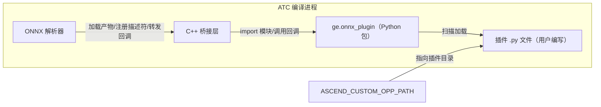

# ONNX 插件 Python 化设计文档

## 1. 概述

ONNX 插件 Python 化是 `ge` Python 包提供的 ONNX 自定义算子解析插件扩展能力：插件是一个 Python 文件，声明 ONNX 原始算子到 GE 目标算子的映射，并通过回调完成解析。插件在 ATC 编译 ONNX 模型的解析阶段被加载执行，不改变 ATC 的使用方式。

GE 通过 ONNX 解析器直接读取模型文件的 protobuf 内容完成图解析。模型中出现的自定义算子（导出方自定义、GE 未内置）默认无法接入，此前需要按 C++ 插件方式开发解析代码（对应 C++ 的 `ParseParamsFn`、`ParseParamsByOperatorFn`、`ParseOpToGraphFn` 注册方式，参见自定义算子开发指南的 [ONNX 入图](../../../user_guides/custom_op/custom_op_v2/custom_op_development_guide.md#64-onnx-入图) 章节）。Python 化之后，接入一个自定义算子只需编写一个 `.py` 文件，插件回调做两类事：

1. **参数解析**：把 ONNX 节点上的属性转写到 GE 算子上，使用 `parse_node` 或 `parse_operator` 回调；
2. **算子分解**：GE 没有现成算子时，用已有算子拼出子图替换原节点，使用 `decompose` 回调，无需编写设备 kernel。

本特性与 [GE Pass Python 化](ge_python_pass_design.md)、[自定义算子 Python 化](ge_python_custom_op_design.md) 同属 `ge` Python 包的三类插件扩展，加载与发现共用同一套机制（`ASCEND_CUSTOM_OPP_PATH` 环境变量），详见 [GE-PY Python 模块类关系文档](ge_python.md)。C++ ONNX 插件机制仍然可用，同一 origin type（见第 6.2 节）只能由一个插件提供。本特性全量芯片支持。

## 2. 版本约束

| 依赖 | 版本 | 说明 |
| ---- | ---- | ---- |
| Python | 3.12 | 临时要求：run 包编译时使用的 Python 版本，需要与执行插件的 Python 版本保持一致（即 ATC 编译进程使用的解释器） |
| onnx | 1.21.0 | 与[样例](../../../../../examples/onnx_plugin/README.md)实测口径一致；onnx 包仅在 PyTorch 导出 ONNX 模型（`torch.onnx.export`）链路使用，GE 解析器不依赖该包 |

Python 版本约束来自桥接产物的匹配机制：run 包内的桥接库与 native 模块按产物清单（`manifest.json`）记录 `python_tag`（如 `cp312`）、平台与 bridge ABI 版本；运行时从当前进程加载的 Python 符号读取版本号并计算 `python_tag`，仅加载与当前解释器标签一致的产物，找不到匹配产物时编译失败并报错 `No compatible ONNX Python plugin bridge artifact found for runtime ...`，报错透出到 ATC 控制台，包含当前解释器的 runtime key、可用产物清单（python tag、平台、bridge ABI 与产物路径）以及版本对齐或安装匹配 `ge` Python 包的修复指引。相关实现位于 `base/common/python_runtime/python_artifact_utils.h` 与 `parser/parser/onnx/python_onnx_plugin_bridge/onnx_plugin_bridge_loader.cc`。

因此，run 包使用 Python 3.12 编译时，执行 ATC 编译也必须使用 Python 3.12。约束解除前，请勿混用不同 Python 版本。

## 3. 整体架构

### 3.1 组件构成

| 组件 | 代码位置 | 职责 |
| ---- | -------- | ---- |
| Python 公共包 `ge.onnx_plugin` | `api/python/ge/ge/onnx_plugin/` | 描述符定义与校验、进程级注册表、插件扫描加载、回调分发、`OnnxNode` 绑定 |
| C++ 桥接层 | `parser/parser/onnx/python_onnx_plugin_bridge/` | 加载桥接产物、初始化 Python 运行时、把 Python 侧描述符注册进解析器、回调转发 |
| ONNX 解析器 | `parser/parser/onnx/onnx_parser.cc` | 逐节点解析时按 origin type 匹配已注册插件并触发回调 |



### 3.2 编译期运行链路

1. 用户设置 `ASCEND_CUSTOM_OPP_PATH` 指向插件目录，执行 ATC 编译 ONNX 模型；
2. ONNX 解析器初始化：环境变量各路径段中存在可加载的 Python 插件入口（`.py` 文件，或目录下单层非下划线开头的 `.py` 文件 / 含 `__init__.py` 的子目录）时，按 runtime key（`python_tag` + 平台 + bridge ABI）匹配并加载桥接库 `libge_python_onnx_plugin_bridge.so`，准备 Python 运行时；环境变量未设置、或指向纯 C++ 自定义算子目录（仅含 so、ini 等交付物，无任何 Python 插件入口）时不加载任何桥接代码，行为与不使用本特性完全一致。`ASCEND_CUSTOM_OPP_PATH` 同时也是 C++ 自定义算子的标准交付变量，仅交付 C++ 算子的环境不应被本特性阻断；
3. 桥接层进入 Python 解释器，import `ge.onnx_plugin._bridge`，调用 `load_and_get_onnx_plugin_descriptors()`：扫描插件文件并逐个 import 执行，插件代码中的 `onnx_plugin()` 调用把描述符写入 Python 进程级注册表；
4. 描述符列表回传 C++ 侧，每个 origin type 生成一条 `domi::OpRegistrationData` 注册（`FrameworkType` 为 ONNX，`OriginOpType` 为 `domain::opset::source`），按回调类型分别挂接参数解析或分解入口；
5. 解析每个 ONNX 节点时，非内置算子按 `<domain>::<opset>::<op_type>` 构造 origin type 查找注册项，命中后通过桥接层调用对应的 Python 回调；
6. 插件回调抛出 Python 异常或插件文件加载失败时，编译失败退出，默认报错（`E19999`）中包含 Python 侧的错误信息（异常类型、错误语句、插件文件与行号）。

## 4. 目录结构

```text
api/python/ge/ge/onnx_plugin/        // Python 公共包
├── __init__.py                      // 对外入口：导出 OnnxNode、OnnxPlugin、onnx_plugin
├── plugin.py                        // onnx_plugin() 工厂、OnnxPlugin 描述符、回调绑定与参数校验
├── registry.py                      // 描述符注册表（线程安全），按 descriptor_key 与 origin type 索引
├── bootstrap.py                     // 插件扫描加载入口（读取 ASCEND_CUSTOM_OPP_PATH）
├── _bridge.py                       // C++ 桥接调用入口：加载插件、分发三种回调
├── _native.py                       // 加载 native 模块，提供 OnnxNode
└── native_bindings/                 // OnnxNode 的 pybind11 绑定（封装 NodeProto 只读视图）

parser/parser/onnx/python_onnx_plugin_bridge/    // C++ 桥接层
├── onnx_plugin_bridge_c_api.h       // 桥接 C API：ABI 版本、注册器、回调表定义
├── onnx_plugin_bridge.cc            // 桥接实现：初始化、描述符注册、回调转发
├── onnx_plugin_bridge_loader.cc     // 产物加载：按 runtime key 匹配并 dlopen 桥接库
└── onnx_plugin_bridge_registrar.cc  // 把描述符注册进 ONNX 解析器的算子注册表
```

桥接库与 native 模块在构建期产出，按 `python_tag-平台` 目录组织在 run 包的 `ge/onnx_plugin/python_onnx_plugin_artifacts/` 下，源码目录中不存在。

## 5. 接口说明

完整接口说明见 [onnx_plugin API 参考文档](../../../api/graph_engine_api/python/ge/onnx_plugin/onnx_plugin.md)，本节只给出设计层面的要点。

### 5.1 onnx_plugin() 描述符工厂

```python
onnx_plugin(*, source: str, domain: str, opsets: Collection[int], target: str) -> OnnxPlugin
```

| 参数 | 含义 |
| ---- | ---- |
| `source` | ONNX 原始算子类型，如 `MyElu`。非空字符串，不允许包含 `:`（`:` 是 origin type 的字段分隔符，出现会导致 origin type 无法按 `<domain>::<opset>::<source>` 切分） |
| `domain` | 插件作者注册时显式声明的 domain，非空字符串，不允许包含 `:`（原因同上）。与模型文件中节点的 domain 字段含义不同，见第 6.3 节 |
| `opsets` | 支持的 ONNX opset 版本集合，元素为正整数，注册时去重并升序排列 |
| `target` | GE 目标算子类型，对应算子原型必须已安装并注册 |

参数校验在调用时立即执行：类型不合法抛 `TypeError`，取值不合法（如空集合、非正整数）抛 `ValueError`。`source`、`domain` 与 `opsets` 展开为一组 origin type（`domain::opset::source`，如 `example.domain::1::MyElu`）。

### 5.2 回调绑定方法

`OnnxPlugin` 描述符提供三个绑定方法（可直接作为装饰器使用），同一描述符可以绑定多个回调（如参数解析与分解并用），同一回调重复绑定抛 `ValueError`：

| 方法 | 回调签名 | 返回值约定 | 用途 |
| ---- | -------- | ---------- | ---- |
| `parse_node` | `(node: OnnxNode, target) -> None` | 必须返回 `None` | 按名字读取 ONNX 节点属性并写入目标算子，优先使用 |
| `parse_operator` | `(source, target) -> None` | 必须返回 `None` | 基于 Operator 整体解析属性；节点携带 tensor、子图等复合属性时只能使用本回调 |
| `decompose` | `(source) -> Graph` | 必须返回 `ge.graph.Graph` 对象 | 用已有算子拼子图替换原节点，子图用 ES 构图 API 构建（见 [ES Python API](../../../user_guides/es_graph/api/es_python.md)） |

回调中的 `target` 为可写算子，`source` 为只读算子；返回值不满足约定时以 `TypeError` 报编译失败。参数细节与约束见 [parse_node](../../../api/graph_engine_api/python/ge/onnx_plugin/OnnxPlugin/parse_node.md)、[parse_operator](../../../api/graph_engine_api/python/ge/onnx_plugin/OnnxPlugin/parse_operator.md)、[decompose](../../../api/graph_engine_api/python/ge/onnx_plugin/OnnxPlugin/decompose.md)。

### 5.3 OnnxNode 节点对象

`parse_node` 回调收到的 `node` 是 native 层对 ONNX `NodeProto` 的只读封装，全部属性只读：

| 属性 | 含义 |
| ---- | ---- |
| `name` | 节点名 |
| `origin_type` | 节点的 `op_type`（不含 domain 与 opset 前缀） |
| `inputs` / `outputs` | 节点的输入、输出数据名元组 |
| `attrs` | 属性字典（只读映射），仅支持 `int`、`float`、`str` 及同类列表 |

节点携带 tensor（如 Constant 的 `value`）、子图（如 If 的 `then_branch`/`else_branch`）等复合类型属性时，读取 `attrs` 会整体失败，此类节点需改用 `parse_operator`。详见 [OnnxNode API 文档](../../../api/graph_engine_api/python/ge/onnx_plugin/OnnxNode/overview.md)。

## 6. 注册与发现

### 6.1 插件发现与加载

- 发现入口是环境变量 `ASCEND_CUSTOM_OPP_PATH`，多项路径用路径分隔符（Linux 为冒号）连接，每项可以是目录或单个 `.py` 文件；
- 目录按单层扫描：顶层 `.py` 文件（跳过下划线开头的文件）逐个 import，含 `__init__.py` 的子目录按包 import。目录内的非 Python 文件、更深层的 `.py` 文件不会被加载。插件文件与其依赖库、数据文件混放同一目录时，依赖不会被自动加载，需要由插件代码自行 import；
- 插件在 ATC 初始化时被 import 执行，文件中的顶层代码都会运行。任一插件文件加载失败（语法错误、import 异常等）会中断整个编译，定位具体文件需开启 debug 日志；
- 同一文件在同一进程内只加载一次（按文件路径去重）。

### 6.2 注册规则与冲突处理

- 描述符的 `descriptor_key`（模块名、回调名、回调类型与 source/domain/opsets 组成）与每个 origin type 均要求唯一，重复注册抛 `ValueError`；
- origin type 冲突的处理：多个 Python 插件之间冲突时，解析器初始化失败；Python 插件与 C++ 插件冲突时，保留 C++ 插件、拒绝 Python 插件；
- 因此，同一个 `source` 与 `domain` 下，不同插件的 `opsets` 不能重叠——重叠即产生相同的 origin type，在注册阶段被拒绝。

### 6.3 节点匹配与回调分发

匹配使用的 origin type 由解析器从模型文件构造：`<节点domain>::<模型opset_import版本>::<节点op_type>`。节点的 `domain` 字段允许为空，按 ONNX 标准规定为空即标准域 `ai.onnx`；这里的 domain 与 opset 来自模型文件，而插件注册的 `domain` 是作者显式声明的映射键，两者只有取值相同时才匹配。

解析器读入 `opset_import` 时把空 domain 归一化为 `ai.onnx`。同一归一化域被声明多个不同版本时（典型场景：导出侧通过 `custom_opsets` 给 `ai.onnx` 配置了与 `opset_version` 不同的版本号），解析器打印 WARNING 指明冲突版本与生效版本，匹配行为不变（后声明的版本生效）。

origin type 未命中注册项时，解析器在原有报错（预检查阶段 E13010、解析阶段 E16002）之外追加一条 E19999 诊断：该域存在版本冲突时，诊断引用冲突信息并探测其它声明版本下的注册情况——例如模型解析为 `ai.onnx::2::Relu` 而其它声明版本下 `ai.onnx::13::Relu` 已注册，则指明是导出侧版本覆盖所致；无冲突时给出通用提示（检查插件声明的 domain/opsets 是否覆盖该 origin、`ASCEND_CUSTOM_OPP_PATH` 能否发现插件文件）。诊断只做信息补充，不改变解析行为。

节点命中注册项后的分发规则：

- `parse_node` 与 `parse_operator` 同属参数解析阶段，二者选其一绑定。对同一描述符同时绑定时，解析器只调用 `parse_operator` 绑定的回调，`parse_node` 绑定的回调被忽略且不报错；
- 仅绑定 `decompose` 时，框架自动补充一条默认参数解析（仅在算子上标记原始类型，不做属性转写），原节点的输入输出直接交给分解出的子图；
- 目标算子的输入输出个数固定时无需注册端口；个数不固定时必须在回调内逐个注册（`register_input`、`register_optional_input` 等），注册顺序必须与 ONNX 算子的输入顺序一致，写法见样例 README 第 4.1 节。

## 7. 使用示例

完整的可运行样例（含 `parse_node` + `decompose`、`parse_operator` 两种插件与一键运行脚本）见 [ONNX Python 插件样例](../../../../../examples/onnx_plugin/README.md)。以下为最小插件示意（摘自样例 `my_elu_plugin.py`）：

```python
import json

from ge.onnx_plugin import onnx_plugin

my_elu = onnx_plugin(
    source="MyElu",          # ONNX 模型中的自定义算子类型
    domain="example.domain", # 注册声明的 domain
    opsets=(1,),             # 支持的 opset 版本
    target="Elu",            # GE 已有的目标算子
)

@my_elu.parse_operator
def parse_my_elu(source, target) -> None:
    """从 source 算子的 JSON 属性串解析 alpha，转写给 Elu 目标算子。"""
    attrs = json.loads(source.get_attr("attribute"))
    alpha = 1.0
    for attr in attrs.get("attribute", []):
        if attr.get("name") == "alpha":
            alpha = float(attr.get("f", 1.0))
    target.set_attr("alpha", alpha)
```

编译时把插件文件所在目录设置给 `ASCEND_CUSTOM_OPP_PATH` 即可：

```bash
export ASCEND_CUSTOM_OPP_PATH="$(pwd)/plugin:${ASCEND_CUSTOM_OPP_PATH:-}"
atc --model=model.onnx --framework=5 --output=output/model --soc_version=<soc_version>
```
