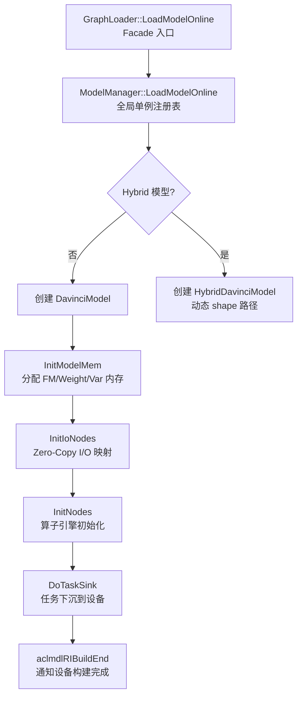
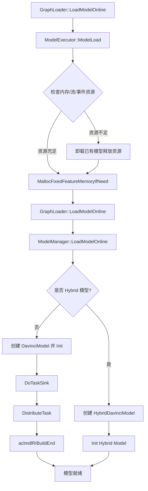
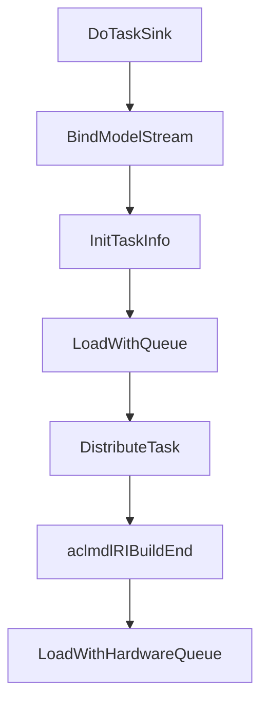
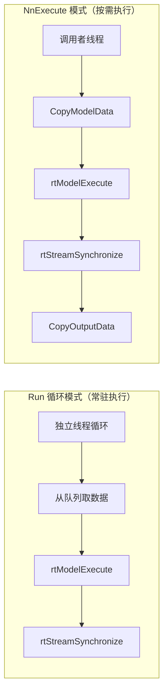
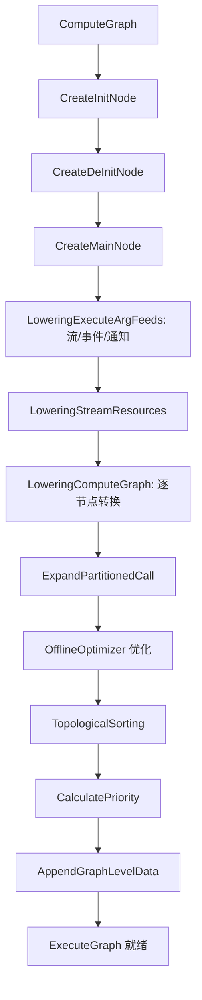
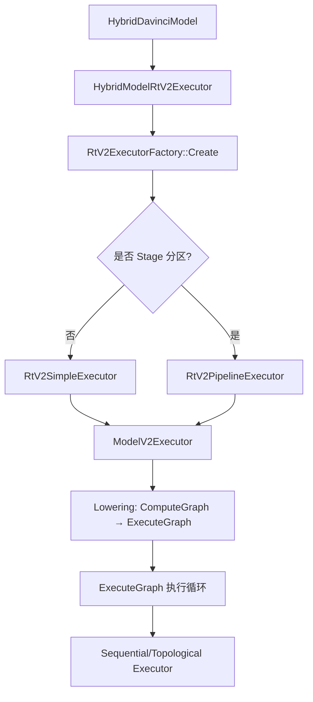
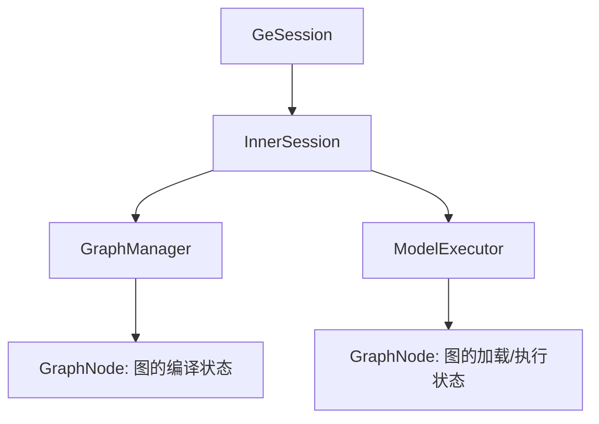

# 运行时执行系统——从 OM 文件到硅片计算的桥梁

> 介绍 GE 运行时如何完成从"模型加载"到"任务下沉"再到"结果回传"的完整执行闭环。

---

## 1. 全局架构：双版本并存的设计

GE 运行时同时维护 v1 和 v2 两套执行架构，这是一种有意识的演进策略。

### 1.1 v1 架构：静态 shape 执行器

v1 是当前的生产主力，承担着静态 shape 模型加载与执行职责。其核心目录结构为：

```
runtime/v1/
├── graph/
│   ├── load/          # 模型加载入口
│   │   ├── graph_loader.cc       # 加载门面（Facade 模式）
│   │   └── model_manager/        # 模型管理核心
│   │       ├── model_manager.cc  # 全局单例模型注册表
│   │       ├── davinci_model.cc  # 单个模型实例（核心）
│   │       └── task_info/        # 各类 Task 的分发实现
│   ├── execute/       # 模型执行入口
│   │   ├── graph_executor.cc     # 同步/异步执行门面
│   │   └── model_executor.cc     # Session 级执行协调器
│   └── manager/       # 内存管理
│       ├── mem_manager.cc
│       ├── caching_allocator.cc
│       └── session_scope_mem_allocator.cc
├── hybrid/            # 动态 shape 混合执行模式
├── single_op/         # 单算子执行模式
└── opskernel_executor/ # 算子内核执行器
```

### 1.2 v2 架构：动态 shape 执行器

v2 是下一代运行时，设计目标是通过 **Lowering**（将 ComputeGraph 转换为 ExecuteGraph）实现更精简的执行路径：

```
runtime/v2/
├── core/
│   ├── model_v2_executor.cc  # v2 模型执行器
│   ├── stream_executor.cc    # 流级执行器管理
│   └── executor/             # 多种执行策略
│       ├── sequential/       # 顺序执行（C 语言实现）
│       ├── topological/      # 拓扑排序执行
│       └── multi_thread_topological/  # 多线程拓扑执行
├── lowering/           # ComputeGraph → ExecuteGraph 转换
├── engine/             # 引擎适配层（aicore/aicpu/dvpp...）
└── kernel/             # 内核注册与执行
```

### 1.3 v1 与 v2 的架构差异

| 维度 | v1 | v2 |
|------|-----|-----|
| 核心抽象 | DavinciModel + TaskDef | ExecuteGraph + Node/Kernel |
| 执行模型 | rtModelExecute（硬件 Sink） | Host 顺序/拓扑执行 |
| 适用场景 | 静态 shape 模型（Sink 模式） | 动态 shape / 单算子 |
| 内存管理 | 分段式（FM/Weight/Var） | 统一 Allocator |
| 代码语言 | C++（重运行时） | C 核心 + C++ kernel（追求极致性能） |

v1 保障存量 OM 模型的兼容性，v2 为动态 shape 场景提供更灵活的基础设施。

---

## 2. v1 模型加载：从 OM 到设备的映射

### 2.1 加载流程总览



DavinciModel 是 v1 的核心，通过六阶段流水线完成内存映射、I/O 初始化、算子初始化和任务下沉。



### 2.2 GraphLoader：极简门面

`GraphLoader`（`runtime/v1/graph/load/graph_loader.cc`）是一个纯粹的 **Facade 模式**——所有方法都是静态方法，直接转发给 `ModelManager::GetInstance()`。这种设计有个好处：

**解耦加载协议与内部实现**：上层（Session、ACL）只需知道"加载一个模型"，不需要知道 ModelManager 的存在。

关键加载入口：
- `LoadModelOnline`：在线模式，直接从内存中的 GeRootModel 加载
- `LoadModelFromData`：离线模式，从序列化的 ModelData 加载
- `LoadModelWithQ`：队列模式，绑定输入/输出队列（用于数据流场景）

### 2.3 ModelManager：全局模型注册表

`ModelManager`（`runtime/v1/graph/load/model_manager/model_manager.h`）是一个 **进程级单例**，维护两个并行的模型注册表：

```
model_map_:       map<uint32_t, shared_ptr<DavinciModel>>     # 静态/已知 shape 模型
hybrid_model_map_: map<uint32_t, shared_ptr<HybridDavinciModel>> # 动态 shape 模型
```

两种模型的执行路径完全不同——DavinciModel 走 `rtModelExecute`（硬件 Sink），HybridDavinciModel 走 Host 端的子图调度。分开存储使每种路径都可以做到零开销抽象。

ModelManager 的职责：
- **AICPU Kernel 生命周期管理**：加载/卸载自定义 AICPU SO 库
- **权重共享**：通过 `weights_mem_ids_to_addr_info_` 支持多模型共享同一份权重内存
- **Session 绑定**：`sess_id_to_device_ids_` 跟踪 Session 与设备的映射关系
- **资源回收**：在模型卸载时清理所有运行时资源

### 2.4 DavinciModel：模型的运行时化身

`DavinciModel`（`runtime/v1/graph/load/model_manager/davinci_model.h`）是 v1 运行时的**绝对核心**——它将编译产物（GeModel）转化为可执行状态，并管理整个执行生命周期。

#### 2.4.1 初始化流程

DavinciModel 的 Init 过程是一个精心编排的 **六阶段流水线**：

```
InitModelMem → InitIoNodes → TransAllVarData → InitNodes → DoTaskSink → ...
```

**阶段一：InitModelMem** —— 内存映射

GE 有三种设备内存需要管理：
- **Feature Map 内存**（`mem_base_`）：算子输入/输出的工作区，对应编译期计算的 `runtime_param_.mem_size`
- **权重内存**（`weights_mem_base_`）：模型参数（Constant、Variable 的初始值）
- **变量内存**（`var_mem_base_`）：训练场景下的可变参数

内存来源有两种：
1. GE 自行分配（`MallocFeatureMapMem` → `aclrtMalloc`）
2. 外部提供（用户通过 `SetFeatureMemoryBase` 设定）

在多模型共部署场景下，用户可能希望统一管理设备内存，避免 GE 内部分配导致的内存碎片化。

**阶段二：InitIoNodes** —— I/O 节点初始化

遍历 Data 和 NetOutput 节点，建立输入/输出的地址映射。核心是 **Zero-Copy** 机制：

```
用户 Tensor 地址 → ZeroCopyOffset → 模型内部 Args 地址
```

Zero-Copy 通过直接将用户 Tensor 地址写入模型内部的 Args 表，消除了输入/输出数据的额外拷贝。

**阶段三：InitNodes** —— 算子节点初始化

对每个节点执行特定引擎的初始化：
- TBE 算子：注册 Kernel Handle（`InitTbeHandle`）
- HCCL 算子：收集通信流信息
- LabelSet/StreamSwitch：控制流硬件资源分配

**阶段四：DoTaskSink** —— 任务下沉（核心！）

这是 Sink 模式的核心实现：



1. **BindModelStream**：将所有逻辑流绑定到 rtModel 句柄。在昇腾硬件上，一个 rtModel 包含多个 rtStream，每个 Stream 上的 Task 可以并行执行。
2. **InitTaskInfo + DistributeTask**：遍历 ModelTaskDef 中的所有 TaskDef（Kernel、Hccl、FftsPlus 等），为每个 Task 创建对应的 TaskInfo 对象并调用 `Distribute()` 下发到设备。
3. **aclmdlRIBuildEnd**：通知底层运行时"模型构建完毕"，此后模型可以被 `rtModelExecute` 执行。

TaskSink 将所有 Task 预加载到设备，Host 只需一次 `rtModelExecute` 调用。对于有上千个算子的模型，这避免了 Host 调度成为瓶颈。

---

## 3. v1 模型执行：Sink 模式的两种触发方式

Sink 模式是 GE 的核心运行时优化机制。

```
传统 Host 调度: Host 逐算子下发 → Device 执行 → Host 下发下一个 → ...（N 次交互）
Sink 模式:      Host 一次 launch → Device 自主执行所有 Task（1 次交互）
```

GE 的 TaskSink 在编译期将 Task 序列化到 OM 文件中，运行时只需一次调用即可触发设备端全部 Task 执行。

### 3.1 两种执行方式

GE v1 的 Sink 模式支持两种触发方式，对应不同的使用场景：



### 3.2 Run 循环模式：独立线程常驻执行

`DavinciModel::Run()` 在独立线程中循环执行：

```
循环 {
    1. 从 DataInputer 队列中取出输入数据
    2. HandleInputData: 将输入地址写入模型的 Args 表
    3. rtModelExecute: 一次调用，触发设备端全部 Task 的执行
    4. rtStreamSynchronizeWithTimeout: 等待设备完成
    5. AssembleListenerOutput: 组装输出
    6. 回调通知完成
}
```

**关键设计决策**：

- **独立线程**：`ModelRunStart()` 创建一个专用线程执行 Run 循环。模型是"常驻"的——加载后持续接收数据并执行，直到 `ModelRunStop()`。线程与 DataInputer 队列配合，实现了生产者-消费者模式。

- **超时机制**：`rtStreamSynchronizeWithTimeout` 支持配置超时时间。超时后会调用 `aclmdlRIAbort` 中止模型执行，避免设备死锁。

- **错误传播**：设备端错误通过 `rtStreamSynchronizeWithTimeout` 的返回值传播到 Host。特殊的返回码如 `kSinkModelEndOfSequence`（序列结束）和 `kSinkModelAbortNormal`（正常中止）有特定含义。

GE 的 TaskSink 在编译期就已经将 Task 序列化到 OM 文件中，运行时通过 `rtModelExecute` 一次调用即可触发设备端全部 Task 的执行。

### 3.3 NnExecute 模式：调用者线程按需执行

`DavinciModel::NnExecute()` 是调用者线程主动触发的执行方式，每次推理由调用方同步或异步发起：

```
NnExecute(stream, async_mode, input_tensor, output_tensor):
    1. InitModelStream: 初始化或复用执行流
    2. CopyModelData: 将输入 Tensor 地址映射到模型 Args（Zero-Copy）或拷贝
    3. rtModelExecute: 下发模型执行
    4. rtStreamSynchronizeWithTimeout: 等待完成（如果非异步）
    5. CopyOutputData: 从模型内部地址拷贝输出到用户 Tensor
    6. UpdateOutputTensorShape: 如果是动态 shape，更新输出 shape
```

当使用 forbidden 流且设置了超时时间时，会调用 `rtModelExecuteSync` 接口，其内部会做流同步，超时会 abort model。

Run 循环模式 vs NnExecute 模式的差异：

| 维度 | Run 循环模式 | NnExecute 模式 |
|------|----------|-----------|
| 触发方式 | 独立线程循环，从队列取数据 | 调用者线程主动调用 |
| 线程模型 | 独立线程 | 调用者线程 |
| 数据拷贝 | 通过 DataInputer 队列传递 | CopyModelData + CopyOutputData |
| 适用场景 | 高吞吐推理服务 | 交互式推理/小批量 |

两种方式的底层执行都依赖 `rtModelExecute`，属于 Sink 模式的不同使用形态。

### 3.4 API 入口与内部执行函数的对应关系

外部 API 通过不同路径最终到达 `Run()` 或 `NnExecute()`：

```
┌──────────────────────────────────────────────────────────────┐
│                        API 入口层                             │
├────────────────────┬─────────────────────────────────────────┤
│  ACL 层            │  GE Session 层                          │
│  aclmdlExecuteV2   │  GeSession::RunGraph                    │
│  aclmdlExecuteAsyncV2 │ GeSession::RunGraphAsync             │
│                    │  GeSession::RunGraphAsyncWithStream     │
└─────────┬──────────┴──────────────┬──────────────────────────┘
          │                         │
          ▼                         ▼
    NnExecute()              Run() 或 NnExecute()
   (调用者线程)              (取决于执行路径)
```

**走向 `NnExecute()` 的入口**：

| API | 调用链 | 说明 |
|-----|--------|------|
| `aclmdlExecuteV2` | `GeExecutor::ExecModel` → `GraphLoader::ExecuteModel` → `ModelManager::ExecuteModel` → `NnExecute` | 同步执行，调用者线程阻塞等待 |
| `aclmdlExecuteAsyncV2` | `GeExecutor::ExecModel(async_mode=true)` → `ModelManager::ExecuteModel` → `NnExecute(async_mode=true)` | 异步执行 |
| `GeSession::RunGraph` | `GraphManager::RunGraph` → `ModelExecutor::RunGraph` → `GraphExecutor::ExecuteGraph` → `ModelManager::syncExecuteModel` → `NnExecute` | **注意**：同步路径实际走 NnExecute，而非 Run |
| `GeSession::RunGraphAsyncWithStream` | `ModelExecutor::ExecuteGraphWithStream` → `ModelManager::ExecuteModelWithStreamAsync` → `NnExecute` | 带指定 Stream 的异步执行 |

**走向 `Run()` 的入口**：

| API | 调用链 | 说明 |
|-----|--------|------|
| `GeSession::RunGraphAsync` | `GraphManager::RunGraphAsync` → 队列推送 → `ModelExecutor::RunThread` → `GraphExecutor::ExecuteGraphAsync` → `ModelManager::DataInputTensor` → `model->Push(args)` → `data_inputer_` 队列 → `Run()` 从队列 Pop 执行 | 唯一真正走 Run 循环的入口 |

一个值得注意的设计细节：**`GeSession::RunGraph` 虽然名称暗示"运行图"，但实际走的是 `NnExecute` 而非 `Run()` 循环**。真正通过 `data_inputer_` 队列驱动 `Run()` 后台线程的只有 `GeSession::RunGraphAsync`。

### 3.5 GraphExecutor 与 ModelExecutor 的分工

`GraphExecutor`（`runtime/v1/graph/execute/graph_executor.cc`）和 `ModelExecutor`（`runtime/v1/graph/execute/model_executor.cc`）构成了执行层的双层抽象：

**GraphExecutor** —— 纯粹的执行代理：
- 所有方法都是静态或 const 方法
- 不持有状态，直接转发到 `ModelManager`
- 职责：同步执行（`ExecuteGraph`）、异步执行（`ExecuteGraphAsync`）、流级执行（`ExecuteGraphWithStream`）

**ModelExecutor** —— Session 级的执行协调器：
- 继承自 `Executor` 基类
- 持有 `GraphNode` 注册表（`graph_nodes_`）
- 管理资源回收（内存、流、事件）
- 支持异步执行线程（`RunThread` + `run_args_q_`）

ModelExecutor 需要处理"加载决策"——在资源不足时，需要卸载已有模型腾出空间。这个逻辑与纯执行逻辑解耦，使得 GraphExecutor 可以专注于执行路径。

#### 3.5.1 资源回收策略

`ModelExecutor::CheckAndReleaseMemory` 展示了一种**优雅降级**策略：

```
1. 检查空闲内存是否足够加载新模型
2. 如果不够，遍历所有已加载的模型
3. 对每个模型检查是否包含 HCCL Task（通信算子不可卸载）
4. 如果不包含，卸载该模型释放资源
5. 重新检查空闲内存
6. 如果仍不够，继续卸载下一个模型
```

同样的逻辑也用于流（`CheckAndReleaseStream`）和事件（`CheckAndReleaseEvent`）资源的回收。这种设计确保了在设备资源受限的情况下，系统仍然能够通过"以旧换新"的方式运行新模型。

HCCL（Huawei Collective Communication Library）涉及跨设备通信，卸载会破坏通信拓扑的完整性。这是分布式训练场景下的重要约束。

---

## 4. v2 架构：基于 Lowering 的新一代运行时

### 4.1 设计哲学：编译即执行准备

v2 的核心思想是 **Lowering**——将高层 ComputeGraph 转换为底层 ExecuteGraph，使得运行时只需要一个极其简单的执行循环。

### 4.2 Lowering：从 ComputeGraph 到 ExecuteGraph

`GraphConverter::ConvertComputeGraphToExecuteGraph`（`runtime/v2/lowering/graph_converter.cc`）是 v2 的核心转换流程：



**Lowering 的核心步骤**：

1. **Init Graph 生成**：将所有初始化操作（常量加载、流分配、内存分配器创建）提取到一个独立的 Init 子图中。
2. **Main Graph 生成**：对每个 ComputeGraph 节点，查找对应的 `NodeConverter`（通过 `NodeConverterRegistry`），调用其 lowering 函数生成一个或多个 ExecuteGraph 节点。
3. **事件同步**：`LoweringEventSync` 处理跨流的 Send/Wait 事件同步。
4. **优化**：`OfflineOptimizer` 对生成的 ExecuteGraph 进行优化（如常量折叠、死代码消除、解除符合条件的 Launch-to-Free 控制依赖）。`CopyFlowLaunchFuse` 始终注册，单线程路径保留其生成的 Legacy `CopyFlowLaunch`；仅当 `IsEnableRt2MultiThread()` 为 `true` 时，才依次注册 `SplitMixedLaunchMemory` 和 `RemoveLaunchFreeEdge`。动态 shape 多流会强制该判断返回 `false`，不执行拆分和关系优化，并保留原 Launch-to-Free 边。

v1 在运行时通过 `DistributeTask` 将 Task 逐个下发到设备，而 v2 在编译期就已经将 ComputeGraph 转换为可以直接执行的 ExecuteGraph。运行时不需要任何"翻译"步骤。

### 4.3 ModelV2Executor：三阶段生命周期

`ModelV2Executor`（`runtime/v2/core/model_v2_executor.cc`）管理三个子图的生命周期：

```
Init Graph → Main Graph → DeInit Graph
```

**Load 阶段**：
1. 加载并执行 Init Graph（内存分配、流分配、常量初始化）
2. 卸载 Init Graph
3. 加载 Main Graph（不执行，仅准备执行数据）

**Execute 阶段**：
1. 指定输入/输出 Tensor
2. 指定运行时参数（流、事件、通知、内存分配器）
3. 执行 Main Graph

**UnLoad 阶段**：
1. 卸载 Main Graph
2. 加载并执行 DeInit Graph（资源清理）
3. 卸载 DeInit Graph

v2 的执行器是纯 C 实现的顺序执行循环，无法处理"分配内存"这种需要与运行时 API 交互的操作。将这些操作提取到 Init/DeInit 子图中，可以保持 Main Graph 的纯粹性——Main Graph 只包含纯计算节点。

### 4.4 Sequential Executor：极致简洁的执行引擎

v2 的核心执行引擎（`runtime/v2/core/executor/sequential/executor/sequential_executor.c`）采用极简的执行循环：

```c
KernelStatus SequentialExecute(void *arg) {
    SequentialExecutionData *execution_data = (SequentialExecutionData *)arg;
    for (size_t i = 0U; i < execution_data->node_num; ++i) {
        Node *node = execution_data->nodes[i];
        KernelStatus ret = node->func(&(node->context));
        if (ret != kStatusSuccess) { return ret; }
    }
    return kStatusSuccess;
}
```

**使用 C 实现的原因**：
1. **无运行时开销**：C 语言没有异常处理、RTTI、虚函数表等隐式开销。这个循环在每次推理中执行成千上万次，每纳秒都 counts。
2. **可移植性**：C 代码可以直接在设备端（AICORE 的 DSP）执行，为未来的设备端调度留下空间。

**`SequentialExecutionData`** 的结构极其精简：
```c
typedef struct {
    size_t node_num;
    Node **nodes;          // 节点数组（预排序）
    size_t input_num;
    AsyncAnyValue **input_values;   // 输入值（由外部设定）
    size_t output_num;
    AsyncAnyValue **output_values;  // 输出值（由外部设定）
} SequentialExecutionData;
```

每个 Node 只包含：节点 ID、执行函数指针、运行上下文。这种扁平化设计消除了虚函数调用、指针追逐等开销。

### 4.5 StreamExecutor：多流并发管理

`StreamExecutor`（`runtime/v2/core/stream_executor.cc`）为每个 ACL Stream 创建独立的 ModelV2Executor 实例：

```
streams_to_executor_: map<aclrtStream, unique_ptr<ModelV2Executor>>
```

每个 Stream 一个 Executor 是因为在异步执行模式下，多个 Stream 可能并发执行同一个模型的不同推理请求。每个 Executor 维护自己的执行状态（输入/输出绑定、迭代计数等），互不干扰。

这与昇腾 Stream 的设计理念一致——Stream 是设备端操作的有序队列，不同 Stream 之间可以并行。

### 4.6 多线程内存回收与精确 Launch 提交关系

RT2 多线程拓扑执行器会将内存类 Kernel 与 Launch 类 Kernel 分发到不同 worker group。stream 同步只能覆盖已经完成 Host 侧提交的异步任务，因此删除 Launch-to-Free 边后，需要同时建立清晰的结果所有权和精确的 Free-to-Launch 运行时保护。

#### 4.6.1 Copy 拆分与提交顺序

`OfflineOptimizer` 始终运行 `CopyFlowLaunchFuse`；仅 RT2 多线程单流模式继续运行 `SplitMixedLaunchMemory -> RemoveLaunchFreeEdge`。单线程模式保留 `CopyH2D`、`MakeSureTensorAtDevice` 和 Legacy `CopyFlowLaunch` 构图；`ENABLE_DYNAMIC_SHAPE_MULTI_STREAM=1` 时 `IsEnableRt2MultiThread()` 返回 `false`，既不拆分也不创建 Free-to-Launch 关系，原 Launch-to-Free 边保持不变。

H2D 拆分拓扑为：

```text
CalcDeviceCopySizes -> AllocMemHbm -> ShareH2DCopyResult -> LaunchH2DCopy
```

`ShareH2DCopyResult` 在 memory worker 上产生 owning/shared `GertTensorData`，其输出供 Consumer 和 Free 使用；output-free `LaunchH2DCopy` 只提交必要的异步 memcpy。全局语义上的 Launch（包括 HCOM）或注册为 `kKernelLaunch` 的直接 Consumer 通过控制边等待 Copy Launch。经 `BuildRefTensor` 间接消费时，`BuildRefTensor` 和 ACLNN `ExecuteOpPrepare` 不等待 Copy Launch，其后的 ACLNN/CustomOp 语义 Launch 或 `kKernelLaunch` Consumer 等待，并在关系删除前控制对应 Free。

CopyFlow 拆分拓扑为：

```text
CalcCopyFlowAllocSizes -> AllocCopyFlowHbm -> PrepareCopyFlowResult -> LaunchCopyFlowH2D
```

`PrepareCopyFlowResult` 在 memory worker 上拥有全部逐输出结果并完成 merged-copy 信息、host 参数和对齐处理，不提交 memcpy；output-free `LaunchCopyFlowH2D` 只为独立分配且非零的 H2D 输入提交 memcpy。四个节点使用相同的非零静态 `copy_flow_count`，运行时输入数、输出数、allocated-address 数以及输入索引 CVV 外层基数必须一致。Consumer、Free 和 Guarder 从 Prepare 取数，Guarder 仅按当前 Consumer Launch 的显式 source-output 映射复制，原输出控制边从 Copy Launch 链尾发出。

当源节点存在 `kComputeNodeIndex` 时，`LaunchH2DCopy` 和 `LaunchCopyFlowH2D` 继承该索引。它们不属于 `IsLaunchNode` 定义的计算 Launch，但会通过注册的 `kKernelLaunch` 被 `IsLaunchOrHasSubGraphNode` 识别，参与 priority 计算和 strict-order 保序。DataDump 直接复用 `IsLaunchNode`，因此会自然跳过这两类内部 helper，避免同一计算算子被重复推进；真实 Consumer Launch 仍是 dump 边界。

#### 4.6.2 Launch-to-Free 删除与 ExecutionData

`RemoveLaunchFreeEdge` 按 Free 独立判定资格：目标必须是有 hold-address 变体的设备 Free，`ReleaseResourceIndex` 指向的直接 producer 必须位于非 Host 内存路径并注册为 `kKernelUseMemory`。对同一 Launch，Pass 先补齐全部 eligible producer 与全部 eligible Free 的笛卡尔积顺序；已有数据或控制依赖不重复添加。随后按 owner graph 记录并去重精确 `(Free*, Launch*)` 关系，替换 hold-address Free，最后才删除目标边。

Host、normal、launch、未注册或缺失 producer，以及没有 hold-address 变体的 `FreeTensorMemory` 均保持原 Free 类型和 Launch-to-Free 边。既有 `EnsureNodeExeInOrderInSubgraph`、`IsCopyAsyncNode`、zero-copy 和地址复用保序语义不变。

`MultiThreadExecutionDataBuilder` 在最终执行节点映射确定后，将各 owner graph 的 FastNode 关系转换为按 Free ID 索引、Launch ID 有序且去重的 CSR。嵌套 owner graph 从实际 mapped nodes 推导，不遍历并混入未映射的兄弟子图。offsets/Launch-ID 连续数组由 `MultiThreadResourceGuard` 持有；构建和 `TaskScheduler::Prepare` 会校验 owner、映射节点、hold-address Free/Launch 类型、ID 范围、节点数、offset 单调性和关系基数，执行期查询不扫描图且不分配内存。

#### 4.6.3 Scheduler 与 Allocator

每次 `Schedule` 使用隔离的 execution epoch，并维护逐节点 `launch_submitted_gen`、`free_executed_gen`、`required_launch_gen`、relation-Launch membership、`unmet_launch_count` 以及显式 abort 状态和原始返回值。Free 仅在 Kernel 成功后激活其 CSR 中的要求；关系 Launch 仅在自身 Kernel 成功完成 Host 提交后推进 generation。多个 Free 引用同一 Launch occurrence 时只计一个 unmet Launch。失败或 EOS 节点不推进 generation，scheduler 保存原状态并唤醒全部等待者；下一次 `Schedule` 原地重置关系状态。

旧的批次 ready Launch 计数、TLS 批次阈值、混合 Kernel 执行前屏障和伪造完成值均已删除。`CachingMemAllocator` 与 `L2MemPool` 只在即将进行物理 stream 同步/回收时等待已成功执行 Free 激活的要求；成功 Malloc fast path 不调用 scheduler，未执行 Free 和无关 Launch 不会阻塞。回收顺序保持：`exact wait -> stream sync -> recycle -> retry`。

多线程执行器的总线程数为 3 时（Hybrid RT2 路径通常由 `MAX_RUNTIME_CORE_NUMBER=3` 配置），`AllocHostCpuOutputMemory`、`SplitDataTensor`、`IdentityAddr`、`IdentityShapeAndAddr` 和 `AccessMemCrossStream` 保留注册的 `kKernelUseMemory` 分类，并在唯一的 MEMORY worker 上执行。`AccessMemCrossStream` 的 `ShareFrom`/`WanderFrom` 会修改共享 TensorData、引用计数或跨流 MIF 状态，必须与其它共享内存状态变更串行化。由于其 placement 在运行时才确定，`RemoveLaunchFreeEdge` 不将它作为可删边的直接 producer，保留原 Launch-to-Free 边。`BuildTensor`、`BuildTensorStorage` 和 `BuildTensorPureShape` 是仅有的 NORMAL worker 例外，从而保留既有三线程流水优化。Allocator 热路径不增加锁；执行图调度串行化 Host allocator 与 wrapper pool 的状态变更，以牺牲这些状态变更的并行度换取无锁热路径和安全的生命周期转换。

#### 4.6.4 性能数据与活性限制

现有测量来自保守的 **O0/GCOV + ASan/LSan stub build**，不是 Release 生产延迟：成功 Malloc 的 paired delta 中位数约 `+0.243%`，处于噪声范围；无关节点事件约 `33 ns`，立即返回的精确等待约 `44 ns`，一组 Free 激活加匹配 Launch 提交约 `146 ns`。100,000 节点、1,000,000 关系的 `Prepare` 中位数为 `6.313 ms`，结构内存为 `11,300,008 B`；无任务测量中关系状态数组 capacity 未增长，调用序列前后无净 live allocation。这些数据既不是 Release 指标，也不能证明调度活性。

**当前限制：唯一 memory worker 场景的活性尚未解决。** 如果某个已激活的 Launch 仍依赖未完成的 memory-worker 前驱，而该前驱排在一个因 allocator 精确等待而阻塞的 memory task 之后，仍可能形成闭环。任务 1.1、1.2、4.6、7.4 由用户选择延期；当前实现不保证该场景活性。该场景进入生产验收前，必须增加保守证明门禁以对无法证明安全的关系保留原边，或改为不占用唯一 memory worker 的非阻塞 continuation。

---

## 5. Hybrid 执行：动态 Shape 的解决方案

### 5.1 为什么需要 Hybrid？

静态 shape 模型的 TaskSink 路径虽然高效，但面对动态 shape（如 NLP 中的变长序列）就无能为力——因为不同的 shape 对应不同的 Task 序列和内存布局。

`HybridDavinciModel`（`runtime/v1/hybrid/hybrid_davinci_model.h`）是动态 shape 场景的执行入口。它的存在由 `ModelManager::IsNeedHybridLoad` 判断——当 `GeRootModel` 被标记为动态 shape 时，走 Hybrid 路径。

### 5.2 Hybrid 执行架构

Hybrid 执行经历了从 v1 到 v2 的演进。v1 的 `HybridModelRtV1Executor` 基于 `SubgraphExecutor`、`NodeDoneManager` 和 `ShapeInferenceEngine` 构建，采用 Host 端逐算子调度的方式，该路径已不再演进。当前 Hybrid 场景的主力执行器是 `HybridModelRtV2Executor`，它复用了 v2 运行时的 `ExecuteGraph` 基础设施。



**HybridModelRtV2Executor 的执行流程**：

1. **初始化**：通过 `RtV2ExecutorFactory::Create` 创建执行器。如果图包含 `PartitionedCall` 节点（Stage 分区），则创建 `RtV2PipelineExecutor`；否则创建 `RtV2SimpleExecutor`。
2. **Lowering**：将 `GeRootModel` 中的 `ComputeGraph` 通过 `ModelConverter` 转换为 `ExecuteGraph`。这一步在编译期已完成，运行时直接加载。
3. **执行**：`ModelV2Executor` 管理 Init/Main/DeInit 三个子图的生命周期，Main Graph 通过 `SequentialExecutor` 或 `TopologicalExecutor` 执行。

与 v1 的逐算子 Host 调度不同，v2 的 Hybrid 执行器将整图转换为 `ExecuteGraph` 后，运行时只需执行极简的节点循环，大幅降低了 Host 侧的调度开销。

---

## 6. 单算子执行模式

### 6.1 设计背景

单算子模式最初是为了支持 PyTorch 在昇腾设备上运行而引入的。PyTorch 早期采用动态图执行模型，每次只执行单个算子。为了让 PyTorch 能够利用 GE 的编译能力，GE 引入了单算子执行模式：当 PyTorch 调用 `aclopCompileAndExecuteV2` 接口时，GE 会为这个单算子构造 Data 和 NetOutput 节点，组成一张最小化的图，然后进行编译和执行。

### 6.2 当前状态

目前 PyTorch 主要使用 `aclnn` 作为单算子执行路径，只有不支持 `aclnn` 的算子才会走 `aclop` 这条线。相应地，GE 中的 `single_op` 模块也已不再演进。

`SingleOp`（`runtime/v1/single_op/single_op.h`）和 `DynamicSingleOp` 提供了算子级执行能力：

- **SingleOp**：固定 shape 的单算子执行。初始化时确定 shape，后续执行无需重新编译。
- **DynamicSingleOp**：动态 shape 的单算子执行。每次执行可能传入不同的 shape。

---

## 7. Session 管理：模型的生命周期上下文

### 7.1 Session 层次结构



### 7.2 InnerSession：Session 的核心实现

`InnerSession`（`api/session/session/inner_session.h`）是每个用户 Session 的完整上下文，包含：

- **GraphManager**：管理图的编译（AddGraph → BuildGraph → CompileGraph）
- **ModelExecutor**：管理图的加载和执行（LoadGraph → RunGraph）
- **Session ID**：全局唯一标识，用于变量管理、内存隔离

**InnerSession 的生命周期**：

```
Initialize() → AddGraph() → BuildGraph() / CompileGraph() → RunGraph() → Finalize()
```

**关键设计决策**：

1. **编译与执行分离**：`BuildGraph` 只编译不加载，`RunGraph` 会触发首次加载和执行。这种延迟加载策略避免了不必要的设备资源占用。

2. **外部内存管理**：`SetGraphConstMemoryBase` / `UpdateGraphFeatureMemoryBase` 允许用户自行管理设备内存，GE 只负责在用户提供的内存上构建模型。

3. **ForkGraph**（`inner_session.h`）：支持 fork 一个已编译的图，fork 出的图共享编译产物但可以独立加载和执行。这是多实例并发推理的关键能力——避免重复编译。

---

## 8. 内存管理：分段式策略

### 8.1 内存分区模型

GE 将设备内存分为多个逻辑段：

```
┌─────────────────────────────────────────────────────┐
│                   Device Memory                      │
├──────────┬──────────────┬──────────┬────────────────┤
│ Weights  │  Feature Map │ Variable │  Zero-Copy IO  │
│ (固定)    │  (算子激活内存)│ (训练)    │  (模型输入输出)  │
├──────────┼──────────────┼──────────┴────────────────┤
│ Fixed FM │ Refreshable FM│                           │
│ (不可刷新)│  (可刷新)      │                           │
└──────────┴──────────────┴───────────────────────────┘
```
---

## 9. 多流并行

GE 的多流并行算法基于图的拓扑结构和引擎类型：
1. 为每个节点分配执行引擎
2. 基于拓扑和引擎为每个节点分配 Stream
3. 不同 Stream 间插入同步保证执行时序

三种并行场景：
- **计算与通信并行**：AllReduce 和 Convolution 无依赖时可并发
- **不同引擎并行**：AI Core 和 DVPP 可同时工作
- **同引擎内并行**：一个算子无法占满引擎时，不同拓扑集合可并发

---

## 10. 运行时设计特点

| 维度 | GE Runtime v1 | GE Runtime v2 |
|------|--------------|--------------|
| 执行模型 | TaskSink + Host调度 | Host顺序/拓扑执行 |
| 动态 Shape | Hybrid 子图调度（不再演进） | ExecuteGraph 节点级 |
| 内存管理 | 分段式 + Zero-Copy | 统一 Allocator |
| 多流并行 | 多 rtStream 绑定 rtModel | 多 Executor 实例 |
| 加载/执行分离 | 是（Load + NnExecute） | 是（Load + Execute） |

**GE 运行时的独特之处**：
1. **TaskSink 模式**：将整个执行序列预加载到设备，Host 零调度开销。这是昇腾硬件的特色能力——设备端的 Task 调度器可以自主执行预加载的 Task 序列。
2. **双版本运行时**：v1 追求极致的静态性能（Sink 模式），v2 追求灵活性和可扩展性（Lowering + 纯 C 执行器）。
3. **多引擎异构执行**：AICore、AICPU、DVPP、HCCE、HostCPU 等引擎在同一个运行时中协同工作。

---

> 运行时系统将编译器产出的静态执行计划映射到物理设备，在 Sink 模式下实现了极致的执行效率，但在动态 shape 场景下仍需承受 Host 调度的开销——这自然引出对**任务序列优化、流并行调度、内存复用**等关键优化技术的需求。
